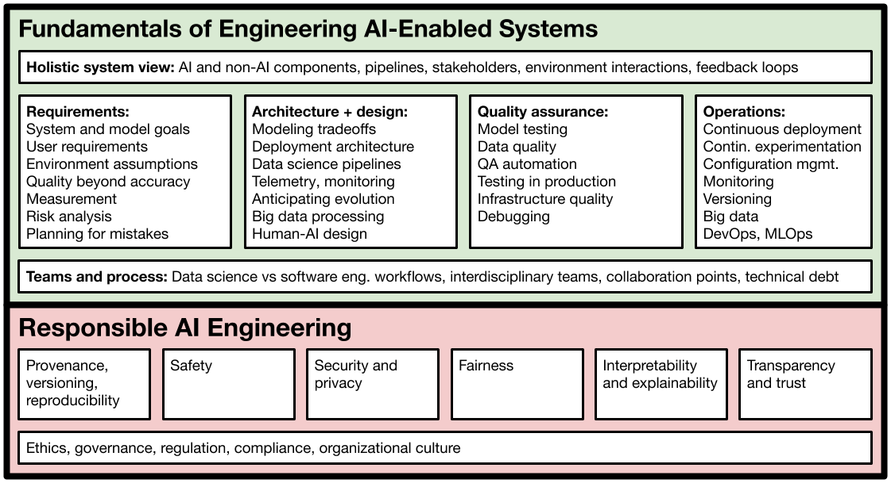

# Machine Learning in Production / AI Engineering (17-445/17-645/17-745/11-695)

### Spring 2021

*Formerly **Software Engineering for AI-Enabled Systems (SE4AI)**, CMU course that covers how to build, deploy, assure, and maintain applications with machine-learned models. Covers also **responsible AI** (safety, security, fairness, explainability) and **MLOps**. The course is crosslisted both as **Machine Learning in Production** and **AI Engineering**. For earlier offerings see websites for [Fall 2019](https://ckaestne.github.io/seai/F2019), [Summer 2020](https://ckaestne.github.io/seai/S2020), and [Fall 2020](https://ckaestne.github.io/seai/F2020/). This Spring 2021 offering is designed for students with some data science experience (e.g., has taken a machine learning course, has used sklearn) and basic programming skills, but will not expect a software engineering background.*

For researchers, educators, or others interested in this topic, we share all course material, including slides and assignments, under a creative commons license on GitHub (https://github.com/ckaestne/seai/) and have recently published an article describing the rationale and the design of this course: [Teaching Software Engineering for AI-Enabled Systems](https://arxiv.org/abs/2001.06691). Video recordings of the Summer 2020 offering are online on the [course page](https://ckaestne.github.io/seai/S2020/#course-content). We would be happy to see this course or a similar version taught somewhere else. See also an [annotated bibliography](https://github.com/ckaestne/seaibib) on the topic.

## Course Description

This is a course for those who want to build **applications** and **products** with **machine learning**. Assuming we can learn a model to make predictions, what does it take to turn the model into a product and actually deploy it, build a business, and successfully operate and maintain it? 

The course is designed to establish a working relationship between **software engineers** and **data scientists**: both contribute to building AI-enabled systems but have different expertise and focuses. To work together they need a mutual understanding of their roles, tasks, concerns, and goals and build a working relationship. This course is aimed at **software engineers** who want to build robust and responsible systems meeting the specific challenges of working with AI components and at **data scientists** who want to understand the requirements of the model for production use and want to facilitate getting a prototype model into production; it facilitates communication and collaboration between both roles. *The course focuses on all the steps needed to turn a model into a production system in a responsible and reliable manner.*

It covers topics such as:

* **How to design for wrong predictions the model may make?** How to assure *safety* and *security* despite possible mistakes? How to design the *user interface* and the entire system to operate in the real world?
* **How to reliably deploy and update models in production?** How can we *test* the entire machine learning pipeline? How can *MLOps* tools help to automate and scale the deployment process? How can we *experiment in production* (A/B testing, canary releases)? How do we detect *data quality* issues,  *concept drift*, and *feedback loops* in production?
* **How do we scale production ML systems?** How do we design a system to process huge amounts of training data, telemetry data, and user requests? Should we use stream processing, batch processing, lambda architecture, or data lakes?
* **How to we test and debug production ML systems?** How can we *evaluate* the quality of a model’s predictions in production? How can we *test* the entire AI-enabled system, not just the model? What lessons can we learn from *software testing*, *automated test case generation*, *simulation*, and *continuous integration* for testing for production machine learning?
* **Which qualities matter beyond a model’s prediction accuracy?** How can we identify and measure important quality requirements, including *learning and inference latency, operating cost, scalability, explainablity, fairness, privacy, robustness*, and *safety*? Does the application need to be able to *operate offline* and how often do we need to update the models? How do we identify what’s important in a AI-enabled product in a production setting for a business? How do we resolve *conflicts* and *tradeoffs*?
* **How do we build effective interdisciplinary teams?** How can we bring data scientists, software engineers, UI designers, managers, domain experts, big data specialists, operators, legal council, and other roles together and develop a *shared understanding* and *team culture*?

**Examples and case studies** of ML-driven products we discuss include automated audio transcription; distributed detection of missing children on webcams and instant translation in augmented reality; cancer detection, fall detection, COVID diagnosis, and other smart medical and health services; automated slide layout in Powerpoint; semi-automated college admissions; inventory management; smart playlists and movie recommendations; ad fraud detection; delivery robots and smart driving features; and many others.

An extended group project focuses on building, deploying, evaluating, and maintaining a robust and scalable *movie recommendation service* under realistic  “production” conditions.

### Learning Outcomes

After taking this course, among others, students should be able to
* analyze tradeoffs for designing production systems with AI-components, analyzing various qualities beyond accuracy such as operation cost, latency, updateability, and explainability
* implement production-quality systems that are robust to mistakes of AI components
* design fault-tolerant and scalable data infrastructure for learning models, serving models, versioning, and experimentation
* ensure quality of the entire machine learning pipeline with test automation and other quality assurance techniques, including automated checks for data quality, data drift, feedback loops, and model quality
* build systems that can be tested in production and build deployment pipelines that allow careful rollouts and canary testing
* consider privacy, fairness, and security when building complex AI-enabled systems
* communicate effectively in interdisciplinary teams

In addition, students will gain familiarity with production-quality infrastructure tools, including stream processing with Apache Kafka, test automation with Jenkins, monitoring with Prometheus and Grafana, and deployment with Docker and various MLOps tools.

## Logistics and People

17-445/17-645/17-645/11-695, 12 Units

Open to undergraduate and graduate students meeting the prerequisites.

### Spring 2021

Designed for students with a data science background (see prerequisites below)

Lectures Monday/Wednesday 2:20-3:40pm, Eastern Time, on Zoom

Recitation Friday 9:50-11:10am, Eastern Time, on Zoom

Instructors: [Christian Kaestner](https://www.cs.cmu.edu/~ckaestne/) and [Eunsuk Kang](https://eskang.github.io/)

### Coordination

Unless you have questions to specific instructors, we prefer that you email us at se-ai@lists.andrew.cmu.edu, where you will reach the entire teaching staff of the course. We are happy to answer questions by email, over Slack, over Canvas, and will jump on a quick Zoom call if you ask us. We also always arrive 5 to 10 min early to class and stay longer for discussions and questions.

## Course content

The course content is evolving from semester to semester, though topics and assignments will be similar. See the [Fall 2019](https://ckaestne.github.io/seai/F2019), [Summer 2020](https://ckaestne.github.io/seai/S2020), and [Fall 2020](https://ckaestne.github.io/seai/F2020/#course-content) offerings for what we covered in the past or look at the list of topics and learning goals under [Learning Goals](https://github.com/ckaestne/seai/blob/S2021/learning_goals.md). Assignments this semester will likely be very similar to those the [Fall 2020 assignments](https://github.com/ckaestne/seai/blob/F2020/assignments/). Below is a table of a preliminary  schedule. This is subject to change and will be updated as the semester progresses, especially to help focus on requested topics or support learning.

[Schedule](https://github.com/ckaestne/seai/blob/S2021/schedule.md)

## Course Syllabus and Policies

The course uses Canvas and Gradescope for homework submission, grading, discussion, questions, announcements, and supplementary documents; slides will be posted here; Slack is used for communication around homeworks and projects; Github is used to coordinate group work. All public course material (assignments, slides, syllabus) can be found in the course’s [GitHub repository](https://github.com/ckaestne/seai/tree/S2021); all private material (announcements, grades, passwords) will be shared through Canvas.

**Prerequisites:** The course does not have formal prerequesites, but we describe background knowledge that will help you be successful in the course. Overall, we expect basic exposure to machine learning and basic programming skills, but do not require software engineering experience. 

Machine learning: We suggest that you have basic familiarity with the process of extracting features, building and evaluating models, and a basic understanding of how and when different kinds of learning techniques work. Familiarity with Python and Jupyter notebooks is helpful. Courses such as 10-301, 10-315, and 05-434 will prepare you well, but project experience or self-learning from books or online courses will likely be sufficient for our purposes. For example, we recommend the book [Hands-On Machine Learning](https://cmu.primo.exlibrisgroup.com/permalink/01CMU_INST/6lpsnm/alma991019665684604436) to get practical experience in building and evaluating models prior to taking this course. We have set up an anonymous *[prerequisite knowledge check](https://forms.gle/JcS61Uao7wHSFQen8)* as a Google Form, where we ask 10 questions on machine learning, which help you assess your background. This is set up as an ungraded quiz, where you can compare your knowledge against what we believe is useful for you to be successful in this course (click on *“view score”* after submitting your answer). The system will give specific pointers to readings and exercises that may help you fill gaps in background knowledge. 

Programming: The course has a substantial programming component, especially in the team project, so basic programming skills will be beneficial. We do not prescribe a programming language, but most student teams decide to work primarily in Python. For example, it would be useful to know how to *ssh* into a machine and how to install a Python package.

Software engineering: Many students will have some software engineering experience beyond basic programming skills from working in larger software teams or on larger software projects, for example experience with requirements engineering, software design, software testing, distributed systems, continuous deployment, or managing teams. No such experience is expected as a prerequisite; we will cover these topics in the course.

Email us (se-ai@lists.andrew.cmu.edu) if you would like to further talk to us about prerequisites.

**Remote teaching:** As per CMU decision, the Spring 2020 offering of this course will be taught remotely. While the instructors have experience teaching this course remotely in both summer and fall of 2020, we like to emphasize that *this is not a normal setting and we will try to be as accommodating as we can to different and difficult circumstances.* We will make an effort to be as inclusive and interactive as we can be and will support you in remote teamwork.

As other software engineering courses, in-class discussions (e.g., about tradeoffs, case studies, and policies) are an important part of the learning experience.  Therefore, we would like that all students make an effort to attend class “live” regularly, rather than relying on recordings. Students who cannot attend live, for example due to time zone challenges, should reach out to the course staff. We plan to schedule a weekly discussion and office hour meeting with those students, where we discuss course content in small groups.

For attending the lecture “live”, you will need a stable internet connection, a working audio setup, and a webcam. An external monitor is likely useful. The following format has worked well in the previous remote offerings:

- We ask students to attend class via Zoom “live” rather than relying on recordings where possible.
- We ask students to keep their camera on during class, because it provides a less anonymous and isolated experience and provides some feedback for the presenter. It is much easier and more natural to interact when the presenter can recognize nonverbal feedback, such as students nodding, looking confused, or raising their hand. You may use a virtual background for privacy if you wish.
- We ask students to be able to participate in in-class discussions and in-class exercises through audio and through chat messages – see also participation grading below. We suggest that you remain muted by default unless you are sharing with the class or your breakout group. Feel free to unmute yourself to speak or raise your hand (physically on camera or using the zoom feature) to coordinate among multiple speakers.
- We will have an open-book midterm during a lecture timeslot and project/homework presentations over Zoom.
- We promise to never use any proctoring or attention-checking tools. Live participation and turned-on cameras are there to create a better and more inclusive learning experience, not to spy on you or force you to pay attention.

We understand that this situation will not work equally for everybody. Not everybody will have a stable enough connection or a private setting to comfortably share their video. Not everybody will be able to attend every class session live. We understand these challenges and ask you to reach out to us if you need accommodations. We try to be as flexible as we can in this difficult situations, but would like to know about them.

All synchronous classes will be recorded via Zoom so that students in this course (and only students in this course) who cannot attend the lectures can watch the class sessions. Breakout rooms will not be recorded. We will make the recordings available on request to accommodate difficult situations. Please note that you are not allowed to share these recordings. This is to protect your FERPA rights and those of your fellow students. 

**Grading:** Evaluation will be based on the following distribution: 40% individual assignments, 30% group project, 10% midterm, 10% participation, 10% reading quizzes. No final exam.

We strive for providing clear specifications and clear point breakdowns for all homework to set clear expectations and taking the guessing out of homework. We often give you choices to self-direct your learning, deciding what to work on and how to address a problem (e.g., we never prescribe a programming language and often give choices to answer a subset of possible questions). Clear specifications and point breakdowns allow you to intentionally decide to skip parts of assignments with clear upfront consequences. All parts will be graded pass/fail, no partial credit. For opportunities to redo work, see *resubmissions* below.

For grading participation see below. Individual quizzes will be graded pass/fail for a good faith attempt at engaging with the material, see below.

We expect the grade boundaries between C+ and B- at 81% and between B+ and A- at 91%.

**Participation:** Design and engineering content requires active engagement with the material and discussions of judgment decisions on specific scenarios and cases. We strongly believe in in-class discussions and in-class exercises and want all students to participate, e.g., answering or asking questions in class through chat or audio, sharing own experiences, presenting results, or participating in in-class votes and surveys. We will give many opportunities for participation in every lecture and recitation. We take notes on participation throughout the semester and grade participation. Note that we do not consider mere passive attendance as participation, but only active engagement. We will provide feedback at mid-semester so you can check in on how you’re doing. Again, please talk to us if you need accommodations.

We assign participation grades as follows:

* 100%: Participates actively at least once in most lectures through chat or audio
* 100%: Participates actively in 25% of lectures and actively contributes to discussions in most recitations
* 90%: Participates actively at least once in over half of the lectures
* 70%: Participates actively at least once in 25% of the lectures
* 40%: Participates actively at least once in at least 3 lectures or recitations.
* 0%: No participation in the entire semester.

For students who cannot attend live lectures or recitations, we will provide alternative ways of participating. 

**Textbook and reading assignments:** We will be using Goeff Hulten's *"Building Intelligent Systems: A Guide to Machine Learning Engineering"* (ISBN: 1484234316) throughout much of the course. The library provides an [electronic copy](https://link-springer-com.proxy.library.cmu.edu/book/10.1007%2F978-1-4842-3432-7). In addition, we will provide additional supplementary readings, including blog posts and academic papers, throughout the semester.

We will assign readings for most classes and post a corresponding quiz on Canvas that is due before class. Each quiz contains an open ended question that relates to the reading. We encourage to discuss answers to reading quizzes in small groups and submit a joint answer. Reading quizzes are graded pass/fail for a good-faith effort to engage with the question. 

**Teamwork:** Teamwork is an essential part of this course and we will provide many additional opportunities to work with others to encourage interaction during the current pandemic. 

The course contains a multi-milestone group project  to be done in teams of 3-5 students. Teams will be assigned by the instructor. We will help teams throughout the semester and cover some specific content on teamwork as part of the course. Peer rating will be performed for team assignments with regard to team citizenship (i.e., being active and cooperative members), following the procedure from [this article](https://www.cs.tufts.edu/~nr/cs257/archive/teaching/barbara-oakley/JSCL-collaboration.pdf).

In addition, we will provide the option to work together with one other student on individual assignments and reading quizzes. Pairing will be announced by the instructors and shuffled regularly throughout the semester. This is optional, you may decide to work alone on individual assignments and reading quizzes.

**Late work policy and resubmissions:** We understand that studying during a pandemic is challenging and that some students have conflicting deadlines or are distracted by interviewing for jobs. We therefore build flexibility and a safety net directly into the rubric. If you need additional accommodations, please contact us.

In addition, we expect that the past/fail grading scheme without partial credit, may lead to harsh point deductions for missing parts of the requirements, so we provide a mechanism to resubmit work to regain lost points.

Every student receives *7 tokens* that they can spend throughout the semester in the following ways:

* For each token a student can submit a homework assignment 1 day late (with 7 tokens a student can submit multiple homeworks one day late each or a single homework up to 7 days late).
* For *three* tokens a student can improve or redo an individual homework assignment and resubmit. The earlier submission is discarded and the regraded assignment counts toward the final grade. Each homework can be resubmitted only once. Resubmissions can be made at any time in the semester up to the final project presentation (see schedule).
* For one token a student can submit a reading quiz late (any time before the final presentation) or resubmit a graded reading quiz.
* Remaining tokens at the end of the semester are counted as one participation day each.

If a student runs out of tokens, late individual assignments receive a penalty of 15% per day.

Every team independently receives 7 tokens that they can spend for extensions of any milestone deadline (1 token each, except final presentation deadline) or to resubmit any milestone (3 tokens each, only once per milestone, resubmitted any time before the final presentation). If a team runs of of tokens, late submissions in group assignments will receive feedback but no credit.

Exceptions to this policy will be made at discretion of the instructor in important circumstances, almost always involving a family or medical emergency — you can ask your academic advisor or the Dean of Student Affairs requesting the exception on your behalf. For accommodations related to remote teaching, we try to be flexible: please contact the instructors. Please communicate also with your team about potential timing issues.

**Communication:** We make announcements through Canvas. We answer email, Canvas messages and discussion posts, and monitor Slack, which may all be used for clarifying homework assignments and other interactions. We suggest to monitor slack for interactions with your teams. Email us for appointments.

**Time management:** This is a 12-unit course, and it is our intention to manage it so that you spend close to 12 hours a week on the course, on average. In general, 4 hours/week will be spent in class and 1-2 hours on readings and reading quizzes, and 6-7 hours on assignments. Notice that much homework is done in groups, so please account for the overhead and decreased time flexibility that comes with groupwork. Please give the course staff feedback if the time the course is taking for you differs significantly from our intention.

**Writing:** Describing tradeoffs among decisions and communication with stakeholders from other backgrounds are key aspects of this class. Many homework assignments have a component that requires discussing issues in written form or reflecting about experiences. To practice writing skills, the Global Communications Center (GCC) offers one-on-one help for students, along with workshops. The instructors are also happy to provide additional guidance if requested.

**Academic honesty and collaboration:** The usual policies apply, especially the University Policy on Academic Integrity. Many assignments will be done in groups or may be done in pairs. We expect that group members collaborate with one another, but that groups work independently from other groups, not exchanging results with other groups. Within groups and pairs, we expect that you are honest about your contribution to the group's work. This implies not taking credit for others' work and not covering for team members that have not contributed to the team. Otherwise, our expectations regarding academic honestly and collaboration for group and pair work are the same as for individual work, substituting elevated to the level of "group."
The rest of this academic honesty and collaboration content is taken from the policy used in 15-214, which we reuse almost directly (with minor modifications, and attribution).
"You may not copy any part of a solution to a problem that was written by another student, or was developed together with another student, or was copied from another unauthorized source such as the Internet. You may not look at another student's solution, even if you have completed your own, nor may you knowingly give your solution to another student or leave your solution where another student can see it.
Here are some examples of behavior that are inappropriate:

* Copying or retyping, or referring to, files or parts of files (such as source code, written text, or unit tests) from another person or source (whether in final or draft form, regardless of the permissions set on the associated files) while producing your own. This is true even if your version includes minor modifications such as style or variable name changes or minor logic modifications.
* Getting help that you do not fully understand, and from someone whom you do not acknowledge on your solution.
* Writing, using, or submitting a program that attempts to alter or erase grading information or otherwise compromise security of course resources.
* Lying to course staff.
* Giving copies of work to others, or allowing someone else to copy or refer to your code or written assignment to produce their own, either in draft or final form. This includes making your work publicly available in a way that other students (current or future) can access your solutions, even if others' access is accidental or incidental to your goals. Beware the privacy settings on your open source accounts!
* Coaching others step-by-step without them understanding your help.
If any of your work contains any statement that was not written by you, you must put it in quotes and cite the source. If you are paraphrasing an idea you read elsewhere, you must acknowledge the source. Using existing material without proper citation is plagiarism, a form of cheating. If there is any question about whether the material is permitted, you must get permission in advance. We will be using automated systems to detect software plagiarism.
It is not considered cheating to clarify vague points in the assignments, lectures, lecture notes; to give help or receive help in using the computer systems, compilers, debuggers, profilers, or other facilities; or to discuss ideas at a very high level, without referring to or producing code.
Any violation of this policy is cheating. The minimum penalty for cheating (including plagiarism) will be a zero grade for the whole assignment. Cheating incidents will also be reported through University channels, with possible additional disciplinary action (see the University Policy on Academic Integrity).
If you have any question about how this policy applies in a particular situation, ask the instructors or TAs for clarification."

Note that the instructors respect honesty in these (and indeed all) situations.

**Accommodations for students with disabilities:** If you have a disability and have an accommodations letter from the Disability Resources office, we encourage you to discuss your accommodations and needs with us as early in the semester as possible. We will work with you to ensure that accommodations are provided as appropriate. If you suspect that you may have a disability and would benefit from accommodations but are not yet registered with the Office of Disability Resources, we encourage you to contact them at access@andrew.cmu.edu.

**Respect for diversity:** It is our intent that students from all diverse backgrounds and perspectives be well served by this course, that students’ learning needs be addressed both in and out of class, and that the diversity that students bring to this class be viewed as a resource, strength and benefit. It is my intent to present materials and activities that are respectful of diversity: gender, sexuality, disability, age, socioeconomic status, ethnicity, race, and culture. Your suggestions are encouraged and appreciated. Please let us know ways to improve the effectiveness of the course for you personally or for other students or student groups. 

**A note on self care.** Please take care of yourself. Do your best to maintain a healthy lifestyle this semester by eating well, exercising, avoiding drugs and alcohol, getting enough sleep and taking some time to relax. This will help you achieve your goals and cope with stress. All of us benefit from support during times of struggle. You are not alone. There are many helpful resources available on campus and an important part of the college experience is learning how to ask for help. Asking for support sooner rather than later is often helpful.
If you or anyone you know experiences any academic stress, difficult life events, or feelings like anxiety or depression, we strongly encourage you to seek support. Counseling and Psychological Services (CaPS) is here to help: call 412-268-2922 and visit their website at http://www.cmu.edu/counseling/. Consider reaching out to a friend, faculty or family member you trust for help getting connected to the support that can help.

## Related Courses

* 17-649 Artificial Intelligence for Software Engineering: This course focuses on how AI techniques can be used to build better software engineering tools and goes into more depth with regard to specific AI techniques, whereas we focus on how software engineering techniques can be used to build AI-enabled systems. Our application scenarios are typical web-based systems for end users, rather than tools for software developers.
* [05-318 Human-AI Interaction](http://www.humanaiclass.org/): Focuses on the HCI angle on designing AI-enabled products. Overlaps in some coverage on fairness, covers in much more detail user interface design and how to involving humans in ML-supported decisions, whereas this course focuses more on architecture design, requirements engineering, and deploying systems in production. Both courses are complementary.
* [17-646 DevOps: Modern Deployment](https://mse.isri.cmu.edu/applicants/course-offerings.html), [17-647 Engineering Data Intensive Scalable Systems](https://mse.isri.cmu.edu/applicants/course-offerings.html), and similar: These course cover techniques to build scalable, reactive, and reliable systems in depth. We will survey DevOps, and big data systems in the context of designing and deploying systems, but will not explore them in as much detail as a dedicated course can. We will look at MLOps as a ML-specific variant of DevOps.
* [10-601 Machine Learning](https://www.cmu.edu/mits/curriculum/core/10-601.html), [15-381 Artificial Intelligence: Representation and Problem Solving](https://www.cs.cmu.edu/~15381-f17/), [05-834  Applied Machine Learning](https://www.cmu.edu/mits/curriculum/core/05-834.html), [95-865 Unstructured Data Analytics](https://www.andrew.cmu.edu/user/georgech/95-865/), and many others: CMU offers many course that teach how machine learning and artificial intelligence techniques work internally or how to apply them to specific problems (including feature engineering and model evaluation), often on static data sets. We assume a basic understanding of such techniques and processes (see prerequisites) but focus on the engineering process for production ML systems.
* 17-700 Data Science and Machine Learning at Scale: Focuses on the learning infrastructure at scale, includes many engineering aspects in building and operating learning infrastructure and managing data at scale.
