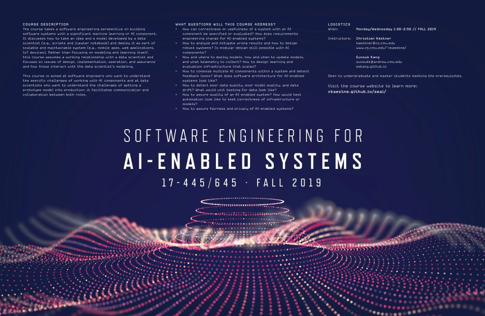

See the specific offering of the course you are interested in:

* Fall 2019 (initial offering, complete slides and assignments): [F2019 website](https://ckaestne.github.io/seai/F2019) and [F2019 GitHub branch](https://github.com/ckaestne/seai/tree/F2019).
* Summer 2020 (next offering):  [S2020 website](https://ckaestne.github.io/seai/S2020) and [S2020 GitHub branch](https://github.com/ckaestne/seai/tree/S2020)
* Fall 2020: [F2020 website](https://ckaestne.github.io/seai/F2020) and [F2020 GitHub branch](https://github.com/ckaestne/seai/tree/F2020)

In 2020, the class will be offered both in the Summer term and in the Fall semester. The Summer offering will be more targeted towards students with software engineering experience (e.g., software engineering course, industrial experience, or internship experience), but will expect no data science background. The Fall offering will be targeted more at students with some data science experience (e.g., a machine learning course on campus or online), but will expect no software engineering background.

For researchers, educators, or others interested in this topic, we share all course material under a creative commons license on GitHub (https://github.com/ckaestne/seai/) and have recently published an article describing the rationale and the design of this course: [Teaching Software Engineering for AI-Enabled Systems](https://arxiv.org/abs/2001.06691). We would be happy to see this course or a similar version taught somewhere else. See also an [annotated bibliography](https://github.com/ckaestne/seaibib) on the topic.

## Course Description

The course takes a **software engineering perspective** on building software systems with a significant **machine learning or AI component**. It discusses how to take an idea and a model developed by a data scientist (e.g., scripts and Jupyter notebook) and deploy it as part of scalable and maintainable system (e.g., mobile apps, web applications, IoT devices). Rather than focusing on modeling and learning itself, this course assumes a working relationship with a data scientist and focuses on issues of design, implementation, operation, and assurance and how those interact with the data scientist's modeling.

This course is aimed at **software engineers** who want to understand the specific challenges of working with AI components and at **data scientists** who want to understand the challenges of getting a prototype model into production; it facilitates communication and collaboration between both roles.

### Questions

* How can correctness or usefulness of a system with an AI component be specified or evaluated? How to collect *requirements* for AI-enabled systems?
* How to analyze and mitigate wrong results and how to design robust systems? Is *modular design* still possible with AI components?
* How and where to deploy models, how and when to update models, and what telemetry to collect? How to design learning and evaluation infrastructure that scales? 
* How to compose multiple AI components within a system and detect feedback loops? What does *software architecture* for AI-enabled systems look like?
* How to detect poor data quality, poor model quality, and data drift? What would *unit testing* for data look like?
* How to assure quality of an AI-enabled system? How would *test automation* look like to test correctness of infrastructure or models?
* How to assure *fairness and privacy* of AI-enabled systems?

### Learning Outcomes

After taking this course, among others, students should be able to
* analyze tradeoffs for designing production systems with AI-components, analyzing various qualities beyond accuracy such as operation cost, latency, updateability, and explainability
* implement production-quality systems that are robust to mistakes of AI components
* design fault-tolerant and scalable data infrastructure for learning models, serving models, versioning, and experimentation
* ensure quality of the entire machine learning pipeline with test automation and other quality assurance techniques, including automated checks for data quality, data drift, feedback loops, and model quality
* build systems that can be tested in production and build deployment pipelines that allow careful rollouts and canary testing
* consider privacy, fairness, and security when building complex AI-enabled systems
* communicate effectively in teams with both software engineers and data analysts

In addition, students will gain familiarity with production-quality infrastructure tools, including stream processing with Apache Kafka, distributed data storage with SQL and NoSQL databases, deployment with Docker and Kubernetes, and test automation with Travis and Jenkins.

### Design Rationale

* Data scientists often make great progress at building models with cutting edge techniques but turning those models into products is challenging. For example, data scientists may work with unversioned notebooks on static data sets and focus on prediction accuracy while ignoring scalability, robustness, update latency, or operating cost.
* Software engineers are trained with clear specifications and tend to focus on code, but may not be aware of the difficulties of working with data and unreliable models. They have a large toolset for decision making and quality assurance but it is not obvious how to apply those to AI-enabled systems and their challenges.
* To what degree can existing SE practices be used for building intelligent systems? To what degree are new practices needed?
* This course adopts a software engineering perspective on building intelligent systems, focusing on what a software engineer can do to turn a machine learning idea into a scalable and reliable product. Rather than focusing on modeling and learning itself, it assumes a working relationship with a data scientist and focuses on issues of design, implementation, operation, and assurance and how those interact with the data scientist's modeling.
* The course will use software and systems engineering terminology and techniques (e.g., test coverage, architecture views, fault trees) and make explicit transfers to challenges posed by using machine learning/AI components. The course will not teach fundamentals of machine learning or AI, but will assume a basic understanding of relevant concepts (e.g., feature engineering, linear regression vs fault trees vs neural networks). It will heavily train design thinking and tradeoff analysis. It will focus primarily on practical approaches that can be used now and will feature hands-on practice with modern tools and infrastructure.

## Logistics and People

See the specific offering for details: [Fall 2019](https://ckaestne.github.io/seai/F2019), [Summer 2020](https://ckaestne.github.io/seai/S2020)  or [Fall 2020](https://ckaestne.github.io/seai/F2020)

## Course content

The course content evolves from semester to semester. Below is the schedule from the initial Fall 2019 offering. See also [Summer 2020](https://ckaestne.github.io/seai/S2020) and [Fall 2020](https://ckaestne.github.io/seai/F2020).

(Preliminary schedule, subject to change)

| Date  | Topic | Reading | Assignment due |
| -     | -     | -       | -              |
| Mon, Aug 26 | [Introduction and Motivation](https://ckaestne.github.io/seai/F2019/slides/01_introduction_and_motivation/intro.html) |   |   |
| Wed, Aug 28 | [Components of an AI-Enabled System](https://ckaestne.github.io/seai/F2019/slides/02_components/components.html)  | [Building Intelligent Systems](https://www.buildingintelligentsystems.com/), Ch. 2+5+20  |   |
| Mon, Sep 2  | **Labor day, no class** |   |   |
| Wed, Sep 4  | [Software Engineering Bootcamp](https://ckaestne.github.io/seai/F2019/slides/03_se_bootcamp/se.html)   |  [Software Engineering for the 21st Century](http://ra.adm.cs.cmu.edu/anon/usr0/anon/usr/ftp/isri2005/CMU-ISRI-05-108.pdf), Sec 1-3  | [I1: Case Study](https://github.com/ckaestne/seai/blob/F2019/assignments/I1_case_study/assignment01.md)  |
| Mon, Sep 9  | [Challenges and Measurements](https://ckaestne.github.io/seai/F2019/slides/04_challenges/challenges.html)   | [Hidden Technical Debt in Machine Learning Systems](http://papers.nips.cc/paper/5656-hidden-technical-debt-in-machine-learning-systems.pdf) & [Building Intelligent Systems](https://www.buildingintelligentsystems.com/), Ch. 4    |   |
| Wed, Sep 11 | [Requirements and Risks](https://ckaestne.github.io/seai/F2019/slides/05_requirements/requirements.html)  | [Building Intelligent Systems](https://www.buildingintelligentsystems.com/), Ch. 6+7+24  | [G1: Modeling Basics](https://github.com/ckaestne/seai/blob/F2019/assignments/G1_modeling_basics/assignment02.md) |
| Mon, Sep 16 | [Tradeoffs among AI Techniques](https://ckaestne.github.io/seai/F2019/slides/06_tradeoffs/tradeoffs.html#/)   |  [Building Intelligent Systems](https://www.buildingintelligentsystems.com/), Ch. 16-18 |   |
| Wed, Sep 18 |  [Software Architecture of AI-enabled Systems](https://ckaestne.github.io/seai/F2019/slides/07_architecture/architecture.html) |  [Software architecture in practice](https://www.oreilly.com/library/view/software-architecture-in/9780132942799/?ar), Ch. 1 & [Building Intelligent Systems](https://www.buildingintelligentsystems.com/), Ch. 13 |  [I2: Requirements/Risk](https://github.com/ckaestne/seai/blob/F2019/assignments/I2_requirements_risks/assignment03.md) |
| Wed, Sep 23 | [Model Quality](https://ckaestne.github.io/seai/F2019/slides/08_model_quality/modelquality.html)   |  [Building Intelligent Systems](https://www.buildingintelligentsystems.com/), Ch. 15+19 |   |
| Mon, Sep 25 | Tradeoffs among AI Techniques: Presentations    |   | [G2: Technique Tradeoff Analysis](https://github.com/ckaestne/seai/blob/F2019/assignments/G2_tradeoffs/assignment04.md) |
| Mon, Sep 30 | [Experimentation](https://ckaestne.github.io/seai/F2019/slides/09_experimentation/experimentation.html) | [Statistical Significance in A/B Testing](http://blog.analytics-toolkit.com/2017/statistical-significance-ab-testing-complete-guide/)  |   |
| Wed, Oct 2  | [Data Quality](https://ckaestne.github.io/seai/F2019/slides/10_data_quality/dataquality.html)    | [Automating large-scale data quality verification](http://www.vldb.org/pvldb/vol11/p1781-schelter.pdf)  | [I3: Architecture](https://github.com/ckaestne/seai/blob/F2019/assignments/I3_architecture/assignment05.md)  |
| Mon, Oct 7  | [Infrastructure Quality](https://ckaestne.github.io/seai/F2019/slides/11_infrastructurequality/testing.html)  |  [The ML Test Score: A Rubric for ML Production Readiness and Technical Debt Reduction](https://research.google.com/pubs/archive/46555.pdf) |   |
| Wed, Oct 9  |  **Midterm**   |   |  |
| Mon, Oct 14 | [DevOps](https://ckaestne.github.io/seai/F2019/slides/12_devops/devops.html)  |   |    |
| Wed, Oct 16 | [Fairness in AI-Enabled Systems](https://ckaestne.github.io/seai/F2019/slides/13_fairness/fairness.html)  | [Algorithmic Accountability: A Primer](https://datasociety.net/wp-content/uploads/2018/04/Data_Society_Algorithmic_Accountability_Primer_FINAL-4.pdf)   | [G3: Infrastructure Quality](https://github.com/ckaestne/seai/blob/F2019/assignments/G3_quality/assignment06.md) |
| Mon, Oct 21 | [Fairness Definitions and Measurement](https://ckaestne.github.io/seai/F2019/slides/14_fairness_2/fairness2.html)  |  [Fairness and Machine Learning](https://fairmlbook.org/pdf/introduction.pdf), Ch. 1 |   |
| Wed, Oct 23 | [Ethics](https://ckaestne.github.io/seai/F2019/slides/15_ethics/ethics.html)  |[Benefits & Risks of AI](https://futureoflife.org/background/benefits-risks-of-artificial-intelligence/)   | [I4: Fairness](https://github.com/ckaestne/seai/blob/F2019/assignments/I4_fairness/assignment07.md) |
| Mon, Oct 28 | [Scalability and Distributed Systems](https://ckaestne.github.io/seai/F2019/slides/16_distributed/systems.html)     |  [Fallacies of Distributed Computing Explained](https://www.rgoarchitects.com/Files/fallacies.pdf) |   |
| Wed, Oct 30 | [Managing and Processing Large Datasets](https://ckaestne.github.io/seai/F2019/slides/17_dataatscale/data.html)  |   [Designing Data-Intensive Applications](https://cmu.primo.exlibrisgroup.com/discovery/fulldisplay?docid=alma991019578119704436&context=L&vid=01CMU_INST:01CMU&search_scope=MyInst_and_CI&tab=Everything&lang=en), Ch. 1  | |
| Mon, Nov 4  | [Safety](https://ckaestne.github.io/seai/F2019/slides/18_safety/safety.html)   |  [Ironies of Automation](https://www.ise.ncsu.edu/wp-content/uploads/2017/02/Bainbridge_1983_Automatica.pdf) |   |
| Wed, Nov 6  | [Security](https://ckaestne.github.io/seai/F2019/slides/19_security/security.html)    | [Uncover Security Design Flaws Using The STRIDE Approach](https://github.com/ckaestne/seai/raw/master/other_material/readings/security/msnd_threatmodeling.pdf)  | [G4: Automated Model Updates](https://github.com/ckaestne/seai/blob/F2019/assignments/G4_continuousdelivery/assignment08.md)  |
| Mon, Nov 11 | [Process and Team Reflections](https://ckaestne.github.io/seai/F2019/slides/20_teams/teams.html)    |  [Building Intelligent Systems](https://www.buildingintelligentsystems.com/), Ch. 25 & [Peopleware: Productive Projects and Teams](http://proquest.safaribooksonline.com/9780133440706), Ch. 22+23+28 |   |
| Wed, Nov 13 | [Usability](https://ckaestne.github.io/seai/F2019/slides/21_usability/usability.html) |  [Building Intelligent Systems](https://www.buildingintelligentsystems.com/), Ch. 8 | [I5: Security](https://github.com/ckaestne/seai/blob/F2019/assignments/I5_security/assignment09.md)   |
| Mon, Nov 18 | [Data Provenance, Reproducability, and Explainability](https://ckaestne.github.io/seai/F2019/slides/22_provenance/provenance.html)    | [Building Intelligent Systems](https://www.buildingintelligentsystems.com/), Ch. 21 & [Goods: Organizing Google's Datasets](http://research.google.com/pubs/archive/45390.pdf)  |   |
| Wed, Nov 20 | [Symbolic AI (guest lecture)](https://github.com/ckaestne/seai/raw/master/lectures/23_symbolic/ai_in_se.pdf)  |   |   |
| Mon, Nov 25 | **No class** |   | |
| Wed, Nov 27 | **Thanksgiving, no class**    |   | |
| Mon, Dec 2  | [Planning an AI-Enabled Product in a Startup](https://ckaestne.github.io/seai/F2019/slides/23_startup/startup.html) ([Intro slides](https://github.com/ckaestne/seai/raw/master/lectures/24_startup/SEforML_Startups.pdf)) | [What is the minimum viable product?](http://venturehacks.wpengine.com/wp-content/uploads/2009/03/what-is-the-minimum-viable-product.mp3)  |   |
| Wed, Dec 4  | Summary and Review  |  | [G5: System monitoring](https://github.com/ckaestne/seai/blob/F2019/assignments/G5_feedbackloop/assignment10.md) |
| Sun, Dec 15 | **Final exam** (in WEH 4623, 8:30-11:30) ||

## Course Syllabus and Policies

see [Fall 2019](https://ckaestne.github.io/seai/F2019), [Summer 2020](https://ckaestne.github.io/seai/S2020)  or [Fall 2020](https://ckaestne.github.io/seai/F2020) for details.

The course uses Canvas for homework submission, grading, discussion, questions, announcements, and supplementary documents; slides will be posted here; github is used to coordinate group work.

**Prerequisites:** Offerings in different semesters may be targeted at students with different backgrounds. The course does not have formal prerequesites, but we describe background knowledge that will help you be successful in the course, see [Fall 2019](https://ckaestne.github.io/seai/F2019), [Summer 2020](https://ckaestne.github.io/seai/S2020) or [Fall 2020](https://ckaestne.github.io/seai/F2020) for details. Also note that the course always has a substantial programming component, so solid programming skills will be benefitial (we do not prescribe a programming language, but most student teams decide to work primarily in Python).

**Teamwork:** Teamwork is an essential part of this course. Many assignments are done in teams of 3-5 students. Teams will be assigned by the instructor and stay together for multiple assignments. A team policy posted on Canvas applies and describes roles and teams and how to deal with conflicts and imbalances.

**Textbook:** We will be using Goeff Hulten's *"Building Intelligent Systems: A Guide to Machine Learning Engineering"* (ISBN: 1484234316) throughout much of the course. The library provides an [electronic copy](https://link-springer-com.proxy.library.cmu.edu/book/10.1007%2F978-1-4842-3432-7). In addition, we will provide additional supplementary readings, including blog posts and academic papers, throughout the semester.

**Grading:** Evaluation will be based on the following distribution: 50% assignments, 15% midterm, 20% final, 10% participation, 5% reading quizzes.

**Time management:** This is a 12-unit course, and it is our intention to manage it so that you spend close to 12 hours a week on the course, on average. In general, 4 hours/week will be spent in class and 8 hours on reading and assignments. Notice that much homework is done in groups, so please account for the overhead and decreased time flexibility that comes with groupwork. Please feel free to give the course staff feedback on how much time the course is taking for you.

**Late work policy:** Late work in group assignments will receive feedback but no credit. Late work in individual assignments will be accepted with a 10% penalty per day, for up to 3 days. Exceptions to this policy will be made only in extraordinary circumstances, almost always involving a family or medical emergency---with your academic advisor or the Dean of Student Affairs requesting the exception on your behalf. Accommodations for travel (e.g., for interviews) might be possible if requested at least 3 days in advance. Please communicate also with your team about timing issues.

**Writing:** Describing tradeoffs among decisions and communication with stakeholders from other backgrounds are key aspects of this class. Many homework assignments have a component that requires discussing issues in written form or reflecting about experiences. To practice writing skills, the Global Communications Center (GCC) offers one-on-one help for students, along with workshops. The instructors are also happy to provide additional guidance if requested.

**Accommodations for students with disabilities:** If you have a disability and have an accommodations letter from the Disability Resources office, we encourage you to discuss your accommodations and needs with us as early in the semester as possible. We will work with you to ensure that accommodations are provided as appropriate. If you suspect that you may have a disability and would benefit from accommodations but are not yet registered with the Office of Disability Resources, we encourage you to contact them at access@andrew.cmu.edu.

**A note on self care.** Please take care of yourself. Do your best to maintain a healthy lifestyle this semester by eating well, exercising, avoiding drugs and alcohol, getting enough sleep and taking some time to relax. This will help you achieve your goals and cope with stress. All of us benefit from support during times of struggle. You are not alone. There are many helpful resources available on campus and an important part of the college experience is learning how to ask for help. Asking for support sooner rather than later is often helpful.
If you or anyone you know experiences any academic stress, difficult life events, or feelings like anxiety or depression, we strongly encourage you to seek support. Counseling and Psychological Services (CaPS) is here to help: call 412-268-2922 and visit their website at http://www.cmu.edu/counseling/. Consider reaching out to a friend, faculty or family member you trust for help getting connected to the support that can help.

## Related Courses

* [17-640 IoT, Big Data, and ML](https://mse.isri.cmu.edu/Courses/17-640%20IoT%20Big%20Data%20ML.html): A hands-on class building an IoT system with a significant machine learning component. This course is more focused on embedded devices and IoT and focuses on a specific scenario where machine learning is used, whereas we survey software engineering challenges across AI-enabled systems more broadly.
* [17-649 Artificial Intelligence for Software Engineering](https://mse.isri.cmu.edu/Courses/17-649-artificial-intelligence-for-software-engineering.html): This course focuses on how AI techniques can be used to build better software engineering tools and goes into more depth with regard to specific AI techniques, whereas we focus on how software engineering techniques can be used to build AI-enabled systems. Our application scenarios are typical web-based systems for end users, rather than tools for software developers.
* [17-611 DevOps: Modern Deployment](https://mse.isri.cmu.edu/Courses/17-611-DevOps-Modern-Deployment.html), [17-648 Engineering Data Intensive Scalable Systems](https://mse.isri.cmu.edu/Courses/17-648-Engineering-Data-Intensive-Scalable-Systems.html), and similar: These course cover techniques to build scalable, reactive, and reliable systems in depth. We will survey DevOps and big data systems (e.g., batch processing, stream processing), but will not explore them in as much detail as a dedicated course can.
* [10-601 Machine Learning](https://www.cmu.edu/mits/curriculum/core/10-601.html), [15-381 Artificial Intelligence: Representation and Problem Solving](https://www.cs.cmu.edu/~15381-f17/), [05-834  Applied Machine Learning](https://www.cmu.edu/mits/curriculum/core/05-834.html), [95-865 Unstructured Data Analytics](https://www.andrew.cmu.edu/user/georgech/95-865/), and many others: CMU offers many course that teach how machine learning and artificial intelligence techniques work internally and how to apply them to specific problems (including feature engineering and model evaluation), often on static data sets. We assume a basic understanding of such techniques and processes (see prerequisites) but focus on the engineering process for production online systems.
