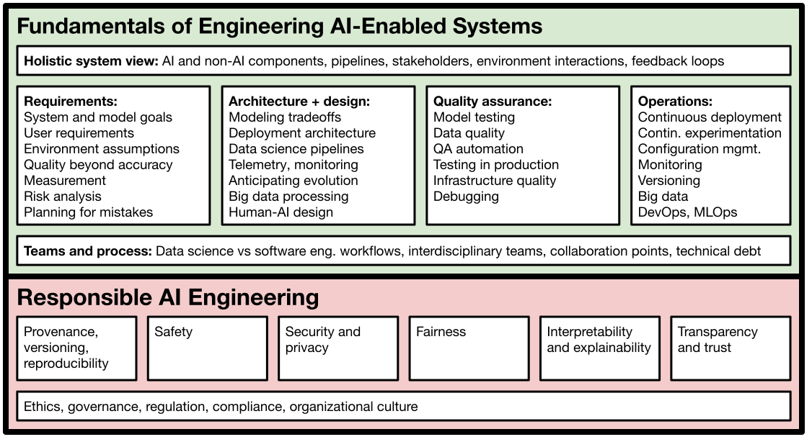

# Machine Learning in Production / AI Engineering (17-445/17-645/17-745/11-695)

*Formerly **Software Engineering for AI-Enabled Systems (SE4AI)**, CMU course that covers how to build, deploy, assure, and maintain applications with machine-learned models. Covers **responsible AI** (safety, security, fairness, explainability, transparency) and **MLOps**.*

***

In 2022, the class will be offered both in the Spring and the Fall semester. In 2023, it will be offered at least in the spring. In all offerings since 2021, the class does not have formal prerequisites, but expects some familiarity with machine learning concepts and basic programming skills. 

See the specific offering of the course you are interested in:

* Fall 2019: [F2019 website](https://ckaestne.github.io/seai/F2019) and [F2019 GitHub branch](https://github.com/ckaestne/seai/tree/F2019).
* Summer 2020 (with video recordings):  [S2020 website](https://ckaestne.github.io/seai/S2020) and [S2020 GitHub branch](https://github.com/ckaestne/seai/tree/S2020)
* Fall 2020: [F2020 website](https://ckaestne.github.io/seai/F2020) and [F2020 GitHub branch](https://github.com/ckaestne/seai/tree/F2020)
* Spring 2021: [S2021 website](https://ckaestne.github.io/seai/S2021) and [S2021 GitHub branch](https://github.com/ckaestne/seai/tree/S2021)
* Spring 2022: [S2022 website](https://ckaestne.github.io/seai/S2022) and [S2022 GitHub branch](https://github.com/ckaestne/seai/tree/S2022)
* Fall 2022: [F2022 website](https://ckaestne.github.io/seai/F2022) and [F2022 GitHub branch](https://github.com/ckaestne/seai/tree/F2022)

For researchers, educators, or others interested in this topic, we share all course material, including slides and assignments, under a creative commons license on GitHub (https://github.com/ckaestne/seai/) and have recently published an article describing the rationale and the design of this course: [Teaching Software Engineering for AI-Enabled Systems](https://arxiv.org/abs/2001.06691). Video recordings of the Summer 2020 offering are online on the [course page](https://ckaestne.github.io/seai/S2020/#course-content). We would be happy to see this course or a similar version taught at other universities. A [textbook](https://ckaestne.medium.com/machine-learning-in-production-book-overview-63be62393581) is on the way. See also an [annotated bibliography](https://github.com/ckaestne/seaibib) on the topic.

## Course Description

This is a course for those who want to build **applications** and **products** with **machine learning**. Assuming we can learn a model to make predictions, what does it take to turn the model into a product and actually deploy it, build a business, and successfully operate and maintain it? 

The course is designed to establish a working relationship between **software engineers** and **data scientists**: both contribute to building production ML systems but have different expertise and focuses. To work together they need a mutual understanding of their roles, tasks, concerns, and goals and build a working relationship. This course is aimed at **software engineers** who want to build robust and responsible systems meeting the specific challenges of working with ML components and at **data scientists** who want to facilitate getting a prototype model into production; it facilitates communication and collaboration between both roles. *The course focuses on all the steps needed to turn a model into a production system.*

It covers topics such as:

* **How to design for wrong predictions the model may make?** How to assure *safety* and *security* despite possible mistakes? How to design the *user interface* and the entire system to operate in the real world?
* **How to reliably deploy and update models in production?** How can we *test* the entire machine learning pipeline? How can *MLOps* tools help to automate and scale the deployment process? How can we *experiment in production* (A/B testing, canary releases)? How do we detect *data quality* issues,  *concept drift*, and *feedback loops* in production?
* **How do we scale production ML systems?** How do we design a system to process huge amounts of training data, telemetry data, and user requests? Should we use stream processing, batch processing, lambda architecture, or data lakes?
* **How to we test and debug production ML systems?** How can we *evaluate* the quality of a model’s predictions in production? How can we *test* the entire AI-enabled system, not just the model? What lessons can we learn from *software testing*, *automated test case generation*, *simulation*, and *continuous integration* for testing for production machine learning?
* **Which qualities matter beyond a model’s prediction accuracy?** How can we identify and measure important quality requirements, including *learning and inference latency, operating cost, scalability, explainablity, fairness, privacy, robustness*, and *safety*? Does the application need to be able to *operate offline* and how often do we need to update the models? How do we identify what’s important in a AI-enabled product in a production setting for a business? How do we resolve *conflicts* and *tradeoffs*?
* **What does it take to build responsible products?** How to think about fairness of a production system at the model and system level? How to mitigate safety and security concerns? How can we communicate the reasons of an automated decision or explain uncertainty to users?
* **How do we build effective interdisciplinary teams?** How can we bring data scientists, software engineers, UI designers, managers, domain experts, big data specialists, operators, legal council, and other roles together and develop a *shared understanding* and *team culture*?

Examples of ML-driven products we discuss include automated audio transcription; distributed detection of missing children on webcams and instant translation in augmented reality; cancer detection, fall detection, COVID diagnosis, and other smart medical and health services; automated slide layout in Powerpoint; semi-automated college admissions; inventory management; smart playlists and movie recommendations; ad fraud detection; delivery robots and smart driving features; and many others.

An extended group project focuses on building, deploying, evaluating, and maintaining a robust and scalable *movie recommendation service* under realistic  “production” conditions.

### Learning Outcomes

After taking this course, among others, students should be able to
* analyze tradeoffs for designing production systems with AI-components, analyzing various qualities beyond accuracy such as operation cost, latency, updateability, and explainability
* implement production-quality systems that are robust to mistakes of AI components
* design fault-tolerant and scalable data infrastructure for learning models, serving models, versioning, and experimentation
* ensure quality of the entire machine learning pipeline with test automation and other quality assurance techniques, including automated checks for data quality, data drift, feedback loops, and model quality
* build systems that can be tested in production and build deployment pipelines that allow careful rollouts and canary testing
* consider privacy, fairness, and security when building complex AI-enabled systems
* communicate effectively in teams with both software engineers and data analysts

In addition, students will gain familiarity with production-quality infrastructure tools, including stream processing with Apache Kafka, distributed data storage with SQL and NoSQL databases, deployment with Docker and Kubernetes, and test automation with Travis or Jenkins.

### Design Rationale

* Data scientists often make great progress at building models with cutting edge techniques but turning those models into products is challenging. For example, data scientists may work with unversioned notebooks on static data sets and focus on prediction accuracy while ignoring scalability, robustness, update latency, or operating cost.
* Software engineers are trained with clear specifications and tend to focus on code, but may not be aware of the difficulties of working with data and unreliable models. They have a large toolset for decision making and quality assurance but it is not obvious how to apply those to AI-enabled systems and their challenges.
* To what degree can existing SE practices be used for building intelligent systems? To what degree are new practices needed?
* This course adopts a software engineering and operator perspective on building intelligent systems, focusing on how to turn a machine learning idea into a scalable and reliable product. Rather than focusing on modeling and learning itself, it assumes a working relationship with a data scientist and focuses on issues of design, implementation, operation, and assurance and how those interact with the data scientist's modeling.
* The course will use software and systems engineering terminology and techniques (e.g., test coverage, architecture views, fault trees) and make explicit transfers to challenges posed by using machine learning/AI components. The course will not teach fundamentals of machine learning or AI, but will assume a basic understanding of relevant concepts (e.g., feature engineering, linear regression vs fault trees vs neural networks). It will heavily train design thinking and tradeoff analysis. It will focus primarily on practical approaches that can be used now and will feature hands-on practice with modern tools and infrastructure.

## Logistics and People

See the specific offering for details: [Fall 2019](https://ckaestne.github.io/seai/F2019), [Summer 2020](https://ckaestne.github.io/seai/S2020), [Fall 2020](https://ckaestne.github.io/seai/F2020), [Spring 2021](https://ckaestne.github.io/seai/S2021) or [Spring 2022](https://ckaestne.github.io/seai/S2022)

## Course content

For a description of topics covered and course structure, see [learning goals](https://github.com/ckaestne/seai/blob/S2022/learning_goals.md).

The course content evolves from semester to semester. Below is the schedule from the Summer 2020 offering. See the webpages for specific semesters above.

| Date  | Topic | Reading | Assignment due |
| -     | -     | -       | -              |
| Tue, May 19| [Introduction and Motivation](https://ckaestne.github.io/seai/S2020/slides/01_introduction/intro.html) ([md](https://github.com/ckaestne/seai/blob/S2020/lectures/01_introduction/intro.md), [pdf](https://ckaestne.github.io/seai/S2020/slides/01_introduction/intro.pdf), [video](https://youtu.be/Wst5A6ZB7Bg)) |  |  |
| Wed, May 20|  [Apache Kafka](https://github.com/ckaestne/seai/blob/S2020/recitations/01_kafka.pdf) |  |  |
| Thu, May 21| [Artificial Intelligence for Software Engineers 1](https://ckaestne.github.io/seai/S2020/slides/02_aibasics1/introml.html) ([md](https://github.com/ckaestne/seai/blob/S2020/lectures/02_aibasics1/introml.md), [pdf](https://ckaestne.github.io/seai/S2020/slides/02_aibasics1/introml.pdf), [video](https://youtu.be/Ccku34DU7k4)) | [Building Intelligent Systems](https://cmu.primo.exlibrisgroup.com/permalink/01CMU_INST/6lpsnm/alma991019649190004436), Ch. 16-18, 20 |  |
| Tue, May 26| [Artificial Intelligence for Software Engineers 2](https://ckaestne.github.io/seai/S2020/slides/03_aibasics2/aioverview.html) ([md](https://github.com/ckaestne/seai/blob/S2020/lectures/03_aibasics2/aioverview.md), [pdf](https://ckaestne.github.io/seai/S2020/slides/03_aibasics2/aioverview.pdf), [video](https://youtu.be/yO5Rm8HAQd0)) | [Hands-On Machine Learning](https://cmu.primo.exlibrisgroup.com/permalink/01CMU_INST/6lpsnm/alma991019665684604436) Ch. 2 | [I1 Case Study](https://github.com/ckaestne/seai/blob/S2020/assignments/I1_case_study.md) |
| Wed, May 27|  [Computational notebooks and scikit-learn](https://github.com/ckaestne/seai/blob/S2020/recitations/02_Scikit_learn.ipynb) |  |  |
| Thu, May 28| [Model Quality](https://ckaestne.github.io/seai/S2020/slides/04_modelquality/modelquality.html) ([md](https://github.com/ckaestne/seai/blob/S2020/lectures/04_modelquality/modelquality.md), [pdf](https://ckaestne.github.io/seai/S2020/slides/04_modelquality/modelquality.pdf), [video](https://youtu.be/DDMNH0VMIIo), [blog post](https://medium.com/@ckaestne/a-software-testing-view-on-machine-learning-model-quality-d508cb9e20a6)) | [Building Intelligent Systems](https://cmu.primo.exlibrisgroup.com/permalink/01CMU_INST/6lpsnm/alma991019649190004436), Ch. 19-20 and [Semantically equivalent adversarial rules for debugging NLP models](https://www.aclweb.org/anthology/P18-1079.pdf) |  |
| Tue, Jun 02| [From Models to AI-Enabled Systems (Systems Thinking)](https://ckaestne.github.io/seai/S2020/slides/05_system/systems.html) ([md](https://github.com/ckaestne/seai/blob/S2020/lectures/05_system/systems.md), [pdf](https://ckaestne.github.io/seai/S2020/slides/05_system/systems.pdf), [video](https://youtu.be/svKnXt1BnzM)) | [Building Intelligent Systems](https://cmu.primo.exlibrisgroup.com/permalink/01CMU_INST/6lpsnm/alma991019649190004436), Ch. 5 and [Hidden Technical Debt in Machine Learning Systems](http://papers.nips.cc/paper/5656-hidden-technical-debt-in-machine-learning-systems.pdf) |  |
| Wed, Jun 03|  [Deep Learning](https://github.com/ckaestne/seai/blob/S2020/recitations/03_Deep_Learning.ipynb) |  |  |
| Thu, Jun 04| [Goals and Success Measures for AI-Enabled Systems](https://ckaestne.github.io/seai/S2020/slides/06_goals/goals.html) ([md](https://github.com/ckaestne/seai/blob/S2020/lectures/06_goals/goals.md), [pdf](https://ckaestne.github.io/seai/S2020/slides/06_goals/goals.pdf), [video](https://youtu.be/LJVzI2u-QJc)) | [Building Intelligent Systems](https://cmu.primo.exlibrisgroup.com/permalink/01CMU_INST/6lpsnm/alma991019649190004436), Ch. 2, 4, and 15 |  |
| Tue, Jun 09| [Tradeoffs among Modeling Techniques](https://ckaestne.github.io/seai/S2020/slides/07_tradeoffs/tradeoffs.html) ([md](https://github.com/ckaestne/seai/blob/S2020/lectures/07_tradeoffs/tradeoffs.md), [pdf](https://ckaestne.github.io/seai/S2020/slides/07_tradeoffs/tradeoffs.pdf), [video](https://youtu.be/Ti0pjzXaFBs)) | [Requirements Engineering for Machine Learning](https://arxiv.org/pdf/1908.04674.pdf) | [I2 Modeling Basics](https://github.com/ckaestne/seai/blob/S2020/assignments/I2_modeling_basics.md) |
| Wed, Jun 10|  [Measurement](https://github.com/ckaestne/seai/blob/S2020/recitations/04_measurement.pdf) |  |  |
| Thu, Jun 11| [Risk and Planning for Mistakes](https://ckaestne.github.io/seai/S2020/slides/08_mistakes/mistakes.html) ([md](https://github.com/ckaestne/seai/blob/S2020/lectures/08_mistakes/mistakes.md), [pdf](https://ckaestne.github.io/seai/S2020/slides/08_mistakes/mistakes.pdf), [video](https://www.youtube.com/watch?v=AYh5bJ2SR48), [blog post](https://medium.com/@ckaestne/a-software-testing-view-on-machine-learning-model-quality-d508cb9e20a6)https://medium.com/@ckaestne/the-world-and-the-machine-and-responsible-machine-learning-1ae72353c5ae) | [Building Intelligent Systems](https://cmu.primo.exlibrisgroup.com/permalink/01CMU_INST/6lpsnm/alma991019649190004436), Ch. 6–8, 24 |  |
| Tue, Jun 16| [Software Architecture of AI-Enabled Systems](https://ckaestne.github.io/seai/S2020/slides/09_architecture/architecture.html) ([md](https://github.com/ckaestne/seai/blob/S2020/lectures/09_architecture/architecture.md), [pdf](https://ckaestne.github.io/seai/S2020/slides/09_architecture/architecture.pdf), [video](https://www.youtube.com/watch?v=KIC-sFz5OT8)) | [Building Intelligent Systems](https://cmu.primo.exlibrisgroup.com/permalink/01CMU_INST/6lpsnm/alma991019649190004436), Ch. 13 and [Exploring Development Patterns in Data Science](https://www.theorylane.com/2017/10/20/some-development-patterns-in-data-science/) | [I3 Tradeoff](https://github.com/ckaestne/seai/blob/S2020/assignments/I3_tradeoffs.md) |
| Wed, Jun 17|  [Requirements decomposition](https://github.com/ckaestne/seai/blob/S2020/recitations/05_requirements.pdf) |  |  |
| Thu, Jun 18| [Quality Assessment in Production](https://ckaestne.github.io/seai/S2020/slides/10_qainproduction/qainproduction.html) ([md](https://github.com/ckaestne/seai/blob/S2020/lectures/10_qainproduction/qainproduction.md), [pdf](https://ckaestne.github.io/seai/S2020/slides/10_qainproduction/qainproduction.pdf), [video](https://youtu.be/RaaNSXKFDGk)) | [Canarying Releases](https://landing.google.com/sre/workbook/chapters/canarying-releases/) |  |
| Tue, Jun 23| [Data Quality and Data Programming](https://ckaestne.github.io/seai/S2020/slides/11_dataquality/dataquality.html) ([md](https://github.com/ckaestne/seai/blob/S2020/lectures/11_dataquality/dataquality.md), [pdf](https://ckaestne.github.io/seai/S2020/slides/11_dataquality/dataquality.pdf), [video](https://www.youtube.com/watch?v=60lBFv9tyWk), [video2](https://www.youtube.com/watch?v=6e6aI4yjAxc)) | [Automating large-scale data quality verification](http://www.vldb.org/pvldb/vol11/p1781-schelter.pdf) and [The Data Linter](http://learningsys.org/nips17/assets/papers/paper_19.pdf) | [I4 Requirements and Architecture](https://github.com/ckaestne/seai/blob/S2020/assignments/I4_requirements_architecture.md) |
| Wed, Jun 24|  [Collaborative filtering](https://github.com/ckaestne/seai/blob/S2020/recitations/06_Collaborative_Filtering.ipynb) |  |  |
| Thu, Jun 25| Invited talk “[Business Systems with Machine Learning](https://www.youtube.com/watch?v=_bvrzYOA8dY)” by Molham Aref |  |  |
| Tue, Jun 30| [Managing and Processing Large Datasets](https://ckaestne.github.io/seai/S2020/slides/12_dataatscale/dataatscale.html) ([md](https://github.com/ckaestne/seai/blob/S2020/lectures/12_dataatscale/dataatscale.md), [pdf](https://ckaestne.github.io/seai/S2020/slides/12_dataatscale/dataatscale.pdf), [video](https://youtu.be/iPmQ5ezQNPY)) | [Designing Data-Intensive Applications](https://cmu.primo.exlibrisgroup.com/permalink/01CMU_INST/6lpsnm/alma991019578119704436), Ch. 1 | [QA Project Milestone 1](https://github.com/ckaestne/seai/blob/S2020/assignments/project.md) |
| Wed, Jul 01|  Review session |  |  |
| Thu, Jul 02| [**Midterm**](https://github.com/ckaestne/seai/blob/S2020/exams/midterm.pdf) |  |  |
| Tue, Jul 07| [Infrastructure Quality, Deployment, and Operations](https://ckaestne.github.io/seai/S2020/slides/13_infrastructurequality/infrastructurequality.html) ([md](https://github.com/ckaestne/seai/blob/S2020/lectures/13_infrastructurequality/infrastructurequality.md), [pdf](https://ckaestne.github.io/seai/S2020/slides/13_infrastructurequality/infrastructurequality.pdf), [video](https://www.youtube.com/watch?v=iBaJgWjpK24)) | [The ML Test Score](https://research.google.com/pubs/archive/46555.pdf) |  |
| Wed, Jul 08|  [Monitoring](https://github.com/ckaestne/seai/tree/S2020/recitations/07_Monitoring) |  |  |
| Thu, Jul 09| [Intro to Ethics + Fairness](https://ckaestne.github.io/seai/S2020/slides/14_fairness1/fairness1.html) ([md](https://github.com/ckaestne/seai/blob/S2020/lectures/14_fairness1/fairness1.md), [pdf](https://ckaestne.github.io/seai/S2020/slides/14_fairness1/fairness1.pdf), [video](https://www.youtube.com/watch?v=0wCJKw3-siY)) | [Algorithmic Accountability: A Primer](https://datasociety.net/wp-content/uploads/2018/04/Data_Society_Algorithmic_Accountability_Primer_FINAL-4.pdf) |  |
| Tue, Jul 14| [Building Fairer AI-Enabled System](https://ckaestne.github.io/seai/S2020/slides/15_fairness2/fairness2.html) ([md](https://github.com/ckaestne/seai/blob/S2020/lectures/15_fairness2/fairness2.md), [pdf](https://ckaestne.github.io/seai/S2020/slides/15_fairness2/fairness2.pdf), [video](https://www.youtube.com/watch?v=iFgJiEz3jz0)) | [Improving fairness in machine learning systems](http://users.umiacs.umd.edu/~hal/docs/daume19fairness.pdf) | [I5 Open Source Tools](https://github.com/ckaestne/seai/blob/S2020/assignments/I5_se4ai_tools.md) |
| Wed, Jul 15|  [Container orchestration](https://github.com/ckaestne/seai/tree/S2020/recitations/08_Kubernetes) |  |  |
| Thu, Jul 16| [Explainability & Interpretability 1](https://ckaestne.github.io/seai/S2020/slides/16_explainability/explainability.html) ([md](https://github.com/ckaestne/seai/blob/S2020/lectures/16_explainability/explainability.md), [pdf](https://ckaestne.github.io/seai/S2020/slides/16_explainability/explainability.pdf), [video](https://youtu.be/JJTCnlMXJ0M)) | [Black boxes not required](https://dataskeptic.com/blog/episodes/2020/black-boxes-are-not-required) or [Stop Explaining Black Box ML Models…](https://arxiv.org/abs/1811.10154) |  |
| Tue, Jul 21| [Explainability & Interpretability 2](https://ckaestne.github.io/seai/S2020/slides/16_explainability/explainability.html) ([md](https://github.com/ckaestne/seai/blob/S2020/lectures/16_explainability/explainability.md), [pdf](https://ckaestne.github.io/seai/S2020/slides/16_explainability/explainability.pdf), [video](https://www.youtube.com/watch?v=3xm5rMM_rCY)) | [People + AI, Ch. “Explainability and Trust”](https://pair.withgoogle.com/chapter/explainability-trust/) | [QA Project Milestone 2](https://github.com/ckaestne/seai/blob/S2020/assignments/project.md) |
| Wed, Jul 22|  [Fairness](https://github.com/ckaestne/seai/blob/S2020/recitations/09_fairness.pdf) |  |  |
| Thu, Jul 23| [Versioning, Provenance, and Reproducability](https://ckaestne.github.io/seai/S2020/slides/18_provenance/provenance.html) ([md](https://github.com/ckaestne/seai/blob/S2020/lectures/18_provenance/provenance.md), [pdf](https://ckaestne.github.io/seai/S2020/slides/18_provenance/provenance.pdf), [video](https://www.youtube.com/watch?v=eGlIW28eRfA)) | [Building Intelligent Systems](https://www.buildingintelligentsystems.com/), Ch. 21 & [Goods: Organizing Google's Datasets](http://research.google.com/pubs/archive/45390.pdf) |  |
| Tue, Jul 28| [Security, Adversarial Learning, and Privacy](https://ckaestne.github.io/seai/S2020/slides/19_security/security.html) ([md](https://github.com/ckaestne/seai/blob/S2020/lectures/19_security/security.md), [pdf](https://ckaestne.github.io/seai/S2020/slides/19_security/security.pdf), [video](https://www.youtube.com/watch?v=5ZdrNYvTmq8), [train](https://store.robotime.com/product/rokr/locomotive-lk701/)) | [Building Intelligent Systems](https://cmu.primo.exlibrisgroup.com/permalink/01CMU_INST/6lpsnm/alma991019649190004436), Ch. 13 & [Prediction machines](https://cmu.primo.exlibrisgroup.com/permalink/01CMU_INST/6lpsnm/alma991019698987304436), Ch. 19 | [I6 Fairness](https://github.com/ckaestne/seai/blob/S2020/assignments/I6_fairness.md) |
| Wed, Jul 29|  [Threat modeling](https://github.com/ckaestne/seai/blob/S2020/recitations/10_Threat_Modeling.pdf) |  |  |
| Thu, Jul 30| [Safety](https://ckaestne.github.io/seai/S2020/slides/20_safety/safety.html) ([md](https://github.com/ckaestne/seai/blob/S2020/lectures/20_safety/safety.md), [pdf](https://ckaestne.github.io/seai/S2020/slides/20_safety/safety.pdf), [video](https://www.youtube.com/watch?v=xRlFDXV3-8E)) | [An analysis of ISO 26262: Using machine learning safely in automotive software](https://arxiv.org/pdf/1709.02435) |  |
| Tue, Aug 04| [Fostering Interdisciplinary Teams](https://ckaestne.github.io/seai/S2020/slides/21_teams/teams.html) ([md](https://github.com/ckaestne/seai/blob/S2020/lectures/21_teams/teams.md), [pdf](https://ckaestne.github.io/seai/S2020/slides/21_teams/teams.pdf), [video](https://www.youtube.com/watch?v=bQGjlKWErfg)) | [Data Scientists in Software Teams: State of the Art and Challenges](https://andrewbegel.com/papers/data-scientists.pdf) | [QA Project Milestone 3](https://github.com/ckaestne/seai/blob/S2020/assignments/project.md) |
| Thu, Aug 06| [Summary and Review](https://ckaestne.github.io/seai/S2020/slides/22_summary/all.html) ([md](https://github.com/ckaestne/seai/blob/S2020/lectures/22_summary/all.md), [pdf](https://ckaestne.github.io/seai/S2020/slides/22_summary/all.pdf), [video](https://www.youtube.com/watch?v=kQJSwtFo7KA)) |  |  |
| Fri, Aug 07| **Final Project Presentation** |  | [QA Project Due](https://github.com/ckaestne/seai/blob/S2020/assignments/project.md) |

## Course Syllabus and Policies

See the web pages for the specific semester for details.

Students taking the PhD version of this class (17-745) will replace two individual assignments with a research project instead, resulting in a draft of a paper of at least workshop quality.

## Related Courses

* 17-649 Artificial Intelligence for Software Engineering: This course focuses on how AI techniques can be used to build better software engineering tools and goes into more depth with regard to specific AI techniques, whereas we focus on how software engineering techniques can be used to build AI-enabled systems. Our application scenarios are typical web-based systems for end users, rather than tools for software developers.
* [05-318 Human-AI Interaction](http://www.humanaiclass.org/): Focuses on the HCI angle on designing AI-enabled products. Overlaps in some coverage on fairness, covers in much more detail user interface design and how to involving humans in ML-supported decisions, whereas this course focuses more on architecture design, requirements engineering, and deploying systems in production. Both courses are complementary.
* [17-646 DevOps: Modern Deployment](https://mse.isri.cmu.edu/applicants/course-offerings.html), [17-647 Engineering Data Intensive Scalable Systems](https://mse.isri.cmu.edu/applicants/course-offerings.html), and similar: These course cover techniques to build scalable, reactive, and reliable systems in depth. We will survey DevOps, and big data systems in the context of designing and deploying systems, but will not explore them in as much detail as a dedicated course can. We will look at MLOps as a ML-specific variant of DevOps.
* [10-601 Machine Learning](https://www.cmu.edu/mits/curriculum/core/10-601.html), [15-381 Artificial Intelligence: Representation and Problem Solving](https://www.cs.cmu.edu/~15381-f17/), [05-834  Applied Machine Learning](https://www.cmu.edu/mits/curriculum/core/05-834.html), [95-865 Unstructured Data Analytics](https://www.andrew.cmu.edu/user/georgech/95-865/), and many others: CMU offers many course that teach how machine learning and artificial intelligence techniques work internally or how to apply them to specific problems (including feature engineering and model evaluation), often on static data sets. We assume a basic understanding of such techniques and processes (see prerequisites) but focus on the engineering process for production ML systems.
