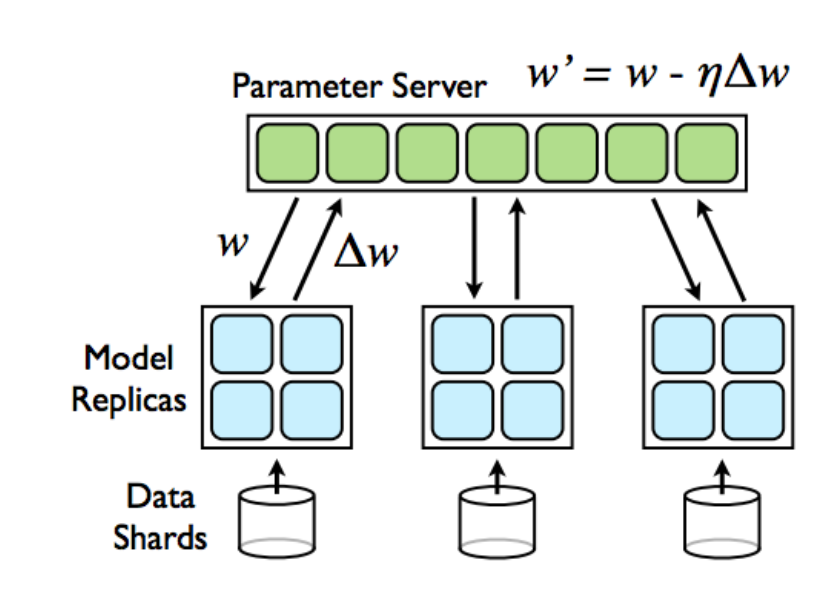

# Toward a system-wide and interdisciplinary perspective on ML system performance

Christian Kaestner

Carnegie Mellon University

@ FASTPATH 2021

---

<!-- split -->
## Christian Kästner

[@p0nk](https://twitter.com/p0nk)

kaestner@cs.cmu.edu

Associate Professor @ CMU

Interests:
* Software Engineering for ML-Enabled Systems
* Highly-Configurable Systems (incl. performance analysis)
* Sustainability and Stress in Open Source

---

# Software Engineering for ML-Enabled Systems

> Building, operating, and maintaining software systems with machine-learned components

> with interdisciplinary collaborative teams of 
**data scientists** and **software engineers** 

----

## SE for ML-Enabled Systems != coding ML frameworks

<!-- .element: class="stretch" -->

----
## SE for ML-Enabled Systems

----
## SE for ML-Enabled Systems

[temi.com](https://www.temi.com/)

----
## System = ML + Non-ML Components

<!-- .element: class="stretch" -->

---
# System Design Matters

----
## Most ML Courses

Focus narrowly on modeling techniques or building models

Using notebooks, static datasets, evaluating accuracy

----
## The Flywheel

----
## Telemetry Design

[temi.com](https://www.temi.com/)

----
## ML is a Component in a System

<!-- .element: class="stretch" -->

----
## System Design to Support ML

<!-- .element: class="stretch" -->

---
# Everything is a Tradeoff

----
## Many qualities of interest

* Accuracy
* Inference latency, throughput, energy consumption
* Learning time, incremental learning, scalability, resources needed
* Simplicity, maintainability, extensibility, 
* Interpretability/explainability, fairness
* Robustness, reproducibility, stability
* 
* Usability, trust, accountability
* User satisfaction
* Dealing with mistakes
* Safety, security, privacy
* Development velocity, predictability
* Profit
* ...

----
## Model Quality vs System Quality

<!-- references -->
Bernardi, Lucas, Themistoklis Mavridis, and Pablo Estevez. "150 successful machine learning models: 6 lessons learned at Booking.com." In Proc. International Conference on Knowledge Discovery & Data Mining, 2019.

----
## Model Quality vs System Quality

<!-- .element: class="stretch" -->

----
## Many qualities of interest

* Accuracy
* Inference latency, throughput, energy consumption
* Learning time, incremental learning, scalability, resources needed
* Simplicity, maintainability, extensibility, 
* Interpretability/explainability, fairness
* Robustness, reproducibility, stability
* 
* Usability, trust, accountability
* User satisfaction
* Dealing with mistakes
* Safety, security, privacy
* Development velocity, predictability
* Profit
* ...

----
## Example: AR Instant Translation

<!-- .element: class="stretch" -->

----
## Example: AR Instant Translation

----
## Example: AR Instant Translation

<iframe width="800" height="505" src="https://www.youtube.com/embed/w_pTFBbe5hQ?start=313" title="YouTube video player" frameborder="0" allow="accelerometer; autoplay; clipboard-write; encrypted-media; gyroscope; picture-in-picture" allowfullscreen></iframe>

----
## Example: AR Instant Translation

----
## Example: AR Instant Translation

----
## Tradeoff: Accuracy vs Latency + Energy + Model Size

----
## Tradeoff: Latency vs Energy Consumption vs Bandwidth

----
## Tradeoff: Privacy vs Telemetry

----
## Tradeoff: Telemetry benefits vs telemetry costs

----
## Tradeoff: Update latency vs Offline use

----
## Tradeoff: Training cost vs update frequency

----
## Tradeoff: Model improvement vs System safeguards

<!-- colstart -->

<!-- col -->

<!-- colend -->

----

---
# Think like a 
# software architect

----

## Excursion: Twitter

<!-- references -->
Raffi. [New Tweets per second record, and how!](https://blog.twitter.com/engineering/en_us/a/2013/new-tweets-per-second-record-and-how.html) Twitter Blog, 2013

----

## Twitter - Caching Architecture

<!-- .element: class="stretch" -->

Notes:

* Running one of the world’s largest Ruby on Rails installations
* 200 engineers
* Monolithic: managing raw database, memcache, rendering the site, and * presenting the public APIs in one codebase
* Increasingly difficult to understand system; organizationally challenging to manage and parallelize engineering teams
* Reached the limit of throughput on our storage systems (MySQL); read and write hot spots throughout our databases
* Throwing machines at the problem; low throughput per machine (CPU + RAM limit, network not saturated)
* Optimization corner: trading off code readability vs performance

----

## Twitter's Redesign Goals

* Performance
    * Improve median latency; lower outliers 
    * Reduce number of machines 10x
+ Reliability
    * Isolate failures
+ Maintainability
    * "We wanted cleaner boundaries with “related” logic being in one place": 
encapsulation and modularity at the systems level (rather than at the class, module, or package level)
* Modifiability
    * Quicker release of new features: "run small and empowered engineering teams that could make local decisions and ship user-facing changes, independent of other teams"

<!-- references -->

Raffi. [New Tweets per second record, and how!](https://blog.twitter.com/engineering/en_us/a/2013/new-tweets-per-second-record-and-how.html) Twitter Blog, 2013

----

## Twitter: Redesign Decisions

* Ruby on Rails -> JVM/Scala 
* Monolith -> Microservices
* RPC framework with monitoring, connection pooling, failover strategies, loadbalancing, ... built in
* New storage solution, temporal clustering, "roughly sortable ids"
* Data driven decision making

<!-- split -->

<!-- .element: class="stretch" -->

----

## Twitter Case Study: Key Insights

* Architectural decisions affect entire systems, not only individual modules
* Abstract, different abstractions for different scenarios
* Reason about quality attributes early
* Make architectural decisions explicit

----
## Architectural planning

* Identify and prioritize relevant qualities
* Identify system structure and relevant interactions
* Understand constraints and tradeoffs
* Conduct research into requirements and constraints
* Explore alternatives
* Set obligations for components

---
# Teams and Process

----
<svg version="1.1" viewBox="0.0 0.0 800 600" xmlns:xlink="http://www.w3.org/1999/xlink" xmlns="http://www.w3.org/2000/svg">
    
    <circle r="180" cx="180", cy="150" fill="#b9ff00" fill-opacity="0.514" />
    <circle r="180" cx="620", cy="150" fill="#ff5500" fill-opacity="0.514" />
    <circle r="180" cx="400", cy="470" fill="#55ff" fill-opacity="0.514" />
    <text x=180 y=110 dominant-baseline="middle" text-anchor="middle">Data</text>
    <text x=180 y=190 dominant-baseline="middle" text-anchor="middle">Scientists</text>
    <text x=620 y=110 dominant-baseline="middle" text-anchor="middle">Software</text>
    <text x=620 y=190 dominant-baseline="middle" text-anchor="middle">Engineers</text>
    <text x=400 y=470 dominant-baseline="middle" text-anchor="middle">Operators</text>
</svg>

----
## Data scientist

* Often fixed dataset for training and evaluation (e.g., PBS interviews)
* Focused on accuracy
* Prototyping, often Jupyter notebooks or similar 
* Expert in modeling techniques and feature engineering
* Model size, updateability, implementation stability typically does not matter
* Starting to worry about fairness, robustness, ...

<!-- split -->

## Software engineer

* Builds a product
* Concerned about cost, performance, stability, release time
* Identify quality through customer satisfaction
* Must scale solution, handle large amounts of data
* Plan for mistakes and safeguards
* Maintain, evolve, and extend the product over long periods
* Consider requirements for security, safety, fairness

----

<!-- split -->

CMU 17-445 Class Project

----
## Data Science Practices by Software Engineers

* Many software engineers get involved in data science without explicit training
* Copying from public examples, little reading of documentation
* Lack of data visualization/exploration/understanding, no focus on data quality
* Strong preference for code editors, non-GUI tools
* Try improving model by adding more data or using deep learning, rarely feature engineering or debugging
* Lack of awareness about overfitting/bias problems, single focus on accuracy, no monitoring

<!-- references -->

Yang, Qian, Jina Suh, Nan-Chen Chen, and Gonzalo Ramos. "[Grounding interactive machine learning tool design in how non-experts actually build models](http://www.audentia-gestion.fr/MICROSOFT/Machine_Teaching_DIS_18.pdf)." In *Proceedings of the 2018 Designing Interactive Systems Conference*, pp. 573-584. 2018.

----

<!-- .element: class="stretch" -->

----

<!-- .element: class="stretch" -->

By Steven Geringer, via Ryan Orban. [Bridging the Gap Between Data Science & Engineer: Building High-Performance Teams](https://www.slideshare.net/ryanorban/bridging-the-gap-between-data-science-engineer-building-highperformance-teams/3-Software_Engineer_Data_Engineer_Data). 2016

----
## T-Shaped People

*Broad-range generalist + Deep expertise*

<!-- reference -->
Figure: Jason Yip. [Why T-shaped people?](https://medium.com/@jchyip/why-t-shaped-people-e8706198e437). 2018

----
## DevOps as Inspiration

Distinct roles and expertise, but joint responsibilities, joint tooling

Interdisciplinary teams, split expertise, but joint responsibilities

Joint vocabulary and tools

Foster system thinking

----
## Process models

----
## Process models

<!-- .element: class="stretch" -->

(CRISP-DM)

----
## Process models

<!-- colstart -->

<!-- col -->

<!-- colend -->

----
## Integrated ML/Non-ML Process

----
## Development Trajectories

<!-- .element: class="stretch" -->

Upfront design? ML first? Non-ML system first? Incremental refinement?

---
# Summary

* Adopt a whole-system perspective on ML in production
* Understand qualities and tradeoffs, including performance
* Consider implications of qualities on non-ML components
* Build interdisciplinary teams, include architects

