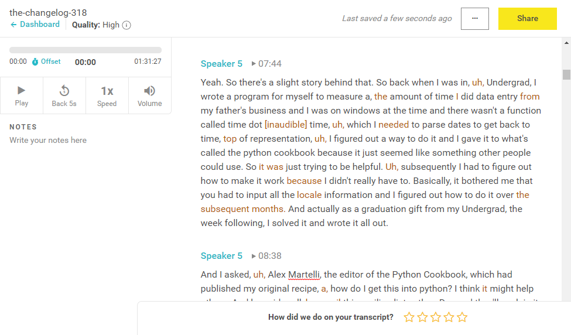

# Software Architecture of AI-Enabled Systems

Guest Lecture by Christian Kaestner

<!-- references -->

Required reading: 
* Vogelsang, Andreas, and Markus Borg. "[Requirements Engineering for Machine Learning: Perspectives from Data Scientists](https://arxiv.org/pdf/1908.04674.pdf)." In Proc. of the 6th International Workshop on Artificial Intelligence for Requirements Engineering (AIRE), 2019. 


---
# Machine Learning in Software Systems

----
## Machine Learning

Function making predictions for inputs

$f(x_1, x_2, x_3) \rightarrow y$


No specification, function learned by generalizing from example data (inductive reasoning)


----
## Running Example: Transcription Service


----

## The startup idea

PhD research on domain-specific speech recognition, that can detect technical jargon

DNN trained on public PBS interviews + transfer learning on smaller manually annotated domain-specific corpus

Research has shown amazing accuracy for talks in medicine, poverty and inequality research, and talks at Ruby programming conferences; published at top conferences

Idea: Let's commercialize the software and sell to academics and conference organizers


----

## What qualities are important for a good commercial transcription product?

<!-- discussion -->


----
## ML in a Production System


----
## ML in a Production System


---
# Accuracy, Correctness, and Other Qualities


----
## Traditional ML Focus: Model Accuracy

* Train and evaluate model on fixed labled data set
* Compare prediction with labels


----
## Traditional SE Focus: Functional Correctness

*Given a specification, do outputs match inputs?*

```java
/**
 * compute deductions based on provided adjusted 
 * gross income and expenses in customer data.
 *
 * see tax code 26 U.S. Code A.1.B, PART VI
 */
float computeDeductions(float agi, Expenses expenses);
```

**Each mismatch is considered a bug, should to be fixed*.**

(*=not every bug is economical to fix, may accept some known bugs)


----
## No specification!

We use ML precisely because we do not have a specification (too complex, rules unknown)


We are usually okay with some wrong predictions


----


> All models are approximations. Assumptions, whether implied or clearly stated, are never exactly true. **All models are wrong, but some models are useful**. So the question you need to ask is not "Is the model true?" (it never is) but "Is the model good enough for this particular application?" -- George Box


<!-- references -->
See also https://en.wikipedia.org/wiki/All_models_are_wrong


----
## Non-ML Example: Newton's Laws of Motion

> 2nd law: "the rate of change of momentum of a body over time is directly proportional to the force applied, and occurs in the same direction as the applied force" 
> ${\displaystyle \mathbf {F} ={\frac {\mathrm {d} \mathbf {p} }{\mathrm {d} t}}}$

"Newton's laws were verified by experiment and observation for over 200 years, and they are excellent approximations at the scales and speeds of everyday life."

Do not generalize for very small scales, very high speeds, or in very strong gravitational fields. Do not explain semiconductor, GPS errors, superconductivity, ... Those require general relativity and quantum field theory.

<!-- references -->
Further readings: https://en.wikipedia.org/wiki/Newton%27s_laws_of_motion


----
## Limitations of Offline Model Evaluation

* Training and test data drawn from the same population 
    * **i.i.d.: independent and identically distributed**
* Is the population representative of production data?
* If not or only partially or not anymore: Does the model generalize beyond training data?

----
## Testing in Production

<div class="tweet" data-src="https://twitter.com/changelog/status/1137359428632621060"></div>


----
## Quality concerns for ML-Enabled Systems

* Learning time, cost and scalability
* Update cost, incremental learning
* Inference cost
* Size of models learned
* Amount of training data needed
* Fairness
* Robustness
* Safety, security, privacy
* Explainability, reproducibility
* Time to market
* Overall operating cost (cost per prediction)


---
# Deploying ML Models

----
## Accessibility: Live Subtitles 


----
## Where to Deploy the Transcription Model?


<!-- discussion -->

----
## Where to Deploy the Transcription Model?


Which qualities and tradeoffs to consider?

<!-- discussion -->

----
## Where to Deploy the Transcription Model?


* Amount of data, bandwidth, bandwidth cost
* Latency
* Energy/battery cost
* Available memory, CPU capacity
* Ability to debug 
* Offline functioning
* Privacy, security
* Accuracy
* Frequency of model updates


---
# Telemetry Design

----
## Goals 1: Evaluate model and system quality in production


----
## Goal 2: Experimenting in Production


----
## Goal 3: Gather more training data


 <!-- references -->

 graphic by [CBInsights](https://www.cbinsights.com/research/team-blog/data-network-effects/)


----
## Discussion: Was the Transcription any good?

* Gather feedback without being intrusive (i.e., labeling outcomes), without harming user experience
* What data can we collect to evaluate our transcription service?
    - Evaluate business goals
    - Evaluate system quality
    - Evaluate model quality

<!-- discussion -->


----
## Typical Telemetry Strategies

* Wait and see
* Ask users
* Manual/crowd-source labeling, shadow execution
* Allow users to complain
* Observe user reaction


----


Notes: Can just wait 7 days to see actual outcome for all predictions
----


Notes: Clever UI design allows users to edit transcripts. UI already highlights low-confidence words, can 


----

<!-- split -->


Notes:
Expect only sparse feedback and expect negative feedback over-proportionally

----
## Manually Label Production Samples

Similar to labeling learning and testing data, have human annotators


----
## Clever UI Design: Transcription Service


----
## ML in a Production System


----
## Discussion 2: Google Tagging uploaded photos with friends' names

* Gather feedback without being intrusive (i.e., labeling outcomes), without harming user experience
* What data can we collect to evaluate our transcription service?
    - Evaluate business goals
    - Evaluate system quality
    - Evaluate model quality


<!-- discussion -->


----
## Monitoring Model Quality in Production

* Monitor model quality together with other quality attributes (e.g., uptime, response time, load)
* Set up automatic alerts when model quality drops
* Watch for jumps after releases
    - roll back after negative jump
* Watch for slow degradation
    - Stale models, data drift, feedback loops, adversaries
* Debug common or important problems
    - Monitor characteristics of requests 
    - Mistakes uniform across populations?
    - Challenging problems -> refine training, add regression tests


----


----
## Detecting Drift


<!-- references -->
Image source: Joel Thomas and Clemens Mewald. [Productionizing Machine Learning: From Deployment to Drift Detection](https://databricks.com/blog/2019/09/18/productionizing-machine-learning-from-deployment-to-drift-detection.html). Databricks Blog, 2019


----
## Model Quality vs System Quality


<!-- .element: class="stretch" --> 

**Possible causes?**

Bernardi et al. "150 successful machine learning models: 6 lessons learned at Booking.com." In Proc KDD, 2019.

Note: hypothesized 
* model value saturated, little more value to be expected
* segment saturation: only very few users benefit from further improvement
* overoptimization on proxy metrics not real target metrics
* uncanny valley effect from "creepy AIs"


----
## Engineering Challenges for Telemetry


----
## Engineering Challenges for Telemetry
* Data volume and operating cost
    - e.g., record "all AR live translations"?
    - reduce data through sampling
    - reduce data through summarization (e.g., extracted features rather than raw data; extraction client vs server side)
* Adaptive targeting
* Biased sampling
* Rare events
* Privacy
* Offline deployments?


----
## Exercise: Design Telemetry in Production

Discuss: Quality measure, telemetry, operationalization, cost, privacy, rare events

**Google: Tagging uploaded photos with friends' names**

<!-- discussion -->


---

# Summary

* Machine learning is a component of a larger system
* It brings new concerns, qualities, and design options
* Telemetry design is key for ML systems in production
* Many qualities and tradeoffs to consider


----
## Further pointers

* Full lecture (with videos, readings, assignments): https://ckaestne.github.io/seai/
* Annotated bibliography: https://github.com/ckaestne/seaibib
* Hulten, Geoff. Building Intelligent Systems: A Guide to Machine Learning Engineering. Apress. 2018
* Yokoyama, Haruki. "Machine learning system architectural pattern for improving operational stability." In 2019 IEEE International Conference on Software Architecture Companion (ICSA-C), pp. 267-274. IEEE, 2019.
* Hazelwood, Kim, Sarah Bird, David Brooks, Soumith Chintala, Utku Diril, Dmytro Dzhulgakov, Mohamed Fawzy et al. "Applied machine learning at facebook: A datacenter infrastructure perspective." In 2018 IEEE International Symposium on High Performance Computer Architecture (HPCA), pp. 620-629. IEEE, 2018.

