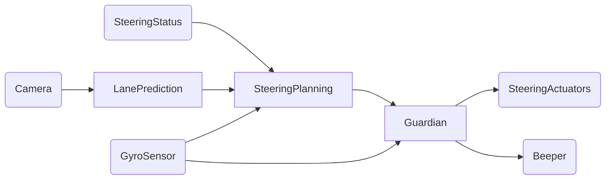
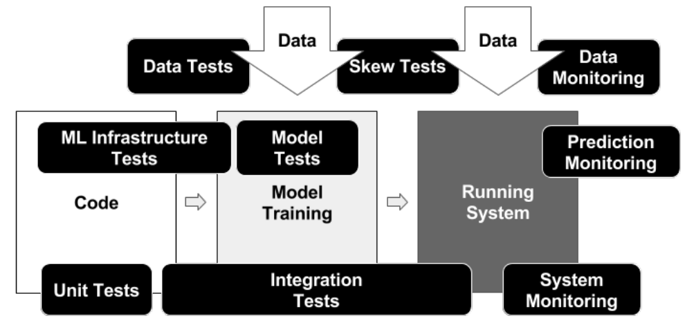

# Software Engineering for ML-Enabled Systems

Christian Kästner

Carnegie Mellon University


https://github.com/ckaestne/seai

---


<!-- split -->
## Christian Kästner

[@p0nk](https://twitter.com/p0nk)

Associate Professor @ CMU

Interests:
* Software Engineering
* Highly-Configurable Systems & Configuration Engineering
* Sustainability and Stress in Open Source
* Software Engineering for ML-Enabled Systems


---

## Software Engineering for ML-Enabled Systems

> Building, operating, and maintaining software systems with machine-learned components

> with interdisciplinary collaborative teams of 
**data scientists** and **software engineers** 


----
## SE for ML-Enabled Systems != Building models


----


## SE for ML-Enabled Systems != coding ML frameworks


----


## SE for ML-Enabled Systems != ML for SE Tools


----
## SE for ML-Enabled (AI-ML-based, ML-infused) Systems


[temi.com](https://www.temi.com/)

----
## SE for ML-Enabled (AI-ML-based, ML-infused) Systems


---

<svg version="1.1" viewBox="0.0 0.0 800 400" xmlns:xlink="http://www.w3.org/1999/xlink" xmlns="http://www.w3.org/2000/svg">
	<style>
    text { font: 60px sans-serif; }
  	</style>
	<circle r="180" cx="180", cy="200" fill="#b9ff00" fill-opacity="0.514" />
	<circle r="180" cx="620", cy="200" fill="#ff5500" fill-opacity="0.514" />
	<text x=180 y=160 dominant-baseline="middle" text-anchor="middle">Data</text>
	<text x=180 y=240 dominant-baseline="middle" text-anchor="middle">Scientists</text>
	<text x=620 y=160 dominant-baseline="middle" text-anchor="middle">Software</text>
	<text x=620 y=240 dominant-baseline="middle" text-anchor="middle">Engineers</text>
</svg>

and domain experts + lawyers + operators + security experts + regulators + ...

----
## Software Engineering

> Software engineering is the branch of computer science that creates practical, cost-effective solutions to computing and information processing problems, preferentially by applying scientific knowledge, developing software systems in the service of mankind. 

Engineering judgements under limited information and resources

A focus on design, tradeoffs, and the messiness of the real world

Many qualities of concern: cost, correctness, performance, scalability, security, maintainability, ...


**"it depends..."**


<!-- references -->
Mary Shaw. ed. [Software Engineering for the 21st Century: A basis for rethinking the curriculum](https://www.cs.cmu.edu/~Compose/SEprinciples-pub-rev2.pdf). 2005.


----
## Most ML Courses/Talks

Focus narrowly on modeling techniques or building models

Using notebooks, static datasets, evaluating accuracy

Little attention to software engineering aspects of building complete systems


----
## Data scientist

* Often fixed dataset for training and evaluation (e.g., PBS interviews)
* Focused on accuracy
* Prototyping, often Jupyter notebooks or similar 
* Expert in modeling techniques and feature engineering
* Model size, updateability, implementation stability typically does not matter
* Starting to worry about fairness, robustness, ...

<!-- split -->

## Software engineer

* Builds a product
* Concerned about cost, performance, stability, release time
* Identify quality through customer satisfaction
* Must scale solution, handle large amounts of data
* Plan for mistakes and safeguards
* Maintain, evolve, and extend the product over long periods
* Consider requirements for security, safety, fairness

----

<svg version="1.1" viewBox="0.0 0.0 800 400" xmlns:xlink="http://www.w3.org/1999/xlink" xmlns="http://www.w3.org/2000/svg">
	<style>
    text { font: 60px sans-serif; }
  	</style>
	<circle r="180" cx="180", cy="200" fill="#b9ff00" fill-opacity="0.514" />
	<circle r="180" cx="620", cy="200" fill="#ff5500" fill-opacity="0.514" />
	<text x=180 y=160 dominant-baseline="middle" text-anchor="middle">Data</text>
	<text x=180 y=240 dominant-baseline="middle" text-anchor="middle">Scientists</text>
	<text x=620 y=160 dominant-baseline="middle" text-anchor="middle">Software</text>
	<text x=620 y=240 dominant-baseline="middle" text-anchor="middle">Engineers</text>
</svg>

----


----


<!-- .element: class="plain" -->


---

# A Software Engineering Perspective on ML

----
## What's different?


* Missing specifications
* Environment is important (feedback loops, data drift)
* Nonlocal and nonmonotonic effects 
* Testing in production
* Data management, versioning, and provenance


----
## Missing Specifications

*from deductive to inductive reasoning, from specs to examples*

```java
/**
  ????
*/
String transcribe(File audioFile);
```

```java
/**
  ????
*/
Boolean predictRecidivism(int age, 
                          List<Crime> priors, 
                          Gender gender, 
                          int timeServed,
                          ...);
```

```java
/**
  ????
*/
Boolean hasCancer(byte[][] image);
```


----


> All models are approximations. Assumptions, whether implied or clearly stated, are never exactly true. **All models are wrong, but some models are useful**. So the question you need to ask is not "Is the model true?" (it never is) but "Is the model good enough for this particular application?" -- George Box


<!-- references -->
See also https://en.wikipedia.org/wiki/All_models_are_wrong


----
## Non-ML Example: Newton's Laws of Motion

> 2nd law: "the rate of change of momentum of a body over time is directly proportional to the force applied, and occurs in the same direction as the applied force" 
> ${\displaystyle \mathbf {F} ={\frac {\mathrm {d} \mathbf {p} }{\mathrm {d} t}}}$

"Newton's laws were verified by experiment and observation for over 200 years, and they are excellent approximations at the scales and speeds of everyday life."

Do not generalize for very small scales, very high speeds, or in very strong gravitational fields. Do not explain semiconductor, GPS errors, superconductivity, ... Those require general relativity and quantum field theory.

<!-- references -->
Further readings: https://en.wikipedia.org/wiki/Newton%27s_laws_of_motion

----

 
> "Since all models are wrong the scientist must be alert to what is importantly wrong. It is inappropriate to be concerned about mice when there are tigers abroad." -- George Box, 1976


<!-- references -->
See also https://en.wikipedia.org/wiki/All_models_are_wrong


----
## Environment is Important 

*(feedback loops, data drift, safety concerns)*


----
## Nonlocal and Nonmonotonic Effects

*multiple models in most systems*



----
## Testing in production


----
## Data management, versioning, and provenance


<!-- .element: class="stretch plain" --> 

----
## But Really Different?


----
## ML: Missing Specifications

*from deductive to inductive reasoning*

```java
/**
  ????
*/
String transcribe(File audioFile);
```

```java
/**
  ????
*/
Boolean predictRecidivism(int age, 
                          List<Crime> priors, 
                          Gender gender, 
                          int timeServed,
                          ...);
```

```java
/**
  ????
*/
Boolean hasCancer(byte[][] image);
```

<!-- split -->

## Software Engineering:

vague specs very common

agile methods

safe systems from unreliable components

(["ML is requirements engineering"](https://medium.com/@ckaestne/machine-learning-is-requirements-engineering-8957aee55ef4))

----
## AI: Environment is Important 

*(feedback loops, data drift)*


<!-- split -->

## Software Engineering:

*the world and the machine*


<!-- .element: class="plain" -->
 
(Jackson ICSE 95)

----
## AI: Nonmonotonic Effects

*multiple models in most systems*


<!-- split -->

## Software Engineering:

*feature interactions*

*system testing*


----
## ML: Testing in production


<!-- split -->

## Software Engineering:

Chaos engineering, A/B testing, continuous deployment, feature flags, canary releases


----
## ML: Data management, versioning, and provenance


<!-- .element: class="stretch" --> 


<!-- split -->

## SE/Database communities:

*stream processing*

*event sourcing*

*data modeling*

*data flow models*

*provenance tracking*


----
## Software Engineers in AI-Enabled System Projects

* Missing specifications -- *implicit, vague specs very common; safe systems from unreliable components* 
* Environment is important -- *the world vs the machine* 
* Nonlocal and nonmonotonic effects -- *feature interactions, system testing* 
* Testing in production -- *continuous deployment, A/B testing*
* Data management, versioning, and provenance -- *stream processing, event sourcing, data modeling*


----
## Examples of Software Engineering Concerns


* How to build robust AI pipelines and facilitate regular model updates? 
* How to deploy and update models in production? 
* How to evaluate data and model quality in production? 
* How to deal with mistakes that the model makes and manage associated risk?
* How to trade off between various qualities, including learning cost, inference time, updatability, and interpretability? 
* How to design a system that scales to large amounts of data? 
* How to version models and data?
* How to manage interdisciplinary teams with data scientists, software engineers, and operators?


----
## My View 

> While developers of simple traditional systems may get away with poor practices, most developers of ML-enabled systems will not.

----


<!-- .element: class="plain" -->


---
# Quality Assurance for ML-enabled Systems

> Illustrating software engineering and systems concerns by diving into one problem

----
## Traditional Focus: Model Accuracy

* Train and evaluate model on fixed labled data set
* Compare prediction with labels


<!-- .element: class="plain" -->


----
## Traditional Focus: Model Accuracy

| | **Actually A** | **Actually not A** |
| --- | --- | --- |
|**AI predicts A** | True Positive (TP) | False Positive (FP) |
|**AI predicts not A** | False Negative (FN) | True Negative (TN) |

Accuary, Recall, Precision, F1-Score

----
## More Traditional Model Quality Discussions

<!-- colstart -->
Many model quality metrics 
(recall, MAPE, ROC, log loss, top-k, ...)


<!-- col -->
Generalization/overfitting (train/test/eval split, crossvalidation)


<small>(CC SA 3.0 by [Dake](https://commons.wikimedia.org/wiki/File:Overfitting.png))</small>

<!-- colend -->


----
## Not all Mistakes are Equal

* False positives vs false negatives (e.g., cancer detection)
* Fairness across subpopulations
* Generalization beyond one device and one hospital?
* 
* Learn from black-box testing:
	- Equivalence classes
	- Boundary conditions
	- Critical test cases ("call mom")
	- Combinatorial testing
	- Fuzzing

----
## Automating Model Evaluation

* Continuous integration, automated measurement, tracking of results
* Data and model versioning, provenance


<!-- references  -->

Jeremy Hermann and Mike Del Balso. [Meet Michelangelo: Uber’s Machine Learning Platform](https://eng.uber.com/michelangelo/). Blog, 2017


----
## Beyond Accuracy: 
## Quality concerns for ML-Enabled Systems

* Learning time, cost and scalability
* Update cost, incremental learning
* Inference cost
* Size of models learned
* Amount of training data needed
* Fairness
* Robustness
* Safety, security, privacy
* Explainability, reproducibility
* Time to market
* Overall operating cost (cost per prediction)

----


---
# Infrastructure Quality

----
## Think of Pipelines, not Models, not Notebooks


<!-- .element: class="plain" -->

Many steps: Data collection, data cleaning, labeling, feature engineering, training, evaluation, deployment, monitoring

Automate each step -- test each step

<!-- references -->

Graphic: Amershi, Saleema, Andrew Begel, Christian Bird, Robert DeLine, Harald Gall, Ece Kamar, Nachiappan Nagappan, Besmira Nushi, and Thomas Zimmermann. "[Software engineering for machine learning: A case study](https://www.microsoft.com/en-us/research/uploads/prod/2019/03/amershi-icse-2019_Software_Engineering_for_Machine_Learning.pdf)." In 2019 IEEE/ACM 41st International Conference on Software Engineering: Software Engineering in Practice (ICSE-SEIP), pp. 291-300. IEEE, 2019.

----
## Possible Mistakes in ML Pipelines

Danger of "silent" mistakes in many phases:

* Dropped data after format changes
* Failure to push updated model into production
* Incorrect feature extraction
* Use of stale dataset, wrong data source
* Data source no longer available (e.g web API)
* Telemetry server overloaded
* Negative feedback (telemtr.) no longer sent from app
* Use of old model learning code, stale hyperparameter
* Data format changes between ML pipeline steps
* ...


----
## Quality Assurance for the Entire Pipeline


<!-- .element: class="plain" -->

<!-- references -->

Source: Eric Breck, Shanqing Cai, Eric Nielsen, Michael Salib, D. Sculley. [The ML Test Score: A Rubric for ML Production Readiness and Technical Debt Reduction](https://research.google.com/pubs/archive/46555.pdf). Proceedings of IEEE Big Data (2017)


----
## Pipeline Testing

* Unit tests (e.g., data cleaning)
* End to end pipeline tests
* Testing with stubs, test error handling (e.g., test model redeployment after  dropped connection)
* Test monitoring infrastructure (e.g., "fire drills")


----


---
# Thinking of the Entire System

> ML models are "just" one component

----
## Living with Mistakes

> The smart toaster may occasionally burn my toast, but it should not burn down my kitchen.


Notes: A smart toaster may occasionally burn the toast, but it should never burn down the kitchen. The latter can be achieved without relying on perfect accuarcy of a smart component, just stop it when it's overheating.

Plan for mistakes: User interaction, undo, safeguards


----
## Model Accuracy vs System Goals 

* System goals are supported by AI components, e.g.,
    - maximizing sales
    - minimizing loss
    - maximizing community growth
    - retaining customers
    - maximizing engagement time
* A better model will support system goals better
    - more accurate
    - faster answers
    - fewer bad mistakes
    - more explainable
    - easier to evolve

----


----

## Testing in Production

> Production data = ultimate unseen data

Focus on system goals, not model accuracy

Monitoring performance over time, canary releases

Finding and debugging common mistakes

Experimentation with A/B tests


----


<!-- references -->
Source: https://www.trendhunter.com/trends/shoegazer

----
## Key Design Challenge: Telemetry

* Identify mistakes in production (“what would have been the right prediction?”)
* Many challenges:
	* How can we identify mistakes? Both false positives and false negatives?
	* How can we collect feedback without being intrusive (e.g., asking users about every interactions)?
	* How much data are we collecting? Can we manage telemetry at scale? How to sample properly?
	* How do we isolate telemetry for specific AI components and versions?

----
## Telemetry Design Examples

* Was there actually cancer in a scan?
* Did we identify the right soccer player?
* Did we correctly identify tanks?
* Was a Youtube recommendation good?
* Was the ranking of search results good?
* Was the weather prediction good?
* Was the translation correct?
* Did the self-driving car break at the right moment?

----

<!-- split -->


Notes:
Expect only sparse feedback and expect negative feedback over-proportionally


----
## Manually Label Production Samples


----


Notes: Can just wait 7 days to see actual outcome for all predictions
----


Notes: Clever UI design allows users to edit transcripts. UI already highlights low-confidence words, can observe changes in editor (UI design encourages use of editor). In addition 5 star rating for telemetry.

----
## Measuring Model Quality with Telemetry

* Telemetry can provide insights for correctness
    - sometimes very accurate labels for real unseen data
    - sometimes only mistakes
    - sometimes indicates severity of mistakes
    - sometimes delayed
    - often just samples, may be hard to catch rare events
    - often just weak proxies for correctness
* Often sufficient to approximate precision/recall or other measures
* Mismatch to (static) evaluation set may indicate stale or unrepresentative test data
* Trend analysis can provide insights even for inaccurate proxy measures

----
## Monitoring Model Quality in Production

* Watch for jumps after releases
    - roll back after negative jump
* Watch for slow degradation
    - Stale models, data drift, feedback loops, adversaries
* Debug common or important problems
    - Mistakes uniform across populations?
    - Challenging problems -> refine training, add regression tests

----
## Engineering Challenges for Telemetry


----

<svg version="1.1" viewBox="0.0 0.0 800 400" xmlns:xlink="http://www.w3.org/1999/xlink" xmlns="http://www.w3.org/2000/svg">
	<style>
    text { font: 60px sans-serif; }
  	</style>
	<circle r="180" cx="180", cy="200" fill="#b9ff00" fill-opacity="0.514" />
	<circle r="180" cx="620", cy="200" fill="#ff5500" fill-opacity="0.514" />
	<text x=180 y=160 dominant-baseline="middle" text-anchor="middle">Data</text>
	<text x=180 y=240 dominant-baseline="middle" text-anchor="middle">Scientists</text>
	<text x=620 y=160 dominant-baseline="middle" text-anchor="middle">Software</text>
	<text x=620 y=240 dominant-baseline="middle" text-anchor="middle">Engineers</text>
</svg>

---

<svg version="1.1" viewBox="0.0 0.0 800 400" xmlns:xlink="http://www.w3.org/1999/xlink" xmlns="http://www.w3.org/2000/svg">
	<style>
    text { font: 60px sans-serif; }
  	</style>
	<circle r="180" cx="250", cy="200" fill="#b9ff00" fill-opacity="0.514" />
	<circle r="180" cx="550", cy="200" fill="#ff5500" fill-opacity="0.514" />
	<text x=230 y=160 dominant-baseline="middle" text-anchor="middle">Data</text>
	<text x=230 y=240 dominant-baseline="middle" text-anchor="middle">Scientists</text>
	<text x=570 y=160 dominant-baseline="middle" text-anchor="middle">Software</text>
	<text x=570 y=240 dominant-baseline="middle" text-anchor="middle">Engineers</text>
</svg>


----

<!-- .element: class="stretch" -->


----


<!-- .element: class="stretch plain" -->

By Steven Geringer, via Ryan Orban. [Bridging the Gap Between Data Science & Engineer: Building High-Performance Teams](https://www.slideshare.net/ryanorban/bridging-the-gap-between-data-science-engineer-building-highperformance-teams/3-Software_Engineer_Data_Engineer_Data). 2016


----
## T-Shaped People

*Broad-range generalist + Deep expertise*


<!-- .element: class="stretch plain" -->

Figure: Jason Yip. [Why T-shaped people?](https://medium.com/@jchyip/why-t-shaped-people-e8706198e437). 2018
 

----

## Let's Learn from DevOps


Distinct roles and expertise, but joint responsibilities, joint tooling

----
## Toward Better ML-Systems Engineering

Interdisciplinary teams, split expertise, but joint responsibilities

Joint vocabulary and tools

Foster system thinking

Awareness of production quality concerns

Perform risk + hazard analysis


----


<svg version="1.1" viewBox="0.0 0.0 800 400" xmlns:xlink="http://www.w3.org/1999/xlink" xmlns="http://www.w3.org/2000/svg">
	<style>
    text { font: 60px sans-serif; }
  	</style>
	<circle r="180" cx="250", cy="200" fill="#b9ff00" fill-opacity="0.514" />
	<circle r="180" cx="550", cy="200" fill="#ff5500" fill-opacity="0.514" />
	<text x=230 y=160 dominant-baseline="middle" text-anchor="middle">Data</text>
	<text x=230 y=240 dominant-baseline="middle" text-anchor="middle">Scientists</text>
	<text x=570 y=160 dominant-baseline="middle" text-anchor="middle">Software</text>
	<text x=570 y=240 dominant-baseline="middle" text-anchor="middle">Engineers</text>
</svg>


---
## Readings

All lecture material: https://github.com/ckaestne/seai

Annotated bibliography: https://github.com/ckaestne/seaibib


<!-- split -->


---
## Summary: Software Engineering for ML-Enabled Systems

* Building, operating, and maintaining systems with ML component
* Data scientists and software engineers have different expertise, both needed
* Quality assurance beyond model accuracy
	- Blackbox testing, test automation
	- Testing the entire ML pipeline
	- Consider whole system
	- Testing in production with telemetry
* Interdisciplinary teams, joint vocabulary, and awareness


kaestner@cs.cmu.edu -- [@p0nk](https://twitter.com/p0nk) -- https://github.com/ckaestne/seai/
