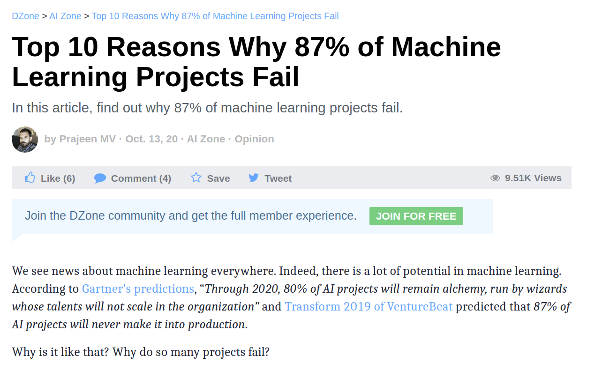
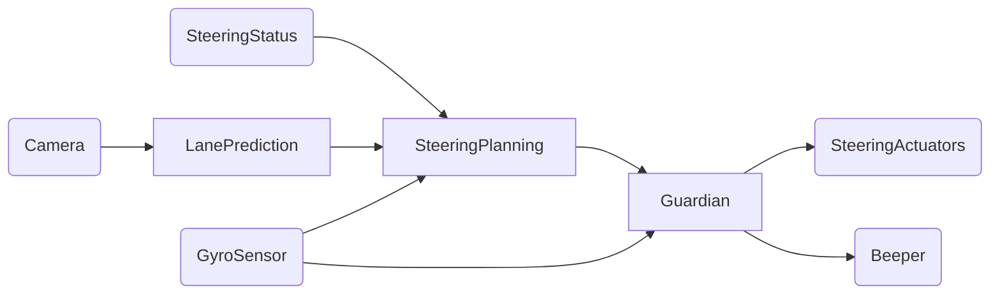
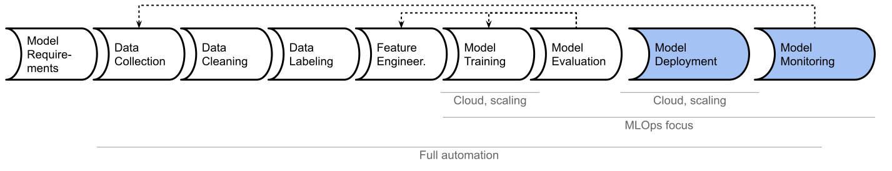
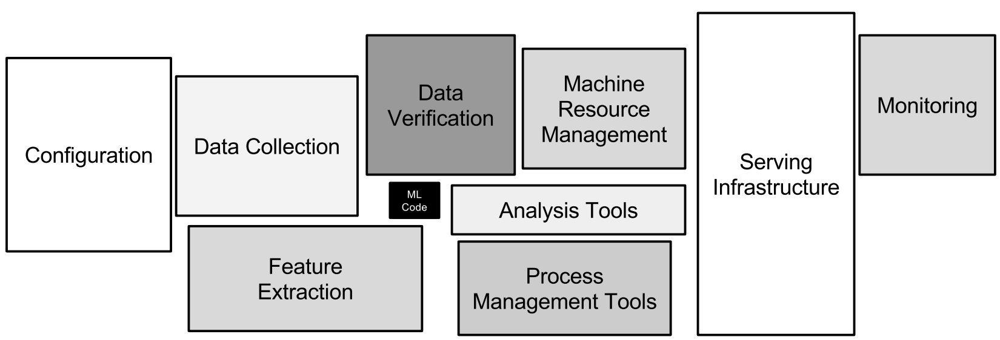
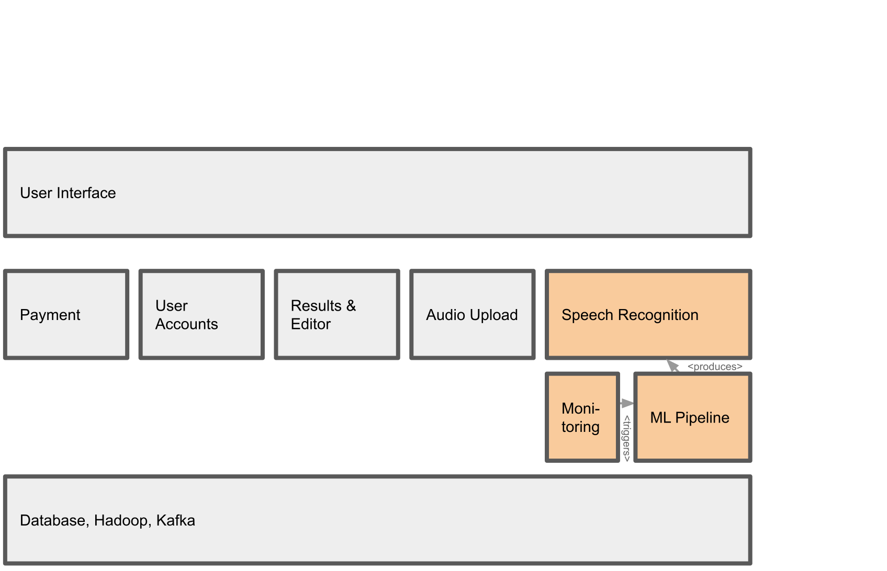
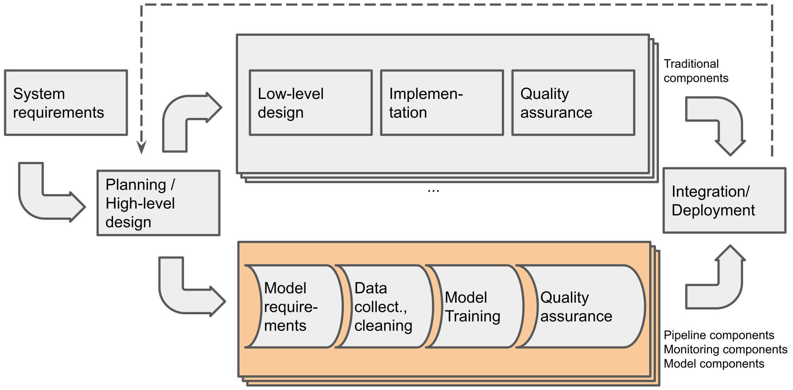

# Moving ML Projects 
# into Production 
# with Interdiscipl. Teams

Christian Kästner

Carnegie Mellon University


https://github.com/ckaestne/seai


---


<!-- split -->
## Christian Kästner

Associate Professor 

Director of SE PhD Prog. 

@ Carnegie Mellon University

**  

Background and interests:
* Software Engineering
* Highly-Configurable Systems & Configuration Engineering
* Software Engineering for ML-Enabled Systems


---

## Building Production Systems 
## with Machine Learning

> Building, operating, and maintaining software systems with machine-learned components
> 
> with interdisciplinary collaborative teams of 
**data scientists** and **software engineers** 


----
## Beyond Building Models


----
## Production ML Systems


----
## Production ML Systems


----
## Production ML Systems


[temi.com](https://www.temi.com/)


----


<!-- .element: class="plain" -->

----


<!-- .element: class="plain" -->


----
# From Prototype to Production

[](https://dzone.com/articles/top-10-reasons-why-87-of-the-machine-learning-proj)

https://dzone.com/articles/top-10-reasons-why-87-of-the-machine-learning-proj

---

<svg version="1.1" viewBox="0.0 0.0 800 400" xmlns:xlink="http://www.w3.org/1999/xlink" xmlns="http://www.w3.org/2000/svg">
	<style>
    text { font: 60px sans-serif; }
  	</style>
	<circle r="180" cx="180", cy="200" fill="#b9ff00" fill-opacity="0.514" />
	<circle r="180" cx="620", cy="200" fill="#ff5500" fill-opacity="0.514" />
	<text x=180 y=160 dominant-baseline="middle" text-anchor="middle">Data</text>
	<text x=180 y=240 dominant-baseline="middle" text-anchor="middle">Scientists</text>
	<text x=620 y=160 dominant-baseline="middle" text-anchor="middle">Software</text>
	<text x=620 y=240 dominant-baseline="middle" text-anchor="middle">Engineers</text>
</svg>

and domain experts + lawyers + operators + security experts + regulators + ...

----
## Software Engineering

> Software engineering is the branch of computer science that creates practical, cost-effective solutions to computing and information processing problems, preferentially by applying scientific knowledge, developing software systems in the service of mankind. 

Engineering judgements under limited information and resources

A focus on design, tradeoffs, and the messiness of the real world

Many qualities of concern: cost, correctness, performance, scalability, security, maintainability, ...


**"it depends..."**


<!-- references -->
Mary Shaw. ed. [Software Engineering for the 21st Century: A basis for rethinking the curriculum](https://www.cs.cmu.edu/~Compose/SEprinciples-pub-rev2.pdf). 2005.


----
## Most ML Courses/Talks

Focus narrowly on modeling techniques or building models

Using notebooks, static datasets, evaluating accuracy

Little attention to software engineering aspects of building complete systems


----
## Data scientist

* Often fixed dataset for training and evaluation (e.g., PBS interviews)
* Focused on accuracy
* Prototyping, often Jupyter notebooks or similar 
* Expert in modeling techniques and feature engineering
* Model size, updateability, implementation stability typically does not matter
* Starting to worry about fairness, robustness, ...

<!-- split -->

## Software engineer

* Builds a product
* Concerned about cost, performance, stability, release time
* Identify quality through customer satisfaction
* Must scale solution, handle large amounts of data
* Plan for mistakes and safeguards
* Maintain, evolve, and extend the product over long periods
* Consider requirements for security, safety, fairness

----

<svg version="1.1" viewBox="0.0 0.0 800 400" xmlns:xlink="http://www.w3.org/1999/xlink" xmlns="http://www.w3.org/2000/svg">
	<style>
    text { font: 60px sans-serif; }
  	</style>
	<circle r="180" cx="180", cy="200" fill="#b9ff00" fill-opacity="0.514" />
	<circle r="180" cx="620", cy="200" fill="#ff5500" fill-opacity="0.514" />
	<text x=180 y=160 dominant-baseline="middle" text-anchor="middle">Data</text>
	<text x=180 y=240 dominant-baseline="middle" text-anchor="middle">Scientists</text>
	<text x=620 y=160 dominant-baseline="middle" text-anchor="middle">Software</text>
	<text x=620 y=240 dominant-baseline="middle" text-anchor="middle">Engineers</text>
</svg>

----


----


<!-- .element: class="plain" -->


---

# Part 1:

# How does Machine Learning change Software Engineering?


----
## What's different?


* Missing specifications
* Environment is important (feedback loops, data drift)
* Nonlocal and nonmonotonic effects 
* Data is central and BIG
* ...


----
## Managing Complexity in Software

* **Abstraction**: Hide details & focus on high-level behaviors
* **Reuse**: Package into reusable libraries & APIs with well-defined _contracts_
* **Composition**: Build large components out of smaller ones

```java
/**
 * compute deductions based on provided adjusted 
 * gross income and expenses in customer data.
 *
 * see tax code 26 U.S. Code A.1.B, PART VI
 *
 * Adjusted gross income must be positive; 
 * returned deductions are not negative.
 */
float computeDeductions(float agi, Expenses expenses) {
  ...
}
```

----
## Divide and Conquer

* Human cognitive ability is limited
* Decomposition of software necessary to handle complexity
* Allows division of labor
* Deductive reasoning, using logic
* Testing each component against its specification


```java
//@ requires x >= 0.0;
/*@ ensures JMLDouble.approximatelyEqualTo(x, 
  @                                        \result * \result, 
  @                                        eps);
  @*/
public static double sqrt(double x) {
	/*...*/
}
  ```

----
## ML: Missing Specifications

*from deductive to inductive reasoning, from specs to examples*

```java
/**
  ????
*/
String transcribe(File audioFile);
```

```java
/**
  ????
*/
Boolean predictRecidivism(int age, 
                          List<Crime> priors, 
                          Gender gender, 
                          int timeServed,
                          ...);
```

```java
/**
  ????
*/
Boolean hasCancer(byte[][] image);
```


----


> All models are approximations. Assumptions, whether implied or clearly stated, are never exactly true. **All models are wrong, but some models are useful**. So the question you need to ask is not "Is the model true?" (it never is) but "Is the model good enough for this particular application?" -- George Box


<!-- references -->
See also https://en.wikipedia.org/wiki/All_models_are_wrong


----
## Non-ML Example: Newton's Laws of Motion

> 2nd law: "the rate of change of momentum of a body over time is directly proportional to the force applied, and occurs in the same direction as the applied force" 
> ${\displaystyle \mathbf {F} ={\frac {\mathrm {d} \mathbf {p} }{\mathrm {d} t}}}$

"Newton's laws were verified by experiment and observation for over 200 years, and they are excellent approximations at the scales and speeds of everyday life."

Do not generalize for very small scales, very high speeds, or in very strong gravitational fields. Do not explain semiconductor, GPS errors, superconductivity, ... Those require general relativity and quantum field theory.

<!-- references -->
Further readings: https://en.wikipedia.org/wiki/Newton%27s_laws_of_motion

----

## Consequence: ML as Unreliable Components
 


<!-- .element: class="stretch plain" -->


----

## Software engineering reality

* Missing and weak specs very common
* Agile methods
* Communication over formal specifications
* Integration and system testing, not just unit testing
* Testing in production
*
* Safe systems from unreliable components
* Safety engineering, risk analysis, mitigation strategies


<!-- references -->
See also Christian Kaestner. ["Machine learning is requirements engineering"](https://medium.com/@ckaestne/machine-learning-is-requirements-engineering-8957aee55ef4). Medium 2020.


----
## ML: Environment is Important 

*(feedback loops, data drift, safety concerns)*


 
----

## Software engineering reality


<!-- .element: class="stretch" -->
(Lufthansa Flight 2904)

----

## Software engineering reality

* The environment is often important
* Most safety concerns stem from interactions between world and machine (Jackson ICSE 95)
* Requirements engineering is essential


<!-- .element: class="plain" -->


----
## ML: Nonlocal and Nonmonotonic Effects

*multiple models in most systems*




----
## Software engineering reality


* Subsystems and plugins may interact in unanticipated ways
* Feature interactions hard to predict
* Software design is important
* System testing is important


<!-- .element: class="stretch" -->


----
## ML: Data is Essential and BIG


<!-- .element: class="stretch plain" --> 

----
## Software engineering reality

* Software architecture and design for scalability
* Distributed systems
* Batch processing, stream processing, lambda architecture
* Databases, big data, cloud infrastructure
* Extensive work on data schema, versioning, and provenance


<!-- .element: class="stretch plain" --> 


----
## So, what's different?


* Missing specifications
* Environment is important (feedback loops, data drift)
* Nonlocal and nonmonotonic effects 
* Data is central and BIG
* ...

*Not all new, but pushing the envelope in system complexity*

----
## My View 

> Developers of simple traditional systems may get away with poor practices,
> but most developers of ML-enabled systems will not.


---

# Part 2:

# From Model to System

Illustrated with *Quality Assurance*


----
# Training a Model

(often in computational notebooks)


<!-- .element: class="plain" -->


----
## CRISP-DM Process Model


<!-- .element: class="stretch plain" -->

----
# Training a Model

(often in computational notebooks)


<!-- .element: class="plain" -->


----
## Traditional Focus: Model Accuracy

* Train and evaluate model on fixed labled data set
* Compare prediction with labels


<!-- .element: class="plain" -->


----


----
## Traditional Focus: Model Accuracy

| | **Actually A** | **Actually not A** |
| --- | --- | --- |
|**AI predicts A** | True Positive (TP) | False Positive (FP) |
|**AI predicts not A** | False Negative (FN) | True Negative (TN) |

Accuary, Recall, Precision, F1-Score

----
## More Traditional Model Quality Discussions

<!-- colstart -->
Many model quality metrics 
(recall, MAPE, ROC, log loss, top-k, ...)


<!-- col -->
Generalization/overfitting (train/test/eval split, crossvalidation)


<small>(CC SA 3.0 by [Dake](https://commons.wikimedia.org/wiki/File:Overfitting.png))</small>

<!-- colend -->


----
## Automating Model Evaluation

* Continuous integration, automated measurement, tracking of results
* Data and model versioning, provenance


<!-- references  -->

Jeremy Hermann and Mike Del Balso. [Meet Michelangelo: Uber’s Machine Learning Platform](https://eng.uber.com/michelangelo/). Blog, 2017


----
## Beyond Accuracy: 
## Quality concerns for ML-Enabled Systems

* Learning time, cost and scalability
* Update cost, incremental learning
* Inference cost
* Size of models learned
* Amount of training data needed
* Fairness
* Robustness
* Safety, security, privacy
* Explainability, reproducibility
* Time to market
* Overall operating cost (cost per prediction)

----


---
# Deploying and Updating Models with Pipelines



<!-- .element: class="plain" -->


Automate each step -- test each step


----
## ML Engineering: Building Pipelines



<!-- .element: class="plain" -->

*(Nowadays, MLOps is shrinking most of these boxes)*
 
<!-- references -->

Source: Sculley, David, Gary Holt, Daniel Golovin, Eugene Davydov, Todd Phillips, Dietmar Ebner, Vinay Chaudhary, Michael Young, Jean-Francois Crespo, and Dan Dennison. "[Hidden technical debt in machine learning systems](https://proceedings.neurips.cc/paper/2015/file/86df7dcfd896fcaf2674f757a2463eba-Paper.pdf)." Advances in neural information processing systems 28 (2015): 2503-2511.

----
## Possible Mistakes in ML Pipelines

Danger of "silent" mistakes in many phases:

* Dropped data after format changes
* Failure to push updated model into production
* Incorrect feature extraction
* Use of stale dataset, wrong data source
* Data source no longer available (e.g web API)
* Telemetry server overloaded
* Negative feedback (telemtr.) no longer sent from app
* Use of old model learning code, stale hyperparameter
* Data format changes between ML pipeline steps
* ...


----
## Quality Assurance for the Entire Pipeline


<!-- .element: class="plain" -->

<!-- references -->

Source: Eric Breck, Shanqing Cai, Eric Nielsen, Michael Salib, D. Sculley. [The ML Test Score: A Rubric for ML Production Readiness and Technical Debt Reduction](https://research.google.com/pubs/archive/46555.pdf). Proceedings of IEEE Big Data (2017)


----
## Pipeline Testing

* Unit tests (e.g., data cleaning)
* End to end pipeline tests
* Testing with stubs, test error handling (e.g., test model redeployment after  dropped connection)
* Test monitoring infrastructure (e.g., "fire drills")
* Chaos engineering


----


---
# Focusing on the System

ML models are "just" one component


----


<!-- .element: class="plain" -->

----


<!-- .element: class="plain" -->


----
## Designing the Right System


----
## Designing the Right System

Radiology example:

Radiologists do not like systems that just automate the simple cases. They can do this themselves. They do not want to be replaced.

To be useful, a system must help in difficult cases with missing information. It needs to provide explanations.

Explanations do not just explain a single prediction, but also how the system works, what information it has access to, how it is calibrated, what limitations it has, ...


----
## Living with Mistakes

> The smart toaster may occasionally burn my toast, but it should not burn down my kitchen.


Notes: A smart toaster may occasionally burn the toast, but it should never burn down the kitchen. The latter can be achieved without relying on perfect accuarcy of a smart component, just stop it when it's overheating.

Plan for mistakes: User interaction, undo, safeguards


----


<!-- .element: class="stretch" -->


----

<!-- colstart -->
## Model Goals

* **Accuracy**
* Fairness
* Low latency
* Low training cost


<!-- col -->
## System Goals

* **Maximizing sales**
* Maximizing community growth
* Retaining customers
* Maximizing engagement time

<!-- colend -->

*A better model will, hopefully, support system goals better*
 

----
## Model Accuracy vs System Goals 


<!-- .element: class="stretch" -->

----
## Model Accuracy vs System Goals 


<!-- .element: class="stretch" -->


----


----

## Testing in Production

**Production data = ultimate unseen data**

Can evaluate system goals, not just model accuracy

Monitoring performance over time, canary releases

Finding and debugging common mistakes

Experimentation with A/B tests


----
## Monitoring Model/System Quality in Production?


----
## Key Design Challenge: Telemetry

* Identify model mistakes in production (“what would have been the right prediction?”)
	* How can we identify mistakes? Both false positives and false negatives?
	* How can we collect feedback without being intrusive (e.g., asking users about every interactions)?
	* How much data are we collecting? Can we manage telemetry at scale? How to sample properly?
	* How do we isolate telemetry for specific AI components and versions?
* Measure system goals in production ("conversion rate")

----

<!-- split -->


Notes:
Expect only sparse feedback and expect negative feedback over-proportionally


----
## Manually Label Production Samples


----


Notes: Can just wait 7 days to see actual outcome for all predictions
----


Notes: Clever UI design allows users to edit transcripts. UI already highlights low-confidence words, can observe changes in editor (UI design encourages use of editor). In addition 5 star rating for telemetry.

----
## Measuring Model Quality with Telemetry

* Telemetry can provide insights for correctness
    - sometimes very accurate labels for real unseen data
    - sometimes only mistakes
    - sometimes indicates severity of mistakes
    - sometimes delayed
    - often just samples, may be hard to catch rare events
    - often just weak proxies for correctness
* Often sufficient to approximate precision/recall or other measures
* Mismatch to (static) evaluation set may indicate stale or unrepresentative test data
* Trend analysis can provide insights even for inaccurate proxy measures

----
## Monitoring Model Quality in Production

* Watch for jumps after releases
    - roll back after negative jump
* Watch for slow degradation
    - Stale models, data drift, feedback loops, adversaries
* Debug common or important problems
    - Mistakes uniform across populations?
    - Challenging problems -> refine training, add regression tests

----
## Engineering Challenges for Telemetry


----
## Recap: From Model to System

* Plan the entire system, not just a model
* Requirements engineering + UX for the system is important
* Identify relevant qualities beyond accuracy, plan and test models accordingly
* Design for telemetry


---
# Part 3: Interdisciplinary Teams


----

<svg version="1.1" viewBox="0.0 0.0 800 400" xmlns:xlink="http://www.w3.org/1999/xlink" xmlns="http://www.w3.org/2000/svg">
	<style>
    text { font: 60px sans-serif; }
  	</style>
	<circle r="180" cx="180", cy="200" fill="#b9ff00" fill-opacity="0.514" />
	<circle r="180" cx="620", cy="200" fill="#ff5500" fill-opacity="0.514" />
	<text x=180 y=160 dominant-baseline="middle" text-anchor="middle">Data</text>
	<text x=180 y=240 dominant-baseline="middle" text-anchor="middle">Scientists</text>
	<text x=620 y=160 dominant-baseline="middle" text-anchor="middle">Software</text>
	<text x=620 y=240 dominant-baseline="middle" text-anchor="middle">Engineers</text>
</svg>

----

<svg version="1.1" viewBox="0.0 0.0 800 400" xmlns:xlink="http://www.w3.org/1999/xlink" xmlns="http://www.w3.org/2000/svg">
	<style>
    text { font: 60px sans-serif; }
  	</style>
	<circle r="180" cx="250", cy="200" fill="#b9ff00" fill-opacity="0.514" />
	<circle r="180" cx="550", cy="200" fill="#ff5500" fill-opacity="0.514" />
	<text x=230 y=160 dominant-baseline="middle" text-anchor="middle">Data</text>
	<text x=230 y=240 dominant-baseline="middle" text-anchor="middle">Scientists</text>
	<text x=570 y=160 dominant-baseline="middle" text-anchor="middle">Software</text>
	<text x=570 y=240 dominant-baseline="middle" text-anchor="middle">Engineers</text>
</svg>


----

<!-- .element: class="stretch" -->


----


<!-- .element: class="stretch plain" -->

Based on Ryan Orban. [Bridging the Gap Between Data Science & Engineer: Building High-Performance Teams](https://www.slideshare.net/ryanorban/bridging-the-gap-between-data-science-engineer-building-highperformance-teams/3-Software_Engineer_Data_Engineer_Data). 2016


----
## T-Shaped People

*Broad-range generalist + Deep expertise*


<!-- .element: class="stretch plain" -->

Figure: Jason Yip. [Why T-shaped people?](https://medium.com/@jchyip/why-t-shaped-people-e8706198e437). 2018
 

----
## Model first or system first?


<!-- .element: class="plain" -->

<!-- references -->

More details: Christian Kaestner. [On the process for building software with ML components](https://ckaestne.medium.com/on-the-process-for-building-software-with-ml-components-c54bdb86db24). Medium 2020

----
## Siloing is Bad

* *We do not have clean interfaces between ML and non-ML components*
* Divide and conquer and information hiding *on hard mode*
* Foster collaboration among teams, mix teams, avoid silos


<!-- .element: class="stretch plain" -->


----

## Let's Learn from DevOps


Distinct roles and expertise, but joint responsibilities, joint tooling

----
## Toward Better ML-Systems Engineering

Interdisciplinary teams, split expertise, but joint responsibilities

Joint vocabulary and tools

Foster system thinking

Awareness of production quality concerns

Perform risk + hazard analysis


----


<svg version="1.1" viewBox="0.0 0.0 800 400" xmlns:xlink="http://www.w3.org/1999/xlink" xmlns="http://www.w3.org/2000/svg">
	<style>
    text { font: 60px sans-serif; }
  	</style>
	<circle r="180" cx="250", cy="200" fill="#b9ff00" fill-opacity="0.514" />
	<circle r="180" cx="550", cy="200" fill="#ff5500" fill-opacity="0.514" />
	<text x=230 y=160 dominant-baseline="middle" text-anchor="middle">Data</text>
	<text x=230 y=240 dominant-baseline="middle" text-anchor="middle">Scientists</text>
	<text x=570 y=160 dominant-baseline="middle" text-anchor="middle">Software</text>
	<text x=570 y=240 dominant-baseline="middle" text-anchor="middle">Engineers</text>
</svg>


---
## Readings

All lecture material: https://github.com/ckaestne/seai

Annotated bibliography: https://github.com/ckaestne/seaibib

Essays and book chapters: https://ckaestne.medium.com/


<!-- split -->

Best book on the topic out there:


---
## Moving Machine Learning Projects into Production with Interdisciplinary Teams

* Building, operating, and maintaining systems with ML component
* Data scientists and software engineers have different expertise, both needed
* Need to consider entire system, not just model, e.g. in testing:
	- Model accuracy, blackbox testing, test automation
	- Testing and automating the entire ML pipeline
	- Understanding and testing system qualities
	- Design for mistakes
	- Testing in production with telemetry
* Interdisciplinary teams, T-shaped people, and joint vocabulary


kaestner@cs.cmu.edu -- [@p0nk](https://twitter.com/p0nk) -- https://github.com/ckaestne/seai/
