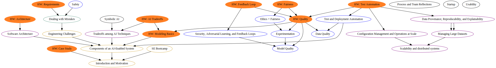

# 17-445/645 Software Engineering for AI-Enabled Systems -- Learning Goals

## Overview

 
 
## Lecture: Introduction and Motivation

Content:

* Lecture illustrates traditional view of machine learning and contrasts it with the challenges of building systems. Characterizes stakeholders involved and their goals. Overview of qualities. Outlines challenges to be discussed
* Inductive vs deductive reasoning
* Technical debt
* Brief distinction AI vs ML and typical classes of AI components
* Key distinction specifications vs learning from data, but also success in engineering systems from imprecise specifications and unreliable components
* Common problems with notebook-style model development
* Syllabus and class structure

Learning goals:

* Explain the typical machine-learning process
* Illustrate the challenges in engineering an AI-enabled system beyond accuracy
* Summarize the respective goals and challenges of software engineers vs data scientists

Assignment:

* Case study analysis of a troubled ML project, e.g., 
  - 🗎 Sculley, D., Matthew Eric Otey, Michael Pohl, Bridget Spitznagel, John Hainsworth, and Yunkai Zhou. "Detecting adversarial advertisements in the wild." In Proceedings of the 17th ACM SIGKDD international conference on Knowledge discovery and data mining, pp. 274-282. ACM, 2011.

## Lecture: Components of an AI-Enabled System

Overview:

* Components and corresponding challenges (experience, intelligence, orchestration) within a larger system architecture
* Overview of design options and automation degrees, e.g., forcefulness of the experience
* Steps of the ML pipeline, including design options and automation -- using end to end scenario

Learning goals:

* Describe the components of a typical machine learning pipeline and their responsibilities and challenges
* Describe the typical components relating to AI in an AI-enabled system and typical design decisions to be made
* Illustrate the design space for AI-enabled systems for a given sample system

Assignment:

* Build a simple predictive ML model to gain experience with all involved steps; build a simple user frontend

Readings:

* 🕮 Hulten, Geoff. "Building Intelligent Systems: A Guide to Machine Learning Engineering." (2018), Chapters 2, 5 and 20.

## Lecture: Software Engineering Bootcamp

Overview:

* Process
* Good engineering practices
  * Code, configuration, and data versioning
  * Working with version control: good commit practices, branches vs feature flags, ...
  * Documentation, naming
  * Issue tracking, task planning
* Crash course in planning, requirements, and design
* Qualities of interest
* Agile practices in a nutshell

## Lecture: Engineering Challenges for AI-Enabled Systems

Overview:

* Deductive vs inductive reasoning
* Notions of correctness: Specifications, goals
* Desired qualities beyond accuracy
* Information hiding, modularity, and leaking abstractions
* Interactions and the environment
  - The world and the machine
  - Data drift, feedback loops, and adversaries
  - Compositionality challenges
* Live data, continuous maintenance
* Focus on data, but don't ignore the code
  * Technical debt 
  * Pipeline quality
  * Robustness
* Versioning, data provenance, and explainability
* Introduction to measurement
* Case study: AI-components in cars

Learning goals:

* Illustrate the challenges of building AI-enabled systems
* Identify system goals and design and validate measures to judge system success for a given system

Reading:

* 🗎 Arpteg, Anders, Björn Brinne, Luka Crnkovic-Friis, and Jan Bosch. "Software Engineering Challenges of Deep Learning." In 2018 44th Euromicro Conference on Software Engineering and Advanced Applications (SEAA), pp. 50-59. IEEE, 2018. 
* 🕮 Hulten, Geoff. "Building Intelligent Systems: A Guide to Machine Learning Engineering." (2018), Chapter 4.

## Lecture: Requirements and Dealing with Mistakes

Overview:

* Specifications or lack thereof for ML-components, deductive reasoning, probabilistic specifications in certain AI components; inevitability 
* Goals of AI-enabled systems and success measures (intro, more later in model quality)
* Introduction to risk analysis and fault trees; writing of requirements
* Overview of fault handling strategies (redundancies, voting, fallback, undo, forcefulness, where and when to ask for human judgment...)

Learning goals:

* Analyze the number of ways a mistake in an AI component can influence the behavior of a system
* Evaluate risk of a mistake from the AI component using fault trees
* Design and justify a mitigation strategy for a concrete system

Assignment:

* Write requirements and plan mechanisms for dealing with mistakes; set system goals and define success measures; perform risk analysis

Readings:

* 🕮 Hulten, Geoff. "Building Intelligent Systems: A Guide to Machine Learning Engineering." (2018), Chapters 6--8, and 24.
* 🗎 Zinkevich. Rules of Machine Learning: Best Practices for ML Engineering. https://developers.google.com/machine-learning/guides/rules-of-ml/

## Lecture: Tradeoffs among AI Techniques (2 lectures)

Overview:

* Survey quality attributes of interest (e.g., accuracy, model size, inference time, learning time, robustness)
* Survey of ML and symbolic AI techniques and their tradeoffs

Learning goals:

* Describe the most common models and learning strategies used for AI components and summarize how they work
* Organize and prioritize the relevant qualities of concern for a given project
* Plan and execute an evaluation of the qualities of alternative AI components for a given purpose

Assignment:

* Present tradeoff analysis among two techniques (prepare blog post + short presentation); for a given dataset evaluate which technique is more suitable after measuring various qualities; find an alternative task for which the other technique is more suitable

## Lecture: Software Architecture of AI-enabled Systems

Overview:

* Introduction to software architecture and domain-specific modeling
* Modularity, encapsulation, model composition, design for robustness
* Abstraction techniques for hardware, software and data change
* Architecture case study: Model updates
  * Importance of model updates; threats from stale data and data drift
  * Architectural discussions: when to learn, incremental vs from scratch, where the model lives, costs for updates vs costs from stale models, client-side vs server-side models vs hybrid approaches
* AI as a service
* Cost of data and feature extraction (deciding what data/features and how much)

Learning goals:

* Create an architectural model describing the relevant characteristics to reason about update frequency and costs
* Critique the decision of where an AI model lives (e.g., cloud vs edge vs hybrid), considering the relevant tradeoffs 

Readings:

* Rick Kazman, Paul Clements, and Len Bass. [Software architecture in practice.](https://www.oreilly.com/library/view/software-architecture-in/9780132942799/?ar) Addison-Wesley Professional, 2012, Chapter 1
* 🕮 Hulten, Geoff. "Building Intelligent Systems: A Guide to Machine Learning Engineering." (2018), Chapter 13

## Lecture: Model Quality

Overview:

* Goals and measurement
* Metrics and experimental designs to assess model quality, including measures beyond accuracy and RUC; assessment on static datasets vs live data
* Challenge of getting test data
* *Telemetry* designs to assess model quality in production (and related design tradeoffs)
* Data drift, stale models, and methods to detect 
* Automated assessment, dashboards, continuous integration, continuous experimentation
* Notions of test suits and coverage for models (e.g., test by population segment)
* Comparison against heuristics approaches

Learning goals:

* Identify and describe the goals of an AI component and define outcome quality measures
* Explain the limits of evaluating model quality on a static dataset and design telemetry for assessment in production
* Assess model quality with suitable measures and compare quality of multiple models
* Design a test suite for assuring model quality
* Develop automated solutions to evaluate and monitor model quality

Readings:

* 🕮 Hulten, Geoff. "Building Intelligent Systems: A Guide to Machine Learning Engineering." (2018), Chapters 15 (Intelligent Telemetry) and 19-20 (Evaluating Intelligence).

## Lecture: Experimentation

Overview:

* Introduction to the scientific method (experimental design, statistical tests, causality)
* Offline experimentation
  * Introduction to *sensitivity analysis*
  * Use cases regarding robustness, bias, performance and hyperparameter tuning, ...
  * Sampling in high-dimensional spaces
* Online experimentation
  * Testing in production, chaos engineering
  * *A/B testing*
  * Necessary statistics foundation
  * Concurrent A/B tests
* Infrastructure for experimentation, planning and tracking experiments
* Interacting with and supporting data scientists

Learning goals:

* Plan and execute experiments (chaos, A/B, ...) in production
* Conduct and evaluate multiple concurrent A/B tests in a system
* Examine experimental results with statistical rigor
* Perform sensitivity analysis in large configuration/design spaces

Assignment:

* Design an experimentation platform that 
   (a) performs automated tests offline, (b) tracks experiments and their results, (c) compares model quality using suitable measures

Readings:

* Todo (on A/B testing and corresponding statistics)

## Lecture: Data Quality

Overview:

* Introduction to *data cleaning*
* Introduction to *data schema* (databases, xml, Avro, ...) and unit testing for data
* Comparing data distributions and detecting data drift
* Quality assurance for the data processing pipelines
* Measures of noise, accuracy, and precision, and consequences for AI components (robustness)

Learning goals:

* Design and implement automated quality assurance steps that check data schema conformance and distributions 
* Devise thresholds for detecting data drift and schema violations
* Describe common data cleaning steps and their purpose and risks
* Evaluate the robustness of AI components with regard to noisy or incorrect data

Readings:

* 🗎 Schelter, S., Lange, D., Schmidt, P., Celikel, M., Biessmann, F. and Grafberger, A., 2018. Automating large-scale data quality verification. Proceedings of the VLDB Endowment, 11(12), pp.1781-1794.
* 🗎 The Data Linter: Lightweight Automated Sanity Checking for ML Data Sets. Nick Hynes, D. Sculley, Michael Terry  NIPS Workshop on ML Systems (2017)

## Lecture: Test and Deployment Automation

Overview:

* Unit testing vs integration testing vs system testing
* Testing all parts of the ML-pipleline
* Test automation with *Continuous Integration* tools
* Performance testing and performance regression testing
* Introduction to DevOps and Continuous Deployment
* *Canary releases* and rolling releases
* *Feature flags* and corresponding infrastructure
* Code reviews
* Unit vs system testing: local improvements may degrade overall system performance
 

Learning goals:

* Deploy a service for models using container infrastructure
* Design and implement an infrastructure canary/rolling releases using feature flags
* Implement and automate tests for all parts of the ML pipeline

Assignment:

* Design a pipeline to build, evaluate, and serve models that (a) performs automated tests offline, (b) rolls out models incrementally and rolls back a model automatically if it performs poorly, (c) enables experimentation, (d) detects and reports data quality issues and data drift, and (e) provides a monitoring dashboard and sends alerts

Reading:

* 🗎 Eric Breck, Shanqing Cai, Eric Nielsen, Michael Salib, D. Sculley. The ML Test Score: A Rubric for ML Production Readiness and Technical Debt Reduction. Proceedings of IEEE Big Data (2017)

## Lecture: Ethics + Fairness

Overview:

* Introductions to ethics
* Overview of notions of *bias and fairness* and corresponding measures
* Techniques for detecting bias, fairness testing
* Overview of possible interventions to reduce or mitigate bias

Learning goals:

* Review the importance of ethical considerations in designing AI-enabled systems
* Recall basic strategies to reason about ethical challenges
* Diagnose potential ethical issues in a given system
* Design and execute tests to check for bias/fairness issues
* Evaluate and apply mitigation strategies

Assignment:

* Analyze a given component for potential bias, design a mitigation, and deploy automated tests 

Readings:

* todo (one case study of a problem, one paper formally discussion notions of bias/fairness)

## Lecture: Safety

Overview:

* Introduction to safety and ethics; safety vs reliability
* Introduction to *hazard analysis* (requirements)
* Safety concerns in everyday applications
* Architectural safety tactics -- how to build safe systems from unreliable components
* Introduction to assurance cases and software certification; evidence collection for safety claims

Learning goals:

* Perform a hazard analysis for a system to derive safety requirements
* Diagnose potential safety issues in a given system
* Collect evidence and sketch an argument for a safety case
* Design architectural safeguards against safety-relevant mistakes from AI components
* Describe the typical processes for safety evaluations and their limitations

Assignment: (?)

* Perform a hazard analysis of a given system, identify suitable mitigations, and sketch an argument for a safety case

Readings:

* todo

## Lecture: Security, Adversarial Learning, and Feedback Loops

Overview:

* Attack scenarios against AI components and possible defenses
* Basics of adversarial learning techniques
* Feedback loops and how to detect them
* Dangers of leaking sensitive data, deanonymization, and *differential privacy*
* *Threat modeling*
* Overview of common security patterns/tactics
* Anomaly detection, intrusion detection
* Fuzzing and test case generation; overview of formal techniques
* Process and team considerations for security

Learning goals:

* Describe common attacks against AI component 
* Conduct threat modeling for a given system and derive security requirements
* Suggest counter measures against attacks for specific systems
* Discuss challenges in anonymizing data 

Reading:

* 🕮 Hulten, Geoff. "Building Intelligent Systems: A Guide to Machine Learning Engineering." (2018), Chapter 25
* todo (case study)

## Lecture: Scalability and Distributed Systems 

Overview:

* Survey of scalability challenges for learning and serving in AI-enabled systems
* Introduction to distributed systems and corresponding challenges (faults, consistency, atomicity, ...)
* Overview of common architectures and tactics for scalability (faster computers to clusters of commodity hardware)
* Software architecture modeling and analysis for performance and scalability
* Overview of common abstractions and designs, including reusable open-source infrastructure

Learning goals:

* Summarize the challenges of distributed systems
* Outline strategies to scale systems and their tradeoffs
* Diagnose bottlenecks with architectural modeling and identify which parts of a system can be parallelized
* Recommend suitable abstractions for scaling a given system

Readings:

* todo

## Lecture: Managing and Processing Large Datasets

Overview:

* Introduction to data storage strategies and their tradeoffs
* Schema vs noschema storage (data lakes)
* Overview of common technologies (relational databases, NoSQL storage, OLAP/OLTP, streaming systems, replication and partitioning)
* Design considerations: mutable vs immutable data
* Common design patterns (e.g., batch processing, stream processing, lambda architecture)
* Distributed logging, feature extraction, and learning, including open-source frameworks

Learning goals:

* 🗎 Organize different data management solutions and their tradeoffs
* 🗎 Recommend and justify a design and corresponding technologies for a given system

Readings:

* todo

## Lecture: Data Provenance, Reproducability, and Explainability

Overview:

* Goal: Explaining why decisions have been made
* Stacking and composing AI components
* Documenting and tracking data provenance (modeling), "visibility debt", techniques for automated tracking
* Versioning of code, data, and models
* Logging and audit traces
* Explanatory power of different AI techniques, retrofitting explanations
* Strategies for debugging in big-data applications

Learning goals:

* Judge the importance of data provenance, reproducibility and explainability for a given system
* Create documentation for data dependencies and provenance in a given system
* Propose versioning strategies for data and models
* Test systems for reproducibility

Readings:

* 🗎 Halevy, Alon, Flip Korn, Natalya F. Noy, Christopher Olston, Neoklis Polyzotis, Sudip Roy, and Steven Euijong Whang. "Goods: Organizing google's datasets." In Proceedings of the 2016 International Conference on Management of Data, pp. 795-806. ACM, 2016.
* 🗎 Gulzar, Muhammad Ali, Matteo Interlandi, Tyson Condie, and Miryung Kim. "Debugging big data analytics in spark with bigdebug." In Proceedings of the 2017 ACM International Conference on Management of Data, pp. 1627-1630. ACM, 2017.
* 🕮 Hulten, Geoff. "Building Intelligent Systems: A Guide to Machine Learning Engineering." (2018), Chapter 21

## Lecture: Configuration Management and Operations at Scale

Overview:

* Managing computing resources, own and cloud resources
* Automated configuration management challenges and tools (Kubernetis, puppet, ansible)
* Overview of cloud infrastructure services (containers, serverless, app engines, ...) and relevant tradeoffs
* Version control strategies, feature flags vs branches, dependency management
* Introduction to logging and analysis at scale
* Debugging and monitoring tools for distributed systems and for AI components, including latency and resource consumption; deciding when to send alerts and how
* Runtime adaptation and self-adaptive systems

Learning goals:

* Describe common deployment options and their tradeoffs
* Design and justify a scalable deployment strategy for a given system
* Automate common configuration management tasks
* Devise a monitoring strategy and suggest suitable components for implementing it
* Diagnose common operations problems

Readings:

* 🕮 Hulten, Geoff. "Building Intelligent Systems: A Guide to Machine Learning Engineering." (2018), Chapters 23, 24.
* 🗎 The ML Test Score: A Rubric for ML Production Readiness and Technical Debt Reduction. Eric Breck, Shanqing Cai, Eric Nielsen, Michael Salib, D. Sculley  Proceedings of IEEE Big Data (2017)

## Lecture: Process and Team Reflections

Overview:

* Different roles in developing AI-enabled systems and their respective goals and concerns
* Communication strategies for cross-disciplinary teams
	- Understand basic management, engineering, science, and operations mindsets
  - Experimentation (notebooks) vs production
	- Going beyond accuracy
	- Communicating the importance of process
* Agile techniques in AI-enabled systems
* Setting goals and expectations: effort estimation, exploratory + iterative processes
* Technical debt 

Learning goals:

* Plan development activities in an inclusive fashion for participants in different roles
* Describe agile techniques to address common process and communication issues
* Diagnose technical debt in a given system and propose a system to track, assess and remove technical debt

Readings:

* 🗎 todo (on data scientist role)
* 🗎 Zinkevich. Rules of Machine Learning: Best Practices for ML Engineering. https://developers.google.com/machine-learning/guides/rules-of-ml/ 

## Lecture: Planning an AI-Enabled Product in a Startup

todo (guest lecture Michael Hilton)

## Lecture: Usability

todo

## Lecture: Symbolic AI in Systems

todo

* Machine learning vs symbolic AI
* Guarantees and their limits
* Probabilistic reasoning and probabilistic guarantees
* Implications for system design
  - Safety
  - Security

## Lecture: AI Engineering for Self-Driving Cars

todo

