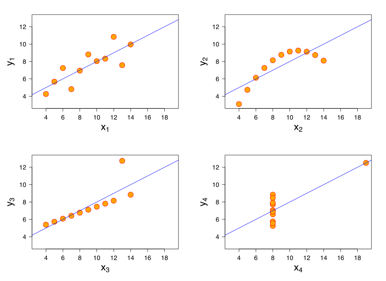
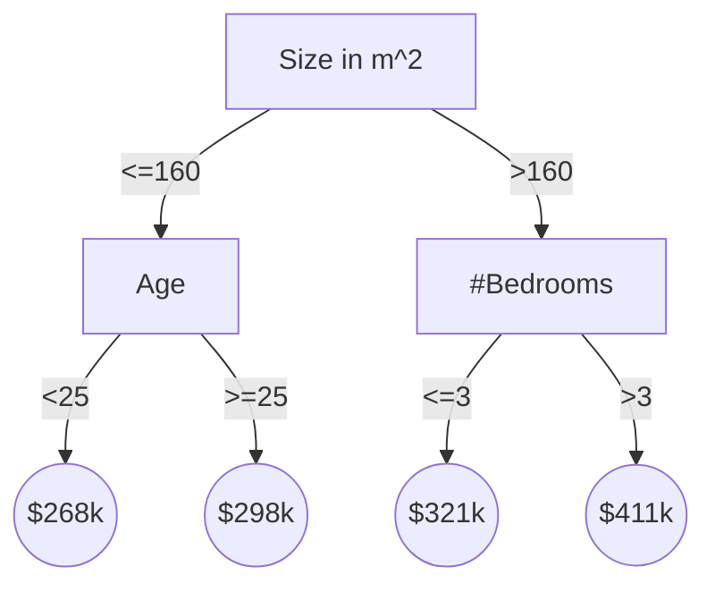
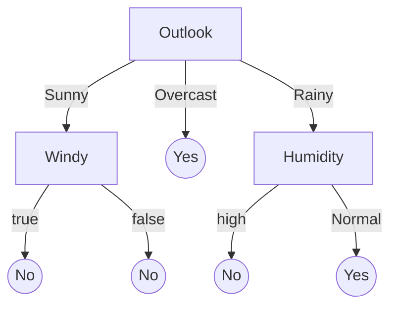
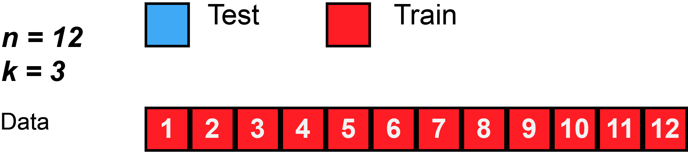

# Disclaimer

If you are familiar with supervised machine learning and have used notebooks and scikit-learn before for a class or project, you will probably not learn much new today. Sorry

Next lecture deep learning and symbolic AI.

---

# Learning goals

* Understand how machine learning learns models from labeled data (basic mental model)
* Explain the steps of a typical machine learning pipeline and their responsibilities and challenges
* Understand the role of hyper-parameters
* Appropriately use vocabulary for machine learning concepts
* Apply steps of a machine-learning pipeline to build a simple model from static labeled data
* Evaluate a machine-learned classifier using cross-validation
* Explain the benefits and drawbacks of notebooks
* Demonstrate effective use of computational notebooks


---

# Machine Learning

> A computer program is said to learn from experience E with respect to some task T and some performance measure P, if its performance on T, as measured by P, improves with experience E. -- [Tom Mitchell, 1997](https://cmu.primo.exlibrisgroup.com/permalink/01CMU_INST/1feg4j8/alma991003098569704436)


----

## Defining Machine Learning (simplified)

learn a function (called model)

$f(x_1, x_2, x_3, ..., x_n) \rightarrow y$

by observing data

**Examples:**
* Detecting cancer in an image
* Transcribing an audio file
* Detecting spam
* Predicting recidivism
* Detect suspicious activity in a credit card

Typically used when writing that function manually is hard because the problem is hard or complex.


----
## Running Example: House Price Analysis

Given data about a house and its neighborhood, what is the likely sales price for this house?

$f(size, rooms, tax, neighborhood, ...) \rightarrow price$


<!-- .element: class="stretch" -->


----

## Supervised Machine Learning

Given a training dataset containing instances $(x_{1,i}, ..., x_{n,i}, y_i)$ 

which consists of features $x_1, ..., x_n$ and a corresponding outcome label $y$, 

learn a function $f(x_1, ..., x_n) \rightarrow y$ 

that "fits" the given training set and "generalizes" to other data.


----
## Training Data for House Price Analysis

Collect data from past sales

| Crime Rate | %Large Lots | %Industrial | Near River | # Rooms | ... | Price |
| - | - | - | - | - | - | - |
| 0.006 | 18 | 2.3|  0 | 6 | ... | 240.000 |
| 0.027 | 0  | 7.0 | 0 | 6 | ... | 216.000 |
| 0.027 | 0  | 7.0 | 0 | 7 | ... | 347.000 |
| 0.032 | 0  | 2.1 | 0 | 6 | ... | 334.000 |
| 0.069 | 0  | 2.1 | 0 | 7 | ... | 362.000 |

----
## Common Datastructures: Dataframes

* Tabular data, 2 dimensional
* Named columns
* Heterogeneous data: different types per column

<!-- python-repl -->
```py 
>>> d = {'x1': [1, 2], 
         'x2': ["overcast", "sunny"], 
         'y': [True, False]}
>>> df = pd.DataFrame(data=d)
>>> df
   x1        x2      y
0   1  overcast   True
1   2     sunny  False
>>> df.dtypes
x1     int64
x2    object
y       bool
dtype: object
```


----
## Linear Regression

$f(x) = \alpha + \beta*x$


Notes: One well known learning technique is linear regression.
In the one-dimensional case, it simply fits a function
$f(x) = \alpha + \beta*x$ to best explain all given data points
(technically to minimize some error between f(x) and y across
all given (x, y) pairs, e.g. sum of squared errors)

----
## Linear Regression

$f(x) = \alpha + \beta_1 * x_1 + \beta_2 * x_2 + ... +  + \beta_n * x_n$


<!-- references -->
Graphic by [ivanmp](https://stackoverflow.com/questions/26431800/plot-linear-model-in-3d-with-matplotlib), CC BY-SA 3.0.

Notes: This generalizes to many dimensions (and also interactions),
though this will be hard to visualize.

----
## Does it learn?



<!-- references -->
Graphic by Schutz, distributed under CC BY-SA 3.0

Many different strategies to learn function $f(x_1, ..., x_n) \rightarrow y$ 


---
# Learning with Decision Trees



Note: We are using decision trees as an example of a simple
and easy to understand learning algorithm. It is worth to
understand at least one learning approach in some detail, to 
get an intutive sense of the functioning and limitations of 
machine learning. Also this example will illustrate the role of
hyperparameters and how they relate to overfitting/underfitting.

----
## Decision Trees
<!-- colstart -->
<!-- small -->
| Outlook | Temperature | Humidity | Windy | Play |
| - | - | - | - | - |
| overcast | hot  |  high   |  false |    yes |
| overcast | hot  |  high   |  false |    no |
| overcast | hot  |  high   |  false |    yes |
| overcast | cool |  normal |  true |       yes |
| overcast | mild |  high   |  true|     yes |
| overcast | hot  |  normal |  false |   yes |
| rainy    | mild |  high   |  false | yes |
| rainy    | cool |  normal |  false | yes |
| rainy    | cool |  normal |  true |  no |
| rainy    | mild |  normal |  false | yes |
| rainy    | mild |  high   |  true |no |
| sunny    | hot  |  high   |  false |  no |
| sunny    | hot  |  high   |  true | no |
| sunny    | mild |  high   |false | no |
| sunny    | cool |  normal |false |   yes |
| sunny    | mild |  normal |  true |   yes |

<!-- col -->
f(Outlook, Temperature, Humidity, Windy) = 



<!-- colend -->

----
## Building Decision Trees
<!-- colstart -->
<!-- small -->
| Outlook | Temperature | Humidity | Windy | Play |
| - | - | - | - | - |
| overcast | hot  |  high   |  false |    yes |
| overcast | hot  |  high   |  false |    no |
| overcast | hot  |  high   |  false |    yes |
| overcast | cool |  normal |  true |       yes |
| overcast | mild |  high   |  true|     yes |
| overcast | hot  |  normal |  false |   yes |
| rainy    | mild |  high   |  false | yes |
| rainy    | cool |  normal |  false | yes |
| rainy    | cool |  normal |  true |  no |
| rainy    | mild |  normal |  false | yes |
| rainy    | mild |  high   |  true |no |
| sunny    | hot  |  high   |  false |  no |
| sunny    | hot  |  high   |  true | no |
| sunny    | mild |  high   |false | no |
| sunny    | cool |  normal |false |   yes |
| sunny    | mild |  normal |  true |   yes |

<!-- col -->

**[demo time](https://github.com/ckaestne/seai/tree/S2020/lectures/02_aibasics1/extras/decisiontree)**

<!-- colend -->


----
## Building Decision Trees
<!-- colstart -->
<!-- small -->
| Outlook | Temperature | Humidity | Windy | Play |
| - | - | - | - | - |
| overcast | hot  |  high   |  false |    yes |
| overcast | hot  |  high   |  false |    no |
| overcast | hot  |  high   |  false |    yes |
| overcast | cool |  normal |  true |       yes |
| overcast | mild |  high   |  true|     yes |
| overcast | hot  |  normal |  false |   yes |
| rainy    | mild |  high   |  false | yes |
| rainy    | cool |  normal |  false | yes |
| rainy    | cool |  normal |  true |  no |
| rainy    | mild |  normal |  false | yes |
| rainy    | mild |  high   |  true |no |
| sunny    | hot  |  high   |  false |  no |
| sunny    | hot  |  high   |  true | no |
| sunny    | mild |  high   |false | no |
| sunny    | cool |  normal |false |   yes |
| sunny    | mild |  normal |  true |   yes |

<!-- col -->

* Identify all possible decisions
* Select the decision that best splits the dataset into distinct outcomes (typically via entropy or similar measure)
* Repeatedly further split subsets, until stopping criteria reached


<!-- colend -->


----
## Overfitting with Decision Trees
<!-- colstart -->
<!-- small -->
| Outlook | Temperature | Humidity | Windy | Play |
| - | - | - | - | - |
| overcast | hot  |  high   |  false |    yes |
| overcast | hot  |  high   |  false |    no |
| overcast | hot  |  high   |  false |    yes |
| overcast | cool |  normal |  true |       yes |
| overcast | mild |  high   |  true|     yes |
| overcast | hot  |  normal |  false |   yes |
| rainy    | mild |  high   |  false | yes |
| rainy    | cool |  normal |  false | yes |
| rainy    | cool |  normal |  true |  no |
| rainy    | mild |  normal |  false | yes |
| rainy    | mild |  high   |  true |no |
| sunny    | hot  |  high   |  false |  no |
| sunny    | hot  |  high   |  true | no |
| sunny    | mild |  high   |false | no |
| sunny    | cool |  normal |false |   yes |
| sunny    | mild |  normal |  true |   yes |

<!-- col -->
```
f(Outlook, Temperature, Humidity, Windy) = 
  IF Humidity ∈ [high] 
    IF Outlook ∈ [overcast,rainy]
      IF Outlook ∈ [overcast] 
        IF Temperature ∈ [hot,cool] 
          true (0.667)
          true (1.000)
        IF Windy ∈ [FALSE] 
          true (1.000)
          false (1.000)
      false (1.000)
    IF Windy ∈ [FALSE] 
      true (1.000)
      IF Temperature ∈ [hot,cool] 
        IF Outlook ∈ [overcast] 
          true (1.000)
          false (1.000)
        true (1.000)
```

The tree perfectly fits the data, except on overcast, hot and humid days without wind, where there is not enough data to distinguish 3 outcomes.

Not obvious that this tree will generalize well.

<!-- colend -->


----
## Underfitting with Decision Trees
<!-- colstart -->
<!-- small -->
| Outlook | Temperature | Humidity | Windy | Play |
| - | - | - | - | - |
| overcast | hot  |  high   |  false |    yes |
| overcast | hot  |  high   |  false |    no |
| overcast | hot  |  high   |  false |    yes |
| overcast | cool |  normal |  true |       yes |
| overcast | mild |  high   |  true|     yes |
| overcast | hot  |  normal |  false |   yes |
| rainy    | mild |  high   |  false | yes |
| rainy    | cool |  normal |  false | yes |
| rainy    | cool |  normal |  true |  no |
| rainy    | mild |  normal |  false | yes |
| rainy    | mild |  high   |  true |no |
| sunny    | hot  |  high   |  false |  no |
| sunny    | hot  |  high   |  true | no |
| sunny    | mild |  high   |false | no |
| sunny    | cool |  normal |false |   yes |
| sunny    | mild |  normal |  true |   yes |

<!-- col -->
```
f(Outlook, Temperature, Humidity, Windy) = 
  IF Humidity ∈ [high] 
    false (0.556)
    true (0.857)
```

If the model can only learn a single decision, it picks the
best fit, but does not have enough freedom to make good
predictions.
<!-- colend -->

----
## Overfitting/Underfitting

**Overfitting:** Model learned exactly for the input data, but does not generalize to unseen data (e.g., exact memorization)

**Underfitting:** Model makes very general observations but poorly fits to data (e.g., brightness in picture)

Typically adjust degrees of freedom during model learning to balance between overfitting and underfitting: can better learn the training data with more freedom (more complex models); but with too much freedom, will memorize details of the training data rather than generalizing

----
## On Terminology

* The decisions in a model are called *model parameter* of the model 
(constants in the resulting function, weights, coefficients), their values are usually learned from the data
* The parameters to the learning algorithm that are not the
data are called *model hyperparameters*
* Degrees of freedom ~ number of model parameters

```
// max_depth and min_support are hyperparameters
def learn_decision_tree(data, max_depth, min_support): Model = 
  ...

// A, B, C are model parameters of model f
def f(outlook, temperature, humidity, windy) =
   if A==outlook
      return B*temperature + C*windy > 10
```


----
## Learning for House Price Analysis

| Crime Rate | %Large Lots | %Industrial | Near River | # Rooms | ... | Price |
| - | - | - | - | - | - | - |
| 0.006 | 18 | 2.3|  0 | 6 | ... | 240.000 |
| 0.027 | 0  | 7.0 | 0 | 6 | ... | 216.000 |
| 0.027 | 0  | 7.0 | 0 | 7 | ... | 347.000 |
| 0.032 | 0  | 2.1 | 0 | 6 | ... | 334.000 |
| 0.069 | 0  | 2.1 | 0 | 7 | ... | 362.000 |


----
## Improvements

* Averaging across multiple trees (ensemble methods, including Boosting and Random forests) to avoid overfitting
  * building different trees on different subsets of the training data or basing decisions on different subsets of features
+ Different decision selection criteria and heuristics, Gini impurity, information gain, statistical tests, etc
+ Better handling of numeric data
+ Extensions for graphs


----
## Summary of Learning with Decision Trees

* Learning function fitting the data
* Generalizes to different decisions (categorical and numeric data) and different outcomes (classification and regression)
* Customizable **hyperparameter** (here: max tree height, min support, ...) to control learning process
* Many decisions influence qualities: accuracy/overfitting, learning cost, model size, ...
* Resulting models easy to understand and interpret (up to a size), mirroing human decision making procedures
* Scales fairly well to large datasets


----
## On Specifications

No specification given for `f(outlook, temperature, humidity, windy)` 

Learning `f` from data!

We do not expect perfect predictions; no possible model could always predict all training data correctly:

| Outlook | Temperature | Humidity | Windy | Play |
| - | - | - | - | - |
| overcast | hot  |  high   |  false |    yes |
| overcast | hot  |  high   |  false |    no |
| overcast | hot  |  high   |  false |    yes |
| overcast | cool |  normal |  true |       yes |

We are looking for models that *generalize well*


---
# Evaluating Models (Supervised Learning)

(more, much more on this later)

----
## Basic Approach

Given labeled data, how well can the function predict the outcome labels?

Basic measure accuracy:

$\textit{accuracy} = \frac{\textit{correct predictions}}{\textit{all predictions}}$

```scala
def accuracy(model, xs, ys):
  count = length(xs)
  countCorrect = 0
  for i in 1..count:
    predicted = model(xs[i])
    if predicted == ys[i]:
      countCorrect += 1
  return countCorrect / count
```


----
## Separate Training and Validation Data

Always test for generalization on *unseen* validation data

Accuracy on training data (or similar measure) used during learning
to find model parameters

```scala
train_xs, train_ys, valid_xs, valid_ys = split(all_xs, all_ys)
model = learn(train_xs, train_ys)

accuracy_train = accuracy(model, train_xs, train_ys)
accuracy_valid = accuracy(model, valid_xs, valid_ys)
```

$\textit{accuracy\_train} >> \textit{accuracy\_valid}$ = sign of overfitting

----
## Running Example: House Price Analysis

Given data about a house and its neighborhood, what is the likely sales price for this house?

$f(size, rooms, tax, neighborhood, ...) \rightarrow price$


<!-- .element: class="stretch" -->


----
## Detecting Overfitting

Change hyperparameter to detect training accuracy (blue)/validation accuracy (red) at different degrees of freedom


<!-- .element: class="stretch" -->


(CC SA 3.0 by [Dake](https://commons.wikimedia.org/wiki/File:Overfitting.png))

**[demo time](https://github.com/ckaestne/seai/tree/S2020/lectures/02_aibasics1/extras/decisiontree)**


Notes: Overfitting is recognizable when performance of the evaluation set decreases.

Demo: Show how trees at different depth first improve accuracy on both sets and at some point reduce validation accuracy with small improvements in training accuracy

----
## Crossvalidation

* Motivation
  * Evaluate accuracy on different training and validation splits
  * Evaluate with small amounts of validation data
* Method: Repeated partitioning of data into train and validation data, train and evaluate model on each partition, average results
* Many split strategies, including 
  * leave-one-out: evaluate on each datapoint using all other data for training
  * k-fold: $k$ equal-sized partitions, evaluate on each training on others
  * repeated random sub-sampling (Monte Carlo)

**[demo time](https://github.com/ckaestne/seai/tree/S2020/lectures/02_aibasics1/extras/decisiontree)**


<!-- .element: class="stretch" -->


(Graphic CC [MBanuelos22](https://en.wikipedia.org/wiki/Cross-validation_(statistics)#/media/File:KfoldCV.gif)  BY-SA 4.0)


----
## Separate Training, Validation and Test Data

Often a model is "tuned" manually or automatically on a validation set (hyperparameter optimization)

In this case, we can overfit on the validation set, separate test set is needed for final evaluation


```scala
train_xs, train_ys, valid_xs, valid_ys, test_xs, test_ys = 
            split(all_xs, all_ys)

best_model = null
best_model_accuracy = 0
for (hyperparameters in candidate_hyperparameters) 
  candidate_model = learn(train_xs, train_ys, hyperparameter)
  model_accuracy = accuracy(model, valid_xs, valid_ys)  
  if (model_accuracy > best_model_accuracy) 
    best_model = candidate_model
    best_model_accuracy = model_accuracy

accuracy_test = accuracy(model, test_xs, test_ys)
```

----
## Academic Escalation: Overfitting on Benchmarks


[](overfitting-benchmarks.png)
<!-- .element: class="stretch" -->

(Figure by Andrea Passerini)

Note: If many researchers publish best results on the same benchmark, collectively they perform "hyperparameter optimization" on the test set


---

# Machine Learning Pipeline


<!-- references -->

Graphic: Amershi, Saleema, Andrew Begel, Christian Bird, Robert DeLine, Harald Gall, Ece Kamar, Nachiappan Nagappan, Besmira Nushi, and Thomas Zimmermann. "[Software engineering for machine learning: A case study](https://www.microsoft.com/en-us/research/uploads/prod/2019/03/amershi-icse-2019_Software_Engineering_for_Machine_Learning.pdf)." In 2019 IEEE/ACM 41st International Conference on Software Engineering: Software Engineering in Practice (ICSE-SEIP), pp. 291-300. IEEE, 2019.

Notes: An average data scientist spends most of their time collecting and cleaning data.

----
## Example


$f(size, rooms, tax, neighborhood, ...) \rightarrow price$


<!-- .element: class="stretch" -->


Note: Go through all the pipeline steps and discuss how they might look like in this example. What data would be collected, what cleaning might be needed, how might data be labled, what features are selected?


----
## Pipeline Steps

* Data collection: identify training data, often many sources
* Data cleaning: remove wrong data, outliers, merge data from multiple sources
* Data labeling: identify labels ($Y$) on training data, possibly croudsourced or (semi-)automated
* Feature engineering: convert raw data into a form suitable for learning, identifying features, encoding, normalizing
* Model training: build the model, tune hyperparameters
* Model evaluation: determine fitness for purpose
*
* Data science education focuses on feature engineering and model training
* Data science practitioners spend substantial time collecting and cleaning data
* Requirements, deployment, and monitoring rarely a focus in data science education

----
## Common Challenges

* Insufficient Quantity of Training Data
* Nonrepresentative Training Data
* Poor Data Quality
* Irrelevant Features
* Overfitting, Underfitting
* Data + Model Match

<!-- references -->

Suggested complementary reading: 🕮 Géron, Aurélien. ”[Hands-On Machine Learning with Scikit-Learn, Keras, and TensorFlow](https://cmu.primo.exlibrisgroup.com/permalink/01CMU_INST/6lpsnm/alma991019662775504436)”, 2nd Edition (2019), Ch 1.


---
# Iteration and Exploration with Computational Notebooks

----
## Data Science is Iterative and Exploratory


<!-- .element: class="stretch" -->

(Source: Guo. "[Data Science Workflow: Overview and Challenges](https://cacm.acm.org/blogs/blog-cacm/169199-data-science-workflow-overview-and-challenges/fulltext)." Blog@CACM, Oct 2013)


----
## Data Science is Iterative and Exploratory

[](https://docs.microsoft.com/en-us/azure/machine-learning/team-data-science-process/media/overview/tdsp-lifecycle2.png)
<!-- .element: class="stretch" -->

(Microsoft Azure Team, "[What is the Team Data Science Process?](https://docs.microsoft.com/en-us/azure/machine-learning/team-data-science-process/overview)" Microsoft Documentation, Jan 2020)


----
## Similar to Spiral Process Model or Agile? 

<!-- colstart -->

<!-- col -->

(CC BY-SA 4.0, [Lakeworks](https://en.wikipedia.org/wiki/Scrum_(software_development)#/media/File:Scrum_process.svg))
<!-- colend -->

Note: There is similarity in that there is an iterative process, 
but the idea is different and the process model seems mostly orthogonal
to iteration in data science.
The spiral model prioritizes risk, especially when it is not clear
whether a model is feasible. One can do similar things in model development, seeing whether it is feasible with data at hand at all and build an early
prototype, but it is not clear that an initial okay model can be improved
incrementally into a great one later.
Agile can work with vague and changing requirements, but that again seems
to be a rather orthogonal concern. Requirements on the product are not so
much unclear or changing (the goal is often clear), but it's not clear
whether and how a model can solve it.


----
## Data Science is Iterative and Exploratory

[](accuracy-improvements.png)
<!-- .element: class="stretch" -->


Source: Patel, Kayur, James Fogarty, James A. Landay, and Beverly Harrison. "[Investigating statistical machine learning as a tool for software development](http://www.kayur.org/papers/chi2008.pdf)." In Proc. CHI, 2008.

Notes:
This figure shows the result from a controlled experiment in which participants had 2 sessions of 2h each to build a model. Whenever the participants evaluated a model in the process, the accuracy is recorded. These plots show the accuracy improvements over time, showing how data scientists make incremental improvements through frequent iteration.


----
## Data Science is Iterative and Exploratory
* Science mindset: start with rough goal, no clear specification, unclear whether possible
* Heuristics and experience to guide the process
* Try and error, refine iteratively, hypothesis testing
* Go back to data collection and cleaning if needed, revise goals

----
## Exploration and Iteration in the Running Example

Given data about a house and its neighborhood, what is the likely sales price for this house?

$f(size, rooms, tax, neighborhood, ...) \rightarrow price$


<!-- .element: class="stretch" -->


----
## Share Experience?

<!-- discussion -->

----
## Computational Notebooks

<!-- colstart -->

* Origins in "literal programming", interleaving text and code, treating programs as literature (Knuth'84)
* First notebook in Wolfram Mathematica 1.0 in 1988
* Document with text and code cells, showing execution results under cells
* Code of cells is executed, per cell, in a kernel
* Many notebook implementations and supported languages, Python + Jupyter currently most popular

**demo time**

<!-- col -->


<!-- colend -->

Notes:
* See also https://en.wikipedia.org/wiki/Literate_programming
* Demo with public notebook, e.g., https://colab.research.google.com/notebooks/mlcc/intro_to_pandas.ipynb

----
## Notebooks Support Iteration and Exploration

* Quick feedback, similar to REPL
* Visual feedback including figures and tables
* Incremental computation: reexecuting individual cells
* Quick and easy: copy paste, no abstraction needed
* Easy to share: document includes text, code, and results

----
## Brief Discussion: Notebook Limitations and Drawbacks?

<!-- discussion -->

(later more)


---
# Summary

* Key concepts in machine learning: dataframes, model, train/validation/test data
* A simple machine-learning algorithm: Decision trees
* Overfitting, underfitting, hyperparameter tuning
* Basic model accuracy measures and crossvalidation
* Steps of a machine learning pipeline
* Introduction to working with computational notebooks, typical iterative workflow, benefits and limitations of notebooks
