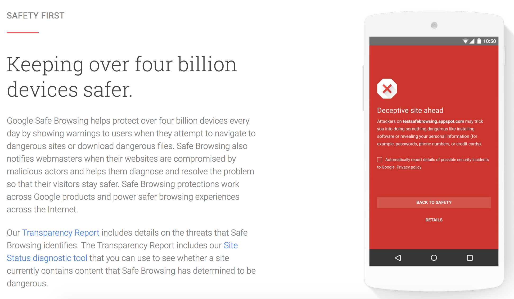
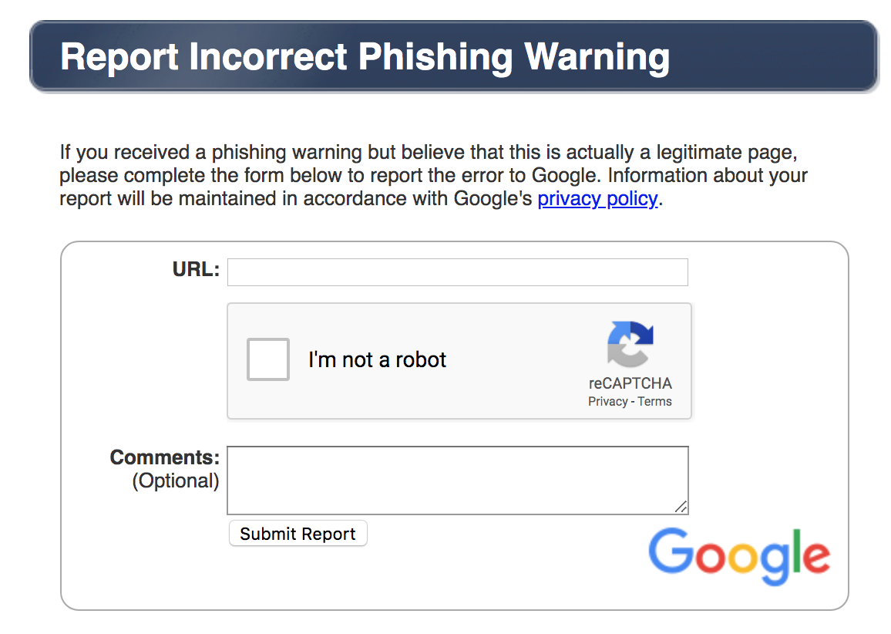

# Learning Goals

* Understand when (not) to use AI
* Understand the major components of a typical AI-enabled system and design
  decisions to be made
* Understand the components of a typical ML pipeline and their responsibilities

---
# When to use AI?
----
## When to use AI?

* Difficult for computers, but easy for humans
  * e.g., "Is this a cat?"
* Unknown patterns
  * Medical diagnosis
* Requires a large amount of data
  * Search engines

----

## Use of AI?

<!-- .element: class="stretch" -->

CC BY-NC 2.0
[Travel Aficionado](https://www.flickr.com/photos/travel_aficionado/2396814840)

Notes: 
* Should it be used for the display panel of a stock exchange?
* For the bookkeeping and trading algorithms that determine prices and sign trades?
* For price prediction and automated trading?

----

## Use of AI?

<!-- .element: class="stretch" -->

Picture by [David Mark](https://pixabay.com/users/12019-12019/?utm_source=link-attribution&amp;utm_medium=referral&amp;utm_campaign=image&amp;utm_content=100624)

---
# Components of an AI-Enabled System

----
## Components of an AI-Enabled System

* Objectives: What is the system trying to achieve?
* Experience: What does it allow users to do? How does it receive feedback?
* Intelligence: How does it achieve its objectives?
* Orchestration: How is everything put together? How does it evolve
over time?

----
## Case Study: Safe Browsing Feature

----
## Objectives

* What is the system trying to achieve?
  * Measurable
  * Achievable
  * Communicable
* Q. What are the objectives of a safe browsing feature?
  * Prevent users from being hacked
  * Minimize users' inconvenience
  * (Are these good? Can we do better?)
  
Note: How different are these properties in nature? Quantitative vs qualitative.

----
## Measurable

----
## Achievable?

----
## Communicable 

----
## Experience

* What does it allow users to do? How does it receive feedback?
* Aspects of a user interaction
  * Presenting intelligence
  * Collecting feedback
  * Minimizing errors

----
## Presenting Intelligence

* Automate: Take action on user's behalf
* Prompt: Ask the user if an action should be taken
* Organize: Display a set of items in an order
* Annotate: Add information to a display
* Q. What are options for safe browsing?

----
## Collecting Feedback

* Feedback mechanisms to collect:
	* Context of the interaction
	* Action taken by the user
	* Outcome (success, failure, in-between...)
* Q. What information to collect for safe browsing?

----
## Collecting Feedback

----
## Minimizing Errors

* Avoid performing risky actions
* Control and restrict user interactions
* Take less forceful actions (prompt vs automate)
* Provide guidance for recovering from errors

----
## Controling User Interactions

----
## Intelligence

* How does it achieve its objectives?
  * Rules & heuristics
  * Machine learning
  * Hybrid approach
* Q. What kind of intelligence for safe browsing?

----
## Orchestration

* How is everything put together?
* How does it manage changes in:
  * Objective (e.g., a new metric to optimize)
  * Intelligence (a different ML model)
  * Experience (new users, usage patterns)
  * Errors (unexpected failures, abuse)
* Q. Possible changes to safe browsing? 

----
## Managing Changes

* Design mechanisms to:
  * Monitor objectives
  * Inspect & modify interaction
  * Update intelligence
  * Override intelligence when needed

---
# ML-based Intelligent System

----
##  AI != ML

----
## Machine Learning Pipeline

[Semi Koen](https://towardsdatascience.com/not-yet-another-article-on-machine-learning-e67f8812ba86)

[Need a CC figure]

----
## Typical ML Pipeline

* Static
  * Get labeled data
  * Identify and extract features
  * Split data into training and evaluation set
  * Learn model from training data
  * Evaluate model on evaluation data
  * Repeat, revising features
* With production data
  * Evaluate model on production data; monitor
  * Select production data for retraining
  * Update model regularly

----
## Design Decisions in ML-based Systems

* Data collection and preparation
  * Training vs test sets, sizes
* Feature engineering
  * Often the most time-consuming part!
  * Requires in-depth domain knowledge
* Model selection & configuration
  * Structure: No. layers, decision tree depth...
  * Search algorithms
	
----

<!-- small -->

## Example Data

| RestaurantID | Order| OrderTime|ReadyTime|PickupTime|
|-|-|-|-|-|
| 5 |5A;3;10;11C;C:No onion| 18:11|18:23|18:31|
|...|
|...|
|...|

----

## Feature Engineering

* Identify parameters of interest that a model may learn on
* Convert data into a useful form
* Normalize data
* Include context
* Remove misleading things
* In delivery prediction:

----

## Features?

----

## Feature Extraction

In delivery prediction:

* Order time, day of week
* Average number of orders in that hour
* Order size
* Special requests
* Order items
* Preparation time

----

## Data Cleaning

* Removing outliers
* Normalizing data
* Missing values

----

## Data cleaning?

----

## Learning

Build a predictor that best describes an outcome for the observed features

| RestaurantID | Order3 | SpecialRequest | DayOfWeek | PreparationTime |
|-|-|-|-|-|
|5|yes| yes|2|12|
|...|
|...|
|...|

----

## Evaluation

* Prediction accuracy on learned data vs prediction accuracy on unseen data
  * Separate learning set, not used for training
* For binary predictors: false positives vs false negatives, recall, precision
* For numeric predictors: average (relative) distance between real and predicted value
* For ranking predictors: topK etc

----

## Recall/Precision

* Describes accuracy of a model in two (relative) numbers
* Recall: how many useful answers
* Precision: how much noise
 
<!-- split -->

---
# Summary

