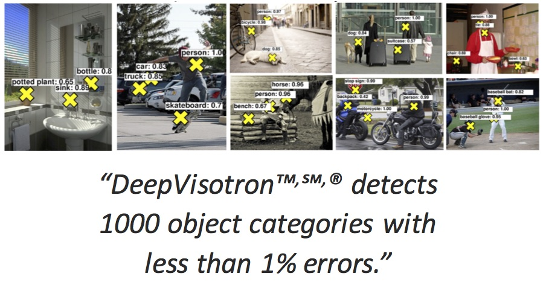
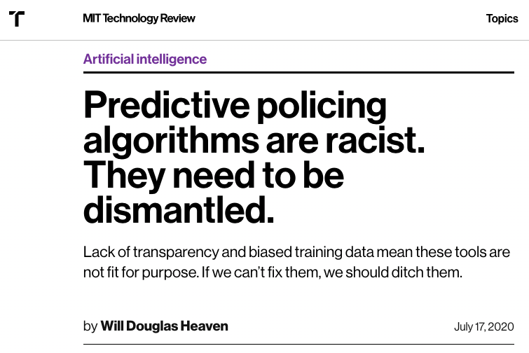

# Learning goals

* Explain how machine learning fits into the larger picture of building and maintaining production systems
* Describe the typical components relating to AI in an AI-enabled system and typical design decisions to be made

---
# Traditional vs AI-based Software Systems

<!-- ---- -->
<!-- ## Traditional Programming vs ML -->

<!--  -->

----
## Complexity in Engineered Systems


* Automobile: ~30,000 parts; Airplane: ~3,000,000 parts
* MS Office: ~ 40,000,000 LOCs; Debian: ~ 400,000,000 LOCs
* How do we build such complex systems?

----
## Managing Complexity in Software

* **Abstraction**: Hide details & focus on high-level behaviors
* **Reuse**: Package into reusable libraries & APIs with well-defined _contracts_
* **Composition**: Build large components out of smaller ones

```java
class Algorithms {
    /**
     * Finds the shortest distance between to vertices.
	 * This method is only supported for connected vertices.
     */
    int shortestDistance(Graph g, Vertice v1, v2) {…}
}
```

----
## Contracts in ML?



**Q. Is this the same kind of contract as in software?**

<!-- references -->
"Two big challenges in machine learning", ICML 2015, Leon Bottou,
Facebook

----
## (Lack of) Modularity in ML

* Often no clear specification of "correct" behavior
  * Optimizing metrics instead of providing guarantees
* Model behavior strongly dependent on training & test sets
  * What happens if distribution changes?
  * Difficult to reuse!
* Poorly understood interactions between models
  * Ideally, develop models separately & compose together
  * In general, must train & tune together

**These problems are not new, but are exacerbated by the increasing
use of ML!**

----

## Resulting Shift in Design Thinking?

From deductive reasoning to inductive reasoning...

From clear specifications to goals...

From guarantees to best effort...

**What does this mean for software engineering?**

**For decomposing software systems?** 

**For correctness of AI-enabled systems?** 

**For safety?**

**For design, implementation, testing, deployment, operations?**

---

# AI-Enabled Systems

----
## Whole System Perspective

* A model is just one component of a larger system
* Also pipeline to build the model
* Also infrastructure to deploy, update, and serve the model
* Integrating the model with the rest of the system functionality
* User interaction design, dealing with mistakes
* Interaction with other stakeholders, detecting feedback loop
* Overall system goals vs model goals

*let's look at some examples*


<!-- references -->

* Graphic: Amershi et al. "[Software engineering for machine learning: A case study](https://www.microsoft.com/en-us/research/uploads/prod/2019/03/amershi-icse-2019_Software_Engineering_for_Machine_Learning.pdf)." In Proc ICSE-SEIP, 2019. 

<!-- ---- -->
<!-- ## Temi Transcription Service -->

<!--  -->
<!-- <\!-- .element: class="stretch" -\-> -->

<!-- https://www.temi.com/ -->

<!-- Note: A model is very central to this service. Product built around -->
<!-- a model. Still, lots of nonmodel code for UI, storage of customer data, -->
<!-- credit card processing, ... -->

----
## Microsoft Powerpoint


<!-- .element: class="stretch" -->

Read more: [How Azure Machine Learning enables PowerPoint Designer](https://azure.microsoft.com/en-us/blog/how-azure-machine-learning-enables-powerpoint-designer/), Azure Blog, March 2020


Note: Traditional application that uses machine learning in a few smaller
places (more and more these days).


----
## Fall Detection Devices


<!-- .element: class="stretch" -->

(various devices explored, including smart watches, hearing aids, and wall and floor sensors)

Read more: [How fall detection is moving beyond the pendant](https://www.mobihealthnews.com/content/how-fall-detection-moving-beyond-pendant), MobiHealthNews, 2019

Note: Devices for older adults to detect falls and alert caretaker or emergency responders automatically or after interaction. Uses various inputs to detect falls.

----

## Crime Prediction


* Model: Use historical data to predict crime rates by neighborhoods
* Used for predictive policing: Decide where to allocate police patrol

**Q. What could possibly go wrong?**


----

## Feedback Loop


* Model: Use historical data to predict crime rates by neighborhoods
* Police increases the frequency of patrol in neighborhood X
* More arrested made in neighborhood X
* New crime data fed back to the model
* Repeat...

<!-- ## Google Add Fraud Detection -->

<!--  -->
<!-- <\!-- .element: class="stretch" -\-> -->

<!-- From: Sculley, D., M. Otey, M. Pohl, B. Spitznagel, J. Hainsworth, and Y. Zhou. Detecting Adversarial Advertisements in the Wild. In Proc. KDD, 2011. -->

<!-- Note: See first homework assignment. System largely build around a model for a specific purpose but integrated into larger infrastructure. -->

<!-- ---- -->
<!-- ## Recidivism Prediction -->

<!-- ```txt -->
<!-- IF age between 18–20 and sex is male THEN predict arrest -->
<!-- ELSE IF age between 21–23 and 2–3 prior offenses THEN predict arrest -->
<!-- ELSE IF more than three priors THEN predict arrest -->
<!-- ELSE predict no arrest -->
<!-- ``` -->

<!-- <\!-- references -\-> -->
<!-- Read more: Julia Angwin, Jeff Larson, Surya Mattu and Lauren Kirchner. "[Machine Bias](https://www.propublica.org/article/machine-bias-risk-assessments-in-criminal-sentencing)." ProPublica 2016 -->

<!-- Note: The system is very narrowly built around a model, but has large societal implications. -->

<!-- ---- -->
<!-- ## Logistics, Route Planning -->

<!--  -->
<!-- <\!-- .element: class="stretch" -\-> -->

<!-- Note: Heavy AI (not just ML) integrated in large system approximating -->
<!-- planning problems with many inputs, interfacing with many other systems. -->

----

## Beyond Software: Impact on Our Society



----
## Many more examples:

* Product recommendations on Amazon
* Surge price calculation for Uber
* Inventory planning in Walmart
* Search for new oil fields by Shell
* Adaptive cruise control in a car
* Smart app suggestion in Android
* Fashion trends prediction with social media data
* Suggesting whom to talk to in a presidential campain
* Tracking and predicting infections in a pandemic
* Adaptively reacting to network issues by a cell phone provider
* Matching players in a computer game by skill
* ...
* 
* Some for end users, some for employees, some for expert users
* Big and small components of a larger system


----
## Thinking about Systems

* Holistic approach, looking at the larger picture, involving all stakeholders
* Looking at relationships and interactions among components and environments
    - Everything is interconnected
    - Combining parts creates something new with emergent behavior
    - Understand dynamics, be aware of feedback loops, actions have effects
* Understand how humans interact with the system

> A system is a set of inter-related components that work together in a particular environment to perform whatever functions are required to achieve the system's objective -- Donella Meadows

<!-- references -->
Leyla Acaroglu. "[Tools for Systems Thinkers: The 6 Fundamental Concepts of Systems Thinking](https://medium.com/disruptive-design/tools-for-systems-thinkers-the-6-fundamental-concepts-of-systems-thinking-379cdac3dc6a)." Blogpost 2017

----
## System-Level Challenges for AI-Enabled Systems

* Getting and updating data, concept drift, changing requirements
* Handling massive amounts of data
* Interactions with the real world, feedback loops
* Lack of modularity of AI components, lack of specifications, nonlocal effects
* Deployment and maintenance
* Versioning, debugging and incremental improvement
* Keeping training and operating cost manageable
* Interdisciplinary teams
* Setting system goals, balancing stakeholders and requirements
* ...

<!-- ---- -->
<!-- ## On Terminology -->

<!-- * There is no standard term for referring to building systems with AI components -->
<!-- + "AI-Enabled Systems", "ML-Enabled Systems" or "ML-Infused Systems" -->
<!-- + SE4AI, SE4ML -->
<!-- + sometimes AI engineering -->
<!-- + sometimes ML Systems Engineering (but often this refers to building distributed and scalable ML learning and data storage platforms) -->
<!-- + AIOps ~ using AI to make automated decisions in operations; DataOps ~ use of agile methods and automation in business data analytics; MLOps ~ technical infrastructure for operating AI-based products and on deploying updates -->
<!-- + Developers with Software Engineering and ML skills were often referred to as "unicorns" in earlier days -->


---
# Components of an AI-Enabled System

(Using Hulten's Terminology)

<!-- references -->
* Hulten, Geoff. "Building Intelligent Systems: A Guide to Machine Learning Engineering." (2018).

----
## Elements of an Intelligent System

* Meaningful objective: Goals, requirements, business case
<!-- .element: class="fragment" -->
* Intelligent experience: User interactions -- presenting model
predictions to user; eliciting & collecting feedback (telemetry)
<!-- .element: class="fragment" -->
* Intelligence implementation: Infrastructure -- learning and serving the model and collecting feedback 
<!-- .element: class="fragment" -->
* Intelligence creation: Learning and evaluating models
<!-- .element: class="fragment" -->
* Orchestration: Operations -- maintaining and updating the system over time, debugging, countering abuse
<!-- .element: class="fragment" -->

<!-- ---- -->
<!-- ## Design Decisions for each Element? -->

<!-- <\!-- colstart -\-> -->

<!-- * Meaningful objective -->
<!-- * Intelligent experience / user interaction design -->
<!-- * Intelligence implementation / infrastructure -->
<!-- * Intelligence creation -->
<!-- * Orchestration / operations -->
<!-- <\!-- col -\-> -->
<!--  -->

<!-- <\!-- colend -\-> -->

----
## Designing Intelligent Experiences

* How to use the output of a model's prediction (for a objective)?
* Design considerations:
    - How to present prediction to a user? Suggestions or automatically take actions?
    - How to effectively influence the user's behavior toward the system's goal?
    - How to minimize the consequences of flawed predictions?
    - How to collect data to continue to learn from users and mistakes?
* Balancing at least three outcomes:
    - Achieving objectives
    - Protection from mistakes
    - Collecting data for training

----
## Another Example: Safe Browsing Feature


---

# Meaningful Objectives

----
## Defining Meaningful Objectives

* What is the system trying to achieve?
* **System** objective, not model qualities
* Properties of meaningful objectives
  <!-- .element: class="fragment" -->
  * Measurable: Enables tracking & objective comparison
  * Achievable: Possible to achieve in time-to-market
  * Communicable: Transparent & comprehensible to stakeholders
* Q. What are the objectives of a safe browsing feature?
  <!-- .element: class="fragment" -->
  * "Prevent users from being hacked"
  <!-- .element: class="fragment" -->
  * "Minimize users' inconvenience"
  <!-- .element: class="fragment" -->
  * (Are these good? Can we do better?)
  <!-- .element: class="fragment" -->

----
## Measurable


<!-- .element: class="stretch" -->

----
## Achievable?


----
## Communicable 


---
# User Interactions (Intelligent Experiences)

----
## Presenting Intelligence

* Automate: Take action on user's behalf
<!-- .element: class="fragment" -->
* Prompt: Ask the user if an action should be taken
<!-- .element: class="fragment" -->
* Organize: Display a set of items in an order
<!-- .element: class="fragment" -->
* Annotate: Add information to a display
<!-- .element: class="fragment" -->
* Hybrids of these
<!-- .element: class="fragment" -->

----
## Factors to Consider

When designing an intelligent experience consider:

* Forcefulness: How strongly to encourage taking an action (or even automate it)?
* Frequency: How often to interact with the user?
* Value: How much does a user (think to) benefit from the prediction?
* Cost: What is the damage of a wrong prediction?

----
## Presenting Intelligence: Safe Browsing


* Compare against more forceful, "automate" option
  * What are trade-offs between them?
  * If model makes a mistake, what kind of damage can it cause? Which
    one is easier to recover from?

----
## Feedback (Telemetry)

* To design good interactions we need to know how we are doing...
* How many predictions are ignored?
* How many actions are reversed?
* How often does the user ask for extra predictions?
* How much value do users get out of predictions?
* How much are we supporting the system's goals?
* How much cost are wrong predictions causing for users/the system's goals?
* Are mistakes focused on specific kinds of inputs?

**Q. How would you design telemetry for safe browsing?**

----
## Collecting Feedback


----
## Outlook: Telemetry Design


<!-- .element: class="stretch" -->

More on this later...

---
# Breakout Discussion

----
## Case Study: Fall Detection


<!-- .element: class="stretch" -->

* What are meaningful objectives of the system?
* How do we present the intelligence to the user?
  * How forceful should it be?
  *What are potential costs of mistakes?
* How do we collect data to continue to learn from users and mistakes?

<!-- --- -->
<!-- # A Systems View on Safety -->


<!-- ---- -->
<!-- ## The Smart Toaster -->

<!-- > the toaster may (occasionally) burn my toast, but should never burn down my kitchen -->

<!--  -->
<!-- <\!-- .element: class="stretch" -\-> -->


<!-- ---- -->
<!-- ## Making the Smart Toaster Safe -->

<!-- Assume classification model: -->
<!-- $\text{continueToasting}(\text{camera}_\text{initial}, \text{camera}_\text{now}, \text{temperatureReading}, $ -->
<!-- $ \text{userPref}) \rightarrow \text{Boolean}$ -->

<!-- How to assure the toaster does not overhead? -->

<!-- <\!-- discussion -\-> -->

<!-- ---- -->
<!-- ## Safeguards / Guardrails -->

<!-- * Hard constraints overrule model -->
<!--     - `heat = (temperatureReading < MAX) && continueToasting(...)` -->
<!-- * External hardware or software failsafe mechanisms -->
<!--     - outside the model, external observer, e.g., thermal fuses -->


<!--  -->
<!-- <\!-- .element: class="stretch" -\-> -->
<!-- (Image CC BY-SA 4.0, C J Cowie) -->

<!-- ---- -->
<!-- ## Other Strategies -->

<!-- * Improve the model, more data, more testing -->
<!-- * Adjusting interaction models, e.g., involving users, confirmations -->
<!-- * Better hardware -->
<!-- * ... -->

<!-- **In all cases, look beyond model accuracy at the entire system** -->


<!-- --- -->
<!-- # A System View on Intelligence Infrastructure -->

<!-- ---- -->
<!-- ## Infrastructure for ML Components -->

<!--  -->
<!-- <\!-- .element: class="stretch" -\-> -->

<!-- This was 2015; many of those boxes are getting increasingly standardized these days. -->


<!-- Graphic from Sculley, et al. "[Hidden technical debt in machine learning systems](http://papers.nips.cc/paper/5656-hidden-technical-debt-in-machine-learning-systems.pdf)." In Proc NIPS, 2015. -->


<!-- Note: Even for a single ML component and it's pipeline, there is a lot of -->
<!-- infrastructure to build and serve the model. -->

<!-- ---- -->
<!-- ## Thinking in Pipelines over Models -->

<!-- * In production systems, models need to be deployed and updated -->
<!-- * Consider the entire pipeline, not just the model -->
<!--     - Quality assurance, reproduciblity, repeatability, debugging -->
<!--     - Modifiability, agility -->
<!--     - Training cost and scalability -->
<!--     - Data availability, data wrangling cost -->
<!--     - Telemetry -->
<!-- * Reported as one of the key challenges in production machine learning -->


<!--  -->

<!-- <\!-- references -\-> -->

<!-- * Graphic: Amershi et al. "[Software engineering for machine learning: A case study](https://www.microsoft.com/en-us/research/uploads/prod/2019/03/amershi-icse-2019_Software_Engineering_for_Machine_Learning.pdf)." In Proc ICSE-SEIP, 2019.  -->
<!-- * Key challenge claim: O'Leary and Uchida. "[Common problems with Creating Machine Learning Pipelines from Existing Code](https://research.google/pubs/pub48984.pdf)." Proc. MLSys, 2020. -->


---
# System Qualities vs Model Accuracy

----
## Systems have Goals

... selling stuff, increasing engagement, encouraging responsible behavior

Model predictions support those goals

**more in a later lecture**

----
## More Accurate Predictions may not be THAT Important

* "Good enough" may be good enough
* Prediction critical for system success or just an gimmick?
* Better predictions may come at excessive costs 
    - need way more data, much longer training times
    - privacy concerns
* Better user interface ("experience") may mitigate many problems
    - e.g. explain decisions to users
* Use only high-confidence predictions?

----
## Beyond Model Quality

Many other aspects of a model's quality may matter when operating a system

* Learning time, inference time
* Incremental learning
* Explainability
* Model size
* Kinds of mistakes
* Fairness, privacy, security, robustness
* Reproducibility
* Maintainability

(More in a later lecture!)

---

<svg version="1.1" viewBox="0.0 0.0 800 400" xmlns:xlink="http://www.w3.org/1999/xlink" xmlns="http://www.w3.org/2000/svg">
        <style>
    text { font: 60px sans-serif; }
        </style>
        <circle r="180" cx="250", cy="200" fill="#b9ff00" fill-opacity="0.514" />
        <circle r="180" cx="550", cy="200" fill="#ff5500" fill-opacity="0.514" />
        <text x=230 y=160 dominant-baseline="middle" text-anchor="middle">Data</text>
        <text x=230 y=240 dominant-baseline="middle" text-anchor="middle">Scientists</text>
        <text x=570 y=160 dominant-baseline="middle" text-anchor="middle">Software</text>
        <text x=570 y=240 dominant-baseline="middle" text-anchor="middle">Engineers</text>
</svg>


---
# Summary

* Production AI-enabled systems require a *whole system perspective*, beyond just the model
* Components: Objectives, user interface, infrastructure, AI component, and operations
* Large design space for user interface (intelligent experience): forcefulness, frequency, telemetry
* Quality at a system level: safety beyond the model, beyond accuracy
