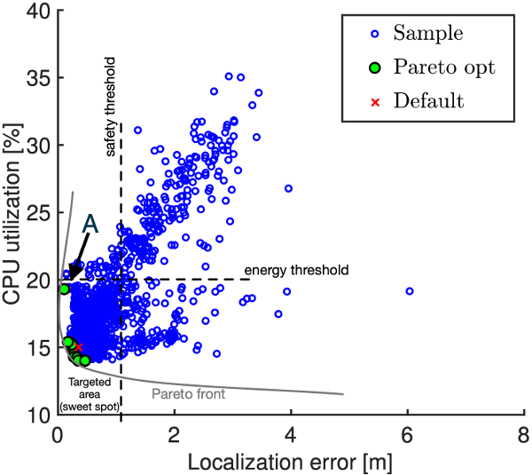

# Learning goals

* Give an overview of different AI problems and approaches
* Explain at high level how deep learning works 
* Describe key characteristics of symbolic AI techniques and when to use them

---


<svg version="1.1" viewBox="0.0 0.0 400 400" xmlns:xlink="http://www.w3.org/1999/xlink" xmlns="http://www.w3.org/2000/svg">
        <style>
    text { font: 60px sans-serif; }
        </style>
        <circle r="200" cx="200", cy="200" fill="#b9ff00" fill-opacity="0.514" />
        <circle r="140" cx="230", cy="250" fill="#ff5500" fill-opacity="0.514" />
        <circle r="80" cx="270", cy="280" fill="#0055ff" fill-opacity="0.514" />
        <text x=130 y=100 dominant-baseline="middle" text-anchor="middle">AI</text>
        <text x=210 y=180 dominant-baseline="middle" text-anchor="middle">ML</text>
        <text x=270 y=280 dominant-baseline="middle" text-anchor="middle">DL</text>

</svg>

<!-- split -->

<!-- small -->
Artificial Intelligence: 
> computers acting humanly / thinking humanly / thinking rationally / acting rationally -- [Russel and Norvig, 2003](https://cmu.primo.exlibrisgroup.com/permalink/01CMU_INST/1feg4j8/alma991019419529704436)

Machine Learning:
> A computer program is said to learn from experience E with respect to some task T and some performance measure P, if its performance on T, as measured by P, improves with experience E. -- [Tom Mitchell, 1997](https://cmu.primo.exlibrisgroup.com/permalink/01CMU_INST/1feg4j8/alma991003098569704436)

Deep Learning:

> specific learning technique based on neural networks


Note: Precise definitions are difficult to capture. Some simply describe AI as "everything that's hard in computer science".

----
## Artificial Intelligence

<!-- colstart -->

* Acting humanly: Turing test approach, requires natural language processing, knowledge representation, automated reasoning, machine learning, maybe vision and robotics
* Thinking humanly: mirroring human thinking, cognitive science
* Thinking rationally: law of thoughts, logic, patterns and structures
* Acting rationally: rational agents interacting with environments


<!-- col -->

* problem solving (e.g., search, constraint satisfaction)
* knowledge, reasoning, planning (e.g., logic, knowledge representation, probabilistic reasoning)
* learning (learning from examples, knowledge in learning, reinforcement learning)
* communication, perceiving, and acting (NLP, vision, robotics)

<!-- colend -->

<!-- references -->
Russel and Norvig. "[Artificial Intelligence: A Modern Approach](https://cmu.primo.exlibrisgroup.com/permalink/01CMU_INST/1feg4j8/alma991019419529704436).", 2003

---
# Machine Learning Overview

(zooming out from the last lecture)

----
## Common Problem Classes

* Classification 
* Probability estimation 
* Regression
* Ranking
* Hybrids


----
## Examples?

<!-- colstart -->

* Classification 
* Probability estimation 
* Regression
* Ranking
* Hybrids

<!-- col -->

* Identifying whether there a scan shows cancer
* Detecting shoe brands in an image
* Predicting the sales price of a house
* Recommending videos on Youtube
* Understanding survival rates of titanic passengers
* Estimating the arrival time of a ride sharing car
* Transcribing an audio file
* Finding academic papers on economic fairness 

<!-- colend -->

----
## Learning Paradigms

* Supervised learning -- labeled training data provided
* Unsupervised learning -- training data without labels
* Reinforcement learning -- agents learning from interacting with an environment

----
## Examples

<!-- colstart -->
* Supervised learning -- labeled training data provided
* Unsupervised learning -- training data without labels
* Reinforcement learning -- agents learning from interacting with an environment
<!-- col -->
* Identifying whether there a scan shows cancer
* Playing chess
* Predicting the sales price of a house
* Organizing books into topics
* Detecting shoe brands in an image
* Identifying unusual purchases from a credit card
* Learning to walk
* Transcribing an audio file

<!-- colend -->

----
## Many Different Techniques

* Building on logic: Inductive reasoning
* Imitating brains: e.g., neural networks
* Imitating evolution: e.g., genetic programming
* Probabilities: e.g., Naive Bayes, Markov chains
* Finding analogies: e.g., nearest neighbor, SVM
* Reinforcement learning

<!-- references -->
For a nontechnical introduction: Pedro Domingos. [The Master Algorithm](https://en.wikipedia.org/wiki/The_Master_Algorithm). Basic Books, 2015

---

# Neural Networks


<!-- .element: class="stretch" -->


Note: Artificial neural networks are inspired by how biological neural networks work ("groups of chemically connected or functionally associated neurons" with synapses forming connections)

From "Texture of the Nervous System of Man and the Vertebrates" by Santiago Ramón y Cajal, via https://en.wikipedia.org/wiki/Neural_circuit#/media/File:Cajal_actx_inter.jpg

----
## Artificial Neural Networks

Simulating biological neural networks of neurons (nodes) and synapses (connections), popularized in 60s and 70s

Basic building blocks: Artificial neurons, with $n$ inputs and one output; output is activated if at least $m$ inputs are active


<!-- .element: class="stretch" -->

(assuming at least two activated inputs needed to activate output)

----
## Threshold Logic Unit / Perceptron

computing weighted sum of inputs + step function

$z = w_1 x_1 + w_2 x_2 + ... + w_n x_n = \mathbf{x}^T \mathbf{w}$

e.g., step: `$\phi$(z) = if (z<0) 0 else 1` 


<!-- .element: class="stretch" -->

----


<!-- .element: class="stretch" -->

<!-- split -->

$o_1 = \phi(b_{1}  +  w_{1,1} x_1 + w_{1,2} x_2)$
$o_2 = \phi(b_{2}  +  w_{2,1} x_1 + w_{2,2} x_2)$
$o_3 = \phi(b_{3}  +  w_{3,1} x_1 + w_{3,2} x_2)$

****
$f_{\mathbf{W},\mathbf{b}}(\mathbf{X})=\phi(\mathbf{W} \cdot \mathbf{X}+\mathbf{b})$

($\mathbf{W}$ and $\mathbf{b}$ are parameters of the model)

----
## Multiple Layers


<!-- .element: class="stretch" -->

Note: Layers are fully connected here, but layers may have different numbers of neurons

----
$f_{\mathbf{W}_h,\mathbf{b}_h,\mathbf{W}_o,\mathbf{b}_o}(\mathbf{X})=\phi( \mathbf{W}_o \cdot \phi(\mathbf{W}_h \cdot \mathbf{X}+\mathbf{b}_h)+\mathbf{b}_o$


<!-- .element: class="stretch" -->

(matrix multiplications interleaved with step function)

----
## Learning Model Parameters (Backpropagation)

Intuition:
- Initialize all weights with random values
- Compute prediction, remembering all intermediate activations
- If output is not expected output (measuring error with a loss function), 
  + compute how much each connection contributed to the error on output layer
  + repeat computation on each lower layer
  + tweak weights a little toward the correct output (gradient descent)
- Continue training until weights stabilize

Works efficiently only for certain $\phi$, typically logistic function: $\phi(z)=1/(1+exp(-z))$ or ReLU: $\phi(z)=max(0,z)$.

----
## Deep Learning

* More layers
* Layers with different numbers of neurons 
* Different kinds of connections
  - fully connected (feed forward)
  - not fully connected (eg. convolutional networks)
  - keeping state (eg. recurrent neural networks)
  - skipping layers
  - ...

<!-- references -->
See Chapter 10 in 🕮 Géron, Aurélien. ”[Hands-On Machine Learning with Scikit-Learn, Keras, and TensorFlow](https://cmu.primo.exlibrisgroup.com/permalink/01CMU_INST/6lpsnm/alma991019662775504436)”, 2nd Edition (2019) or any other book on deep learning


Note: Essentially the same with more layers and different kinds of architectures.


----
## On Terminology

* Deep learning: neural networks with many internal layers
* DNN architecture: network structure, how many layers, what connections, which $\phi$ (hyperparameters)
* Model parameters: weights associated with each input in each neuron


----
## Example Scenario

* MNIST Fashion dataset of 70k 28x28 grayscale pixel images, 10 output classes


<!-- .element: class="stretch" -->

----
## Example Scenario

* MNIST Fashion dataset of 70k 28x28 grayscale pixel images, 10 output classes
* 28x28 = 784 inputs in input layers (each 0..255)
* Example model with 3 layers, 300, 100, and 10 neurons

```python
model = keras.models.Sequential([
  keras.layers.Flatten(input_shape=[28, 28]),
  keras.layers.Dense(300, activation="relu"),
  keras.layers.Dense(100, activation="relu"),
  keras.layers.Dense(10, activation="softmax")
])
```

**How many parameters does this model have?**

----
## Example Scenario

* MNIST Fashion dataset of 70k 28x28 grayscale pixel images, 10 output classes
* 28x28 = 784 inputs in input layers (each 0..255)
* Example model with 3 layers, 300, 100, and 10 neurons

```python
model = keras.models.Sequential([
  keras.layers.Flatten(input_shape=[28, 28]),
  # 784*300+300 = 235500 parameter
  keras.layers.Dense(300, activation="relu"), 
  # 300*100+100 = 30100 parameters
  keras.layers.Dense(100, activation="relu"),
  # 100*10+10 = 1010 parameters
  keras.layers.Dense(10, activation="softmax")
])
```

Total of 266,610 parameters in this small example! (Assuming float types, that's 1 MB)

----
## Network Size

* 50 Layer ResNet network -- classifying 224x224 images into 1000 categories
  * 26 million weights, computes 16 million activations during inference, 168 MB to store weights as floats
* OpenAI’s GPT-2 (2019) -- text generation
  - 48 layers, 1.5 billion weights (~12 GB to store weights)
  - released model reduced to 117 million weights
  - trained on 7-8 GPUs for 1 month with 40GB of internet text from 8 million web pages


----
## Convolutional neural network (Intuition)


([Aphex34](https://en.wikipedia.org/wiki/Convolutional_neural_network#/media/File:Typical_cnn.png) CC BY-SA 4.0)


----
## Reusing and Retraining Networks

* Incremental learning process enables continued training, retraining, incremental updates
* A model that captures key abstractions may be good starting point for adjustments (i.e., rather than starting with randomly initialized parameters)
* Reused models may inherit bias from original model
* Lineage important. Model cards promoted for documenting rationale, e.g., [Google Perspective Toxicity Model](https://github.com/conversationai/perspectiveapi/blob/master/2-api/model-cards/English/toxicity.md)


----
## Deep Learning Discussion

* Can approximate arbitrary functions
* Able to handle many input values (e.g., millions of pixels) 
* Internal layers may automatically recognize higher-level structures 
* Often used without explicit feature engineering
* Often huge number of parameters, expensive inference and training
* Often large training sets needed
* Too large and complex to understand what is learned, why, or how decisions are made (compare to decision trees)


---
# Classic Symbolic AI

(Good Old-Fashioned Artificial Intelligence)


----
## Boolean Satisfiability

Given a propositional formula over boolean variables, is there an assignment such that the formula evaluates to true?

$(a \vee b) \wedge (\neg a \vee c) \wedge \neg b$

decidable, np complete, lots of search heuristics

----
## Encoding Problems


<!-- .element: class="stretch" -->

Configuration dialog. Some options are mutually exclusive. Some depend on other options. 


----
## Encoding Problems


<!-- .element: class="stretch" -->


----
## Linux KConfig

```python
config HAVE_BOOTMEM_INFO_NODE
  def_bool n

# eventually, we can have this option just 'select SPARSEMEM'
config MEMORY_HOTPLUG
  bool "Allow for memory hot-add"
  depends on SPARSEMEM || X86_64_ACPI_NUMA
  depends on ARCH_ENABLE_MEMORY_HOTPLUG
  select NUMA_KEEP_MEMINFO if NUMA

config MEMORY_HOTPLUG_SPARSE
  def_bool y
  depends on SPARSEMEM && MEMORY_HOTPLUG

config MEMORY_HOTPLUG_DEFAULT_ONLINE
  bool "Online the newly added memory blocks by default"
  depends on MEMORY_HOTPLUG
  help
    This option sets the default policy setting for memory hotplug
    onlining policy (/sys/devices/system/memory/auto_online_blocks) which
    determines what happens to newly added memory regions. Policy setting
    can always be changed at runtime.
    See Documentation/admin-guide/mm/memory-hotplug.rst for more information.

    Say Y here if you want all hot-plugged memory blocks to appear in
    'online' state by default.
    Say N here if you want the default policy to keep all hot-plugged
    memory blocks in 'offline' state.

config MEMORY_HOTREMOVE
  bool "Allow for memory hot remove"
  select MEMORY_ISOLATION
  select HAVE_BOOTMEM_INFO_NODE if (X86_64 || PPC64)
  depends on MEMORY_HOTPLUG && ARCH_ENABLE_MEMORY_HOTREMOVE
  depends on MIGRATION
```

----
## SAT Encoding

Describe configuration constraints:

<!-- colstart -->
```
config MEMORY_HOTPLUG
  bool "Allow for memory hot-add"
  depends on SPARSEMEM || X86_64_ACPI_NUMA
  depends on ARCH_ENABLE_MEMORY_HOTPLUG
  select NUMA_KEEP_MEMINFO if NUMA
```
<!-- col -->
<!-- small -->
(MEMORY_HOTPLUG => SPARSEMEM || X86_64_ACPI_NUMA)

&&

(MEMORY_HOTPLUG => ARCH_ENABLE_MEMORY_HOTPLUG)

&&

(MEMORY_HOTPLUG && NUMA => NUMA_KEEP_MEMINFO)

...
<!-- colend -->

----
## Automated Configuration Analysis

given configuration constraints $\phi$ :

**Which option can never be selected?**

`dead(o) = $\neg$SAT($\phi \wedge o$)`

**Which option must always be selected?**

`mandatory(o) = TAUT($\phi \Rightarrow o$)`

`= $\neg$SAT($\neg(\phi \Rightarrow o)$)`

`= $\neg$SAT($\phi \wedge \neg o$)`


**Any options that can never be selected together?**

`mutuallyExclusive(o, p) = ?`


----
## More Automated Configuration Analysis

given configuration constraints $\phi$ and already made selections of $a$ and $b$


**Which other options do need to be selected?**

`mustSelect(o) = ?`

----
## Constraint Satisfaction Problems, SMT

Generalization beyond boolean options, numbers, strings, additions, optimization

**Example: Job Scheduling**

Tasks for assembling a car: { t1, t2, t3, t4, t5, t6 }; values denoting start time

max 30 min: $\forall_n t_n<30$ 

t2 needs to be after t1, t1 takes 10 min: $t_1+10\le t_2$

t3 and t4 needs to be after t2, take 2 min: $(t_2+2\le t_3) \wedge (t_2+2\le t_4)$

t5 and t6 (5 min each) should not overlap: $(t_5+5\le t_6) \vee (t_6+5\le t_5)$

Goal: find valid assignment for all start times, or find valid assignment minimizing the latest start time

----
## General Observations

* Encoding of many problems
* Deductive reasoning, specifications! (no learning)
* Provides accurate answer (guarantees!), or timeout
* Provides concrete solution that is easy to check, possibly easy to understand (depends on encoding)
* np-complete, may take very long time to find answer
* Modern solvers are very good for many problems
* For optimization problems often good approximations exist (heuristic search)

----
## Modern Use Cases

* Planning, scheduling, logistics 
  * e.g., planning data center layout to minimize cable length
  * e.g., optimizing big data queries
  * e.g., scheduling shifts for employees based on preferences
* Static analysis, verification, security analysis of software
  - e.g., concolic testing, detecting buffer overflows
* Version resolution and dependency management 
  * e.g., Eclipse, Dart
* Combinatorial design
  * e.g., cryptography, crop rotation schedules, drug design
* Chip design and verification
  * e.g., equivalence checking
* Protein folding and other bioinformatics applications
* Electronic trading agents, e-auctions


---
# Probabilistic Programming

(reasoning with probabilities)

<!-- references -->

🕮 Pfeffer, Avi. "[Practical Probabilistic Programming](https://livebook.manning.com/book/practical-probabilistic-programming/chapter-1/)." Manning (2016), Chapter 1

----
## Probabilistic Programming by Example

```scala
val burglary = Flip(0.01)
val earthquake = Flip(0.0001)
val alarm = CPD(burglary, earthquake,
                  (false, false) -> Flip(0.001),
                  (false, true) -> Flip(0.1),
                  (true, false) -> Flip(0.9),
                  (true, true) -> Flip(0.99))
val johnCalls = CPD(alarm,
                  false -> Flip(0.01),
                  true -> Flip(0.7))

...
println("Probability of burglary: " + 
        alg.probability(burglary, true))
```

Note: Source: https://github.com/p2t2/figaro/blob/master/FigaroExamples/src/main/scala/com/cra/figaro/example/Burglary.scala
Discussed in tutorial: https://www.cra.com/sites/default/files/pdf/Figaro_Tutorial.pdf

----
## Probabilistic Programming by Example

```scala
class Person {
  val smokes = Flip(0.6)
}
def smokingInfluence(pair: (Boolean, Boolean)) =
  if (pair._1 == pair._2) 3.0; else 1.0

val alice, bob, clara = new Person
val friends = List((alice, bob), (bob, clara))
clara.smokes.observe(true)
for { (p1, p2) <- friends } 
  ^^(p1.smokes, p2.smokes).setConstraint(smokingInfluence)

...
println("Probability of Alice smoking: " + 
        alg.probability(alice.smokes, true))
```

Note: Discussed in tutorial: https://www.cra.com/sites/default/files/pdf/Figaro_Tutorial.pdf

Source: https://github.com/p2t2/figaro/blob/master/FigaroExamples/src/main/scala/com/cra/figaro/example/Smokers.scala

----
## More Examples

see [GitHub p2t2/figaro](https://github.com/p2t2/figaro/tree/master/FigaroExamples/src/main/scala/com/cra/figaro/example) and many other languages


----
## Why Probabilistic Programming?

* Reasoning about uncertainly, at scale (simulations)
* Planning with uncertainty, making decisions with partial information
* Infer causes of events, likely explanations
* Expressed in the familiar and expressive form of a programming language, often with different reasoning engines in background
*
* Based on knowledge and logic

----
## Probabilistic Inference

Answering queries about probabilistic models

```scala
println("Probability of burglary: " + 
        alg.probability(burglary, true))

println("Probability of Alice smoking: " + 
        alg.probability(alice.smokes, true))
```

<!-- vspace -->

* Analytical probabilistic reasoning (e.g., variable elimination Bayes' rule) -- precise result, guarantees
* Approximation (e.g., belief propagation)
* Sampling (e.g., Markov chain Monte Carlo) -- probabilistic guarantees


----
## Example: Robot Path and Adaptation Planning


<!-- .element: class="stretch" -->

(CC-BY-SA-3.0 [Sevard](https://commons.wikimedia.org/wiki/File:Robot_Skeleton.png))

----
## Example: Robot Path and Adaptation Planning

<!-- colstart -->

<!-- col -->

<!-- colend -->

Notes:
Examples from a recent research project to reason about adaptations in robots, e.g., change which hardware to use or which route to take. We learn energy models and other models from observations, from which we know multiple plausible configurations with different tradeoffs (and certainty). To chose an optimal configuration, a probabilistic planner is used to make decisions at runtime.


----
## General Observations

* Manually created models
* Representing uncertainty
* Reasoning with probabilities, precise of with probabilistic bounds
* Deductive reasoning, specifications! 
* Inference is hard to scale
* Recently, commonly combined with machine learning


---
# Summary

----

## Artificial Intelligence

<!-- colstart -->

* Acting humanly: Turing test approach, requires natural language processing, knowledge representation, automated reasoning, machine learning, maybe vision and robotics
* Thinking humanly: mirroring human thinking, cognitive science
* Thinking rationally: law of thoughts, logic, patterns and structures
* Acting rationally: rational agents interacting with environments


<!-- col -->

* problem solving (e.g., search, constraint satisfaction)
* knowledge, reasoning, planning (e.g., logic, knowledge representation, probabilistic reasoning)
* learning (learning from examples, knowledge in learning, reinforcement learning)
* communication, perceiving, and acting (NLP, vision, robotics)

<!-- colend -->

<!-- references -->
Russel and Norvig. "[Artificial Intelligence: A Modern Approach](https://cmu.primo.exlibrisgroup.com/permalink/01CMU_INST/1feg4j8/alma991019419529704436).", 2003

----
## Summary

* Intuition behind deep learning (architecture, parameters, size, cost)
* Symbolic and probabilistic reasoning may provide accurate answers (or time out)
* Many different approaches, many combinations

<!-- small -->

Learn more:
* 🎓 10-301/601 Introduction to Machine Learning (how machine learning techniques work)
* 🎓 15-381/681 Artificial Intelligence: Representation and Problem Solving (how symbolic AI techniques work, solvers, reasoning, agents)
* 🕮 Géron, Aurélien. ”[Hands-On Machine Learning with Scikit-Learn, Keras, and TensorFlow](https://cmu.primo.exlibrisgroup.com/permalink/01CMU_INST/6lpsnm/alma991019662775504436)”, 2nd Edition (2019), Ch 10 ("Introduction to Artificial Neural Networks with Keras")
* 🕮 Russel and Norvig. "[Artificial Intelligence: A Modern Approach](https://cmu.primo.exlibrisgroup.com/permalink/01CMU_INST/1feg4j8/alma991019419529704436).", 2003
* 🕮 Flasiński, Mariusz. "[Introduction to Artificial Intelligence](https://doi.org/10.1007/978-3-319-40022-8)." Springer (2016), Chapter 1 ("History of Artificial Intelligence") and Chapter 2 ("Symbolic Artificial Intelligence")
* 🕮 Pfeffer, Avi. "[Practical Probabilistic Programming](https://livebook.manning.com/book/practical-probabilistic-programming/chapter-1/)." Manning (2016)

