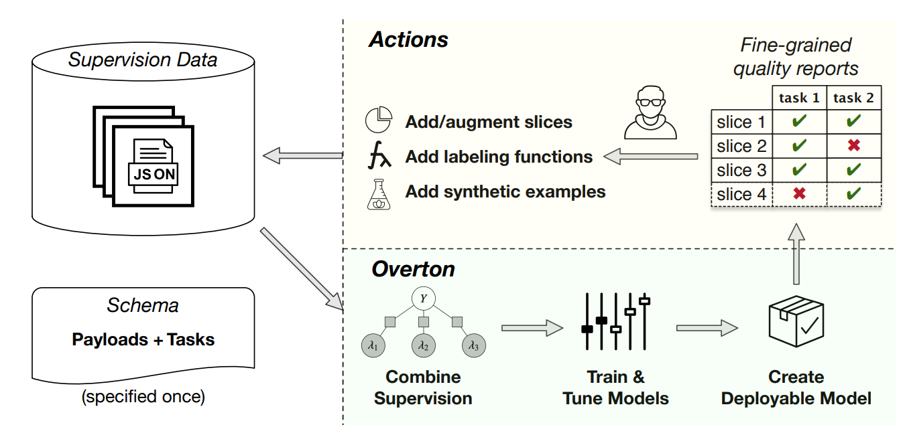
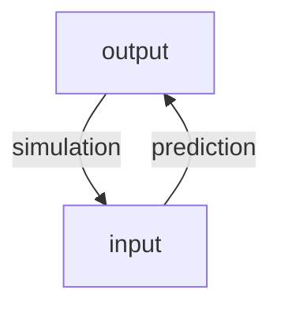

# Model Quality

Christian Kaestner

<!-- references -->

Required reading: 
* 🕮 Hulten, Geoff. "[Building Intelligent Systems: A Guide to Machine Learning Engineering.](https://www.buildingintelligentsystems.com/)" Apress, 2018, Chapter 19 (Evaluating Intelligence).
* 🗎 Ribeiro, Marco Tulio, Tongshuang Wu, Carlos Guestrin, and Sameer Singh. "[Beyond Accuracy: Behavioral Testing of NLP Models with CheckList](https://homes.cs.washington.edu/~wtshuang/static/papers/2020-acl-checklist.pdf)." In Proceedings ACL, p. 4902–4912. (2020).


---

# Learning Goals

* Select a suitable metric to evaluate prediction accuracy of a model and to compare multiple models
* Select a suitable baseline when evaluating model accuracy
* Explain how software testing differs from measuring prediction accuracy of a model
* Curate validation datasets for assessing model quality, covering subpopulations and capabilities as needed
* Use invariants to check partial model properties with automated testing
* Avoid common pitfalls in evaluating model quality
* Select and deploy automated infrastructure to evaluate and monitor model quality

---
# Model Quality 

## First Part: Measuring Prediction Accuracy

the data scientist's perspective

## Second Part: What is Correctness Anyway?

the role and lack of specifications, validation vs verification

## Third Part: Learning from Software Testing

unit testing, test case curation, invariants, test case generation

testing in production (next week)


---
# Model Quality vs System Quality

----
## Prediction Accuracy of a Model

*model:* $\overline{X} \rightarrow Y$

*validation data (tests?):* sets of $(\overline{X}, Y)$ pairs indicating desired outcomes for select inputs

For our discussion: any form of model, including machine learning models, scientific models, hardcoded heuristics, composed models, ...


----
## Comparing Models

Compare two models (same or different implementation/learning technology) for the same task:

* Which one supports the system goals better?
* Which one makes fewer important mistakes?
* Which one is easier to operate?
* Which one is better overall?
* Is either one good enough?


----
## ML Algorithm Quality vs Model Quality vs Data Quality vs System Quality

Todays focus is on the quality of the produced *model*, not the algorithm used to learn the model or the data used to train the model

i.e. assuming *Decision Tree Algorithm* and feature extraction are correctly implemented (according to specification), is the model learned from data any good?

The model is just one component of the entire system.

Focus on measuring quality, not debugging the source of quality problems (e.g., in data, in feature extraction, in learning, in infrastructure)

----
## Case Study: Cancer Detection


<!-- .element: class="stretch" -->

Notes: Application to be used in hospitals to screen for cancer, both as routine preventative measure and in cases of specific suspicions. Supposed to work together with physicians, not replace.


----
## The Model is Part of a System in an Environment


<!-- .element: class="stretch" -->


(CC BY-SA 4.0, [Martin Sauter](https://commons.wikimedia.org/wiki/Category:GNU_Health#/media/File:Gnu_health_2-8_gynocology_general.png))

----
## Many Qualities

Prediction accuracy of a model is important

But many other quality matters when building a system:
* Model size
* Inference time
* User interaction model
* Kinds of mistakes made
* How the system deals with mistakes
* Ability to incrementally learn
* Safety, security, fairness, privacy
* Explainability


*Today: Narrow focus on prediction accuracy of the model*

----
## On Terminology: Performance

In machine learning, "performance" typically refers to accuracy

"this model performs better" = it produces more accurate results

Be aware of ambiguity across communities (see also: performance in arts, job performance, company performance, performance test (bar exam) in law, software/hardware/network performance)

* When speaking of "**time**", be explicit: "learning time", "inference time", "latency", ...
* When speaking of model **accuracy** use "prediction accuracy", ...


---
# Measuring Prediction Accuracy for Classification Tasks

(The Data Scientists Toolbox)

----
## Confusion/Error Matrix

| | **Actually A** | **Actually B** | **Actually C** |
| :--- | --- | --- | --- |
|**AI predicts A** | **10** | 6 | 2 |
|**AI predicts B** | 3 | **24**  | 10 |
|**AI predicts C** | 5 | 22 | **82** |

$\textit{accuracy} = \frac{\textit{correct predictions}}{\textit{all predictions}}$


Example's accuracy 
        = $\frac{10+24+82}{10+6+2+3+24+10+5+22+82} = .707$


```scala
def accuracy(model, xs, ys):
  count = length(xs)
  countCorrect = 0
  for i in 1..count:
    predicted = model(xs[i])
    if predicted == ys[i]:
      countCorrect += 1
  return countCorrect / count
```


----
## Is 99% Accuracy good?

<!-- discussion -->

----
## Is 99% Accuracy good?

-> depends on problem; can be excellent, good, mediocre, terrible

10% accuracy can be good on some tasks (information retrieval)

Always compare to a base rate!

Reduction in error = 
$\frac{(1 - accuracy\_\text{baseline}) - (1 - accuracy\_f)}{1 - accuracy\_\text{baseline}}$

* from 99.9% to 99.99% accuracy = 90% reduction in error
* from 50% to 75% accuracy = 50% reduction in error

----
## Baselines?

Suitable baselines for cancer prediction? For recidivism?

<!-- discussion -->

Note: Many forms of baseline possible, many obvious: Random, all true, all false, repeat last observation, simple heuristics, simpler model

----
## Types of Mistakes

Two-class problem of predicting event A:


| | **Actually A** | **Actually not A** |
| --- | --- | --- |
|**AI predicts A** | True Positive (TP) | False Positive (FP) |
|**AI predicts not A** | False Negative (FN) | True Negative (TN) |

True positives and true negatives: correct prediction

False negatives: wrong prediction, miss, Type II error

False positives: wrong prediction, false alarm, Type I error

 

----
## Multi-Class problems vs Two-Class Problem

| | **Actually A** | **Actually B** | **Actually C** |
| :--- | --- | --- | --- |
|**AI predicts A** | **10** | 6 | 2 |
|**AI predicts B** | 3 | **24**  | 10 |
|**AI predicts C** | 5 | 22 | **82** |


----
## Multi-Class problems vs Two-Class Problem

| | **Actually A** | **Actually B** | **Actually C** |
| :--- | --- | --- | --- |
|**AI predicts A** | **10** | 6 | 2 |
|**AI predicts B** | 3 | **24**  | 10 |
|**AI predicts C** | 5 | 22 | **82** |

****

<!-- colstart -->

| | **Act. A** | **Act. not A** |
| --- | --- | --- |
|**AI predicts A** | 10 | 8 |
|**AI predicts not A** | 8 | 138 |

<!-- col -->

| | **Act. B** | **Act. not B** |
| --- | --- | --- |
|**AI predicts B** | 24 | 13 |
|**AI predicts not B** | 28 | 99 |

<!-- colend -->

Notes: Individual false positive/negative classifications can be derived
by focusing on a single value in a confusion matrix. False positives/recall/etc are always considered with regard to a single specific outcome.


----
## Consider the Baseline Probability

Predicting unlikely events -- 1 in 2000 has cancer ([stats](https://gis.cdc.gov/Cancer/USCS/DataViz.html))

<!-- colstart -->

**Random predictor**

| | **Cancer** | **No c.** |
| --- | --- | --- |
|**Cancer pred.** | 3 | 4998 |
|**No cancer pred.** | 2 | 4997 |

.5 accuracy

<!-- col -->

**Never cancer predictor**


| | **Cancer** | **No c.** |
| --- | --- | --- |
|**Cancer pred.** | 0 | 0 |
|**No cancer pred.** | 5 | 9995 |

.999 accuracy


<!-- colend -->

See also [Bayesian statistics](https://en.wikipedia.org/wiki/Bayesian_statistics)


----
## Types of Mistakes in Identifying Cancer?


<!-- .element: class="stretch" -->


----
## Measures

Measuring success of correct classifications (or missing results):
* Recall = TP/(TP+FN) 
    * aka true positive rate, hit rate, sensitivity; *higher is better*
* False negative rate = FN/(TP+FN) = 1 - recall 
    * aka miss rate; *lower is better*

*** 

Measuring rate of false classifications (or noise):
* Precision = TP/(TP+FP)
    * aka positive predictive value; *higher is better*
* False positive rate = FP/(FP+TN) 
    * aka fall-out; *lower is better*
<!-- * False discovery rate = FP/(FP+TP) = 1 - precision -->

***

Combined measure (harmonic mean):

F1 score = $2 \frac{recall*precision}{recall+precision}$

----

[](https://en.wikipedia.org/wiki/Precision_and_recall#/media/File:Precisionrecall.svg)
<!-- .element: class="stretch" -->


(CC BY-SA 4.0 by [Walber](https://en.wikipedia.org/wiki/Precision_and_recall#/media/File:Precisionrecall.svg))

----
## False positives and false negatives equally bad? 

Consider: 
* Recognizing cancer 
* Suggesting products to buy on e-commerce site
* Identifying human trafficking at the border
* Predicting high demand for ride sharing services
* Predicting recidivism chance
* Approving loan applications

No answer vs wrong answer?

----
## Extreme Classifiers

* Identifies every instance as negative (e.g., no cancer):
    - 0% recall (finds none of the cancer cases)
    - 100% false negative rate (misses all actual cancer cases)
    - undefined precision (no false predictions, but no predictions at all)
    - 0% false positive rate (never reports false cancer warnings)
* Identifies every instance as positive (e.g., has cancer):
    - 100% recall (finds all instances of cancer)
    - 0% false negative rate (does not miss any cancer cases)
    - low precision (also reports cancer for all noncancer cases)
    - 100% false positive rate (all noncancer cases reported as warnings)
 
----
## Consider the Baseline Probability

Predicting unlikely events -- 1 in 2000 has cancer ([stats](https://gis.cdc.gov/Cancer/USCS/DataViz.html))

<!-- colstart -->

**Random predictor**

| | **Cancer** | **No c.** |
| --- | --- | --- |
|**Cancer pred.** | 3 | 4998 |
|**No cancer pred.** | 2 | 4997 |

.5 accuracy, .6 recall, 0.001 precision

<!-- col -->

**Never cancer predictor**


| | **Cancer** | **No c.** |
| --- | --- | --- |
|**Cancer pred.** | 0 | 0 |
|**No cancer pred.** | 5 | 9995 |

.999 accuracy, 0 recall, .999 precision


<!-- colend -->

See also [Bayesian statistics](https://en.wikipedia.org/wiki/Bayesian_statistics)


----
## Area Under the Curve

Turning numeric prediction into classification with threshold ("operating point")


Notes: The plot shows the recall precision/tradeoff at different thresholds (the thresholds are not shown explicitly). Curves closer to the top-right corner are better considering all possible thresholds. Typically, the area under the curve is measured to have a single number for comparison.

----
## More Accuracy Measures for Classification Problems

* Lift
* Break even point
* F1 measure, etc
* Log loss (for class probabilities)
* Cohen's kappa, Gini coefficient (improvement over random)


---
# Measuring Prediction Accuracy for Regression and Ranking Tasks

(The Data Scientists Toolbox)


----
## Confusion Matrix for Regression Tasks?

| Rooms | Crime Rate | ... | Predicted Price | Actual Price |
| - | - | - | - | - | 
| 3 | .01 | ... | 230k | 250k |
| 4 | .01 | ... | 530k | 498k |
| 2 | .03 | ... | 210k | 211k |
| 2 | .02 | ... | 219k | 210k |


Note: Confusion Matrix does not work, need a different way of measuring accuracy that can distinguish "pretty good" from "far off" predictions 


----
## Comparing Predicted and Expected Outcomes

<!-- colstart -->

Mean Absolute Percentage Error

**MAPE** = 

$\frac{1}{n}\sum_{t=1}^{n}\left|\frac{A_t-F_t}{A_t}\right|$

($A_t$ actual outcome, $F_t$ predicted outcome, for row $t$)

Compute relative prediction error per row, average over all rows

<!-- col -->

| Rooms | Crime Rate | ... | Predicted Price | Actual Price |
| - | - | - | - | - | 
| 3 | .01 | ... | 230k | 250k |
| 4 | .01 | ... | 530k | 498k |
| 2 | .03 | ... | 210k | 211k |
| 2 | .02 | ... | 219k | 210k |

MAPE = $\frac{1}{4}\left( 20/250 + 32/498 + 1/211 + 9/210  \right)$
= $\frac{1}{4}\left(0.08 + 0.064 + 0.005 + 0.043\right)$ = $0.048$

<!-- colend -->

----
## Other Measures for Regression Models


* Mean Absolute Error (MAE) = $\frac{1}{n}\sum_{t=1}^{n}\left|A_t-F_t\right|$
* Mean Squared Error (MSE) = $\frac{1}{n}\sum_{t=1}^{n}\left(A_t-F_t\right)^2$
* Root Mean Square Error (RMSE) = $\sqrt{\frac{\sum_{t=1}^{n}(A_t-F_t)^2}{n}}$
* $R^2$ = percentage of variance explained by model
* ...

----
## Evaluating Rankings

Ordered list of results, true results should be ranked high

Common in information retrieval (e.g., search engines) and recommendations

<!-- colstart -->
Mean Average Precision 

MAP@K = precision in first $K$ results

Averaged over many queries

<!-- col -->
| Rank | Product | Correct? |
| - | - | - |
|1 | Juggling clubs | true |
|2 | Bowling pins | false |
|3| Juggling balls | false |
|4| Board games | true |
|5| Wine | false |
|6| Audiobook | true |

MAP@1 = 1,
MAP@2 = 0.5,
MAP@3 = 0.33,
...
<!-- colend -->


----
## Other Ranking Measures

* Mean Reciprocal Rank (MRR) (average rank for first correct prediction)
* Average precision (concentration of results in highest ranked predictions)
* MAR@K (recall)
* Coverage (percentage of items ever recommended)
* Personalization (how similar predictions are for different users/queries)
* Discounted cumulative gain
* ...

Note: Good discussion of tradeoffs at https://medium.com/swlh/rank-aware-recsys-evaluation-metrics-5191bba16832


----
## Model Quality in Natural Language Processing?

Highly problem dependent:
* Classify text into positive or negative -> classification problem
* Determine truth of a statement -> classification problem
* Translation and summarization -> comparing sequences (e.g ngrams) to human results with specialized metrics, e.g. [BLEU](https://en.wikipedia.org/wiki/BLEU) and [ROUGE](https://en.wikipedia.org/wiki/ROUGE_(metric))
* Modeling text -> how well its probabilities match actual text, e.g., likelyhoold or [perplexity](https://en.wikipedia.org/wiki/Perplexity)


----
## Always Compare Against Baselines!

Accuracy measures in isolation are difficult to interpret

Report baseline results, reduction in error


Example: Baselines for house price prediction? Baseline for shopping recommendations?

<!-- discussion -->


---
# Measuring Generalization


----

## The Legend of the Failed Tank Detector

<!-- colstart -->

<!-- col -->

<!-- colend -->

Notes:
Widely shared story, authenticity not clear:
AI research team tried to train image recognition to identify tanks hidden in forests, trained on images of tanks in forests and images of same or similar forests without tanks. The model could clearly separate the learned pictures, but would perform poorly on other pictures.

Turns out the pictures with tanks were taken on a sunny day whereas the other pictures were taken on a cloudy day. The model picked up on the brightness of the picture rather than the presence of a tank, which worked great for the training set, but did not generalize.

Pictures: https://pixabay.com/photos/lost-places-panzer-wreck-metal-3907364/, https://pixabay.com/photos/forest-dark-woods-trail-path-1031022/


----
## Overfitting in Cancer Detection?

<!-- discussion -->


----
## Separate Training and Validation Data

Always test for generalization on *unseen* validation data

Accuracy on training data (or similar measure) used during learning
to find model parameters

```scala
train_xs, train_ys, valid_xs, valid_ys = split(all_xs, all_ys)
model = learn(train_xs, train_ys)

accuracy_train = accuracy(model, train_xs, train_ys)
accuracy_valid = accuracy(model, valid_xs, valid_ys)
```

$\textit{accuracy\_train} >> \textit{accuracy\_valid}$ = sign of overfitting

----


## Overfitting/Underfitting

**Overfitting:** Model learned exactly for the input data, but does not generalize to unseen data (e.g., exact memorization)

**Underfitting:** Model makes very general observations but poorly fits to data (e.g., brightness in picture)

Typically adjust degrees of freedom during model learning to balance between overfitting and underfitting: can better learn the training data with more freedom (more complex models); but with too much freedom, will memorize details of the training data rather than generalizing


(CC SA 4.0 by [Ghiles](https://en.wikipedia.org/wiki/File:Overfitted_Data.png))


----
## Detecting Overfitting

Change hyperparameter to detect training accuracy (blue)/validation accuracy (red) at different degrees of freedom


<!-- .element: class="stretch" -->


(CC SA 3.0 by [Dake](https://commons.wikimedia.org/wiki/File:Overfitting.png))

Notes: Overfitting is recognizable when performance of the evaluation set decreases.

Demo: Show how trees at different depth first improve accuracy on both sets and at some point reduce validation accuracy with small improvements in training accuracy


----
## Crossvalidation

* Motivation
  * Evaluate accuracy on different training and validation splits
  * Evaluate with small amounts of validation data
* Method: Repeated partitioning of data into train and validation data, train and evaluate model on each partition, average results
* Many split strategies, including 
  * leave-one-out: evaluate on each datapoint using all other data for training
  * k-fold: $k$ equal-sized partitions, evaluate on each training on others
  * repeated random sub-sampling (Monte Carlo)


<!-- .element: class="stretch" -->


(Graphic CC [MBanuelos22](https://en.wikipedia.org/wiki/Cross-validation_(statistics)#/media/File:KfoldCV.gif)  BY-SA 4.0)


----
## Production Data -- The Ultimate Unseen Validation Data

more next week


----
## Separate Training, Validation and Test Data

Often a model is "tuned" manually or automatically on a validation set (hyperparameter optimization)

In this case, we can overfit on the validation set, separate test set is needed for final evaluation


```scala
train_xs, train_ys, valid_xs, valid_ys, test_xs, test_ys = 
            split(all_xs, all_ys)

best_model = null
best_model_accuracy = 0
for (hyperparameters in candidate_hyperparameters) 
  candidate_model = learn(train_xs, train_ys, hyperparameter)
  model_accuracy = accuracy(model, valid_xs, valid_ys)  
  if (model_accuracy > best_model_accuracy) 
    best_model = candidate_model
    best_model_accuracy = model_accuracy

accuracy_test = accuracy(model, test_xs, test_ys)
```


----
## On Terminology

* The decisions in a model (weights, coefficients) are called *model parameter* of the model, their values are usually learned from the data
  - To a software engineer, these are *constants* in an algorithm, or configuration options
* The parameters to the learning algorithm that are not the data are called *model hyperparameters*
  - To a software engineer, these are *parameters* to the learning algorithm, similar to compiler options

```
// max_depth and min_support are hyperparameters
def learn_decision_tree(data, max_depth, min_support): Model = 
  ...

// A, B, C are model parameters of model f
def f(outlook, temperature, humidity, windy) =
   if A==outlook
      return B*temperature + C*windy > 10
```


---
# Common Pitfalls of Evaluating Model Quality

----
<!-- discussion -->


----
## Academic Escalation: Overfitting on Benchmarks


[](overfitting-benchmarks.png)
<!-- .element: class="stretch" -->

(Figure by Andrea Passerini)

Note: If many researchers publish best results on the same benchmark, collectively they perform "hyperparameter optimization" on the test set


----
## Overfitting in Continuous Experimentation Systems


<!-- .element: class="stretch" -->

----
## Overfitting in Continuous Experimentation Systems

* Use of test sets to compare (hyperparameter-tuned) models in dashboards 
  * -> danger of overfitting
* Need fresh test data regularly
* Statistical techniques to approximate the needed amount of test data and the needed rotation

<!-- references -->

Recommended reading: Renggli, Cedric, Bojan Karlaš, Bolin Ding, Feng Liu, Kevin Schawinski, Wentao Wu, and Ce Zhang. "[Continuous integration of machine learning models with ease.ml/ci: Towards a rigorous yet practical treatment.](https://arxiv.org/abs/1903.00278)" arXiv preprint arXiv:1903.00278 (2019).


----
## Evaluating on Training Data

* surprisingly common in practice
* by accident, incorrect split -- or intentional using all data for training
* tuning on validation data (e.g., crossvalidation) without separate testing data
* 
* Results in overfitting and misleading accuracy measures


----
## Using Misleading Quality Measures

* using accuracy, when false positives are more harmful than false negatives
* comparing area under the curve, rather than relevant thresholds
* averaging over all populations, ignoring different results for subpopulations or different risks for certain predictions
* accuracy results on old static test data, when production data has shifted
* results on tiny validation sets
* reporting results without baseline
* ...


----
## Independence of Data: Temporal

> Attempt to predict the stock price development for different companies based on twitter posts

Data: stock prices of 1000 companies over 4 years and twitter mentions of those companies

Problems of random train--validation split?

<!-- discussion -->

Note: The model will be evaluated on past stock prices knowing the future prices of the companies in the training set. Even if we split by companies, we could observe general future trends in the economy during training


----
## Independence of Data: Temporal


<!-- .element: class="stretch" -->

Note: The curve is the real trend, red points are training data, green points are validation data. If validation data is randomly selected, it is much easier to predict, because the trends around it are known.


----
## Independence of Data: Related Datapoints

> Kaggle competition on detecting distracted drivers

 

Relation of datapoints may not be in the data (e.g., driver)

<!-- references -->

https://www.fast.ai/2017/11/13/validation-sets/

Note: 
Many potential subtle and less subtle problems:
* Sales from same user
* Pictures taken on same day


---
# What is Correctness Anyway?

specifications, bugs, fit


----
## Evaluating a Component's Functional Correctness

*Given a specification, do outputs match inputs?*

```java
/**
 * compute deductions based on provided adjusted 
 * gross income and expenses in customer data.
 *
 * see tax code 26 U.S. Code A.1.B, PART VI
 */
float computeDeductions(float agi, Expenses expenses);
```

**Each mismatch is considered a bug, should to be fixed*.**

(*=not every bug is economical to fix, may accept some known bugs)


----
## Validation vs Verification


<!-- .element: class="stretch" -->


----
## Validation Problem: Correct but Useless?

* Correctly implemented to specification, but specifications are wrong
* Building the wrong system, not what user needs
* Ignoring assumptions about how the system is used


Example: Compute deductions with last year's tax code

**Other examples?**

----
## Wrong Specifications: Ariane 5

<iframe width="800" height="480"  src="https://www.youtube.com/embed/PK_yguLapgA?start=84" frameborder="0" allow="accelerometer; autoplay; clipboard-write; encrypted-media; gyroscope; picture-in-picture" allowfullscreen></iframe>

Software was working as specified, within the specified parameters. Inputs exceeded specified parameters.

----
## Strict Correctness Assumption

* Specification determines which outputs are correct/wrong
* Not "pretty good", "95% accurate", or "correct for 98% of all users"
* A single wrong result indicates a bug in the system

```java
/**
 * compute deductions based on provided adjusted 
 * gross income and expenses in customer data.
 *
 * see tax code 26 U.S. Code A.1.B, PART VI
 */
float computeDeductions(float agi, Expenses expenses);
```

Note: A single wrong tax prediction would be a bug. No tolerance of occasional wrong predictions, approximations, nondeterminism.


----
## Ideally formal specifications

Formal verification possible, proving that implementation matches specification.

```java
/*@ public normal_behavior 
  @ ensures (\forall int j; j >= 0 && j < a.length;  
  @                             \result = a[j]); 
  @*/ 
public static /*@ pure @*/ int max(int[] a);
```

In practice, typically informal, textual and "incomplete" specifications, but still enabling analyzing inputs-output correspondence


----
## Common practice: Testing

* Verification technique comparing program behavior to specification
* Provide select inputs, expect correct outputs (according to specification)
* Failing test case reveals bug
* No guarantee to find all bugs


```java
// returns the sum of two arguments
int add(int a, int b) { ... }

@Test
void testAddition_2_2() {
  assertEquals(4, add(2, 2));
}
@Test
void testAddition_1_2() {
  assertEquals(3, add(1, 2));
}
```


----
## Test automation

```java
@Test
public void testSanityTest(){
    //setup
    Graph g1 = new AdjacencyListGraph(10);
    Vertex s1 = new Vertex("A");
    Vertex s2 = new Vertex("B");
    //check expected behavior
    assertEquals(true, g1.addVertex(s1));
    assertEquals(true, g1.addVertex(s2));
    assertEquals(true, g1.addEdge(s1, s2));
    assertEquals(s2, g1.getNeighbors(s1)[0]);
}
```


----
## Continuous Integration


----
## Software Testing

> "Testing shows the presence, not the absence of bugs" -- Edsger W. Dijkstra 1969

Software testing can be applied to many qualities:
* Functional errors
* Performance errors
* Buffer overflows
* Usability errors
* Robustness errors
* Hardware errors
* API usage errors

----
## Validation vs Verification


<!-- .element: class="stretch" -->


----
## How to evaluate prediction tasks?


```java
/**
  ????
*/
boolean hasCancer(Image scan);
```


----
## No specification!

We use ML precisely because we do not have a specification (too complex, rules unknown)


No specification that could tell us for any input whether the output is correct

Intuitions, ideas, goals, "implicit specifications", but nothing we can write down!

We are usually okay with some wrong predictions


----
## Testing a Machine Learning Model?


```java
// detects cancer in an image
boolean hasCancer(Image scan);

@Test
void testPatient1() {
  assertEquals(loadImage("patient1.jpg"), false);
}
@Test
void testPatient2() {
  assertEquals(loadImage("patient2.jpg"), false);
}
```


----
## Weak Correctness Assumptions

* Often no reliable ground truth (e.g. human judgment and disagreement)
* Examples, but no rules
* Accepting that mistakes will happen, hopefully not to frequently; "95% accuracy" may be pretty good
* More confident for data similar to training data


----


> All models are approximations. Assumptions, whether implied or clearly stated, are never exactly true. **All models are wrong, but some models are useful**. So the question you need to ask is not "Is the model true?" (it never is) but "Is the model good enough for this particular application?" -- George Box


<!-- references -->
See also https://en.wikipedia.org/wiki/All_models_are_wrong


----
## Non-ML Example: Newton's Laws of Motion

> 2nd law: "the rate of change of momentum of a body over time is directly proportional to the force applied, and occurs in the same direction as the applied force" 
> ${\displaystyle \mathbf {F} ={\frac {\mathrm {d} \mathbf {p} }{\mathrm {d} t}}}$

"Newton's laws were verified by experiment and observation for over 200 years, and they are excellent approximations at the scales and speeds of everyday life."

Do not generalize for very small scales, very high speeds, or in very strong gravitational fields. Do not explain semiconductor, GPS errors, superconductivity, ... Those require general relativity and quantum field theory.

<!-- references -->
Further readings: https://en.wikipedia.org/wiki/Newton%27s_laws_of_motion

----

> "Since all models are wrong the scientist cannot obtain a "correct" one by excessive elaboration. On the contrary following William of Occam he should seek an economical description of natural phenomena." -- George Box, 1976

 
> "Since all models are wrong the scientist must be alert to what is importantly wrong. It is inappropriate to be concerned about mice when there are tigers abroad." -- George Box, 1976


<!-- references -->
See also https://en.wikipedia.org/wiki/All_models_are_wrong


----
## Find better models?


We are looking for models that better **fit** the problem

No specification of "correctness"

A single wrong prediction is (usually) not problem, many wrong predictions might be.


----
## Typical accuracy evaluation

Given example data, evaluate how well the model fits that data


```scala
def accuracy(model, xs, ys):
  count = length(xs)
  countCorrect = 0
  for i in 1..count:
    predicted = model(xs[i])
    if predicted == ys[i]:
      countCorrect += 1
  return countCorrect / count
```


Like testing, only sample inputs. 

Unlike traditional software do not expect "correctness"


----
## Excursion: Deductive vs Inductive Reasoning


[](https://danielmiessler.com/blog/the-difference-between-deductive-and-inductive-reasoning/)
<!-- .element: class="stretch" -->


(Daniel Miessler, CC SA 2.0)


----

## Deductive Reasoning

* Combining logical statements following agreed upon rules to form new statements
* Proving theorems from axioms
* From general to the particular
* *mathy reasoning, eg. proof that π is irrational*
* 
* Formal methods, classic rule-based AI systems, expert systems

<!-- split -->

## Inductive Reasoning

* Constructing axioms from observations
* Strong evidence suggests a rule
* From particular to the general
* *sciency reasoning, eg. finding laws of nature*
* 
* Most modern machine learning systems, statistical learning


----
## Machine Learning Models Fit, or Not

* A model is learned from given data in given procedure 
    - The learning process is typically not a correctness concern
    - The model itself is generated, typically no implementation issues
* Is the data representative? Sufficient? High quality?
* Does the model "learn" meaningful concepts?
*
* **Is the model useful for a problem?** Does it *fit*?
* Do model predictions *usually* fit the users' expectations?
* Is the model *consistent* with other requirements? (e.g., fairness, robustness)


----
## My pet theory: [Machine Learning is Requirements Engineering](https://medium.com/@ckaestne/machine-learning-is-requirements-engineering-8957aee55ef4)


Long version: https://medium.com/@ckaestne/machine-learning-is-requirements-engineering-8957aee55ef4


----
## On Terminology

* Avoid term *model bug*, no agreement, no standardization
* *Performance* or *accuracy* or *fit* are better fitting terms than *correct* for model quality
* Careful with the term *testing* for measuring *prediction accuracy*, be aware of "correctness" connotations
* *Verification/validation* analogy may help frame thinking, but will likely be confusing to most without longer explanation


----
## Excursion: Performance Testing?

* Performance tests are not precise (measurement noise)
    * Averaging over repeated executions *of the same test*
    * Commonly using diverse benchmarks, i.e., *multiple inputs*
    * Need to control environment (hardware)
* No precise specification
    * Regression tests
    * Benchmarking as open-ended comparison, or tracking results over time


```java
@Test(timeout=100) 
public void testCompute() {
   expensiveComputation(...);
}
```

**Is this a better analogy for model quality?**


----
## Excursion: Performance Testing is Poor Analogy

* Performance specifications tend to be weak
  - no precise expectations
  - partial specifications
* Performance specifications are probabilistic, because algorithm behavior is nondeterministic
  - "90% of executions shall terminate in less than 1s"
  - but: *repetitions of same program, capturing nondeterminism in program*
* ML models are usually deterministic
  - accuracy measured across multiple inputs, not repeated evaluation of same input


---
# Curating Validation Data

(Learning from Software Testing)


----
## Defining Software Testing

* Program *p* with specification *s*
* Test consists of
    - Controlled environment
    - Test call, test inputs
    - Expected behavior/output (oracle)

```java
assertEquals(4, add(2, 2));
assertEquals(??, factorPrime(15485863));
```

Testing is complete but unsound: 
Cannot guarantee the absence of bugs

----
## How to Create Test Cases?

```scala
def nextDate(year: Int, month: Int, day: Int) = ...
```

<!-- discussion -->


Note: Can focus on specification (and concepts in the domain, such as
leap days and month lengths) or can focus on implementation

----
## Software Test Case Design

* Opportunistic/exploratory testing: Add some unit tests, without much planning
* Black-box testing: Derive test cases from specifications
    - Boundary value analysis
    - Equivalence classes
    - Combinatorial testing
    - Random testing
* White-box testing: Derive test cases to cover implementation paths
    - Line coverage, branch coverage
    - Control-flow, data-flow testing, MCDC, ...
*
* Test execution usually automated, but can be manual too
* Automated generation from specifications or code possible


----
## Example: Boundary Value Testing

* Analyze the specification, not the implementation!
* Key Insight: Errors often occur at the boundaries of a variable value
* For each variable select (1) minimum, (2) min+1, (3) medium, (4) max-1, and (5) maximum; possibly also invalid values min-1, max+1
* 
* Example: nextDate(2015, 6, 13) = (2015, 6, 14)
    - **Boundaries?**

----
## Example: Equivalence classes

* Idea: Typically many values behave similarly, but some groups of values are different
* Equivalence classes derived from specifications (e.g., cases, input ranges, error conditions, fault models)
* Example nextDate(2015, 6, 13)
    - leap years, month with 28/30/31 days, days 1-28, 29, 30, 31
* Pick 1 value from each group, combine groups from all variables

----
## Exercise

```scala
/**
 * Compute the price of a bus ride:
 *  * Children under 2 ride for free, children under 18 and 
 *    senior citizen over 65 pay half, all others pay the 
 *    full fare of $3.
 *  * On weekdays, between 7am and 9am and between 4pm and 
*     7pm a peak surcharge of $1.5 is added.
 *  * Short trips under 5min during off-peak time are free.
 */
def busTicketPrice(age: Int, 
                   datetime: LocalDateTime, 
                   rideTime: Int)
```

*suggest test cases based on boundary value analysis and equivalence class testing*


----
## Selecting Validation Data for Model Quality?


<!-- discussion -->


----
## Validation Data Representative?

* Validation data should reflect usage data
* Be aware of data drift (face recognition during pandemic, new patterns in credit card fraud detection)
* "*Out of distribution*" predictions often low quality (it may even be worth to detect out of distribution data in production, more later)

*(note, similar to requirements validation: did we hear all/representative stakeholders)*


----
## Not All Inputs are Equal


<!-- .element: class="stretch" -->

"Call mom"
"What's the weather tomorrow?"
"Add asafetida to my shopping list"

----
## Not All Inputs are Equal

> There Is a Racial Divide in Speech-Recognition Systems, Researchers Say:
> Technology from Amazon, Apple, Google, IBM and Microsoft misidentified 35 percent of words from people who were black. White people fared much better. -- [NYTimes March 2020](https://www.nytimes.com/2020/03/23/technology/speech-recognition-bias-apple-amazon-google.html)

----
<div class="tweet" data-src="https://twitter.com/nke_ise/status/897756900753891328"></div>

----
## Not All Inputs are Equal

> some random mistakes vs rare but biased mistakes?

* A system to detect when somebody is at the door that never works for people under 5ft (1.52m)
* A spam filter that deletes alerts from banks


**Consider separate evaluations for important subpopulations; monitor mistakes in production**


----
## Identify Important Inputs

Curate Validation Data for Specific Problems and Subpopulations:
* *Regression testing:* Validation dataset for important inputs ("call mom") -- expect very high accuracy -- closest equivalent to **unit tests**
* *Uniformness/fairness testing:* Separate validation dataset for different subpopulations (e.g., accents) -- expect comparable accuracy
* *Setting goals:* Validation datasets for challenging cases or stretch goals -- accept lower accuracy

Derive from requirements, experts, user feedback, expected problems etc. Think *blackbox testing*.


----
## Important Input Groups for Cancer Detection?

<!-- discussion -->


----
## Input Partitioning

* Guide testing by identifying groups and analyzing accuracy of subgroups
  * Often for fairness: gender, country, age groups, ...
  * Possibly based on business requirements
* Slice test data by population criteria, also evaluate interactions
* Identifies problems and plan mitigations, e.g., enhance with more data for subgroup or reduce confidence

Example: Testing sentiment classifier on IMDB reviews: Similar accuracy across genres? Across movie ages? Across review length?


<!-- references -->

Good reading: Barash, Guy, Eitan Farchi, Ilan Jayaraman, Orna Raz, Rachel Tzoref-Brill, and Marcel Zalmanovici. "Bridging the gap between ML solutions and their business requirements using feature interactions." In Proc. Symposium on the Foundations of Software Engineering, pp. 1048-1058. 2019.

----
## Input Partitioning Example

<!-- colstart -->


Input divided by movie age. Notice low accuracy, but also low support (i.e., little validation data), for old movies.
<!-- col -->


Input divided by genre, rating, and length. Accuracy differs, but also amount of test data used ("support") differs, highlighting low confidence areas.
<!-- colend -->


<!-- references -->

Source: Barash, Guy, Eitan Farchi, Ilan Jayaraman, Orna Raz, Rachel Tzoref-Brill, and Marcel Zalmanovici. "Bridging the gap between ML solutions and their business requirements using feature interactions." In Proc. Symposium on the Foundations of Software Engineering, pp. 1048-1058. 2019.

----
## Input Partitioning Discussion

**How to slice evaluation data for cancer detection?**

<!-- discussion -->


----
## Example: Model Improvement at Apple (Overton)




<!-- references -->

Ré, Christopher, Feng Niu, Pallavi Gudipati, and Charles Srisuwananukorn. "[Overton: A Data System for Monitoring and Improving Machine-Learned Products](https://arxiv.org/abs/1909.05372)." arXiv preprint arXiv:1909.05372 (2019).


----
## Example: Model Improvement at Apple (Overton)

* Focus engineers on creating training and validation data, not on model search (AutoML)
* Flexible infrastructure to slice telemetry data to identify underperforming subpopulations -> focus on creating better training data (better, more labels, in semi-supervised learning setting)


<!-- references -->

Ré, Christopher, Feng Niu, Pallavi Gudipati, and Charles Srisuwananukorn. "[Overton: A Data System for Monitoring and Improving Machine-Learned Products](https://arxiv.org/abs/1909.05372)." arXiv preprint arXiv:1909.05372 (2019).

----
## Testing Capabilities ("Stress Testing")

Even without specifications, are there "concepts" or "capabilities" the model should learn?

Example capabilities of sentiment analysis:
* Handle *negation*
* Robustness to *typos*
* Ignore synonyms and abbreviations
* Person and location names are irrelevant
* Ignore gender
* ...


For each capability create specific test set (multiple examples) -- manually or following patterns


<!-- references -->

Ribeiro, Marco Tulio, Tongshuang Wu, Carlos Guestrin, and Sameer Singh. "[Beyond Accuracy: Behavioral Testing of NLP Models with CheckList](https://homes.cs.washington.edu/~wtshuang/static/papers/2020-acl-checklist.pdf)." In Proceedings ACL, p. 4902–4912. (2020).


----
## Testing Capabilities ("Stress Testing")


<!-- references -->

From: Ribeiro, Marco Tulio, Tongshuang Wu, Carlos Guestrin, and Sameer Singh. "[Beyond Accuracy: Behavioral Testing of NLP Models with CheckList](https://homes.cs.washington.edu/~wtshuang/static/papers/2020-acl-checklist.pdf)." In Proceedings ACL, p. 4902–4912. (2020).


----
## Testing Capabilities ("Stress Testing")


<!-- references -->

From: Ribeiro, Marco Tulio, Tongshuang Wu, Carlos Guestrin, and Sameer Singh. "[Beyond Accuracy: Behavioral Testing of NLP Models with CheckList](https://homes.cs.washington.edu/~wtshuang/static/papers/2020-acl-checklist.pdf)." In Proceedings ACL, p. 4902–4912. (2020).

----
## Example of Capabilities

**What could be capabilities of image captioning system?**


<!-- discussion -->

----
## Generalization beyond Training Distribution?

* Typically training and validation data from same distribution (e.g., crossvalidation)
* Many models can achieve similar accuracy
* Models that learn "right" abstractions possibly indistinguishable from models that use shortcuts
  - see tank detection example
  - Can we guide the model towards "right" abstractions?
* Some models generalize better to other distributions not used in training
  - e.g., cancer images from other hospitals, from other populations
  - Drift and attacks, ...


<!-- references -->

See discussion in D'Amour, Alexander, Katherine Heller, Dan Moldovan, Ben Adlam, Babak Alipanahi, Alex Beutel, Christina Chen et al. "[Underspecification presents challenges for credibility in modern machine learning](https://arxiv.org/abs/2011.03395)." arXiv preprint arXiv:2011.03395 (2020).

----
## Generalization beyond Training Distribution?

**Is it fair to expect generalization beyond training distribution?**

**Detect and reject out-of-distribution data?**

<!-- discussion -->

Note: We wouldn't test a first year elementary school student on high-school math. This would be "out of the training distribution"

----
## Testing Capabilities may help with Generalization

* Capabilities are "partial specifications", given beyond training data
* Encode domain knowledge of the problem
* Testing for capabilities helps to distinguish models that use intended abstractions
* May help find models that generalize better


<!-- references -->

See discussion in D'Amour, Alexander, Katherine Heller, Dan Moldovan, Ben Adlam, Babak Alipanahi, Alex Beutel, Christina Chen et al. "[Underspecification presents challenges for credibility in modern machine learning](https://arxiv.org/abs/2011.03395)." arXiv preprint arXiv:2011.03395 (2020).

----
## How much validation data?

* Problem dependent
* Statistics can give confidence interval for results
    - e.g. [Sample Size Calculator](https://www.surveysystem.com/sscalc.htm): 384 samples needed for ±5% confidence interval (95% conf. level; 1M population)
* Experience and heuristics. Example: Hulten's heuristics for stable problems: 
    - 10s is too small
    - 100s sanity check
    - 1000s usually good
    - 10000s probably overkill
    - Reserve 1000s recent data points for evaluation (or 10%, whichever is more)
    - Reserve 100s for important subpopulations


----
## Summary: Black-Box Testing Techniques as Inspiration

* Boundary value analysis
* Partition testing & equivalence classes
* Combinatorial testing
* Decision tables

Use to identify datasets for **subpopulations** and **capabilities**, not individual tests.

----
## On Terminology

* Test data curation is emerging as a very recent concept for testing ML components
* No consistent terminology
  - "Testing capabilities" in checklist paper
  - "Stress testing" in some others (but stress testing has a very different meaning in software testing: robustness to overload)
* Software engineering concepts translate, but names not adopted in ML community
  - specification-based testing, black-box testing
  - equivalence class testing, boundary-value analysis


---
# Automated (Random) Testing and Invariants

(if it wasn't for that darn oracle problem)


----
## Random Test Input Generation is Easy


```java
@Test
void testAddition() {
  add(2, 2);
  add(1, 2);
  add(4, 82);
  add(56, 62);
  add(212, 52);
  add(35, 1);
  add(22, 1);
  add(12, 542);
  add(1, 1);
  add(0, 2);
  add(-1, 2);
}
```

**But how do we know whether the computation is correct?**


----
## Automated Model Validation Data Generation?

```java
@Test
void testCancerPrediction() {
  cancerModel.predict(generateRandomImage())
  cancerModel.predict(generateRandomImage())
  cancerModel.predict(generateRandomImage())
  cancerModel.predict(generateRandomImage())
}
```

* Completely random data generation (uniform sampling from each feature's domain)
* Using knowledge about feature distributions (sample from each feature's distribution)
* Knowledge about dependencies among features and whole population distribution (e.g., model with probabilistic programming language)
* Mutate from existing inputs (e.g., small random modifications to select features)
*
* **But how do we get labels?**


----
## The Oracle Problem

*How do we know the expected output of a test?*

```java
assertEquals(??, factorPrime(15485863));
```

<!-- discussion -->


----
## Test Case Generation & The Oracle Problem

* Manually construct input-output pairs (does not scale, cannot automate)
* Comparison against gold standard (e.g., alternative implementation, executable specification)
* Checking of global properties only -- crashes, buffer overflows, code injections
* Manually written assertions -- partial specifications checked at runtime


----
## Checking global specifications

**Ensure, no computation crashes**

```java
@Test
void testAddition() {
  add(2, 2);
  add(1, 2);
  add(4, 82);
  add(56, 62);
  add(212, 52);
  add(35, 1);
  add(22, 1);
  add(12, 542);
  add(1, 1);
  add(0, 2);
  add(-1, 2);
}
```

----
## Compare against reference implementation

**assuming we have a correct implementation**

```java
@Test
void testAddition() {
  assertEquals(add(2, 2), library.add(2, 2));
  assertEquals(add(1, 2), library.add(1, 2));
  assertEquals(add(4, 82), library.add(41, 82));
  ...
}
```

----
## Invariants as partial specification


```java
class Stack {
  int size = 0;
  int MAX_SIZE = 100;
  String[] data = new String[MAX_SIZE];
  // class invariant checked before and after every method
  private void check() { 
    assert(size>=0 && size<=MAX_SIZE);
  }
  public void push(String v) { 
    check(); 
    if (size<MAX_SIZE)
      data[+size] = v; 
    check(); 
  }
  public void pop(String v) { check(); ... }
}

@Test
void testStackRandom() {
  //randomly generated sequence of calls
  Stack s = new Stack();
  s.push("foo");
  s.push("bar");
  s.pop();
  ...
}
```


----
## Automated Testing / Test Case Generation / Fuzzing

* Many techniques to generate test cases
* Dumb fuzzing: generate random inputs
* Smart fuzzing (e.g., symbolic execution, coverage guided fuzzing): generate inputs to maximally cover the implementation
* Program analysis to understand the shape of inputs, learning from existing tests
* Minimizing redundant tests
* Abstracting/simulating/mocking the environment

* Typically looking for crashing bugs or assertion violations


----

## Test Generation Example (Symbolic Execution)

<!-- colstart -->
Code:
```java
void foo(a, b, c) {
    int x=0, y=0, z=0;
    if (a) x=-2;
    if (b<5) {
        if (!a && c) y=1;
        z=2;
    }
    assert(x+y+z!=3)
}
```

<!-- col -->

Paths:
* $a\wedge (b<5)$: x=-2, y=0, z=2
* $a\wedge\neg (b<5)$: x=-2, y=0, z=0
* $\neg a\wedge (\neg a\wedge c)$: x=0, z=1, z=2
* $\neg a\wedge (b<5)\wedge\neg (\neg a\wedge c)$: x=0, z=0, z=2
* $\neg a\wedge (b<5)\wedge\neg (\neg a\wedge c)$: x=0, z=0, z=2
* $\neg a\wedge\neg (b<5)$: x=0, z=0, z=0


<!-- colend -->


Note: example source: http://web.cs.iastate.edu/~weile/cs641/9.SymbolicExecution.pdf

----
## Machine Learned Models = Untestable Software?


```java
@Test
void testCancerPrediction() {
  cancerModel.predict(generateRandomImage())
}
```


* Manually construct input-output pairs (does not scale, cannot automate)
    - **too expensive at scale**
* Comparison against gold standard (e.g., alternative implementation, executable specification)
    - **no specification, usually no other "correct" model**
    - comparing different techniques useful? (see ensemble learning)
    - semi-supervised learning as approximation?
* Checking of global properties only -- crashes, buffer overflows, code injections    - **??**
* Manually written assertions -- partial specifications checked at runtime    - **??**


----
## Invariants in Machine Learned Models (Metamorphic Testing)

Exploit relationships between inputs

* If two inputs differ only in **X** -> output should be the same
* If inputs differ in **Y** output should be flipped
* If inputs differ only in feature **F**, prediction for input with higher F should be higher
* ...

----
## Invariants in Machine Learned Models?

<!-- discussion -->

----
## Examples of Invariants 

* Credit rating should not depend on gender:
    - $\forall x. f(x[\text{gender} \leftarrow \text{male}]) = f(x[\text{gender} \leftarrow \text{female}])$
* Synonyms should not change the sentiment of text:
    - $\forall x. f(x) = f(\texttt{replace}(x, \text{"is not", "isn't"}))$
* Negation should swap meaning:
    - $\forall x \in \text{"X is Y"}. f(x) = 1-f(\texttt{replace}(x, \text{" is ", " is not "}))$
* Robustness around training data:
    - $\forall x \in \text{training data}. \forall y \in \text{mutate}(x, \delta). f(x) = f(y)$
* Low credit scores should never get a loan (sufficient conditions for classification, "anchors"):
    - $\forall x. x.\text{score} < 649 \Rightarrow \neg f(x)$

Identifying invariants requires domain knowledge of the problem!

----
## Metamorphic Testing

Formal description of relationships among inputs and outputs (*Metamorphic Relations*)

In general, for a model $f$ and inputs $x$ define two functions to transform inputs and outputs $g\_I$ and $g\_O$ such that:

$\forall x. f(g\_I(x)) = g\_O(f(x))$

<!-- vspace -->

e.g. $g\_I(x)= \texttt{replace}(x, \text{" is ", " is not "})$ and $g\_O(x)=\neg x$


----
## More Examples

**Some capability tests can be expressed as invariants and automatically encoded as transformations to existing test data**


* Negation should flip sentiment analysis result
* Typos should not affect sentiment analysis result
* Changes to locations or names should not affect sentiment analysis results


<!-- references -->

From: Ribeiro, Marco Tulio, Tongshuang Wu, Carlos Guestrin, and Sameer Singh. "[Beyond Accuracy: Behavioral Testing of NLP Models with CheckList](https://homes.cs.washington.edu/~wtshuang/static/papers/2020-acl-checklist.pdf)." In Proceedings ACL, p. 4902–4912. (2020).


----
## On Testing with Invariants/Assertions

* Defining good metamorphic relations requires knowledge of the problem domain
* Good metamorphic relations focus on parts of the system
* Invariants usually cover only one aspect of correctness -- maybe capabilities
* Invariants and near-invariants can be mined automatically from sample data (see *specification mining* and *anchors*)


<!-- references -->
Further reading:
* Segura, Sergio, Gordon Fraser, Ana B. Sanchez, and Antonio Ruiz-Cortés. "[A survey on metamorphic testing](https://core.ac.uk/download/pdf/74235918.pdf)." IEEE Transactions on software engineering 42, no. 9 (2016): 805-824.
* Ribeiro, Marco Tulio, Sameer Singh, and Carlos Guestrin. "[Anchors: High-precision model-agnostic explanations](https://sameersingh.org/files/papers/anchors-aaai18.pdf)." In Thirty-Second AAAI Conference on Artificial Intelligence. 2018.


----
## Invariant Checking aligns with Requirements Validation


----
## Approaches for Checking in Variants

* Generating test data (random, distributions) usually easy
* Transformations of existing test data
* For many techniques gradient-based techniques to search for invariant violations (see adversarial ML) -- that's roughly analogous to symbolic execution in SE
* Early work on formally verifying invariants for certain models (e.g., small deep neural networks)


<!-- references -->

Further readings: 
Singh, Gagandeep, Timon Gehr, Markus Püschel, and Martin Vechev. "[An abstract domain for certifying neural networks](https://dl.acm.org/doi/pdf/10.1145/3290354)." Proceedings of the ACM on Programming Languages 3, no. POPL (2019): 1-30.


----
## Using Invariant Violations

* Are invariants strict?
  * Single violation in random inputs usually not meaningful
  * In capability testing, average accuracy in realistic data needed
  * Maybe strict requirements for fairness or robustness?
* Do invariant violations matter if the input data is not representative?

<!-- discussion -->

----
## One More Thing: Simulation-Based Testing

* In some cases it is easy to go from outputs to inputs:

```java
assertEquals(??, factorPrime(15485862));
```

```java
randomNumbers = [2, 3, 7, 7, 52673]
assertEquals(randomNumbers,
    factorPrime(multiply(randomNumbers)));
```

**Similar idea in machine-learning problems?**


----
## One More Thing: Simulation-Based Testing

<!-- colstart -->
<!-- smallish -->
* Derive input-output pairs from simulation, esp. in vision systems
* Example: Vision for self-driving cars:
    * Render scene -> add noise -> recognize -> compare recognized result with simulator state
* Quality depends on quality of the simulator and how well it can produce inputs from outputs: 
    * examples: render picture/video, synthesize speech, ... 
    * Less suitable where input-output relationship unknown, e.g., cancer detection, housing price prediction, shopping recommendations
<!-- col -->

<!-- colend -->

<!-- references -->

Further readings: Zhang, Mengshi, Yuqun Zhang, Lingming Zhang, Cong Liu, and Sarfraz Khurshid. "DeepRoad: GAN-based metamorphic testing and input validation framework for autonomous driving systems." In Proceedings of the 33rd ACM/IEEE International Conference on Automated Software Engineering, pp. 132-142. 2018.


----
## Summary: Invariants and Generation

* Generating sample inputs is easy, but knowing corresponding outputs is not (oracle problem)
* Crashing bugs are not a concern
* Invariants + generated data can check capabilities or properties (metamorphic testing)
  - Inputs can be generated realistically or to find violations (adversarial learning)
* If inputs can be computed from outputs, tests can be automated (simulation-based testing)

----
## On Terminology

* *Metamorphic testing* is a software engineering term that's not common in ML literature, it generalizes many concepts regularly reinvented
* Much of the security, safety and robustness literature in ML focuses on invariants


---
# Other Testing Concepts


----

## Test Coverage


----
## Example: White-box testing

```java
int divide(int A, int B) {
  if (A==0) 
    return 0;
  if (B==0) 
    return -1;
  return A / B;
} 
```

*minimum set of test cases to cover all lines? all decisions? all path?*


----
## Defining White-Box Testing

* Test case creation is driven by the implementation, not the specification
* Typically aiming to increase coverage of lines, decisions, etc
* Automated test generation often driven by maximizing coverage (for finding crashing bugs)


----
## Whitebox Analysis in ML

* Several coverage metrics have been proposed
    - All path of a decision tree? 
    - All neurons activated at least once in a DNN? (several papers "neuron coverage")
    - Linear regression models??
* Often create artificial inputs, not realistic for distribution
* Unclear whether those are useful
* Adversarial learning techniques usually more efficient at finding invariant violations

----
## Regression Testing

* Whenever bug detected and fixed, add a test case
* Make sure the bug is not reintroduced later
* Execute test suite after changes to detect regressions
    - Ideally automatically with continuous integration tools
*
* Maps well to curating test sets for important populations in ML

----
## Mutation Analysis

* Start with program and passing test suite
* Automatically insert small modifications ("mutants") in the source code
    - `a+b` -> `a-b`
    - `a<b` -> `a<=b`
    - ...
* Can program detect modifications ("kill the mutant")?
* Better test suites detect more modifications ("mutation score")

```java
int divide(int A, int B) {
  if (A==0)     // A!=0, A<0, B==0
    return 0;   // 1, -1
  if (B==0)     // B!=0, B==1
    return -1;  // 0, -2
  return A / B; // A*B, A+B
} 
assert(1, divide(1,1));
assert(0, divide(0,1));
assert(-1, divide(1,0));
```

----
## Mutation Analysis

* Some papers exist, but strategy unclear
* Mutating model parameters? Mutating hyperparameters? Mutating inputs?
* What's considered as killing a mutant, if we don't have specifications?
*
* Still unclear application...


---
# Continuous Integration for Model Quality

[](https://eng.uber.com/michelangelo/)
<!-- .element: class="stretch" -->

----
## Continuous Integration


----
## Continuous Integration for Model Quality?

<!-- discussion -->
----
## Continuous Integration for Model Quality

* Testing script
    * Existing model: Implementation to automatically evaluate model on labeled training set; multiple separate evaluation sets possible, e.g., for critical subcommunities or regressions
    * Training model: Automatically train and evaluate model, possibly using cross-validation; many ML libraries provide built-in support
    * Report accuracy, recall, etc. in console output or log files
    * May deploy learning and evaluation tasks to cloud services
    * Optionally: Fail test below quality bound (e.g., accuracy <.9; accuracy < accuracy of last model)
* Version control test data, model and test scripts, ideally also learning data and learning code (feature extraction, modeling, ...)
* Continuous integration tool can trigger test script and parse output, plot for comparisons (e.g., similar to performance tests)
* Optionally: Continuous deployment to production server

----
## Dashboards for Model Evaluation Results

[](https://eng.uber.com/michelangelo/)

<!-- references  -->

Jeremy Hermann and Mike Del Balso. [Meet Michelangelo: Uber’s Machine Learning Platform](https://eng.uber.com/michelangelo/). Blog, 2017

----

## Specialized CI Systems


<!-- references -->

Renggli et. al, [Continuous Integration of Machine Learning Models with ease.ml/ci: Towards a Rigorous Yet Practical Treatment](http://www.sysml.cc/doc/2019/162.pdf), SysML 2019

----
## Dashboards for Comparing Models


<!-- references -->

Matei Zaharia. [Introducing MLflow: an Open Source Machine Learning Platform](https://databricks.com/blog/2018/06/05/introducing-mlflow-an-open-source-machine-learning-platform.html), 2018


---
# Summary

* Model prediction accuracy only one part of system quality
* Select suitable measure for prediction accuracy, depending on problem
* Use baselines for interpreting prediction accuracy; ensure independence of test and validation data
* Software bugs vs model fit in the absence of specifications
* Curating test data
    - Analyzing specifications, capabilities
    - Not all inputs are equal: Identify important inputs (inspiration from blackbox testing)
    - Slice data for evaluation
* Automated random testing 
    - Feasible with invariants (e.g. metamorphic relations)
    - Sometimes possible with simulation
* Automate the test execution with continuous integration

---
# Further readings

* Ribeiro, Marco Tulio, Sameer Singh, and Carlos Guestrin. "[Semantically equivalent adversarial rules for debugging NLP models](https://www.aclweb.org/anthology/P18-1079.pdf)." In Proceedings of the 56th Annual Meeting of the Association for Computational Linguistics (Volume 1: Long Papers), pp. 856-865. 2018.
* Barash, Guy, Eitan Farchi, Ilan Jayaraman, Orna Raz, Rachel Tzoref-Brill, and Marcel Zalmanovici. "[Bridging the gap between ML solutions and their business requirements using feature interactions](https://dl.acm.org/doi/abs/10.1145/3338906.3340442)." In Proceedings of the 2019 27th ACM Joint Meeting on European Software Engineering Conference and Symposium on the Foundations of Software Engineering, pp. 1048-1058. 2019.
* Kaestner, Christian. "[Machine Learning is Requirements Engineering — On the Role of Bugs, Verification, and Validation in Machine Learning](https://medium.com/@ckaestne/machine-learning-is-requirements-engineering-8957aee55ef4)." Medium Blog Post. 2020.
* Ashmore, Rob, Radu Calinescu, and Colin Paterson. "[Assuring the machine learning lifecycle: Desiderata, methods, and challenges](https://arxiv.org/abs/1905.04223)." arXiv preprint arXiv:1905.04223. 2019.
* D'Amour, Alexander, Katherine Heller, Dan Moldovan, Ben Adlam, Babak Alipanahi, Alex Beutel, Christina Chen et al. "[Underspecification presents challenges for credibility in modern machine learning](https://arxiv.org/abs/2011.03395)." *arXiv preprint arXiv:2011.03395* (2020).
* Segura, Sergio, Gordon Fraser, Ana B. Sanchez, and Antonio Ruiz-Cortés. "[A survey on metamorphic testing](https://core.ac.uk/download/pdf/74235918.pdf)." IEEE Transactions on software engineering 42, no. 9 (2016): 805-824.


<!-- smallish -->

