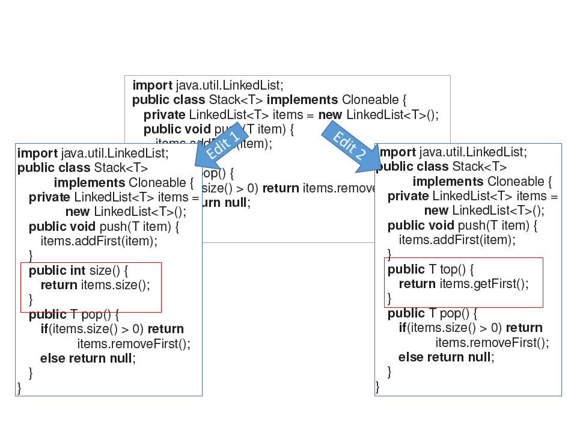
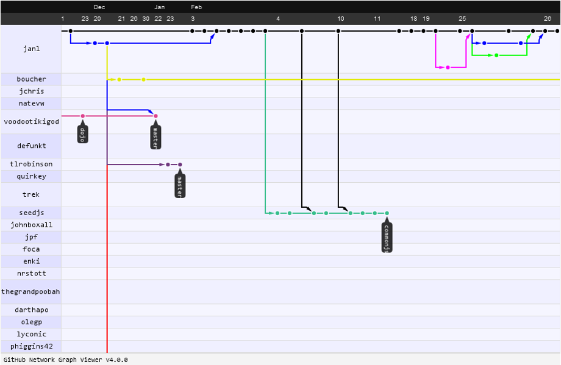

# Software Engineering Bootcamp

Christian Kaestner

<!-- references -->

Required reading: 
Mary Shaw (ed), [Software Engineering for the 21st Century: A basis for rethinking the curriculum](http://ra.adm.cs.cmu.edu/anon/usr0/anon/usr/ftp/isri2005/CMU-ISRI-05-108.pdf), 2015, Sec 1-3

Notes:

Most students will know this; this is a refresher and provides an overview. This is the bare minimum of software engineering practices a la https://software-carpentry.org/

---

# Learning Goals

* Recognize the importance of process
* Describe common agile practices and their goals
* Apply basic software engineering practices during coding (including version control, documentation, issue tracking)
* Use milestones for planning and progress measurement
* Describe common qualities of interest and how to measure them


---

# Process

----

## Innovative vs Routine Projects

* Most software projects are innovative
    - Google, Amazon, Ebay, Netflix
    - Vehicles and robotics
    - Language processing, Graphics, AI
* Routine (now, not 20 years ago)
    - E-commerce websites?
    - Product recommendation? Voice recognition?
    - Routine gets automated -> innovation cycle

----

## A Simple Process

1. Discuss the software that needs to be written
2. Write some code
3. Test the code to identify the defects
4. Debug to find causes of defects
5. Fix the defects
6. If not done, return to step 1

----

## Software Process

> “The set of activities and associated results that produce a software product”


Examples?

<!-- discussion -->

Notes: 

Writing down all requirements
Require approval for all changes to requirements
Use version control for all changes
Track all reported bugs
Review requirements and code
Break down development into smaller tasks and schedule and monitor them
Planning and conducting quality assurance 
Have daily status meetings
Use Docker containers to push code between developers and operation

----


Notes: Visualization following McConnell, Steve. Software project survival guide. Pearson Education, 1998.
----

Notes: Idea: spent most of the time on coding, accept a little rework
----

Notes: negative view of process. pure overhead, reduces productive work, limits creativity
----


Notes: Real experience if little attention is payed to process: increasingly complicated, increasing rework; attempts to rescue by introducing process

----

## Example of Process Problems?

<!-- discussion -->

Notes: 
Collect examples of what could go wrong:

Change Control: Mid-project informal agreement to changes suggested by customer or manager. Project scope expands 25-50%
Quality Assurance: Late detection of requirements and design issues. Test-debug-reimplement cycle limits development of new features. Release with known defects.
Defect Tracking: Bug reports collected informally, forgotten
System Integration: Integration of independently developed components at the very end of the project. Interfaces out of sync.
Source Code Control: Accidentally overwritten changes, lost work.
Scheduling: When project is behind, developers are asked weekly for new estimates.

----

## Example of Process Problems for AI-Enabled Systems?

<!-- discussion -->

----
## Survival Mode

* Missed deadlines -> "solo development mode" to meet own deadlines
* Ignore integration work
* Stop interacting with testers, technical writers, managers, ...
----
Hypothesis: Process increases flexibility and efficiency +  Upfront investment for later greater returns


Notes: ideal setting of little process investment upfront
----

Notes: Empirically well established rule: Bugs are increasingly expensive to fix the larger the distance between the phase where they are created vs where they are corrected.
----

Notes: Complicated processes like these are often what people associate with "process". Software process is needed, but does not need to be complicated.


---


# Basic Software Engineering Practices

----

## Abstraction & Automation

Avoid repetition:

Code clone ▶ Method ▶ Library 

Similar problems, programs ▶ Frameworks, Configurations, Product Lines

Data gathering ▶ List comprehensions ▶ SQL

Command line steps ▶ Compilers and code generators ▶ Build systems

Manual testing ▶ Unit testing ▶ Continuous integration and deployment

Code inspection ▶ Static analysis

Manual issue tracking ▶ Issue tracking systems ▶ Bots and AI

**Abstraction & automation for AI-enabled systems?**

----

## Abstraction & Automation when Building AI-Enabled Systems?

<!-- discussion -->

----
## Version control

----
## Version control

* System that records changes to a set of files over time
  * Revert files back to a previous state
  * Revert entire project back to a previous state
  * Compare changes over time
  * See who last modified something that might be causing a problem
* As opposed to: 
```
hw1.java
hw1_v2.java
hw1_v3.java
hw1_final.java
hw1_final_new.java
```

----

## Collaborative editing

* Working on local copies of a repository
* Work often affects different files
    * Pessimistic strategy: lock files
    * Optimistic strategy: merge on conflict

<!-- colstart -->


<!-- col -->


<!-- colend -->

----

## Good Commit Practices

* Small cohesive commits
* Commit messages summarizing work and explaining rationale, short subject line
* Link to issue, task, or feature request where appropriate

```
add assertShape to validate templateElement (#10198)

* add assertShape to validate templateElement

* Update packages/babel-types/src/definitions/utils.js

Co-Authored-By: Nicolò Ribaudo <nicolo.ribaudo@gmail.com>

* templateElement optional cooked
```

[](https://xkcd.com/1296/)

----

## Forks and Pull Requests



----

## Release management


----

## What files to manage

* All code and noncode files
    - Java code
    - Build scripts
    - Documentation
    - Dependencies (maven, npm)
* Configuration files
    - Application and system configuration
    - e.g. Docker, Ansible, Puppet
* Exclude generated files (.class) and secrets (passwords)

----

## Managing Variants

* Branching for variants does not scale well
* Requires special planning or tooling
* Many solutions
    * Configuration files, feature flags -> runtime *if* statements
    * Preprocessors
    * Build systems
    * DSLs
    * Software product lines
    * ...

<!-- split -->

```c
/* common parts */
...
#if (OS == Unix)
  void load(...) { ... }
#elif (OS === VMS)
  void load(...) { ... }
  void free() { ... }
#else 
  void load(...) { ... }
#endif
...
```


----

## Versioning in AI-Enabled Systems?

<!-- discussion -->

----

## Builds

* All but the smallest projects have a nontrivial build process 
* You want to capture and automate the knowledge of how to build your system, ideally in a single command 
* Build scripts are code (executable specifications) that need to be managed just like other pieces of code 
* Use a build tool to script building, packaging, testing, and deploying your system 
    * Most IDEs have an integrated build system 
+ Makes sure the application builds also on other machines

----

## Quality Assurance

* Dynamic techniques (executing the code, select inputs)
    - Testing 
    - Dynamic analysis/instrumentation
* Static techniques (not executing the code, all executions)
    - Code review/inspection
    - Static analysis, data-flow analysis
    - Formal verification
* Process quality

----
## Test automation

```java
@Test
public void testSanityTest(){
    //setup
    Graph g1 = new AdjacencyListGraph(10);
    Vertex s1 = new Vertex("A");
    Vertex s2 = new Vertex("B");
    //check expected behavior
    assertEquals(true, g1.addVertex(s1));
    assertEquals(true, g1.addVertex(s2));
    assertEquals(true, g1.addEdge(s1, s2));
    assertEquals(s2, g1.getNeighbors(s1)[0]);
}
```


----

## Test Coverage


----

## Continuous Integration


----

## Continuous Integration


----

## Continuous Deployment


----

## Build, Test, and Deployment Automation in AI-Enabled Systems?

<!-- discussion -->

----

## Documentation and Naming

* Great code should not need documentation
    - Use self-documenting method and variable names
    - Named constants rather than magic numbers
* Documentation can still make it better though
*
* Document rationale, rather than repeating code
* API documentation at interfaces (contracts, information hiding) 

----

## Defect Tracking

* Issues: Bug, feature request, query
* Basis for measurement (when, where, who, difficulty, ...)
* Facilitates communication 
    * questions back to reporter
    * ensures reports are not forgotten
* Accountability

<!-- split -->


---

# Planning, Requirements, and Design in a Nutshell

----

## A Simple Process

1. Discuss the software that needs to be written
2. Write some code
3. Test the code to identify the defects
4. Debug to find causes of defects
5. Fix the defects
6. If not done, return to step 1

----


<!-- .element: class="stretch" -->

([CC-BY-SA-2.5](https://commons.wikimedia.org/wiki/File:Waterfall_model.png))

Notes: Although dated, the key idea is still essential -- think and plan before implementing. Not all requirements and design can be made upfront, but planning is usually helpful.

----

## Requirements

> Requirements say what the system will do (and not how it will do it).

-

> The hardest single part of building a software system is deciding precisely what to build. 
> No other part of the conceptual work is as difficult as establishing the detailed technical requirements ... 
> No other part of the work so cripples the resulting system if done wrong. 
> No other part is as difficult to rectify later.     — Fred Brooks

----
## Functional Req.

* What the machine should do 
    - Input 
    - Output
    - Interface
    - Response to events 
* Criteria 
    - Completeness: All requirements are documented 
    - Consistency: No conflicts between requirements 
    - Precision: No ambiguity in requirements 

<!-- split -->

## Quality Requirements

* Specify the quality with which functionality is delivered
    - Performance, security, safety, maintainability, ...
* Can be more critical than functional requirements
    - Can work around missing functionality
    - Low-quality system may be unusable 
* Guide tradeoff decisions between conflicting requirements

----

## Qualities of Interest

* Quality in use (effectiveness, efficiency, satisfaction, freedom of risk, ...)
* Product quality (functional correctness and completeness, performance efficiency, compatibility, usability, dependability, scalability, security, maintainability, portability, ...)
* Process quality (manageability, evolvability, predictability, ...)
* 
* **Qualities in AI-Enabled Systems?**


----

## Measurement 

> Measurement is the empirical, objective assignment of numbers, according to a rule derived from a model or theory, to attributes of objects or events with the intent of describing them. –- Craner, Bond, “[Software Engineering Metrics: What Do They Measure and How Do We Know?](https://citeseerx.ist.psu.edu/viewdoc/summary?doi=10.1.1.1.2542)”  

-

> A quantitatively expressed reduction of uncertainty based on one or more observations. – Hubbard, “[How to Measure Anything: Finding the Value of Intangibles in Business](https://www.howtomeasureanything.com/)”

----

## Everything is measureable

* If X is something we care about, then X, by definition, must be detectable. 
    * How could we care about things like “quality,” “risk,” “security,” or “public image” if these things were totally undetectable, directly or indirectly? 
    * If we have reason to care about some unknown quantity, it is because we think it corresponds to desirable or undesirable results in some way. 
* If X is detectable, then it must be detectable in some amount. 
    * If you can observe a thing at all, you can observe more of it or less of it 
* If we can observe it in some amount, then it must be measurable. 

<!-- references -->

Hubbard, “[How to Measure Anything: Finding the Value of Intangibles in Business](https://www.howtomeasureanything.com/)”. 2010

----

## How to measure ...

* Performance
* Extensibility
* Accuracy
* Portability
* Developer productivity
* Fairness
* Operation cost


----

## Goal-Question-Metric Approach

Example:

* Goal: Analyze the unit test process to understand the impact of adding additional tests to project Alpha from the viewpoint of the project manager 
* Q1: What is current test time
    - Num. test run per week
    - Time per passing test
* Q2: How effective are we at finding defects
    - Time per passing test
    - Num. of tests that find defect
    - Defects found in unit testing

<!-- references -->

Further reading: Victor R. Basili, Gianluigi Caldiera, H. Dieter Rombach. [The Goal Question Metric Approach](https://www.cs.umd.edu/~mvz/handouts/gqm.pdf). 1994

----

## Requirements, now what?

Requirements >> ??? >> Code

-

"should be highly available"

"should answer quickly, accuracy is less relevant"

"needs to be extensible"

"should efficiently use hardware resources"

----

## Architecture and Design


Planning and making tradeoff decisions among alternative designs:
* Real-world constraints: budget, time, customer requirements
* Not all goals and qualities achievable -- prioritize and compromise
* Make tradeoff decisions among competing designs, e.g.,
    - scalable vs. accurate
    - provably correct vs. quickly delivered
    - first to market vs. fully featured
* Analysis and modeling before committing to an implementation
  

-

**Tradeoff analysis is in the heart of software engineering**

----

## Planning


----

## Planning

> Planning is everything, the plan is nothing. 
> -- Dwight Eisenhower

* Effort estimation is difficult, requires practice and calibration
* "I’m 90% done" -- progress estimates are unreliable
   * use milestones with objective deliverables
* Replan, when changes occur
    - delays, changed requirements, technical problems, ...
    - request more time/money, reassign work, renegotiate requirements, ...

---
# Agile Practices in a Nutshell

----


## Key challenge: Change

* Software seems changeable ("soft")
* Developers prone to changes and "extra features"
* Customers often do not understand what is easy to change and what is hard
* "Good enough" vs. "optimal"

----


<!-- .element: class="stretch" -->

([CC-BY-SA-2.5](https://commons.wikimedia.org/wiki/File:Waterfall_model.png))

----

## Sequencing

* Enforce earlier software considerations 

* Modeled after traditional engineering 
  - blueprints before construction
  - decide what to build, build it, test it, deploy
  - reduce change

* Successful model for routine development

* Problematic at large scale

* Requirements -> Delays -> Surprise!
* **Need early and frequent feedback, support for constant adaptation, prioritize risk**

----

## Iterative Processes

* Interleaving and repeating
    * Requirements engineering, Risk assessment
    * Architecture and design
    * Implementation
    * Quality assurance
    * Deployment


<!-- .element: class="stretch" -->

----
## Agile Manifesto

> Individuals and interactions ▶ processes and tools
> Working software ▶ comprehensive documentation
> Customer collaboration ▶ contract negotiation
> Responding to change ▶ following a plan


Agile: A project management approach that seeks to respond to change and unpredictability, primarily using incremental, iterative work sequences (often called “sprints”) + a collection of practices to facility that approach.

----
## Agile Practices

Backlogs (Product and Sprint), 
Behavior-driven development (BDD), 
Cross-functional team, 
Continuous integration (CI), 
Domain-driven design (DDD), 
Information radiators (Kanban board, Task board, Burndown chart), 
Acceptance test-driven development (ATDD), 
Iterative and incremental development (IID), 
Pair programming, 
Planning poker, 
Refactoring, 
Scrum meetings (Sprint planning, Daily scrum, Sprint review and retrospective), 
Small releases, 
Simple design, 
Test-driven development (TDD), 
Agile testing, 
Timeboxing, 
Use case, 
User story, 
Story-driven modeling, 
Retrospective, 
On-site customer, 
Agile Modeling, 
40-hour weeks, 
Short development cycles, 
Collective ownership, 
Open workspace, 
Velocity tracking, 
...

----

## Select Practices

* Kanban Board
* Simple Design
* Refactoring vs Design
* On-site Customer
* Short Development Cycles

----


<!-- .element: class="stretch" -->

(Kanban Board)

----

## Scrum


---

# Summary

* Software engineering is all about tradeoffs
    - Limited resources 
    - Competing quality goals
    - Alternative designs
* Process is important, planning vs reacting
* Basic practices of version control, build and test automation

