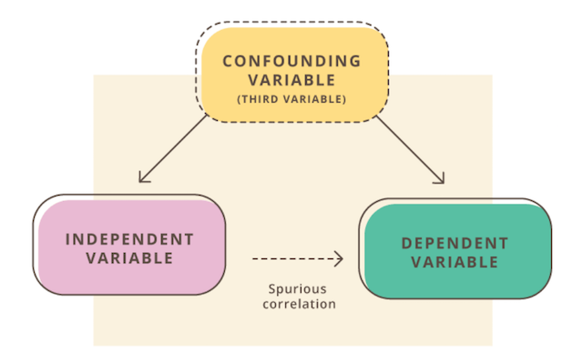
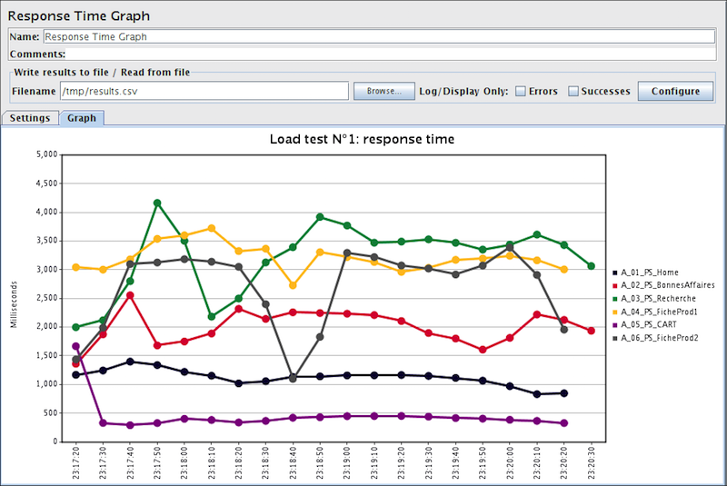

# Learning Goals

* Understand:
  * Challenges in building AI-based systems
  * Key differences from traditional software
  * Use of measurements in AI-based systems 
  * Difficulty and validity of measurements
  * Limitations and risks of decisions and incentives based
on measurements

---
# Challenges in Developing AI-Enabled Systems

----
## Traditional Programming vs ML


----
## Complexity in Engineering Systems


* Automobile: ~30,000 parts; Airplane: ~3,000,000 parts
* MS Office: ~ 40,000,000 LOCs; Debian: ~ 400,000,000 LOCs

## Q. How do we build such complex systems?

----
## Managing Complexity in Software

* **Abstraction**: Hide details & focus on high-level behaviors
* **Reuse**: Package into reusable libraries & APIs with well-defined _contracts_
* **Composition**: Build large components out of smaller ones

```java
class Algorithms {
    /**
     * Finds the shortest distance between to vertices.
	 * This method is only supported for connected vertices.
     */
    int shortestDistance(Graph g, Vertice v1, v2) {…}
}
```

----
## Contracts in ML?


**Q. Is this the same kind of contract as in software?**

----
## (Lack of) Modularity in ML

* Often no clear specification of "correct" behavior
  <!-- .element: class="fragment" -->
  * Optimizing metrics instead of providing guarantees
* Model behavior strongly dependent on training & test sets
  <!-- .element: class="fragment" -->
  * What happens if distribution changes?
* Poorly understood interactions between models
  <!-- .element: class="fragment" -->
  * Ideally, develop models separately & compose together
  * In general, must train & tune together

----
## Concept Drifts

* ML estimates "f(x) = y"
<!-- .element: class="fragment" -->
  * What if the relationship between "x" & "y" changes over time? 
  * What if "f" does not capture certain relationships?
* Q. Examples?
<!-- .element: class="fragment" -->
* In general, impossible to predict
<!-- .element: class="fragment" -->
	* Continuously monitor and update model

----
## Feedback loops

* Every system is deployed as part of an environment
<!-- .element: class="fragment" -->
* Output influences the environment
<!-- .element: class="fragment" -->
  * In turn, affects input back to the system
  * Over time, may lead to undesirable (and difficult to reverse) outcome
  * In AI, esp. true if initial model is biased


----
## Example: Crime Prediction

* Use past data to predict crime rates 
* Police increases the frequency of patrol in area X
* More arrested made in area X
* New crime data fed back to the model
* Repeat


----
## Discussion: Product Recommendations


* Specification/metrics?
* Concept drift?
* Feedback loop?

---
# Introduction to Measurements

----
## What is Measurement?

* _Measurement is the empirical, objective assignment of numbers,
according to a rule derived from a model or theory, to attributes of
objects or events with the intent of describing them._ – Craner, Bond,
“Software Engineering Metrics: What Do They Measure and How Do We
Know?"

* 	_A quantitatively expressed reduction of uncertainty based on one or more observations._ – Hubbard, “How to Measure Anything …"

----
## Measurement for Decision Making

* Which project to fund?
* Need more system testing?
* Fast enough? Secure enough? 
* Code quality sufficient?
* Which features to focus on?
* Developer bonus?
* Time and cost estimation? Predictions reliable?

----
## Measurement Scales

* Scale: The type of data being measured.
<!-- .element: class="fragment" -->
  * Dictates what sorts of analysis/arithmetic is legitimate or meaningful.
* Nominal: Categories
<!-- .element: class="fragment" -->
  * e.g., biological species, film genre, nationality
* Ordinal: Order, but no meaningful magnitude
<!-- .element: class="fragment" -->
  * Difference between two values is not meaningful
  * Even if numbers are used, they do not represent magnitude!
  * e.g., weather severity, complexity classes in algorithms
* Interval: Order, magnitude, but no definition of zero.
<!-- .element: class="fragment" -->
  * 0 is an arbitrary point; does not represent absence of quantity
  * Ratio between values are not meaningful
  * e.g., temperature (C or F)
* Ratio: Order, magnitude, and zero.
<!-- .element: class="fragment" -->
  * e.g., mass, length, temperature (Kelvin)

----
##  Measurement Scales 


----
## Measurements in AI-Enabled Systems

* Organizational objectives
<!-- .element: class="fragment" -->
  * e.g., revenues, growth, lives saved, societal benefits 
  * Often not directly measurable from system output; slow indicators
* Leading indicators
<!-- .element: class="fragment" -->
  * Customer sentiment: Do they like the product?
  * Customer engagement: How often do they use the product?
  * But can be misleading (more daily active users => higher profits?)
* User outcomes
<!-- .element: class="fragment" -->
	* Does the system achieve what it promises to users?
* Model Properties
<!-- .element: class="fragment" -->
  * Accuracy of predictions, error rates
  * Performance
  * Cost: Training time, amount of data required

----
## Exercise: Metrics in Product Recommender


* Organization objectives?
* Leading indicators?
* User outcomes?
* Model properties?
* What are their scales?

---
# Challenges in Measurements

----
## The streetlight effect

* A type of _observational bias_
* People tend to look for something where it’s easiest to do so.


----
## Risks with Measurements

* Bad statistics: A basic misunderstanding of measurement theory and what is being measured.
<!-- .element: class="fragment" -->
* Bad decisions: The incorrect use of measurement data, leading to unintended side effects.
<!-- .element: class="fragment" -->
* Bad incentives: Disregard for the human factors, or how the cultural change of taking measurements will affect people.
<!-- .element: class="fragment" -->

----
## Risks of Metrics as Incentives

* Can extinguish intrinsic motivation
* Can diminish performance
* Can encourage cheating, shortcuts, and unethical behavior
* Can become addictive
* Can foster short-term thinking

----
## Another Case Study: University Rankings


* Originally: Opinion-based polls, but schools complained
* Data-driven model: Rank colleges in terms of "educational excellence"
* Input: SAT scores, student-teacher ratios, acceptance rates,
retention rates, alumni donations, etc.,

----
## Discussion: University Rankings


* What is (not) being measured? Any streetlight effect?
* Is the measured data being used correctly?
* Are incentives for using these data good? Can they be misused?

----
## Example: Abuse of Metrics

* A university founded in early 2010's
<!-- .element: class="fragment" -->
* Math department ranked by US News as top 10 worldwide
<!-- .element: class="fragment" -->
* Top international faculty paid $$ as a visitor; asked to add affiliation
<!-- .element: class="fragment" -->
* Increase in publication citations => skyrocket ranking!
<!-- .element: class="fragment" -->

----
## Measurement Validity

* Construct: Are we measuring what we intended to measure?
<!-- .element: class="fragment" -->
  * Does the abstract concept match the specific scale/measurement used?
  * e.g., IQ: What is it actually measuring?
  * Other examples: Pain, language proficiency, personality...
* Predictive: The extent to which the measurement can be used to explain some other characteristic of the entity being measured
<!-- .element: class="fragment" -->
	* e.g., Higher SAT scores => higher academic excellence?
* External validity: Concerns the generalization of the findings to contexts and environments, other than the one studied
<!-- .element: class="fragment" -->
	* e.g., Drug effectiveness on test group: Does it hold over the general public? 

----
##  Correlation vs Causation


----
##  Correlation vs Causation

* In general, ML learns correlation, not causation
<!-- .element: class="fragment" -->
	* (exception: Bayesian networks, certain symbolic AI methods)
* To establish causality:
<!-- .element: class="fragment" -->
  * Develop a theory ("X causes Y") based on domain knowledge & independent data
  * Identify relevant variables
  * Design a controlled experiment & show correlation
  * Demonstrate ability to predict new cases
  
----
## Confounding Variables



* If you want to show correlation between X and Y:
  * Identify potential confounding variables 
  * Control for those variables during measurement
* Examples
  * Drink coffee => Pancreatic cancer?
  * Degree from high-ranked schools => Higher-paying jobs?
  
----
## Successful Measurement Program

* Set solid measurement objectives and plans.
* Make measurement part of the process.
* Gain a thorough understanding of measurement.
* Focus on cultural issues.
* Create a safe environment to collect and report true data.
* Cultivate a predisposition to change.
* Develop a complementary suite of measures.

----
## Recitation This Week



### Apache JMeter: Performance Measuring Tool

---
# Summary

* Challenges in ML: Lack of specification, concept drift, feedback loop 
* Introduction to measurements: Scales, validity, correlation & causation
* Risks with measurements: Incentives & misuse
