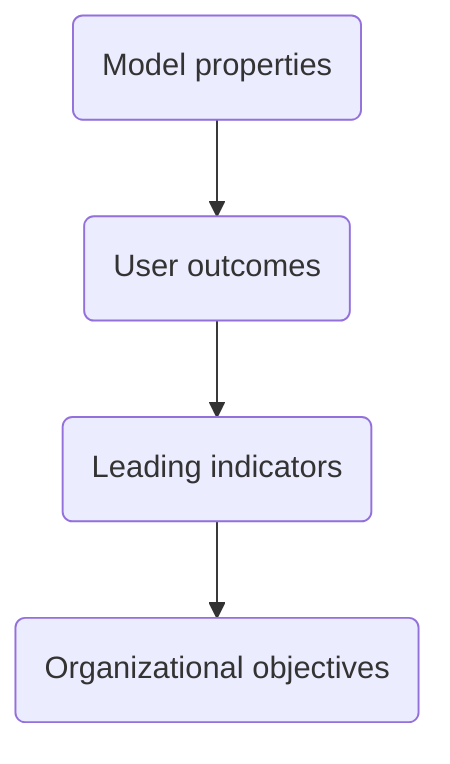
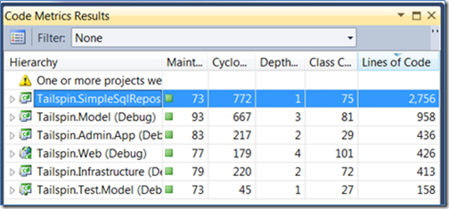
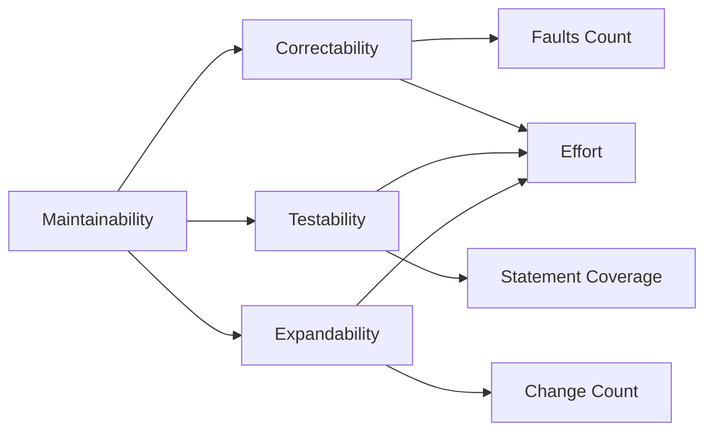
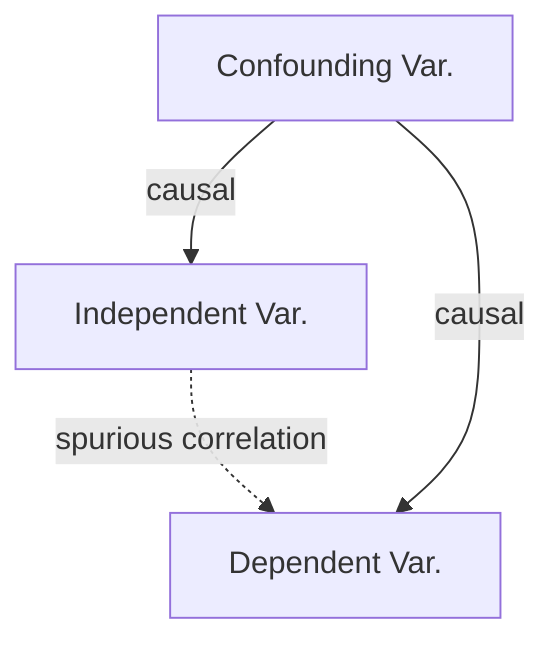
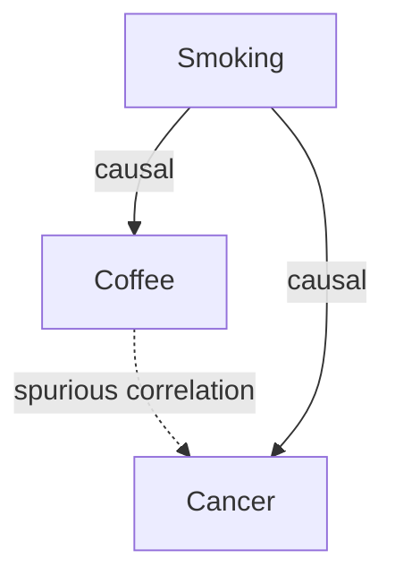

# Learning goals

* Judge when to apply ML for a problem in a system
* Define system goals and map them to goals for ML components
* Understand the key concepts and risks of measurement


---
## Today's Case Study: Spotify Personalized Playlists

[](spotify.png)
<!-- .element: class="stretch" -->


---
# When to use Machine Learning?

----
# When to use Machine Learning?


<!-- .element: class="stretch" -->

----
## When not to use Machine Learning?

* Clear specifications are available
* Simple heuristics are *good enough*
* Cost of building and maintaining the system outweighs the benefits (see technical debt paper)
* Correctness is of utmost importance
* ML is used only for the hype, to attract funding

**Examples?**

Notes:

Heuristics: Filtering out profanity in languages

Tasks that are done infrequently or once in a while

Accounting systems, inventory tracking, physics simulations, safety railguards, fly-by-wire

----
## Consider Non-ML Baselines

* Consider simple heuristics -- how far can you get?
* Consider semi-manual approaches -- cost and benefit?
* Consider the system without that feature
*
* **Discuss Examples**
    - Ranking apps, recommending products
    - Filtering spam or malicious advertisement
    - Creating subtitles for conference videos
    - Summarizing soccer games
    - Controlling a washing machine

----
## When to use Machine Learning

* Big problems: Many inputs, massive scale
* Open-ended problems: No single solution, incremental improvements, continue to grow
* Time-changing problems: Adapting to constant change, learn with users
* Intrinsically hard problems: Unclear rules, heuristics perform poorly

**Examples?**

<!-- references -->
see Hulten, Chapter 2

----
## Additional Considerations for ML

* Partial solution is acceptable: Mistakes are acceptable or mitigable
* Data for continuous improvement is available
* Predictions can have an influence on system objectives: Does it
  actually contribute to organizational objectives?
* Cost effective: Cheaper than other approaches, or benefits clearly
  outweigh costs

**Examples?**

<!-- references -->
see Hulten, Chapter 2
----
## Spotify: Use of ML?

*Big problem? Open ended? Time changing? Hard? Partial solution acceptable? Data continuously available? Influence objectives? Cost effective?*

[](spotify.png)
<!-- .element: class="stretch" -->


----
## Recidivism: Use of ML?

*Big problem? Open ended? Time changing? Hard? Partial solution acceptable? Data continuously available? Influence objectives? Cost effective?*


<!-- .element: class="stretch" -->


---
# System Goals

----
## Layers of Success Measures

* Organizational objectives: Innate/overall goals of the organization
* Leading indicators: Measures correlating with future success, from the business perspective
* User outcomes: How well the system is serving its users, from the user's perspective
* Model properties: Quality of the model used in a system, from the model's perspective

**Ideally, these goals should be aligned with each other**

<!-- split -->



----
## Organizational Objectives

*Innate/overall goals of the organization*

* Business
    * Current revenue, profit
    * Future revenue, profit
    * Reduce business risks
* Non-Profits
    - Lives saved, animal welfare increased
    - CO2 reduced, fires averted
    - Social justice improved, well-being elevated, fairness improved
* Often not directly measurable from system output; slow indicators

**Accurate models themselves are not the ultimate goal!**

**AI may only very indirectly influence such organizational
  objectives; influence hard to quantify; lagging measures**


<!-- ---- -->
<!-- ## Breaking Down Processes -->

<!-- Break overall goals along processes -->

<!-- * Break workflow into tasks -->
<!-- * Identify decisions in tasks -->
<!-- * Evaluate benefit of AI for prediction or automation -->
<!-- * Evaluate the influence of improving some tasks on process -->

<!-- Maintain mapping from task-specific goals to system goals -->

----
## Leading Indicators

*Measures correlating with future success, from the business perspective*

* Customers sentiment: Do they like the product? (e.g., surveys, ratings)
* Customer engagement: How often do they use the product?
  * Regular use, time spent on site, messages posted
  * Growing user numbers, recommendations

**Indirect proxy measures, lagging, bias**

**Can be misleading (more daily active users => higher profits?)**


----
## User Outcomes

*How well the system is serving its users, from the user's perspective*

* Users receive meaningful recommendations, enjoying content
* Users making better decisions
* Users saving time due to system
* Users achieving their goals

**Easier and more granular to measure, but only indirect relation to organization objectives**

----
## Model Properties

*Quality of the model used in a system, from the model's perspective*

* Model accuracy
* Rate and kinds of mistakes
* Successful user interactions
* Inference time
* Training cost

**Not directly linked to business goals**

<!-- ---- -->
<!-- ## Layering of Success Measures -->

<!-- *Example: Amazon shopping recommendations* -->

<!-- Closely watch model properties for degradation; optimize accuracy; ongoing -->

<!-- Weekly review user outcomes, e.g., sales, reviews returns -->

<!-- Monthly review trends of leading indicators, e.g., shopper loyalty -->

<!-- Quarterly ensure look at organizational objectives -->

<!-- <\!-- split -\-> -->

<!-- ```mermaid -->
<!-- graph TD; -->
<!-- MP(Model properties) -\-> UO(User outcomes) -->
<!-- UO -\-> LI(Leading indicators) -->
<!-- LI -\-> OO(Organizational objectives) -->
<!-- ``` -->


----
## Success Measures in the Spotify Scenario?

[](spotify.png)
<!-- .element: class="stretch" -->

Organizational objectives? Leading indicators? User outcomes? Model properties?

<!-- split -->


----
## Exercise: Automating Admission Decisions to Master's Program
<!-- smallish -->
Discuss in groups, breakout rooms

What are the *goals* behind automating admissions decisions?

**Organizational objectives, leading indicators, user outcomes, model properties?**

Report back in 10 min

<!-- discussion -->


---
# Measurement

----
## What is Measurement?

* _Measurement is the empirical, objective assignment of numbers,
according to a rule derived from a model or theory, to attributes of
objects or events with the intent of describing them._ – Craner, Bond,
“Software Engineering Metrics: What Do They Measure and How Do We
Know?"

*  _A quantitatively expressed reduction of uncertainty based on one or more observations._ – Hubbard, “How to Measure Anything …"


----
## Everything is Measurable

* If X is something we care about, then X, by definition, must be
detectable.
<!-- .element: class="fragment" -->
    * How could we care about things like “quality,” “risk,” “security,” or “public image” if these things were totally undetectable, directly or indirectly?
    * If we have reason to care about some unknown quantity, it is because
we think it corresponds to desirable or undesirable results in some way.
* If X is detectable, then it must be detectable in some amount.
<!-- .element: class="fragment" -->
	* If you can observe a thing at all, you can observe more of it or less of it
* If we can observe it in some amount, then it must be
measurable.
<!-- .element: class="fragment" -->

*But: Not every measure is precise, not every measure is cost effective*
<!-- .element: class="fragment" -->

<!-- references -->

Douglas Hubbard, “[How to Measure Anything: finding the value of intangibles in business](https://cmu.primo.exlibrisgroup.com/permalink/01CMU_INST/1feg4j8/alma991019515498904436)" 2014


----
## On Terminology

* *Quantification* is turning observations into numbers
* *Metric* and *measure* refer a method or standard format for measuring something (e.g., number of mistakes per hour)
  - Metric and measure synonymous for our purposes (some distinguish metrics as derived from multiple measures, or metrics to be standardizes measures)
* *Operationalization* is identifying and implementing a method to
  measure some factor (e.g., identifying mistakes from telemetry log file)

<!-- ## The Maintainability Index -->

<!-- $max(0, (171 - 5.2 ln(HV) - 0.23 CC - 16.2 ln(LOC)*100/171))$ -->
<!-- $<10$: low maintainability, $\leq 20$ high maintainability -->

<!--  -->

<!-- <\!-- references -\-> -->
<!-- Further reading: Arie van Deursen, [Think Twice Before Using the “Maintainability Index”](https://avandeursen.com/2014/08/29/think-twice-before-using-the-maintainability-index/), Blog Post, 2014 -->

----
## Measurement in Software Engineering

* Which project to fund?
* Need more system testing?
* Need more training?
* Fast enough? Secure enough? 
* Code quality sufficient?
* Which features to focus on?
* Developer bonus?
* Time and cost estimation? Predictions reliable?
<!-- split -->

## Measurement in Data Science

* Which model is more accurate?
* Does my model generalize or overfit?
* How noisy is my training data?
* Is my model fair?
* Is my model robust?


----
## Measurement Scales
<!-- smallish -->
* Scale: Type of data being measured; dictates what analysis/arithmetic is meaningful
* Nominal: Categories ($=, \neq$, frequency, mode, ...)
<!-- .element: class="fragment" -->
  * e.g., biological species, film genre, nationality
* Ordinal: Order, but no meaningful magnitude ($<, >$, median, rank correlation, ...)
<!-- .element: class="fragment" -->
  * Difference between two values is not meaningful
  * Even if numbers are used, they do not represent magnitude!
  * e.g., weather severity, complexity classes in algorithms
* Interval: Order, magnitude, but no definition of zero ($+, -$, mean, variance, ...)
<!-- .element: class="fragment" -->
  * 0 is an arbitrary point; does not represent absence of quantity
  * Ratio between values are not meaningful
  * e.g., temperature (C or F)
* Ratio: Order, magnitude, and zero ($*, /, log, \sqrt{\ }$, geometric mean)
<!-- .element: class="fragment" -->
  * e.g., mass, length, temperature (Kelvin)
* Understand scales of features and use an appropriate encoding for
  learning algorithms!
<!-- .element: class="fragment" -->
  * e.g., One-hot encoding for nominal features


----
## Decomposition of Measures
Often higher-level measures are composed from lower level measures

Clear trace from specific low-level measurements to high-level metric




<!-- references -->
For design strategy, see [Goal-Question-Metric approach](https://en.wikipedia.org/wiki/GQM)

----
## Specifying Metrics

* Always be precise about metrics
    - "measure accuracy" -> "evaluate accuracy with MAPE"
    - "evaluate test quality" -> "measure branch coverage with Jacoco"
    - "measure execution time" -> "average and 90%-quantile response time for REST-API x under normal load"
    - "assess developer skills" -> "measure average lines of code produced per day and number of bugs reported on code produced by that developer"
    - "measure customer happiness" -> "report response rate and average customer rating on survey shown to 2% of all customers (randomly selected)"
* Ideally: An independent party should be able to independently set up infrastructure to measure outcomes

----
## Exercise: Specific Metrics for Spotify Goals?

* Organization objectives?
* Leading indicators?
* User outcomes?
* Model properties?
* What are their scales?

<!-- split -->

[](spotify.png)
<!-- .element: class="stretch" -->


----
## Risks with Measurements

* Bad statistics: A basic misunderstanding of measurement theory and what is being measured.
<!-- .element: class="fragment" -->
* Bad decisions: The incorrect use of measurement data, leading to unintended side effects.
<!-- .element: class="fragment" -->
* Bad incentives: Disregard for the human factors, or how the cultural change of taking measurements will affect people.
<!-- .element: class="fragment" -->

----
## Measurement Validity

* Construct: Are we measuring what we intended to measure?
<!-- .element: class="fragment" -->
  * Does the abstract concept match the specific scale/measurement used?
  * e.g., IQ: What is it actually measuring?
  * Other examples: Pain, language proficiency, personality...
* Predictive: The extent to which the measurement can be used to explain some other characteristic of the entity being measured
<!-- .element: class="fragment" -->
    * e.g., Higher SAT scores => higher academic excellence?
* External validity: Concerns the generalization of the findings to contexts and environments, other than the one studied
<!-- .element: class="fragment" -->
	* e.g., Drug effectiveness on test group: Does it hold over the general public? 

----
##  Correlation vs Causation

https://www.tylervigen.com/spurious-correlations


----
##  Correlation vs Causation

* In general, ML learns correlation, not causation
  * (exception: Bayesian networks, certain symbolic AI methods)
  * For more details: See [causal inference](https://blog.ml.cmu.edu/2020/08/31/7-causality/)
* Be careful about interpretation & intervention based on correlations
  * e.g., positive correlation between exercise and skin cancer
  * Exercise less => reduce chance of skin cancer?
* To establish causality:
  * Develop a theory ("X causes Y") based on domain knowledge & independent data
  * Identify relevant variables
  * Design a controlled experiment & show correlation
  * Demonstrate ability to predict new cases

----
## Confounding Variables

<!-- colstart -->

<!-- col -->

<!-- colend -->

----
## Confounding Variables

* To identify spurious correlations between X and Y:
  * Identify potential confounding variables 
  * Control for those variables during measurement
	* Randomize, fix, or measure + account for during analysis
	* e.g., control for ''smoke'', check whether ''drink coffee" =>
      "pancreatic cancer"
* Other examples
  * Degree from top-ranked schools => higher salary
  * Age => credit card default rate
  * Exercise => skin cancer
  * and many more... 

----
## Streetlight effect

* A type of _observational bias_
* People tend to look for something where it’s easiest to do so
  * Use cheap proxy metrics that only poorly correlate with goal
  * e.g., number of daily active users as a measure of projected revenue


<!-- .element: class="stretch" -->

----
## Risks of Metrics as Incentives

* Metrics-driven incentives can:
  * Extinguish intrinsic motivation
  * Diminish performance
  * Encourage cheating, shortcuts, and unethical behavior
  * Become addictive
  * Foster short-term thinking
* Often, different stakeholders have different incentives

**Make sure data scientists and software engineers share goals and success measures**

----
## Example: University Rankings


* Originally: Opinion-based polls, but complaints by schools on subjectivity
* Data-driven model: Rank colleges in terms of "educational excellence"
* Input: SAT scores, student-teacher ratios, acceptance rates,
retention rates, alumni donations, etc.,

----
## Example: University Rankings


* Who are different stakeholders? What are their incentives? Can they
be misused or cause unintended side effects?

For more, see Weapons of Math Destruction by Cathy O'Neil

Notes:

* Example 1
  * Schools optimize metrics for higher ranking (add new classrooms, nicer
  facilities)
  * Tuition increases, but is not part of the model!
  * Higher ranked schools become more expensive
  * Advantage to students from wealthy families
* Example 2
  * A university founded in early 2010's
  * Math department ranked by US News as top 10 worldwide
  * Top international faculty paid \$\$ as a visitor; asked to add affiliation
  * Increase in publication citations => skyrocket ranking!


----
## Successful Measurement Program

* Set solid measurement objectives and plans
* Make measurement part of the process
* Gain a thorough understanding of measurement
* Focus on cultural issues
* Create a safe environment to collect and report true data
* Cultivate a predisposition to change
* Develop a complementary suite of measures


<!-- --- -->
<!-- # The Business View -->

<!-- <\!-- references -\-> -->
<!-- Ajay Agrawal, Joshua Gans, Avi Goldfarb. “[Prediction Machines: The Simple Economics of Artificial Intelligence](https://cmu.primo.exlibrisgroup.com/permalink/01CMU_INST/6lpsnm/alma991019698987304436)” 2018  -->
<!-- ---- -->
<!-- ## AI as Prediction Machines -->

<!-- <\!-- colstart -\-> -->
<!-- AI: Higher accuracy predictions at much lower cost -->

<!-- May use new, cheaper predictions for traditional tasks (**examples?**) -->

<!-- May now use predictions for new kinds of problems (**examples?**) -->

<!-- May now use more predictions than before  -->

<!-- (Analogies: Reduced cost of light, reduced cost of search with the internet) -->

<!-- <\!-- col -\-> -->

<!--  -->

<!-- <\!-- colend -\-> -->

<!-- Notes: May use new, cheaper predictions for traditional tasks -> inventory and demand forecast; May now use predictions for new kinds of problems -> navigation and translation -->

<!-- ---- -->
<!-- ## The economic lense -->

<!-- * predictions are critical input to decision making (not necessarily full automation) -->
<!-- * decreased price in predictions makes them more attractive for more tasks -->
<!-- * increases the value of data and data science experts -->
<!-- * decreases the value of human prediction and other substitutes -->
<!-- * decreased cost and increased accuracy in prediction can fundamentally change business strategies and transform organizations -->
<!--     - e.g., a shop sending predicted products without asking -->
<!-- * use of (cheaper, more) predictions can be distinct economic advantage -->

<!-- ---- -->
<!-- ## Predicting the Best Route -->

<!--  -->
<!-- <\!-- .element: class="stretch" -\-> -->

<!-- Note: Cab drivers in London invested 3 years to learn streets to predict the fasted route. Navigation tools get close or better at low cost per prediction. While drivers' skills don't degrade, they now compete with many others that use AI to enhance skills; human prediction no longer scarce commodity. -->

<!-- At the same time, the value of human judgement increases. Making more decisions with better inputs, specifying the objective. -->

<!-- Picture source: https://pixabay.com/photos/cab-oldtimer-taxi-car-city-london-203486/ -->

<!-- ---- -->
<!-- ## Predictions vs Judgement -->

<!-- <\!-- colstart -\-> -->
<!-- Predictions are an input to decision making under uncertainty -->

<!-- Making the decision requires judgement (determining relative payoffs of decisions and outcomes) -->

<!-- Judgement often left to humans ("value function engineering") -->

<!-- ML may learn to predict human judgment if enough data -->
<!-- <\!-- col -\-> -->

<!-- ```mermaid -->
<!-- graph LR; -->
<!-- p["Predict cancer?"] -\->|yes| o; -->
<!-- p-\->|no| o2; -->
<!-- o["cancer?"] -\->|yes| x1["+"] -->
<!-- o -\->|no| x2["-"] -->
<!-- o2["cancer?"] -\->|yes| x3["-"] -->
<!-- o2-\->|no| x4["+"] -->
<!-- ``` -->

<!-- *Determine value function from value of each outcome and probability of each outcome* -->
<!-- <\!-- colend -\-> -->

<!-- ---- -->
<!-- ## Automation with predictions -->

<!-- * Automated predictions scale much better than human ones -->
<!-- * Automating prediction vs predict judgement -->
<!-- * Value from full and partial automation, even with humans still required -->
<!-- * Highest return with full automation -->
<!--     - Tasks already mostly automated, except predictions (e.g. mining) -->
<!--     - Increased speed through automation (e.g., autonomous driving) -->
<!--     - Reduction in wait time (e.g., space exploration) -->
<!-- * Liability concerns may require human involvement -->

<!-- ---- -->
<!-- ## Automation in Controlled Environments -->

<!--  -->


<!-- Note: Source https://pixabay.com/photos/truck-giant-weight-mine-minerals-5095088/ -->

<!-- ---- -->
<!-- ## The Cost and Value of Data -->

<!-- * (1) Data for training, (2) input data for decisions, (3) telemetry data for continued improving -->
<!-- * Collecting and storing data can be costly (direct and indirect costs, including reputation/privacy) -->
<!-- * Diminishing returns of data: at some point, even more data has limited benefits -->
<!-- * Return on investment: investment in data vs improvement in prediction accuracy -->
<!-- * May need constant access to data to update models -->

<!-- ---- -->
<!-- ## Where to use AI? -->

<!-- * Decompose tasks to identify the use of (or potential use of) predictions -->
<!-- * Estimate the benefit of better/cheaper predictions -->
<!-- * Specify exact prediction task: goals/objectives, data  -->
<!-- * Seek automation opportunities, analyze effects on jobs (augmentation, automate steps, shift skills, see taxis) -->
<!-- * Focus on steps with highest return on investment -->


<!-- ---- -->
<!--  -->

<!-- <\!-- references -\-> -->

<!-- Ajay Agrawal, Joshua Gans, Avi Goldfarb. “[Prediction Machines: The Simple Economics of Artificial Intelligence](https://cmu.primo.exlibrisgroup.com/permalink/01CMU_INST/6lpsnm/alma991019698987304436)” 2018  -->
<!-- ---- -->
<!-- ## Cost Per Prediction -->

<!-- *What contributes to the average cost of a single prediction?* -->

<!-- Examples: Credit card fraud detection, product recommendations on Amazon -->

<!-- <\!-- discussion -\-> -->

<!-- ---- -->
<!-- ## Cost Per Prediction -->

<!-- * Useful conceptual measure, factoring in all costs -->
<!--     - Development cost -->
<!--     - Data acquisition -->
<!--     - Learning cost, retraining cost -->
<!--     - Operating cost -->
<!--     - Debugging and service cost -->
<!--     - Possibly: Cost of deadling with incorrect prediction consequences (support, manual interventions, liability) -->
<!--     - ... -->

<!-- ---- -->
<!-- ## AI Risks -->

<!-- * Discrimination and thus liability -->
<!-- * Creating false confidence when predictions are poor -->
<!-- * Risk of overall system failure, failure to adjust -->
<!-- * Leaking of intellectual property -->
<!-- * Vulnerable to attacks if learning data, inputs, or telemetry can be influenced -->
<!-- * -->
<!-- * Societal risks -->
<!--     - Focus on few big players (economies of scale), monopolization, inequality -->
<!--     - Prediction accuracy vs privacy -->

<!-- --- -->
<!-- ## Discussion: Feasible ML-Extensions -->
<!-- <\!-- smallish -\-> -->
<!-- Discuss in groups -->

<!-- Each group pick a popular open-source system (e.g., Firefox, Kubernetis, VS Code, WordPress, Gimp, Audacity) -->

<!-- Think of possible extensions with and without machine learning -->

<!-- Report back 1 extension that would benefit from ML and one that would probably not -->

<!-- 10 min -->


<!-- Guiding questions:  -->
<!-- * ML Suitable: *Big problem? Open ended? Time changing? Hard? Partial system viable? Data continuously available? Influence objectives? Cost effective?* -->
<!-- * ML Profitable: *Prediction opportunities, cost per prediction, data costs, automation potential* -->


---
# Summary

* Be deliberate about when to use AI/ML
* Identify and break down system goals, define concrete measures
* Key concepts and challenges of measurement
