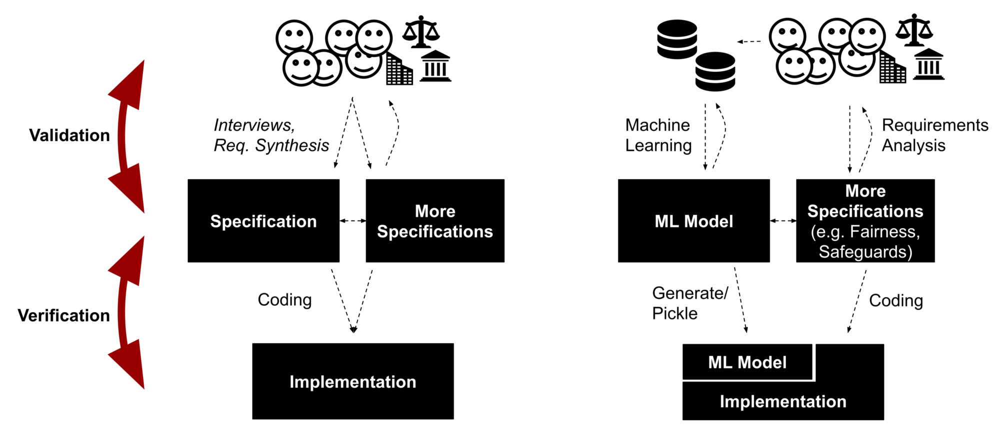
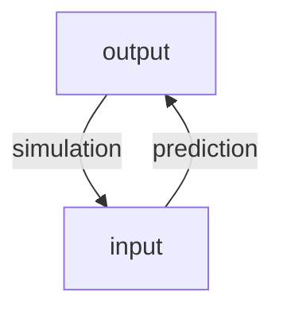

# Model Quality

Christian Kaestner

<!-- references -->

Required reading: 
* 🕮 Hulten, Geoff. "[Building Intelligent Systems: A Guide to Machine Learning Engineering.](https://www.buildingintelligentsystems.com/)" Apress, 2018, Chapter 19 (Evaluating Intelligence).
* 🗎 Ribeiro, Marco Tulio, Sameer Singh, and Carlos Guestrin. "[Semantically equivalent adversarial rules for debugging NLP models](https://www.aclweb.org/anthology/P18-1079.pdf)." In Proceedings of the 56th Annual Meeting of the Association for Computational Linguistics (Volume 1: Long Papers), pp. 856-865. 2018.

---

# Learning Goals

* Select a suitable metric to evaluate prediction accuracy of a model and to compare multiple models
* Select a suitable baseline when evaluating model accuracy
* Explain how software testing differs from measuring prediction accuracy of a model
* Curate validation datasets for assessing model quality, covering subpopulations as needed
* Use invariants to check partial model properties with automated testing
* Develop automated infrastructure to evaluate and monitor model quality

---
# This lecture

## First Part: Measuring Prediction Accuracy

the data scientist's perspective


## Second Part: Learning from Software Testing

how software engineering tools may apply to ML


---

> "Programs which were written in order to determine the
answer in the first place. There would be no need to write such programs, if the
correct answer were known” (Weyuker, 1982).


---
# Model Quality vs System Quality

----
## Prediction Accuracy of a Model

*model:* $\overline{X} \rightarrow Y$

*validation data (tests?):* sets of $(\overline{X}, Y)$ pairs indicating desired outcomes for select inputs

For our discussion: any form of model, including machine learning models, symbolic AI components, hardcoded heuristics, composed models, ...

----
## ML Algorithm Quality vs Model Quality vs Data Quality vs System Quality

Todays focus is on the quality of the produced *model*, not the algorithm used to learn the model or the data used to train the model

i.e. assuming *Decision Tree Algorithm* and feature extraction are correctly implemented (according to specification), is the model learned from data any good?

The model is just one component of the entire system.

Focus on measuring quality, not debugging the source of quality problems (e.g., in data, in feature extraction, in learning, in infrastructure)

----
## Case Study: Cancer Detection


<!-- .element: class="stretch" -->

Notes: Application to be used in hospitals to screen for cancer, both as routine preventative measure and in cases of specific suspicions. Supposed to work together with physicians, not replace.

----
## The Systems Perspective

System is more than the model

Includes deployment, infrastructure, user interface, data infrastructure, payment services, and often much more

Systems have a goal:
* maximize sales
* save lifes
* entertainment
* connect people

Models can help or may be essential in those goals, but are only one part

*Today: Narrow focus on prediction accuracy of the model*


----
## Cancer Prediction within A Healthcare Application


<!-- .element: class="stretch" -->


(CC BY-SA 4.0, [Martin Sauter](https://commons.wikimedia.org/wiki/Category:GNU_Health#/media/File:Gnu_health_2-8_gynocology_general.png))
----
## Many Qualities

Prediction accuracy of a model is important

But many other quality matters when building a system:
* Model size
* Inference time
* User interaction model
* Kinds of mistakes made
* How the system deals with mistakes
* Ability to incrementally learn
* Safety, security, fairness, privacy
* Explainability


*Today: Narrow focus on prediction accuracy of the model*

----
## Comparing Models

Compare two models (same or different implementation/learning technology) for the same task:

* Which one supports the system goals better?
* Which one makes fewer important mistakes?
* Which one is easier to operate?
* Which one is better overall?
* Is either one good enough?

----
## On Terminology: Performance

In machine learning, "performance" typically refers to accuracy

"this model performs better" = it produces more accurate results

Be aware of ambiguity across communities.

When speaking of "time", be explicit: "learning time", "inference time", "latency", ...

(see also: performance in arts, job performance, company performance, performance test (bar exam) in law, software/hardware/network performance)


---
# Measuring Prediction Accuracy for Classification Tasks

(The Data Scientists Toolbox)

----
## Confusion/Error Matrix

| | **Actually A** | **Actually B** | **Actually C** |
| :--- | --- | --- | --- |
|**AI predicts A** | **10** | 6 | 2 |
|**AI predicts B** | 3 | **24**  | 10 |
|**AI predicts C** | 5 | 22 | **82** |

Accuracy = correct predictions (diagonal) out of all predictions

Example's accuracy 
        = $\frac{10+24+82}{10+6+2+3+24+10+5+22+82} = .707$

----
## Is 99% Accuracy good?

-> depends on problem; can be excellent, good, mediocre, terrible

10% accuracy can be good on some tasks (information retrieval)

Always compare to a base rate!

Reduction in error = 
$\frac{(1 - accuracy\_\text{baseline}) - (1 - accuracy\_f)}{1 - accuracy\_\text{baseline}}$

* from 99.9% to 99.99% accuracy = 90% reduction in error
* from 50% to 75% accuracy = 50% reduction in error

----
## Baselines?

Suitable baselines for cancer prediction? For recidivism?

<!-- discussion -->

Note: Many forms of baseline possible, many obvious: Random, all true, all false, repeat last observation, simple heuristics, simpler model

----
## Types of Mistakes

Two-class problem of predicting event A:


| | **Actually A** | **Actually not A** |
| --- | --- | --- |
|**AI predicts A** | True Positive (TP) | False Positive (FP) |
|**AI predicts not A** | False Negative (FN) | True Negative (TN) |

True positives and true negatives: correct prediction

False negatives: wrong prediction, miss, Type II error

False positives: wrong prediction, false alarm, Type I error

 

----
## Multi-Class problems vs Two-Class Problem

| | **Actually A** | **Actually B** | **Actually C** |
| :--- | --- | --- | --- |
|**AI predicts A** | **10** | 6 | 2 |
|**AI predicts B** | 3 | **24**  | 10 |
|**AI predicts C** | 5 | 22 | **82** |


----
## Multi-Class problems vs Two-Class Problem

| | **Actually A** | **Actually B** | **Actually C** |
| :--- | --- | --- | --- |
|**AI predicts A** | **10** | 6 | 2 |
|**AI predicts B** | 3 | **24**  | 10 |
|**AI predicts C** | 5 | 22 | **82** |

****

<!-- colstart -->

| | **Act. A** | **Act. not A** |
| --- | --- | --- |
|**AI predicts A** | 10 | 8 |
|**AI predicts not A** | 8 | 138 |

<!-- col -->

| | **Act. B** | **Act. not B** |
| --- | --- | --- |
|**AI predicts B** | 24 | 13 |
|**AI predicts not B** | 28 | 99 |

<!-- colend -->

Notes: Individual false positive/negative classifications can be derived
by focusing on a single value in a confusion matrix. False positives/recall/etc are always considered with regard to a single specific outcome.


----
## Types of Mistakes in Identifying Cancer?


<!-- .element: class="stretch" -->


----
## Measures

Measuring success of correct classifications (or missing results):
* Recall = TP/(TP+FN) 
    * aka true positive rate, hit rate, sensitivity; *higher is better*
* False negative rate = FN/(TP+FN) = 1 - recall 
    * aka miss rate; *lower is better*

*** 

Measuring rate of false classifications (or noise):
* Precision = TP/(TP+FP)
    * aka positive predictive value; *higher is better*
* False positive rate = FP/(FP+TN) 
    * aka fall-out; *lower is better*
<!-- * False discovery rate = FP/(FP+TP) = 1 - precision -->

***

Combined measure (harmonic mean):

F1 score = $2 \frac{recall*precision}{recall+precision}$

----

[](https://en.wikipedia.org/wiki/Precision_and_recall#/media/File:Precisionrecall.svg)
<!-- .element: class="stretch" -->


(CC BY-SA 4.0 by [Walber](https://en.wikipedia.org/wiki/Precision_and_recall#/media/File:Precisionrecall.svg))

----
## False positives and false negatives equally bad? 

Consider: 
* Recognizing cancer 
* Suggesting products to buy on e-commerce site
* Identifying human trafficking at the border
* Predicting high demand for ride sharing services
* Predicting recidivism chance
* Approving loan applications

No answer vs wrong answer?

----
## Extreme Classifiers

* Identifies every instance as negative (e.g., no cancer):
    - 0% recall (finds none of the cancer cases)
    - 100% false negative rate (misses all actual cancer cases)
    - undefined precision (no false predictions, but no predictions at all)
    - 0% false positive rate (never reports false cancer warnings)
* Identifies every instance as positive (e.g., has cancer):
    - 100% recall (finds all instances of cancer)
    - 0% false negative rate (does not miss any cancer cases)
    - low precision (also reports cancer for all noncancer cases)
    - 100% false positive rate (all noncancer cases reported as warnings)
 
----
## Consider the Baseline Probability

Predicting unlikely events -- 1 in 2000 has cancer ([stats](https://gis.cdc.gov/Cancer/USCS/DataViz.html))

<!-- colstart -->

**Random predictor**

| | **Cancer** | **No c.** |
| --- | --- | --- |
|**Cancer pred.** | 3 | 4998 |
|**No cancer pred.** | 2 | 4997 |

.5 accuracy, .6 recall, 0.001 precision

<!-- col -->

**Never cancer predictor**


| | **Cancer** | **No c.** |
| --- | --- | --- |
|**Cancer pred.** | 0 | 0 |
|**No cancer pred.** | 5 | 9995 |

.999 accuracy, 0 recall, .999 precision


<!-- colend -->

See also [Bayesian statistics](https://en.wikipedia.org/wiki/Bayesian_statistics)


----
## Thresholds

Many classification models produce a number (e.g., "chance of cancer"), need *threshold* to make decision

| | **Act. A** | **Act. not A** |
| --- | --- | --- |
|**AI predicts A** | 10 | 8 |
|**AI predicts not A** | 8 | 138 |

Thresholds affects how data is sorted into rows!

----
## Area Under the Curve

Turning numeric prediction into classification with threshold ("operating point")


Notes: The plot shows the recall precision/tradeoff at different thresholds (the thresholds are not shown explicitly). Curves closer to the top-right corner are better considering all possible thresholds. Typically, the area under the curve is measured to have a single number for comparison.

----
## Receiver operating characteristic (ROC) curves


(CC BY-SA 3.0 by [BOR](https://en.wikipedia.org/wiki/Receiver_operating_characteristic#/media/File:Roccurves.png))

Notes: Same concept, but plotting TPR (recall) against FPR rather than precision. Graphs closer to the top-left corner are better. Again, the area under the (ROC) curve can be measured to get a single number for comparison.

----
## More Accuracy Measures for Classification Problems

* Lift
* Break even point
* F1 measure, etc
* Log loss (for class probabilities)
* Cohen's kappa, Gini coefficient (improvement over random)


---
# Measuring Prediction Accuracy for Regression and Ranking Tasks

(The Data Scientists Toolbox)


----
## Confusion Matrix for Regression Tasks?

| Rooms | Crime Rate | ... | Predicted Price | Actual Price |
| - | - | - | - | - | 
| 3 | .01 | ... | 230k | 250k |
| 4 | .01 | ... | 530k | 498k |
| 2 | .03 | ... | 210k | 211k |
| 2 | .02 | ... | 219k | 210k |


Note: Confusion Matrix does not work, need a different way of measuring accuracy that can distinguish "pretty good" from "far off" predictions 

----
## Regression to Classification

| Rooms | Crime Rate | ... | Predicted Price | Actual Price |
| - | - | - | - | - | 
| 3 | .01 | ... | 230k | 250k |
| 4 | .01 | ... | 530k | 498k |
| 2 | .03 | ... | 210k | 211k |
| 2 | .02 | ... | 219k | 210k |

<!-- vspace -->

Was the price below 300k?

Which price range is it in: [0-100k], [100k-200k], [200k-300k], ...


----
## Comparing Predicted and Expected Outcomes

<!-- colstart -->

Mean Absolute Percentage Error

**MAPE** = 

$\frac{1}{n}\sum_{t=1}^{n}\left|\frac{A_t-F_t}{A_t}\right|$

($A_t$ actual outcome, $F_t$ predicted outcome, for row $t$)

Compute relative prediction error per row, average over all rows

<!-- col -->

| Rooms | Crime Rate | ... | Predicted Price | Actual Price |
| - | - | - | - | - | 
| 3 | .01 | ... | 230k | 250k |
| 4 | .01 | ... | 530k | 498k |
| 2 | .03 | ... | 210k | 211k |
| 2 | .02 | ... | 219k | 210k |

MAPE = $\frac{1}{4}\left( 20/250 + 32/498 + 1/211 + 9/210  \right)$
= $\frac{1}{4}\left(0.08 + 0.064 + 0.005 + 0.043\right)$ = $0.048$

<!-- colend -->

----
## Again: Compare Against Baselines

Accuracy measures in isolation are difficult to interpret

Report baseline results, reduction in error

----
## Baselines for Regression Problems

Baselines for house price prediction?

<!-- discussion -->

----
## Other Measures for Regression Models


* Mean Absolute Error (MAE) = $\frac{1}{n}\sum_{t=1}^{n}\left|A_t-F_t\right|$
* Mean Squared Error (MSE) = $\frac{1}{n}\sum_{t=1}^{n}\left(A_t-F_t\right)^2$
* Root Mean Square Error (RMSE) = $\sqrt{\frac{\sum_{t=1}^{n}(A_t-F_t)^2}{n}}$
* $R^2$ = percentage of variance explained by model
* ...

----
## Evaluating Rankings

Ordered list of results, true results should be ranked high

Common in information retrieval (e.g., search engines) and recommendations

<!-- colstart -->
Mean Average Precision 

MAP@K = precision in first $K$ results

Averaged over many queries

<!-- col -->
| Rank | Product | Correct? |
| - | - | - |
|1 | Juggling clubs | true |
|2 | Bowling pins | false |
|3| Juggling balls | false |
|4| Board games | true |
|5| Wine | false |
|6| Audiobook | true |

MAP@1 = 1,
MAP@2 = 0.5,
MAP@3 = 0.33,
...
<!-- colend -->

**Remember to compare against baselines!** Baseline for shopping recommendations?


----
## Other Ranking Measures

* Mean Reciprocal Rank (MRR) (average rank for first correct prediction)
* Average precision (concentration of results in highest ranked predictions)
* MAR@K (recall)
* Coverage (percentage of items ever recommended)
* Personalization (how similar predictions are for different users/queries)
* Discounted cumulative gain
* ...

Note: Good discussion of tradeoffs at https://medium.com/swlh/rank-aware-recsys-evaluation-metrics-5191bba16832


----
## Model Quality in Natural Language Processing?

Highly problem dependent:
* Classify text into positive or negative -> classification problem
* Determine truth of a statement -> classification problem
* Translation and summarization -> comparing sequences (e.g ngrams) to human results with specialized metrics, e.g. [BLEU](https://en.wikipedia.org/wiki/BLEU) and [ROUGE](https://en.wikipedia.org/wiki/ROUGE_(metric))
* Modeling text -> how well its probabilities match actual text, e.g., likelyhoold or [perplexity](https://en.wikipedia.org/wiki/Perplexity)


---
# Analogy to Software Testing

(this gets messy)


----
## Software Testing

* Program *p* with specification *s*
* Test consists of
    - Controlled environment
    - Test call, test inputs
    - Expected behavior/output (oracle)

```java
assertEquals(4, add(2, 2));
assertEquals(??, factorPrime(15485863));
```

Testing is complete but unsound: 
Cannot guarantee the absence of bugs

----
## Software Testing

> "Testing shows the presence, not the absence of bugs" -- Edsger W. Dijkstra 1969

Software testing can be applied to many qualities:
* Functional errors
* Performance errors
* Buffer overflows
* Usability errors
* Robustness errors
* Hardware errors
* API usage errors

----
## Model Testing? 

<!-- colstart -->
| Rooms | Crime Rate | ... | Actual Price |
| - | - | - | - | 
| 3 | .01 | ... | 250k |
| 4 | .01 | ... |  498k |
| 2 | .03 | ... |  211k |
| 2 | .02 | ... |  210k |

<!-- col -->

```java
assertEquals(250000, 
    model.predict([3, .01, ...]));
assertEquals(498000, 
    model.predict([4, .01, ...]));
assertEquals(211000, 
    model.predict([2, .03, ...]));
assertEquals(210000, 
    model.predict([2, .02, ...]));
```
<!-- colend -->

<!-- vspace -->

Fail the entire test suite for one wrong prediction?

<!-- discussion -->

----
## The Oracle Problem

*How do we know the expected output of a test?*

```java
assertEquals(??, factorPrime(15485863));
```

* Manually construct input-output pairs (does not scale, cannot automate)
* Comparison against gold standard (e.g., alternative implementation, executable specification)
* Checking of global properties only -- crashes, buffer overflows, code injections
* Manually written assertions -- partial specifications checked at runtime


----
## Automated Testing / Test Case Generation

* Many techniques to generate test cases
* Dumb fuzzing: generate random inputs
* Smart fuzzing (e.g., symbolic execution, coverage guided fuzzing): generate inputs to maximally cover the implementation
* Program analysis to understand the shape of inputs, learning from existing tests
* Minimizing redundant tests
* Abstracting/simulating/mocking the environment

* Typically looking for crashing bugs or assertion violations

----
## Is Labeled Validation Data Solving the Oracle Problem?

```java
assertEquals(250000, model.predict([3, .01, ...]));
assertEquals(498000, model.predict([4, .01, ...]));
```
<!-- discussion -->

----
## Different Expectations for Prediction Accuracy

* Not expecting that all predictions will be correct (80% accuracy may be very good)
* Data may be mislabeled in training or validation set
* There may not even be enough context (features) to distinguish all training outcomes
* 
* **Lack of specifications** 
* **A wrong prediction is not necessarily a bug**

----
## Analogy of Performance Testing?

<!-- discussion -->

----
## Analogy of Performance Testing?

* Performance tests are not precise (measurement noise)
    * Averaging over repeated executions *of the same test*
    * Commonly using diverse benchmarks, i.e., *multiple inputs*
    * Need to control environment (hardware)
* No precise specification
    * Regression tests
    * Benchmarking as open-ended comparison 
    * Tracking results over time


```java
@Test(timeout=100) 
public void testCompute() {
   expensiveComputation(...);
}
```


---
# Machine Learning is Requirements Engineering

(my pet theory)

<!-- references -->
see also https://medium.com/@ckaestne/machine-learning-is-requirements-engineering-8957aee55ef4

----
## Validation vs Verification


<!-- .element: class="stretch" -->

----
## Validation vs Verification




Note: see explanation at https://medium.com/@ckaestne/machine-learning-is-requirements-engineering-8957aee55ef4

----
## Example and Discussion

```
IF age between 18–20 and sex is male THEN predict arrest
ELSE IF age between 21–23 and 2–3 prior offenses THEN predict arrest
ELSE IF more than three priors THEN predict arrest
ELSE predict no arrest
```

Model learned from gathered data (~ interviews, sufficient? representative?)

Cannot equally satisfy all stakeholders, conflicting goals; judgement call, compromises, constraints

Implementation is trivial/automatically generated

**Does it meet the users' expectations?**

**Is the model compatible with other specifications?** (fairness, robustness)

**What if we cannot understand the model?** (interpretability)

----
## Terminology Suggestions

* Avoid term *model bug*, no agreement, no standardization
* *Performance* or *accuracy* are better fitting terms than *correct* for model quality
* Careful with the term *testing* for measuring *prediction accuracy*, be aware of different connotations
* *Verification/validation* analogy may help frame thinking, but will likely be confusing to most without longer explanation


---
# Curating Validation Data

(Learning from Software Testing?)


----
## How much validation data?

* Problem dependent
* Statistics can give confidence interval for results
    - e.g. [Sample Size Calculator](https://www.surveysystem.com/sscalc.htm): 384 samples needed for ±5% confidence interval (95% conf. level; 1M population)
* Experience and heuristics. Example: Hulten's heuristics for stable problems: 
    - 10s is too small
    - 100s sanity check
    - 1000s usually good
    - 10000s probably overkill
    - Reserve 1000s recent data points for evaluation (or 10%, whichever is more)
    - Reserve 100s for important subpopulations

----
## Software Testing Analogy: Test Adequacy


<!-- .element: class="stretch" -->

----
## Software Testing Analogy: Test Adequacy


* Specification coverage (e.g., use cases, boundary conditions):
    - No specification!
    - ~> Do we have data for all important use cases and subpopulations?
    - ~> Do we have representatives data for all output classes?
* White-box coverage (e.g., branch coverage)
    - All path of a decision tree? 
    - All neurons activated at least once in a DNN? (several papers "neuron coverage")
    - Linear regression models??
* Mutation scores
    - Mutating model parameters? Hyper parameters?
    - When is a mutant killed?

**Does any of this make sense?**

<!-- discussion -->


----
## Validation Data Representative?

* Validation data should reflect usage data
* Be aware of data drift (face recognition during pandemic, new patterns in credit card fraud detection)
* "*Out of distribution*" predictions often low quality (it may even be worth to detect out of distribution data in production, more later)


----
## Independence of Data: Temporal

> Attempt to predict the stock price development for different companies based on twitter posts

Data: stock prices of 1000 companies over 4 years and twitter mentions of those companies

Problems of random train--validation split?

<!-- discussion -->

Note: The model will be evaluated on past stock prices knowing the future prices of the companies in the training set. Even if we split by companies, we could observe general future trends in the economy during training


----
## Independence of Data: Temporal


<!-- .element: class="stretch" -->

Note: The curve is the real trend, red points are training data, green points are validation data. If validation data is randomly selected, it is much easier to predict, because the trends around it are known.


----
## Independence of Data: Related Datapoints

> Kaggle competition on detecting distracted drivers

 

Relation of datapoints may not be in the data (e.g., driver)

<!-- references -->

https://www.fast.ai/2017/11/13/validation-sets/

Note: 
Many potential subtle and less subtle problems:
* Sales from same user
* Pictures taken on same day

----
## Not All Inputs are Equal


<!-- .element: class="stretch" -->

"Call mom"
"What's the weather tomorrow?"
"Add asafetida to my shopping list"

----
## Not All Inputs are Equal

> There Is a Racial Divide in Speech-Recognition Systems, Researchers Say:
> Technology from Amazon, Apple, Google, IBM and Microsoft misidentified 35 percent of words from people who were black. White people fared much better. -- [NYTimes March 2020](https://www.nytimes.com/2020/03/23/technology/speech-recognition-bias-apple-amazon-google.html)

----
<div class="tweet" data-src="https://twitter.com/nke_ise/status/897756900753891328"></div>

----
## Not All Inputs are Equal

> some random mistakes vs rare but biased mistakes?

* A system to detect when somebody is at the door that never works for people under 5ft (1.52m)
* A spam filter that deletes alerts from banks


**Consider separate evaluations for important subpopulations; monitor mistakes in production**


----
## Identify Important Inputs

Curate Validation Data for Specific Problems and Subpopulations:
* *Regression testing:* Validation dataset for important inputs ("call mom") -- expect very high accuracy -- closest equivalent to **unit tests**
* *Uniformness/fairness testing:* Separate validation dataset for different subpopulations (e.g., accents) -- expect comparable accuracy
* *Setting goals:* Validation datasets for challenging cases or stretch goals -- accept lower accuracy

Derive from requirements, experts, user feedback, expected problems etc. Think *blackbox testing*.


----
## Important Input Groups for Cancer Detection?

<!-- discussion -->

----
## Black-Box Testing Techniques as Inspiration?

* Boundary value analysis
* Partition testing & equivalence classes
* Combinatorial testing
* Decision tables

Use to identify subpopulations (validation datasets), not individual tests.

<!-- discussion -->


---
# Automated (Random) Testing

(if it wasn't for that darn oracle problem)


----
## Recall: Automated Testing / Test Case Generation

* Many techniques to generate test cases
* Dumb fuzzing: generate random inputs
* Smart fuzzing (e.g., symbolic execution, coverage guided fuzzing): generate inputs to maximally cover the implementation
* Program analysis to understand the shape of inputs, learning from existing tests
* Minimizing redundant tests
* Abstracting/simulating/mocking the environment

----
## Automated Test Data Generation?

```java
model.predict([3, .01, ...])
model.predict([4, .04, ...])
model.predict([5, .01, ...])
model.predict([1, .02, ...])
```

* Completely random data generation (uniform sampling from each feature's domain)
* Using knowledge about feature distributions (sample from each feature's distribution)
* Knowledge about dependencies among features and whole population distribution (e.g., model with probabilistic programming language)
* Mutate from existing inputs (e.g., small random modifications to select features)
*
* **But how do we get labels?**

----
## Recall: The Oracle Problem

*How do we know the expected output of a test?*

```java
assertEquals(??, factorPrime(15485863));
```

* Manually construct input-output pairs (does not scale, cannot automate)
* Comparison against gold standard (e.g., alternative implementation, executable specification)
* Checking of global properties only -- crashes, buffer overflows, code injections
* Manually written assertions -- partial specifications checked at runtime


----
## Machine Learned Models = Untestable Software?

* Manually construct input-output pairs (does not scale, cannot automate)
    - **too expensive at scale**
* Comparison against gold standard (e.g., alternative implementation, executable specification)
    - **no specification, usually no other "correct" model**
    - comparing different techniques useful? (see ensemble learning)
* Checking of global properties only -- crashes, buffer overflows, code injections
    - **??**
* Manually written assertions -- partial specifications checked at runtime
    - **??**

----
## Invariants in Machine Learned Models?

<!-- discussion -->

----
## Examples of Invariants 

* Credit rating should not depend on gender:
    - $\forall x. f(x[\text{gender} \leftarrow \text{male}]) = f(x[\text{gender} \leftarrow \text{female}])$
* Synonyms should not change the sentiment of text:
    - $\forall x. f(x) = f(\texttt{replace}(x, \text{"is not", "isn't"}))$
* Negation should swap meaning:
    - $\forall x \in \text{"X is Y"}. f(x) = 1-f(\texttt{replace}(x, \text{" is ", " is not "}))$
* Robustness around training data:
    - $\forall x \in \text{training data}. \forall y \in \text{mutate}(x, \delta). f(x) = f(y)$
* Low credit scores should never get a loan (sufficient conditions for classification, "anchors"):
    - $\forall x. x.\text{score} < 649 \Rightarrow \neg f(x)$

Identifying invariants requires domain knowledge of the problem!

----
## Metamorphic Testing

Formal description of relationships among inputs and outputs (*Metamorphic Relations*)

In general, for a model $f$ and inputs $x$ define two functions to transform inputs and outputs $g\_I$ and $g\_O$ such that:

$\forall x. f(g\_I(x)) = g\_O(f(x))$

<!-- vspace -->

e.g. $g\_I(x)= \texttt{replace}(x, \text{" is ", " is not "})$ and $g\_O(x)=\neg x$

----
## On Testing with Invariants/Assertions

* Defining good metamorphic relations requires knowledge of the problem domain
* Good metamorphic relations focus on parts of the system
* Invariants usually cover only one aspect of correctness
* Invariants and near-invariants can be mined automatically from sample data (see *specification mining* and *anchors*)


<!-- references -->
Further reading:
* Segura, Sergio, Gordon Fraser, Ana B. Sanchez, and Antonio Ruiz-Cortés. "[A survey on metamorphic testing](https://core.ac.uk/download/pdf/74235918.pdf)." IEEE Transactions on software engineering 42, no. 9 (2016): 805-824.
* Ribeiro, Marco Tulio, Sameer Singh, and Carlos Guestrin. "[Anchors: High-precision model-agnostic explanations](https://sameersingh.org/files/papers/anchors-aaai18.pdf)." In Thirty-Second AAAI Conference on Artificial Intelligence. 2018.


----
## Invariant Checking aligns with Requirements Validation


----
## Automated Testing / Test Case Generation

* Many techniques to generate test cases
* Dumb fuzzing: generate random inputs
* Smart fuzzing (e.g., symbolic execution, coverage guided fuzzing): generate inputs to maximally cover the implementation
* Program analysis to understand the shape of inputs, learning from existing tests
* Minimizing redundant tests
* Abstracting/simulating/mocking the environment

* Typically looking for crashing bugs or assertion violations


----
## Approaches for Checking in Variants

* Generating test data (random, distributions) usually easy
* For many techniques gradient-based techniques to search for invariant violations (see adversarial ML)
* Early work on formally verifying invariants for certain models (e.g., small deep neural networks)

<!-- references -->

Further readings: 
Singh, Gagandeep, Timon Gehr, Markus Püschel, and Martin Vechev. "[An abstract domain for certifying neural networks](https://dl.acm.org/doi/pdf/10.1145/3290354)." Proceedings of the ACM on Programming Languages 3, no. POPL (2019): 1-30.


----
## One More Thing: Simulation-Based Testing

<!-- colstart -->
<!-- smallish -->
* Derive input-output pairs from simulation, esp. in vision systems
* Example: Vision for self-driving cars:
    * Render scene -> add noise -> recognize -> compare recognized result with simulator state
* Quality depends on quality of the simulator and how well it can produce inputs from outputs: 
    * examples: render picture/video, synthesize speech, ... 
    * Less suitable where input-output relationship unknown, e.g., cancer detection, housing price prediction, shopping recommendations
<!-- col -->

<!-- colend -->

<!-- references -->

Further readings: Zhang, Mengshi, Yuqun Zhang, Lingming Zhang, Cong Liu, and Sarfraz Khurshid. "DeepRoad: GAN-based metamorphic testing and input validation framework for autonomous driving systems." In Proceedings of the 33rd ACM/IEEE International Conference on Automated Software Engineering, pp. 132-142. 2018.


---
# Continuous Integration for Model Quality

[](https://eng.uber.com/michelangelo/)
<!-- .element: class="stretch" -->

----
## Continuous Integration for Model Quality?

<!-- discussion -->
----
## Continuous Integration for Model Quality

* Testing script
    * Existing model: Implementation to automatically evaluate model on labeled training set; multiple separate evaluation sets possible, e.g., for critical subcommunities or regressions
    * Training model: Automatically train and evaluate model, possibly using cross-validation; many ML libraries provide built-in support
    * Report accuracy, recall, etc. in console output or log files
    * May deploy learning and evaluation tasks to cloud services
    * Optionally: Fail test below quality bound (e.g., accuracy <.9; accuracy < accuracy of last model)
* Version control test data, model and test scripts, ideally also learning data and learning code (feature extraction, modeling, ...)
* Continuous integration tool can trigger test script and parse output, plot for comparisons (e.g., similar to performance tests)
* Optionally: Continuous deployment to production server

----
## Dashboards for Model Evaluation Results

[](https://eng.uber.com/michelangelo/)

<!-- references  -->

Jeremy Hermann and Mike Del Balso. [Meet Michelangelo: Uber’s Machine Learning Platform](https://eng.uber.com/michelangelo/). Blog, 2017

----

## Specialized CI Systems


<!-- references -->

Renggli et. al, [Continuous Integration of Machine Learning Models with ease.ml/ci: Towards a Rigorous Yet Practical Treatment](http://www.sysml.cc/doc/2019/162.pdf), SysML 2019

----
## Dashboards for Comparing Models


<!-- references -->

Matei Zaharia. [Introducing MLflow: an Open Source Machine Learning Platform](https://databricks.com/blog/2018/06/05/introducing-mlflow-an-open-source-machine-learning-platform.html), 2018


---
# Summary

* Model prediction accuracy only one part of system quality
* Select suitable measure for prediction accuracy, depending on problem (recall, MAPE, AUC, MAP@K, ...)
* Ensure independence of test and validation data
* Software testing is a poor analogy (model bug); validation may be a better analogy
* Still learn from software testing
    - Carefully select test data
    - Not all inputs are equal: Identify important inputs (inspiration from blackbox testing)
* Automated random testing 
    - Feasible with invariants (e.g. metamorphic relations)
    - Sometimes possible with simulation
* Automate the test execution with continuous integration

