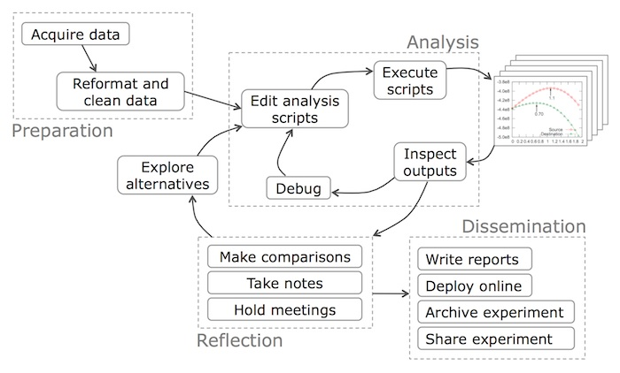
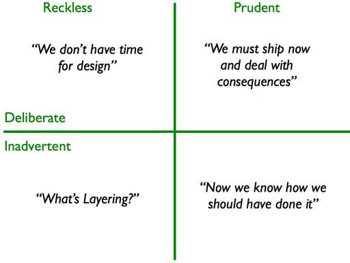

# Process and Technical Debt

Christian Kaestner

<!-- references -->

Required Reading: 
* Sculley, David, Gary Holt, Daniel Golovin, Eugene Davydov, Todd Phillips, Dietmar Ebner, Vinay Chaudhary, Michael Young, Jean-Francois Crespo, and Dan Dennison. "[Hidden technical debt in machine learning systems](http://papers.nips.cc/paper/5656-hidden-technical-debt-in-machine-learning-systems.pdf)." In Advances in neural information processing systems, pp. 2503-2511. 2015.

Suggested Readings: 
* Fowler and Highsmith. [The Agile Manifesto](http://agilemanifesto.org/)
* Steve McConnell. Software project survival guide. Chapter 3
* Pfleeger and Atlee. Software Engineering: Theory and Practice. Chapter 2
* Kruchten, Philippe, Robert L. Nord, and Ipek Ozkaya. "[Technical debt: From metaphor to theory and practice](https://resources.sei.cmu.edu/asset_files/WhitePaper/2012_019_001_58818.pdf)." IEEE Software 29, no. 6 (2012): 18-21.
* Patel, Kayur, James Fogarty, James A. Landay, and Beverly Harrison. "[Investigating statistical machine learning as a tool for software development](http://www.kayur.org/papers/chi2008.pdf)." In Proceedings of the SIGCHI Conference on Human Factors in Computing Systems, pp. 667-676. 2008.

----

## Learning Goals

* Contrast development processes of software engineers and data scientists
* Outline process conflicts between different roles and suggest ways to mitigate them
* Recognize the importance of process
* Describe common agile practices and their goals
* Understand and correctly use the metaphor of technical debt
* Describe how ML can incur reckless and inadvertent technical debt, outline common sources of technical debt

---
## Case Study: Real-Estate Website

----
## ML Component: Predicting Real Estate Value

Given a large database of house sales and statistical/demographic data from public records, predict the sales price of a house.

$f(size, rooms, tax, neighborhood, ...) \rightarrow price$

<!-- .element: class="stretch" -->

---
# Data Science: Iteration and Exploration 

----
## Data Science is Iterative and Exploratory

<!-- .element: class="stretch" -->

(Source: Guo. "[Data Science Workflow: Overview and Challenges](https://cacm.acm.org/blogs/blog-cacm/169199-data-science-workflow-overview-and-challenges/fulltext)." Blog@CACM, Oct 2013)

----
## Data Science is Iterative and Exploratory

<!-- .element: class="stretch" -->

(Microsoft Azure Team, "[What is the Team Data Science Process?](https://docs.microsoft.com/en-us/azure/machine-learning/team-data-science-process/overview)" Microsoft Documentation, Jan 2020)

----
## Data Science is Iterative and Exploratory

<!-- .element: class="stretch" -->

Source: Patel, Kayur, James Fogarty, James A. Landay, and Beverly Harrison. "[Investigating statistical machine learning as a tool for software development](http://www.kayur.org/papers/chi2008.pdf)." In Proc. CHI, 2008.

Notes:
This figure shows the result from a controlled experiment in which participants had 2 sessions of 2h each to build a model. Whenever the participants evaluated a model in the process, the accuracy is recorded. These plots show the accuracy improvements over time, showing how data scientists make incremental improvements through frequent iteration.

----
## Data Science is Iterative and Exploratory
* Science mindset: start with rough goal, no clear specification, unclear whether possible
* Heuristics and experience to guide the process
* Try and error, refine iteratively, hypothesis testing
* Go back to data collection and cleaning if needed, revise goals

----
## Share Experience?

<!-- discussion -->

----
## Computational Notebooks

<!-- colstart -->

* Origins in "literal programming", interleaving text and code, treating programs as literature (Knuth'84)
* First notebook in Wolfram Mathematica 1.0 in 1988
* Document with text and code cells, showing execution results under cells
* Code of cells is executed, per cell, in a kernel
* Many notebook implementations and supported languages, Python + Jupyter currently most popular

<!-- col -->

<!-- colend -->

Notes:
* See also https://en.wikipedia.org/wiki/Literate_programming
* Demo with public notebook, e.g., https://colab.research.google.com/notebooks/mlcc/intro_to_pandas.ipynb

----
## Notebooks Support Iteration and Exploration

* Quick feedback, similar to REPL
* Visual feedback including figures and tables
* Incremental computation: reexecuting individual cells
* Quick and easy: copy paste, no abstraction needed
* Easy to share: document includes text, code, and results

----
## Brief Discussion: Notebook Limitations and Drawbacks?

<!-- discussion -->

---

# Software Engineering Process

----

## Innovative vs Routine Projects

* Like data science tasks, most software projects are innovative
    - Google, Amazon, Ebay, Netflix
    - Vehicles and robotics
    - Language processing, Graphics, AI
* Routine (now, not 20 years ago)
    - E-commerce websites?
    - Product recommendation? Voice recognition?
    - Routine gets automated -> innovation cycle

----

## A Simple Process

1. Discuss the software that needs to be written
2. Write some code
3. Test the code to identify the defects
4. Debug to find causes of defects
5. Fix the defects
6. If not done, return to step 1

----

## Software Process

> “The set of activities and associated results that produce a software product”

Examples?

<!-- discussion -->

Notes: 

Writing down all requirements
Require approval for all changes to requirements
Use version control for all changes
Track all reported bugs
Review requirements and code
Break down development into smaller tasks and schedule and monitor them
Planning and conducting quality assurance 
Have daily status meetings
Use Docker containers to push code between developers and operation

----

Notes: Visualization following McConnell, Steve. Software project survival guide. Pearson Education, 1998.
----

Notes: Idea: spent most of the time on coding, accept a little rework
----

Notes: negative view of process. pure overhead, reduces productive work, limits creativity
----

Notes: Real experience if little attention is payed to process: increasingly complicated, increasing rework; attempts to rescue by introducing process

----

## Example of Process Problems?

<!-- discussion -->

Notes: 
Collect examples of what could go wrong:

Change Control: Mid-project informal agreement to changes suggested by customer or manager. Project scope expands 25-50%
Quality Assurance: Late detection of requirements and design issues. Test-debug-reimplement cycle limits development of new features. Release with known defects.
Defect Tracking: Bug reports collected informally, forgotten
System Integration: Integration of independently developed components at the very end of the project. Interfaces out of sync.
Source Code Control: Accidentally overwritten changes, lost work.
Scheduling: When project is behind, developers are asked weekly for new estimates.

----
## Typical Process Steps (not necessarily in this order)

* Understand customers, identify what to build, by when, budget
* Identify relevant qualities, plan/design system accordingly
* Test, deploy, maintain, evolve
* Plan, staff, workaround

----
## Survival Mode

* Missed deadlines -> "solo development mode" to meet own deadlines
* Ignore integration work
* Stop interacting with testers, technical writers, managers, ...
----
Hypothesis: Process increases flexibility and efficiency +  Upfront investment for later greater returns

Notes: ideal setting of little process investment upfront
----

Notes: Empirically well established rule: Bugs are increasingly expensive to fix the larger the distance between the phase where they are created vs where they are corrected.
----

Notes: Complicated processes like these are often what people associate with "process". Software process is needed, but does not need to be complicated.

---
# Software Process Models

----

## Ad-hoc Processes

1. Discuss the software that needs to be written
2. Write some code
3. Test the code to identify the defects
4. Debug to find causes of defects
5. Fix the defects
6. If not done, return to step 1

----
## Waterfall Model

<!-- .element: class="stretch" -->

*taming the chaos, understand requirements, plan before coding, remember testing*

([CC-BY-SA-2.5](https://commons.wikimedia.org/wiki/File:Waterfall_model.png))

Notes: Although dated, the key idea is still essential -- think and plan before implementing. Not all requirements and design can be made upfront, but planning is usually helpful.

----
## Risk First: Spiral Model

*incremental prototypes, starting with most risky components*

----
## Constant iteration: Agile

*working with customers, constant replanning*

(CC BY-SA 4.0, Lakeworks)

----
## Contrasting Process Models

*Ad-hoc -- Waterfall -- Spiral -- Agile*

---
# Data Science vs Software Engineering

----
## Discussion: Iteration in Notebook vs Agile? 

<!-- colstart -->

<!-- col -->

(CC BY-SA 4.0, Lakeworks)
<!-- colend -->

Note: There is similarity in that there is an iterative process, 
but the idea is different and the process model seems mostly orthogonal
to iteration in data science.
The spiral model prioritizes risk, especially when it is not clear
whether a model is feasible. One can do similar things in model development, seeing whether it is feasible with data at hand at all and build an early
prototype, but it is not clear that an initial okay model can be improved
incrementally into a great one later.
Agile can work with vague and changing requirements, but that again seems
to be a rather orthogonal concern. Requirements on the product are not so
much unclear or changing (the goal is often clear), but it's not clear
whether and how a model can solve it.

----
## Poor Software Engineering Practices in Notebooks?

<!-- colstart -->

<!-- col -->
*
* Little abstraction
* Global state
* No testing
* Heavy copy and paste
* Little documentation
* Poor version control
* Out of order execution
* Poor development features (vs IDE)
<!-- colend -->

----
## Understanding Data Scientist Workflows

* Instead of blindly recommended "SE Best Practices" understand context
* Documentation and testing not a priority in exploratory phase
* Help with transitioning into practice
    * From notebooks to pipelines
    * Support maintenance and iteration once deployed
    * Provide infrastructure and tools

----
<svg version="1.1" viewBox="0.0 0.0 800 400" xmlns:xlink="http://www.w3.org/1999/xlink" xmlns="http://www.w3.org/2000/svg">
        
        <circle r="180" cx="250", cy="200" fill="#b9ff00" fill-opacity="0.514" />
        <circle r="180" cx="550", cy="200" fill="#ff5500" fill-opacity="0.514" />
        <text x=230 y=160 dominant-baseline="middle" text-anchor="middle">Data</text>
        <text x=230 y=240 dominant-baseline="middle" text-anchor="middle">Scientists</text>
        <text x=570 y=160 dominant-baseline="middle" text-anchor="middle">Software</text>
        <text x=570 y=240 dominant-baseline="middle" text-anchor="middle">Engineers</text>
</svg>

----
## Process for AI-Enabled Systems

* Integrate Software Engineering and Data Science processes
* Establish system-level requirements (e.g., user needs, safety, fairness)
* Inform data science modeling with system requirements (e.g., privacy, fairness)
* Try risky parts first (most likely include ML components; ~spiral)
* Incrementally develop prototypes, incorporate user feedback (~agile)
* Provide flexibility to iterate and improve 
* Design system with characteristics of AI component (e.g., UI design, safeguards)
* Plan for testing throughout the process and in production
* Manage project understanding both software engineering and data science workflows
* 
* No existing "best practices" or workflow models

----

---
# Technical debt

 
<!-- .element: class="stretch" -->

----
## Technical Debt Metaphor

* Analogy to financial debt
    * Have a benefit now (e.g., progress quickly, release now)
    * accepting later cost (loss of productivity, e.g., higher maintenance/operating cost, rework)
    * debt accumulates and can suffocate project 
+ Ideally a deliberate decision (short term tactical or long term strategic)
+ Ideally track debt and plan for paying it down

**Examples?**

----

Source: Martin Fowler 2009, https://martinfowler.com/bliki/TechnicalDebtQuadrant.html

----
## Technical Debt from ML Components?

<!-- discussion -->

(see reading)

<!-- references -->
Sculley, David, et al. [Hidden technical debt in machine learning systems](http://papers.nips.cc/paper/5656-hidden-technical-debt-in-machine-learning-systems.pdf). Advances in Neural Information Processing Systems. 2015.

----

## The Notebook

> Jupyter Notebooks are a gift from God to those who work with data. They allow us to do quick experiments with Julia, Python, R, and more -- [John Paul Ada](https://towardsdatascience.com/no-hassle-machine-learning-experiments-with-azure-notebooks-e1a22e8782c3)

 
<!-- .element: class="stretch" -->

Notes: Discuss benefits and drawbacks of Jupyter style notebooks

----

## ML and Technical Debt 

* **Often reckless and inadvertent in inexperienced teams**
* ML can seem like an easy addition, but it may cause long-term costs
* Needs to be maintained, evolved, and debugged
* Goals may change, environment may change, some changes are subtle
* 
* Example problems
    - Systems and models are tangled and changing one has cascading effects on the other
    - Untested, brittle infrastructure; manual deployment
    - Unstable data dependencies, replication crisis 
    - Data drift and feedback loops
    - Magic constants and dead experimental code paths

<!-- references -->
Further reading: Sculley, David, et al. [Hidden technical debt in machine learning systems](http://papers.nips.cc/paper/5656-hidden-technical-debt-in-machine-learning-systems.pdf). Advances in Neural Information Processing Systems. 2015.

----
## Controlling Technical Debt from ML Components

<!-- discussion -->

----
## Controlling Technical Debt from ML Components

* Avoid AI when not needed
* Understand and document requirements, design for mistakes
* Build reliable and maintainable pipelines, infrastructure, good engineering practices
* Test infrastructure, system testing, testing and monitoring in production
* Test and monitor data quality
* Understand and model data dependencies, feedback loops, ...
* Document design intent and system architecture
* Strong interdisciplinary teams with joint responsibilities
* Document and track technical debt
* ...

---
# Summary

* Data scientists and software engineers follow different processes
* ML projects need to consider process needs of both
* Iteration and upfront planning are both important, process models codify good practices
* Deliberate technical debt can be good, too much debt can suffocate a project
* Easy to amount (reckless) debt with machine learning
