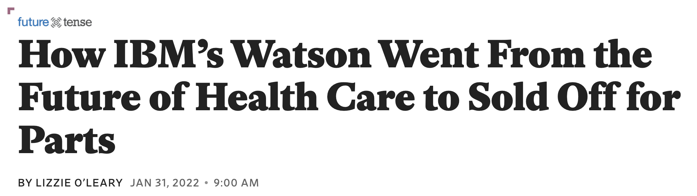
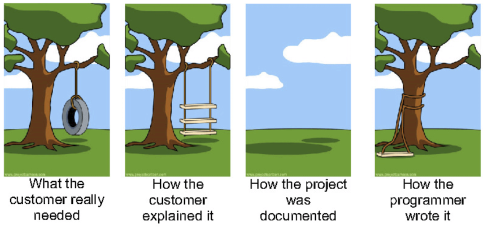

## Learning Goals

* Understand the role of requirements in ML-based systems and their
failures
* Understand the distinction between the world and the machine
* Understand the importance of environmental assumptions in
  establishing system requirements

---
# Failures in ML-Based Systems

<!-- ---- -->
<!-- ## Cancer Detection -->

<!--  -->
<!-- <\!-- .element: class="stretch" -\-> -->

<!-- ---- -->
<!-- ## Autonomous Vehicles -->

<!--  -->
<!-- .element: class="stretch" -->

<!-- ---- -->
<!-- > Cops raid music fan’s flat after Alexa Amazon Echo device ‘holds a party on its own’ while he was out -->
<!-- Oliver Haberstroh's door was broken down by irate cops after neighbours complained about deafening music blasting from Hamburg flat -->

<!-- https://www.thesun.co.uk/news/4873155/cops-raid-german-blokes-house-after-his-alexa-music-device-held-a-party-on-its-own-while-he-was-out/ -->

<!-- > News broadcast triggers Amazon Alexa devices to purchase dollhouses. -->

<!-- https://www.snopes.com/fact-check/alexa-orders-dollhouse-and-cookies/ -->

<!-- ---- -->
<!-- ## Chatbot -->

<!--  -->
<!-- <\!-- .element: class="stretch" -\-> -->

<!-- **What went wrong? What is the root cause of the failure?** -->

----
## Autopilot in Vehicles

<!-- .element: class="stretch" -->

**Q. What went wrong? What is the root cause of the failure?**

----
## Facial Recognition in ATM

<!-- .element: class="stretch" -->

**Q. What went wrong? What is the root cause of the failure?**

----
## Automated Hiring

<!-- .element: class="stretch" -->

**Q. What went wrong? What is the root cause of the failure?**

----
## IBM Watson

<!-- .element: class="stretch" -->

----
## IBM Watson

<!-- .element: class="stretch" -->

Washington Post, 06/2015

----
## IBM Watson

<!-- .element: class="stretch" -->

> "We got concerns from them that the recommendations that it was
> giving were just not relevant...it would suggest a particular
> kind of treatment that wasn’t available in the locality in which it
> was making the recommendation, or the recommendation did not at all
> square with the treatment protocols that were in use at the local
> institution..."

Slate, 01/2022

----
## Risks in ML-based Systems

**What went wrong? What were the root causes of failures in these
  systems? Was the quality of an ML model to blame?**

<!-- discussion -->

---
# Software Requirements 

----
## Software Requirements

* Describe what the system should do, in terms of the services that it provides
  and their qualities (safety, reliability, performance...) 
* Gathered through discussions with stakeholders (customers, domain
experts, marketing team, industry regulators...)

<!-- .element: class="stretch" -->

----
## Importance of Requirements

_"The hardest single part of building a software system is deciding
precisely what to build...No other part of the work so cripples the resulting system if done wrong."_
-- Fred Brooks, Mythical Man Month (1975)

----
## Importance of Requirements

<!-- .element: class="stretch" -->

* An investigation of software-related failures by the National
  Research Council in the US (2007)
* Bugs in code account only for 3% of fatal software accidents 
* Most failures due to **poor understanding of requirements** or usability issues 

----
## Machine vs World

<!-- .element: class="stretch" -->

* No software lives in vacuum; every system is deployed as part of the
world
<!-- .element: class="fragment" -->
* A requirement describes a desired state of the world (i.e.,
environment)
<!-- .element: class="fragment" -->
* Machine (software) is designed to sense and manipulate the environment into
  a desired state using input & output devices
<!-- .element: class="fragment" -->

----
## Machine vs World

* Q. In the following systems, what does the environment consist of?
  * Smart home thermostat: ?? 
  * Movie recommendation system: ??

----
## Example: Lane Keeping Assist

<!-- .element: class="stretch" -->

* Q. What is the requirement of this system?

----
## Example: Lane Keeping Assist

<!-- .element: class="stretch" -->

* Requirement: The vehicle must be prevented from veering off the
lane.
* Q. What does the environment consist of?

----
## Shared Phenomena

* Shared phenomena: Interface between the environment & software
<!-- .element: class="fragment" -->
  * Input: Lidar, camera, pressure sensors, GPS
  * Output: Signals generated & sent to the engine or brake control

----
## Shared Phenomena

* Shared phenomena: Interface between the environment & software
  * Input: Lidar, camera, pressure sensors, GPS
  * Output: Signals generated & sent to the engine or brake control
* Software can influence the environment **only** through the shared interface
  * Unshared parts of the environment are beyond software’s control
  * We can only **assume** how these parts will behave

----
## Requirement vs Specification

<!-- .element: class="stretch" -->

* Requirement (REQ): What the system must ensure, in terms of desired
  effects on the environment 
* Assumptions (ENV): What’s assumed about the behavior or
  properties of the environment
* Specification (SPEC): What software must implement, expressed over
the shared phenomena

----
## Shared Phenomena

* Requirements (REQ) are expressed only in terms of world phenomena 
* Assumptions (ENV) are expressed in terms of world & shared phenomena
* Specifications (SPEC) are expressed in terms of shared phenomena

**Software cannot directly satisfy a requirement on its own!**

----
## Example: Lane Assist

<!-- .element: class="stretch" -->

* Requirement (REQ): The vehicle must be prevented from veering off the lane.
* Specification (SPEC): ??

----
## Example: Lane Assist

<!-- .element: class="stretch" -->

* REQ: The vehicle must be prevented from veering off the lane.
* SPEC: Lane detector accurately identifies lane markings in the input image; 
  the controller generates correct steering commands
* Assumptions (ENV): ??

**Discuss with the person next to you for 1 min & type into Slack**

----
## Example: Lane Assist

<!-- .element: class="stretch" -->

* REQ: The vehicle must be prevented from veering off the lane.
* SPEC: Lane detector accurately identifies lane markings in the input image; 
  the controller generates correct steering commands
* ENV: Sensors are providing accurate information about the lane;
  driver responses when given warning; steering wheel is functional

----
## What could go wrong?

<!-- .element: class="stretch" -->

* Wrong, inconsistent or infeasible requirements (REQ)
<!-- .element: class="fragment" -->
* Missing or incorrect environmental assumptions (ENV)
<!-- .element: class="fragment" -->
* Wrong or violated specification (SPEC)
<!-- .element: class="fragment" -->
* Inconsistency in assumptions & spec (ENV ∧ SPEC = False)
<!-- .element: class="fragment" -->

----
## What could go wrong?

<!-- .element: class="stretch" -->

* Wrong, inconsistent or infeasible requirements (REQ)
* **Missing or incorrect environmental assumptions (ENV)**
* Wrong or violated specification (SPEC)
* Inconsistency in assumptions & spec (ENV ∧ SPEC = False)

----
## Lufthansa 2904 Runaway Crash

<!-- .element: class="stretch" -->

* Reverse thrust (RT): Decelerates plane during landing
<!-- .element: class="fragment" -->
* What was required (REQ): RT is enabled if and only if plane is on the
ground
<!-- .element: class="fragment" -->
* What was implemented (SPEC): RT is enabled if and only if wheel is turning
<!-- .element: class="fragment" -->
* What was assumed (ENV): Wheel is turning if and only if plane on the ground
<!-- .element: class="fragment" -->
* But on that day, runway was wet due to rain!
<!-- .element: class="fragment" -->
  * Wheel fails to turn, even though the plane is on the ground
    (assumption violated)
  * Pilot attempts to enable RT; overridden by the software
  * Plane goes off the runway and crashes!

----
## Assumption Violations in ML-based Systems

* Unrealistic or missing assumptions
<!-- .element: class="fragment" -->
	* e.g., poorly understood effect of weather conditions on sensor accuracy,
	missing pedestrian behavior 
* Concept drift
<!-- .element: class="fragment" -->
  * Environment evolves over time; underlying distribution changes
  * e.g. user's preferences on products
  * (More on this in the data quality lecture)
* Adversaries 
<!-- .element: class="fragment" -->
  * A malicious actor deliberately tries to violate assumptions
  * e.g., adversarial attacks on stop signs
  * (More in the security lecture)
* Feedback loops
<!-- .element: class="fragment" -->
  * System repeatedly acts on and changes the environment over time;
    earlier assumptions may cease to hold
  * e.g., predictive policing

----
## Example: Lane Assist

<!-- .element: class="stretch" -->

* REQ: The vehicle must be prevented from veering off the lane.
* ENV: Sensors are providing accurate information about the lane;
  driver responses when given warning; steering wheel is functional

----
## What could go wrong in lane assist?

<!-- .element: class="stretch" -->

* Missing or incorrect environmental assumptions (ENV)?
  * Concept drift?  Adversaries?
* Wrong or violated specification (SPEC)?

<!-- ---- -->
<!-- ## What could go wrong in lane assist? -->

<!--  -->
<!-- <\!-- .element: class="stretch" -\-> -->

<!-- * Wrong or inconsistent requirements (REQ)? -->
<!-- * Missing or incorrect environmental assumptions (ENV)? -->
<!-- * Wrong or violated specification (SPEC)? -->
<!-- * Inconsistency in assumptions & spec (ENV ∧ SPEC = False)? -->

<!-- ---- -->
<!-- ## Recall: Lack of Specifications for AI components -->

<!-- * In addition to world vs machine challenges -->
<!-- * We do not have clear specifications for AI components (SPEC) -->
<!--     - Goals, average accuracy -->
<!--     - At best probabilistic specifications in some symbolic AI techniques -->
<!-- * Viewpoint: Machine learning techniques mine assumptions (ENV) from -->
<!-- data, but not usually understandable -->
<!-- * But still important to articulate the responsibllities of AI -->
<!--   components (SPEC) in establishing the system-level goals (REQ) -->

----
## Process for Establishing Requirements

1. Identify environmental entities and machine components
<!-- .element: class="fragment" -->
2. State a desired requirement (REQ) over the environment
<!-- .element: class="fragment" -->
3. Identify the interface between the environment & machine
<!-- .element: class="fragment" -->
4. Identify the environmental assumptions (ENV)
<!-- .element: class="fragment" -->
5. Develop specifications (SPEC) that are sufficient to establish REQ
<!-- .element: class="fragment" -->
6. Check whether ENV ∧ SPEC ⊧ REQ
<!-- .element: class="fragment" -->
7. If not, go back to the beginning & repeat 
<!-- .element: class="fragment" -->

----
## Breakout Session: Fall detection

<!-- .element: class="stretch" -->

Post answer to `#lecture` in Slack using template:
> Requirement: ... 
> Assumptions: ... 
> Specification: ... 
> What can go wrong: ...  
> AndrewIDs: ...

----
## Takeaway

* Software/ML models alone cannot fulfill system requirements
<!-- .element: class="fragment" -->
  * They are just one part of the system, and have limited control
    over the environment
* Environmental assumptions are just as critical in achieving requirements
<!-- .element: class="fragment" -->
  * If you ignore/misunderstand these, your system may fail or do poorly (no matter how good your model is)
  * Identify and document these assumptions as early as possible!
  * Some of the assumptions may be violated over time as the environment
  changes
	  * Monitor these assumptions and adjust your specification
        accordingly

---
# Summary

* Requirements state the needs of the stakeholders and are expressed
  over the phenomena in the environment
* Software/ML models have limited influence over the environment
* Environmental assumptions play just as an important role in
establishing requirements

