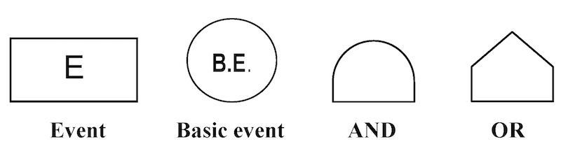
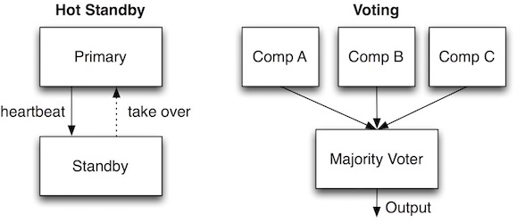
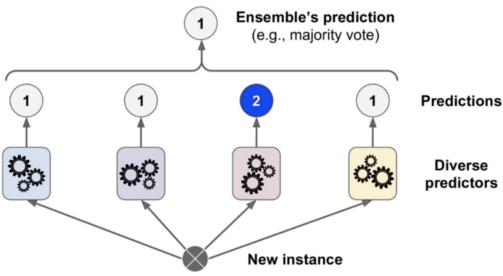

## Learning goals:

* Evaluate the risks of mistakes from ML components using the fault tree
analysis (FTA)
* Design strategies for mitigating the risks of failures due to AI mistakes

---
# Risk Analysis

----
## What is Risk Analysis?

*  What can possibly go wrong in my system, and what are potential 
impacts on system requirements?
<!-- .element: class="fragment" -->
* Risk = Likelihood * Impact
<!-- .element: class="fragment" -->
* A number of methods:
<!-- .element: class="fragment" -->
  * Failure mode & effects analysis (FMEA)
  * Hazard analysis
  * Why-because analysis
  * Fault tree analysis (FTA) <= Today's focus!
  * ...

<!-- ---- -->
<!-- ## Risks? -->

<!-- * Lane assist system -->
<!-- * Credit rating -->
<!-- * Amazon product recommendation -->
<!-- * Audio transcription service -->
<!-- * Cancer detection -->
<!-- * Predictive policing -->

<!-- **Discuss potential risks, including impact and likelyhood** -->

<!-- <\!-- discussion -\-> -->

----
## Fault Tree Analysis (FTA)

* Fault tree: A top-down diagram that displays the relationships
between a system failure (i.e., requirement violation) and its potential causes.  
<!-- .element: class="fragment" -->
  * Identify sequences of events that result in a failure
  * Prioritize the contributors leading to the failure
  * Inform decisions about how to (re-)design the system
  * Investigate an accident & identify the root cause 
* Often used for safety & reliability, but can also be used for
other types of requirements (e.g., poor performance, security attacks...)
<!-- .element: class="fragment" -->

<!-- .element: class="stretch" -->

----
## Fault Tree Analysis & ML

* ML is increaseingly used in safety-critical domains such as automotive, aeronautics, industrial control systems, etc.,
* ML models are just one part of the system
<!-- .element: class="fragment" -->
* ML models will EVENTUALLY make mistakes
<!-- .element: class="fragment" -->
  * Output wrong predictions/values
  * Fail to adapt to the changing environment
  * Confuse users, etc.,
* How do mistakes made by ML contribute to system failures? How do we
  ensure their mistakes do not result in a catastrophic outcome?
<!-- .element: class="fragment" -->

----
## Fault Trees: Basic Building Blocks

* Event: An occurrence of a fault or an undesirable action
<!-- .element: class="fragment" -->
  * (Intermediate) Event: Explained in terms of other events
  * Basic Event: No further development or breakdown; leafs of the tree
* Gate: Logical relationship between an event & its immedicate subevents
<!-- .element: class="fragment" -->
  * AND: All of the sub-events must take place
  * OR: Any one of the sub-events may result in the parent event

<!-- references -->
Figure from _Fault Tree Analysis and Reliability Block Diagram_
(2016), Jaroslav Menčík. 

----
## Fault Tree Example

* Every tree begins with a TOP event (typically a violation of a requirement)
<!-- .element: class="fragment" -->
* Every branch of the tree must terminate with a basic event
<!-- .element: class="fragment" -->

<!-- references -->
Figure from _Fault Tree Analysis and Reliability Block Diagram_
(2016), Jaroslav Menčík. 

----
## Analysis

* What can we do with fault trees?
  * Qualitative analysis: Determine potential root causes of a
    failiure through _minimal cut set analysis_
  * Quantitative analysis: Compute the probablity of a failure

----
## Minimal Cut Set Analysis

* Cut set: A set of basic events whose simultaneous occurrence is
  sufficient to guarantee that the TOP event occurs.
* _Minimal_ cut set: A cut set from which a smaller cut set can't be
obtained by removing a basic event.
* Q. What are minimal cut sets in the above tree?

----
## Failure Probability Analysis

* To compute the probability of the top event:
<!-- .element: class="fragment" -->
  * Assign probabilities to basic events (based on domain knowledge)
  * Apply probability theory to compute probabilities of intermediate events
	through AND & OR gates
  * (Alternatively, as sum of prob. of minimal cut sets) 
* In this class, we won't ask you to do this.
<!-- .element: class="fragment" -->
  * Why is this especially challenging for software? 

----
## FTA Process

1. Specify the system structure
<!-- .element: class="fragment" -->
   * Environment entities & machine components
   * Assumptions (ENV) & specifications (SPEC)
2. Identify the top event as a requirement violation (REQ)
<!-- .element: class="fragment" -->
3. Construct the fault tree
<!-- .element: class="fragment" -->
	* Derive intermediate events from a violation of ENV or SPEC
	* Decompose the intermediate events further down based on the
      knowledge of the domain or components
4. Analyze the tree
<!-- .element: class="fragment" -->
  * Identify all possible minimal cut sets
5. Consider design modifications
<!-- .element: class="fragment" -->
   * Eliminate certain cutsets, or
   * Increase the size of min cutsets
6. Repeat
<!-- .element: class="fragment" -->

----
## Example: Back to Lane Assist

<!-- .element: class="stretch" -->

* REQ: The vehicle must be prevented from veering off the lane.
* SPEC: Lane detector accurately identifies lane markings in the input image; 
  the controller generates correct steering commands
* ENV: Sensors are providing accurate information about the lane;
  driver responses when given warning; steering wheel is functional

----
## Breakout: FTA for Lane Assist

<!-- .element: class="stretch" -->

* Draw a fault tree for the lane assist system with the top event as
“Vehicle fails to stay within the lane”
* Draw on paper, scan & upload into Slack #lecture
* Or use the Google Slide template provided; make your own copy and
  paste the link into Slack

----
## Example: FTA for Lane Assist

<!-- .element: class="stretch" -->

----
## FTA: Caveats

* In general, building a **complete** tree is impossible
  * There are probably some faulty events that you missed
  * "Unknown unknowns"
* Domain knowledge is crucial for improving coverage
  * Talk to domain experts; augment your tree as you learn more
* FTA is still very valuable for risk reduction!
  * Forces you to think about & explictly document possible failure scenarios
  * A good starting basis for designing mitigations

---
# Strategies for Handling Faults in ML-based Systems

----
## Elements of Fault-Tolerant Design

* Assume that:
<!-- .element: class="fragment" -->
  * Software/ML components will make mistakes at some point
  * Environment evolves, violating some of its assumptions 
* Goal: Minimize the impact of mistakes/violations on the overall
system
<!-- .element: class="fragment" -->
* Detection
<!-- .element: class="fragment" -->
  * Monitoring
  * Redundancy
* Response
  <!-- .element: class="fragment" -->
  * Graceful degradation (fail-safe)
  * Redundancy (fail over)
  * Human in the loop
  * Undoable actions
* Containment
  <!-- .element: class="fragment" -->
  * Decoupling & isolation

----
## Detection: Monitoring

<!-- .element: class="stretch" -->

* Goal: Detect when a component failure occurs
<!-- .element: class="fragment" -->
* Monitor: Periodically checks the output of a component for errors
<!-- .element: class="fragment" -->
  * Challenge: Need a way to recognize errors 
  * e.g., corrupt sensor data, slow or missing response; low ML confidence
* Doer-Checker pattern
  <!-- .element: class="fragment" -->
  * Doer: Perform primary function; untrusted and potentially faulty
  * Checker: If doer output is faulty, perform a corrective action
    (e.g., default safe output, shutdown); should be trustworthy

----
## Doer-Checker Example: Autonomous Vehicle
<!-- .element: class="stretch" -->

* ML-based controller (doer): Generate commands to steer the vehicle
<!-- .element: class="fragment" -->
	* Complex DNN; makes performance-optimal control decisions
* Safety controller (checker): Checks commands from ML controller; overrides it
  with a safe default command if the ML action is risky
<!-- .element: class="fragment" -->
	* Simpler, based on verifiable, transparent logic; conservative control

----
## Doer-Checker Example: Autonomous Vehicle

* Yellow region: Slippery road, causes loss of traction; unexpected by ML
<!-- .element: class="fragment" -->
* ML-based controller (doer): Model ignores traction loss; generates
 unsafe steering commands (a)
<!-- .element: class="fragment" -->
* Safety controller (checker): Overrides with safe steering commands
  (b)
<!-- .element: class="fragment" -->

<!-- references -->
_Runtime-Safety-Guided Policy Repair_, Intl. Conference on Runtime Verification (2020)

----
## Response: Graceful Degradation (Fail-safe)

<video>
    <source data-src="rc-car.mp4" type="video/mp4" />
</video>

* Goal: When a component failure occurs, achieve system 
  safety by reducing functionality and performance
<!-- .element: class="fragment" -->
* Relies on a monitor to detect component failures
<!-- .element: class="fragment" -->
* Example: Perception in autonomous vehicles
<!-- .element: class="fragment" -->
	* If Lidar fails, switch to a lower-quality detector & be more
      conservative about maintaining distance 

----
## Detection & Response: Redundancy 

<!-- .element: class="stretch" -->

* Detection: Compare output from redundant components
<!-- .element: class="fragment" -->
* Reseponse: When a component fails, continue to provide the same
functionality
<!-- .element: class="fragment" -->
* Hot Standby: Standby watches & takes over when primary fails
<!-- .element: class="fragment" -->
* Voting: Select the majority decision
<!-- .element: class="fragment" -->
* Caution: Do components fail independently?
<!-- .element: class="fragment" -->
  * Reasonable assumption for hardware/mechanical failures
  * Q. What about ML components?

----
## Redundancy Example: Ensemble Learning

<!-- .element: class="stretch" -->

* An example of redundancy by voting

----
## Redundancy Example: Sensor Fusion

* Combine data from a wide range of sensors
* Provides partial information even when some sensor is faulty
* A critical part of modern self-driving vehicles

----
## Response: Human in the Loop

*Provide less forceful interaction, make suggestions, or ask for confirmation*

* AI and humans are good at predictions in different settings
<!-- .element: class="fragment" -->
	* AI better at statistics at scale and many factors
	* Humans understand context and data generation process; often better with thin data 
* AI for prediction, human for judgment?
<!-- .element: class="fragment" -->
* But be aware of:
<!-- .element: class="fragment" -->
	* Notification fatigue, complacency, just following predictions; see *Tesla autopilot*
    * Compliance/liability protection only?
* Deciding when and how to interact
<!-- .element: class="fragment" -->
* Lots of UI design and HCI problems
<!-- .element: class="fragment" -->
* Q. Examples?
<!-- .element: class="fragment" -->

Notes: Cancer prediction, sentencing + recidivism, Tesla autopilot, military "kill" decisions, powerpoint design suggestions

----
## Response: Undoable Actions

*Design the system to reduce the consequences of wrong predictions,
 allowing humans to override or undo*

**Examples?**

Notes: Smart home devices, credit card applications, Powerpoint design suggestions

----
## Example: Lane Assist

<!-- .element: class="stretch" -->

**Possible mitigation strategies? Discuss with your neighbors**

----
## Example: FTA for Lane Assist

<!-- .element: class="stretch" -->

----
## Modified FTA for Lane Assist

<!-- .element: class="stretch" -->

* Fault mitigation strategy: An additional sensor (infraed) for redundancy
  * Both sensors need to fail instead of just one
  * Reflected in the FTA as an additional basic event in the minimal cutset

----
## Containment: Decoupling & Isolation

* **Design principle**: Faults in a low-critical (LC) components should not impact
  high-critical (HC) components

----
## Poor Decoupling: USS Yorktown (1997)

* Invalid data entered into DB; divide-by-zero crashes entire network
* Required rebooting the whole system; ship dead in water for 3 hours 
* Lesson: Handle expected component faults; prevent propagation

----
## Poor Decoupling: Automotive Security

<!-- .element: class="stretch" -->

* Main components connected through a common CAN bus
  * Broadcast; no access control (anyone can read/write)
* Can control brake/engine by playing a malicious MP3

<!---references--->
_Experimental Security Analysis of a Modern Automobile_, Koscher et al., (2010)

----
## Containment: Decoupling & Isolation

* **Design principle**: Faults in a low-critical (LC) components should not impact
high-critical (HC) components
* Apply the principle of least privilege
<!-- .element: class="fragment" -->
  * LC components should be allowed to access min. necessary functions
* Limit interactions across criticality boundaries
<!-- .element: class="fragment" -->
  * Deploy LC & HC components on different networks
  * Add monitors/checks at interfaces
* Is an ML component in my system performing an LC or HC task?
<!-- .element: class="fragment" -->
  * If HC, can we "demote" it into LC?
  * Alternatively, if possible, replace/augment HC ML components with
  non-ML ones
  * Q. Examples?

---
# Summary

* Accept that a failure is inevitable
  * ML components will eventually make mistakes
  * Environment may evolve over time, violating its assumptions
* Use risk analysis to identify and mitigate potential problems
* Design strategies for detecting and mitigating the risks from mistakes by ML
