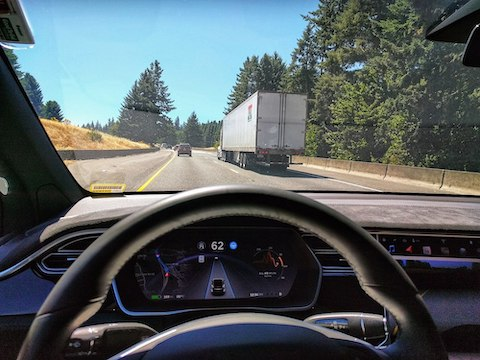

## Learning goals:

* Analyze how mistake in an AI component can influence the behavior of a system
* Analyze system requirements at the boundary between the machine and world

---
# Failures in ML-Based Systems

<!-- ---- -->
<!-- ## Cancer Detection -->

<!--  -->
<!-- <\!-- .element: class="stretch" -\-> -->

----
## Autonomous Vehicles

<!-- .element: class="stretch" -->

<!-- ---- -->
<!-- > Cops raid music fan’s flat after Alexa Amazon Echo device ‘holds a party on its own’ while he was out -->
<!-- Oliver Haberstroh's door was broken down by irate cops after neighbours complained about deafening music blasting from Hamburg flat -->

<!-- https://www.thesun.co.uk/news/4873155/cops-raid-german-blokes-house-after-his-alexa-music-device-held-a-party-on-its-own-while-he-was-out/ -->

<!-- > News broadcast triggers Amazon Alexa devices to purchase dollhouses. -->

<!-- https://www.snopes.com/fact-check/alexa-orders-dollhouse-and-cookies/ -->

----
## Chatbot

<!-- .element: class="stretch" -->

----
## Facial Recongition in ATM

<!-- .element: class="stretch" -->

----
## Automated Hiring

<!-- .element: class="stretch" -->

----
## Risks in ML-based Systems

**What went wrong? What are the root causes of failures? Poor ML accuracy?**

<!-- discussion -->

---
# Requirements and Risks

----
## Software Requirements

* Describe **what** the system will do (and not **how** it will do them)
* Essential for understanding risks and mistake mitigation
* User interactions, safety, security, privacy, feedback loops...

<!-- .element: class="stretch" -->

----
## Importance of Requirements

_"The hardest single part of building a software system is deciding
precisely what to build...No other part of the work so cripples the resulting system if done wrong."_
-- Fred Brooks, Mythical Man Month (1975)

----
## Importance of Requirements

Only 3% of fatal software accidents due to coding errors; rest due to
**poor requirements** or usability issues (National Research Council, 2007)

----
## Machine vs World

<!-- .element: class="stretch" -->

* No software lives in vacuum; every system is deployed as part of the world
* A requirement describes a desired state of the world (i.e., environment)
* Machine (software) is _created_ to interpret and manipulate the environment into
  the desired state

----
## Machine vs World

<!-- .element: class="stretch" -->

* Q. What is the environment for the following systems?
  * Self-driving car: ??
  * Smart home thermostats: ?? 
  * Movie recommender: ??

----
## Shared Phenomena

<!-- .element: class="stretch" -->

* Shared phenomena: Interface between the world & machine (actions,
  events, dataflow, etc.,)
* Machine can manipulate the world only through the shared interface
	* Other (unshared) entities of the world are beyond machine's control 
	* We can only **assume** how these entities will behave

----
## Requirement vs Specification

<!-- .element: class="stretch" -->

* Requirement (REQ): What your product provides, as desired effects on the
  environment (i.e., system-level goals)
* Assumptions (ENV): What’s assumed about the behavior/properties of
  the environment (based on domain knowledge)
* Specification (SPEC): What machine must do in order to satisfy REQ **in conjunction** with ENV

----
## Shared Phenomena

<!-- .element: class="stretch" -->

* Requirements (REQ) are expressed only in terms of world phenomena 
* Assumptions (ENV) are expressed in terms of world & shared phenomena
* Specifications (SPEC) are expressed in terms of shared phenomena

**Software cannot directly satisfy REQ on its own**

----
## Example: Lane Assist
<!-- .element: class="stretch" -->

* Requirement (REQ): The vehicle must be prevented from veering off the lane.
* What are the entities in the environment?
* What about components in the machine?

----
## Example: Lane Assist

<!-- .element: class="stretch" -->

* Requirement (REQ): The vehicle must be prevented from veering off the lane.
* Assumptions (ENV): ?
* Specification (SPEC): ?

----
## Example: Lane Assist

<!-- .element: class="stretch" -->

* REQ: The vehicle must be prevented from veering off the lane.
* ENV: Sensors are providing accurate information about the lane;
  driver responses when given warning; steering wheel is functional
* SPEC: ?

----
## Example: Lane Assist

<!-- .element: class="stretch" -->

* REQ: The vehicle must be prevented from veering off the lane.
* ENV: Sensors are providing accurate information about the lane;
  driver responses when given warning; steering wheel is functional
* SPEC: Lane detection accurately identifies the lane markings; the
  controller generates correct steering commands to keep the vehicle
  within lane

----
## What could go wrong?

<!-- .element: class="stretch" -->

* Wrong, inconsistent or infeasible requirements (REQ)
<!-- .element: class="fragment" -->
* Missing or incorrect environmental assumptions (ENV)
<!-- .element: class="fragment" -->
* Wrong or violated specification (SPEC)
<!-- .element: class="fragment" -->
* Inconsistency in assumptions & spec (ENV ∧ SPEC = False)
<!-- .element: class="fragment" -->

----
## Lufthansa 2904 Runaway Crash

<!-- .element: class="stretch" -->

* Reverse thrust (RT): Decelerates plane during landing
<!-- .element: class="fragment" -->
* What was required (REQ): RT enabled if and only if plane on the
ground
<!-- .element: class="fragment" -->
* What was implemented (SPEC): RT enabled if and only if wheel turning
<!-- .element: class="fragment" -->
* What was assumed (ENV): Wheel turning if and only if on the ground
<!-- .element: class="fragment" -->
* But runway wet due to rain
<!-- .element: class="fragment" -->
  * Wheel fails to turn, even though the plane is on the ground 
  * Pilot attempts to enable RT; overridden by the software
  * Plane goes off the runway!

----
## Implications on Software Development

* Software/AI alone cannot establish system requirements
<!-- .element: class="fragment" -->
  * They are just one part of the system!
* Environmental assumptions are just as critical
<!-- .element: class="fragment" -->
  * But typically you can't modify these
  * Must design SPEC while treating ENV as given
* If you ignore/misunderstand these, your system may fail to satisfy
  its requirements!
<!-- .element: class="fragment" -->

----
## Risks with Assumptions in ML

* Unrealistic or missing assumptions
<!-- .element: class="fragment" -->
	* e.g., effect of weather conditions on object detection,
	pedestrian behavior 
* Concept drift
<!-- .element: class="fragment" -->
  * Environment evolves over time; underlying distribution changes
  * e.g. user's preferences on products
  * (More on data quality lecture)
* Adversaries 
<!-- .element: class="fragment" -->
  * A malicious actor deliberately tries to violate ENV
  * e.g., adversarial attacks on stop signs
  * (More on security lecture)
* Feedback loops
<!-- .element: class="fragment" -->
  * System acts on the world that it senses; changes ENV over time
  * e.g., predictive policing

**High-quality model alone (SPEC) does not guarantee system goals (REQ)**
<!-- .element: class="fragment" -->

**Environmental assumptions (ENV) are just as important**
<!-- .element: class="fragment" -->

----
## Example: Lane Assist

<!-- .element: class="stretch" -->

* REQ: The vehicle must be prevented from veering off the lane.
* ENV: Sensors are providing accurate information about the lane;
  driver responses when given warning; steering wheel is functional
* SPEC: Lane detection accurately identifies the lane markings; the
  controller generates correct steering commands to keep the vehicle
  within lane

----
## What could go wrong in lane assist?

<!-- .element: class="stretch" -->

* Wrong or inconsistent requirements (REQ)?
* Missing or incorrect environmental assumptions (ENV)?
* Wrong or violated specification (SPEC)?
* Inconsistency in assumptions & spec (ENV ∧ SPEC = False)?

----
## Recall: Lack of Specifications for AI components

* In addition to world vs machine challenges
* We do not have clear specifications for AI components (SPEC)
    - Goals, average accuracy
    - At best probabilistic specifications in some symbolic AI techniques
* Viewpoint: Machine learning techniques mine assumptions (ENV) from
data, but not usually understandable
* But still important to articulate the responsibllities of AI
  components (SPEC) in establishing the system-level goals (REQ)

----
## Deriving SPEC from REQ

1. Identify environmental entities and machine components
2. State a desired requirement (REQ) over the environment
3. Identify the interface between the environment & machines
4. Identify the environmental assumptions (ENV)
5. Develop software specifications
(SPEC) that are sufficient to establish REQ
6. Check whether ENV ∧ SPEC ⊧ REQ
7. If NO, strengthen SPEC & repeat Step 6

**Can't be automated. Domain knowledge is critical for coming up with
  REQ, ENV, and SPEC**

----
## Breakout Session

Fall detection for elderly people; call 911 if unresponsive

<!-- .element: class="stretch" -->

What are the environmental entities and machine components?

REQ? ENV? SPEC? What can go wrong? 

---
# Summary

* Accept that ML components will make mistakes
* Understand world-machine interactions
  * Machine vs World; specification vs requirements
  * Role of environmental assumptions in establishing requirements
