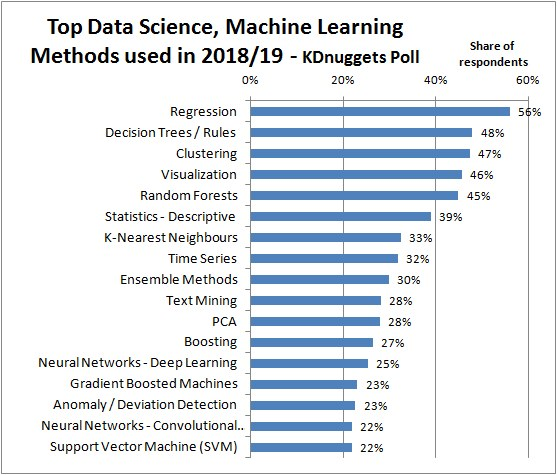
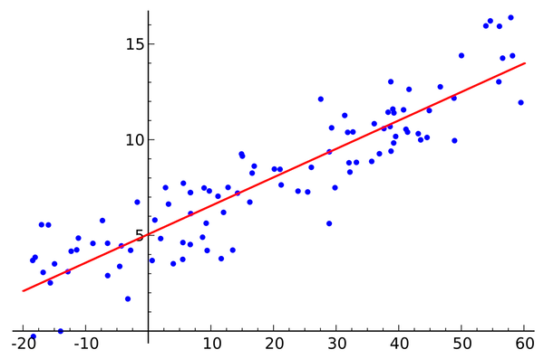
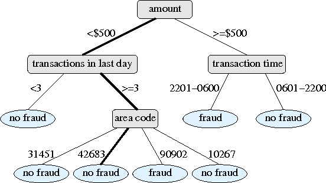
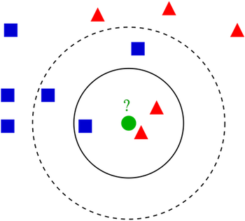
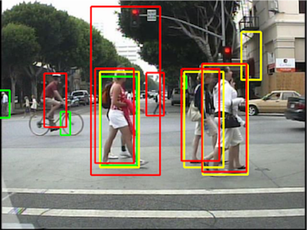
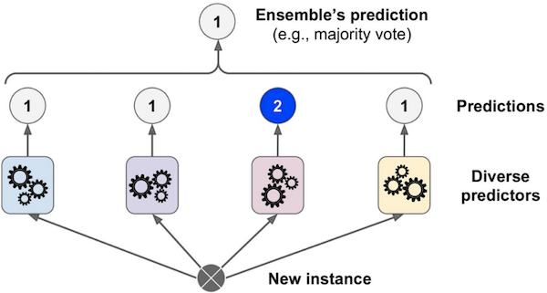
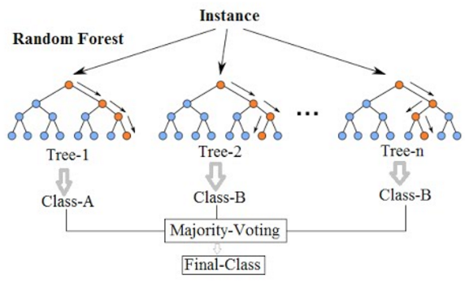
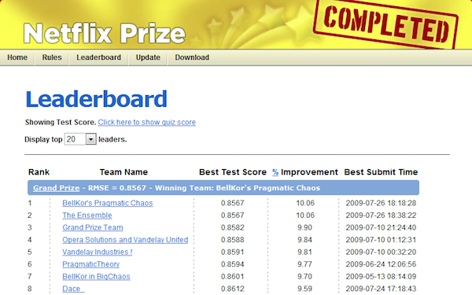

# Learning Goals

* Understand the major types of AI tasks and corresponding techniques
* Understand and compare the attributes of major learning methods
* Organize and prioritize the relevant qualities of concern for a given project
* Plan and execute an evaluation alternative learning methods for a given purpose

---
# Selection

### How do I decide which ML method to use for my project?

----
## AI != Deep Learning

(In this lecture, we will focus on ML)

----
## ML Methods Today

----
# Selection

### How do I decide which ML method to use for my project?

### Criteria: Attributes & Constraints

----
## Attributes

* Quality attributes (QAs): How well the product delivers its
functionality (performance, reliability, availability, security...)
<!-- .element: class="fragment" -->
* Project attributes: Time-to-market, development & HR cost...
<!-- .element: class="fragment" -->
* Design attributes: Type of ML method used, accuracy, training time, inference time, memory usage...
<!-- .element: class="fragment" -->
* Q. Attributes for an adaptive cruise control (ACC) system?
<!-- .element: class="fragment" -->

----
## Constraints

* Constraints: Defines the space of attributes for valid design solutions

----
## Types of Constraints

* Problem constraints: Minimum required QAs for an acceptable product
<!-- .element: class="fragment" -->
	* e.g. "The cruise control must maintain a minimum distance of X meters to pedestrians."
* Project constraints: Deadline, project budget, available skills
<!-- .element: class="fragment" -->
	* "The product development must be completed within next 3 months."
* Design constraints: Type of ML task required, limits on computing resources, data
availability, max. inference time
<!-- .element: class="fragment" -->
	* "The ML component must be capable of performing object classification
    within 0.5 seconds."
	* "< 10K labeled samples are currently available for training."
* Q. What's the relationship between these types of constraints?
<!-- .element: class="fragment" -->

----
# Selection

### How do I decide which ML method to use for my project?

### Find a method that (1) satisfies the given constraints and (2) is optimal with respect to the set of attributes. 

### (We will come back to this later.)

---
# Types of ML Tasks

----
## ML Tasks

* Classification
* Regression
* Clustering
* (Dimensionality reduction)
* (Reinforcement learning)
* (Active learning)
* ...

----
## Classification

* Which one of the given categories does a new
observation belong to?
	* e.g., e-mail spam filter, pedestrian detection
	* Output is a **categorical** value

----
## Regression

* What is the estimated value for an output given an observation?
	* e.g., weather forecasting, sales prediction
	* Output is a **numerical/continuous** value

----
## Clustering

* What is the best way to divide a set of observations into
distinct groups?
	* An example of *unsupervised learning*: Input data aren't labeled
	* Output is a set of *categories*
	* e.g., human genetic clustering, social network analysis

<!-- references -->

_An Exploration of Social Identity: The Geography and Politics of
News-Sharing Communities in Twitter_, Herdagdelen et al. (2012)

----
## Example: Product Recommendation

### Q. What type of ML task(s) does the system perform?

---
# Attributes of ML Techniques

----
## ML Attributes 

* Type of ML task: Classification, regression, or clustering?
<!-- .element: class="fragment" -->
* Type of training/input data required
<!-- .element: class="fragment" -->
  * Labeled vs not labeled
  * Categorical vs numerical
* Accuracy: Precision & recall (for classification), errors (regression)
<!-- .element: class="fragment" -->
* Interpretability: Why did the model produce output X?
<!-- .element: class="fragment" -->
* Problem complexity
<!-- .element: class="fragment" -->
   * Linear vs. non-linear relationship between input & output variables
   * Number of features (dimensionality)
* Training costs
<!-- .element: class="fragment" -->
  * Amount of training data required to reach desired accuracy
  * Training time
* Model size: Can you store all your model in memory?
<!-- .element: class="fragment" -->
* Incrementality: Can you improve the model by gradually adding more data?
<!-- .element: class="fragment" -->
* Inference time: How long does it take for the model to make a decision?
<!-- .element: class="fragment" -->

<!-- ---- -->
<!-- ## Accuracy for Binary Classification -->

<!--  -->

<!-- * Recall = TP / (actual positive) = TP/ (TP + FN) -->
<!-- * Precision = FP / (actual negatives) = FP / (TN + FP) -->

---
# Types of ML Methods

----
## Linear Regression

* Tasks: Regression 
* Linear relationship between input & output variables
* Easy to interpret, low training cost, small model size
* Can't capture non-linear relationships well

----
## Decision Tree Learning

* Tasks: Classification & regression
* Non-leaft nodes: Conditional on input variables (features)
* Leaf nodes: Class labels or continuous output values
* Easy to interpret; can capture non-linearity; can do well with
  little data
* Low accuracy (high risk of overfitting); possibly very large tree size

----
## Neural Network

* Tasks: Classification & regression
* High accuracy; can capture a wide range of problems (linear & non-linear)
* Difficult to interpret; high training costs (time & amount of
  data required, hyperparameter tuning)

----
## k-Nearest Neighbors (k-NN)

* Tasks: Classification & regression
* Infer the class/property of an object based on that of _k_ nearest neighbors
* **Lazy learning**: Generalization is delayed until
  the inference takes place 
* Easy to interpret; no training required (due to lazy learning); incremental (can continously add new data) 
* Potentially slow inference (again, due to lazy learning); high data storage
  requirement (must store training instances)

----
## Which Method?

### Sales forecast based on advertisement spendings

Linear regression, decision tree, neural network, or k-NN?

----
## Which Method?

### Pedestrian detection

Linear regression, decision tree, neural network, or k-NN?

----
## Which Method?

### Video Recommendations

Linear regression, decision tree, neural network, or k-NN?

<!-- ---- -->
<!-- ## K-Means Clustering -->

<!--  -->

<!-- * Task: Clustering -->
<!-- * Fast (for small _k_) -->
<!-- * Manual choice of _k_ -->

<!-- ---- -->
<!-- ## Hierarchical Clustering -->

<!--  -->

<!-- * Task: Clustering -->
<!-- * Can produce hierarhical clusters -->
<!-- * Slower than k-Means -->

----
## Ensemble Learning

* Combine a set of low-accuracy (but cheaper to learn) models to
provide high-accuracy predictions
* Techniques:
  * Boosting (e.g., gradient boosting)
  * Bagging (random forest)
  * Stacking

----
## Random Forest

* Randomly construct lots of decision trees
* Final output is the mode (for classification) or mean (regression) of 
  individual trees
* High accuracy & reduced overfitting; incremental (can add new trees)
* Reduced interpretability; large number of trees can take up space

----
## Other Learning Methods

* Logistic regression 
* Support vector machine (SVM)
* Naive Bayes
* Principal component analysis (PCA)
* Markov networks
* Clustering methods
  * k-means, hierarchical clustering
* Symbolic methods
  * Multi-agent systems
  * Logic-based representations
* and many more...

---
# Tradeoff Analysis

----
## Trade-offs: Cost vs Accuracy

_"We evaluated some of the new methods offline but the additional
accuracy gains that we measured did not seem to justify the
engineering effort needed to bring them into a production
environment.”_

<!-- references -->

_Netflix Recommendations: Beyond the 5 stars_, Amatriain & Basilico,
Netflix Technology Blog (2012)

----
## Trade-offs: Accuracy vs Interpretability

<!-- references -->

_Overcoming the Barriers to Production-Ready Machine Learning
Workflows_, Bloom & Brink, O'Reilly Strata Conference (2014).

----
## Multi-Objective Optimization (MOO)

* Determine optimal solutions given multiple, possibly
  **conflicting** objectives
* **Dominated** solution: A solution that is inferior to
  others in every way 
* **Pareto frontier**: A set of non-dominated solutions 

----
## Example: Sales Forecast

* For problems with a linear relationship between input & output variables:
  * Linear regression: Superior in terms of accuracy, interpretability, cost 
  * Other methods are dominated (inferior) solutions

----
## ML Method Selection as MOO

1. Identify a set of constraints 
2. Eliminate methods that do not satisfy the constraints
3. Evaluate remaining methods against each attribute
4. Eliminate dominated methods to find the pareto frontier 
5. Consider priorities among attributes to select an optimal method

----
## Example: Object Detection

* Constraints: ML task (classification), inference time (fast,
 real-time), model size (moderate, for on-vehicle storage)
* Invalid solutions: Linear regression, k-NN
* Priority among attributes: What if accuracy > interpretability > cost?

----
## Exercise: Medical Diagnosis

* Constraints: Type of ML task? Accuracy?
Interpretability?  
* Which ML methods satisfy the constraints?
* Which methods are pareto optimal?
* Which method would you choose under what priority?

<!-- ---- -->
<!-- ## Selection: Cheat Sheet -->

<!--  -->

---
# Summary

* Criteria for selecting AI methods: Attributes & Constraints
  * Problem, project, design attributes
* Major types of AI tasks and corresponding techniques
  * Classification, regression, clustering
  * Linear regression, decision tree, neural networks, k-NN, ensemble
    learning...
* AI method selection as multi-objective optimization (MOO)
