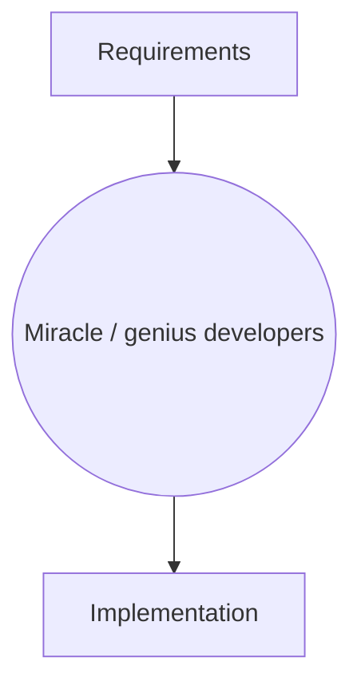
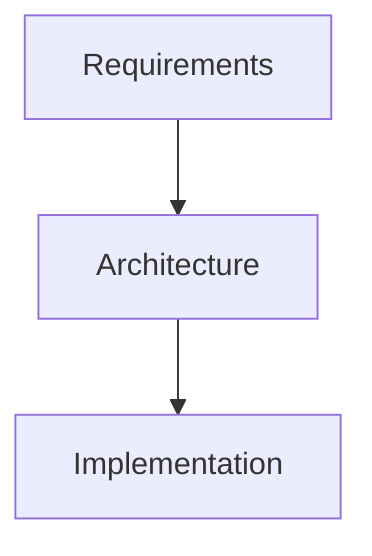

# Software Architecture of AI-enabled Systems

Christian Kaestner

<!-- references -->

Required reading: 
* Rick Kazman, Paul Clements, and Len Bass. [Software architecture in practice.](https://www.oreilly.com/library/view/software-architecture-in/9780132942799/?ar) Addison-Wesley Professional, 2012, Chapter 1
* Hulten, Geoff. "[Building Intelligent Systems: A Guide to Machine Learning Engineering.](https://www.buildingintelligentsystems.com/)" Apress, 2018, Chapter 13.

---

# Learning Goals

* Understand important quality considerations when using ML components
* Follow a design process to explicitly reason about alternative designs and their quality tradeoffs
* Create architectural models to reason about relevant characteristics
* Gather data to make informed decisions about what ML technique to use and where and how to deploy it

* Identify to what degree isolating an AI component is possible and benefitial
* Critique the decision of where an AI model lives (e.g., cloud vs edge vs hybrid), considering the relevant tradeoffs 
* Deliberate how and when to update models and how to collect telemetry

---

# Software Architecture 

----

# Software Architecture 

Focused on reasoning about tradeoffs and desired qualities
----
## Software Architecture

> The software architecture of a program or computing system is the **structure or structures** of the system, which comprise **software elements**, the ***externally visible properties*** of those elements, and the relationships among them.
> -- [Kazman et al. 2012](https://www.oreilly.com/library/view/software-architecture-in/9780132942799/?ar)

----

## Why Architecture? ([Kazman et al. 2012](https://www.oreilly.com/library/view/software-architecture-in/9780132942799/?ar))

* Represents earliest design decisions.
* Aids in **communication** with stakeholders
    * Shows them “how” at a level they can understand, raising questions about whether it meets their needs
* Defines **constraints** on implementation
    * Design decisions form “load-bearing walls” of application
* Dictates **organizational structure**
    * Teams work on different components
* Inhibits or enables **quality attributes**
    * Similar to design patterns
* Supports **predicting** cost, quality, and schedule
    * Typically by predicting information for each component
* Aids in software **evolution**
    * Reason about cost, design, and effect of changes
* Aids in **prototyping**
    * Can implement architectural skeleton early

----

## Case Study: Twitter

----

## Twitter - Caching Architecture

Notes:

* Running one of the world’s largest Ruby on Rails installations
* 200 engineers
* Monolithic: managing raw database, memcache, rendering the site, and * presenting the public APIs in one codebase
* Increasingly difficult to understand system; organizationally challenging to manage and parallelize engineering teams
* Reached the limit of throughput on our storage systems (MySQL); read and write hot spots throughout our databases
* Throwing machines at the problem; low throughput per machine (CPU + RAM limit, network not saturated)
* Optimization corner: trading off code readability vs performance

----

## Twitter's Redesign Goals

* Performance
    * Improve median latency; lower outliers 
    * Reduce number of machines 10x
+ Reliability
    * Isolate failures
+ Maintainability
    * "We wanted cleaner boundaries with “related” logic being in one place": 
encapsulation and modularity at the systems level (rather than at the class, module, or package level)
* Modifiability
    * Quicker release of new features: "run small and empowered engineering teams that could make local decisions and ship user-facing changes, independent of other teams"

<!-- references -->

Raffi. [New Tweets per second record, and how!](https://blog.twitter.com/engineering/en_us/a/2013/new-tweets-per-second-record-and-how.html) Twitter Blog, 2013

----

## Twitter: Redesign Decisions

* Ruby on Rails -> JVM/Scala 
* Monolith -> Microservices
* RPC framework with monitoring, connection pooling, failover strategies, loadbalancing, ... built in
* New storage solution, temporal clustering, "roughly sortable ids"
* Data driven decision making

----

## Twitter Case Study: Key Insights

* Architectural decisions affect entire systems, not only individual modules
* Abstract, different abstractions for different scenarios
* Reason about quality attributes early
* Make architectural decisions explicit
* Question: **Did the original architect make poor decisions?**

---

# Architectural Modeling and Reasoning
----

Notes: Map of Pittsburgh. Abstraction for navigation with cars.
----

Notes: Cycling map of Pittsburgh. Abstraction for navigation with bikes and walking.
----

Notes: Fire zones of Pittsburgh. Various use cases, e.g., for city planners.
----
## Analysis-Specific Abstractions

* All maps were abstractions of the same real-world construct
* All maps were created with different goals in mind
    - Different relevant abstractions
    - Different reasoning opportunities
* 
* Architectural models are specific system abstractions, for reasoning about specific qualities
* No uniform notation

----

## What can we reason about?

----

## What can we reason about?

<!-- references -->
Ghemawat, Sanjay, Howard Gobioff, and Shun-Tak Leung. "[The Google file system.](https://ai.google/research/pubs/pub51.pdf)" ACM SIGOPS operating systems review. Vol. 37. No. 5. ACM, 2003.

Notes: Scalability through redundancy and replication; reliability wrt to single points of failure; performance on edges; cost

----

## Modeling Recommendations

* Use notation suitable for analysis
* Document meaning of boxes and edges in legend
* Graphical or textual both okay; whiteboard sketches often sufficient
* Formal notations available

---

# Software Architecture and AI Components -- Two Case Studies

----

## Case Study: Augmented Reality Translation

<!-- .element: class="stretch" -->

Notes: Image: https://pixabay.com/photos/nightlife-republic-of-korea-jongno-2162772/

----
## Case Study: Augmented Reality Translation

----
## Case Study: Augmented Reality Translation

Notes: Consider you want to implement an instant translation service similar toGoogle translate, but run it on embedded hardware in glasses as an augmented reality service.
----
## Qualities of Interest?

<!-- discussion -->

----
## Case Study: Uber Surge Prediction

Notes: Consider you work at Uber and want to predict where rider demand is going to be high.
----
## Qualities of Interest?

<!-- discussion -->

---
# Architectural Decision: Selecting AI Techniques

What AI techniques to use and why? Tradeoffs?

<!-- colstart -->

<!-- col -->

<!-- colend -->

Notes: Relate back to previous lecture about AI technique tradeoffs, including for example
Accuracy
Capabilities (e.g. classification, recommendation, clustering…)
Amount of training data needed
Inference latency
Learning latency; incremental learning?
Model size
Explainable? Robust?

---
# Architectural Decision: Where Should the Model Live?

----
## Where Should the Model Live?

* Glasses
* Phone
* Cloud

What qualities are relevant for the decision?

<!-- split -->

Notes: Trigger initial discussion

----
## Exercise: Latency and Bandwidth Analysis of AR Translation

1. Identify key components of a solution and their interactions

2. Estimate latency and bandwidth requirements between components

3. Discuss tradeoffs among different deployment models

<!-- discussion -->

Notes: Identify at least OCR and Translation service as two AI components in a larger system. Discuss which system components are worth modeling (e.g., rendering, database, support forum). Discuss how to get good estimates for latency and bandwidth.

----
## Considerations

* How much data is needed as input for the model?
* How much output data is produced by the model?
* How fast/energy consuming is model execution?
* What latency is needed for the application?
* How big is the model? How often does it need to be updated?
* Cost of operating the model? (distribution + execution)
* Opportunities for telemetry?
* What happens if users are offline?

----
## When would one use the following designs?

* Static intelligence in the product
* Client-side intelligence
* Server-centric intelligence
* Back-end cached intelligence
* Hybrid models

Notes:
From the reading:
* Static intelligence in the product
    - difficult to update
    - good execution latency
    - cheap operation
    - offline operation
    - no telemetry to evaluate and improve
* Client-side intelligence
    - updates costly/slow, out of sync problems
    - complexity in clients
    - offline operation, low execution latency
* Server-centric intelligence
    - latency in model execution (remote calls)
    - easy to update and experiment
    - operation cost
    - no offline operation
* Back-end cached intelligence
    - precomputed common results
    - fast execution, partial offline 
    - saves bandwidth, complicated updates
* Hybrid models

----
## More Considerations

* Coupling of ML pipeline parts
* Coupling with other parts of the system
* Ability for different developers and analysts to collaborate
* Support online experiments
* Ability to monitor

----
## Where Should the Model Live?

* Car
* Phone
* Cloud

What qualities are relevant for the decision? 

<!-- split -->

Notes: Trigger initial discussion

---
# Architectural Decision: Telemetry Requirements
----
## Telemetry Design

How to evaluate mistakes in production?

<!-- colstart -->

<!-- col -->

<!-- colend -->

Notes: Discuss strategies to determine accuracy in production. What kind of telemetry needs to be collected?

----
## The Right and Right Amount of Telemetry

Purpose:
* Monitor operation
* Monitor mistakes (e.g., accuracy)
* Improve models over time (e.g., detect new features)

Challenges:
* too much data
* no/not enough data
* hard to measure, poor proxy measures
* rare events
* cost
* privacy
----
## Telemetry Tradeoffs

What data to collect? How much? When?

Estimate data volume and possible bottlenecks in system.

<!-- colstart -->

<!-- col -->

<!-- colend -->

Notes: Discuss alternatives and their tradeoffs. Draw models as suitable.

---
# Architectural Decision: Independent Model Service

Microservice architecture: 

Model Inference and Model Learning as a RESTful Service?

----
## Coupling and Changeability

What's the interface between the AI component and the rest of the system?

* Learning data and process
* Inference API
    - Where does feature extraction happen? 
    - Provide raw data (images, user profile, all past purchases) to service, grant access to shared database, or provide feature vector?
    - Cost of feature extraction? Who bears the cost?
    - Versioned interface?
* Coupling to other models? Direct coupling to data sources (e.g., files, databases)? Expected formats for raw data (e.g., image resolution)?
* Coupling to telemetry?

----
## Model Service API

Consider encapsulating the model as a microservice. Sketch a (REST) API.

<!-- colstart -->

<!-- col -->

<!-- colend -->

----
## Future-Proofing an API

* Anticipating and encapsulating change
    - What parts around the model service are likely to change?
    - Rigid vs flexible data formats?
* Versioning of APIs
    - Version numbers vs immutable services?
    - Expecting to run multiple versions in parallel? Implications for learning and evolution?

----
## Robustness

* Redundancy for availability?
* Load balancer for scalability?
* Can mistakes be isolated?
    - Local error handling?
    - Telemetry to isolate errors to component?
* Logging and log analysis for what qualities?

---
# Architectural Decision: Updating Models

* Models are rarely static outside the lab
* Data drift, feedback loops, new features, new requirements
* When and how to update models?
* How to version? How to avoid mistakes?

----
## Risk of Stale Models

What could happen if models become stale?

<!-- colstart -->

<!-- col -->

<!-- colend -->

Risk: Discuss drift, adversarial interactions, feedback loops
----
## Update Requirements or Goals

Estimate the required update frequency and the related cost regarding training, data transfer, etc.

<!-- colstart -->

<!-- col -->

<!-- colend -->

Notes: Discuss how frequently the involved models need to be updated. Are static models acceptable? Identify what information to collect and estimate 
the relevant values.

----
## Outlook: Big Data Designs

Stream + Batch Processing

---

# AI as a Service

Third-Party AI Components in the Cloud

AI Components as Microservices

----

## Readymade AI Components in the Cloud

* Data Infrastructure
    - Large scale data storage, databases, stream (MongoDB, Bigtable, Kafka)
* Data Processing
    - Massively parallel stream and batch processing (Sparks, Hadoop, ...)
    - Elastic containers, virtual machines (docker, AWS lambda, ...)
* AI Tools
    - Notebooks, IDEs, Visualization
    - Learning Libraries, Frameworks (tensorflow, torch, keras, ...)
* Models
    - Image, face, and speech recognition, translation
    - Chatbots, spell checking, text analytics
    - Recommendations, knowledge bases

----

----

## Build vs Buy

Hardware, software, models?

<!-- discussion -->

Notes: Discuss privacy implications

---

# Reflection

Qualities of interest? Important design tradeoffs? Decisions?

<!-- colstart -->

<!-- col -->

<!-- colend -->

---

# Summary

* Software architecture is an established discipline to reason about design alternatives
* Understand relevant quality goals 
* Problem-specific modeling and analysis: Gather estimates, consider design alternatives, make tradeoffs explicit
* Examples of important design decision:
    - modeling technique to use
    - where to deploy the model
    - how and how much telemetry to collect
    - whether and how to modularize the model service
    - when and how to update models
    - build vs buy, cloud resources
