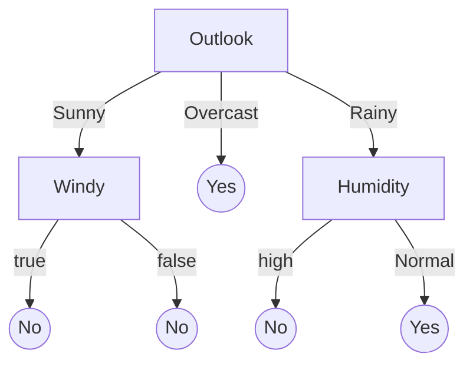
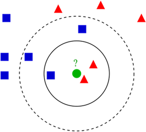

# Learning Goals

* Describe the most common models and learning strategies used for AI components and summarize how they work
* Organize and prioritize the relevant qualities of concern for a given project
* Plan and execute an evaluation of the qualities of alternative AI components for a given purpose


---
## Today's Case Study: Lane Assist


---
## Today's Case Study: Lane Assist


<!-- references -->

Image CC BY-SA 4.0 by [Vidyakv](https://en.wikipedia.org/wiki/Lane_departure_warning_system#/media/File:Lane_Detection_Example.jpg)


----
## Background: Lane Assist
From audio, haptic, and visual signal ("lane departure warning") to automated steering ("lane keeping"); often combined with adaptive cruise control

Safety or comfort feature

Multiple inputs: camera, indicators, speed, possibly radar, hands on steering wheel sensor

Multiple AI components: Lane recognition, automated steering, automated breaking

Integrated into larger systems with user interface, sensors, actuators, and other AI and non-AI components, working together with humans

Classic systems based on old line detection techniques in images (no deep learning)

See https://en.wikipedia.org/wiki/Lane_departure_warning_system


---
# Quality

<!-- colstart -->

<!-- col -->

<!-- colend -->

----
## Views of Quality

* **Transcendent** – Experiential. Quality can be recognized but not defined or measured
* **Product-based** – Level of attributes (More of this, less of that)
* **User-based** – Fitness for purpose, quality in use
* **Value-based** – Level of attributes/fitness for purpose at given cost
* **Manufacturing** – Conformance to specification, process excellence

<!-- references -->

Reference:
Garvin, David A., [What Does Product Quality Really Mean](http://oqrm.org/English/What_does_product_quality_really_means.pdf). Sloan management review 25 (1984).


----

## Garvin’s eight categories of product quality

* Performance
* Features
* Reliability
* Conformance
* Durability
* Serviceability
* Aesthetics
* Perceived Quality

<!-- references -->

Reference:
Garvin, David A., [What Does Product Quality Really Mean](http://oqrm.org/English/What_does_product_quality_really_means.pdf). Sloan management review 25 (1984).


----
## Attributes


* **Quality attributes:** How well the product (system) delivers its
functionality (usability, reliability, availability, security...)
* **Project attributes:** Time-to-market, development & HR cost...
* **Design attributes:** Type of AI method used, accuracy, training time, inference time, memory usage...


----
## Constraints

Constraints define the space of attributes for valid design solutions


----
## Types of Constraints

* Problem constraints: Minimum required QAs for an acceptable product
* Project constraints: Deadline, project budget, available skills
* Design constraints: Type of ML task required (regression/classification), kind of available data, limits on computing resources, max. inference cost

**Plausible constraints for Lane Assist?**


----
## AI Selection Problem

* How to decide which AI method to use in project?
* Find method that:
  1. satisfies the given constraints and 
  2. is optimal with respect to the set of relevant attributes


---
# Requirements Engineering: 

# Identify Relevant Qualities of AI Components in AI-Enabled Systems


----
## Accuracy is not Everything

Beyond prediction accuracy, what qualities may be relevant for an AI component?

<!-- discussion -->

Note: Collect qualities on whiteboard

----
## Qualities of Interest?

Scenario: Component detecting line markings in camera picture

<!-- discussion -->

Note: Which of the previously discussed qualities are relevant?
Which additional qualities may be relevant here?

----
## Qualities of Interest?

Scenario: Component predicting defaulting on loan (credit rating)

<!-- discussion -->

----
## Measuring Qualities

* Define a metric -- define units of interest 
  - e.g., requests per second, max memory per inference, average training time in seconds for 1 million datasets
* Operationalize metric -- define measurement protocol
  - e.g., conduct experiment: train model with fixed dataset, report median training time across 5 runs, file size, average accuracy with leave-one-out crossvalidation after hyperparameter tuning
  - e.g., ask 10 humans to independently label evaluation data, report reduction in error from machine-learned model over human predictions
  - describe all relevant factors: inputs/experimental units used, configuration decisions and tuning, hardware used, protocol for manual steps

**On terminology:** *metric/measure* refer a method or standard format for measuring something; *operationalization* is identifying and implementing a method to measure some factor

----
## Examples of Qualities to Consider

* Accuracy
* Correctness guarantees? Probabilistic guarantees (--> symbolic AI)
* How many features? Interactions among features?
* How much data needed? Data quality important?
* Incremental training possible?
* Training time, memory need, model size -- depending on training data volume and feature size
* Inference time, energy efficiency, resources needed, scalability
* Interpretability/explainability
* Robustness, reproducibility, stability
* Security, privacy
* Fairness

----
## On terminology

* Data scientists seem to speak of *model properties* when referring to accuracy, inference time, fairness, etc
  * ... but they also use this term for whether a *learning technique* can learn non-linear relationships or whether the learning algorithm is monotonic
* Software engineering wording would usually be *quality attributes*, *non-functional requirements*, ...


----
## Interpretability/Explainability

*"Why did the model predict X?"*

**Explaining predictions + Validating Models + Debugging**

```
IF age between 18–20 and sex is male THEN predict arrest
ELSE IF age between 21–23 and 2–3 prior offenses THEN predict arrest
ELSE IF more than three priors THEN predict arrest
ELSE predict no arrest
```

Some models inherently simpler to understand

Some tools may provide post-hoc explanations

Explanations may be more or less truthful

How to measure interpretability?

**more in a later lecture**

----
## Robustness


Small input modifications may change output

Small training data modifications may change predictions

How to measure robustness?

**more in a later lecture**


<!-- references -->
Image source: [OpenAI blog](https://openai.com/blog/adversarial-example-research/)

----
## Fairness

*Does the model perform differently for different populations?*

```
IF age between 18–20 and sex is male THEN predict arrest
ELSE IF age between 21–23 and 2–3 prior offenses THEN predict arrest
ELSE IF more than three priors THEN predict arrest
ELSE predict no arrest
```

Many different notions of fairness

Often caused by bias in training data

Enforce invariants in model or apply corrections outside model

Important consideration during requirements solicitation!

**more in a later lecture**


----
## Requirements Engineering for AI-Enabled Systems

* Set minimum accuracy expectations ("functional requirement")
* Identify explainability needs
* Identify protected characteristics and possible fairness concerns
* Identify security and privacy requirements (ethical and legal), e.g., possible use of data
* Understand data availability and need (quality, quantity, diversity, formats, provenance)
* 
* Involve data scientists and legal experts
* Map system goals to AI components
* Establish constraints, set goals

<!-- references -->

Further reading: Vogelsang, Andreas, and Markus Borg. "[Requirements Engineering for Machine Learning: Perspectives from Data Scientists](https://arxiv.org/pdf/1908.04674.pdf)." In Proc. of the 6th International Workshop on Artificial Intelligence for Requirements Engineering (AIRE), 2019.


---
# Some Tradeoffs of Common ML Techniques


<!-- .element: class="stretch" -->

Image: [Scikit Learn Tutorial](https://scikit-learn.org/stable/tutorial/machine_learning_map/)

----
## Linear Regression


* Tasks: Regression, labeled data
* Linear relationship between input & output variables
* Advantages: ??
* Disadvantages: ??

Notes:
* Easy to interpret, low training cost, small model size
* Can't capture non-linear relationships well

----
## Decision Tree Learning

<!-- colstart -->

* Tasks: Classification & regression, labeled data
* Advantages: ??
* Disadvantages: ??

<!-- col -->

<!-- colend -->

Notes:
* Easy to interpret (up to a size); can capture non-linearity; can do well with
  little data
* High risk of overfitting; possibly very large tree size


----
## Random Forests


* Construct lots of decision trees with some randomness (e.g., on subsets of data or subsets of features)
* Advantages: ??
* Disadvantages: ??

<!-- references -->
Image CC-BY-SA-4.0 by [Venkata Jagannath](https://commons.wikimedia.org/wiki/File:Random_forest_diagram_complete.png)

Notes:
* High accuracy & reduced overfitting; incremental (can add new trees)
* Reduced interpretability; large number of trees can take up space


----
## Neural Network

<!-- colstart -->
* Tasks: Classification & regression, labeled data
* Advantages: ??
* Disadvantages: ??
<!-- col -->

<!-- colend -->

Notes:
* High accuracy; can capture a wide range of problems (linear & non-linear)
* Difficult to interpret; high training costs (time & amount of
  data required, hyperparameter tuning)

----
## k-Nearest Neighbors (k-NN)



* Tasks: Classification & regression, unsupervised
* Infer the class/property of an object based on that of _k_ nearest neighbors
* **Lazy learning**: Generalization is delayed until
  the inference takes place 
* Advantages: ??
* Disadvantages: ??

Notes:
* Easy to interpret; no training required (due to lazy learning); incremental (can continuously add new data) 
* Potentially slow inference (again, due to lazy learning); high data storage
  requirement (must store training instances)

----
## Ensemble Learning


* Combine a set of low-accuracy (but cheaper to learn) models to
provide high-accuracy predictions


----
## Which Method for Lane Detection?


----
## Which method for Credit Scoring?


<!-- .element: class="stretch" -->

Linear regression, decision tree, neural network, or k-NN?

Image  CC-BY-2.0 by [Pne](https://commons.wikimedia.org/wiki/File:Credit-score-chart.svg)

----
## Which Method for Video Recommendations?


Linear regression, decision tree, neural network, or k-NN?

(Youtube: 500 hours of videos uploaded per sec)

----
[](ml_map.png)
<!-- .element: class="stretch" -->

Image: [Scikit Learn Tutorial](https://scikit-learn.org/stable/tutorial/machine_learning_map/)


---
# Tradeoff Analysis


----
## Trade-offs: Cost vs Accuracy


_"We evaluated some of the new methods offline but the additional
accuracy gains that we measured did not seem to justify the
engineering effort needed to bring them into a production
environment.”_

<!-- references -->

Amatriain & Basilico. [Netflix Recommendations: Beyond the 5 stars](https://netflixtechblog.com/netflix-recommendations-beyond-the-5-stars-part-1-55838468f429),
Netflix Technology Blog (2012)

----
## Trade-offs: Accuracy vs Interpretability


<!-- references -->

Bloom & Brink. [Overcoming the Barriers to Production-Ready Machine Learning
Workflows](https://conferences.oreilly.com/strata/strata2014/public/schedule/detail/32314), Presentation at O'Reilly Strata Conference (2014).

----
## Multi-Objective Optimization 


<!-- .element: class="stretch" -->

* Determine optimal solutions given multiple, possibly
  **conflicting** objectives
* **Dominated** solution: A solution that is inferior to
  others in every way 
* **Pareto frontier**: A set of non-dominated solutions 

Image CC BY-SA 3.0 by [Nojhan](https://en.wikipedia.org/wiki/Multi-objective_optimization#/media/File:Front_pareto.svg)

----
## Example: Credit Scoring


<!-- .element: class="stretch" -->

* For problems with a linear relationship between input & output variables:
  * Linear regression: Superior in terms of accuracy, interpretability, cost 
  * Other methods are dominated (inferior) solutions

----
## ML Method Selection as Multi-Objective Optimization

1. Identify a set of constraints
	* Start with problem & project constraints
	* From them, derive design constraints on ML components
2. Eliminate ML methods that do not satisfy the constraints
3. Evaluate remaining methods against each attribute
	* Measure everything that can be measured! (e.g., training cost,
    accuracy, inference time...)
4. Eliminate dominated methods to find the Pareto frontier 
5. Consider priorities among attributes to select an optimal method
	* Which attribute(s) do I care the most about? Utility function? Judgement!

----
## Example: Lane Detection


* Constraints: ??
* Invalid solutions: ??
* Priority among attributes: ??

Notes:
* Constraints: ML task (classification), inference time (fast,
 real-time), model size (moderate, for on-vehicle storage)
* Invalid solutions: Linear regression, k-NN
* Priority among attributes: What if accuracy > interpretability = cost?

---
# Summary

* Quality is multifaceted
* Requirements engineering to solicit important qualities and constraints 
* Many qualities of interest, define metrics and operationalize
* Survey of ML techniques and some of their tradeoffs
* AI method selection as multi-objective optimization 
