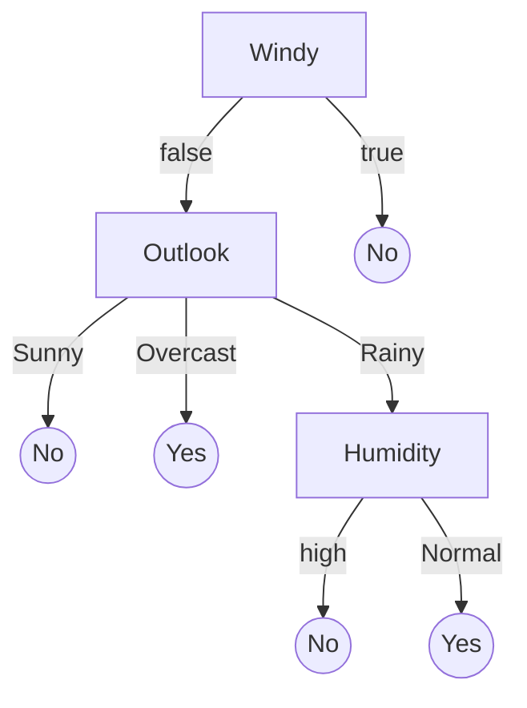
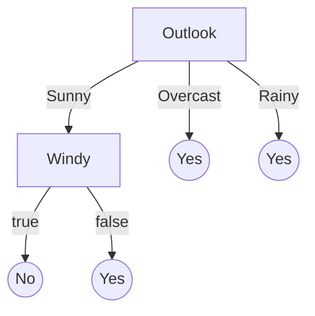

# Learning Goals

* Organize and prioritize the relevant qualities of concern for a given project
* Explain they key ideas behind decision trees and random forests and analyze consequences for various qualities
* Explain the key ideas of deep learning and the reason for high resource needs during learning and inference and the ability for incremental learning
* Plan and execute an evaluation of the qualities of alternative AI components for a given purpose


---
# Recall: ML is a Component in a System in an Environment


----

<!-- split -->

* Transcription model, pipeline to train the model, monitoring infrastructure
* NonML components for data storage, user interface, payment processing, ...
* User requirements and assumptions
* 
* System quality vs model quality
* System requirements vs model requirements
 


---
# Identify Relevant Qualities of AI Components in AI-Enabled Systems

(Requirements Engineering)


----
## AI = DL?


----
## ML Methods Today


----
## ML Model Selection

### How do I decide which ML method to use for my project?

### Criteria: Quality Attributes & Constraints

----
## Quality Attributes

* Meaurable or testable properties of a system that are used to indicate how well it satisfies its goals
* Examples
  * Performance
  * Features
  * Reliability
  * Conformance
  * Durability
  * Serviceability
  * Aesthetics
  * Perceived quality
  * and many others

<!-- references -->

Reference:
Garvin, David A., [What Does Product Quality Really Mean](http://oqrm.org/English/What_does_product_quality_really_means.pdf). Sloan management review 25 (1984).

----
## Accuracy is not Everything

Beyond prediction accuracy, what qualities may be relevant for an AI component?

<!-- discussion -->

Note: Collect qualities on whiteboard


<!-- ---- -->
<!-- ## Different aspects of quality -->


<!-- * **Transcendent** – Experiential. Quality can be recognized but not defined or measured -->
<!-- * **Product-based** – Level of attributes (More of this, less of that) -->
<!-- * **User-based** – Fitness for purpose, quality in use -->
<!-- * **Value-based** – Level of attributes/fitness for purpose at given cost -->
<!-- * **Manufacturing** – Conformance to specification, process excellence -->
<!-- * -->
<!-- * **Quality attributes:** How well the product (system) delivers its -->
<!-- functionality -->
<!-- * **Project attributes:** Time-to-market, development & HR cost... -->
<!-- * **Design attributes:** Type of method used, development cost, operating cost, ... -->


<!-- <\!-- references -\-> -->

<!-- Reference: -->
<!-- Garvin, David A., [What Does Product Quality Really Mean](http://oqrm.org/English/What_does_product_quality_really_means.pdf). Sloan management review 25 (1984). -->


----
## Qualities of Interest?

Scenario: AI component for transcribing audio files 


Note: Which of the previously discussed qualities are relevant?
Which additional qualities may be relevant here?

Cost per transaction; how much does it cost to transcribe? How much do
we make?

----
## Qualities of Interest?

Scenario: Component for detecting lane markings in a vehicle


Note: Which of the previously discussed qualities are relevant?
Which additional qualities may be relevant here?

Realtime use

----
## Qualities of Interest?

Scenario: Component for detecting credit card frauds, as a service for banks


Note: Very high volume of transactions, low cost per transaction, frequent updates

Incrementality

Note: Img src https://pixabay.com/photos/credit-card-payment-transaction-926862/


----
## Examples of Qualities to Consider

* Accuracy
* Correctness guarantees? Probabilistic guarantees (--> symbolic AI)
* How many features?
* How much data needed? Data quality important?
* Incremental training possible?
* Training time, memory need, model size -- depending on training data volume and feature size
* Inference time, energy efficiency, resources needed, scalability
* Interpretability, explainability
* Robustness, reproducibility, stability
* Security, privacy
* Fairness


----
## Interpretability/Explainability

*"Why did the model predict X?"*

**Explaining predictions + Validating Models + Debugging**

```
IF age between 18–20 and sex is male THEN predict arrest
ELSE IF age between 21–23 and 2–3 prior offenses THEN predict arrest
ELSE IF more than three priors THEN predict arrest
ELSE predict no arrest
```

Some models inherently simpler to understand

Some tools may provide post-hoc explanations

Explanations may be more or less truthful

How to measure interpretability?

**more in a later lecture**

----
## Robustness


Small input modifications may change output

Small training data modifications may change predictions

How to measure robustness?

**more in a later lecture**


<!-- references -->
Image source: [OpenAI blog](https://openai.com/blog/adversarial-example-research/)


----
## Fairness

*Does the model perform differently for different populations?*

```
IF age between 18–20 and sex is male THEN predict arrest
ELSE IF age between 21–23 and 2–3 prior offenses THEN predict arrest
ELSE IF more than three priors THEN predict arrest
ELSE predict no arrest
```

Many different notions of fairness

Often caused by bias in training data

Enforce invariants in model or apply corrections outside model

Important consideration during requirements solicitation!

**more in a later lecture**


----
## Review: Measuring Qualities

* Define a metric: Define units of interest 
  - e.g., requests per second, max memory per inference, average training time in seconds for 1 million datasets
* Operationalize metric: Define measurement protocol
  - e.g., conduct experiment: train model with fixed dataset, report median training time across 5 runs, file size, average accuracy with leave-one-out cross-validation after hyperparameter tuning
  - e.g., ask 10 humans to independently label evaluation data, report
    reduction in error from the ML model over human predictions
* Describe all relevant factors: Inputs/experimental units used, configuration decisions and tuning, hardware used, protocol for manual steps

**On terminology:** *metric/measure* refer a method or standard format for measuring something; *operationalization* is identifying and implementing a method to measure some factor


----
## On terminology

* Data scientists seem to speak of *model properties* when referring to accuracy, inference time, fairness, etc
  * ... but they also use this term for whether a *learning technique* can learn non-linear relationships or whether the learning algorithm is monotonic
* Software engineering wording would usually be *quality attributes*
  or *non-functional requirements*


---
# Common ML Methods and their Qualities

----
## Linear Regression: Qualities


* Tasks: Regression
* Model a linear relationship between input & output variables
* __Pros__: ??
* __Cons__: ??

Notes:
* Easy to interpret, low training cost, small model size
* Can't capture non-linear relationships well

----
## Decision Trees
<!-- colstart -->
<!-- small -->
| Outlook | Temperature | Humidity | Windy | Play |
| - | - | - | - | - |
| overcast | hot  |  high   |  false |    yes |
| overcast | hot  |  high   |  false |    no |
| overcast | hot  |  high   |  false |    yes |
| overcast | cool |  normal |  true |       yes |
| overcast | mild |  high   |  true|     yes |
| overcast | hot  |  normal |  false |   yes |
| rainy    | mild |  high   |  false | yes |
| rainy    | cool |  normal |  false | yes |
| rainy    | cool |  normal |  true |  no |
| rainy    | mild |  normal |  false | yes |
| rainy    | mild |  high   |  true |no |
| sunny    | hot  |  high   |  false |  no |
| sunny    | hot  |  high   |  true | no |
| sunny    | mild |  high   |false | no |
| sunny    | cool |  normal |false |   yes |
| sunny    | mild |  normal |  true |   yes |

<!-- col -->
f(Outlook, Temperature, Humidity, Windy) = 

```mermaid
graph TD;
  Outlook -->|Sunny| Windy;
  Outlook -->|Overcast| Yes((Yes));
  Outlook -->|Rainy| Humidity;
  Windy -->|true| No((No));
  Windy -->|false| No2((No));
  Humidity -->|high| No3((No));
  Humidity -->|Normal| Yes2((Yes));
  ```
  
<!-- colend -->


----
## Building Decision Trees
<!-- colstart -->
<!-- small -->
| Outlook | Temperature | Humidity | Windy | Play |
| - | - | - | - | - |
| overcast | hot  |  high   |  false |    yes |
| overcast | hot  |  high   |  false |    no |
| overcast | hot  |  high   |  false |    yes |
| overcast | cool |  normal |  true |       yes |
| overcast | mild |  high   |  true|     yes |
| overcast | hot  |  normal |  false |   yes |
| rainy    | mild |  high   |  false | yes |
| rainy    | cool |  normal |  false | yes |
| rainy    | cool |  normal |  true |  no |
| rainy    | mild |  normal |  false | yes |
| rainy    | mild |  high   |  true |no |
| sunny    | hot  |  high   |  false |  no |
| sunny    | hot  |  high   |  true | no |
| sunny    | mild |  high   |false | no |
| sunny    | cool |  normal |false |   yes |
| sunny    | mild |  normal |  true |   yes |

<!-- col -->

* Identify all possible decisions
* Select the decision that best splits the dataset into distinct
  outcomes (typically via entropy or similar measure)
* Repeatedly further split subsets, until stopping criteria reached

<!-- colend -->

----
## Decision Trees: Qualities
<!-- colstart -->

```mermaid
graph TD;
  Outlook -->|Sunny| Windy;
  Outlook -->|Overcast| Yes((Yes));
  Outlook -->|Rainy| Humidity;
  Windy -->|true| No((No));
  Windy -->|false| No2((No));
  Humidity -->|high| No3((No));
  Humidity -->|Normal| Yes2((Yes));
  ```
  
* Tasks: Classification & regression, labeled data
* __Pros__: ??
* __Cons__: ??

Notes:
* Easy to interpret (up to a size); can capture non-linearity; can do well with
  little data
* High risk of overfitting; possibly very large tree size
* Obvious ones: fairly small model size, low inference cost, 
no obvious incremental training; easy to interpret locally and 
even globally if shallow; easy to understand decision boundaries

<!-- <\!-- smallish -\-> -->
<!-- * Identify all possible decisions -->
<!-- * Select the decision that best splits the dataset into distinct outcomes (typically via entropy or similar measure) -->
<!-- * Repeatedly further split subsets, until stopping criteria reached -->

<!-- <\!-- col -\-> -->

<!-- Qualities of vanilla decision trees? -->

<!-- <\!-- discussion -\-> -->

<!-- <\!-- colend -\-> -->

----
## Random Forests

<!-- colstart -->
```mermaid
graph TD;
  Outlook -->|Sunny| Windy;
  Outlook -->|Overcast| Yes((Yes));
  Outlook -->|Rainy| Humidity;
  Windy -->|true| No((No));
  Windy -->|false| No2((No));
  Humidity -->|high| No3((No));
  Humidity -->|Normal| Yes2((Yes));
```
<!-- col -->

<!-- col -->

<!-- colend -->

* Train multiple trees on subsets of data or subsets of decisions.
* Return average prediction of multiple trees.
* __Pros__: ??
* __Cons__: ??

Note: Increased training time and model size, 
less prone to overfitting, more difficult to interpret


----

# Neural Networks


<!-- .element: class="stretch" -->


Note: Artificial neural networks are inspired by how biological neural networks work ("groups of chemically connected or functionally associated neurons" with synapses forming connections)

From "Texture of the Nervous System of Man and the Vertebrates" by Santiago Ramón y Cajal, via https://en.wikipedia.org/wiki/Neural_circuit#/media/File:Cajal_actx_inter.jpg

----
## Artificial Neural Networks

Simulating biological neural networks of neurons (nodes) and synapses (connections), popularized in 60s and 70s

Basic building blocks: Artificial neurons, with $n$ inputs and one output; output is activated if at least $m$ inputs are active


<!-- .element: class="stretch" -->

(assuming at least two activated inputs needed to activate output)

----
## Threshold Logic Unit / Perceptron

computing weighted sum of inputs + step function

$z = w_1 x_1 + w_2 x_2 + ... + w_n x_n = \mathbf{x}^T \mathbf{w}$

e.g., step: `$\phi$(z) = if (z<0) 0 else 1` 


<!-- .element: class="stretch" -->

----


<!-- .element: class="stretch" -->

<!-- split -->

$o_1 = \phi(b_{1}  +  w_{1,1} x_1 + w_{1,2} x_2)$
$o_2 = \phi(b_{2}  +  w_{2,1} x_1 + w_{2,2} x_2)$
$o_3 = \phi(b_{3}  +  w_{3,1} x_1 + w_{3,2} x_2)$

****
$f_{\mathbf{W},\mathbf{b}}(\mathbf{X})=\phi(\mathbf{W} \cdot \mathbf{X}+\mathbf{b})$

($\mathbf{W}$ and $\mathbf{b}$ are parameters of the model)

----
## Multiple Layers


<!-- .element: class="stretch" -->

Note: Layers are fully connected here, but layers may have different numbers of neurons

----
$f_{\mathbf{W}_h,\mathbf{b}_h,\mathbf{W}_o,\mathbf{b}_o}(\mathbf{X})=\phi( \mathbf{W}_o \cdot \phi(\mathbf{W}_h \cdot \mathbf{X}+\mathbf{b}_h)+\mathbf{b}_o)$


<!-- .element: class="stretch" -->

(matrix multiplications interleaved with step function)

----
## Learning Model Parameters (Backpropagation)

Intuition:
- Initialize all weights with random values
- Compute prediction, remembering all intermediate activations
- If predicted output has an error (measured with a loss function), 
  + Compute how much each connection contributed to the error on output layer
  + Repeat computation on each lower layer
  + Tweak weights a little toward the correct output (gradient descent)
- Continue training until weights stabilize

Works efficiently only for certain $\phi$, typically logistic function: $\phi(z)=1/(1+exp(-z))$ or ReLU: $\phi(z)=max(0,z)$.

----
## Deep Learning

* More layers
* Layers with different numbers of neurons 
* Different kinds of connections
  - Fully connected (feed forward)
  - Not fully connected (eg. convolutional networks)
  - Keeping state (eg. recurrent neural networks)
  - Skipping layers
  - ...

<!-- references -->
See Chapter 10 in Géron, Aurélien. ”[Hands-On Machine Learning with Scikit-Learn, Keras, and TensorFlow](https://cmu.primo.exlibrisgroup.com/permalink/01CMU_INST/6lpsnm/alma991019662775504436)”, 2nd Edition (2019) or any other book on deep learning


Note: Essentially the same with more layers and different kinds of architectures.


----
## Deep Learning


* Tasks: Classification & regression, labeled data
* __Pros__: ??
* __Cons__: ??


Notes:
* High accuracy; can capture a wide range of problems (linear & non-linear)
* Difficult to interpret; high training costs (time & amount of
data required, hyperparameter tuning)


----
## Example Scenario

* MNIST Fashion dataset of 70k 28x28 grayscale pixel images, 10 output classes


<!-- .element: class="stretch" -->

----
## Example Scenario

* MNIST Fashion dataset of 70k 28x28 grayscale pixel images, 10 output classes
* 28x28 = 784 inputs in input layers (each 0..255)
* Example model with 3 layers, 300, 100, and 10 neurons

```python
model = keras.models.Sequential([
  keras.layers.Flatten(input_shape=[28, 28]),
  keras.layers.Dense(300, activation="relu"),
  keras.layers.Dense(100, activation="relu"),
  keras.layers.Dense(10, activation="softmax")
])
```

**How many parameters does this model have?**

----
## Example Scenario

* MNIST Fashion dataset of 70k 28x28 grayscale pixel images, 10 output classes
* 28x28 = 784 inputs in input layers (each 0..255)
* Example model with 3 layers, 300, 100, and 10 neurons

```python
model = keras.models.Sequential([
  keras.layers.Flatten(input_shape=[28, 28]),
  # 784*300+300 = 235500 parameter
  keras.layers.Dense(300, activation="relu"), 
  # 300*100+100 = 30100 parameters
  keras.layers.Dense(100, activation="relu"),
  # 100*10+10 = 1010 parameters
  keras.layers.Dense(10, activation="softmax")
])
```

Total of 266,610 parameters in this small example! (Assuming float types, that's 1 MB)

----
## Network Size

* 50 Layer ResNet network -- classifying 224x224 images into 1000 categories
  * 26 million weights, computes 16 million activations during inference, 168 MB to store weights as floats
* Google in 2012(!): 1TB-1PB of training data, 1 billion to 1 trillion parameters
* OpenAI’s GPT-2 (2019) -- text generation
  - 48 layers, 1.5 billion weights (~12 GB to store weights)
  - released model reduced to 117 million weights
  - trained on 7-8 GPUs for 1 month with 40GB of internet text from 8 million web pages
* OpenAI’s GPT-3 (2020): 96 layers, 175 billion weights, 700 GB in memory, $4.6M in approximate compute cost for training

Notes: https://lambdalabs.com/blog/demystifying-gpt-3/

----
## Cost & Energy Consumption


| Consumption | CO2 (lbs) |
| - | - |
| Air travel, 1 passenger, NY↔SF | 1984 |
| Human life, avg, 1 year | 11,023 |
| American life, avg, 1 year | 36,156 |
| Car, avg incl. fuel, 1 lifetime | 126,000 |

| Training one model (GPU) | CO2 (lbs) |
| - | - |
| NLP pipeline (parsing, SRL) | 39 |
| w/ tuning & experimentation | 78,468 |
| Transformer (big) | 192 |
| w/ neural architecture search | 626,155 |


<!-- references -->
Strubell, Emma, Ananya Ganesh, and Andrew McCallum. "[Energy and Policy Considerations for Deep Learning in NLP](https://arxiv.org/pdf/1906.02243.pdf)." In Proceedings of the 57th Annual Meeting of the Association for Computational Linguistics, pp. 3645-3650. 2019.


----
## Cost & Energy Consumption

<!-- colstart -->

| Model | Hardware | Hours | CO2 | Cloud cost in USD |
| - | - | - | - | - |
| Transformer | P100x8 | 84 | 192 | 289–981 |
| ELMo | P100x3 | 336 | 262 | 433–1472 |
| BERT | V100x64 | 79 | 1438 | 3751–13K |
| NAS | P100x8 | 274,120 | 626,155 | 943K–3.2M |
| GPT-2 | TPUv3x32 | 168 | — | 13K–43K |
| GPT-3 |  |  | — | 4.6M |

<!-- colend -->

<!-- references -->
Strubell, Emma, Ananya Ganesh, and Andrew McCallum. "[Energy and Policy Considerations for Deep Learning in NLP](https://arxiv.org/pdf/1906.02243.pdf)." In Proceedings of the 57th Annual Meeting of the Association for Computational Linguistics, pp. 3645-3650. 2019.

----
## Reusing and Retraining Networks

* Incremental learning process enables continued training, retraining, incremental updates
* A model that captures key abstractions may be good starting point for adjustments (i.e., rather than starting with randomly initialized parameters)
* Reused models may inherit bias from original model
* Lineage important. Model cards promoted for documenting rationale, e.g., [Google Perspective Toxicity Model](https://github.com/conversationai/perspectiveapi/blob/master/2-api/model-cards/English/toxicity.md)


<!-- --- -->
<!-- # Some Common Qualities -->


<!-- ---- -->
<!-- ## Learning cost? Incremental learning? -->

<!-- <\!-- colstart -\-> -->
<!-- ```mermaid -->
<!-- graph TD; -->
<!--   Outlook -\->|Sunny| Windy; -->
<!--   Outlook -\->|Overcast| Yes((Yes)); -->
<!--   Outlook -\->|Rainy| Yes2((Yes)); -->
<!--   Windy -\->|true| No((No)); -->
<!--   Windy -\->|false| No2((Yes)); -->
<!-- ``` -->
<!-- <\!-- col -\-> -->
<!--  -->
<!-- <\!-- colend -\-> -->

<!-- ---- -->
<!-- ## Inference latency and cost? -->

<!-- <\!-- colstart -\-> -->
<!-- ```mermaid -->
<!-- graph TD; -->
<!--   Outlook -\->|Sunny| Windy; -->
<!--   Outlook -\->|Overcast| Yes((Yes)); -->
<!--   Outlook -\->|Rainy| Yes2((Yes)); -->
<!--   Windy -\->|true| No((No)); -->
<!--   Windy -\->|false| No2((Yes)); -->
<!-- ``` -->
<!-- <\!-- col -\-> -->
<!--  -->
<!-- <\!-- colend -\-> -->


<!-- Inference time? Energy costs? Hardware needs? Mobile deployments? Realtime inference? Throughput and scalability? -->


<!-- ---- -->
<!-- ## Robustness of Decision Trees? -->

<!-- ```mermaid -->
<!-- graph TD; -->
<!--   Outlook -\->|Sunny| Windy; -->
<!--   Outlook -\->|Overcast| Yes((Yes)); -->
<!--   Outlook -\->|Rainy| Yes2((Yes)); -->
<!--   Windy -\->|true| No((No)); -->
<!--   Windy -\->|false| No2((Yes)); -->
<!-- ``` -->


<!-- ---- -->
<!-- ## Recall: Qualities of Interest? -->

<!-- <\!-- smallish -\-> -->
<!-- Consider model view, data view, system view, infrastructure view, environment view -->

<!--  -->


<!-- Note: Which of the previously discussed qualities are relevant? -->
<!-- Which additional qualities may be relevant here? -->
<!-- Cost per transaction? -->

<!-- ---- -->
<!-- ## Recall: Qualities of Interest? -->

<!-- <\!-- smallish -\-> -->
<!-- Consider model view, data view, system view, infrastructure view, environment view -->

<!--  -->


<!-- Note: Which of the previously discussed qualities are relevant? -->
<!-- Which additional qualities may be relevant here? -->
<!-- Realtime use -->

<!-- ---- -->
<!-- ## Recall: Qualities of Interest? -->

<!-- <\!-- smallish -\-> -->
<!-- Consider model view, data view, system view, infrastructure view, environment view -->

<!--  -->

<!-- Note: Very high volume of transactions, low cost per transaction, frequent updates -->

<!-- Note: Img src https://pixabay.com/photos/credit-card-payment-transaction-926862/ -->


---
# Constraints and Tradeoffs


----
## ML Model Selection

### How do I decide which ML method to use for my project?

### Criteria: Quality Attributes & Constraints

----
## Constraints

Constraints define the space of attributes for valid design solutions


----
## Types of Constraints

* Problem constraints: Minimum required QAs for an acceptable product
* Project constraints: Deadline, project budget, available skills
* Design constraints: Type of ML task required (regression/classification), kind of available data, limits on computing resources, max. inference cost

**Q. Plausible constraints for credit card fraud detection?**


----
## Trade-offs between ML methods

* If there are multiple ML methods that satisfy the given constraints, which
one do we select?
* Different ML qualities may conflict with each other; this requires
making a __trade-off__ between these qualities
* Among the qualities of interest, which one(s) do we care the most
about?
	* And which ML method is most suitable for achieving those qualities?

----
## Trade-offs: Cost vs Accuracy


_"We evaluated some of the new methods offline but the additional
accuracy gains that we measured did not seem to justify the
engineering effort needed to bring them into a production
environment.”_

<!-- references -->

Amatriain & Basilico. [Netflix Recommendations: Beyond the 5 stars](https://netflixtechblog.com/netflix-recommendations-beyond-the-5-stars-part-1-55838468f429),
Netflix Technology Blog (2012)

----
## Trade-offs: Accuracy vs Interpretability


<!-- references -->

Bloom & Brink. [Overcoming the Barriers to Production-Ready Machine Learning
Workflows](https://conferences.oreilly.com/strata/strata2014/public/schedule/detail/32314), Presentation at O'Reilly Strata Conference (2014).

----
## Breakout: Qualities & ML Methods

<!-- colstart -->

Cancer Diagnosis


<!-- col -->

Lane Detection


<!-- colend -->

* Post answer to `#lecture` in Slack using template:
  * Constraints: ??
  * Qualities of interests: ??
  * ML method(s) to use: ??

----
## Multi-Objective Optimization 


<!-- .element: class="stretch" -->

* Determine optimal solutions given multiple, possibly
  **conflicting** objectives
* **Dominated** solution: A solution that is inferior to
  others in every way 
* **Pareto frontier**: A set of non-dominated solutions 

Image CC BY-SA 3.0 by [Nojhan](https://en.wikipedia.org/wiki/Multi-objective_optimization#/media/File:Front_pareto.svg)

----
## Example: Credit Scoring


<!-- .element: class="stretch" -->

* For problems with a linear relationship between input & output variables:
  * Linear regression: Superior in terms of accuracy, interpretability, cost 
  * Other methods are dominated (inferior) solutions

---
# Finding the Right Qualities for your Product

----
## Requirements Engineering Process

* Interview stakeholders (customers, operators, developers, business experts)
  - Understand the problem, the kind of prediction needed (e.g. classification)
  - Understand the scope: target domain, frequency of change, ...
* Broadly understand quality needs from different views
  - Model view: direct expectation on the model(s)
  - Data view: availability, quantity, and quality of data
  - System view: understand system goals and role of ML model and interactions with environment
  - Infrastructure view: training cost, reproducibility needs, serving infrastructure needs, monitoring needs, ...
  - Environment/user view: external expectations on the system by users and society, e.g. fairness, safety
* Collect and document needs, resolve conflicts, discuss and prioritize


<!-- references -->
Siebert, Julien, Lisa Joeckel, Jens Heidrich, Koji Nakamichi, Kyoko Ohashi, Isao Namba, Rieko Yamamoto, and Mikio Aoyama. "[Towards Guidelines for Assessing Qualities of Machine Learning Systems](https://arxiv.org/pdf/2008.11007)." In International Conference on the Quality of Information and Communications Technology, pp. 17-31. Springer, Cham, 2020.


----
## Requirements Engineering Process

* Set minimum accuracy expectations ("functional requirement")
* Identify runtime needs (how many predictions, latency requirements, cost budget, mobile vs cloud deployment)
* Identify evolution needs (update and retrain frequency, ...)
* Identify explainability needs
* Identify protected characteristics and possible fairness concerns
* Identify security and privacy requirements (ethical and legal), e.g., possible use of data
* Understand data availability and need (quality, quantity, diversity, formats, provenance)
* Involve data scientists and legal experts
* **Map system goals to AI components**

<!-- references -->

Further reading: Vogelsang, Andreas, and Markus Borg. "[Requirements Engineering for Machine Learning: Perspectives from Data Scientists](https://arxiv.org/pdf/1908.04674.pdf)." In Proc. of the 6th International Workshop on Artificial Intelligence for Requirements Engineering (AIRE), 2019.


---
# Summary

* Quality is multifaceted
* Requirements engineering to solicit important qualities and constraints 
* Many qualities of interest, define metrics and operationalize
* Constraints and tradeoff analysis for selecting ML techniques in production ML settings


