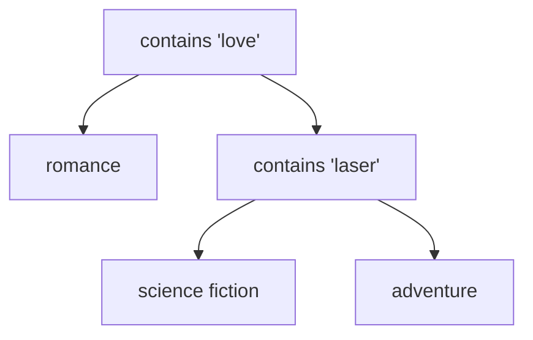
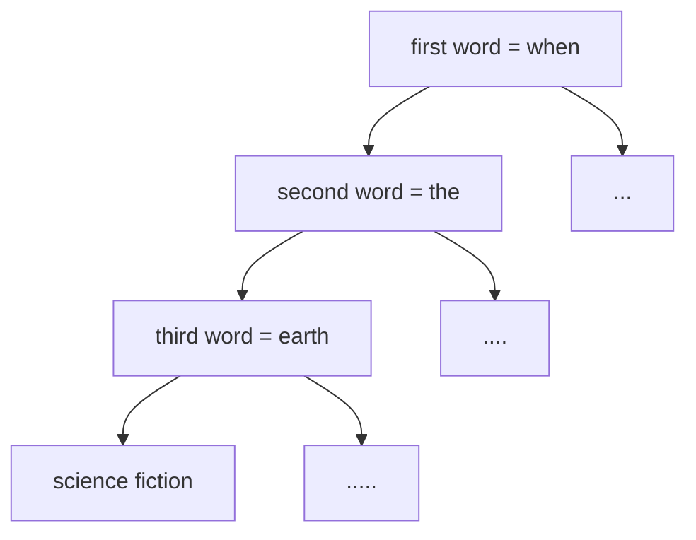

# Model Quality

Christian Kaestner

<!-- references -->

Required reading: 
* Hulten, Geoff. "[Building Intelligent Systems: A Guide to Machine Learning Engineering.](https://www.buildingintelligentsystems.com/)" Apress, 2018, Chapters 15 (Intelligent Telemetry) and 19 (Evaluating Intelligence).

---

# Learning Goals

* Identify and describe the goals of an AI component and define outcome quality measures
* Explain the limits of evaluating model quality on a static dataset and design telemetry for assessment in production
* Assess model quality with suitable measures and compare quality of multiple models
* Design a test suite for assuring model quality
* Develop automated solutions to evaluate and monitor model quality

---
## Preliminaries: Model Testing

*model:* $\overline{X} \rightarrow Y$

*test:* sets of $(\overline{X}, Y)$ pairs indicating desired outcomes for select inputs

For our discussion: any form of model, including machine learning models, symbolic AI components, hardcoded heuristics, composed models, ...

----
## Preliminaries: ML Algorithm Quality vs Model Quality vs System Quality

We focus on the quality of the produced model, not the algorithm used to learn the model

i.e. assuming *Decision Tree Algorithm* and feature extraction are correctly implemented (according to specification), is the model learned from data any good?


The model is just one component of the entire system.


---
# Revisit: Goals and Measurement

----
## System Goals

* System goals are supported by AI components, e.g.,
    - maximizing sales
    - minimizing loss
    - maximizing community growth
    - retaining customers
    - maximizing engagement time
* A better model will support system goals better
    - more accurate
    - faster answers
    - fewer bad mistakes
    - more explainable
    - easier to evolve

----
## Case Study 1: Cancer Detection


Notes: Application to be used in hospitals to screen for cancer, both as routine preventative measure and in cases of specific suspicions. Supposed to work together with physicians, not replace.

----

<!-- ## Case Study 1: Inventory Management


Notes: For a record store, a system supports owners in deciding which records to stock and how many copies. The store obviously wants to offer records that customers want, including rare copies, but has limited space and capital for large collections.

Picture: https://pixabay.com/photos/record-store-albums-records-vinyls-925553/
 ----
 -->
## Case Study 2: Generating Game Commentary and Summary

 

Notes: System gets a video feed of the game from multiple cameras and produces a live commentary (e.g., identifying players and game moves, explaining tactics, providing statistics, mirroring human commentators) and a summary of the game (e.g., editing key game sequences, summarizing important game events). Will be offered as a service to local teams, youth organizations, and local news papers to produce high quality content for teams without major media attention.

Picture: https://pixabay.com/photos/soccer-competition-game-women-673488/
----
## System Goals and Model Quality?

What are the overall goals of the system?

Sketch a system architecture with relevant AI components. How do those components support the system goals?

What are quality goals for the models?

<!-- colstart -->

<!-- col -->

<!-- colend -->

----
## Comparing Models

Compare two models (same or different implementation/learning technology) for the same task:

* Which one supports the system goals better?
* Which one makes fewer important mistakes?
* Which one is easier to operate?
* Which one is better overall?
* Is either one good enough?

---
# Common Model Quality Measures for Classification Problems

----
## Confusion/Error Matrix

| | **Actually A** | **Actually B** | **Actually C** |
| :--- | --- | --- | --- |
|**AI predicts A** | **10** | 6 | 2 |
|**AI predicts B** | 3 | **24**  | 10 |
|**AI predicts C** | 5 | 22 | **82** |

Accuracy = correct predictions (diagonal) out of all predictions

Example's accuracy 
        = $\frac{10+24+82}{10+6+2+3+24+10+5+22+82} = .707$

----
## Types of Mistakes

Two-class problem of predicting event A:


| | **Actually A** | **Actually not A** |
| --- | --- | --- |
|**AI predicts A** | True Positive (TP) | False Positive (FP) |
|**AI predicts not A** | False Negative (FN) | True Negative (TN) |

True positives and true negatives: correct prediction

False negatives: wrong prediction, miss, Type II error

False positives: wrong prediction, false alarm, Type I error

 

----
## Multi-Class problems vs Two-Class Problem

| | **Actually A** | **Actually B** | **Actually C** |
| :--- | --- | --- | --- |
|**AI predicts A** | **10** | 6 | 2 |
|**AI predicts B** | 3 | **24**  | 10 |
|**AI predicts C** | 5 | 22 | **82** |


----
## Multi-Class problems vs Two-Class Problem

| | **Actually A** | **Actually B** | **Actually C** |
| :--- | --- | --- | --- |
|**AI predicts A** | **10** | 6 | 2 |
|**AI predicts B** | 3 | **24**  | 10 |
|**AI predicts C** | 5 | 22 | **82** |

****

<!-- colstart -->

| | **Act. A** | **Act. not A** |
| --- | --- | --- |
|**AI predicts A** | 10 | 8 |
|**AI predicts not A** | 8 | 138 |

<!-- col -->

| | **Act. B** | **Act. not B** |
| --- | --- | --- |
|**AI predicts B** | 24 | 13 |
|**AI predicts not B** | 28 | 99 |

<!-- colend -->

Notes: Individual false positive/negative classifications can be derived
by focusing on a single value in a confusion matrix. False positives/recall/etc are always considered with regard to a single specific outcome.


----
## Types of Mistakes in Identifying Players/Cancer?

<!-- colstart -->

<!-- col -->

<!-- colend -->

----
## Measures

Measuring success of correct classifications (or missing results):
* Recall = TP/(TP+FN) 
    * aka true positive rate, hit rate, sensitivity; *higher is better*
* False negative rate = FN/(TP+FN) = 1 - recall 
    * aka miss rate; *lower is better*

*** 

Measuring rate of false classifications (or noise):
* Precision = TP/(TP+FP)
    * aka positive predictive value; *higher is better*
* False positive rate = FP/(FP+TN) 
    * aka fall-out; *lower is better*
<!-- * False discovery rate = FP/(FP+TP) = 1 - precision -->

***

Combined measure (harmonic mean):

F1 score = $2 \frac{recall*precision}{recall+precision}$

----

[](https://en.wikipedia.org/wiki/Precision_and_recall#/media/File:Precisionrecall.svg)


(CC BY-SA 4.0 by [Walber](https://en.wikipedia.org/wiki/Precision_and_recall#/media/File:Precisionrecall.svg))

----
## False positives and false negatives equally bad? 

Consider: 
* Identifying soccer players
* Suggesting products to buy on e-commerce site
* Identifying human trafficking at the border
* Predicting high demand for ride sharing services
* Recognizing cancer 

No answer vs wrong answer?

----
## Extreme Classifiers

* Identifies every instance as negative (e.g., no cancer):
    - 0% recall (finds none of the cancer cases)
    - 100% false negative rate (misses all actual cancer cases)
    - undefined precision (no false predictions, but no predictions at all)
    - 0% false positive rate (never reports false cancer warnings)
* Identifies every instance as positive (e.g., has cancer):
    - 100% recall (finds all instances of cancer)
    - 0% false negative rate (does not miss any cancer cases)
    - low precision (also reports cancer for all noncancer cases)
    - 100% false positive rate (all noncancer cases reported as warnings)
 
----
## Consider the Baseline Probability

Predicting unlikely events -- 1 in 2000 has cancer ([stats](https://gis.cdc.gov/Cancer/USCS/DataViz.html))

<!-- colstart -->

**Random predictor**

| | **Cancer** | **No c.** |
| --- | --- | --- |
|**Cancer pred.** | 3 | 4998 |
|**No cancer pred.** | 2 | 4997 |

.5 accuracy, .6 recall, 0.001 precision

<!-- col -->

**Never cancer predictor**


| | **Cancer** | **No c.** |
| --- | --- | --- |
|**Cancer pred.** | 0 | 0 |
|**No cancer pred.** | 5 | 9995 |

.999 accuracy, 0 recall, .999 precision


<!-- colend -->

See also [Bayesian statistics](https://en.wikipedia.org/wiki/Bayesian_statistics)

----
## Other Measures

Many other quality measures exist for various purposes:

* Classifications with customizable thresholds (e.g., area under curve)
* Numeric predictions (e.g., mean squared error, mean absolute error, mean relative error)
* Probabilities (e.g., log loss)
* Rankings (e.g., top-k)
* Improvement over random (e.g., Cohen's kappa, Gini coefficient)
* ...

----
## Area Under the Curve

Turning numeric prediction into classification with threshold ("operating point")


Notes: The plot shows the recall precision/tradeoff at different thresholds (the thresholds are not shown explicitly). Curves closer to the top-right corner are better considering all possible thresholds. Typically, the area under the curve is measured to have a single number for comparison.

----
## Receiver operating characteristic (ROC) curves


(CC BY-SA 3.0 by [BOR](https://en.wikipedia.org/wiki/Receiver_operating_characteristic#/media/File:Roccurves.png))

Notes: Same concept, but plotting TPR (recall) against FPR rather than precision. Graphs closer to the top-left corner are better. Again, the area under the (ROC) curve can be measured to get a single number for comparison.

----
## Distribution of Mistakes

> some random mistakes vs rare but biased mistakes?

* A system to detect when somebody is at the door that never works for people under 5ft (1.52m)
* A spam filter that deletes alerts from banks

Case Study: http://pic.twitter.com/ZJ1Je1C4NW

**Consider separate evaluations for important subpopulations; monitor mistakes in production**


---

# Measuring Generalization

Does the model represent generalizable intelligence?

----

## The Legend of the Failed Tank Detector

<!-- colstart -->

<!-- col -->

<!-- colend -->

Notes:
Widely shared story, authenticity not clear:
AI research team tried to train image recognition to identify tanks hidden in forests, trained on images of tanks in forests and images of same or similar forests without tanks. The model could clearly separate the learned pictures, but would perform poorly on other pictures.

Turns out the pictures with tanks were taken on a sunny day whereas the other pictures were taken on a cloudy day. The model picked up on the brightness of the picture rather than the presence of a tank, which worked great for the training set, but did not generalize.

Pictures: https://pixabay.com/photos/lost-places-panzer-wreck-metal-3907364/, https://pixabay.com/photos/forest-dark-woods-trail-path-1031022/

----
## Generalization

Ideally a models represents real concepts of interest, an actual understanding of the problem (concepts of a tank, cancer, or consumer preference).

ML models are trained on data, symbolic AI models are constructed with select inputs. 

**Do the resulting models generalize to unseen problems?**

----
## Overfitting/Underfitting

**Overfitting:** Model learned exactly for the input data, but does not generalize to unseen data (e.g., exact memorization)

**Underfitting:** Model makes very general observations but poorly fits to data (e.g., brightness in picture)

Typically adjust degrees of freedom during model learning to balance between overfitting and underfitting: can better learn the training data with more freedom (more complex models); but with too much freedom, will memorize details of the training data rather than generalizing


(CC SA 4.0 by [Ghiles](https://en.wikipedia.org/wiki/File:Overfitted_Data.png))

----
## Underfitting example

<!-- colstart -->

|Text|Genre|
|-|-|
|When the earth stood ... |Science fiction|
|Two households, both alike...|Romance|
|To Sherlock Holmes she...|Adventure|

<!-- col -->


<!-- colend -->
----
## Overfitting example

<!-- colstart -->

|Text|Genre|
|-|-|
|When the earth stood ... |Science fiction|
|Two households, both alike...|Romance|
|To Sherlock Holmes she...|Adventure|

<!-- col -->



<!-- colend -->


----

## Training vs. Evaluation Set

* Generalization must be evaluated on unseen data
* Strictly separate data used from learning from evaluation data
    - Fixed dataset: 80:20 split is common
    - In production: use past data for learning, current data for evaluation
* Ensure absence of bias in training/evaluation split


(CC 3.0 by [Skbkekas](https://commons.wikimedia.org/wiki/File:Traintest.svg))

----

## Detecting Overfitting

Compare accuracy on training (blue) and evaluation set (red) at different degrees of freedom:


<!-- .element: class="stretch" -->

(CC SA 3.0 by [Dake](https://commons.wikimedia.org/wiki/File:Overfitting.png))


Notes: Overfitting is recognizable when performance of the evaluation set decreases.

----
## Crossvalidation

* Repeated partitioning of a dataset in training and testing set
    - leave one out: single data point for evaluation
    - k-fold: one of k random partitions used for evaluation
    - Monte Carlo: random x% used for evaluation
* In each iteration, train and evaluate model
* Report average evaluation result

**Discuss benefits and problems**

Notes:
* Computational effort
* More of the data can be used for learning
* Still requires representative data
* When approach is tuned on cross-validation, again danger of overfitting (no neutral evaluation on unseen data)

----
## Dependent Data Challenges

Are all data points independent?

Are dependent data points split across training and evaluation set?

**Discussion: Examples**

----
## Partitioning with Dependent Data

* Partition data by time
* Partition data by groups (identity)

Tradeoffs?
----
## How much test data?

* Problem dependent
* Statistics can give confidence interval for results
    - e.g. [Sample Size Calculator](https://www.surveysystem.com/sscalc.htm): 384 samples needed for ±5% confidence interval (95% conf. level; 1M population)
* Experience and heuristics. Example: Hulten's heuristics for stable problems: 
    - 10s is too small
    - 100s sanity check
    - 1000s usually good
    - 10000s probably overkill
    - Reserve 1000s recent data points for evaluation (or 10%, whichever is more)
    - Reserve 100s for important subpopulations


---

# Automating Model Evaluation

----
## Automated Testing for Code

```java
@Test
public void testSanityTest(){
    //setup
    Graph g1 = new AdjacencyListGraph(10);
    Vertex s1 = new Vertex("A");
    Vertex s2 = new Vertex("B");
    //check expected behavior
    assertEquals(true, g1.addVertex(s1));
    assertEquals(true, g1.addVertex(s2));
    assertEquals(true, g1.addEdge(s1, s2));
    assertEquals(s2, g1.getNeighbors(s1)[0]);
}
```
----
## Automated Testing for Code


----
## Testing Adequacy for Code


----
## Test Automation for Model Quality?

<!-- discussion -->
----
## Test Automation for Model Quality

* Testing script
    * Existing model: Implementation to automatically evaluate model on labeled training set; multiple separate evaluation sets possible, e.g., for critical subcommunities or regressions
    * Training model: Automatically train and evaluate model, possibly using cross-validation; many ML libraries provide built-in support
    * Report accuracy, recall, etc. in console output or log files
    * May deploy learning and evaluation tasks to cloud services
    * Optionally: Fail test below quality bound (e.g., accuracy <.9; accuracy < accuracy of last model)
* Version control test data, model and test scripts, ideally also learning data and learning code (feature extraction, modeling, ...)
* Continuous integration tool can trigger test script and parse output, plot for comparisons (e.g., similar to performance tests)
* Optionally: Continuous deployment to production server

----
## Dashboards for Model Evaluation Results

[](https://eng.uber.com/michelangelo/)

<!-- references  -->

Jeremy Hermann and Mike Del Balso. [Meet Michelangelo: Uber’s Machine Learning Platform](https://eng.uber.com/michelangelo/). Blog, 2017

----

## Specialized CI Systems


<!-- references -->

Renggli et. al, [Continuous Integration of Machine Learning Models with ease.ml/ci: Towards a Rigorous Yet Practical Treatment](http://www.sysml.cc/doc/2019/162.pdf), SysML 2019

----
## Dashboards for Comparing Models


<!-- references -->

Matei Zaharia. [Introducing MLflow: an Open Source Machine Learning Platform](https://databricks.com/blog/2018/06/05/introducing-mlflow-an-open-source-machine-learning-platform.html), 2018


---
# Test Adequacy and Confidence

Have we tested enough? Are we confident in correctness?

----
## Excursion: Testing Strategies in Software

* Blackbox (specification-based):
    - specification coverage, boundary condition analysis, partitioning
    - combinatorial testing
    - random testing, fuzzing
* Whitebox (structural):
    - line, branch coverage
    - decision, data-flow coverage
    - automated test generation
* Adequacy:
    - various forms of coverage
    - mutation testing

**Test coverage for models?**

----
## Test Coverage for AI Components

**Open research problem**

No specifications -> No boundary conditions, no test classes

Various techniques to identify samples near decision boundaries

Coverage criteria for neural networks

Different test sets for different populations

----
## Formal guarantees?

In code: Formal verification that implementation meets specifications

For models: ??


<!-- discussion -->

Notes: Formal guarantees can be given for certain properties of certain models, especially symbolic AI and probabilistic models, but for most practical problems the lack of a specification limits formal guarantees.


---
# Model Assessment in Production

Ultimate held-out evaluation data: Unseen real user data

----
## Identify Feedback Mechanism in Production 

* Live observation in the running system
* Potentially on subpopulation (AB testing)
* Telemetry Challenges:
    - Gather feedback without being intrusive (i.e., labeling outcomes), harming user experience
    - Manage amount of data
    - Isolating feedback for specific AI component + version

----
## Discuss how to collect feedback

* Was there actually cancer in a scan?
* Did we identify the right soccer player?
* Did we correctly identify tanks?
* Was a Youtube recommendation good?
* Was the ranking of search results good?
* Was the weather prediction good?
* Was the translation correct?
* Did the self-driving car break at the right moment?

<!-- discussion -->

Notes: More:
* SmartHome: Does it automatically turn of the lights/lock the doors/close the window at the right time?
* Profanity filter: Does it block the right blog comments?
* News website: Does it pick the headline alternative that attracts a user’s attention most?
* Autonomous vehicles: Does it detect pedestrians in the street?


----

<!-- split -->


Notes:
Expect only sparse feedback and expect negative feedback over-proportionally

----


Notes: Can just wait 7 days to see actual outcome for all predictions
----


Notes: Clever UI design allows users to edit transcripts. UI already highlights low-confidence words, can 

----
## Manually Label Production Samples

Similar to labeling learning and testing data, have human annotators


----
## Measuring Model Quality with Telemetry

* Telemetry can provide insights for correctness
    - sometimes very accurate labels for real unseen data
    - sometimes only mistakes
    - sometimes delayed
    - often just samples
    - often just weak proxies for correctness
* Often sufficient to approximate precision/recall or other measures
* Mismatch to (static) evaluation set may indicate stale or unrepresentative data
* Trend analysis can provide insights even for inaccurate proxy measures

----
## Monitoring Model Quality in Production

* Watch for jumps after releases
    - roll back after negative jump
* Watch for slow degradation
    - Stale models, data drift, feedback loops, adversaries
* Debug common or important problems
    - Mistakes uniform across populations?
    - Challenging problems -> refine training, add regression tests

----
## Engineering Challenges for Telemetry


----
## Engineering Challenges for Telemetry
* Data volume and operating cost
    - e.g., record "all AR live translations"?
    - reduce data through sampling
    - reduce data through summarization (e.g., extracted features rather than raw data; extraction client vs server side)
* Adaptive targeting
* Biased sampling
* Rare events
* Privacy

----
## Discussion: Design Evaluation in Production

<!-- colstart -->

<!-- col -->

<!-- colend -->


---
# Comparisons against Heuristics
----
## Interpreting Model Quality Measures

* Accuracy is hard to interpret in isolation
    - acceptable values may depend on difficulty of problem
    - biased by baseline probability 
* Simpler approaches may achieve similar accuracy
    - may make different mistakes
    - complexity and operating cost worth the marginal improvement?

----
## Compare model quality against simpler models

Sanity check -- what models to try for cancer detection?


----
## Compare model quality against simpler models

* Random models (e.g., .5 probability cancer)
* Naive models (e.g., never cancer)
* Simple hardcoded heuristics (e.g., 6 connected pixels 50% darker than surrounding pixels)
* Simpler modeling technique (e.g., decision tree instead of DNN)
* State of the art technique (+ hyperparameter optimization)

*The new model should clearly outperform these to show value.*

---
# Debugging

<!-- discussion -->

---
# Summary

* Model evaluation with testing data
    - Various measures for model quality (accuracy, recall, AUC, ...)
    - Generalization to unseen data (overfitting)
    - Not all mistakes are equal
    - Evaluating test adequacy and confidence still challenging
    - Compare against baseline heuristics
* Evaluation on static data vs evaluation in production
    - Design telemetry system
    - Telemetry challenges: proxy measures, data volume, ...
* Automate model evaluation just as code testing
    - Scripting + continuous integration + dashboards
