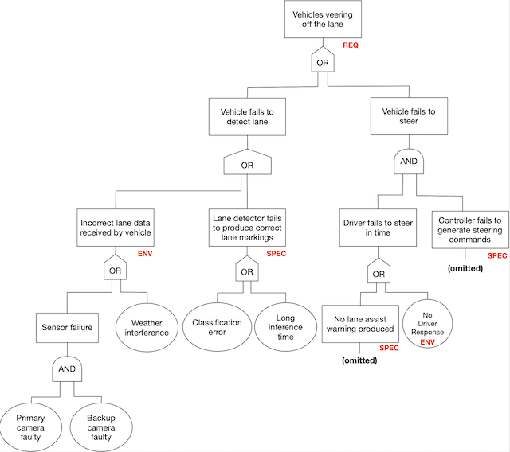

## Learning goals:

* Analyze how mistake in an AI component can influence the behavior of a system
* Analyze system requirements at the boundary between the machine and world
* Evaluate the risks of mistakes from AI components using the fault tree
  analysis (FTA)

---
# Mistakes in AI-Based Systems

----
## Cancer Detection

<!-- .element: class="stretch" -->

----
## Autonomous Vehicles

----
> Cops raid music fan’s flat after Alexa Amazon Echo device ‘holds a party on its own’ while he was out
Oliver Haberstroh's door was broken down by irate cops after neighbours complained about deafening music blasting from Hamburg flat

https://www.thesun.co.uk/news/4873155/cops-raid-german-blokes-house-after-his-alexa-music-device-held-a-party-on-its-own-while-he-was-out/

> News broadcast triggers Amazon Alexa devices to purchase dollhouses.

https://www.snopes.com/fact-check/alexa-orders-dollhouse-and-cookies/

----

----

----
## Your Examples?

<!-- discussion -->

---
# Requirements and Risks

----
## Software Requirements

* Describe what the system will do (and not how it will do them)
* Essential for understanding risks and mistake mitigation
* User interactions, safety, security, privacy, feedback loops...

<!-- .element: class="stretch" -->

----
## Importance of Requirements

_"The hardest single part of building a software system is deciding
precisely what to build...No other part of the work so cripples the resulting system if done wrong."_
-- Fred Brooks, Mythical Man Month (1975)

----
## Importance of Requirements

Only 3% of fatal software accidents due to coding errors; rest due to
**poor requirements** or usability issues (National Research Council, 2007)

----
## Machine vs World

* No software lives in vacuum; every system is deployed as part of the world
* A requirement describes a desired state of the world (i.e., environment)
* Machine (software) is _created_ to manipulate the environment into
  this state

----
## Machine vs World

* Q. What is the environment for the following systems?
  * Self-driving car: ??
  * Smart home thermostats: ?? 
  * Movie recommender: ??

----
## Requirement vs Specification

* Requirement (REQ): What your product provides, as desired effects on the
  environment (i.e., system-level goals)
* Assumptions (ENV): What’s assumed about the behavior/properties of
  the environment (based on domain knowledge)
* Specification (SPEC): What machine must do in order to satisfy REQ **in conjunction** with ENV

----
## Shared Phenomena

* Shared phenomena: Interface between the world & machine (actions,
  events, dataflow, etc.,)
* Requirements (REQ) are expressed only in terms of world phenomena 
* Assumptions (ENV) are expressed in terms of world & shared phenomena
* Specifications (SPEC) are expressed in terms of machine & shared phenomena

----
## Example: Lane Assist

* Requirement (REQ): The vehicle must be prevented from veering off the lane.
* What are the entities in the environment?
* What about components in the machine?

----
## Example: Lane Assist

* Requirement (REQ): The vehicle must be prevented from veering off the lane.
* Assumptions (ENV): ?
* Specification (SPEC): ?

----
## Example: Lane Assist

* REQ: The vehicle must be prevented from veering off the lane.
* ENV: Sensors are providing accurate information about the lane;
  driver responses when given warning; steering wheel is functional
* SPEC: Lane detection accurately identifies the lane markings; the
  controller generates correct steering commands to keep the vehicle
  within lane

----
## What could go wrong?

* Missing/incorrect environmental assumptions (ENV)
<!-- .element: class="fragment" -->
* Wrong/violated specification (SPEC)
<!-- .element: class="fragment" -->
* Inconsistency in assumptions & spec (ENV ∧ SPEC = False)
<!-- .element: class="fragment" -->
* Inconsistency in requirements (REQ = False)
<!-- .element: class="fragment" -->

----
## Lufthansa 2904 Runaway Crash

* Reverse thrust (RT): Decelerates plane during landing
<!-- .element: class="fragment" -->
* What was required (REQ): RT enabled if and only if plane on the
ground
<!-- .element: class="fragment" -->
* What was implemented (SPEC): RT enabled if and only if wheel turning
<!-- .element: class="fragment" -->
* But runway wet due to rain
<!-- .element: class="fragment" -->
  * Wheel fails to turn, even though the plane is on the ground
  * Pilot attempts to enable RT; overridden by the software
  * Plane goes off the runway!

----
## Implications on Software Development

* Software/AI alone cannot establish system requirements
<!-- .element: class="fragment" -->
  * They are just one part of the system!
* Environmental assumptions are just as critical
<!-- .element: class="fragment" -->
  * But typically you can't modify these
  * Must design SPEC while treating ENV as given
* If you ignore/misunderstand these, your system may fail to satisfy
  its requirements!
<!-- .element: class="fragment" -->

----
## Recall: Lack of Specifications for AI components

* In addition to world vs machine challenges
* We do not have clear specifications for AI components (SPEC)
    - Goals, average accuracy
    - At best probabilistic specifications in some symbolic AI techniques
* Viewpoint: Machine learning techniques mine specifications from
data, but not usually understandable
* But still important to articulate the responsibllities of AI
  components (SPEC) in establishing the system-level goals (REQ)

----
## Example: Lane Assist

* REQ: The vehicle must be prevented from veering off the lane.
* ENV: Sensors are providing accurate information about the lane;
  driver responses when given warning; steering wheel is functional
* SPEC: Lane detection accurately identifies the lane markings; the
  controller generates correct steering commands to keep the vehicle
  within lane

----
## What could go wrong in lane assist?

* Missing/incorrect environmental assumptions (ENV)?
* Wrong/violated specification (SPEC)?
* Inconsistency in assumptions & spec (ENV ∧ SPEC = False)?
* Inconsistency in requirements (REQ = False)?

----
## Deriving SPEC from REQ

1. Identify environmental entities and machine components
2. State a desired requirement (REQ) over the environment
3. Identify the interface between the environment & machines
4. Identify the environmental assumptions (ENV)
5. Develop software specifications
(SPEC) that are sufficient to establish REQ
6. Check whether ENV ∧ SPEC ⊧ REQ
7. If NO, strengthen SPEC & repeat Step 6

**Can't be automated! Domain knowledge is critical for coming up with
  REQ, ENV, and SPEC!**

---
# Risk Analysis

----
## What is Risk Analysis?

*  What can possibly go wrong in my system, and what are potential 
impacts on system requirements?
<!-- .element: class="fragment" -->
* Risk = Likelihood * Impact
<!-- .element: class="fragment" -->
* A number of methods:
<!-- .element: class="fragment" -->
  * Failure mode & effects analysis (FMEA)
  * Hazard analysis
  * Why-because analysis
  * Fault tree analysis (FTA) <= Today's focus!
  * ...

----
## Risks?

* Lane assist system
* Credit rating
* Amazon product recommendation
* Audio transcription service
* Cancer detection
* Predictive policing

**Discuss potential risks, including impact and likelyhood**

<!-- discussion -->

----
## Fault Tree Analysis (FTA)

* Fault tree: A top-down diagram that displays the relationships
between a system failure (i.e., requirement violation) and its potential causes.  
<!-- .element: class="fragment" -->
  * Identify sequences of events that result in a failure
  * Prioritize the contributors leading to the failure
  * Inform decisions about how to (re-)design the system
  * Investigate an accident & identify the root cause 
* Often used for safety & reliability, but can also be used for
other types of requirement (e.g., poor performance, security attacks...)
<!-- .element: class="fragment" -->

----
## Fault Tree Analysis & AI

* Increaseingly used in automotive, aeronautics, industrial control systems, etc.,
* AI is just one part of the system
<!-- .element: class="fragment" -->
* AI will EVENTUALLY make mistakes
<!-- .element: class="fragment" -->
  * Ouput wrong predictions/values
  * Fail to adapt to changing environment
  * Confuse users, etc.,
* How do mistakes made by AI contribute to system failures? How do we
  ensure their mistakes do not result in a catastrophe?
<!-- .element: class="fragment" -->

----
## Fault Trees:: Basic Building Blocks

* Event: An occurrence of a fault or an undesirable action
<!-- .element: class="fragment" -->
  * (Intermediate) Event: Explained in terms of other events
  * Basic Event: No further development or breakdown; leafs of the tree
* Gate: Logical relationship between an event & its immedicate subevents
<!-- .element: class="fragment" -->
  * AND: All of the sub-events must take place
  * OR: Any one of the sub-events may result in the parent event

<!-- references -->
Figure from _Fault Tree Analysis and Reliability Block Diagram_
(2016), Jaroslav Menčík. 

----
## Fault Tree Example

* Every tree begins with a TOP event (typically a violation of a requirement)
<!-- .element: class="fragment" -->
* Every branch of the tree must terminate with a basic event
<!-- .element: class="fragment" -->

<!-- references -->
Figure from _Fault Tree Analysis and Reliability Block Diagram_
(2016), Jaroslav Menčík. 

----
## Analysis

* What can we do with fault trees?
  * Qualitative analysis: Determine potential root causes of a
    failiure through _minimal cut set analysis_
  * Quantitative analysis: Compute the probablity of a failure

----
## Minimal Cut Set Analysis

* Cut set: A set of basic events whose simultaneous occurrence is
  sufficient to guarantee that the TOP event occurs.
* _Minimal_ cut set: A cut set from which a smaller cut set can be
obtained by removing a basic event.
* Q. What are minimal cut sets in the above tree?

----
## Failure Probability Analysis

* To compute the probability of the top event:
<!-- .element: class="fragment" -->
  * Assign probabilities to basic events (based on domain knowledge)
  * Apply probability theory to compute prob. of intermediate events
	through AND & OR gates
  * (Alternatively, as sum of prob. of minimal cut sets) 
* In this class, we won't ask you to do this.
<!-- .element: class="fragment" -->
  * Why is this especially challenging for software? 

----
## FTA Process

1. Specify the system structure
<!-- .element: class="fragment" -->
   * Environment entities & machine components
   * Assumptions (ENV) & specifications (SPEC)
2. Identify the top event as a violation of REQ
<!-- .element: class="fragment" -->
3. Construct the fault tree
<!-- .element: class="fragment" -->
  * Intermediate events can be derived from violation of SPEC/ENV
4. Analyze the tree
<!-- .element: class="fragment" -->
  * Identify all possible minimal cut sets
5. Consider design modifications to eliminate certain cut sets
<!-- .element: class="fragment" -->
6. Repeat
<!-- .element: class="fragment" -->

----
## Example: FTA for Lane Assist

* REQ: The vehicle must be prevented from veering off the lane.
* ENV: Sensors are providing accurate information about the lane;
  driver responses when given warning; steering wheel is functional
* SPEC: Lane detection accurately identifies the lane markings; the
  controller generates correct steering commands to keep the vehicle
  within lane

----
## Example: FTA for Lane Assist

---
# Summary

* Accept that ML components will make mistakes
* Understand world-machine interactions
  * Machine vs World; specification vs requirements
  * Role of environmental assumptions in establishing requirements
* Use risk analysis to identify and mitigate potential problems 
