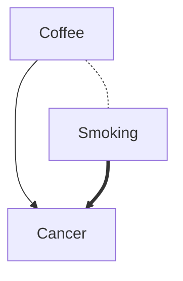
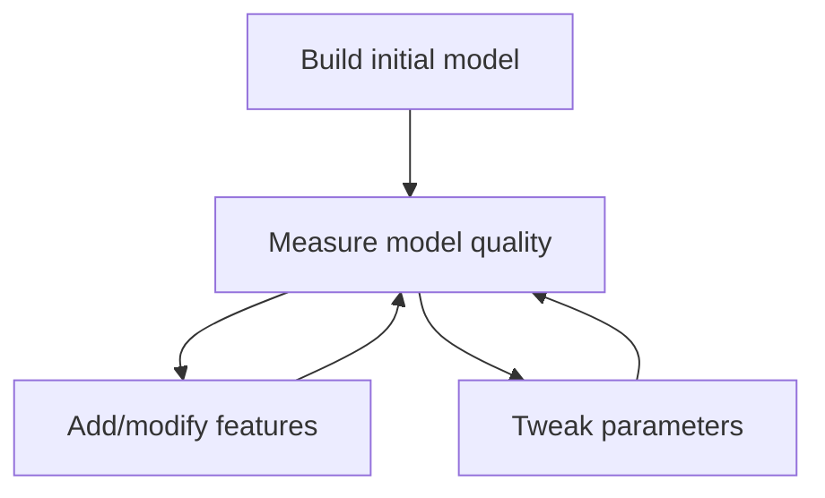

# Experimentation

Christian Kaestner

<!-- references -->

Required reading: 
* Georgi Georgiev. [Statistical Significance in A/B Testing – a Complete Guide](http://blog.analytics-toolkit.com/2017/statistical-significance-ab-testing-complete-guide/). Blog post, 2018.

---

# Learning Goals

* Plan and execute experiments (chaos, A/B, ...) in production
* Conduct and evaluate multiple concurrent A/B tests in a system
* Examine experimental results with statistical rigor
* Perform sensitivity analysis in large configuration/design spaces


---
# Science


> The scientific method is an empirical method of acquiring knowledge that has characterized the development of science since at least the 17th century. It involves careful observation, applying rigorous skepticism about what is observed, given that cognitive assumptions can distort how one interprets the observation. It involves formulating hypotheses, via induction, based on such observations; experimental and measurement-based testing of deductions drawn from the hypotheses; and refinement (or elimination) of the hypotheses based on the experimental findings. -- [Wikipedia](https://en.wikipedia.org/wiki/Scientific_method)

----
## Excursion: The Seven Years' War (1754-63)

Britain loses 1,512 sailors to enemy action...

...and almost 100,000 to scurvy


<!-- .element: class="stretch" -->


(American part of [Seven Years' War](https://en.wikipedia.org/wiki/Seven_Years%27_War) known as [French and Indian War](https://en.wikipedia.org/wiki/French_and_Indian_War))

----
## James Lind (1716-94)

<!-- colstart -->
Possibly first ever controlled medical experiment in 1747

Sailors on different ships supplemented with
- [ ] hard cider
- [ ] sulfric acid
- [ ] vinegar
- [ ] sea water
- [x] oranges
- [x] lemons
- [ ] mixture of balsam of Peru, garlic, myrrh, mustard seed and radish root

(initially dismissed as anecdotes since it didn't fit models of the disease; nobody paid attention until a proper Englishman repeated the experiment in 1794)
<!-- col -->

<!-- colend -->
----
## Evidence-Based Medicine

Randomized double-blind trials accepted as gold standard in medical research


<!-- .element: class="stretch" -->

Long path towards evidence-based medicine (term coined in 1992)

Notes: 
Discuss what double-blind trial entails and why it is important

Picture by [frolicsomepl](https://pixabay.com/photos/cure-drug-cold-dose-the-disease-1006810/)

----
## Example Research Questions

<!-- colstart -->
Does obtaining a CMU degree lead to a higher salary after graduation?

<!-- col -->
Do DNN produce higher accuracy models than random forests for forecasting the weather?

<!-- colend -->

----
## Controlled Experiment Design

Start with hypothesis

Goal: Testing the impact of independent variable X (treatment or no treatment) on outcome Y, ideally controlling all other influences that may affect Y

Setup: Diving test subjects into two groups: with X (treatment group) and without X (control group), observing outcomes Y

Results: Analyzing whether outcomes differ among the groups

*What are X, Y, and test subjects for the graduation and weather forecast research questions?*
----
## Causal Inference with Controlled Experiments

If both groups differ *only* in X, X causes difference in Y.

***

In practice, we usually cannot exactly repeat the same thing with and without X:
* Don't have identical copies of test subjects (e.g., humans)
* Subjects in different groups may have different characteristics, observable or not (e.g., one group mostly male, one group more intelligent)
* Random other factors may influence Y (e.g., pure chance, weather in each subject's location)

▶ Observed difference may be caused by factors other than X, called confounding variables


----
## Confounding Variables



Correlation != Causation

Notes: Coffee drinking has a strong correlation with cancer, but not a causal relation. The causal relationship is between smoking and cancer, but coffee drinking is correlated with smoking, hence the effect for smoking.

----
## Confounds for Example Research Questions?
<!-- colstart -->

<!-- col -->

<!-- colend -->


---
## Correlation vs Causation

[](https://www.xkcd.com/552/)

---
## Handling Confounds

Strategies:
* Keep constant, matching
    - e.g., same room, same demographic, same tasks
    - eliminates influence, enables causal reasoning
    - limits results to specific subject/conditions
* Randomize
    - given large enough random group, characteristics will balance out
    - use statistics to assess chance of random effects
* Measure and filter out later
    - check whether groups were unbalanced
    - regression modeling, exploring multiple factors, not just X
    - commonly used in natural/quasi experiments where group assignment cannot be controlled


**Examples?**

Notes:
Without human subjects (e.g., comparing models) and with reliable measures for Y, we often have comparably little noise and can keep most factors constant.

We'll come back to statistics in a bit.

---
# Offline Experimentation

----
## Data Science is Exploratory and Iterative


<!-- references -->
Philip Guo. [Data Science Workflow: Overview and Challenges](https://cacm.acm.org/blogs/blog-cacm/169199-data-science-workflow-overview-and-challenges/fulltext). BLOG@CACM, 2013


----
## Constant Experimentation

Which features improve the model? Which encoding? Normalization?

Which modeling techniques might work better?

How to tune the learning algorithm?

Try more or different data?


*Both: Ad-hoc testing & hypothesis-driven exploration*


<!-- references -->

Further reading: Kery, M. B., Radensky, M., Arya, M., John, B. E., & Myers, B. A. (2018, April). [The story in the notebook: Exploratory data science using a literate programming tool](https://dl.acm.org/citation.cfm?id=3173748). In Proceedings of the 2018 CHI Conference on Human Factors in Computing Systems (p. 174). ACM.

----
## Iterative Model Refinement



Repeated evaluation of model quality until no further improvement or good enough

Often on static learning and evaluation set

----
## Experimentation Challenges

* Notebooks allow lightweight experimentation, but 
    * do not track history or rationale
    * no easy merging
    * comparison of many experiments challenging
    * pervasive copy + paste editing
    * later cleanup often needed
* Experiments may be expensive (time + resources, learning + evaluation)
* Overfitting despite separate evaluation set

<!-- references -->

Further reading: Kery, M. B., Radensky, M., Arya, M., John, B. E., & Myers, B. A. (2018, April). [The story in the notebook: Exploratory data science using a literate programming tool](https://dl.acm.org/citation.cfm?id=3173748). In Proceedings of the 2018 CHI Conference on Human Factors in Computing Systems (p. 174). ACM.


---
# Sensitivity Analysis

<!-- references -->

Further reading: Saltelli, Andrea, et al. Global sensitivity analysis: the primer. John Wiley & Sons, 2008.

----
## Sensitivity Analysis / What-If Analysis

> The study of how uncertainty in the output of a model (numerical or otherwise) can be apportioned to different sources of uncertainty in the model input (Saltelli et al., 2008)

Old idea for analyzing models: Which inputs are important?

Example: Policy discussion for a new road -- Lots of stakeholders with conflicting opinions:
* Which inputs make significant changes to the outcome and should be prioritized (e.g., in data collection and discussions)?
* Which basic assumptions may affect the outcome if we revisited them?
* Usually only few inputs create most of the variation.

----
## Case Discussion: Policy Model


Notes:
What factors might influence the policy decision to build new train tracks in a city or extend an airport?
Which parameters are important for making an informed decision, which are not?

Photo by [Michael Gaida](https://pixabay.com/photos/site-demolition-work-demolition-3688262/)

----
## Classic Sensitivity Analysis Settings

* Models of the real world (economics, policy, physics)
* Lots of input parameters and constants 
    - too many combinations to explore all (exponential explosion)
* Models are often long running simulations (may take days to evaluate)
    - e.g., climate change models, chemistry kinetics computer models
* Many inputs are estimates or assumptions with some uncertainty
    - e.g., future interest rates, carbon absorption of trees
* Identify important parameters by testing which input changes affect the output's uncertainty most
    * sampling and testing
    * analytical methods

----
## Sensitivity Analysis Goals

* Test the robustness of a model in the presence of uncertainty
* Understand relationships between inputs and outputs
* Uncertainty reduction and focus on important parameters
* Debugging models, checking plausibility 
* (Optimization)
* Simplify the model
* Enhance communication between modelers and decision makers

> "For models to be used in impact assessment or other regulatory settings, it might be advisable to have a back-of-the-envelope version of the general model for the purpose of negotiating assumptions and inferences with stakeholders" (Saltelli et al., 2008.)

Notes: Further reading: https://en.wikipedia.org/wiki/Sensitivity_analysis

----
## Sensitivity Analysis and AI

* Models in machine learning and symbolic AI are often highly complex, hard to (fully) understand?
* Often hundreds of features (inputs) are used, but which are important?
* Features can be computed in different ways (e.g., normalization), but how robust is the model to such decisions?
* Can complicated models be replaced with simpler ones?
* How much does hyperparameter tuning affect results?
* Is the model biased by input X (e.g., gender)?
* 
* Challenge: Often lots and lots of inputs
* Opportunity: Evaluation of ML/AI models is relatively fast


----
## Sensitivity Analysis Techniques in a Nutshell

* Simple models: Analytical methods  (e.g., derivative)
* Commonly: Sampling-based approach
    - Repeated speculative "what-if" changes to observe outcome
    - Typically guided sampling strategy ("design of experiments")
    - Calculating parameter influence on outcomes
* Special handling for dependent/correlated inputs and interactions

----
## Plotted Influence of 4 Parameters

100 random samples. Which parameter ($Z_1, Z_2, Z_3, Z_4$) has the most influence on $Y$?


Notes:

Source: https://en.wikipedia.org/wiki/File:Scatter_plots_for_sensitivity_analysis_bis.jpg

Sampling-based sensitivity analysis by scatterplots. Y (vertical axis) is a function of four factors. The points in the four scatterplots are always the same though sorted differently, i.e. by Z1, Z2, Z3, Z4 in turn. Note that the abscissa is different for each plot: (−5, +5) for Z1, (−8, +8) for Z2, (−10, +10) for Z3 and Z4. Z4 is most important in influencing Y as it imparts more 'shape' on Y.

----
## Exhaustive Search (Grid Search)

* Explore all combinations of all variations of all inputs
* Frequently used for hyperparameter optimization in small search spaces
* Exponential search space
* Covers all interactions, ideal for finding optimum
* Readily implemented in many frameworks
* Not feasible for most scenarios 

----
## One-at-a-time

* Sampling:
    * $S_0$ default assignment to all inputs
    * For each input, create one sample that differs from $S_0$ only in that input (or multiple)
* Compute influence as partial derivative or using linear regression
* Simple, fast, practical, but cannot discover interactions
*
* Useful also for *screening*: identifying few significant inputs
----
## Regression analysis

* Random sampling or other strategies
* Fit linear regression model over findings
    - optionally, use feature selection to keep model simple or explore interactions
    - e.g. $3·z_1+.2·z_3-14.2·z_3·z_4$
* Interpret sensitivity from model coefficients
* Simple, computationally efficient, but limited to linear relationships
*
* **General strategy: Replacing one model with a simpler, less accurate, but more explainable model.**
----


<!-- references -->

Futher reading: N. Siegmund, A. Grebhahn, C. Kästner, and S. Apel. [Performance-Influence Models for Highly Configurable Systems](https://www.cs.cmu.edu/~ckaestne/pdf/fse15_influence.pdf). In Proceedings Symposium on the Foundations of Software Engineering (ESEC/FSE), pages 284--294, 2015.

Notes:
Inputs are configuration options here and outputs performance measurements for specific configurations. In this case all inputs are boolean, 5 are shown. After sampling a set of configurations, a linear regression model can be fit to identify which options have the largest performance influence.
Note that the regression model models all options but no interactions.

----


<!-- references -->

Futher reading: N. Siegmund, A. Grebhahn, C. Kästner, and S. Apel. [Performance-Influence Models for Highly Configurable Systems](https://www.cs.cmu.edu/~ckaestne/pdf/fse15_influence.pdf). In Proceedings Symposium on the Foundations of Software Engineering (ESEC/FSE), pages 284--294, 2015.

Notes:
The approach can be refined by adding interaction terms to the regression, typically as precomputed synthetic inputs. Since the number of potential interactions is quadratic for pairwise interactions and exponential for all interactions, typically only a select number of interactions is tried. This can be done with domain knowledge or with search strategies, such as trying pairwise combinations among all options that have a significant influence on their own.
----
## Sensitivity Analysis for Duplicate PR Detector

* Project: ML classifier to detect duplicate pull requests on GitHub

<!-- colstart -->

<!-- col -->

<!-- colend -->

<!-- references -->
L. Ren, S. Zhou, C. Kästner, and A. Wąsowski. [Identifying Redundancies in Fork-based Development](https://www.cs.cmu.edu/~ckaestne/pdf/saner19.pdf). In Proceedings of the 27th IEEE International Conference on Software Analysis, Evolution and Reengineering (SANER), pages 230--241, 2019.

----
## Robustness

* How much does a model depend on a specific operationalization of a feature?
    - can we measure delivery time with a different method and still get similar results?
    - does a feature (e.g. code quality) need to be very accurate for our model to work effectively?
    - how sensitive is our model to outliers?
* Evaluate model accuracy with different features or versions of feature extractors


----
## Robustness Example

Project: Explain which GitHub projects adopt badges in their repositories

Modeling "code quality": (a) linter warnings, (b) commits with "fix" in description, (c) number of tests, (d) number of test files, (e) size of test files

Output measure: model fit / stability of effects in models

<!-- colstart -->

<!-- col -->

<!-- colend -->

<!-- references -->

A. Trockman, S. Zhou, C. Kästner, and B. Vasilescu. [Adding Sparkle to Social Coding: An Empirical Study of Repository Badges in the npm Ecosystem](https://www.cs.cmu.edu/~ckaestne/pdf/icse18badges.pdf). In Proceedings of the 40th International Conference on Software Engineering (ICSE), pages 511--522, 2018.

Notes: 
In this data analytics study, there were multiple ways of operationalizing and measuring an outcome (same robustness analysis can be done on inputs). A simple robustness check is whether the results change drastically when using a different measure that is supposed to measure the same underlying effect.

If different proxy measures produce widely different answers, the model may pick up on characteristics of the measure more than the underlying effect. Conversely with multiple proxy measures for the same effect come to the same conclusion one can gain confidence that the results actually relate to the studied phenomenon.

----
## Sampling Strategies (Design of Experiments)

* Sampling in high-dimensional spaces has been studied in detail
* Random sampling as a baseline
* Many designs exist that can explore spaces more systematically than random sampling
* Constraints among inputs complicate all strategies

<!-- colstart -->


([Box-Behnken](https://en.wikipedia.org/wiki/Box%E2%80%93Behnken_design))

<!-- col -->


([Plackett-Burman](https://en.wikipedia.org/wiki/Plackett%E2%80%93Burman_design))

<!-- colend -->

----
## Sensitivity Analysis in Soccer Commentary and Summary Project?
For what purposes could sensitivity analysis be used? How?

 

Notes: See the case study from the previous lecture.
----
## Other Examples of Sensitivity Analysis in AI Projects?

<!-- discussion -->

Notes: Collect potential scenarios and concrete examples.

Back to the list earlier:
* Models in machine learning and symbolic AI are often highly complex, hard to (fully) understand?
* Often hundreds of features (inputs) are used, but which are important?
* Features can be computed in different ways (e.g., normalization), but how robust is the model to such decisions?
* Can complicated models be replaced with simpler ones?
* How much does hyperparameter tuning affect results?
* Is the model biased by input X (e.g., gender)?

----
## Tool Support for Sensitivity Analysis?

<!-- discussion -->


---
# Online Experimentation

----
## What if...?
 
* ... we hand plenty of subjects for experiments
* ... we could randomly assign subjects to treatment and control group without them knowing
* ... we could analyze small individual changes and keep everything else constant


▶ Ideal conditions for controlled experiments


----
## A/B Testing for Usability

* In running system, random sample of X users are shown modified version
* Outcomes (e.g., sales, time on site) compared among groups


Notes: Picture source: https://www.designforfounders.com/ab-testing-examples/

----


Notes: Picture source: https://www.designforfounders.com/ab-testing-examples/
----
## Experiment Size

* With enough subjects (users), we can run many many experiments
* Even very small experiments become feasible
* Toward causal inference


----

## Implementing A/B Testing

* Implement alternative versions of the system
    * using feature flags (decisions in implementation)
    * separate deployments (decision in router/load balancer)
* Map users to treatment group
    * Randomly from distribution
    * Static user - group mapping
    * Online service (e.g., [launchdarkly](https://launchdarkly.com/), [split](https://www.split.io/))
* Monitor outcomes *per group*
    * Telemetry, sales, time on site, server load, crash rate
----

<!-- .element: class="stretch" --> 
----

## Comparing Averages

<!-- colstart -->
**Group A**

2354158 Users

average 3:13 min time on site

<!-- col -->

**Group B**

1000 Users

average 3:24 min time on site

<!-- colend -->
----
## Comparing Distributions


----
## Different effect size, same deviations

<!-- colstart -->

<!-- col -->

<!-- colend -->

----
## Same effect size, different deviations

<!-- colstart -->

<!-- col -->

<!-- colend -->

Less noise --> Easier to recognize


----

## Dependent vs. independent measurements

* Pairwise (dependent) measurements
    * Before/after comparison
    * With same benchmark + environment
    * e.g., new operating system/disc drive faster
* Independent measurements
    * Repeated measurements
    * Input data regenerated for each measurement

----
## Significance level
* Statistical change of an error
* Define before executing the experiment
    * use commonly accepted values
    * based on cost of a wrong decision
* Common:
    * 0.05 significant
    * 0.01 very significant
* Statistically significant result =!> proof
* Statistically significant result =!> important result
* Covers only alpha error (more later)

----

## Intuition: Error Model
* 1 random error, influence +/- 1
* Real mean: 10
* Measurements: 9 (50%) und 11 (50%)
*
* 2 random errors, each +/- 1
* Measurements: 8 (25%), 10 (50%) und 12 (25%)
* 
* 3 random errors, each +/- 1
* Measurements : 7 (12.5%), 9 (37.5), 11 (37.5), 12 (12.5)
----
<iframe src='https://gfycat.com/ifr/PleasingMeaslyGalapagossealion' frameborder='0' scrolling='no' allowfullscreen width='640' height='524'></iframe>
----
## Normal Distribution


<!-- references -->
(CC 4.0 [D Wells](https://commons.wikimedia.org/wiki/File:Standard_Normal_Distribution.png))
----
## Confidence Intervals

----
## Comparison with Confidence Intervals

 
<!-- references -->
Source: Andy Georges, Dries Buytaert, and Lieven Eeckhout. 2007. [Statistically rigorous java performance evaluation](https://dri.es/files/oopsla07-georges.pdf). In Proc. Conference on Object-Oriented Programming Systems and Applications (OOPSLA '07). ACM, 57-76.
----
# t-test

```r
> t.test(x, y, conf.level=0.9)

        Welch Two Sample t-test

t = 1.9988, df = 95.801, p-value = 0.04846
alternative hypothesis: true difference in means is 
not equal to 0 
90 percent confidence interval:
 0.3464147 3.7520619 
sample estimates:
mean of x mean of y 
 51.42307  49.37383 

> # paired t-test:
> t.test(x-y, conf.level=0.9)
```
----

<!-- references -->
Source: https://conversionsciences.com/ab-testing-statistics/
----

<!-- references -->
Source: https://cognetik.com/why-you-should-build-an-ab-test-dashboard/
----
## How many samples needed?
<!-- colstart -->
**Too few?**

<!-- Noise and random results -->
<!-- col -->
**Too many?**

<!-- Risk of spreading bad designs -->
<!-- colend -->


<!-- discussion -->
----
## A/B testing automation

* Experiment configuration through DSLs/scripts
* Queue experiments
* Stop experiments when confident in results
* Stop experiments resulting in bad outcomes (crashes, very low sales)
* Automated reporting, dashboards

<!-- references -->

Further readings:
* Tang, Diane, et al. [Overlapping experiment infrastructure: More, better, faster experimentation](https://ai.google/research/pubs/pub36500.pdf). Proceedings of the 16th ACM SIGKDD international conference on Knowledge discovery and data mining. ACM, 2010. (Google)
* Bakshy, Eytan, Dean Eckles, and Michael S. Bernstein. [Designing and deploying online field experiments](https://arxiv.org/pdf/1409.3174). Proceedings of the 23rd International Conference on World Wide Web. ACM, 2014. (Facebook)
----
## DSL for scripting A/B tests at Facebook
```java
button_color = uniformChoice(
    choices=['#3c539a', '#5f9647', '#b33316'],
    unit=cookieid);

button_text = weightedChoice(
    choices=['Sign up', 'Join now'],
    weights=[0.8, 0.2],
    unit=cookieid); 

if (country == 'US') {
    has_translate = bernoulliTrial(p=0.2, unit=userid);
} else {
    has_translate = bernoulliTrial(p=0.05, unit=userid);
}
```
<!-- references -->

Further readings:
* Bakshy, Eytan, Dean Eckles, and Michael S. Bernstein. [Designing and deploying online field experiments](https://arxiv.org/pdf/1409.3174). Proceedings of the 23rd International Conference on World Wide Web. ACM, 2014. (Facebook)
----
## Concurrent A/B testing

* Multiple experiments at the same time
    * Independent experiments on different populations -- interactions not explored
    * Multi-factorial designs, well understood but typically too complex, e.g., not all combinations valid or interesting
    * Grouping in sets of experiments

<!-- references -->

Further readings:
* Tang, Diane, et al. [Overlapping experiment infrastructure: More, better, faster experimentation](https://ai.google/research/pubs/pub36500.pdf). Proceedings of the 16th ACM SIGKDD international conference on Knowledge discovery and data mining. ACM, 2010. (Google)
* Bakshy, Eytan, Dean Eckles, and Michael S. Bernstein. [Designing and deploying online field experiments](https://arxiv.org/pdf/1409.3174). Proceedings of the 23rd International Conference on World Wide Web. ACM, 2014. (Facebook)
---
# Planning and Tracking Experiments
----
## Your experimentation strategy?
<!-- discussion -->
----
## Lots of Experimentation

* Exploration of alternatives
  * Versions of a notebook
  * Copied and edited notebook cells
  * Branches in version control system
* Parameter tuning

----
## Challenges

* Tracking of experiments, versioning
* Slow experiments, slow feedback cycles
* Many choices, many interactions
* Interaction with complex backends and datasets
*
* No standardized platforms
----
## Many solutions

* Many companies develop their own platforms
* Many research platforms
* Many startups
*
* Common strategies
  * Visual frontends
  * Make experiments explicit steps, record all experiments
  * Archive all modeling code for reproducability
  * Store models, evaluation results
  * Dashboards for visualization
----
## Example: Neptune


https://neptune.ml/
----
## Example: ModelDB

<iframe width="560" height="315" src="https://www.youtube.com/embed/gxBb4CjJcxQ" frameborder="0" allow="accelerometer; autoplay; encrypted-media; gyroscope; picture-in-picture" allowfullscreen></iframe>

https://github.com/mitdbg/modeldb

----
## Example: DVC 

```sh
dvc add images
dvc run -d images -o model.p cnn.py
dvc remote add myrepo s3://mybucket
dvc push
```

* Tracks models and datasets
* Splits learning into steps, incrementalization
* Orchestrates learning in cloud resources


https://dvc.org/

---


# Interacting with and supporting data scientists

<!-- discussion -->

---
# Summary

* Experimentation is important
* Offline experimentation, adhoc + senstitivity analysis
* Online experimentation: A/B testing
  * Statistics
  * Automation
  * Dashboards
* Infrastructure for experimentation