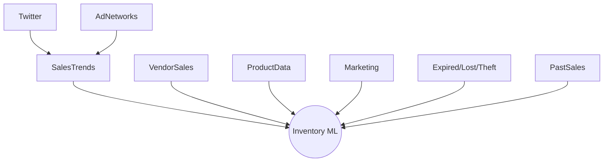
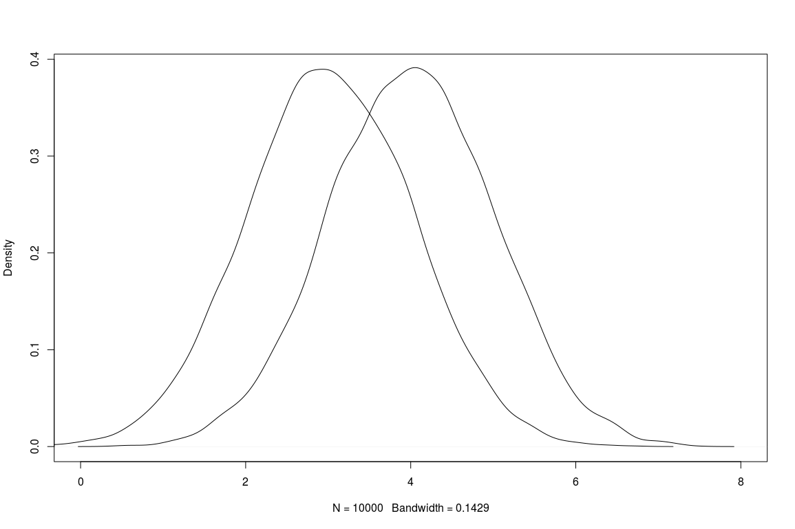

# Data Quality and Data Programming


> "Data cleaning and repairing account for about 60% of the work of data scientists."


Eunsuk Kang


<!-- references -->

Required reading: 
* Schelter, S., Lange, D., Schmidt, P., Celikel, M., Biessmann, F. and Grafberger, A., 2018. [Automating large-scale data quality verification](http://www.vldb.org/pvldb/vol11/p1781-schelter.pdf). Proceedings of the VLDB Endowment, 11(12), pp.1781-1794.
* Nick Hynes, D. Sculley, Michael Terry. "[The Data Linter: Lightweight Automated Sanity Checking for ML Data Sets](http://learningsys.org/nips17/assets/papers/paper_19.pdf)."  NIPS Workshop on ML Systems (2017)

---

# Learning Goals

* Design and implement automated quality assurance steps that check data schema conformance and distributions 
* Devise thresholds for detecting data drift and schema violations
* Describe common data cleaning steps and their purpose and risks
* Evaluate the robustness of AI components with regard to noisy or incorrect data
* Understanding the better models vs more data tradeoffs
* Programatically collect, manage, and enhance training data


---

# Data-Quality Challenges

----
## Case Study: Inventory Management


<!-- .element: class="stretch" -->

----
## Inventory Database

Product Database:

| ID | Name | Weight | Description | Size | Vendor |
| - |  - |  - |  - |  - | - | 
| ... |  ... |  ... |  ... |  ... |  ... | 

Stock:

| ProductID | Location | Quantity |
| - |  - |  - |
| ... |  ... |  ... |

Sales history:

| UserID | ProductId | DateTime | Quantity | Price | 
| - |  - |  - | - |- |
| ... |  ... |  ... |... |... |

----
## What makes good quality data?

* Accuracy
  * The data was recorded correctly.
* Completeness
  * All relevant data was recorded.
* Uniqueness
  * The entries are recorded once.
* Consistency
  * The data agrees with itself.
* Timeliness
  * The data is kept up to date.

----
## Data is noisy

* Unreliable sensors or data entry
* Wrong results and computations, crashes
* Duplicate data, near-duplicate data
* Out of order data
* Data format invalid
*
* **Examples?**

----
## Data changes

* System objective changes over time
* Software components are upgraded or replaced
* Prediction models change
* Quality of supplied data changes
* User behavior changes
* Assumptions about the environment no longer hold
*
* **Examples?**

----
## Users may deliberately change data

* Users react to model output
* Users try to game/deceive the model
*
* **Examples?**

----
## Many Data Sources



*sources of different reliability and quality*

----
## Accuracy vs Precision

* Accuracy: Reported values (on average) represent real value
* Precision: Repeated measurements yield the same result
* 
* Accurate, but imprecise: Average over multiple measurements
* Inaccurate, but precise: Systematic measurement problem, misleading

<!-- split -->


(CC-BY-4.0 by [Arbeck](https://commons.wikimedia.org/wiki/File:Accuracy_and_Precision.svg))

<!-- ---- -->
<!-- ## Accuracy and Precision in Training Data? -->

<!--  -->
<!-- <\!-- .element: class="stretch" -\-> -->


----
## Data Quality and Machine Learning

* More data -> better models (up to a point, diminishing effects)
* Noisy data (imprecise) -> less confident models, more data needed 
  * some ML techniques are more or less robust to noise (more on robustness in a later lecture)
* Inaccurate data -> misleading models, biased models
* 
* Need the "right" data
* Invest in data quality, not just quantity


<!-- --- -->
<!-- # Exploratory Data Analysis -->

<!-- ---- -->
<!-- ## Exploratory Data Analysis in Data Science -->

<!-- * Before learning, understand the data -->
<!-- * Understand types, ranges, distributions -->
<!-- * Important for understanding data and assessing quality -->
<!-- * Plot data distributions for features -->
<!--   - Visualizations in a notebook -->
<!--   - Boxplots, histograms, density plots, scatter plots, ... -->
<!-- * Explore outliers -->
<!-- * Look for correlations and dependencies -->
<!--   - Association rule mining -->
<!--   - Principal component analysis -->

<!-- Examples: https://rpubs.com/ablythe/520912 and https://towardsdatascience.com/exploratory-data-analysis-8fc1cb20fd15 -->

<!-- ---- -->
<!-- ## SE Perspective: Understanding Data for Quality Assurance -->

<!-- * Understand input and output data -->
<!-- * Understand expected distributions -->
<!-- * Understand assumptions made on data for modeling -->
<!--   - ideally document those -->
<!-- * Check assumptions at runtime -->


---

# Data Cleaning

> Data cleaning and repairing account for about 60% of the work of data scientists.


<!-- references -->
Quote: Gil Press. “[Cleaning Big Data: Most Time-Consuming, Least Enjoyable Data Science Task, Survey Says](https://www.forbes.com/sites/gilpress/2016/03/23/data-preparation-most-time-consuming-least-enjoyable-data-science-task-survey-says/).” Forbes Magazine, 2016.

----


<!-- references -->

Source: Rahm, Erhard, and Hong Hai Do. [Data cleaning: Problems and current approaches](http://dc-pubs.dbs.uni-leipzig.de/files/Rahm2000DataCleaningProblemsand.pdf). IEEE Data Eng. Bull. 23.4 (2000): 3-13.


----
## Single-Source Problem Examples

* Schema level:
<!-- .element: class="fragment" -->
    * Illegal attribute values: `bdate=30.13.70`
    * Violated attribute dependencies: `age=22, bdate=12.02.70`
    * Uniqueness violation: `(name=”John Smith”, SSN=”123456”), (name=”Peter Miller”, SSN=”123456”)`
    * Referential integrity violation: `emp=(name=”John Smith”, deptno=127)` if department 127 not defined
* Instance level:
<!-- .element: class="fragment" -->
	* Missing values: `phone=9999-999999`
    * Misspellings: `city=Pittsburg`
    * Misfielded values: `city=USA`
    * Duplicate records: `name=John Smith, name=J. Smith`
    * Wrong reference: `emp=(name=”John Smith”, deptno=127)` if department 127 defined but wrong

<!-- references -->

Further readings: Rahm, Erhard, and Hong Hai Do. [Data cleaning: Problems and current approaches](http://dc-pubs.dbs.uni-leipzig.de/files/Rahm2000DataCleaningProblemsand.pdf). IEEE Data Eng. Bull. 23.4 (2000): 3-13.

----
## Dirty Data: Example


*Problems with the data?*


----
## Discussion: Potential Data Quality Problems?


<!-- .element: class="stretch" -->


----
## Data Cleaning Overview

* Data analysis / Error detection
  * Error types: e.g. schema constraints, referential integrity, duplication 
  * Single-source vs multi-source problems
  * Detection in input data vs detection in later stages (more context)
* Error repair
  * Repair data vs repair rules, one at a time or holistic
  * Data transformation or mapping
  * Automated vs human guided

----
## Error Detection

* Illegal values: min, max, variance, deviations, cardinality
* Misspelling: sorting + manual inspection, dictionary lookup
* Missing values: null values, default values
* Duplication: sorting, edit distance, normalization

----
## Error Detection: Example


Q. Can we (automatically) detect errors? Which errors are problem-dependent?

----
## Common Strategies for Cleaning

* Enforce schema constraints
  * e.g., delete rows with missing data or use defaults
* Explore sources of errors 
  * e.g., debugging missing values, outliers
* Remove outliers
  * e.g., Testing for normal distribution, remove > 2σ
* Normalization
  * e.g., range [0, 1], power transform
* Fill in missing values

----
## Data Cleaning Tools


OpenRefine (formerly Google Refine), Trifacta Wrangler, Drake, etc.,

----
## Different Cleaning Tools

* Outlier detection
* Data deduplication
* Data transformation
* Rule-based data cleaning and rule discovery
  - (conditional) functional dependencies and other constraints
* Probabilistic data cleaning

<!-- references -->

Further reading: Ilyas, Ihab F., and Xu Chu. [Data cleaning](https://dl.acm.org/doi/book/10.1145/3310205). Morgan & Claypool, 2019.


---

# Data Schema

----
## Data Schema

* Define expected format of data
  * expected fields and their types
  * expected ranges for values
  * constraints among values (within and across sources)
* Data can be automatically checked against schema
* Protects against change; explicit interface between components

----
## Schema in Relational Databases

```sql
CREATE TABLE employees (
    emp_no      INT             NOT NULL,
    birth_date  DATE            NOT NULL,
    name        VARCHAR(30)     NOT NULL,
    PRIMARY KEY (emp_no));
CREATE TABLE departments (
    dept_no     CHAR(4)         NOT NULL,
    dept_name   VARCHAR(40)     NOT NULL,
    PRIMARY KEY (dept_no), UNIQUE  KEY (dept_name));
CREATE TABLE dept_manager (
   dept_no      CHAR(4)         NOT NULL,
   emp_no       INT             NOT NULL,
   FOREIGN KEY (emp_no)  REFERENCES employees (emp_no),
   FOREIGN KEY (dept_no) REFERENCES departments (dept_no),
   PRIMARY KEY (emp_no,dept_no)); 
```

----
## Schema-Less Data Exchange

* CSV files
* Key-value stores (JSon, XML, Nosql databases)
* Message brokers
* REST API calls
* R/Pandas Dataframes

```csv
1::Toy Story (1995)::Animation|Children's|Comedy
2::Jumanji (1995)::Adventure|Children's|Fantasy
3::Grumpier Old Men (1995)::Comedy|Romance
```

```csv
10|53|M|lawyer|90703
11|39|F|other|30329
12|28|F|other|06405
13|47|M|educator|29206
```

----
## Example: Apache Avro

```json
{   "type": "record",
    "namespace": "com.example",
    "name": "Customer",
    "fields": [{
            "name": "first_name",
            "type": "string",
            "doc": "First Name of Customer"
        },        
        {
            "name": "age",
            "type": "int",
            "doc": "Age at the time of registration"
        }
    ]
}
```

----
## Example: Apache Avro

* Schema specification in JSON format
* Serialization and deserialization with automated checking
* Native support in Kafka
* 
* Benefits
  * Serialization in space efficient format
  * APIs for most languages (ORM-like)
  * Versioning constraints on schemas
* Drawbacks
  * Reading/writing overhead
  * Binary data format, extra tools needed for reading
  * Requires external schema and maintenance
  * Learning overhead

Notes: Further readings eg https://medium.com/@stephane.maarek/introduction-to-schemas-in-apache-kafka-with-the-confluent-schema-registry-3bf55e401321, https://www.confluent.io/blog/avro-kafka-data/, https://avro.apache.org/docs/current/

----
## Many Schema Formats

Examples
* Avro
* XML Schema
* Protobuf
* Thrift
* Parquet
* ORC

----
## Discussion: Data Schema for Inventory System?

Product Database:

| ID | Name | Weight | Description | Size | Vendor |
| - |  - |  - |  - |  - | - | 
| ... |  ... |  ... |  ... |  ... |  ... | 

Stock:

| ProductID | Location | Quantity |
| - |  - |  - |
| ... |  ... |  ... |

Sales history:

| UserID | ProductId | DateTime | Quantity | Price | 
| - |  - |  - | - |- |
| ... |  ... |  ... |... |... |


---
# Detecting Inconsistencies 


<!-- references -->
Image source: Theo Rekatsinas, Ihab Ilyas, and Chris Ré, “[HoloClean - Weakly Supervised Data Repairing](https://dawn.cs.stanford.edu/2017/05/12/holoclean/).” Blog, 2017.

----
## Data Quality Rules

* Invariants on data that must hold
* Typically about relationships of multiple attributes or data sources, eg.
  - ZIP code and city name should correspond
  - User ID should refer to existing user
  - SSN should be unique
  - For two people in the same state, the person with the lower income should not have the higher tax rate
* Classic integrity constraints in databases or conditional constraints
* Rules can be used to reject data or repair it

----
## Exmaple: HoloClean


* User provides rules as integrity constraints (e.g., "two entries with the same
name can't have different city")
* Detect violations of the rules in the data; also detect statistical outliers
* Automatically generate repair candidates (with probabilities)

<!-- references -->
Image source: Theo Rekatsinas, Ihab Ilyas, and Chris Ré, “[HoloClean - Weakly Supervised Data Repairing](https://dawn.cs.stanford.edu/2017/05/12/holoclean/).” Blog, 2017.

----
## Discovery of Data Quality Rules

+ Rules directly taken from external databases
  * e.g. zip code directory
+ Given clean data, 
  * several algorithms that find functional relationships ($X\Rightarrow Y$) among columns
  * algorithms that find conditional relationships (if $Z$ then $X\Rightarrow Y$)
  * algorithms that find denial constraints ($X$ and $Y$ cannot cooccur in a row)
+ Given mostly clean data (probabilistic view),
  * algorithms to find likely rules (e.g., association rule mining)
  * outlier and anomaly detection
+ Given labeled dirty data or user feedback,
  * supervised and active learning to learn and revise rules
  * supervised learning to learn repairs (e.g., spell checking)

<!-- references -->

Further reading: Ilyas, Ihab F., and Xu Chu. [Data cleaning](https://dl.acm.org/doi/book/10.1145/3310205). Morgan & Claypool, 2019.

----
## Association rule mining

* Sale 1: Bread, Milk
* Sale 2: Bread, Diaper, Beer, Eggs
* Sale 3: Milk, Diaper, Beer, Coke
* Sale 4: Bread, Milk, Diaper, Beer
* Sale 5: Bread, Milk, Diaper, Coke

Rules
* {Diaper, Beer} -> Milk (40% support, 66% confidence)
* Milk -> {Diaper, Beer} (40% support, 50% confidence)
* {Diaper, Beer} -> Bread (40% support, 66% confidence)

*(also useful tool for exploratory data analysis)*

<!-- references -->
Further readings: Standard algorithms and many variations, see [Wikipedia](https://en.wikipedia.org/wiki/Association_rule_learning)


<!-- ---- -->
<!-- ## Excursion: Daikon for dynamic detection of likely invariants -->

<!-- * Software engineering technique to find invariants -->
<!--   * e.g., `i>0`, `a==x`, `this.stack != null`, `db.query() after db.prepare()` -->
<!--   * Pre- and post-conditions of functions, local variables -->
<!-- * Uses for documentation, avoiding bugs, debugging, testing, verification, repair -->
<!-- * Idea: Observe many executions (instrument code), log variable values, look for relationships (test many possible invariants) -->
<!-- ---- -->
<!-- ## Daikon Example -->
<!-- <\!-- colstart -\-> -->
<!-- ```c -->
<!-- int ABS(int x) { -->
<!--     if (x>0) return x; -->
<!--     else return (x*(-1)); -->
<!-- } -->
<!-- int main () { -->
<!--     int i=0; -->
<!--     int abs_i; -->
<!--     for (i=-5000;i<5000;i++) -->
<!--         abs_i=ABS(i); -->
<!-- } -->
<!-- ``` -->

<!-- Expected: `Return value of ABS(x) == (x>0) ? x: -x;` -->
<!-- <\!-- col -\-> -->
<!-- ```text -->
<!-- ================== -->
<!-- std.ABS(int;):::ENTER -->
<!-- ================== -->
<!-- std.ABS(int;):::EXIT1 -->
<!-- x == return -->
<!-- ================== -->
<!-- std.ABS(int;):::EXIT2 -->
<!-- return == - x -->
<!-- ================== -->
<!-- std.ABS(int;):::EXIT -->
<!-- x == orig(x) -->
<!-- x <= return -->
<!-- ================== -->
<!-- ``` -->
<!-- <\!-- colend -\-> -->

<!-- Notes: many examples in https://www.cs.cmu.edu/~aldrich/courses/654-sp07/tools/kim-daikon-02.pdf -->


<!-- ---- -->
<!-- ## Probabilistic Repair -->

<!-- * Use rules to identify inconsistencies and the more likely fix -->
<!-- * If confidence high enough, apply automatically -->
<!-- * Show suggestions to end users (like spell checkers) or data scientists -->
<!-- * Many tools in this area -->

<!-- ---- -->
<!-- ## [HoloClean](http://www.holoclean.io/) -->

<!--  -->


<!-- [HoloClean: Data Quality Management with Theodoros Rekatsinas](https://softwareengineeringdaily.com/2020/06/02/holoclean-data-quality-management-with-theodoros-rekatsinas/), SEDaily Podcast, 2020 -->

----
## Discussion: Data Quality Rules in Inventory System


<!-- .element: class="stretch" -->
 


---
# Data Linter

<!-- references -->
Further readings: Nick Hynes, D. Sculley, Michael Terry. "[The Data Linter: Lightweight Automated Sanity Checking for ML Data Sets](http://learningsys.org/nips17/assets/papers/paper_19.pdf)."  NIPS Workshop on ML Systems (2017)
----
## Excursion: Static Analysis and Code Linters

*Automate routine inspection tasks*

```js
if (user.jobTitle = "manager") {
   ...
}
```

```js
function fn() {
    x = 1;
    return x;
    x = 3; // dead code
}
```

```java
PrintWriter log = null;
if (anyLogging) log = new PrintWriter(...);
if (detailedLogging) log.println("Log started");
```

----
## Static Analysis

* Analyzes the structure/possible executions of the code, without running it
* Different levels of sophistication
  * Simple heuristic and code patterns (linters)
  * Sound reasoning about all possible program executions
* Tradeoff between false positives and false negatives
* Often supporting annotations needed (e.g., `@Nullable`)
* Tools widely available, open source and commercial


----
## A Linter for Data?

<!-- discussion -->

----
## Data Linter at Google

* Miscoding
    * Number, date, time as string
    * Enum as real
    * Tokenizable string (long strings, all unique)
    * Zip code as number
* Outliers and scaling
    * Unnormalized feature (varies widely)
    * Tailed distributions
    * Uncommon sign
* Packaging
    * Duplicate rows
    * Empty/missing data

<!-- references -->
Further readings: Hynes, Nick, D. Sculley, and Michael Terry. [The data linter: Lightweight, automated sanity checking for ML data sets](http://learningsys.org/nips17/assets/papers/paper_19.pdf). NIPS MLSys Workshop. 2017.


---

# Detecting Drift
----
## Drift & Model Decay

*in all cases, models are less effective over time*

* Concept drift
<!-- .element: class="fragment" -->
  * properties to predict change over time (e.g., what is credit card fraud)
  * over time: different expected outputs for same inputs
  * model has not learned the relevant concepts
* Data drift
<!-- .element: class="fragment" -->
  * characteristics of input data changes (e.g., customers with face masks)
  * input data differs from training data 
  * over time: predictions less confident, further from training data
* Upstream data changes 
<!-- .element: class="fragment" -->
  * external changes in data pipeline (e.g., format changes in weather service)
  * model interprets input data incorrectly
  * over time: abrupt changes due to faulty inputs

**How do we fix these drifts?**
<!-- .element: class="fragment" -->

Notes:
  * fix1: retrain with new training data or relabeled old training data
  * fix2: retrain with new data
  * fix3: fix pipeline, retrain entirely

----
## On Terminology

* Concept and data drift are separate concepts
* In practice and literature not always clearly distinguished
* Colloquially encompasses all forms of model degradations and environment changes
* Define term for target audience


----
## Watch for Degradation in Prediction Accuracy


<!-- references -->
Image source: Joel Thomas and Clemens Mewald. [Productionizing Machine Learning: From Deployment to Drift Detection](https://databricks.com/blog/2019/09/18/productionizing-machine-learning-from-deployment-to-drift-detection.html). Databricks Blog, 2019


----
## Indicators of Concept Drift

*How to detect concept drift in production?*

<!-- discussion -->

----
## Indicators of Concept Drift

* Model degradations observed with telemetry
* Telemetry indicates different outputs over time for similar inputs
* Relabeling training data changes labels
* Interpretable ML models indicate rules that no longer fit

*(many papers on this topic, typically on statistical detection)*


----
## Dealing with Drift

* Regularly retrain model on recent data
  - Use evaluation in production to detect decaying model performance
* Involve humans when increasing inconsistencies detected
  - Monitoring thresholds, automation
* Monitoring, monitoring, monitoring!


----
## Different forms of Data Drift


* Structural drift
  * Data schema changes, sometimes by infrastructure changes
  * e.g., `4124784115` -> `412-478-4115`
* Semantic drift
  * Meaning of data changes, same schema
  * e.g., Netflix switches from 5-star to +/- rating, but still uses 1 and 5
* Distribution changes
  * e.g., credit card fraud differs to evade detection
  * e.g., marketing affects sales of certain items


<!-- .element: class="stretch" -->


----
## Detecting Data Drift

* Compare distributions over time (e.g., t-test)
* Detect both sudden jumps and gradual changes
* Distributions can be manually specified or learned (see invariant detection)

<!-- colstart -->

<!-- col -->

<!-- colend -->


----
## Data Distribution Analysis

* Plot distributions of features (histograms, density plots, kernel density estimation)
  - Identify which features drift
* Define distance function between inputs and identify distance to closest training data (eg., wasserstein and energy distance, see also kNN)
* Formal models for *data drift contribution* etc exist
* Anomaly detection and "out of distribution" detection
* Observe distribution of output labels

----
## Data Distribution Example

https://rpubs.com/ablythe/520912


----
## Microsoft Azure Data Drift Dashboard


<!-- references -->
Image source and further readings: [Detect data drift (preview) on models deployed to Azure Kubernetes Service (AKS)](https://docs.microsoft.com/en-us/azure/machine-learning/how-to-monitor-datasets?tabs=python)

----
## Discussion: Inventory System

*What kind of drift might be expected? What kind of detection/monitoring?*


<!-- .element: class="stretch" -->


<!-- --- -->
<!-- # Data Programming & Weakly-Supervised Learning -->

<!-- *Programmatically Build and Manage Training Data* -->

<!--  -->


<!-- ---- -->
<!-- ## Weak Supervision -- Key Ideas -->

<!-- * Labeled data is expensive, unlabled data is often widely available -->
<!-- * Different labelers with different cost and accuracy/precision -->
<!--   - crowd sourcing vs. med students vs. trained experts in labeling cancer diagnoses -->
<!-- * Often heuristics can define labels for some data (*labeling functions*) -->
<!--   - hard coded heuristics (e.g., regular expressions) -->
<!--   - distant supervision with external knowledge bases -->
<!--   - noisy manual labels with crowd sourcing -->
<!--   - external models providing some predictions -->
<!-- * Combine signals from labeling functions to automatically label training data -->

<!-- ---- -->
<!-- ## Labeling Function -->

<!-- For binary label, vote 1 (spam) or 0 (not spam) or -1 (abstain). -->

<!-- ```py -->
<!-- from snorkel.labeling import labeling_function -->


<!-- @labeling_function() -->
<!-- def lf_keyword_my(x): -->
<!--     """Many spam comments talk about 'my channel', 'my video'.""" -->
<!--     return SPAM if "my" in x.text.lower() else ABSTAIN -->
<!-- ``` -->

<!-- ```py -->
<!-- @labeling_function() -->
<!-- def lf_textblob_polarity(x): -->
<!--     """We use a third-party sentiment classification model.""" -->
<!--     return NOT_SPAM if  -->
<!--       TextBlob(x.text).sentiment.polarity > 0.3 else ABSTAIN -->
<!-- ``` -->

<!-- Can also represent constraints and invariants if known -->

<!-- Notes: More details: https://www.snorkel.org/get-started/ -->

<!-- ---- -->
<!-- ## Snorkel -->


<!--  -->

<!-- *Generative model* learns which labeling functions to trust and when (~ from correlations). Learns "expertise" of labeling functions. -->

<!-- Generative model used to provide *probabilistic* training labels. *Discriminative model* learned from labeled training data; generalizes beyond label functions.  -->


<!-- <\!-- references -\-> -->

<!-- https://www.snorkel.org/, https://www.snorkel.org/blog/snorkel-programming;  -->
<!-- Ratner, Alexander, et al. "[Snorkel: rapid training data creation with weak supervision](https://link.springer.com/article/10.1007/s00778-019-00552-1)." The VLDB Journal 29.2 (2020): 709-730. -->

<!-- Note: -->
<!-- Emphasize the two different models. One could just let all labelers vote, but generative model identifies common correlations and disagreements and judges which labelers to trust when (also provides feedback to label function authors), resulting in better labels. -->

<!-- The generative model could already make predictions, but it is coupled tightly to the labeling functions. The discriminative model is a traditional model learned on labeled training data and thus (hopefully) generalizes beyond the labeling functions. It may actually pick up on very different signals. Typically this is more general and robust for unseen data. -->


<!-- ---- -->
<!-- ## Data Programming Beyond Labeling Training Data -->

<!-- * Potentially useful in many other scenarios -->
<!-- * Data cleaning -->
<!-- * Data augmentation -->
<!-- * Identifying important data subsets -->
<!-- <\!-- split -\-> -->

<!--  -->


<!-- ---- -->
<!-- ## Data Programming in Inventory System? -->

<!--  -->
<!-- <\!-- .element: class="stretch" -\-> -->

<!-- ---- -->
<!-- ## Data Programming for Detecting Toxic Comments in Youtube? -->

<!-- <\!-- discussion -\-> -->


---
# Quality Assurance for the Data Processing Pipelines

----
## Error Handling and Testing in Pipeline

Avoid silent failures!

* Write testable data acquisition and feature extraction code
* Test this code (unit test, positive and negative tests)
* Test retry mechanism for acquisition + error reporting
* Test correct detection and handling of invalid input
* Catch and report errors in feature extraction
* Test correct detection of data drift
* Test correct triggering of monitoring system
* Detect stale data, stale models

*More in a later lecture.*

---
# Summary

* Data and data quality are essential
* Data from many sources, often inaccurate, imprecise, inconsistent, incomplete, ... -- many different forms of data quality problems 
* Understand the data with exploratory data analysis
* Many mechanisms for enforcing consistency and cleaning 
  * Data schema ensures format consistency
  * Data quality rules ensure invariants across data points
  * Data linter detects common problems
* Concept and data drift are key challenges -- monitor
* Quality assurance for the data processing pipelines
