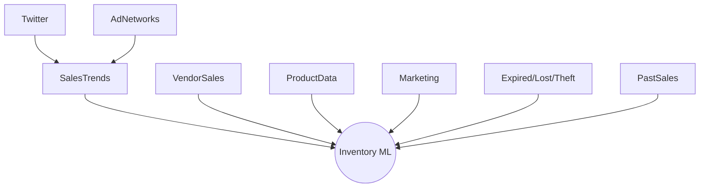
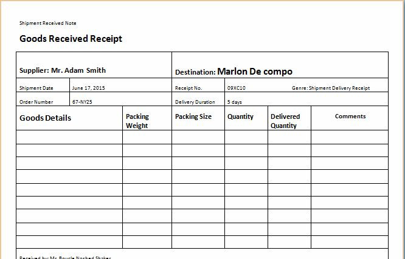
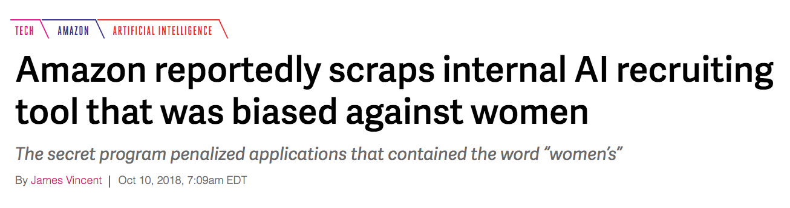

# Data Quality


> "Data cleaning and repairing account for about 60% of the work of data scientists."


Christian Kaestner


<!-- references -->

Required reading:
* Sambasivan, N., Kapania, S., Highfill, H., Akrong, D., Paritosh, P., & Aroyo, L. M. (2021, May). “[Everyone wants to do the model work, not the data work”: Data Cascades in High-Stakes AI](https://dl.acm.org/doi/abs/10.1145/3411764.3445518). In Proceedings of the 2021 CHI Conference on Human Factors in Computing Systems (pp. 1-15).


Recommended reading: 
* Schelter, S., Lange, D., Schmidt, P., Celikel, M., Biessmann, F. and Grafberger, A., 2018. [Automating large-scale data quality verification](http://www.vldb.org/pvldb/vol11/p1781-schelter.pdf). Proceedings of the VLDB Endowment, 11(12), pp.1781-1794.
* Nick Hynes, D. Sculley, Michael Terry. "[The Data Linter: Lightweight Automated Sanity Checking for ML Data Sets](http://learningsys.org/nips17/assets/papers/paper_19.pdf)."  NIPS Workshop on ML Systems (2017)

----
## Administrativa: Midterm

* Midterm in 1 week
* During lecture, 80 min, here
* Answer questions related to a given scenario
* All lecture content, reading, recitations in scope -- focus on topics you had opportunity to practice 
* No electronics, can bring 6 pages notes on paper (handwritten or typed, both sides)
* Old midterms online, see course webpage

----
## Administrativa: Homework I3

* Open ended: Try a tool and write a blog post about it
* Any tool related to building ML-enabled systems
	* Except: No pure ML frameworks
	* ML pipelines, data engineering, operations, ...
	* Open source, academic, or commercial; local or cloud
	* Also look for competitors of tools of interest
* Claim tool in Spreadsheet, first come first serve
* 1 week assignment (despite due in 3 weeks)
* Past tools: [Algorithmia](https://lvandenb.medium.com/a-gentle-introduction-to-algorithmia-397669d3cd9e), [Amazon Elastic MapReduce](https://sreenidhi-sundaram.medium.com/amazon-elastic-map-reduce-emr-to-scale-machine-learning-systems-5fc38be5ecd2), [Apache Flink](https://medium.com/@jundaa/a-quick-introduction-to-apache-flink-fc15ceada23), [Azure ML](https://qidiyang.medium.com/azure-ml-studio-movie-recommendation-using-azure-machine-learning-studio-with-matchbox-8ef535df1162), [Dask](https://hongkaij.medium.com/a-general-introduction-of-dask-7cf05e81398), [Databricks](https://sg-ecust.medium.com/databricks-data-engineering-on-the-cloud-daef343cfbf1), [DataRobot](https://lnatraj.medium.com/data-robot-5a0efa279d48), [Google Cloud AutoML](https://docherpap.medium.com/build-your-machine-learning-model-in-minutes-with-automl-eb5c5f68d4fa), [IBM Watson Studio](https://kingofasia.medium.com/simplifying-ai-and-machine-learning-with-ibm-watson-studio-6ddc6af0791), [LaunchDarkly](https://martamendez.medium.com/ship-fast-and-rest-easy-feature-management-by-launchdarkly-b23752f52835), [Metaflow](https://github.com/tashee/MetaFlowProj/blob/main/Metaflow-2.pdf), [Pycaret](https://yichengb.medium.com/pycaret-low-code-machine-learning-library-that-accelerates-model-building-pipeline-295d0b9d1d3), [Split.io](https://ganeshkrishna2396.medium.com/faster-deployment-and-testing-using-feature-toggling-techniques-split-io-829e3797ee69), [TensorBoard](https://clive-gomes.medium.com/visualizing-with-tensorboard-96b013f3d931), [Weights and Biases](https://goyalmansi.medium.com/weights-biases-developer-tools-for-machine-learning-40ff7ed53057), [Amazon Sagemaker](https://medium.com/@jackyzou1997/a-gentle-introduction-to-aws-sagemaker-ml-ai-on-the-cloud-de8dd0191818), [Apache Airflow](https://medium.com/balancing-lines/automating-data-pipeline-using-apache-airflow-444e695181e9), [Apache Flume](https://wenfeiy.medium.com/a-gentle-introduction-toapache-flume-1ce715475129), [Apache Hadoop](https://medium.com/@sanshang/first-try-on-apache-hadoop-fe24aee66665), [Apache Spark](https://medium.com/@abellamk/apache-spark-with-pyspark-a-step-by-step-approach-2448a1216cd9), [Auto-Surprise](https://wangxingchen2930.medium.com/auto-surprise-automates-algorithm-and-hyperparameter-tuning-ee8f01b9f354), [BentoML](https://medium.com/@maahin_beri/using-bentoml-to-serve-scikit-models-10f54c29dfc9), [CML](https://medium.com/@karthik.vaithyanathan/using-continuous-machine-learning-to-run-your-ml-pipeline-eeeeacad69a3), [Cortex](https://medium.com/@nsgupta.vivek/model-deployment-automation-with-cortex-45c48aaed063), [DVC](https://medium.com/@nwest_7200/a-brief-introduction-to-data-version-control-dvc-82ec5ee76c2b), [Grafana](https://zexuannotes.com/using-grafana-prometheus-and-postgresql/), [Great Expectations](http://wordpress.com/2020/10/29/what-to-expect-with-great-expectations/), [Holoclean](https://medium.com/@jacob.tanenbaum/a-first-look-at-holoclean-205ca7c71369), [Kedro](https://prathit-p.medium.com/kedro-software-engineering-principles-for-data-science-6eced3cc3390), [Kubeflow](https://trungdcn.medium.com/kubeflow-managing-the-whole-machine-learningcycle-c9e6a6149d91), [Kubernetes](https://medium.com/@mazzottacraig/deploying-a-flask-application-with-kubernetes-8a491c220b59), [Luigi](https://jimmdd.medium.com/exploring-spotifys-luigi-to-build-etl-pipeline-97309dc01fd9), [MLflow](https://medium.com/@kevin.n.lu123/mlflow-managing-your-ml-pipeline-from-training-to-deployment-7e0d87df9d), [ModelDB](https://medium.com/@songrcs/versioning-your-dataset-and-models-using-modeldb-10b0ee3873ed), [Neo4j](https://medium.com/@mohonisc/recommendation-system-with-neo4j-graph-database-f111ff377d07?sk=83eb1f72f810fea61fbb03df94e1459e), [pydqc](https://psbbvishal.medium.com/pydqc-eda-done-in-one-command-86ca8fca791f), [Snorkel](https://medium.com/@FanglinChen/snorkel-for-recommendation-system-3f7c10cbdb82), [TensorFlow Lite](https://medium.com/tensorflow-lite-for-android/exploring-tensorflow-lite-for-android-aca0e0c82ba), [TPOT](https://medium.com/@daniel.biales/automl-taking-tpot-to-the-movies-cf7e6f67f876?sk=6737cdd9d4cf2ff3c7322ee25f80fe70)
* *17-745 students: Research project instead, contact us now*

---

# Learning Goals

* Distinguish precision and accuracy; understanding the better models vs more data tradeoffs
* Use schema languages to enforce data schemas
* Design and implement automated quality assurance steps that check data schema conformance and distributions 
* Devise infrastructure for detecting data drift and schema violations
* Consider data quality as part of a system; design an organization that values data quality


---

# Data-Quality Challenges

----

> Data cleaning and repairing account for about 60% of the work of data scientists.


<!-- references -->
Quote: Gil Press. “[Cleaning Big Data: Most Time-Consuming, Least Enjoyable Data Science Task, Survey Says](https://www.forbes.com/sites/gilpress/2016/03/23/data-preparation-most-time-consuming-least-enjoyable-data-science-task-survey-says/).” Forbes Magazine, 2016.


----
## Case Study: Inventory Management


<!-- .element: class="stretch" -->


----
## Data Comes from Many Sources

* Manually entered
* Actions from IT systems
* Logging information, traces of user interactions
* Sensor data
* Crowdsourced 


----
## Many Data Sources



*sources of different reliability and quality*


----
## Inventory Database

Product Database:

| ID | Name | Weight | Description | Size | Vendor |
| - |  - |  - |  - |  - | - | 
| ... |  ... |  ... |  ... |  ... |  ... | 

Stock:

| ProductID | Location | Quantity |
| - |  - |  - |
| ... |  ... |  ... |

Sales history:

| UserID | ProductId | DateTime | Quantity | Price | 
| - |  - |  - | - |- |
| ... |  ... |  ... |... |... |


----
## *Raw Data* is an Oxymoron




<!-- references -->
Recommended Reading: Gitelman, Lisa, Virginia Jackson, Daniel Rosenberg, Travis D. Williams, Kevin R. Brine, Mary Poovey, Matthew Stanley et al. "[Data bite man: The work of sustaining a long-term study](https://ieeexplore.ieee.org/abstract/document/6462156)." In "Raw Data" Is an Oxymoron, (2013), MIT Press: 147-166.

----
## What makes good quality data?

* Accuracy
  * The data was recorded correctly.
* Completeness
  * All relevant data was recorded.
* Uniqueness
  * The entries are recorded once.
* Consistency
  * The data agrees with itself.
* Timeliness
  * The data is kept up to date.

----
## Data is noisy

* Unreliable sensors or data entry
* Wrong results and computations, crashes
* Duplicate data, near-duplicate data
* Out of order data
* Data format invalid
*
* **Examples in inventory system?**

----
## Data changes

* System objective changes over time
* Software components are upgraded or replaced
* Prediction models change
* Quality of supplied data changes
* User behavior changes
* Assumptions about the environment no longer hold
*
* **Examples in inventory system?**

----
## Users may deliberately change data

* Users react to model output
* Users try to game/deceive the model
*
* **Examples in inventory system?**

----
## Accuracy vs Precision

* Accuracy: Reported values (on average) represent real value
* Precision: Repeated measurements yield the same result
* 
* Accurate, but imprecise: Average over multiple measurements
* Inaccurate, but precise: Systematic measurement problem, misleading

<!-- split -->


(CC-BY-4.0 by [Arbeck](https://commons.wikimedia.org/wiki/File:Accuracy_and_Precision.svg))

<!-- ---- -->
<!-- ## Accuracy and Precision in Training Data? -->

<!--  -->
<!-- <\!-- .element: class="stretch" -\-> -->


----
## Data Quality and Machine Learning

* More data -> better models (up to a point, diminishing effects)
* Noisy data (imprecise) -> less confident models, more data needed 
  * some ML techniques are more or less robust to noise (more on robustness in a later lecture)
* Inaccurate data -> misleading models, biased models
* 
* Need the "right" data
* Invest in data quality, not just quantity


---
# Poor Data Quality has Consequences

(often delayed consequences)

----
## Example: Systematic bias in labeling

* Poor data quality leads to poor models
* Not detectable in offline evaluation
* Problem in production -- now difficult to correct



----
## Delayed Fixes increase Repair Cost


----
## Data Cascades


Detection almost always delayed! Expensive rework.

Difficult to detect in offline evaluation.

<!-- references -->
Sambasivan, N., Kapania, S., Highfill, H., Akrong, D., Paritosh, P., & Aroyo, L. M. (2021, May). “[Everyone wants to do the model work, not the data work”: Data Cascades in High-Stakes AI](https://dl.acm.org/doi/abs/10.1145/3411764.3445518). In Proceedings of the 2021 CHI Conference on Human Factors in Computing Systems (pp. 1-15).


<!-- --- -->
<!-- # Exploratory Data Analysis -->

<!-- ---- -->
<!-- ## Exploratory Data Analysis in Data Science -->

<!-- * Before learning, understand the data -->
<!-- * Understand types, ranges, distributions -->
<!-- * Important for understanding data and assessing quality -->
<!-- * Plot data distributions for features -->
<!--   - Visualizations in a notebook -->
<!--   - Boxplots, histograms, density plots, scatter plots, ... -->
<!-- * Explore outliers -->
<!-- * Look for correlations and dependencies -->
<!--   - Association rule mining -->
<!--   - Principal component analysis -->

<!-- Examples: https://rpubs.com/ablythe/520912 and https://towardsdatascience.com/exploratory-data-analysis-8fc1cb20fd15 -->

<!-- ---- -->
<!-- ## SE Perspective: Understanding Data for Quality Assurance -->

<!-- * Understand input and output data -->
<!-- * Understand expected distributions -->
<!-- * Understand assumptions made on data for modeling -->
<!--   - ideally document those -->
<!-- * Check assumptions at runtime -->


---

# Data Schema

Ensuring basic consistency about shape and types


----
## Dirty Data: Example


*Problems with the data?*


----


<!-- references -->

Source: Rahm, Erhard, and Hong Hai Do. [Data cleaning: Problems and current approaches](http://dc-pubs.dbs.uni-leipzig.de/files/Rahm2000DataCleaningProblemsand.pdf). IEEE Data Eng. Bull. 23.4 (2000): 3-13.


----
## Schema Problems 

* Illegal attribute values: `bdate=30.13.70`
* Violated attribute dependencies: `age=22, bdate=12.02.70`
* Uniqueness violation: `(name=”John Smith”, SSN=”123456”), (name=”Peter Miller”, SSN=”123456”)`
* Referential integrity violation: `emp=(name=”John Smith”, deptno=127)` if department 127 not defined

<!-- references -->

Further readings: Rahm, Erhard, and Hong Hai Do. [Data cleaning: Problems and current approaches](http://dc-pubs.dbs.uni-leipzig.de/files/Rahm2000DataCleaningProblemsand.pdf). IEEE Data Eng. Bull. 23.4 (2000): 3-13.


----
## Data Schema

* Define expected format of data
  * expected fields and their types
  * expected ranges for values
  * constraints among values (within and across sources)
* Data can be automatically checked against schema
* Protects against change; explicit interface between components


----
## Schema in Relational Databases

```sql
CREATE TABLE employees (
    emp_no      INT             NOT NULL,
    birth_date  DATE            NOT NULL,
    name        VARCHAR(30)     NOT NULL,
    PRIMARY KEY (emp_no));
CREATE TABLE departments (
    dept_no     CHAR(4)         NOT NULL,
    dept_name   VARCHAR(40)     NOT NULL,
    PRIMARY KEY (dept_no), UNIQUE  KEY (dept_name));
CREATE TABLE dept_manager (
   dept_no      CHAR(4)         NOT NULL,
   emp_no       INT             NOT NULL,
   FOREIGN KEY (emp_no)  REFERENCES employees (emp_no),
   FOREIGN KEY (dept_no) REFERENCES departments (dept_no),
   PRIMARY KEY (emp_no,dept_no)); 
```


----
## Which Problems are Schema Problems?


----
## What Happens When new Data Violates Schema?

<!-- discussion -->

----
## Schema-Less Data Exchange

* CSV files
* Key-value stores (JSon, XML, Nosql databases)
* Message brokers
* REST API calls
* R/Pandas Dataframes

```csv
1::Toy Story (1995)::Animation|Children's|Comedy
2::Jumanji (1995)::Adventure|Children's|Fantasy
3::Grumpier Old Men (1995)::Comedy|Romance
```

```csv
10|53|M|lawyer|90703
11|39|F|other|30329
12|28|F|other|06405
13|47|M|educator|29206
```

----
## Schema Library: Apache Avro

```json
{   "type": "record",
    "namespace": "com.example",
    "name": "Customer",
    "fields": [{
            "name": "first_name",
            "type": "string",
            "doc": "First Name of Customer"
        },        
        {
            "name": "age",
            "type": "int",
            "doc": "Age at the time of registration"
        }
    ]
}
```

----
## Schema Library: Apache Avro

* Schema specification in JSON format
* Serialization and deserialization with automated checking
* Native support in Kafka
* 
* Benefits
  * Serialization in space efficient format
  * APIs for most languages (ORM-like)
  * Versioning constraints on schemas
* Drawbacks
  * Reading/writing overhead
  * Binary data format, extra tools needed for reading
  * Requires external schema and maintenance
  * Learning overhead

Notes: Further readings eg https://medium.com/@stephane.maarek/introduction-to-schemas-in-apache-kafka-with-the-confluent-schema-registry-3bf55e401321, https://www.confluent.io/blog/avro-kafka-data/, https://avro.apache.org/docs/current/

----
## Many Schema Libraries/Formats

Examples
* Avro
* XML Schema
* Protobuf
* Thrift
* Parquet
* ORC

----
## Discussion: Data Schema Constraints for Inventory System?

Product Database:

| ID | Name | Weight | Description | Size | Vendor |
| - |  - |  - |  - |  - | - | 
| ... |  ... |  ... |  ... |  ... |  ... | 

Stock:

| ProductID | Location | Quantity |
| - |  - |  - |
| ... |  ... |  ... |

Sales history:

| UserID | ProductId | DateTime | Quantity | Price | 
| - |  - |  - | - |- |
| ... |  ... |  ... |... |... |


----
## Summary: Schema 

* Basic structure and type definition of data
* Well supported in databases and many tools
* Very low bar


---
# Instance-Level Problems

Inconsistencies, wrong values


----
## Dirty Data: Example


*Problems with the data beyond schema problems?*


----
## Instance-Level Problems


* Missing values: `phone=9999-999999`
* Misspellings: `city=Pittsburg`
* Misfielded values: `city=USA`
* Duplicate records: `name=John Smith, name=J. Smith`
* Wrong reference: `emp=(name=”John Smith”, deptno=127)` if department 127 defined but wrong

**Can we detect these?**


<!-- references -->

Further readings: Rahm, Erhard, and Hong Hai Do. [Data cleaning: Problems and current approaches](http://dc-pubs.dbs.uni-leipzig.de/files/Rahm2000DataCleaningProblemsand.pdf). IEEE Data Eng. Bull. 23.4 (2000): 3-13.


----
## Discussion: Instance-Level Problems in Scenario?


<!-- .element: class="stretch" -->


----
## Data Cleaning Overview

* Data analysis / Error detection
  * Usually focused on specific kind of problems, e.g., duplication, typos, missing values, distribution shift
  * Detection in input data vs detection in later stages (more context)
* Error repair
  * Repair data vs repair rules, one at a time or holistic
  * Data transformation or mapping
  * Automated vs human guided

----
## Error Detection Examples

* Illegal values: min, max, variance, deviations, cardinality
* Misspelling: sorting + manual inspection, dictionary lookup
* Missing values: null values, default values
* Duplication: sorting, edit distance, normalization

----
## Error Detection: Example


Q. Can we (automatically) detect errors? Which errors are problem-dependent?


----
## Example Tool: Great Expectations

```python
expect_column_values_to_be_between(
    column="passenger_count",
    min_value=1,
    max_value=6
)
```


<!-- .element: class="stretch" -->


https://greatexpectations.io/


----
## Data Quality Rules

* Invariants on data that must hold
* Typically about relationships of multiple attributes or data sources, eg.
  - ZIP code and city name should correspond
  - User ID should refer to existing user
  - SSN should be unique
  - For two people in the same state, the person with the lower income should not have the higher tax rate
* Classic integrity constraints in databases or conditional constraints
* Rules can be used to reject data or repair it

----
## Machine Learning for Detecting Inconsistencies


<!-- references -->
Image source: Theo Rekatsinas, Ihab Ilyas, and Chris Ré, “[HoloClean - Weakly Supervised Data Repairing](https://dawn.cs.stanford.edu/2017/05/12/holoclean/).” Blog, 2017.

----
## Example: HoloClean


* User provides rules as integrity constraints (e.g., "two entries with the same
name can't have different city")
* Detect violations of the rules in the data; also detect statistical outliers
* Automatically generate repair candidates (with probabilities)

<!-- references -->
Image source: Theo Rekatsinas, Ihab Ilyas, and Chris Ré, “[HoloClean - Weakly Supervised Data Repairing](https://dawn.cs.stanford.edu/2017/05/12/holoclean/).” Blog, 2017.

----
## Discovery of Data Quality Rules

+ Rules directly taken from external databases
  * e.g. zip code directory
+ Given clean data, 
  * several algorithms that find functional relationships ($X\Rightarrow Y$) among columns
  * algorithms that find conditional relationships (if $Z$ then $X\Rightarrow Y$)
  * algorithms that find denial constraints ($X$ and $Y$ cannot cooccur in a row)
+ Given mostly clean data (probabilistic view),
  * algorithms to find likely rules (e.g., association rule mining)
  * outlier and anomaly detection
+ Given labeled dirty data or user feedback,
  * supervised and active learning to learn and revise rules
  * supervised learning to learn repairs (e.g., spell checking)

<!-- references -->

Further reading: Ilyas, Ihab F., and Xu Chu. [Data cleaning](https://dl.acm.org/doi/book/10.1145/3310205). Morgan & Claypool, 2019.

----
## Association rule mining

* Sale 1: Bread, Milk
* Sale 2: Bread, Diaper, Beer, Eggs
* Sale 3: Milk, Diaper, Beer, Coke
* Sale 4: Bread, Milk, Diaper, Beer
* Sale 5: Bread, Milk, Diaper, Coke

Rules
* {Diaper, Beer} -> Milk (40% support, 66% confidence)
* Milk -> {Diaper, Beer} (40% support, 50% confidence)
* {Diaper, Beer} -> Bread (40% support, 66% confidence)

*(also useful tool for exploratory data analysis)*

<!-- references -->
Further readings: Standard algorithms and many variations, see [Wikipedia](https://en.wikipedia.org/wiki/Association_rule_learning)


<!-- ---- -->
<!-- ## Excursion: Daikon for dynamic detection of likely invariants -->

<!-- * Software engineering technique to find invariants -->
<!--   * e.g., `i>0`, `a==x`, `this.stack != null`, `db.query() after db.prepare()` -->
<!--   * Pre- and post-conditions of functions, local variables -->
<!-- * Uses for documentation, avoiding bugs, debugging, testing, verification, repair -->
<!-- * Idea: Observe many executions (instrument code), log variable values, look for relationships (test many possible invariants) -->
<!-- ---- -->
<!-- ## Daikon Example -->
<!-- <\!-- colstart -\-> -->
<!-- ```c -->
<!-- int ABS(int x) { -->
<!--     if (x>0) return x; -->
<!--     else return (x*(-1)); -->
<!-- } -->
<!-- int main () { -->
<!--     int i=0; -->
<!--     int abs_i; -->
<!--     for (i=-5000;i<5000;i++) -->
<!--         abs_i=ABS(i); -->
<!-- } -->
<!-- ``` -->

<!-- Expected: `Return value of ABS(x) == (x>0) ? x: -x;` -->
<!-- <\!-- col -\-> -->
<!-- ```text -->
<!-- ================== -->
<!-- std.ABS(int;):::ENTER -->
<!-- ================== -->
<!-- std.ABS(int;):::EXIT1 -->
<!-- x == return -->
<!-- ================== -->
<!-- std.ABS(int;):::EXIT2 -->
<!-- return == - x -->
<!-- ================== -->
<!-- std.ABS(int;):::EXIT -->
<!-- x == orig(x) -->
<!-- x <= return -->
<!-- ================== -->
<!-- ``` -->
<!-- <\!-- colend -\-> -->

<!-- Notes: many examples in https://www.cs.cmu.edu/~aldrich/courses/654-sp07/tools/kim-daikon-02.pdf -->


<!-- ---- -->
<!-- ## Probabilistic Repair -->

<!-- * Use rules to identify inconsistencies and the more likely fix -->
<!-- * If confidence high enough, apply automatically -->
<!-- * Show suggestions to end users (like spell checkers) or data scientists -->
<!-- * Many tools in this area -->

<!-- ---- -->
<!-- ## [HoloClean](http://www.holoclean.io/) -->

<!--  -->


<!-- [HoloClean: Data Quality Management with Theodoros Rekatsinas](https://softwareengineeringdaily.com/2020/06/02/holoclean-data-quality-management-with-theodoros-rekatsinas/), SEDaily Podcast, 2020 -->

----
## Discussion: Data Quality Rules in Inventory System


<!-- .element: class="stretch" -->
 


---

# Detecting Drift

----
## Monitoring for Changes


<!-- .element: class="stretch" -->

https://www.anomalo.com/
----


## Drift & Model Decay

* **Concept drift** (or concept shift)
  * properties to predict change over time (e.g., what is credit card fraud)
  * over time: different expected outputs for same inputs
  * model has not learned the relevant concepts
* **Data drift** (or covariate shift or population drift)
  * characteristics of input data changes (e.g., customers with face masks)
  * input data differs from training data 
  * over time: predictions less confident, further from training data
* **Upstream data changes**
  * external changes in data pipeline (e.g., format changes in weather service, new worker performing manual entry)
  * model interprets input data incorrectly
  * over time: abrupt changes due to faulty inputs

**How do we fix these drifts?**

Notes:
  * fix1: retrain with new training data or relabeled old training data
  * fix2: retrain with new data
  * fix3: fix pipeline, retrain entirely

----
## On Terminology

* Concept and data drift are separate concepts
* In practice and literature not always clearly distinguished
* Colloquially encompasses all forms of model degradations and environment changes
* Define term for target audience


----
## Breakout: Drift in the Inventory System

*What kind of drift might be expected?*

As a group, in slack `#lecture` write plausible example of:
* Concept Drift:
* Data Drift:
* Upstream data changes:


<!-- .element: class="stretch" -->


----
## Watch for Degradation in Prediction Accuracy


<!-- references -->
Image source: Joel Thomas and Clemens Mewald. [Productionizing Machine Learning: From Deployment to Drift Detection](https://databricks.com/blog/2019/09/18/productionizing-machine-learning-from-deployment-to-drift-detection.html). Databricks Blog, 2019


----
## Indicators of Concept Drift

*How to detect concept drift in production?*

<!-- discussion -->

----
## Indicators of Concept Drift

* Model degradations observed with telemetry
* Telemetry indicates different outputs over time for similar inputs
* Relabeling training data changes labels
* Interpretable ML models indicate rules that no longer fit

*(many papers on this topic, typically on statistical detection)*


----
## Dealing with Drift

* Regularly retrain model on recent data
  - Use evaluation in production to detect decaying model performance
* Involve humans when increasing inconsistencies detected
  - Monitoring thresholds, automation
* Monitoring, monitoring, monitoring!


----
## Different forms of Data Drift


* Structural drift
  * Data schema changes, sometimes by infrastructure changes
  * e.g., `4124784115` -> `412-478-4115`
* Semantic drift
  * Meaning of data changes, same schema
  * e.g., Netflix switches from 5-star to +/- rating, but still uses 1 and 5
* Distribution changes
  * e.g., credit card fraud differs to evade detection
  * e.g., marketing affects sales of certain items


<!-- .element: class="stretch" -->


----
## Detecting Data Drift

* Compare distributions over time (e.g., t-test)
* Detect both sudden jumps and gradual changes
* Distributions can be manually specified or learned (see invariant detection)

<!-- colstart -->

<!-- col -->

<!-- colend -->


----
## Data Distribution Analysis

* Plot distributions of features (histograms, density plots, kernel density estimation)
  - Identify which features drift
* Define distance function between inputs and identify distance to closest training data (eg., wasserstein and energy distance, see also kNN)
* Formal models for *data drift contribution* etc exist
* Anomaly detection and "out of distribution" detection
* Observe distribution of output labels

----
## Data Distribution Example

https://rpubs.com/ablythe/520912


----
## Microsoft Azure Data Drift Dashboard


<!-- references -->
Image source and further readings: [Detect data drift (preview) on models deployed to Azure Kubernetes Service (AKS)](https://docs.microsoft.com/en-us/azure/machine-learning/how-to-monitor-datasets?tabs=python)


----
## Breakout: Drift in the Inventory System

*What kind of monitoring for drift in Inventory scenario?*


<!-- .element: class="stretch" -->


---
# Data Quality is a System-Wide Concern


<!-- .element: class="plain" -->

----

> Everyone wants to do the model work, not the data work

<!-- references -->
Sambasivan, N., Kapania, S., Highfill, H., Akrong, D., Paritosh, P., & Aroyo, L. M. (2021, May). “[Everyone wants to do the model work, not the data work”: Data Cascades in High-Stakes AI](https://dl.acm.org/doi/abs/10.1145/3411764.3445518). In Proceedings of the 2021 CHI Conference on Human Factors in Computing Systems (pp. 1-15).

----
## Data flows across components


<!-- .element: class="plain" -->


----
## Data Quality is a System-Wide Concern

* Data flows across components
	* e.g., from user interface into database to crowd-sourced labeling team into ML pipeline
* Documentation at the interfaces is important
* Humans interacting with the system
	* Entering data
	* Labeling data
	* Observed with sensors/telemetry
	* Incentives, power structures, recognition
* Organizational practices
	* Value, attention, and resources given to data quality

----
## Data Quality Documentation

* Teams rarely document expectations of data quantity or quality
* Data quality tests are rare, but some teams adopt defensive monitoring
	* Local tests about assumed structure and distribution of data
	* Identify drift early and reach out to producing teams
* Several ideas for documenting distributions, including [Datasheets](https://dl.acm.org/doi/fullHtml/10.1145/3458723) and [Dataset Nutrition Label](https://arxiv.org/abs/1805.03677)
	* Mostly focused on static datasets, describing origin, consideration, labeling procedure, and distributions
	* [Example](https://dl.acm.org/doi/10.1145/3458723#sec-supp)

<!-- references -->
* Nahar, Nadia, Shurui Zhou, Grace Lewis, and Christian Kästner. “[Collaboration Challenges in Building ML-Enabled Systems: Communication, Documentation, Engineering, and Process](https://arxiv.org/abs/2110.10234).” In Proceedings of the 44th International Conference on Software Engineering (ICSE), May 2022.
* Gebru, Timnit, Jamie Morgenstern, Briana Vecchione, Jennifer Wortman Vaughan, Hanna Wallach, Hal Daumé Iii, and Kate Crawford. "[Datasheets for datasets](https://dl.acm.org/doi/fullHtml/10.1145/3458723)." Communications of the ACM 64, no. 12 (2021): 86-92.

----
## Common Data Cascades

* Interacting with physical world brittleness
	* Idealized data, ignoring realities and change of real-world data
	* Static data, one time learning mindset, no planning for evolution
* Inadequate domain expertise
	* Not understanding the data and its context
	* Involving experts only late for trouble shooting
* Conflicting reward systems
	* Missing incentives for data quality
	* Not recognizing data quality importance, discard as technicality
	* Missing data literacy with partners
* Poor (cross-organizational) documentation
	* Conflicts at team/organization boundary
	* Undetected drift


<!-- references -->
Sambasivan, N., Kapania, S., Highfill, H., Akrong, D., Paritosh, P., & Aroyo, L. M. (2021, May). “[Everyone wants to do the model work, not the data work”: Data Cascades in High-Stakes AI](https://dl.acm.org/doi/abs/10.1145/3411764.3445518). In Proceedings of the 2021 CHI Conference on Human Factors in Computing Systems (pp. 1-15).


----
## Discussion: Possible Data Cascades in Inventory Scenario?

* Interacting with physical world brittleness
* Inadequate domain expertise
* Conflicting reward systems
* Poor (cross-organizational) documentation


<!-- .element: class="stretch" -->


----
## Ethics and Politics of Data

> Raw data is an oxymoron

<!-- discussion -->

----
## Incentives for Data Quality? Valuing Data Work?

<!-- discussion -->


---
# Quality Assurance for the Data Processing Pipelines

----
## Error Handling and Testing in Pipeline

Avoid silent failures!

* Write testable data acquisition and feature extraction code
* Test this code (unit test, positive and negative tests)
* Test retry mechanism for acquisition + error reporting
* Test correct detection and handling of invalid input
* Catch and report errors in feature extraction
* Test correct detection of data drift
* Test correct triggering of monitoring system
* Detect stale data, stale models

*More in a later lecture.*


---
# Bonus: Data Linter

<!-- references -->
Further readings: Nick Hynes, D. Sculley, Michael Terry. "[The Data Linter: Lightweight Automated Sanity Checking for ML Data Sets](http://learningsys.org/nips17/assets/papers/paper_19.pdf)."  NIPS Workshop on ML Systems (2017)
----
## Excursion: Static Analysis and Code Linters

*Automate routine inspection tasks*

```js
if (user.jobTitle = "manager") {
   ...
}
```

```js
function fn() {
    x = 1;
    return x;
    x = 3; // dead code
}
```

```java
PrintWriter log = null;
if (anyLogging) log = new PrintWriter(...);
if (detailedLogging) log.println("Log started");
```

----
## Static Analysis

* Analyzes the structure/possible executions of the code, without running it
* Different levels of sophistication
  * Simple heuristic and code patterns (linters)
  * Sound reasoning about all possible program executions
* Tradeoff between false positives and false negatives
* Often supporting annotations needed (e.g., `@Nullable`)
* Tools widely available, open source and commercial


----
## A Linter for Data?

<!-- discussion -->

----
## Data Linter at Google

* Miscoding
    * Number, date, time as string
    * Enum as real
    * Tokenizable string (long strings, all unique)
    * Zip code as number
* Outliers and scaling
    * Unnormalized feature (varies widely)
    * Tailed distributions
    * Uncommon sign
* Packaging
    * Duplicate rows
    * Empty/missing data

<!-- references -->
Further readings: Hynes, Nick, D. Sculley, and Michael Terry. [The data linter: Lightweight, automated sanity checking for ML data sets](http://learningsys.org/nips17/assets/papers/paper_19.pdf). NIPS MLSys Workshop. 2017.


---
# Summary

* Data and data quality are essential
* Data from many sources, often inaccurate, imprecise, inconsistent, incomplete, ... -- many different forms of data quality problems 
* Many mechanisms for enforcing consistency and cleaning 
  * Data schema ensures format consistency
  * Data quality rules ensure invariants across data points
* Concept and data drift are key challenges -- monitor
* Data quality is a system-level concern
  * Data quality at the interface between components
  * Documentation and monitoring often poor
  * Involves organizational structures, incentives, ethics, ...
* Quality assurance for the data processing pipelines
