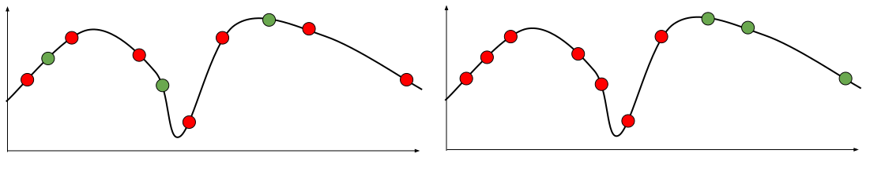
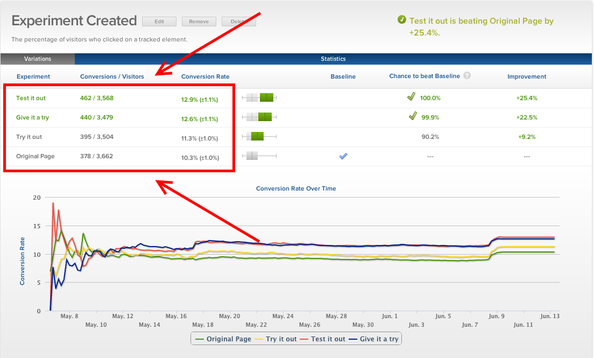

# Quality Assessment in Production

Christian Kaestner


<!-- references -->

Required Reading: Alec Warner and Štěpán Davidovič. "[Canary Releases](https://landing.google.com/sre/workbook/chapters/canarying-releases/)." in [The Site Reliability Workbook](https://landing.google.com/sre/books/), O'Reilly 2018

Suggested Reading: Georgi Georgiev. “[Statistical Significance in A/B Testing – a Complete Guide](http://blog.analytics-toolkit.com/2017/statistical-significance-ab-testing-complete-guide/#noninf).” Blog 2018

----

<div class="tweet" data-src="https://twitter.com/changelog/status/1137359428632621060"></div>


---
## Learning Goals

* Design telemetry for evaluation in practice
* Plan and execute experiments (chaos, A/B, shadow releases, ...) in production
* Conduct and evaluate multiple concurrent A/B tests in a system
* Perform canary releases
* Examine experimental results with statistical rigor
* Support data scientists with monitoring platforms providing insights from production data


---
# Recall: Model Quality

----
## Confusion/Error Matrix

| | **Actually A** | **Actually B** | **Actually C** |
| :--- | --- | --- | --- |
|**AI predicts A** | **10** | 6 | 2 |
|**AI predicts B** | 3 | **24**  | 10 |
|**AI predicts C** | 5 | 22 | **82** |

Accuracy = correct predictions (diagonal) out of all predictions

Example's accuracy 
        = $\frac{10+24+82}{10+6+2+3+24+10+5+22+82} = .707$

----
## Area Under the Curve

Turning numeric prediction into classification with threshold ("operating point")


----
## Detecting Overfitting

Change hyperparameter to detect training accuracy (blue)/validation accuracy (red) at different degrees of freedom


<!-- .element: class="stretch" -->


(CC SA 3.0 by [Dake](https://commons.wikimedia.org/wiki/File:Overfitting.png))


----
## Separate Training, Validation and Test Data

Often a model is "tuned" manually or automatically on a validation set (hyperparameter optimization)

In this case, we can overfit on the validation set, separate test set is needed for final evaluation


```scala
train_xs, train_ys, valid_xs, valid_ys, test_xs, test_ys = 
            split(all_xs, all_ys)

best_model = null
best_model_accuracy = 0
for (hyperparameters in candidate_hyperparameters) 
  candidate_model = learn(train_xs, train_ys, hyperparameter)
  model_accuracy = accuracy(model, valid_xs, valid_ys)  
  if (model_accuracy > best_model_accuracy) 
    best_model = candidate_model
    best_model_accuracy = model_accuracy

accuracy_test = accuracy(model, test_xs, test_ys)
```

----
## Violating Independence of Test Data



 

Note: Many examples:
* Stock prediction (trained on future data)
* Detecting distracted drivers (multiple pictures per driver)
* Detecting horse breeds (copyright marks)
* Detecting severity of cancer (different scanners)
* Detecting tanks in photographs (sunny vs cloudy days)
* Left steering on rainy days of self-driving cars (cloudy skies)

----
## Validation Data Representative?

* Validation data should reflect usage data
* Be aware of data drift (face recognition during pandemic, new patterns in credit card fraud detection)
* "*Out of distribution*" predictions often low quality (it may even be worth to detect out of distribution data in production, more later)


----
## Academic Escalation: Overfitting on Benchmarks


[](overfitting-benchmarks.png)
<!-- .element: class="stretch" -->

(Figure by Andrea Passerini)


---
# Model Assessment in Production

Ultimate held-out evaluation data: Unseen real user data

----
## Identify Feedback Mechanism in Production 

* Live observation in the running system
* Potentially on subpopulation (AB testing)
* Need telemetry to evaluate quality -- challenges:
    - Gather feedback without being intrusive (i.e., labeling outcomes), harming user experience
    - Manage amount of data
    - Isolating feedback for specific AI component + version

----
## Discuss how to collect feedback

* Was the house price predicted correctly?
* Did the profanity filter remove the right blog comments?
* Was there cancer in the image?
* Was a Spotify playlist good?
* Was the ranking of search results good?
* Was the weather prediction good?
* Was the translation correct?
* Did the self-driving car break at the right moment? Did it detect the pedestriants?

<!-- discussion -->

Notes: More:
* SmartHome: Does it automatically turn of the lights/lock the doors/close the window at the right time?
* Profanity filter: Does it block the right blog comments?
* News website: Does it pick the headline alternative that attracts a user’s attention most?
* Autonomous vehicles: Does it detect pedestrians in the street?


----

<!-- split -->


Notes:
Expect only sparse feedback and expect negative feedback over-proportionally

----


Notes: Can just wait 7 days to see actual outcome for all predictions
----


Notes: Clever UI design allows users to edit transcripts. UI already highlights low-confidence words, can 

----
## Manually Label Production Samples

Similar to labeling learning and testing data, have human annotators


----
## Measuring Model Quality with Telemetry

* Three steps:
    - Metric: Identify quality of concern
    - Telemetry: Describe data collection procedure
    - Operationalization: Measure quality metric in terms of data
* Telemetry can provide insights for correctness
    - sometimes very accurate labels for real unseen data
    - sometimes only mistakes
    - sometimes delayed
    - often just samples
    - often just weak proxies for correctness
* Often sufficient to approximate precision/recall or other measures
* Mismatch to (static) evaluation set may indicate stale or unrepresentative data
* Trend analysis can provide insights even for inaccurate proxy measures

----
## Monitoring Model Quality in Production

* Monitor model quality together with other quality attributes (e.g., uptime, response time, load)
* Set up automatic alerts when model quality drops
* Watch for jumps after releases
    - roll back after negative jump
* Watch for slow degradation
    - Stale models, data drift, feedback loops, adversaries
* Debug common or important problems
    - Monitor characteristics of requests 
    - Mistakes uniform across populations?
    - Challenging problems -> refine training, add regression tests

----
## Prometheus and Grafana

[](https://prometheus.io/docs/introduction/overview/)

----


----
## Many commercial solutions

[](https://www.datarobot.com/platform/mlops/)

<!-- references -->
e.g. https://www.datarobot.com/platform/mlops/

Many pointers: Ori Cohen "[Monitor! Stop Being A Blind Data-Scientist.](https://towardsdatascience.com/monitor-stop-being-a-blind-data-scientist-ac915286075f)" Blog 2019
----
## Engineering Challenges for Telemetry


----
## Engineering Challenges for Telemetry
* Data volume and operating cost
    - e.g., record "all AR live translations"?
    - reduce data through sampling
    - reduce data through summarization (e.g., extracted features rather than raw data; extraction client vs server side)
* Adaptive targeting
* Biased sampling
* Rare events
* Privacy
* Offline deployments?

----
## Exercise: Design Telemetry in Production

*Scenario: Injury detection in smart home workout (laptop camera)*

Discuss: Quality measure, telemetry, operationalization, false positives/negatives, cost, privacy, rare events


---
# Experimenting in Production

* A/B experiments
* Shadow releases / traffic teeing
* Blue/green deployment
* Canary releases
* Chaos experiments


----
<div class="tweet" data-src="https://twitter.com/changelog/status/1137359428632621060"></div>


---
# A/B experiments
----
## What if...?
 
* ... we hand plenty of subjects for experiments
* ... we could randomly assign subjects to treatment and control group without them knowing
* ... we could analyze small individual changes and keep everything else constant


▶ Ideal conditions for controlled experiments


----
## A/B Testing for Usability

* In running system, random sample of X users are shown modified version
* Outcomes (e.g., sales, time on site) compared among groups


Notes: Picture source: https://www.designforfounders.com/ab-testing-examples/

----


Notes: Picture source: https://www.designforfounders.com/ab-testing-examples/

----
## A/B Experiment for AI Components?

* New product recommendation algorithm for web store?
* New language model in audio transcription service?
* New (offline) model to detect falls on smart watch

<!-- discussion -->

----
## Experiment Size

* With enough subjects (users), we can run many many experiments
* Even very small experiments become feasible
* Toward causal inference


----

## Implementing A/B Testing

* Implement alternative versions of the system
    * using feature flags (decisions in implementation)
    * separate deployments (decision in router/load balancer)
* Map users to treatment group
    * Randomly from distribution
    * Static user - group mapping
    * Online service (e.g., [launchdarkly](https://launchdarkly.com/), [split](https://www.split.io/))
* Monitor outcomes *per group*
    * Telemetry, sales, time on site, server load, crash rate

----
## Feature Flags

```java
if (features.enabled(userId, "one_click_checkout") {
     // new one click checkout function
} else {
     // old checkout functionality
}
```

* Boolean options
* Good practices: tracked explicitly, documented, keep them localized and independent
* External mapping of flags to customers
    * who should see what configuration
    * e.g., 1% of users sees `one_click_checkout`, but always the same users; or 50% of beta-users and 90% of developers and 0.1% of all users

----

<!-- .element: class="stretch" --> 


---
# Confidence in A/B experiments

(statistical tests)

----

## Comparing Averages

<!-- colstart -->
**Group A**

*classic personalized content recommendation model*

2158 Users

average 3:13 min time on site

<!-- col -->

**Group B**

*updated personalized content recommendation model*

10 Users

average 3:24 min time on site

<!-- colend -->
----
## Comparing Distributions


----
## Different effect size, same deviations

<!-- colstart -->

<!-- col -->

<!-- colend -->

----
## Same effect size, different deviations

<!-- colstart -->

<!-- col -->

<!-- colend -->

Less noise --> Easier to recognize


----

## Dependent vs. independent measurements

* Pairwise (dependent) measurements
    * Before/after comparison
    * With same benchmark + environment
    * e.g., new operating system/disc drive faster
* Independent measurements
    * Repeated measurements
    * Input data regenerated for each measurement

----
## Significance level
* Statistical change of an error
* Define before executing the experiment
    * use commonly accepted values
    * based on cost of a wrong decision
* Common:
    * 0.05 significant
    * 0.01 very significant
* Statistically significant result =!> proof
* Statistically significant result =!> important result
* Covers only alpha error (more later)

----

## Intuition: Error Model
* 1 random error, influence +/- 1
* Real mean: 10
* Measurements: 9 (50%) und 11 (50%)
*
* 2 random errors, each +/- 1
* Measurements: 8 (25%), 10 (50%) und 12 (25%)
* 
* 3 random errors, each +/- 1
* Measurements : 7 (12.5%), 9 (37.5), 11 (37.5), 12 (12.5)
----
<iframe src='https://gfycat.com/ifr/PleasingMeaslyGalapagossealion' frameborder='0' scrolling='no' allowfullscreen width='640' height='524'></iframe>
----
## Normal Distribution


<!-- references -->
(CC 4.0 [D Wells](https://commons.wikimedia.org/wiki/File:Standard_Normal_Distribution.png))
----
## Confidence Intervals

----
## Comparison with Confidence Intervals

 
<!-- references -->
Source: Andy Georges, Dries Buytaert, and Lieven Eeckhout. 2007. [Statistically rigorous java performance evaluation](https://dri.es/files/oopsla07-georges.pdf). In Proc. Conference on Object-Oriented Programming Systems and Applications (OOPSLA '07). ACM, 57-76.
----
# t-test

```r
> t.test(x, y, conf.level=0.9)

        Welch Two Sample t-test

t = 1.9988, df = 95.801, p-value = 0.04846
alternative hypothesis: true difference in means is 
not equal to 0 
90 percent confidence interval:
 0.3464147 3.7520619 
sample estimates:
mean of x mean of y 
 51.42307  49.37383 

> # paired t-test:
> t.test(x-y, conf.level=0.9)
```
----

<!-- references -->
Source: https://conversionsciences.com/ab-testing-statistics/
----

<!-- references -->
Source: https://cognetik.com/why-you-should-build-an-ab-test-dashboard/
----
## How many samples needed?
<!-- colstart -->
**Too few?**

<!-- Noise and random results -->
<!-- col -->
**Too many?**

<!-- Risk of spreading bad designs -->
<!-- colend -->


<!-- discussion -->


---
# A/B testing automation

* Experiment configuration through DSLs/scripts
* Queue experiments
* Stop experiments when confident in results
* Stop experiments resulting in bad outcomes (crashes, very low sales)
* Automated reporting, dashboards

<!-- references -->

Further readings:
* Tang, Diane, et al. [Overlapping experiment infrastructure: More, better, faster experimentation](https://ai.google/research/pubs/pub36500.pdf). Proceedings of the 16th ACM SIGKDD international conference on Knowledge discovery and data mining. ACM, 2010. (Google)
* Bakshy, Eytan, Dean Eckles, and Michael S. Bernstein. [Designing and deploying online field experiments](https://arxiv.org/pdf/1409.3174). Proceedings of the 23rd International Conference on World Wide Web. ACM, 2014. (Facebook)
----
## DSL for scripting A/B tests at Facebook
```java
button_color = uniformChoice(
    choices=['#3c539a', '#5f9647', '#b33316'],
    unit=cookieid);

button_text = weightedChoice(
    choices=['Sign up', 'Join now'],
    weights=[0.8, 0.2],
    unit=cookieid); 

if (country == 'US') {
    has_translate = bernoulliTrial(p=0.2, unit=userid);
} else {
    has_translate = bernoulliTrial(p=0.05, unit=userid);
}
```
<!-- references -->

Further readings:
* Bakshy, Eytan, Dean Eckles, and Michael S. Bernstein. [Designing and deploying online field experiments](https://arxiv.org/pdf/1409.3174). Proceedings of the 23rd International Conference on World Wide Web. ACM, 2014. (Facebook)
----
## Concurrent A/B testing

* Multiple experiments at the same time
    * Independent experiments on different populations -- interactions not explored
    * Multi-factorial designs, well understood but typically too complex, e.g., not all combinations valid or interesting
    * Grouping in sets of experiments

<!-- references -->

Further readings:
* Tang, Diane, et al. [Overlapping experiment infrastructure: More, better, faster experimentation](https://ai.google/research/pubs/pub36500.pdf). Proceedings of the 16th ACM SIGKDD international conference on Knowledge discovery and data mining. ACM, 2010. (Google)
* Bakshy, Eytan, Dean Eckles, and Michael S. Bernstein. [Designing and deploying online field experiments](https://arxiv.org/pdf/1409.3174). Proceedings of the 23rd International Conference on World Wide Web. ACM, 2014. (Facebook)


---
# Other Experiments in Production

* Shadow releases / traffic teeing
* Blue/green deployment
* Canary releases
* Chaos experiments


----
## Shadow releases / traffic teeing

* Run both models in parallel
* Report outcome of old model
* Compare differences between model predictions
* If possible, compare against ground truth labels/telemetry

**Examples?**

----
## Blue/green deployment

* Provision service both with old and new model (e.g., services)
* Support immediate switch with load-balancer
* Allows to undo release rapidly

**Advantages/disadvantages?**

----
## Canary Releases

* Release new version to small percentage of population (like A/B testing)
* Automatically roll back if quality measures degrade
* Automatically and incrementally increase deployment to 100% otherwise


<!-- .element: class="stretch" -->

----
## Chaos Experiments

[](https://en.wikipedia.org/wiki/Chaos_engineering)
<!-- .element: class="stretch" -->

----
## Chaos Experiments for AI Components?

<!-- discussion -->

Note: Artifically reduce model quality, add delays, insert bias, etc to test monitoring and alerting infrastructure


----
## Advice for Experimenting in Production

* Minimize *blast radius* (canary, A/B, chaos expr)
* Automate experiments and deployments
* Allow for quick rollback of poor models (continuous delivery, containers, loadbalancers, versioning)
* Make decisions with confidence, compare distributions
* Monitor, monitor, monitor


---


# Interacting with and supporting data scientists

<svg version="1.1" viewBox="0.0 0.0 800 400" xmlns:xlink="http://www.w3.org/1999/xlink" xmlns="http://www.w3.org/2000/svg">
        <style>
    text { font: 60px sans-serif; }
        </style>
        <circle r="180" cx="250", cy="200" fill="#b9ff00" fill-opacity="0.514" />
        <circle r="180" cx="550", cy="200" fill="#ff5500" fill-opacity="0.514" />
        <text x=230 y=160 dominant-baseline="middle" text-anchor="middle">Data</text>
        <text x=230 y=240 dominant-baseline="middle" text-anchor="middle">Scientists</text>
        <text x=570 y=160 dominant-baseline="middle" text-anchor="middle">Software</text>
        <text x=570 y=240 dominant-baseline="middle" text-anchor="middle">Engineers</text>
</svg>

----
## Let's Learn from DevOps


Distinct roles and expertise, but joint responsibilities, joint tooling

----
## Supporting Data Scientists

* From evaluating with static datasets to testing in production
* Provide CI/CD infrastructure for testing in production
    - make it easy to deploy and test models
* Provide access to telemetry data and dashboards
* Encourage modeling infrastructure and versioning beyond notebooks


----
## Exercise: Infrastructure Design 

*Scenario: Injury detection in smart home workout (laptop camera)*

Discuss: Deployment and infrastructure decisions for A/B experiments -- how to divide users, how to implement A/B testing, what access to give to data scientists?


---
# Summary

* Production data is ultimate unseen validation data
* Telemetry is key and challenging (design problem and opportunity)
* Monitoring and dashboards
* Many forms of experimentation and release (A/B testing, shadow releases, canary releases, chaos experiments, ...) to minimize "blast radius"
* Gain confidence in results with statistical tests
* DevOps-like infrastructure to support data scientists
