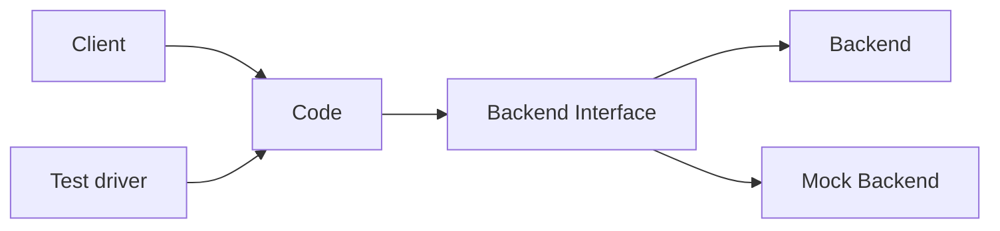

# Infrastructure Quality, Deployment, and Operations

Christian Kaestner

<!-- references -->

Required reading: Eric Breck, Shanqing Cai, Eric Nielsen, Michael Salib, D. Sculley. [The ML Test Score: A Rubric for ML Production Readiness and Technical Debt Reduction](https://research.google.com/pubs/archive/46555.pdf). Proceedings of IEEE Big Data (2017)

Recommended readings:  
* O'Leary, Katie, and Makoto Uchida. "[Common problems with Creating Machine Learning Pipelines from Existing Code](https://research.google/pubs/pub48984.pdf)." Proc. Third Conference on Machine Learning and Systems (MLSys) (2020).
* Larysa Visengeriyeva. [Machine Learning Operations - A Reading List](https://ml-ops.org/content/references.html), InnoQ 2020

---

# Learning Goals

* Implement and automate tests for all parts of the ML pipeline
* Understand testing opportunities beyond functional correctness
* Automate test execution with continuous integration
* Deploy a service for models using container infrastructure
* Automate common configuration management tasks
* Devise a monitoring strategy and suggest suitable components for implementing it
* Diagnose common operations problems
* Understand the typical concerns and concepts of MLOps

---
# Beyond Model and Data Quality
----
## Possible Mistakes in ML Pipelines


<!-- .element: class="plain" -->

Danger of "silent" mistakes in many phases

<!-- discussion -->

----
## Possible Mistakes in ML Pipelines

Danger of "silent" mistakes in many phases:

* Dropped data after format changes
* Failure to push updated model into production
* Incorrect feature extraction
* Use of stale dataset, wrong data source
* Data source no longer available (e.g web API)
* Telemetry server overloaded
* Negative feedback (telemtr.) no longer sent from app
* Use of old model learning code, stale hyperparameter
* Data format changes between ML pipeline steps

----
## Building Robust Pipeline Automation

* Support experimentation and evolution
    * Automate
    * Design for change
    * Design for observability
    * Testing the pipeline for robustness
* Thinking in pipelines, not models
* Integrating the Pipeline with other Components


<!-- .element: class="plain" -->

----
## Pipelines are Code

* From experimental notebook code to production code
* Each stage as a function or module
* Well tested in isolation and together
* Robust to changes in inputs (automatically adapt or crash, no silent mistakes)
* Use good engineering practices (version control, documentation, testing, naming, code review)

----
## Everything can be tested?

<!-- discussion -->

Notes: Many qualities can be tested beyond just functional correctness (for a specification). Examples: Performance, model quality, data quality, usability, robustness, ... not all tests are equality easy to automate
----
## Testing Strategies

* Performance
* Scalability
* Robustness
* Safety
* Security
* Extensibility
* Maintainability
* Usability

**How to test for these? How automatable?**


---
# Test Automation

----
## From Manual Testing to Continuous Integration

<!-- colstart -->

<!-- col -->

<!-- colend -->
----
## Unit Test, Integration Tests, System Tests


<!-- .element: class="plain" -->

Notes:

Software is developed in units that are later assembled. Accordingly we can distinguish different levels of testing.

Unit Testing - A unit is the "smallest" piece of software that a developer creates. It is typically the work of one programmer and is stored in a single file. Different programming languages have different units: In C++ and Java the unit is the class; in C the unit is the function; in less structured languages like Basic and COBOL the unit may be the entire program.

Integration Testing - In integration we assemble units together into subsystems and finally into systems. It is possible for units to function perfectly in isolation but to fail when integrated. For example because they share an area of the computer memory or because the order of invocation of the different methods is not the one anticipated by the different programmers or because there is a mismatch in the data types. Etc.

System Testing - A system consists of all of the software (and possibly hardware, user manuals, training materials, etc.) that make up the product delivered to the customer. System testing focuses on defects that arise at this highest level of integration. Typically system testing includes many types of testing: functionality, usability, security, internationalization and localization, reliability and availability, capacity, performance, backup and recovery, portability, and many more. 

Acceptance Testing - Acceptance testing is defined as that testing, which when completed successfully, will result in the customer accepting the software and giving us their money. From the customer's point of view, they would generally like the most exhaustive acceptance testing possible (equivalent to the level of system testing). From the vendor's point of view, we would generally like the minimum level of testing possible that would result in money changing hands.
Typical strategic questions that should be addressed before acceptance testing are: Who defines the level of the acceptance testing? Who creates the test scripts? Who executes the tests? What is the pass/fail criteria for the acceptance test? When and how do we get paid?


----
## Anatomy of a Unit Test

```java
import org.junit.Test;
import static org.junit.Assert.assertEquals;

public class AdjacencyListTest {
    @Test
    public void testSanityTest(){
        // set up
        Graph g1 = new AdjacencyListGraph(10);
        Vertex s1 = new Vertex("A");
        Vertex s2 = new Vertex("B");
        // check expected results (oracle)
        assertEquals(true, g1.addVertex(s1));
        assertEquals(true, g1.addVertex(s2));
        assertEquals(true, g1.addEdge(s1, s2));
        assertEquals(s2, g1.getNeighbors(s1)[0]);
    }

    // use abstraction, e.g. common setups
    private int helperMethod…
}
```

----
## Ingredients to a Test

* Specification
* 
* Controlled environment
* Test inputs (calls and parameters)
* Expected outputs/behavior (oracle)


----
## Unit Testing Pitfalls

* Working code, failing tests
* Smoke tests pass
* Works on my (some) machine(s)
* Tests break frequently

**How to avoid?**

----
## How to unit test component with dependency on other code?

<!-- discussion -->

----
## Example: Testing parts of a system


```java
Model learn() {
    Stream stream = openKafkaStream(...)
    DataTable output = getData(testStream, 
                               new DefaultCleaner());
    return Model.learn(output);
}
```


----
## Example: Using Test Data


```java
DataTable getData(Stream stream, DataCleaner cleaner) { ... }

@Test void test() {
    Stream stream = openKafkaStream(...)
    DataTable output = getData(testStream, 
                               new DefaultCleaner());
    assert(output.length==10)
}
```

----
## Example: Using Test Data


```java
DataTable getData(Stream stream, DataCleaner cleaner) { ... }
@Test void test() {
    Stream testStream = new Stream() {
        int idx = 0;
        // hardcoded or read from test file
        String[] data = [ ... ] 
        public void connect() { }
        public String getNext() {
            return data[++idx];
        }}
    DataTable output = getData(testStream, 
                               new DefaultCleaner());
    assert(output.length==10)
}
```

----
## Example: Mocking a DataCleaner Object

```java
DataTable getData(KafkaStream stream, DataCleaner cleaner){...}

@Test void test() {
    DataCleaner dummyCleaner = new DataCleaner() {
        boolean isValid(String row) { return true; }
        ...
    }
    DataTable output = getData(testStream, dummyCleaner);
    assert(output.length==10)
}
```
----
## Example: Mocking a DataCleaner Object

```java
DataTable getData(KafkaStream stream, DataCleaner cleaner){...}

@Test void test() {
    DataCleaner dummyCleaner = new DataCleaner() {
        int counter = 0;
        boolean isValid(String row) { 
            counter++;
            return counter!=3; 
        }
        ...
    }
    DataTable output = getData(testStream, dummyCleaner);
    assert(output.length==9)
}
```

Mocking frameworks provide infrastructure for expressing such tests compactly.


----





----
## Subtle Bugs in Data Wrangling Code

```python
df['Join_year'] = df.Joined.dropna().map(
    lambda x: x.split(',')[1].split(' ')[1])
```
```python
df.loc[idx_nan_age,'Age'].loc[idx_nan_age] = 
    df['Title'].loc[idx_nan_age].map(map_means)
```
```python
df["Weight"].astype(str).astype(int)
```
```python
df['Reviws'] = df['Reviews'].apply(int)
```
```python
df["Release Clause"] = 
    df["Release Clause"].replace(regex=['k'], value='000')
```
```python
df["Release Clause"] = 
    df["Release Clause"].astype(str).astype(float)
```

Notes:

1 attempting to remove na values from column, not table

2 loc[] called twice, resulting in assignment to temporary column only

3 astype() is not an in-place operation

4 typo in column name

5&6 modeling problem (k vs K)


----
## Tests for Data Wranging Code?

(data quality checks, data cleaning, feature engineering, ...)

<!-- discussion -->

----
## Modularizing and Testing Data Cleaning 

```python
def is_valid_row(row):
    try:
        datetime.strptime(row['date'], '%b %d %Y')
        return true
    except ValueError:
        return false

def clean_row(row):
    ...
```

```python
@test
def test_dates(self):
    self.assertTrue(is_valid_row(...))
    self.assertTrue(is_valid_row(...))
    self.assertFalse(is_valid_row(...))

@test
def test_date_cleaning(self):
    self.assertEquals(clean_row(...), ...)
```

----
## Modularize and Test Feature Encoding

```python
def encode_date(df):
    df.date_time = pd.to_datetime(df.date_time)
def encode_day_part(df):
    def daypart(hour):
        if hour in [2,3,4,5]:
            return "dawn"
        elif hour in [6,7,8,9]:
            return "morning"
        elif hour in [10,11,12,13]:
            return "noon"
        elif ...
    raw_dayparts = df.date_time.dt.hour.apply(daypart)
    return pd.get_dummies(raw_dayparts)
```

```python
@test
def test_day_part(self):
    ... 
```

----
## Test Error Handling


```java
@Test void test() {
    DataTable data = new DataTable();
    try {
        Model m = learn(data);
        Assert.fail();
    } catch (NoDataException e) { /* correctly thrown */ }
}
```

Notes: Code to test that the right exception is thrown


----
## Testing for Robustness

*manipulating the (controlled) environment: injecting errors into backend to test error handling*


```java
DataTable getData(Stream stream, DataCleaner cleaner) { ... }

@Test void test() {
    Stream testStream = new Stream() {
        ...
        public String getNext() {
            if (++idx == 3) throw new IOException();
            return data[++idx];
        }
    }
    DataTable output = retry(getData(testStream, ...));
    assert(output.length==10)
}
```


----
## Test Local Error Handling (Modular Protection)

```java
@Test void test() {
    Stream testStream = new Stream() {
        int idx = 0;
        public void connect() { 
            if (++idx < 3) throw new IOException(
                    "cannot establish connection")
        }
        public String getNext() { ... }
    }
    DataLoader loader = new DataLoader(testStream, 
                                       new DefaultCleaner());
    ModelBuilder model = new ModelBuilder(loader, ...);
    // assume all exceptions are handled correctly internally
    assert(model.accuracy > .91)
}
```

Notes: Test that errors are correctly handled within a module and do not leak


----


----
## Testable Code

* Think about testing when writing code
* Unit testing encourages you to write testable code
* Separate parts of the code to make them independently testable
* Abstract functionality behind interface, make it replaceable
*
* Test-Driven Development: A design and development method in which you write tests before you write the code


----
## Integration and system tests


----
## Integration and system tests

Test larger units of behavior

Often based on use cases or user stories -- customer perspective

```java
@Test void gameTest() {
    Poker game = new Poker();
    Player p = new Player();
    Player q = new Player();
    game.shuffle(seed)
    game.add(p);
    game.add(q);
    game.deal();
    p.bet(100);
    q.bet(100);
    p.call();
    q.fold();
    assert(game.winner() == p);
}

```

----
## Integration and system tests

Test larger units of behavior

Often based on use cases or user stories -- customer perspective

```java
@Test void testCleaningWithFeatureEng() {
    DataFrame d = loadTestData();
    DataFrame cd = clean(d);
    DataFrame f = feature3.encode(cd);
    assert(noMissingValues(f.getColumn("m")));
    assert(max(f.getColumn("m"))<=1.0);
}

```

----
## Build systems & Continuous Integration

* Automate all build, analysis, test, and deployment steps from a command line call
* Ensure all dependencies and configurations are defined
* Ideally reproducible and incremental
* Distribute work for large jobs
* Track results
*
* Key CI benefit: Tests are regularly executed, part of process

----


----
## Tracking Build Quality

Track quality indicators over time, e.g.,
* Build time
* Test coverage
* Static analysis warnings
* Performance results
* Model quality measures
* Number of TODOs in source code


----
[](https://blog.octo.com/en/jenkins-quality-dashboard-ios-development/)

<!-- references -->

Source: https://blog.octo.com/en/jenkins-quality-dashboard-ios-development/


----
## Tracking Model Qualities

Many tools: MLFlow, ModelDB, Neptune, TensorBoard, Weights & Biases, Comet.ml, ...


----
## ModelDB Example

```python
from verta import Client
client = Client("http://localhost:3000")

proj = client.set_project("My first ModelDB project")
expt = client.set_experiment("Default Experiment")

# log a training run
run = client.set_experiment_run("First Run")
run.log_hyperparameters({"regularization" : 0.5})
model1 = # ... model training code goes here
run.log_metric('accuracy', accuracy(model1, validationData))
```

----
## Test Monitoring

* Inject/simulate faulty behavior
* Mock out notification service used by monitoring
* Assert notification

```java
class MyNotificationService extends NotificationService {
    public boolean receivedNotification = false;
    public void sendNotification(String msg) { 
        receivedNotification = true; }
}
@Test void test() {
    Server s = getServer();
    MyNotificationService n = new MyNotificationService();
    Monitor m = new Monitor(s, n);
    s.stop();
    s.request(); s.request();
    wait();
    assert(n.receivedNotification);
}
```

----
## Test Monitoring in Production

* Like fire drills (manual tests may be okay!)
* Manual tests in production, repeat regularly
* Actually take down service or trigger wrong signal to monitor

----
## Chaos Testing


<!-- references -->

http://principlesofchaos.org

Notes: Chaos Engineering is the discipline of experimenting on a distributed system in order to build confidence in the system’s capability to withstand turbulent conditions in production. Pioneered at Netflix

----
## Chaos Testing Argument

* Distributed systems are simply too complex to comprehensively predict
* -> experiment on our systems to learn how they will behave in the presence of faults
* Base corrective actions on experimental results because they reflect real risks and actual events
*
* Experimentation != testing -- Observe behavior rather then expect specific results
* Simulate real-world problem in production (e.g., take down server, inject latency)
* *Minimize blast radius:* Contain experiment scope

----
## Netflix's Simian Army

<!-- smallish -->

Chaos Monkey: randomly disable production instances

Latency Monkey: induces artificial delays in our RESTful client-server communication layer

Conformity Monkey: finds instances that don’t adhere to best-practices and shuts them down

Doctor Monkey: monitors other external signs of health to detect unhealthy instances

Janitor Monkey: ensures that our cloud environment is running free of clutter and waste

Security Monkey: finds security violations or vulnerabilities, and terminates the offending instances

10–18 Monkey: detects problems in instances serving customers in multiple geographic regions

Chaos Gorilla is similar to Chaos Monkey, but simulates an outage of an entire Amazon availability zone.


----
## Chaos Toolkit

* Infrastructure for chaos experiments
* Driver for various infrastructure and failure cases
* Domain specific language for experiment definitions

```js
{
    "version": "1.0.0",
    "title": "What is the impact of an expired certificate on our application chain?",
    "description": "If a certificate expires, we should gracefully deal with the issue.",
    "tags": ["tls"],
    "steady-state-hypothesis": {
        "title": "Application responds",
        "probes": [
            {
                "type": "probe",
                "name": "the-astre-service-must-be-running",
                "tolerance": true,
                "provider": {
                    "type": "python",
                    "module": "os.path",
                    "func": "exists",
                    "arguments": {
                        "path": "astre.pid"
                    }
                }
            },
            {
                "type": "probe",
                "name": "the-sunset-service-must-be-running",
                "tolerance": true,
                "provider": {
                    "type": "python",
                    "module": "os.path",
                    "func": "exists",
                    "arguments": {
                        "path": "sunset.pid"
                    }
                }
            },
            {
                "type": "probe",
                "name": "we-can-request-sunset",
                "tolerance": 200,
                "provider": {
                    "type": "http",
                    "timeout": 3,
                    "verify_tls": false,
                    "url": "https://localhost:8443/city/Paris"
                }
            }
        ]
    },
    "method": [
        {
            "type": "action",
            "name": "swap-to-expired-cert",
            "provider": {
                "type": "process",
                "path": "cp",
                "arguments": "expired-cert.pem cert.pem"
            }
        },
        {
            "type": "probe",
            "name": "read-tls-cert-expiry-date",
            "provider": {
                "type": "process",
                "path": "openssl",
                "arguments": "x509 -enddate -noout -in cert.pem"
            }
        },
        {
            "type": "action",
            "name": "restart-astre-service-to-pick-up-certificate",
            "provider": {
                "type": "process",
                "path": "pkill",
                "arguments": "--echo -HUP -F astre.pid"
            }
        },
        {
            "type": "action",
            "name": "restart-sunset-service-to-pick-up-certificate",
            "provider": {
                "type": "process",
                "path": "pkill",
                "arguments": "--echo -HUP -F sunset.pid"
            },
            "pauses": {
                "after": 1
            }
        }
    ],
    "rollbacks": [
        {
            "type": "action",
            "name": "swap-to-vald-cert",
            "provider": {
                "type": "process",
                "path": "cp",
                "arguments": "valid-cert.pem cert.pem"
            }
        },
        {
            "ref": "restart-astre-service-to-pick-up-certificate"
        },
        {
            "ref": "restart-sunset-service-to-pick-up-certificate"
        }
    ]
}
```


<!-- references -->
http://principlesofchaos.org, https://github.com/chaostoolkit, https://github.com/Netflix/SimianArmy

----
## Chaos Experiments for ML Infrastructure?

<!-- discussion -->


Note: Fault injection in production for testing in production. Requires monitoring and explicit experiments.


---
# Code Review and Static Analysis

----
## Code Review

* Manual inspection of code
    - Looking for problems and possible improvements
    - Possibly following checklists
    - Individually or as group
* Modern code review: Incremental review at checking
    - Review individual changes before merging
    - Pull requests on GitHub
    - Not very effective at finding bugs, but many other benefits: knowledge transfer, code imporvement, shared code ownership, improving testing

----


----
## Subtle Bugs in Data Wrangling Code

```python
df['Join_year'] = df.Joined.dropna().map(
    lambda x: x.split(',')[1].split(' ')[1])
```
```python
df.loc[idx_nan_age,'Age'].loc[idx_nan_age] = 
    df['Title'].loc[idx_nan_age].map(map_means)
```
```python
df["Weight"].astype(str).astype(int)
```
```python
df['Reviws'] = df['Reviews'].apply(int)
```
```python
df["Release Clause"] = 
    df["Release Clause"].replace(regex=['k'], value='000')
```
```python
df["Release Clause"] = 
    df["Release Clause"].astype(str).astype(float)
```

Notes:

1 attempting to remove na values from column, not table

2 loc[] called twice, resulting in assignment to temporary column only

3 astype() is not an in-place operation

4 typo in column name

5&6 modeling problem (k vs K)


----
## Static Analysis, Code Linting

Automatic detection of problematic patterns based on code structure

```java
if (user.jobTitle = "manager") {
   ...
}
```

```javascript
function fn() {
    x = 1;
    return x;
    x = 3; 
}
```

```java
PrintWriter log = null;
if (anyLogging) log = new PrintWriter(...);
if (detailedLogging) log.println("Log started");
```

----
## Process Integration: Static Analysis Warnings during Code Review


<!-- references -->

Sadowski, Caitlin, Edward Aftandilian, Alex Eagle, Liam Miller-Cushon, and Ciera Jaspan. "Lessons from building static analysis tools at google." Communications of the ACM 61, no. 4 (2018): 58-66.

Note: Social engineering to force developers to pay attention. Also possible with integration in pull requests on GitHub.


---
# Infrastructure Testing

<!-- discussion -->

<!-- references -->

Eric Breck, Shanqing Cai, Eric Nielsen, Michael Salib, D. Sculley. [The ML Test Score: A Rubric for ML Production Readiness and Technical Debt Reduction](https://research.google.com/pubs/archive/46555.pdf). Proceedings of IEEE Big Data (2017)


----


<!-- references -->
Source: Eric Breck, Shanqing Cai, Eric Nielsen, Michael Salib, D. Sculley. [The ML Test Score: A Rubric for ML Production Readiness and Technical Debt Reduction](https://research.google.com/pubs/archive/46555.pdf). Proceedings of IEEE Big Data (2017)


----
## Data Tests

1. Feature expectations are captured in a schema.
2. All features are beneficial.
3. No feature’s cost is too much.
4. Features adhere to meta-level requirements.
5. The data pipeline has appropriate privacy controls.
6. New features can be added quickly.
7. All input feature code is tested.

<!-- references -->

Eric Breck, Shanqing Cai, Eric Nielsen, Michael Salib, D. Sculley. [The ML Test Score: A Rubric for ML Production Readiness and Technical Debt Reduction](https://research.google.com/pubs/archive/46555.pdf). Proceedings of IEEE Big Data (2017)

----
## Tests for Model Development

1. Model specs are reviewed and submitted.
2. Offline and online metrics correlate.
3. All hyperparameters have been tuned.
4. The impact of model staleness is known.
5. A simpler model is not better.
6. Model quality is sufficient on important data slices.
7. The model is tested for considerations of inclusion.

<!-- references -->

Eric Breck, Shanqing Cai, Eric Nielsen, Michael Salib, D. Sculley. [The ML Test Score: A Rubric for ML Production Readiness and Technical Debt Reduction](https://research.google.com/pubs/archive/46555.pdf). Proceedings of IEEE Big Data (2017)

----
## ML Infrastructure Tests

1. Training is reproducible.
2. Model specs are unit tested.
3. The ML pipeline is Integration tested.
4. Model quality is validated before serving.
5. The model is debuggable.
6. Models are canaried before serving.
7. Serving models can be rolled back.


<!-- references -->

Eric Breck, Shanqing Cai, Eric Nielsen, Michael Salib, D. Sculley. [The ML Test Score: A Rubric for ML Production Readiness and Technical Debt Reduction](https://research.google.com/pubs/archive/46555.pdf). Proceedings of IEEE Big Data (2017)

----
## Monitoring Tests

1. Dependency changes result in notification.
2. Data invariants hold for inputs.
3. Training and serving are not skewed.
4. Models are not too stale.
5. Models are numerically stable.
6. Computing performance has not regressed.
7. Prediction quality has not regressed.


<!-- references -->

Eric Breck, Shanqing Cai, Eric Nielsen, Michael Salib, D. Sculley. [The ML Test Score: A Rubric for ML Production Readiness and Technical Debt Reduction](https://research.google.com/pubs/archive/46555.pdf). Proceedings of IEEE Big Data (2017)


----

## Case Study: Smart Phone Covid-19 Detection

<iframe width="90%" height="500" src="https://www.youtube.com/embed/e62ZL3dCQWM?start=42" frameborder="0" allow="accelerometer; autoplay; encrypted-media; gyroscope; picture-in-picture" allowfullscreen></iframe>

(from midterm; assume cloud or hybrid deployment)
----
## Breakout Groups

* In the Smartphone Covid Detection scenario
* Discuss in groups:
  * Back left: data tests
  * Back right: model dev. tests
  * Front right: infrastructure tests
  * Front left: monitoring tests
* For 8 min, discuss some of the listed point in the context of the Covid-detection scenario: what would you do?
* In slack `#lecture` suggest what tests to implement


---
# Dev vs. Ops


<!-- .element: class="stretch" -->

----
## Common Release Problems?

<!-- discussion -->

----
## Common Release Problems (Examples)

* Missing dependencies
* Different compiler versions or library versions
* Different local utilities (e.g. unix grep vs mac grep)
* Database problems
* OS differences
* Too slow in real settings
* Difficult to roll back changes
* Source from many different repositories
* Obscure hardware? Cloud? Enough memory?

----
## Developers


* Coding
* Testing, static analysis, reviews
* Continuous integration
* Bug tracking
* Running local tests and scalability experiments
* ...

<!-- split -->
## Operations

* Allocating hardware resources
* Managing OS updates
* Monitoring performance
* Monitoring crashes
* Managing load spikes, …
* Tuning database performance
* Running distributed at scale
* Rolling back releases
* ...

QA responsibilities in both roles

----

## Quality Assurance does not stop in Dev

* Ensuring product builds correctly (e.g., reproducible builds)
* Ensuring scalability under real-world loads
* Supporting environment constraints from real systems (hardware, software, OS)
* Efficiency with given infrastructure
* Monitoring (server, database, Dr. Watson, etc)
* Bottlenecks, crash-prone components, … (possibly thousands of crash reports per day/minute)


---
# DevOps


----
## Key ideas and principles

* Better coordinate between developers and operations (collaborative)
* Key goal: Reduce friction bringing changes from development into production
* Considering the *entire tool chain* into production (holistic)
* Documentation and versioning of all dependencies and configurations ("configuration as code")
* Heavy automation, e.g., continuous delivery, monitoring
* Small iterations, incremental and continuous releases
* 
* Buzz word!
----

<!-- .element: class="stretch" -->


----
## Common Practices

* All configurations in version control
* Test and deploy in containers
* Automated testing, testing, testing, ...
* Monitoring, orchestration, and automated actions in practice
* Microservice architectures
* Release frequently

----
## Heavy tooling and automation

[](devops_tools.jpg)

----
## Heavy tooling and automation -- Examples

* Infrastructure as code — Ansible, Terraform, Puppet, Chef
* CI/CD — Jenkins, TeamCity, GitLab, Shippable, Bamboo, Azure DevOps
* Test automation — Selenium, Cucumber, Apache JMeter
* Containerization — Docker, Rocket, Unik
* Orchestration — Kubernetes, Swarm, Mesos
* Software deployment — Elastic Beanstalk, Octopus, Vamp
* Measurement — Datadog, DynaTrace, Kibana, NewRelic, ServiceNow


---
# Continuous Delivery

----
## Manual Release Pipelines


<!-- references= -->
Source: https://www.slideshare.net/jmcgarr/continuous-delivery-at-netflix-and-beyond

----
## Continuous Delivery

* Full automation from commit to deployable container
* Heavy focus on testing, reproducibility and rapid feedback
* Deployment step itself is manual
* Makes process transparent to all developers and operators

<!-- split -->
## Continuous Deployment

* Full automation from commit to deployment
* Empower developers, quick to production
* Encourage experimentation and fast incremental changes
* Commonly integrated with monitoring and canary releases
----
## Automate Everything


----
## Facebook Tests for Mobile Apps

* Unit tests (white box)
* Static analysis (null pointer warnings, memory leaks, ...)
* Build tests (compilation succeeds)
* Snapshot tests (screenshot comparison, pixel by pixel)
* Integration tests (black box, in simulators)
* Performance tests (resource usage)
* Capacity and conformance tests (custom)

<!-- references -->
Further readings: Rossi, Chuck, Elisa Shibley, Shi Su, Kent Beck, Tony Savor, and Michael Stumm. [Continuous deployment of mobile software at facebook (showcase)](https://research.fb.com/wp-content/uploads/2017/02/fse-rossi.pdf). In Proceedings of the 2016 24th ACM SIGSOFT International Symposium on Foundations of Software Engineering, pp. 12-23. ACM, 2016.

----
## Release Challenges for Mobile Apps

* Large downloads
* Download time at user discretion 
* Different versions in production
* Pull support for old releases?
*
* Server side releases silent and quick, consistent
* 
* -> App as container, most content + layout from server

----
## Real-world pipelines are complex

[](facebookpipeline.png)
<!-- .element: class="stretch" -->


---

# Containers and Configuration Management
----
## Containers

* Lightweight virtual machine
* Contains entire runnable software, incl. all dependencies and configurations
* Used in development and production
* Sub-second launch time
* Explicit control over shared disks and network connections

<!-- split -->


----
## Docker Example

```docker
FROM ubuntu:latest
MAINTAINER ...
RUN apt-get update -y
RUN apt-get install -y python-pip python-dev build-essential
COPY . /app
WORKDIR /app
RUN pip install -r requirements.txt
ENTRYPOINT ["python"]
CMD ["app.py"]
```

<!-- references -->
Source: http://containertutorials.com/docker-compose/flask-simple-app.html

----
## Common configuration management questions

* What runs where?
* How are machines connected?
* What (environment) parameters does software X require?
* How to update dependency X everywhere?
* How to scale service X?

----
## Ansible Examples

* Software provisioning, configuration management, and application-deployment tool
* Apply scripts to many servers

<!-- colstart -->
```ini
[webservers]
web1.company.org
web2.company.org
web3.company.org

[dbservers]
db1.company.org
db2.company.org

[replication_servers]
...
```
<!-- col -->
```yml
# This role deploys the mongod processes and sets up the replication set.
- name: create data directory for mongodb
  file: path={{ mongodb_datadir_prefix }}/mongo-{{ inventory_hostname }} state=directory owner=mongod group=mongod
  delegate_to: '{{ item }}'
  with_items: groups.replication_servers

- name: create log directory for mongodb
  file: path=/var/log/mongo state=directory owner=mongod group=mongod

- name: Create the mongodb startup file
  template: src=mongod.j2 dest=/etc/init.d/mongod-{{ inventory_hostname }} mode=0655
  delegate_to: '{{ item }}'
  with_items: groups.replication_servers


- name: Create the mongodb configuration file
  template: src=mongod.conf.j2 dest=/etc/mongod-{{ inventory_hostname }}.conf
  delegate_to: '{{ item }}'
  with_items: groups.replication_servers

- name: Copy the keyfile for authentication
  copy: src=secret dest={{ mongodb_datadir_prefix }}/secret owner=mongod group=mongod mode=0400

- name: Start the mongodb service
  command: creates=/var/lock/subsys/mongod-{{ inventory_hostname }} /etc/init.d/mongod-{{ inventory_hostname }} start
  delegate_to: '{{ item }}'
  with_items: groups.replication_servers

- name: Create the file to initialize the mongod replica set
  template: src=repset_init.j2 dest=/tmp/repset_init.js

- name: Pause for a while
  pause: seconds=20

- name: Initialize the replication set
  shell: /usr/bin/mongo --port "{{ mongod_port }}" /tmp/repset_init.js
```
<!-- colend -->

----
## Puppet Example

Declarative specification, can be applied to many machines

```puppet
$doc_root = "/var/www/example"

exec { 'apt-get update':
 command => '/usr/bin/apt-get update'
}

package { 'apache2':
 ensure  => "installed",
 require => Exec['apt-get update']
}

file { $doc_root:
 ensure => "directory",
 owner => "www-data",
 group => "www-data",
 mode => 644
}

file { "$doc_root/index.html":
   ensure => "present",
   source => "puppet:///modules/main/index.html",
   require => File[$doc_root]
}

file { "/etc/apache2/sites-available/000-default.conf":
   ensure => "present",
   content => template("main/vhost.erb"),
   notify => Service['apache2'],
   require => Package['apache2']
}

service { 'apache2':
   ensure => running,
   enable => true
}
```

Note: source: https://www.digitalocean.com/community/tutorials/configuration-management-101-writing-puppet-manifests

----
## Container Orchestration with Kubernetes

* Manages which container to deploy to which machine
* Launches and kills containers depending on load
* Manage updates and routing
* Automated restart, replacement, replication, scaling
* Kubernetis master controls many nodes

----


<!-- references -->
CC BY-SA 4.0 [Khtan66](https://en.wikipedia.org/wiki/Kubernetes#/media/File:Kubernetes.png)
----
## Monitoring

* Monitor server health
* Monitor service health
* Monitor telemetry (see past lecture)
* Collect and analyze measures or log files
* Dashboards and triggering automated decisions
* 
* Many tools, e.g., Grafana as dashboard, Prometheus for metrics, Loki + ElasticSearch for logs
* Push and pull models

----
## Hawkular


<!-- source -->
https://www.hawkular.org/hawkular-apm/
 


---


<!-- references -->
https://ml-ops.org/

----
## On Terminology

* Many vague buzzwords, often not clearly defined
* *MLOps*: Collaboration and communication between data scientists and operators, e.g.,
  - Automate model deployment
  - Model training and versioning infrastructure
  - Model deployment and monitoring
* *AIOps*: Using AI/ML to make operations decision, e.g. in a data center
* *DataOps*: Data analytics, often business setting and reporting
  - Infrastructure to collect data (ETL) and support reporting
  - Monitor data analytics pipelines
  - Combines agile, DevOps, Lean Manufacturing ideas

----
## MLOps Overview

* Integrate ML artifacts into software release process, unify process
* Automated data and model validation (continuous deployment)
* Data engineering, data programming
* Continuous deployment for ML models
  - From experimenting in notebooks to quick feedback in production
* Versioning of models and datasets
* Monitoring in production


<!-- references -->
Further reading: [MLOps principles
](https://ml-ops.org/content/mlops-principles.html)

----
## Tooling Landscape LF AI

[](https://landscape.lfai.foundation/)

<!-- references -->
Linux Foundation AI Initiative

---
# Summary

* Beyond model and data quality: Quality of the infrastructure matters, danger of silent mistakes
* Automate pipelines to foster evolution and experimentation
* Move from experimentation to robust production infrastructure
* Many SE techniques for test automation, testing robustness, test adequacy, testing in production useful for infrastructure quality
* DevOps: Development vs Operations challenges
  * Automate everything: deployment, configuration, testing
  * Telemetry and monitoring are key
  * Many, many tools
* MLOps: Automation around ML pipelines, incl. training, evaluation, versioning, and deployment

----
## Further Readings

* 🗎 O'Leary, Katie, and Makoto Uchida. "[Common problems with Creating Machine Learning Pipelines from Existing Code](https://research.google/pubs/pub48984.pdf)." Proc. Third Conference on Machine Learning and Systems (MLSys) (2020).
* 🗎 Eric Breck, Shanqing Cai, Eric Nielsen, Michael Salib, D. Sculley. The ML Test Score: A Rubric for ML Production Readiness and Technical Debt Reduction. Proceedings of IEEE Big Data (2017)
* 📰 Zinkevich, Martin. [Rules of Machine Learning: Best Practices for ML Engineering](https://developers.google.com/machine-learning/guides/rules-of-ml/). Google Blog Post, 2017
* 🗎 Serban, Alex, Koen van der Blom, Holger Hoos, and Joost Visser. "[Adoption and Effects of Software Engineering Best Practices in Machine Learning](https://arxiv.org/pdf/2007.14130)." In Proc. ACM/IEEE International Symposium on Empirical Software Engineering and Measurement (2020).
* 📰 Larysa Visengeriyeva. [Machine Learning Operations - A Reading List](https://ml-ops.org/content/references.html), InnoQ 2020

