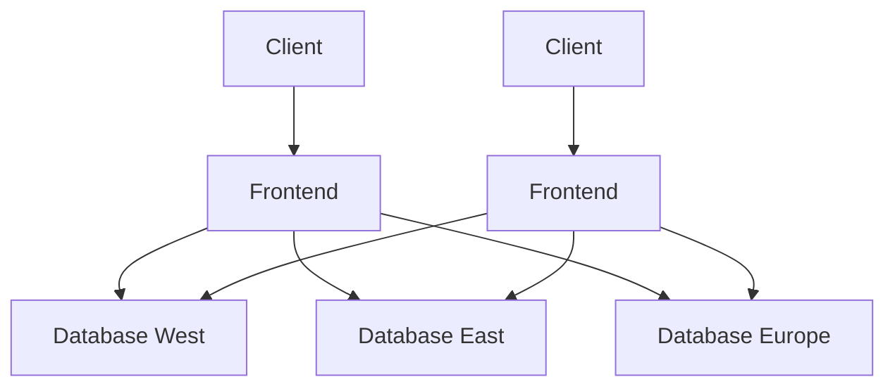
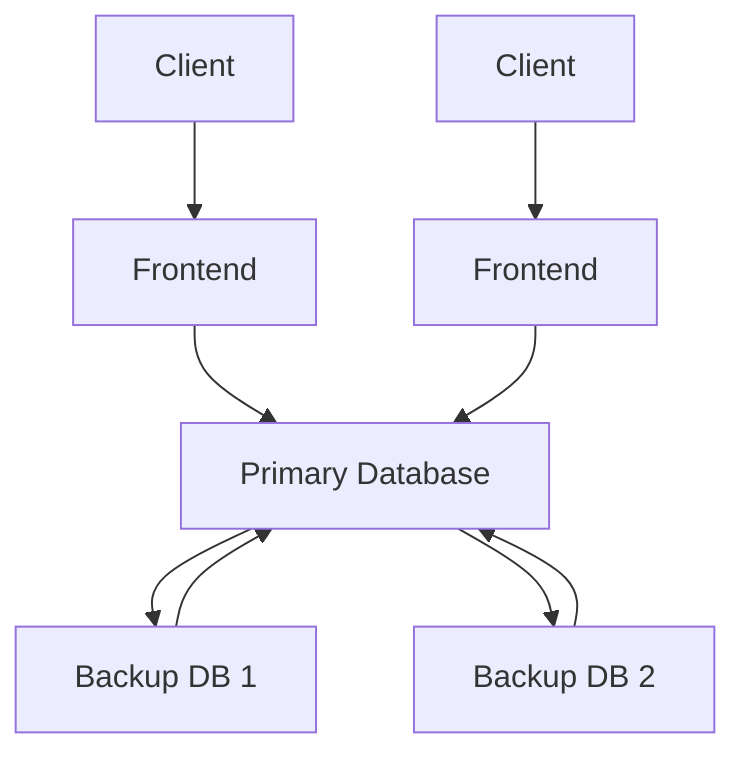
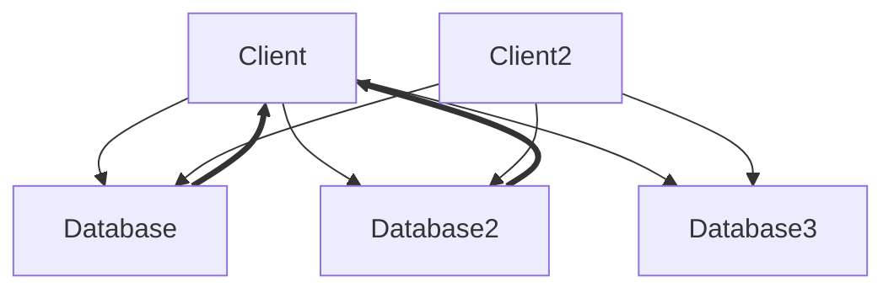

# Managing and Processing Large Datasets

Christian Kaestner

<!-- references -->

Required reading: Martin Kleppmann. [Designing Data-Intensive Applications](https://dataintensive.net/). OReilly. 2017. Chapter 1

---

# Learning Goals

* Organize different data management solutions and their tradeoffs
* Explain the tradeoffs between batch processing and stream processing and the lambda architecture
* Recommend and justify a design and corresponding technologies for a given system

---
# Case Study


Notes:
* Discuss possible architecture and when to predict (and update)
* in may 2017: 500M users, uploading 1.2billion photos per day (14k/sec)
* in Jun 2019 1 billion users


---

# Data Management and Processing in ML-Enabled Systems

----
# Kinds of Data

* Training data
* Input data
* Telemetry data
* (Models)

*all potentially with huge total volumes and high throughput*

*need strategies for storage and processing*


----
## Data Management and Processing in ML-Enabled Systems

* Store, clean, and update training data
* Learning process reads training data, writes model
* Prediction task (inference) on demand or precomputed
* Individual requests (low/high volume) or large datasets?
* 
* Often both learning and inference data heavy, high volume tasks

----
## Distributed X

* Distributed data cleaning
* Distributed feature extraction
* Distributed learning
* Distributed large prediction tasks
* Incremental predictions
* Distributed logging and telemetry


---
# Data Storage Basics

* Relational vs document storage
* 1:n and n:m relations
* Storage and retrieval, indexes
* Query languages and optimization

----
## Relational Data Models

|user_id|Name|Email|dpt|
|-|-|-|-|
|1|Christian|kaestner@cs.|1|
|2|Eunsuk|eskang@cmu.|1|
|2|Tom|...|2|


|dpt_id|Name|Address|
|-|-|-|
|1|ISR|...|
|2|CSD|...|

```sql
select d.name from user u, dpt d where u.dpt=d.dpt_id
```

----

## Document Data Models

```js
{
    "id": 1,
    "name": "Christian",
    "email": "kaestner@cs.",
    "dpt": [
        {"name": "ISR", "address": "..."}
    ],
    "other": { ... }
}

```

```js
db.getCollection('users').find({"name": "Christian"})
```

----
## Log files, unstructured data

```
2020-06-25T13:44:14,601844,GET /data/m/goyas+ghosts+2006/17.mpg
2020-06-25T13:44:14,935791,GET /data/m/the+big+circus+1959/68.mpg
2020-06-25T13:44:14,557605,GET /data/m/elvis+meets+nixon+1997/17.mpg
2020-06-25T13:44:14,140291,GET /data/m/the+house+of+the+spirits+1993/53.mpg
2020-06-25T13:44:14,425781,GET /data/m/the+theory+of+everything+2014/29.mpg
2020-06-25T13:44:14,773178,GET /data/m/toy+story+2+1999/59.mpg
2020-06-25T13:44:14,901758,GET /data/m/ignition+2002/14.mpg
2020-06-25T13:44:14,911008,GET /data/m/toy+story+3+2010/46.mpg
```


----
## Tradeoffs

<!-- discussion -->

----
## Data Encoding

* Semi-structured, schema-free (JSON, XML)
* Schema-based encoding (CSV, binary)
* Compact encodings

---
# Distributed Data Storage

----
## Replication vs Partitioning

<!-- discussion -->

----
## Partitioning

Divide data:

* Horizontal partitioning: Different rows in different tables; e.g., movies by decade, hashing often used
* Vertical partitioning: Different columns in different tables; e.g., movie title vs. all actors

**Tradeoffs?**




----
## Replication Strategies: Leaders and Followers



----
## Replication Strategies: Leaders and Followers

* Write to leader
    * propagated synchronously or async.
* Read from any follower
* Elect new leader on leader outage; catchup on follower outage
*
* Built in model of many databases (MySQL, MongoDB, ...)

**Benefits and Drawbacks?**


----
## Multi-Leader Replication

* Scale write access, add redundancy
* Requires coordination among leaders
    * Resolution of write conflicts
* Offline leaders (e.g. apps), collaborative editing


----
## Leaderless Replication

* Client writes to all replica
* Read from multiple replica (quorum required)
    * Repair on reads, background repair process
* Versioning of entries (clock problem)
* e.g. Amazon Dynamo, Cassandra, Voldemort



----
## Transactions

* Multiple operations conducted as one, all or nothing
* Avoids problems such as
  * dirty reads
  * dirty writes
* Various strategies, including locking and optimistic+rollback
* Overhead in distributed setting


---
# Data Processing (Overview)

* Services (online)
    * Responding to client requests as they come in
    * Evaluate: Response time
* Batch processing (offline)
    * Computations run on large amounts of data
    * Takes minutes to days
    * Typically scheduled periodically
    * Evaluate: Throughput
* Stream processing (near real time)
    * Processes input events, not responding to requests
    * Shortly after events are issued


---
# Batch Processing

----
## Large Jobs

* Analyzing TB of data, typically distributed storage
* Filtering, sorting, aggregating
* Producing reports, models, ...

```sh
cat /var/log/nginx/access.log |
    awk '{print $7}' |
    sort |
    uniq -c |
    sort -r -n |
    head -n 5
```

----
## Distributed Batch Processing

* Process data locally at storage
* Aggregate results as needed
* Separate pluming from job logic

*MapReduce* as common framework


<!-- references -->
Image Source: Ville Tuulos (CC BY-SA 3.0)

----
## MapReduce -- Functional Programming Style 

* Similar to shell commands: Immutable inputs, new outputs, avoid side effects
* Jobs can be repeated (e.g., on crashes)
* Easy rollback
* Multiple jobs in parallel (e.g., experimentation)

----
## Machine Learning and MapReduce

<!-- discussion -->

Notes: Useful for big learning jobs, but also for feature extraction

----
## Dataflow Engines (Spark, Tez, Flink, ...)

* Single job, rather than subjobs
* More flexible than just map and reduce
* Multiple stages with explicit dataflow between them
* Often in-memory data
* Pluming and distribution logic separated

---
# Stream Processing

* Event-based systems, message passing style, publish subscribe

----
## Messaging Systems

* Multiple producers send messages to topic
* Multiple consumers can read messages
* Decoupling of producers and consumers
* Message buffering if producers faster than consumers
* Typically some persistency to recover from failures
* Messages removed after consumption or after timeout
* With or without central broker
* Various error handling strategies (acknowledgements, redelivery, ...)

----
## Common Designs

Like shell programs: Read from stream, produce output in other stream. Loose coupling


----
## Stream Queries

* Processing one event at a time independently
* vs incremental analysis over all messages up to that point
* vs floating window analysis across recent messages
* Works well with probabilistic analyses

----
## Consumers

* Multiple consumers share topic for scaling and load balancing
* Multiple consumers read same message for different work
* Partitioning possible

----
## Design Questions

* Message loss important? (at-least-once processing)
* Can messages be processed repeatedly (at-most-once processing)
* Is the message order important?
* Are messages still needed after they are consumed?

----
## Stream Processing and AI-enabled Systems?

<!-- discussion -->

Notes: Process data as it arrives, prepare data for learning tasks,
use models to annotate data, analytics

----
## Event Sourcing

* Append only databases
* Record edit events, never mutate data
* Compute current state from all past events, can reconstruct old state
* For efficiency, take state snapshots
* Similar to traditional database logs

```text
createUser(id=5, name="Christian", dpt="SCS")
updateUser(id=5, dpt="ISR")
deleteUser(id=5)
```

----
## Benefits of Immutability (Event Sourcing)

* All history is stored, recoverable
* Versioning easy by storing id of latest record
* Can compute multiple views
* Compare *git*

*On a shopping website, a customer may add an item to their cart and then
remove it again. Although the second event cancels out the first event from the point
of view of order fulfillment, it may be useful to know for analytics purposes that the
customer was considering a particular item but then decided against it. Perhaps they
will choose to buy it in the future, or perhaps they found a substitute. This information is recorded in an event log, but would be lost in a database that deletes items
when they are removed from the cart.*

<!-- references -->

Source: Greg Young. [CQRS and Event Sourcing](https://www.youtube.com/watch?v=JHGkaShoyNs). Code on the Beach 2014 via Martin Kleppmann. Designing Data-Intensive Applications. OReilly. 2017.

----
## Drawbacks of Immutable Data

<!-- discussion -->

Notes: 
* Storage overhead, extra complexity of deriving state
* Frequent changes may create massive data overhead
* Some sensitive data may need to be deleted (e.g., privacy, security)


---
# The Lambda Architecture


<!-- references -->
Source: [Textractor](https://commons.wikimedia.org/wiki/File:Diagram_of_Lambda_Architecture_(named_components).png) (CC BY-SA 4.0)

----
## Lambda Architecture: 3 Layer Storage Architecture


* Batch layer: best accuracy, all data, recompute periodically
* Speed layer: stream processing, incremental updates, possibly approximated
* Serving layer: provide results of batch and speed layers to clients
*
* Assumes append-only data
* Supports tasks with widely varying latency
* Balance latency, throughput and fault tolerance

----
## Lambda Architecture and Machine Learning


<!-- .element: class="stretch" -->


* Learn accurate model in batch job
* Learn incremental model in stream processor

----
## Data Lake

* Trend to store all events in raw form (no consistent schema)
* May be useful later
* Data storage is comparably cheap

<!-- discussion -->

----
## Reasoning about Dataflows

Many data sources, many outputs, many copies

Which data is derived from what other data and how? 

Is it reproducible? Are old versions archived?

How do you get the right data to the right place in the right format?

**Plan and document data flows**

----


---

# Summary

* Data storage strategies and their tradeoffs
* Partitioning and replication for scalability
* Design considerations: mutable vs immutable data
* Common design patterns (e.g., batch processing, stream processing, lambda architecture)

Recommended reading: Martin Kleppmann. [Designing Data-Intensive Applications](https://dataintensive.net/). OReilly. 2017.


