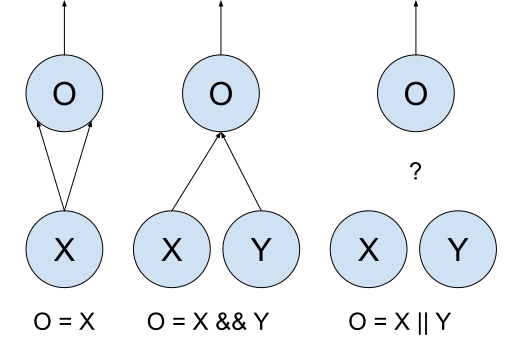
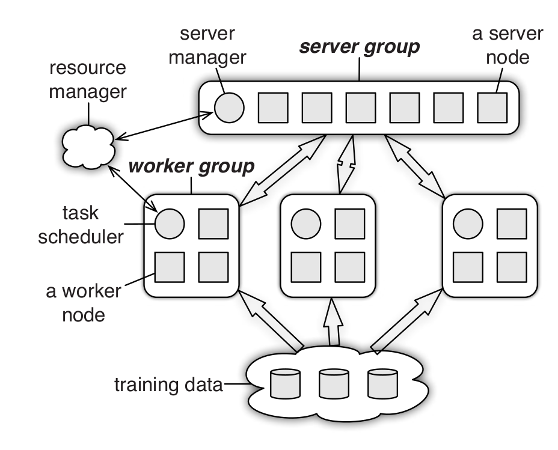
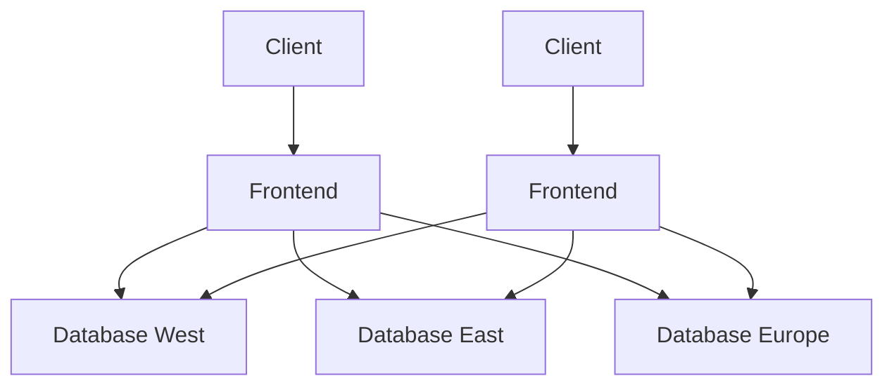
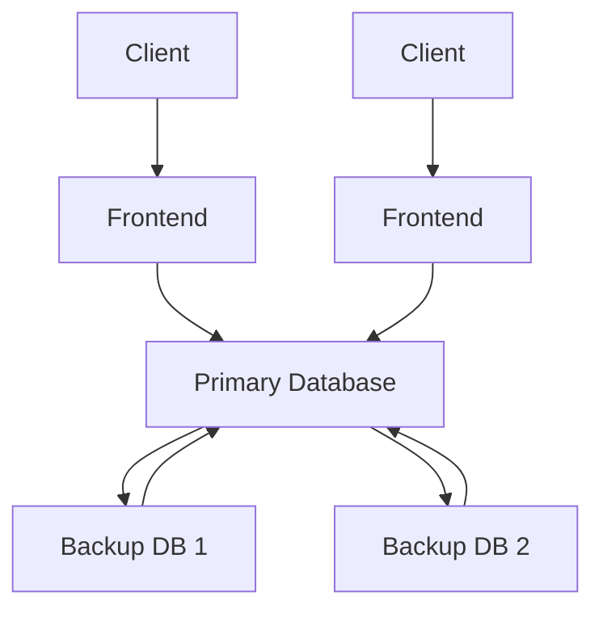
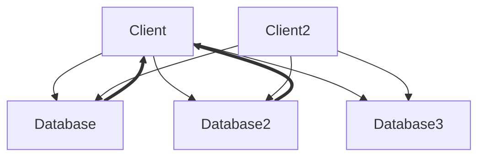

# Managing and Processing Large Datasets

Christian Kaestner

<!-- references -->

Required watching: Molham Aref. [Business Systems with Machine Learning](https://www.youtube.com/watch?v=_bvrzYOA8dY). Guest lecture, 2020.

Suggested reading: Martin Kleppmann. [Designing Data-Intensive Applications](https://dataintensive.net/). OReilly. 2017. 

---

# Learning Goals

* Organize different data management solutions and their tradeoffs
* Understand the scalability challenges involved in large-scale machine learning and specifically deep learning
* Explain the tradeoffs between batch processing and stream processing and the lambda architecture
* Recommend and justify a design and corresponding technologies for a given system

---
# Case Study


Notes:
* Discuss possible architecture and when to predict (and update)
* in may 2017: 500M users, uploading 1.2billion photos per day (14k/sec)
* in Jun 2019 1 billion users


----

## "Zoom adding capacity"

<iframe src="https://giphy.com/embed/3oz8xtBx06mcZWoNJm" width="480" height="362" frameBorder="0" class="giphy-embed" allowFullScreen></iframe>

---

# Data Management and Processing in ML-Enabled Systems

----
# Kinds of Data

* Training data
* Input data
* Telemetry data
* (Models)

*all potentially with huge total volumes and high throughput*

*need strategies for storage and processing*


----
## Data Management and Processing in ML-Enabled Systems

* Store, clean, and update training data
* Learning process reads training data, writes model
* Prediction task (inference) on demand or precomputed
* Individual requests (low/high volume) or large datasets?
* 
* Often both learning and inference data heavy, high volume tasks


----
## Scaling Computations

<!-- colstart -->
Efficent Algorithms
<!-- col -->
Faster Machines
<!-- col -->
More Machines
<!-- colend -->

----
## Distributed X

* Distributed data cleaning
* Distributed feature extraction
* Distributed learning
* Distributed large prediction tasks
* Incremental predictions
* Distributed logging and telemetry


----
## Reliability and Scalability Challenges in AI-Enabled Systems?

<!-- discussion -->


----
## Distributed Systems and AI-Enabled Systems

* Learning tasks can take substantial resources
* Datasets too large to fit on single machine
* Nontrivial inference time, many many users
* Large amounts of telemetry
* Experimentation at scale
* Models in safety critical parts
* Mobile computing, edge computing, cyber-physical systems


---
# Excursion: Deep Learning & Scale

----

# Neural Networks


<!-- .element: class="stretch" -->


Note: Artificial neural networks are inspired by how biological neural networks work ("groups of chemically connected or functionally associated neurons" with synapses forming connections)

From "Texture of the Nervous System of Man and the Vertebrates" by Santiago Ramón y Cajal, via https://en.wikipedia.org/wiki/Neural_circuit#/media/File:Cajal_actx_inter.jpg

----
## Artificial Neural Networks

Simulating biological neural networks of neurons (nodes) and synapses (connections), popularized in 60s and 70s

Basic building blocks: Artificial neurons, with $n$ inputs and one output; output is activated if at least $m$ inputs are active


<!-- .element: class="stretch" -->

(assuming at least two activated inputs needed to activate output)

----
## Threshold Logic Unit / Perceptron

computing weighted sum of inputs + step function

$z = w_1 x_1 + w_2 x_2 + ... + w_n x_n = \mathbf{x}^T \mathbf{w}$

e.g., step: `$\phi$(z) = if (z<0) 0 else 1` 


<!-- .element: class="stretch" -->

----


<!-- .element: class="stretch" -->

<!-- split -->

$o_1 = \phi(b_{1}  +  w_{1,1} x_1 + w_{1,2} x_2)$
$o_2 = \phi(b_{2}  +  w_{2,1} x_1 + w_{2,2} x_2)$
$o_3 = \phi(b_{3}  +  w_{3,1} x_1 + w_{3,2} x_2)$

****
$f_{\mathbf{W},\mathbf{b}}(\mathbf{X})=\phi(\mathbf{W} \cdot \mathbf{X}+\mathbf{b})$

($\mathbf{W}$ and $\mathbf{b}$ are parameters of the model)

----
## Multiple Layers


<!-- .element: class="stretch" -->

Note: Layers are fully connected here, but layers may have different numbers of neurons

----
$f_{\mathbf{W}_h,\mathbf{b}_h,\mathbf{W}_o,\mathbf{b}_o}(\mathbf{X})=\phi( \mathbf{W}_o \cdot \phi(\mathbf{W}_h \cdot \mathbf{X}+\mathbf{b}_h)+\mathbf{b}_o)$


<!-- .element: class="stretch" -->

(matrix multiplications interleaved with step function)

----
## Learning Model Parameters (Backpropagation)

Intuition:
- Initialize all weights with random values
- Compute prediction, remembering all intermediate activations
- If output is not expected output (measuring error with a loss function), 
  + compute how much each connection contributed to the error on output layer
  + repeat computation on each lower layer
  + tweak weights a little toward the correct output (gradient descent)
- Continue training until weights stabilize

Works efficiently only for certain $\phi$, typically logistic function: $\phi(z)=1/(1+exp(-z))$ or ReLU: $\phi(z)=max(0,z)$.

----
## Deep Learning

* More layers
* Layers with different numbers of neurons 
* Different kinds of connections
  - fully connected (feed forward)
  - not fully connected (eg. convolutional networks)
  - keeping state (eg. recurrent neural networks)
  - skipping layers
  - ...

<!-- references -->
See Chapter 10 in 🕮 Géron, Aurélien. ”[Hands-On Machine Learning with Scikit-Learn, Keras, and TensorFlow](https://cmu.primo.exlibrisgroup.com/permalink/01CMU_INST/6lpsnm/alma991019662775504436)”, 2nd Edition (2019) or any other book on deep learning


Note: Essentially the same with more layers and different kinds of architectures.


----
## Example Scenario

* MNIST Fashion dataset of 70k 28x28 grayscale pixel images, 10 output classes


<!-- .element: class="stretch" -->

----
## Example Scenario

* MNIST Fashion dataset of 70k 28x28 grayscale pixel images, 10 output classes
* 28x28 = 784 inputs in input layers (each 0..255)
* Example model with 3 layers, 300, 100, and 10 neurons

```python
model = keras.models.Sequential([
  keras.layers.Flatten(input_shape=[28, 28]),
  keras.layers.Dense(300, activation="relu"),
  keras.layers.Dense(100, activation="relu"),
  keras.layers.Dense(10, activation="softmax")
])
```

**How many parameters does this model have?**

----
## Example Scenario

* MNIST Fashion dataset of 70k 28x28 grayscale pixel images, 10 output classes
* 28x28 = 784 inputs in input layers (each 0..255)
* Example model with 3 layers, 300, 100, and 10 neurons

```python
model = keras.models.Sequential([
  keras.layers.Flatten(input_shape=[28, 28]),
  # 784*300+300 = 235500 parameter
  keras.layers.Dense(300, activation="relu"), 
  # 300*100+100 = 30100 parameters
  keras.layers.Dense(100, activation="relu"),
  # 100*10+10 = 1010 parameters
  keras.layers.Dense(10, activation="softmax")
])
```

Total of 266,610 parameters in this small example! (Assuming float types, that's 1 MB)

----
## Network Size

* 50 Layer ResNet network -- classifying 224x224 images into 1000 categories
  * 26 million weights, computes 16 million activations during inference, 168 MB to store weights as floats
* Google in 2012(!): 1TB-1PB of training data, 1 billion to 1 trillion parameters
* OpenAI’s GPT-2 (2019) -- text generation
  - 48 layers, 1.5 billion weights (~12 GB to store weights)
  - released model reduced to 117 million weights
  - trained on 7-8 GPUs for 1 month with 40GB of internet text from 8 million web pages


----
## Cost & Energy Consumption


| Consumption | CO2 (lbs) |
| - | - |
| Air travel, 1 passenger, NY↔SF | 1984 |
| Human life, avg, 1 year | 11,023 |
| American life, avg, 1 year | 36,156 |
| Car, avg incl. fuel, 1 lifetime | 126,000 |

| Training one model (GPU) | CO2 (lbs) |
| - | - |
| NLP pipeline (parsing, SRL) | 39 |
| w/ tuning & experimentation | 78,468 |
| Transformer (big) | 192 |
| w/ neural architecture search | 626,155 |


<!-- references -->
Strubell, Emma, Ananya Ganesh, and Andrew McCallum. "[Energy and Policy Considerations for Deep Learning in NLP](https://arxiv.org/pdf/1906.02243.pdf)." In Proceedings of the 57th Annual Meeting of the Association for Computational Linguistics, pp. 3645-3650. 2019.


----
## Cost & Energy Consumption

<!-- colstart -->

| Model | Hardware | Hours | CO2 | Cloud cost in USD |
| - | - | - | - | - |
| Transformer | P100x8 | 84 | 192 | 289–981 |
| ELMo | P100x3 | 336 | 262 | 433–1472 |
| BERT | V100x64 | 79 | 1438 | 3751–13K |
| NAS | P100x8 | 274,120 | 626,155 | 943K–3.2M |
| GPT-2 | TPUv3x32 | 168 | — | 13K–43K |

<!-- colend -->

<!-- references -->
Strubell, Emma, Ananya Ganesh, and Andrew McCallum. "[Energy and Policy Considerations for Deep Learning in NLP](https://arxiv.org/pdf/1906.02243.pdf)." In Proceedings of the 57th Annual Meeting of the Association for Computational Linguistics, pp. 3645-3650. 2019.

----
## Reusing and Retraining Networks

* Incremental learning process enables continued training, retraining, incremental updates
* A model that captures key abstractions may be good starting point for adjustments (i.e., rather than starting with randomly initialized parameters)
* Reused models may inherit bias from original model
* Lineage important. Model cards promoted for documenting rationale, e.g., [Google Perspective Toxicity Model](https://github.com/conversationai/perspectiveapi/blob/master/2-api/model-cards/English/toxicity.md)


---
# Distributed Deep Learning with the Parameter Server Architecture

<!-- references -->
Li, Mu, et al. "[Scaling distributed machine learning with the parameter server](https://www.usenix.org/system/files/conference/osdi14/osdi14-paper-li_mu.pdf)." OSDI, 2014.


----
## Recall: Backpropagation


<!-- .element: class="stretch" -->

----
## Training at Scale is Challenging

* 2012 at Google: 1TB-1PB of training data, $10^9-10^{12}$ parameters
* Need distributed training; learning is often a sequential problem
* Just exchanging model parameters requires substantial network bandwidth
* Fault tolerance essential (like batch processing), add/remove nodes
* Tradeoff between convergence rate and system efficiency

<!-- references -->
Li, Mu, et al. "[Scaling distributed machine learning with the parameter server](https://www.usenix.org/system/files/conference/osdi14/osdi14-paper-li_mu.pdf)." OSDI, 2014.

----
## Distributed Gradient Descent

[](https://www.usenix.org/system/files/conference/osdi14/osdi14-paper-li_mu.pdf)
<!-- .element: class="stretch" -->


----
## Parameter Server Architecture

[](https://www.usenix.org/system/files/conference/osdi14/osdi14-paper-li_mu.pdf)
<!-- .element: class="stretch" -->

Note:
Multiple parameter servers that each only contain a subset of the parameters, and multiple workers that each require only a subset of each

Ship only relevant subsets of mathematical vectors and matrices, batch communication

Resolve conflicts when multiple updates need to be integrated (sequential, eventually, bounded delay)

Run more than one learning algorithm simulaneously


----
## SysML Conference


Increasing interest in the systems aspects of machine learning

e.g., building large scale and robust learning infrastructure

https://mlsys.org/


---
# Data Storage Basics

* Relational vs document storage
* 1:n and n:m relations
* Storage and retrieval, indexes
* Query languages and optimization

----
## Relational Data Models

|user_id|Name|Email|dpt|
|-|-|-|-|
|1|Christian|kaestner@cs.|1|
|2|Eunsuk|eskang@cmu.|1|
|2|Tom|...|2|


|dpt_id|Name|Address|
|-|-|-|
|1|ISR|...|
|2|CSD|...|

```sql
select d.name from user u, dpt d where u.dpt=d.dpt_id
```

----

## Document Data Models

```js
{
    "id": 1,
    "name": "Christian",
    "email": "kaestner@cs.",
    "dpt": [
        {"name": "ISR", "address": "..."}
    ],
    "other": { ... }
}

```

```js
db.getCollection('users').find({"name": "Christian"})
```

----
## Log files, unstructured data

```
2020-06-25T13:44:14,601844,GET /data/m/goyas+ghosts+2006/17.mpg
2020-06-25T13:44:14,935791,GET /data/m/the+big+circus+1959/68.mpg
2020-06-25T13:44:14,557605,GET /data/m/elvis+meets+nixon+1997/17.mpg
2020-06-25T13:44:14,140291,GET /data/m/the+house+of+the+spirits+1993/53.mpg
2020-06-25T13:44:14,425781,GET /data/m/the+theory+of+everything+2014/29.mpg
2020-06-25T13:44:14,773178,GET /data/m/toy+story+2+1999/59.mpg
2020-06-25T13:44:14,901758,GET /data/m/ignition+2002/14.mpg
2020-06-25T13:44:14,911008,GET /data/m/toy+story+3+2010/46.mpg
```


----
## Tradeoffs

<!-- discussion -->

----
## Data Encoding

* Plain text (csv, logs)
* Semi-structured, schema-free (JSON, XML)
* Schema-based encoding (relational, Avro, ...)
* Compact encodings (protobuffer, ...)

---
# Distributed Data Storage

----
## Replication vs Partitioning

<!-- discussion -->

----
## Partitioning

Divide data:

* Horizontal partitioning: Different rows in different tables; e.g., movies by decade, hashing often used
* Vertical partitioning: Different columns in different tables; e.g., movie title vs. all actors

**Tradeoffs?**




----
## Replication Strategies: Leaders and Followers



----
## Replication Strategies: Leaders and Followers

* Write to leader
    * propagated synchronously or async.
* Read from any follower
* Elect new leader on leader outage; catchup on follower outage
*
* Built in model of many databases (MySQL, MongoDB, ...)

**Benefits and Drawbacks?**


----
## Multi-Leader Replication

* Scale write access, add redundancy
* Requires coordination among leaders
    * Resolution of write conflicts
* Offline leaders (e.g. apps), collaborative editing


----
## Leaderless Replication

* Client writes to all replica
* Read from multiple replica (quorum required)
    * Repair on reads, background repair process
* Versioning of entries (clock problem)
* e.g. Amazon Dynamo, Cassandra, Voldemort



----
## Transactions

* Multiple operations conducted as one, all or nothing
* Avoids problems such as
  * dirty reads
  * dirty writes
* Various strategies, including locking and optimistic+rollback
* Overhead in distributed setting


---
# Data Processing (Overview)

* Services (online)
    * Responding to client requests as they come in
    * Evaluate: Response time
* Batch processing (offline)
    * Computations run on large amounts of data
    * Takes minutes to days
    * Typically scheduled periodically
    * Evaluate: Throughput
* Stream processing (near real time)
    * Processes input events, not responding to requests
    * Shortly after events are issued


---
# Batch Processing

----
## Large Jobs

* Analyzing TB of data, typically distributed storage
* Filtering, sorting, aggregating
* Producing reports, models, ...

```sh
cat /var/log/nginx/access.log |
    awk '{print $7}' |
    sort |
    uniq -c |
    sort -r -n |
    head -n 5
```

----
## Distributed Batch Processing

* Process data locally at storage
* Aggregate results as needed
* Separate pluming from job logic

*MapReduce* as common framework


<!-- references -->
Image Source: Ville Tuulos (CC BY-SA 3.0)

----
## MapReduce -- Functional Programming Style 

* Similar to shell commands: Immutable inputs, new outputs, avoid side effects
* Jobs can be repeated (e.g., on crashes)
* Easy rollback
* Multiple jobs in parallel (e.g., experimentation)

----
## Machine Learning and MapReduce

<!-- discussion -->

Notes: Useful for big learning jobs, but also for feature extraction

----
## Dataflow Engines (Spark, Tez, Flink, ...)

* Single job, rather than subjobs
* More flexible than just map and reduce
* Multiple stages with explicit dataflow between them
* Often in-memory data
* Pluming and distribution logic separated

----
## Key Design Principle: Data Locality

> Moving Computation is Cheaper than Moving Data -- [Hadoop Documentation](https://hadoop.apache.org/docs/stable/hadoop-project-dist/hadoop-hdfs/HdfsDesign.html#aMoving_Computation_is_Cheaper_than_Moving_Data)

* Data often large and distributed, code small
* Avoid transfering large amounts of data
* Perform computation where data is stored (distributed)
* Transfer only results as needed
* 
* "The map reduce way"


---
# Stream Processing

* Event-based systems, message passing style, publish subscribe

----
## Messaging Systems

* Multiple producers send messages to topic
* Multiple consumers can read messages
* Decoupling of producers and consumers
* Message buffering if producers faster than consumers
* Typically some persistency to recover from failures
* Messages removed after consumption or after timeout
* With or without central broker
* Various error handling strategies (acknowledgements, redelivery, ...)

----
## Common Designs

Like shell programs: Read from stream, produce output in other stream. Loose coupling


----
## Stream Queries

* Processing one event at a time independently
* vs incremental analysis over all messages up to that point
* vs floating window analysis across recent messages
* Works well with probabilistic analyses

----
## Consumers

* Multiple consumers share topic for scaling and load balancing
* Multiple consumers read same message for different work
* Partitioning possible

----
## Design Questions

* Message loss important? (at-least-once processing)
* Can messages be processed repeatedly (at-most-once processing)
* Is the message order important?
* Are messages still needed after they are consumed?

----
## Stream Processing and AI-enabled Systems?

<!-- discussion -->

Notes: Process data as it arrives, prepare data for learning tasks,
use models to annotate data, analytics

----
## Event Sourcing

* Append only databases
* Record edit events, never mutate data
* Compute current state from all past events, can reconstruct old state
* For efficiency, take state snapshots
* Similar to traditional database logs

```text
createUser(id=5, name="Christian", dpt="SCS")
updateUser(id=5, dpt="ISR")
deleteUser(id=5)
```

----
## Benefits of Immutability (Event Sourcing)

* All history is stored, recoverable
* Versioning easy by storing id of latest record
* Can compute multiple views
* Compare *git*

*On a shopping website, a customer may add an item to their cart and then
remove it again. Although the second event cancels out the first event from the point
of view of order fulfillment, it may be useful to know for analytics purposes that the
customer was considering a particular item but then decided against it. Perhaps they
will choose to buy it in the future, or perhaps they found a substitute. This information is recorded in an event log, but would be lost in a database that deletes items
when they are removed from the cart.*

<!-- references -->

Source: Greg Young. [CQRS and Event Sourcing](https://www.youtube.com/watch?v=JHGkaShoyNs). Code on the Beach 2014 via Martin Kleppmann. Designing Data-Intensive Applications. OReilly. 2017.

----
## Drawbacks of Immutable Data

<!-- discussion -->

Notes: 
* Storage overhead, extra complexity of deriving state
* Frequent changes may create massive data overhead
* Some sensitive data may need to be deleted (e.g., privacy, security)


---
# The Lambda Architecture


<!-- references -->
Source: [Textractor](https://commons.wikimedia.org/wiki/File:Diagram_of_Lambda_Architecture_(named_components).png) (CC BY-SA 4.0)

----
## Lambda Architecture: 3 Layer Storage Architecture


* Batch layer: best accuracy, all data, recompute periodically
* Speed layer: stream processing, incremental updates, possibly approximated
* Serving layer: provide results of batch and speed layers to clients
*
* Assumes append-only data
* Supports tasks with widely varying latency
* Balance latency, throughput and fault tolerance

----
## Lambda Architecture and Machine Learning


<!-- .element: class="stretch" -->


* Learn accurate model in batch job
* Learn incremental model in stream processor

----
## Data Lake

* Trend to store all events in raw form (no consistent schema)
* May be useful later
* Data storage is comparably cheap

<!-- discussion -->

----
## Reasoning about Dataflows

Many data sources, many outputs, many copies

Which data is derived from what other data and how? 

Is it reproducible? Are old versions archived?

How do you get the right data to the right place in the right format?

**Plan and document data flows**

----


----

[](https://youtu.be/_bvrzYOA8dY?t=1452)

<!-- reference -->
Molham Aref "[Business Systems with Machine Learning](https://www.youtube.com/watch?v=_bvrzYOA8dY)"


---
# Excursion: ETL Tools

Extract, tranform, load

----
## Data Warehousing (OLAP)

* Large denormalized databases with materialized views for large scale reporting queries
* e.g. sales database, queries for sales trends by region
* 
* Read-only except for batch updates: Data from OLTP systems loaded periodically, e.g. over night


Note: Image source: https://commons.wikimedia.org/wiki/File:Data_Warehouse_Feeding_Data_Mart.jpg

----
## ETL: Extract, Transform, Load

* Transfer data between data sources, often OLTP -> OLAP system
* Many tools and pipelines
    - Extract data from multiple sources (logs, JSON, databases), snapshotting
    - Transform: cleaning, (de)normalization, transcoding, sorting, joining
    - Loading in batches into database, staging
* Automation, parallelization, reporting, data quality checking, monitoring, profiling, recovery
* Often large batch processes
* Many commercial tools

<!-- references -->
Examples of tools in [several](https://www.softwaretestinghelp.com/best-etl-tools/) [lists](https://www.scrapehero.com/best-data-management-etl-tools/)

----
[](https://www.xplenty.com/)


----

[](https://youtu.be/_bvrzYOA8dY?t=1452)

<!-- reference -->
Molham Aref "[Business Systems with Machine Learning](https://www.youtube.com/watch?v=_bvrzYOA8dY)"


---
# Complexity of Distributed Systems

----


----
## Common Distributed System Issues

* Systems may crash
* Messages take time
* Messages may get lost
* Messages may arrive out of order
* Messages may arrive multiple times
* Messages may get manipulated along the way
* Bandwidth limits
* Coordination overhead
* Network partition
* ...

----
## Types of failure behaviors

* Fail-stop
* Other halting failures
* Communication failures
    * Send/receive omissions
    * Network partitions
    * Message corruption
* Data corruption
* Performance failures
    * High packet loss rate
    * Low throughput
    * High latency
* Byzantine failures

----
## Common Assumptions about Failures

* Behavior of others is fail-stop 
* Network is reliable 
* Network is semi-reliable but asynchronous
* Network is lossy but messages are not corrupt
* Network failures are transitive
* Failures are independent
* Local data is not corrupt
* Failures are reliably detectable
* Failures are unreliably detectable

----
## Strategies to Handle Failures

* Timeouts, retry, backup services
* Detect crashed machines (ping/echo, heartbeat)
* Redundant + first/voting
* Transactions
*
* Do lost messages matter?
* Effect of resending message?

----
## Test Error Handling

* Recall: Testing with stubs
* Recall: Chaos experiments


---
# Performance Planning and Analysis


----
## Performance Planning and Analysis

* Ideally architectural planning upfront
  * Identify key components and their interactions
  * Estimate performance parameters
  * Simulate system behavior (e.g., queuing theory)

* Existing system: Analyze performance bottlenecks
  * Profiling of individual components
  * Performance testing (stress testing, load testing, etc)
  * Performance monitoring of distributed systems

----
## Performance Analysis

* What is the average waiting?
* How many customers are waiting on average? 
* How long is the average service time?
* What are the chances of one or more servers being idle? 
* What is the average utilization of the servers?
*
* Early analysis of different designs for bottlenecks
* Capacity planning

----
## Queuing Theory

* Queuing theory deals with the analysis of lines where customers wait to receive a service
    * Waiting at Quiznos
    * Waiting to check-in at an airport
    * Kept on hold at a call center
    * Streaming video over the net
    * Requesting a web service
* A queue is formed when request for services outpace the ability of the server(s) to service them immediately
    * Requests arrive faster than they can be processed (unstable queue)
    * Requests do not arrive faster than they can be processed but their processing is delayed by some time (stable queue)
* Queues exist because infinite capacity is infinitely expensive and excessive capacity is excessively expensive

----
## Queuing Theory


----
## Analysis Steps (roughly)

* Identify system abstraction to analyze (typically architectural level, e.g. services, but also protocols, datastructures and components, parallel processes, networks)
* Model connections and dependencies
* Estimate latency and capacity per component (measurement and testing, prior systems, estimates, …)
* Run simulation/analysis to gather performance curves
* Evaluate sensitivity of simulation/analysis to various parameters (‘what-if questions’)


----
## Simulation (e.g., JMT)


<!-- references -->

G.Serazzi Ed. Performance Evaluation Modelling with JMT: learning by examples. Politecnico di Milano - DEI, TR 2008.09, 366 pp., June 2008 


----
## Profiling 

Mostly used during development phase in single components


----
## Performance Testing

* Load testing: Assure handling of maximum expected load
* Scalability testing: Test with increasing load
* Soak/spike testing: Overload application for some time, observe stability
* Stress testing: Overwhelm system resources, test graceful failure + recovery
*
* Observe (1) latency, (2) throughput, (3) resource use
* All automateable; tools like JMeter

----
## Performance Monitoring of Distributed Systems

[](distprofiler.png)

<!-- references -->
Source: https://blog.appdynamics.com/tag/fiserv/


----
## Performance Monitoring of Distributed Systems

* Instrumentation of (Service) APIs
* Load of various servers
* Typically measures: latency, traffic, errors, saturation
* 
* Monitoring long-term trends
* Alerting
* Automated releases/rollbacks
* Canary testing and A/B testing


---

# Summary

* Large amounts of data (training, inference, telemetry, models)
* Distributed storage and computation for scalability
* Common design patterns (e.g., batch processing, stream processing, lambda architecture)
* Design considerations: mutable vs immutable data
* Distributed computing also in machine learning
* Lots of tooling for data extraction, transformation, processing
* Many challenges through distribution: failures, debugging, performance, ...


Recommended reading: Martin Kleppmann. [Designing Data-Intensive Applications](https://dataintensive.net/). OReilly. 2017.


