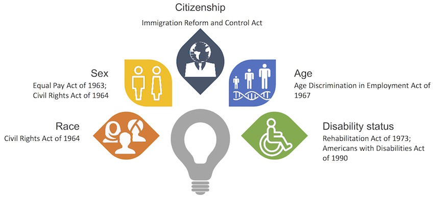
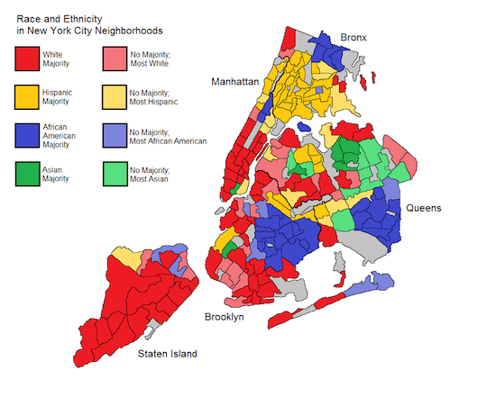
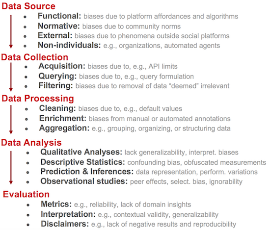

# Learning Goals

* Understand the types of harm that can be caused by ML.
* Understand the sources of bias in ML.
* Discuss ways to reduce bias in training data. 

---
# Fairness

----
## Discrimination

* Population includes various minority groups
	* Ethnic, religious, medical, geographic 
* Protected by laws & policies
* __How do we monitor & regulate decisions made by ML__?

----
## Example: Recidivism

----
## Example: Recidivism

* COMPAS (Correctional Offender Management Profiling for Alternative
Sanctions)
* In use throughout numerous states (PA, FL, NY, WI, CA, etc.,)

----
## Example: Recruiting

* XING online recruiting platform

----
## Types of Harm

* __Harms of allocation__: Withhold opportunities or resources
* __Harms of representation__: Reinforce stereotypes, subordination along
  the lines of identity

<!-- references -->

 “The Trouble With Bias”, Kate Crawford, Keynote@N(eur)IPS (2017).

----
## Harms of Allocation

* Poor quality of service, degraded user experience for certain groups
* __Q. Other examples__?

<!-- references -->

_Gender Shades: Intersectional Accuracy Disparities in
Commercial Gender Classification_, Buolamwini & Gebru, ACM FAT* (2018).

----
## Harms of Representation

* Over/under-representation, reinforcement of stereotypes
* __Q. Other examples__?

<!-- references -->

_Discrimination in Online Ad Delivery_, Latanya Sweeney, SSRN (2013).

----
## Not all discrimination is harmful

* Loan lending: Gender discrimination is illegal.
* Medical diagnosis: Gender-specific diagnosis may be desirable.
* Discrimination is a __domain-specific__ concept!

---
# Sources of Bias

----
##  Where does the bias come from?

<!-- references -->

_Semantics derived automatically from language corpora contain
human-like biases_, Caliskan et al., Science (2017).

----
## Where does the bias come from?

----
## Sources of Bias

* Skewed sample
* Tainted examples
* Limited features
* Sample size disparity
* Proxies

<!-- references -->

_Big Data's Disparate Impact_, Barocas & Selbst California Law Review (2016).

----
## Skewed Sample

* Initial bias in the data set, amplified through feedback loop
* Example: Crime prediction for policing strategy

----
## Tainted Examples

* Bias in the dataset caused by humans
* Example: Hiring decision dataset
  * Some labels created manually by employers
  * Dataset "tainted" by biased human judgement

----
## Limited Features

* Features are less informative or reliable for certain parts of the population
* Features that support accurate prediction for the majority may not do so
for a minority group
* Example: Employee performance review
  * "Leave of absence" as a feature (an indicator of poor performance)
  * Unfair bias against employees on parental leave

----
## Sample Size Disparity

* Less data available for certain parts of the population
* Example: "Shirley Card"
	* Used by Kodak for color calibration in photo films
	* Most "Shirley Cards" used Caucasian models
	* Poor color quality for other skin tones

----
## Proxies

* Certain features are correlated with class membership
* Example: Neighborhood as a proxy for race
* Even when sensitive attributes (e.g., race) are erased, bias may still occur

----
## Case Study: College Admission

* Classification: Is this student likely to succeed?
* Features: GPA, SAT, race, gender, household income, city, etc.,
  * Skewed sample? Tainted examples? Limited features?
  * Sample size disparity? Proxies?

---
# Building Fair ML Systems

----
## Fairness must be considered throughout the ML lifecycle!

<!-- references -->

_Fairness-aware Machine Learning_, Bennett et al., WSDM Tutorial (2019).

---
# Dataset Construction for Fairness

----
## Data Bias

* A __systematic distortion__ in data that compromises its use for a task
* Bias can be introduced at any stage of the data pipeline!

----
## Types of Data Bias

* __Population bias__
* __Behavioral bias__
* Content production bias
* Linking bias
* Temporal bias

<!-- references -->

_Social Data: Biases, Methodological Pitfalls, and Ethical
Boundaries_, Olteanu et al., Frontiers in Big Data (2016).

----
## Population Bias

* Differences in demographics between a dataset vs a target population
* Example: Does the Twitter demographics represent the general population?
* In many tasks, datasets should match the target population
* But some tasks require equal representation for fairness (Q. example?)

----
## Behavioral Bias

* Differences in user behavior across platforms or social contexts
* Example: Freelancing platforms (Fiverr vs TaskRabbit)
  * Bias against certain minority groups on different platforms

<!-- references -->

_Bias in Online Freelance Marketplaces_, Hannak et al., CSCW (2017).

----
## Faireness-Aware Data Collection

* Address population bias
  * Does the dataset reflect the demographics in the target population?
* Address representation issues
   * Ensure sufficient amount of data for all groups to avoid being
     treated as "outliers" by ML
* Data augmentation: Synthesize data for minority groups
  * Observed: "He is a doctor" -> synthesize "She is a doctor"
* Fairness-aware active learning
  * Collect more data for groups with highest error rates 

<!-- references -->

_Fairness-aware Machine Learning_, Bennett et al., WSDM Tutorial (2019).

----
## Data Sheets

* A process for documenting datasets
* Common practice in the electronics industry, medicine
* Purpose, provenance, creation, __composition__, distribution
  * "Does the dataset relate to people?"
  * "Does the dataset identify any subpopulations (e.g., by age,
  gender)?"

<!-- references -->

_Datasheets for Dataset_, Gebru et al., (2019). https://arxiv.org/abs/1803.09010

----
## Data Collection: Example

---
# Summary

* Types of harm that can be caused by ML
  * Harm of allocation & harm of representation.
* Sources of bias in ML
  * Skewed sample, tainted examples, limited features, sample size
    disparity, proxies
* Addressing fairness throughout the ML pipeline.
* Data bias & data collection for fairness.
* __Next class__: Definitions of fairness, measurement, testing for fairness.

