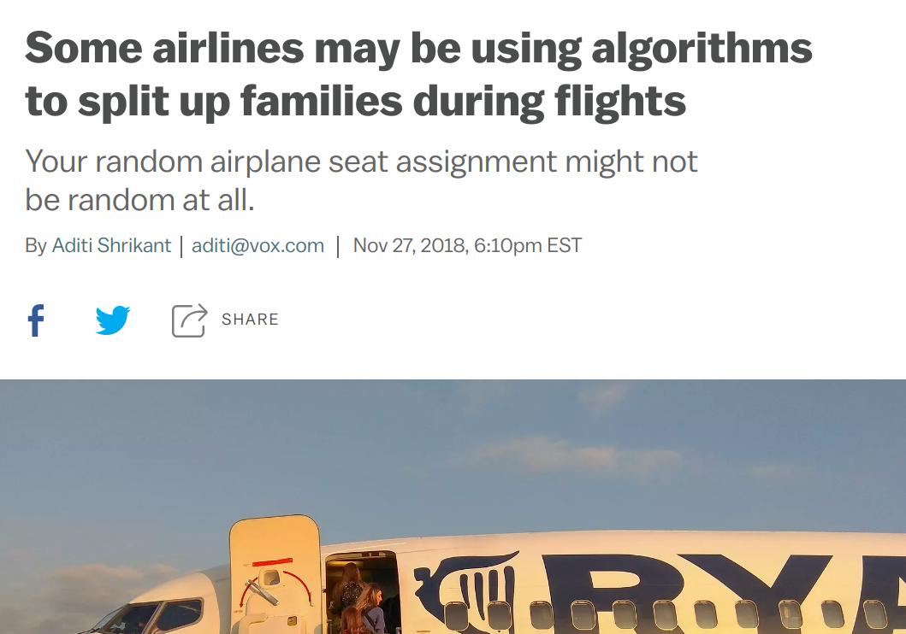
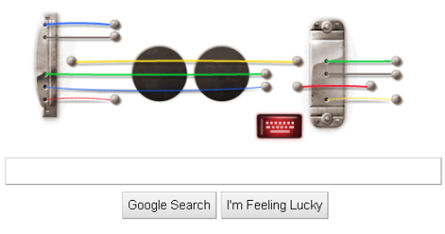
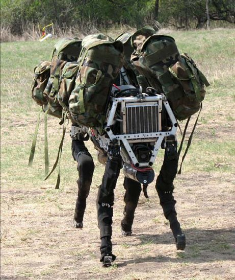
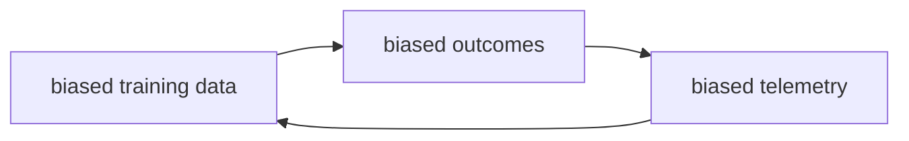

# Learning Goals

* Review the importance of ethical considerations in designing AI-enabled systems
* Recall basic strategies to reason about ethical challenges
* Diagnose potential ethical issues in a given system
* Understand the types of harm that can be caused by ML
* Understand the sources of bias in ML
* Analyze a system for harmful feedback loops

---
# Overview

Many interrelated issues:
* Ethics
* Fairness
* Justice
* Discrimination
* Safety
* Privacy
* Security
* Transparency
* Accountability

*Each is a deep and nuanced research topic. We focus on survey of some key issues.*

---
# Ethical vs Legal

----

<!-- split -->

*In September 2015, Shkreli received widespread criticism when Turing obtained the manufacturing license for the antiparasitic drug Daraprim and raised its price by a factor of 56 (from USD 13.5 to 750 per pill), leading him to be referred to by the media as "the most hated man in America" and "Pharma Bro".* -- [Wikipedia](https://en.wikipedia.org/wiki/Martin_Shkreli)

"*I could have raised it higher and made more profits for our shareholders. Which is my primary duty.*" -- Martin Shkreli

Note: Image source: https://en.wikipedia.org/wiki/Martin_Shkreli#/media/File:Martin_Shkreli_2016.jpg

----
## Terminology

* Legal = in accordance to societal laws
  - systematic body of rules governing society; set through government
  - punishment for violation
* Ethical = following moral principles of tradition, group, or individual
  - branch of philosophy, science of a standard human conduct
  - professional ethics = rules codified by professional organization
  - no legal binding, no enforcement beyond "shame"
  - high ethical standards may yield long term benefits through image and staff loyalty

----
## With a few lines of code...

----
## The Implications of our Choices

> “Update Jun 17: Wow—in just 48 hours in the U.S., you recorded 5.1 years worth of 
> music—40 million songs—using our doodle guitar. 
> And those songs were played back 870,000 times!“

----
<iframe width="800" height="600" src="https://www.youtube.com/embed/pi_SCJ7COw0" frameborder="0" allow="accelerometer; autoplay; encrypted-media; gyroscope; picture-in-picture" allowfullscreen></iframe>

---
# Concerns about an AI Future

----
## Safety

----
## Safety

----
## Safety

----
## Addiction

<!-- .element: class="stretch" -->

Notes: Infinite scroll in applications removes the natural breaking point at pagination where one might reflect and stop use.

----
## Addiction

----

----
## Mental Health

----

<!-- .element: class="stretch" -->

----
## Society: Unemployment Engineering / Deskilling

Notes: The dangers and risks of automating jobs.

Discuss issues around automated truck driving and the role of jobs.

See for example: Andrew Yang. The War on Normal People. 2019

----
## Society: Polarization

<!-- .element: class="stretch" -->

Notes: Recommendations for further readings: https://www.nytimes.com/column/kara-swisher, https://podcasts.apple.com/us/podcast/recode-decode/id1011668648

Also isolation, Cambridge Analytica, collaboration with ICE, ...

----
## Weapons, Surveillance, Suppression

<!-- colstart -->

<!-- col -->

<!-- colend -->

----
## Discrimination

----
## Discrimination

<!-- .element: class="stretch" -->

----
## Discrimination

* Unequal treatment in hiring, college admissions, credit rating, insurance, policing, sentencing, advertisement, ...
* Unequal outcomes in healthcare, accident prevention, ...
* Reinforcing patterns in predictive policing with feedback loops
*
* Technological redlining

----
## Any own experiences?

<!-- discussion -->

----
## Summary -- so far

* Safety issues
* Addiction and mental health
* Societal consequences: unemployment, polarization, monopolies
* Weapons, surveillance, suppression
* Discrimination, social equity
*
* Many issues are ethically problematic, but some are legal. Consequences?
* Intentional? Negligence? Unforeseeable?

---
# Fairness

----
## Legally protected classes (US)

* Race (Civil Rights Act of 1964)
* Color (Civil Rights Act of 1964)
* Sex (Equal Pay Act of 1963; Civil Rights Act of 1964)
* Religion (Civil Rights Act of 1964)
* National origin (Civil Rights Act of 1964)
* Citizenship (Immigration Reform and Control Act)
* Age (Age Discrimination in Employment Act of 1967)
* Pregnancy (Pregnancy Discrimination Act)
* Familial status (Civil Rights Act of 1968)
* Disability status (Rehabilitation Act of 1973; Americans with Disabilities Act of 1990)
* Veteran status (Vietnam Era Veterans' Readjustment Assistance Act of 1974; Uniformed Services Employment and Reemployment Rights Act)
* Genetic information (Genetic Information Nondiscrimination Act)

<!-- references -->
Barocas, Solon and Moritz Hardt. "[Fairness in machine learning](https://mrtz.org/nips17/#/)." NIPS Tutorial 1 (2017).

----
## Regulated domains (US)

* Credit (Equal Credit Opportunity Act)
* Education (Civil Rights Act of 1964; Education Amendments of 1972)
* Employment (Civil Rights Act of 1964)
* Housing (Fair Housing Act)
* ‘Public Accommodation’ (Civil Rights Act of 1964)

Extends to marketing and advertising; not limited to final decision

<!-- references -->
Barocas, Solon and Moritz Hardt. "[Fairness in machine learning](https://mrtz.org/nips17/#/)." NIPS Tutorial 1 (2017).

----

----
## Harms of Allocation

* Withhold opportunities or resources
* Poor quality of service, degraded user experience for certain groups

**Other examples?**

<!-- references -->

_[Gender Shades: Intersectional Accuracy Disparities in
Commercial Gender Classification](http://proceedings.mlr.press/v81/buolamwini18a/buolamwini18a.pdf)_, Buolamwini & Gebru, ACM FAT* (2018).

----
## Harms of Representation

* Reinforce stereotypes, subordination along the lines of identity

**Other examples?**

<!-- references -->

Latanya Sweeney. [Discrimination in Online Ad Delivery](https://dl.acm.org/doi/pdf/10.1145/2460276.2460278), SSRN (2013).

----
## Identifying harms

* Multiple types of harms can be caused by a product!
* Think about your system objectives & identify potential harms.

<!-- references -->

Swati Gupta, Henriette Cramer, Kenneth Holstein, Jennifer Wortman Vaughan, Hal Daumé III, Miroslav Dudík, Hanna Wallach, Sravana Reddy, Jean GarciaGathright. [Challenges of incorporating algorithmic fairness into practice](https://www.youtube.com/watch?v=UicKZv93SOY), FAT* Tutorial, 2019. ([slides](https://bit.ly/2UaOmTG))

----
## The Role of Requirements Engineering

* Identify system goals
* Identify legal constraints
* Identify stakeholders and fairness concerns
* Analyze risks with regard to discrimination and fairness
* Analyze possible feedback loops (world vs machine)
* Negotiate tradeoffs with stakeholders
* Set requirements/constraints for data and model
* Plan mitigations in the system (beyond the model)
* Design incident response plan
* Set expectations for offline and online assurance and monitoring

----
## Why care about fairness? 

* Obey the law
* Better product, serving wider audiences
* Competition
* Responsibility
* PR

*Examples?*

*Which argument appeals to which stakeholders?*

<!-- references -->

Swati Gupta, Henriette Cramer, Kenneth Holstein, Jennifer Wortman Vaughan, Hal Daumé III, Miroslav Dudík, Hanna Wallach, Sravana Reddy, Jean GarciaGathright. [Challenges of incorporating algorithmic fairness into practice](https://www.youtube.com/watch?v=UicKZv93SOY), FAT* Tutorial, 2019. ([slides](https://bit.ly/2UaOmTG))

----
## Case Study: College Admission

* Objective: Decide "Is this student likely to succeed"?
* Possible harms: Allocation of resources? Quality of service?
  Stereotyping? Denigration? Over-/Under-representation?

----
## Not all discrimination is harmful

* Loan lending: Gender discrimination is illegal.
* Medical diagnosis: Gender-specific diagnosis may be desirable.
* Discrimination is a __domain-specific__ concept!

**Other examples?**

----
## On Terminology

* Bias and discrimination are technical terms in machine learning
  - [selection bias](https://en.wikipedia.org/wiki/Selection_bias), [reporting bias](https://en.wikipedia.org/wiki/Reporting_bias), [bias of an estimator](https://en.wikipedia.org/wiki/Bias_of_an_estimator), [inductive/learning bias](https://en.wikipedia.org/wiki/Inductive_bias)
  - discrimination   refers to distinguishing outcomes (classification)
* The problem is *unjustified* differentiation, ethical issues
  - practical irrelevance
  - moral irrelevance

---
# Sources of Bias

----
##  Where does the bias come from?

<!-- references -->

Caliskan et al., _[Semantics derived automatically from language corpora contain
human-like biases](http://cs.bath.ac.uk/~jjb/ftp/CaliskanEtAl-authors-full.pdf)_, Science (2017).

----
## Sources of Bias

* Tainted examples / historical bias
* Skewed sample
* Limited features
* Sample size disparity
* Proxies

<!-- references -->

Barocas, Solon, and Andrew D. Selbst. "[Big data's disparate impact](http://www.cs.yale.edu/homes/jf/BarocasDisparateImpact.pdf)." Calif. L. Rev. 104 (2016): 671.

Mehrabi, Ninareh, Fred Morstatter, Nripsuta Saxena, Kristina Lerman, and Aram Galstyan. "](https://arxiv.org/pdf/1908.09635.pdf." arXiv preprint arXiv:1908.09635 (2019).

----
## Historical Bias

*Data reflects past biases, not intended outcomes*

Note: "An example of this type of bias can be found in a 2018 image search
result where searching for women CEOs ultimately resulted in fewer female CEO images due
to the fact that only 5% of Fortune 500 CEOs were woman—which would cause the search
results to be biased towards male CEOs. These search results were of course reflecting
the reality, but whether or not the search algorithms should reflect this reality is an issue worth
considering."

----
## Tainted Examples

*Samples or labels reflect human bias*

Note:
* Bias in the dataset caused by humans
* Some labels created manually by employers
* Dataset "tainted" by biased human judgement

----
## Skewed Sample

*Crime prediction for policing strategy*

Note: Initial bias in the data set, amplified 
through feedback loop

Other example: Street Bump app in Boston (2012) to detect potholes while driving favors areas with higher smartphone adoption

----
## Limited Features

*Features used are less informative/reliable for certain subpopulations*

Example: "Leave of absence" as feature in employee performance review

Note:
* Features are less informative or reliable for certain parts of the population
* Features that support accurate prediction for the majority may not do so
for a minority group
* Example: Employee performance review
  * "Leave of absence" as a feature (an indicator of poor performance)
  * Unfair bias against employees on parental leave

----
## Sample Size Disparity

*Less training data available for certain subpopulations*

Example: "Shirley Card" used for color calibration

Note:
* Less data available for certain parts of the population
* Example: "Shirley Card"
    * Used by Kodak for color calibration in photo films
    * Most "Shirley Cards" used Caucasian models
    * Poor color quality for other skin tones

----

----
## Proxies

*Features correlate with protected attributes*

Note:
* Certain features are correlated with class membership
* Example: Neighborhood as a proxy for race
* Even when sensitive attributes (e.g., race) are erased, bias may still occur

----
## Case Study: College Admission

<!-- .element: class="stretch" -->

* Classification: Is this student likely to succeed?
* Features: GPA, SAT, race, gender, household income, city, etc.,
* **Discuss:** Historical bias? Skewed sample? Tainted examples? Limited features? Sample size disparity? Proxies?

---
# Massive Potential Damage

<!-- .element: class="stretch" -->

O'Neil, Cathy. [Weapons of math destruction: How big data increases inequality and threatens democracy](https://cmu.primo.exlibrisgroup.com/permalink/01CMU_INST/6lpsnm/alma991016462699704436). Broadway Books, 2016.

----
## Example: Predictive Policing

*with a few lines of code...*

----

> A person who scores as ‘high risk’ is likely to be unemployed and to come from a neighborhood where many of his friends and family have had run-ins with the law. Thanks in part to the resulting high score on the evaluation, he gets a longer sentence, locking him away for more years in a prison where he’s surrounded by fellow criminals—which raises the likelihood that he’ll return to prison. He is finally released into the same poor neighborhood, this time with a criminal record, which makes it that much harder to find a job. If he commits another crime, the recidivism model can claim another success. But in fact the model itself contributes to a toxic cycle and helps to sustain it. -- Cathy O'Neil in [Weapons of Math Destruction](https://cmu.primo.exlibrisgroup.com/permalink/01CMU_INST/6lpsnm/alma991016462699704436)

----
## Feedback Loops

> "Big Data processes codify the past.  They do not invent the future.  Doing that requires moral imagination, and that’s something only humans can provide. " -- Cathy O'Neil in [Weapons of Math Destruction](https://cmu.primo.exlibrisgroup.com/permalink/01CMU_INST/6lpsnm/alma991016462699704436)

----
## Key Problems

* We trust algorithms to be objective, may not question their predictions
* Often designed by and for privileged/majority group
* Algorithms often black box (technically opaque and kept secret from public)
* Predictions based on correlations, not causation; may depend on flawed statistics
* Potential for gaming/attacks
* Despite positive intent, feedback loops may undermine the original goals

<!-- references -->

O'Neil, Cathy. [Weapons of math destruction: How big data increases inequality and threatens democracy](https://cmu.primo.exlibrisgroup.com/permalink/01CMU_INST/6lpsnm/alma991016462699704436). Broadway Books, 2016.

----
## "Weapons of Math Destruction"

* Algorithm evaluates people
  - e.g., credit, hiring, admissions, recidivism, advertisement, insurance, healthcare
* Widely used for life-affecting decisions
* Opaque and not accountable, no path to complain
* Feedback loop 

<!-- references -->

O'Neil, Cathy. [Weapons of math destruction: How big data increases inequality and threatens democracy](https://cmu.primo.exlibrisgroup.com/permalink/01CMU_INST/6lpsnm/alma991016462699704436). Broadway Books, 2016.

---
# Building Fair ML Systems

----
## Fairness must be considered throughout the ML lifecycle!

<!-- references -->

Bennett et al., [Fairness-aware Machine Learning](https://sites.google.com/view/wsdm19-fairness-tutorial), WSDM Tutorial (2019).

----
## The Role of Requirements Engineering

* Identify system goals
* Identify legal constraints
* Identify stakeholders and fairness concerns
* Analyze risks with regard to discrimination and fairness
* Analyze possible feedback loops (world vs machine)
* Negotiate tradeoffs with stakeholders
* Set requirements/constraints for data and model
* Plan mitigations in the system (beyond the model)
* Design incident response plan
* Set expectations for offline and online assurance and monitoring

----
## The Role of Software Engineers

* Whole system perspective
* Requirements engineering, identifying stakeholders
* Tradeoff decisions among conflicting goals
* Interaction and interface design
* Infrastructure for evaluating model quality and fairness offline and in production
* Monitoring
* System-wide mitigations (in model and beyond model)

----
## Best Practices: Task Definition

* Clearly define the task & model’s intended effects
* Try to identify and document unintended effects & biases
* Clearly define any fairness requirements
* *Involve diverse stakeholders & multiple perspectives*
* Refine the task definition & be willing to abort

<!-- references -->

Swati Gupta, Henriette Cramer, Kenneth Holstein, Jennifer Wortman Vaughan, Hal Daumé III, Miroslav Dudík, Hanna Wallach, Sravana Reddy, Jean GarciaGathright. [Challenges of incorporating algorithmic fairness into practice](https://www.youtube.com/watch?v=UicKZv93SOY), FAT* Tutorial, 2019. ([slides](https://bit.ly/2UaOmTG))

----
## Best Practices: Choosing a Data Source

* Think critically before collecting any data
* Check for biases in data source selection process
* Try to identify societal biases present in data source
* Check for biases in cultural context of data source
* Check that data source matches deployment context
* Check for biases in
  * technology used to collect the data
  * humans involved in collecting data
  * sampling strategy
* *Ensure sufficient representation of subpopulations*
* Check that collection process itself is fair & ethical

*How can we achieve fairness without putting a tax on already disadvantaged populations?*

<!-- references -->

Swati Gupta, Henriette Cramer, Kenneth Holstein, Jennifer Wortman Vaughan, Hal Daumé III, Miroslav Dudík, Hanna Wallach, Sravana Reddy, Jean GarciaGathright. [Challenges of incorporating algorithmic fairness into practice](https://www.youtube.com/watch?v=UicKZv93SOY), FAT* Tutorial, 2019. ([slides](https://bit.ly/2UaOmTG))

----
## Best Practices: Labeling and Preprocessing

* Check for biases introduced by
  - discarding data
  - bucketing values
  - preprocessing software
  - labeling/annotation software
  - human labelers
* Data/concept drift?

*Auditing? Measuring bias?*

<!-- references -->

Swati Gupta, Henriette Cramer, Kenneth Holstein, Jennifer Wortman Vaughan, Hal Daumé III, Miroslav Dudík, Hanna Wallach, Sravana Reddy, Jean GarciaGathright. [Challenges of incorporating algorithmic fairness into practice](https://www.youtube.com/watch?v=UicKZv93SOY), FAT* Tutorial, 2019. ([slides](https://bit.ly/2UaOmTG))

----
## Best Practices: Model Definition and Training

* Clearly define all assumptions about model
* Try to identify biases present in assumptions
* Check whether model structure introduces biases
* Check objective function for unintended effects
* Consider including “fairness” in objective function

<!-- references -->

Swati Gupta, Henriette Cramer, Kenneth Holstein, Jennifer Wortman Vaughan, Hal Daumé III, Miroslav Dudík, Hanna Wallach, Sravana Reddy, Jean GarciaGathright. [Challenges of incorporating algorithmic fairness into practice](https://www.youtube.com/watch?v=UicKZv93SOY), FAT* Tutorial, 2019. ([slides](https://bit.ly/2UaOmTG))

----
## Best Practices: Testing & Deployment

* Check that test data matches deployment context
* Ensure test data has sufficient representation
* Continue to involve diverse stakeholders
* Revisit all fairness requirements
* Use metrics to check that requirements are met
*
* Continually monitor
  - match between training data, test data, and instances you
encounter in deployment
  - fairness metrics
  - population shifts
  - user reports & user complaints
* Invite diverse stakeholders to audit system for biases

<!-- references -->

Swati Gupta, Henriette Cramer, Kenneth Holstein, Jennifer Wortman Vaughan, Hal Daumé III, Miroslav Dudík, Hanna Wallach, Sravana Reddy, Jean GarciaGathright. [Challenges of incorporating algorithmic fairness into practice](https://www.youtube.com/watch?v=UicKZv93SOY), FAT* Tutorial, 2019. ([slides](https://bit.ly/2UaOmTG))

---
# Dataset Construction for Fairness

----
## Flexibility in Data Collection

* Data science education often assumes data as given
* In industry most have control over data collection and curation (65%)
* Most address fairness issues by collecting more data (73%)

<!-- references -->

Swati Gupta, Henriette Cramer, Kenneth Holstein, Jennifer Wortman Vaughan, Hal Daumé III, Miroslav Dudík, Hanna Wallach, Sravana Reddy, Jean GarciaGathright. [Challenges of incorporating algorithmic fairness into practice](https://www.youtube.com/watch?v=UicKZv93SOY), FAT* Tutorial, 2019. ([slides](https://bit.ly/2UaOmTG))

----
*Bias can be introduced at any stage of the data pipeline*

<!-- references -->

Bennett et al., [Fairness-aware Machine Learning](https://sites.google.com/view/wsdm19-fairness-tutorial), WSDM Tutorial (2019).

----
## Types of Data Bias

* __Population bias__
* __Behavioral bias__
* Content production bias
* Linking bias
* Temporal bias

<!-- references -->

Olteanu et al., [Social Data: Biases, Methodological Pitfalls, and Ethical
Boundaries](https://www.frontiersin.org/articles/10.3389/fdata.2019.00013/pdf), Olteanu et al., Frontiers in Big Data (2019).

----
## Population Bias

* Differences in demographics between a dataset vs a target population
* Example: Does the Twitter demographics represent the general population?
* In many tasks, datasets should match the target population
* But some tasks require equal representation for fairness 

----
## Behavioral Bias

* Differences in user behavior across platforms or social contexts

*Example: Freelancing platforms (Fiverr vs TaskRabbit): Bias against certain minority groups on different platforms*

<!-- references -->

_Bias in Online Freelance Marketplaces_, Hannak et al., CSCW (2017).

----
## Faireness-Aware Data Collection

* Address population bias
  * Does the dataset reflect the demographics in the target population?
* Address under- & over-representation issues
   * Ensure sufficient amount of data for all groups to avoid being
   treated as "outliers" by ML
   * But also avoid over-representation of certain groups (e.g.,
     remove historical data)
* Data augmentation: Synthesize data for minority groups
  * Observed: "He is a doctor" -> synthesize "She is a doctor"
* Fairness-aware active learning
  * Collect more data for groups with highest error rates 

<!-- references -->

Bennett et al., [Fairness-aware Machine Learning](https://sites.google.com/view/wsdm19-fairness-tutorial), WSDM Tutorial (2019).

----
## Data Sheets 

* A process for documenting datasets
* Based on common practice in the electronics industry, medicine
* Purpose, provenance, creation, composition, distribution: Does the dataset relate to people? Does the dataset identify any subpopulations?

<!-- references -->

_[Datasheets for Dataset](https://arxiv.org/abs/1803.09010)_, Gebru et al., (2019). 

----
## Model Cards

<!-- .element: class="stretch" -->

see also https://modelcards.withgoogle.com/about

Mitchell, Margaret, et al. "[Model cards for model reporting](https://www.seas.upenn.edu/~cis399/files/lecture/l22/reading2.pdf)." In Proceedings of the Conference on fairness, accountability, and transparency, pp. 220-229. 2019.

----
## Exercise: Crime Map

*How can we modify an existing dataset or change the data collection
process to reduce the effects the feedback loop?*

---
# Summary

* Many interrelated issues: ethics, fairness, justice, safety, security, ...
* Many many many potential issues
* Consider fairness when it's the law and because it's ethical
* Large potential for damage: Harm of allocation & harm of representation
* Sources of bias in ML: skewed sample, tainted examples, limited features, sample size, disparity, proxies
* Be aware of feedback loops
* Addressing fairness requirements engineering and throughout the entire ML pipeline
* Data bias & data collection for fairness
*
* Recommended readings: [Weapons of Math Destructions](https://cmu.primo.exlibrisgroup.com/permalink/01CMU_INST/6lpsnm/alma991016462699704436) and [several](https://fairmlbook.org/tutorial1.html) [tutorials](https://sites.google.com/view/wsdm19-fairness-tutorial) on [ML fairness](https://sites.google.com/view/kdd19-fairness-tutorial)
* __Next__: Definitions of fairness, measurement, testing for fairness

