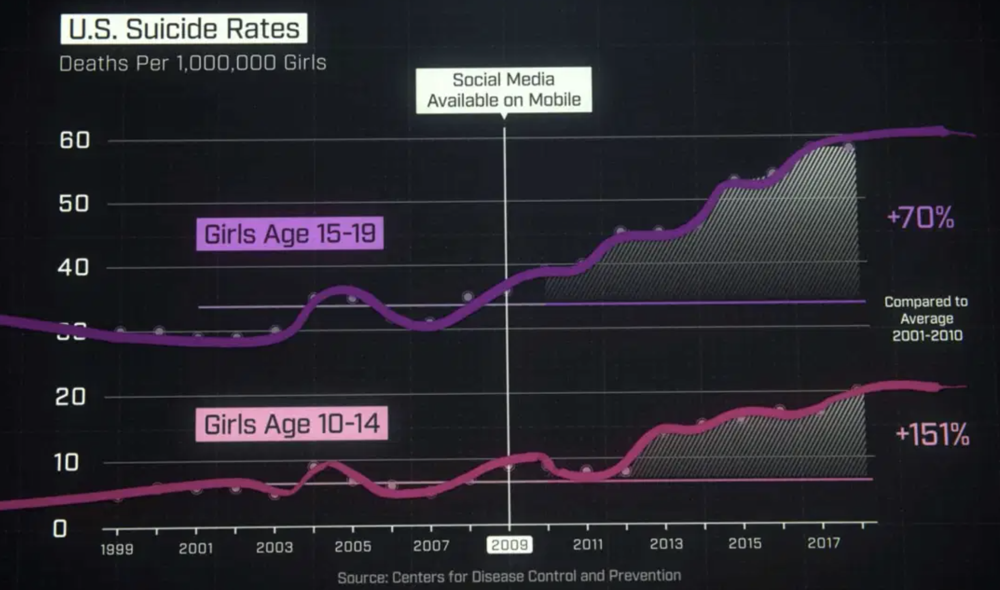
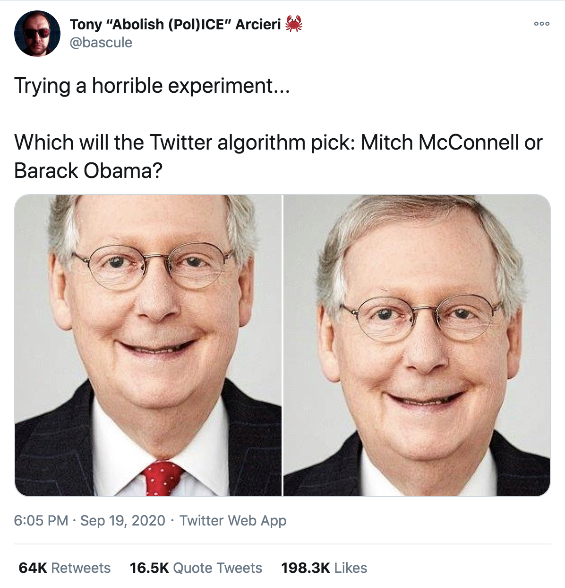

# Learning Goals

* Review the importance of ethical considerations in designing AI-enabled systems
* Recall basic strategies to reason about ethical challenges
* Diagnose potential ethical issues in a given system
* Understand the types of harm that can be caused by ML
* Understand the sources of bias in ML

---
# Overview

Many interrelated issues:
* Ethics
* Fairness
* Justice
* Discrimination
* Safety
* Privacy
* Security
* Transparency
* Accountability

*Each is a deep and nuanced research topic. We focus on survey of some key issues.*

----

<!-- split -->

*In September 2015, Shkreli received widespread criticism when Turing obtained the manufacturing license for the antiparasitic drug Daraprim and raised its price by a factor of 56 (from USD 13.5 to 750 per pill), leading him to be referred to by the media as "the most hated man in America" and "Pharma Bro".* -- [Wikipedia](https://en.wikipedia.org/wiki/Martin_Shkreli)

"*I could have raised it higher and made more profits for our shareholders. Which is my primary duty.*" -- Martin Shkreli

Note: Image source: https://en.wikipedia.org/wiki/Martin_Shkreli#/media/File:Martin_Shkreli_2016.jpg

----
## Terminology

* Legal = in accordance to societal laws
  - systematic body of rules governing society; set through government
  - punishment for violation
* Ethical = following moral principles of tradition, group, or individual
  - branch of philosophy, science of a standard human conduct
  - professional ethics = rules codified by professional organization
  - no legal binding, no enforcement beyond "shame"
  - high ethical standards may yield long term benefits through image and staff loyalty

----
## Anoter Example: Social Media

<!-- .element: class="stretch" -->

Q. What is the (real) organizational objective of the company?

----
## Optimizing for Organizational Objective

<!-- .element: class="stretch" -->

* How do we maximize the user engagement?
  - Infinite scroll: Encourage non-stop, continual use
  - Personal recommendations: Suggest news feed to increase engagement
  - Push notifications: Notify disengaged users to return to the app

----
## Addiction

* 210M people worldwide addicted to social media
* 71% of Americans sleep next to a mobile device
* ~1000 people injured **per day** due to distracted
  driving (USA)

<!-- references -->
https://www.flurry.com/blog/mobile-addicts-multiply-across-the-globe/

https://www.cdc.gov/motorvehiclesafety/Distracted_Driving/index.html

----
## Mental Health

* 35% of US teenagers with low social-emotional well-being have been bullied on social media.
* 70% of teens feel excluded when using social media.

<!-- references -->
https://leftronic.com/social-media-addiction-statistics

----
## Disinformation & Polarization

<!-- .element: class="stretch" -->

----
## Discrimination

<!-- references -->
https://twitter.com/bascule/status/1307440596668182528

----
## Who's to blame?

<!-- .element: class="stretch" -->

* Q. Are these companies intentionally trying to cause harm? If not,
  what are the root causes of the problem?

----
## Challenges

* Misalignment between organizational goals & societal values
  * Financial incentives often dominate other goals ("grow or die")
* Insufficient amount of regulations
  * Little legal consequences for causing negative impact (with some exceptions)
  * Poor understanding of socio-technical systems by policy makers 
* Engineering challenges, both at system- & ML-level
  * Difficult to clearly define or measure ethical values
  * Difficult to predict possible usage contexts
  * Difficult to predict impact of feedback loops
  * Difficult to prevent malicious actors from abusing the system
  * Difficult to interpret output of ML and make ethical decisions
  * ...
  
**These problems have existed before, but they are being
  rapidly exacerbated by the widespread use of ML**

---
# Fairness

----
## Legally protected classes (US)

* Race (Civil Rights Act of 1964)
* Color (Civil Rights Act of 1964)
* Sex (Equal Pay Act of 1963; Civil Rights Act of 1964)
* Religion (Civil Rights Act of 1964)
* National origin (Civil Rights Act of 1964)
* Citizenship (Immigration Reform and Control Act)
* Age (Age Discrimination in Employment Act of 1967)
* Pregnancy (Pregnancy Discrimination Act)
* Familial status (Civil Rights Act of 1968)
* Disability status (Rehabilitation Act of 1973; Americans with Disabilities Act of 1990)
* Veteran status (Vietnam Era Veterans' Readjustment Assistance Act of 1974; Uniformed Services Employment and Reemployment Rights Act)
* Genetic information (Genetic Information Nondiscrimination Act)

<!-- references -->
Barocas, Solon and Moritz Hardt. "[Fairness in machine learning](https://mrtz.org/nips17/#/)." NIPS Tutorial 1 (2017).

----
## Regulated domains (US)

* Credit (Equal Credit Opportunity Act)
* Education (Civil Rights Act of 1964; Education Amendments of 1972)
* Employment (Civil Rights Act of 1964)
* Housing (Fair Housing Act)
* ‘Public Accommodation’ (Civil Rights Act of 1964)

Extends to marketing and advertising; not limited to final decision

<!-- references -->
Barocas, Solon and Moritz Hardt. "[Fairness in machine learning](https://mrtz.org/nips17/#/)." NIPS Tutorial 1 (2017).

----
## Equality vs Equity vs Justice

----
## Types of Harm on Society

* __Harms of allocation__: Withhold opportunities or resources
* __Harms of representation__: Reinforce stereotypes, subordination along
  the lines of identity

<!-- references -->

 “The Trouble With Bias”, Kate Crawford, Keynote@N(eur)IPS (2017).

----
## Harms of Allocation

* Withhold opportunities or resources
* Poor quality of service, degraded user experience for certain groups

__Q. Other examples?__

<!-- references -->

_Gender Shades: Intersectional Accuracy Disparities in
Commercial Gender Classification_, Buolamwini & Gebru, ACM FAT* (2018).

----
## Harms of Representation

* Over/under-representation, reinforcement of stereotypes

__Q. Other examples?__

<!-- references -->

_Discrimination in Online Ad Delivery_, Latanya Sweeney, SSRN (2013).

----
## Identifying harms

* Multiple types of harms can be caused by a product!
* Think about your system objectives & identify potential harms.

<!-- references -->

_Challenges of incorporating algorithmic fairness into practice_, FAT* Tutorial (2019).

----
## Not all discrimination is harmful

* Loan lending: Gender discrimination is illegal.
* Medical diagnosis: Gender-specific diagnosis may be desirable.
* The problem is _unjustified_ differentiation; i.e., discriminating on factors that should not matter
* Discrimination is a __domain-specific__ concept, and must be
  understood in the context of the problem domain (i.e., world vs machine)

__Q. Other examples__?

----
## Role of Requirements Engineering

* Identify system goals
* Identify legal constraints
* Identify stakeholders and fairness concerns
* Analyze risks with regard to discrimination and fairness
* Analyze possible feedback loops (world vs machine)
* Negotiate tradeoffs with stakeholders
* Set requirements/constraints for data and model
* Plan mitigations in the system (beyond the model)
* Design incident response plan
* Set expectations for offline and online assurance and monitoring

<!-- ---- -->
<!-- ## On Terminology -->

<!-- * Bias and discrimination are technical terms in machine learning -->
<!--   - [selection bias](https://en.wikipedia.org/wiki/Selection_bias), [reporting bias](https://en.wikipedia.org/wiki/Reporting_bias), [bias of an estimator](https://en.wikipedia.org/wiki/Bias_of_an_estimator), [inductive/learning bias](https://en.wikipedia.org/wiki/Inductive_bias) -->
<!--   - discrimination   refers to distinguishing outcomes (classification) -->
<!-- * The problem is *unjustified* differentiation, ethical issues -->
<!--   - practical irrelevance -->
<!--   - moral irrelevance -->

---
# Sources of Bias

----
##  Where does the bias come from?

<!-- references -->

_Semantics derived automatically from language corpora contain
human-like biases_, Caliskan et al., Science (2017).

----
## Where does the bias come from?

----
## Sources of Bias

* Historial bias
* Tainted examples
* Skewed sample
* Limited features
* Sample size disparity
* Proxies

<!-- references -->

_Big Data's Disparate Impact_, Barocas & Selbst California Law Review (2016).

----
## Historical Bias

*Data reflects past biases, not intended outcomes*

<!-- .element: class="stretch" -->

Note: "An example of this type of bias can be found in a 2018 image search
result where searching for women CEOs ultimately resulted in fewer female CEO images due
to the fact that only 5% of Fortune 500 CEOs were woman—which would cause the search
results to be biased towards male CEOs. These search results were of course reflecting
the reality, but whether or not the search algorithms should reflect this reality is an issue worth
considering."

----
## Tainted Examples

*Bias in the dataset caused by humans*

* Example: Hiring decision dataset
  * Some labels created manually by employers
  * Dataset "tainted" by biased human judgement

----
## Skewed Sample

*Initial bias compounds over time & skews sampling towards certain parts of population*

* Example: Crime prediction for policing strategy

----
## Limited Features

*Features that are less informative or reliable for certain parts of the population*

* Features that support accurate prediction for the majority may not do so
for a minority group
* Example: Employee performance review
  * "Leave of absence" as a feature (an indicator of poor performance)
  * Unfair bias against employees on parental leave

----
## Sample Size Disparity

*Less data available for certain parts of the population*

* Example: "Shirley Card"
	* Used by Kodak for color calibration in photo films
	* Most "Shirley Cards" used Caucasian models
	* Poor color quality for other skin tones

----
## Proxies

*Certain features are correlated with class membership*

* Example: Neighborhood as a proxy for race
* Even when sensitive attributes (e.g., race) are erased, bias may still occur

----
## Case Study: College Admission

* Objective: Evaluate applications & identify students who are most
likely to succeed
* Features: GPA, GRE/SAT, gender, race, undergrad institute, alumni
  connections, household income, hometown, etc., 

----
## Case Study: College Admission

* Possible harms: Allocation of resources? Quality of service?
  Stereotyping? Denigration? Over-/Under-representation?
* Sources of bias: Skewed sample? Tainted examples? Historical bias? Limited features?
	Sample size disparity? Proxies?

---
# Building Fair ML Systems

----
## Fairness must be considered throughout the ML lifecycle!

<!-- references -->

_Fairness-aware Machine Learning_, Bennett et al., WSDM Tutorial (2019).

---
# Summary

* Many interrelated issues: ethics, fairness, justice, safety, security, ...
* Both legal & ethical dimensions
* Challenges with developing ethical systnems
* Large potential for damage: Harm of allocation & harm of representation
* Sources of bias in ML
  * Skewed sample, tainted examples, limited
features, sample size, disparity, proxies
* Addressing fairness throughout the ML pipeline
* Data bias & data collection for fairness
* __Next class__: Definitions of fairness, measurement, testing for fairness

