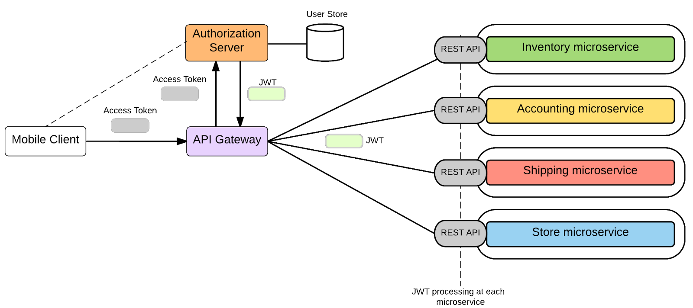

# Scalable and Distributed Systems

> “Don’t run a distributed system until you absolutely have to.” — Denise Yu

Christian Kaestner

---
# Learning Goals

* Summarize the challenges of distributed systems
* Evaluate benefits and drawbacks of microservice architectures
* Diagnose bottlenecks with architectural modeling and performance analysis
* Plan for failure cases in a distributed systems
* Deploy models as a service

---
# Scaling Computations

<!-- colstart -->
Efficent Algorithms
<!-- col -->
Faster Machines
<!-- col -->
More Machines
<!-- colend -->

----
# Distributed Systems

* Computations distributed across multiple networked machines
* Motivations: reliability and scalability 
	* Multiple redundant servers, can take over on crashes
	* Multiple servers can serve requests in parallel
* Challenges: various failures

----
# Reliability and Scalability Challenges in AI-Enabled Systems?

<!-- discussion -->

----
# Distributed Systems and AI-Enabled Systems

* Learning tasks can take substantial resources
* Datasets too large to fit on single machine
* Nontrivial inference time, many many users
* Large amounts of telemetry
* Experimentation at scale
* Models in safety critical parts
* Mobile computing, edge computing, cyber-physical systems

---
# Microservices 

----
## Key Ideas

* Split the application into services / components with API
* Develop and operate services independently
* Move data to services, scale independently

Example

* Twitter before redesign: Database and Ruby application -- entire Ruby application replicated
* Twitter after redesign: Independent services, each with own database -- replicated independently

----

<!-- references -->

source: http://martinfowler.com/articles/microservices.html
----

<!-- references -->

source: http://martinfowler.com/articles/microservices.html

----
## Microservices

* Building applications as suite of small and easy to replace services
	* fine grained, one functionality per service
	* (sometimes 3-5 classes)
	* composable, focus on API design
	* easy to develop, test, and understand
	* fast (re)start, fault isolation
	* modeled around business domain
* Interplay of different systems and languages, no commitment to technology stack (except maybe communication protocol)
* Easily deployable and replicable
* Embrace automation, embrace faults
* Highly observable

----
## Example

https://github.com/dotnet-architecture/eShopOnContainers

----
## Technical Considerations

* HTTP/REST/JSON communication -- interoperability
* Independent development and deployment -- continuous deployment?
* Monitoring essential -- frameworks, telemetry, baked into communication libraries?
* Self-contained services -- each with own database
* Multiple instances behind load-balancer
* Coordination, discovery, access control: API Gateways

----

<!-- references -->

Source: Kasun Indrasiri, Microservices in Practice: From Architecture to Deployment

----
## Drawbacks

<!-- discussion -->

----
## Drawbacks

* Complexities of distributed systems
	* network latency, faults, inconsistencies
	* testing challenges
* Resource overhead, RPCs
* Shifting complexities to the network
* Operational complexity
* Frequently adopted by breaking down monolithic application
* HTTP/REST/JSON communication

Do microservices solve problems, or push them down the line?

----

> “If you can’t build a well-structured monolith, what makes you think microservices is the answer?” – Simon Brown

----

----
## Microservices and AI-Enabled Systems

<!-- discussion -->

----
## Case Study: Yelp Images

<!-- colstart -->

<!-- col -->

<!-- colend -->

Notes: Identify services (with and without AI) for uploading pictures, sorting and classifying pictures, showing pictures, etc.

---
# Managing Failures
----

----
## Common Distributed System Issues

* Systems may crash
* Messages take time
* Messages may get lost
* Messages may arrive out of order
* Messages may arrive multiple times
* Messages may get manipulated along the way
* Bandwidth limits
* Coordination overhead
* Network partition
* ...

----
## Types of failure behaviors

* Fail-stop
* Other halting failures
* Communication failures
	* Send/receive omissions
	* Network partitions
	* Message corruption
* Data corruption
* Performance failures
	* High packet loss rate
	* Low throughput
	* High latency
* Byzantine failures

----
## Common Assumptions about Failures

* Behavior of others is fail-stop 
* Network is reliable 
* Network is semi-reliable but asynchronous
* Network is lossy but messages are not corrupt
* Network failures are transitive
* Failures are independent
* Local data is not corrupt
* Failures are reliably detectable
* Failures are unreliably detectable

----
## Strategies to Handle Failures

* Timeouts, retry, backup services
* Detect crashed machines (ping/echo, heartbeat)
* Redundant + first/voting
* Transactions
*
* Do lost messages matter?
* Effect of resending message?

----
## Test Error Handling

* Recall: Testing with stubs
* Recall: Chaos experiments

----
## The CAP Theorem

> Consistency, Availability, Partition Tolerant -- Pick 2

----
## Case Study: Yelp Images

<!-- colstart -->

<!-- col -->

<!-- colend -->

Notes: Discuss for the previously identified services, which messages are critical and what strategies to apply to handle potential failures

---
# Performance Planning and Analysis

----
## Performance Planning and Analysis

* Ideally architectural planning upfront
  * Identify key components and their interactions
  * Estimate performance parameters
  * Simulate system behavior (e.g., queuing theory)

* Existing system: Analyze performance bottlenecks
  * Profiling of individual components
  * Performance testing (stress testing, load testing, etc)
  * Performance monitoring of distributed systems

----
## Performance Analysis

* What is the average waiting?
* How many customers are waiting on average? 
* How long is the average service time?
* What are the chances of one or more servers being idle? 
* What is the average utilization of the servers?
*
* Early analysis of different designs for bottlenecks
* Capacity planning

----
## Queuing Theory

* Queuing theory deals with the analysis of lines where customers wait to receive a service
	* Waiting at Quiznos
	* Waiting to check-in at an airport
	* Kept on hold at a call center
	* Streaming video over the net
	* Requesting a web service
* A queue is formed when request for services outpace the ability of the server(s) to service them immediately
	* Requests arrive faster than they can be processed (unstable queue)
	* Requests do not arrive faster than they can be processed but their processing is delayed by some time (stable queue)
* Queues exist because infinite capacity is infinitely expensive and excessive capacity is excessively expensive

----
## Queuing Theory

----
## Analysis Steps (roughly)

* Identify system abstraction to analyze (typically architectural level, e.g. services, but also protocols, datastructures and components, parallel processes, networks)
* Model connections and dependencies
* Estimate latency and capacity per component (measurement and testing, prior systems, estimates, …)
* Run simulation/analysis to gather performance curves
* Evaluate sensitivity of simulation/analysis to various parameters (‘what-if questions’)

----
## Simulation (e.g., JMT)

<!-- references -->

G.Serazzi Ed. Performance Evaluation Modelling with JMT: learning by examples. Politecnico di Milano - DEI, TR 2008.09, 366 pp., June 2008 

----
## Profiling 

Mostly used during development phase in single components

----
## Performance Testing

* Load testing: Assure handling of maximum expected load
* Scalability testing: Test with increasing load
* Soak/spike testing: Overload application for some time, observe stability
* Stress testing: Overwhelm system resources, test graceful failure + recovery
*
* Observe (1) latency, (2) throughput, (3) resource use
* All automateable; tools like JMeter

----
## Performance Monitoring of Distributed Systems

<!-- references -->
Source: https://blog.appdynamics.com/tag/fiserv/

----
## Performance Monitoring of Distributed Systems

* Instrumentation of (Service) APIs
* Load of various servers
* Typically measures: latency, traffic, errors, saturation
* 
* Monitoring long-term trends
* Alerting
* Automated releases/rollbacks
* Canary testing and A/B testing

---
# Architectural Decision: Independent Model Service

Model Inference and Model Learning as a RESTful Service?

----
## Coupling and Changeability

What's the interface between the AI component and the rest of the system?

* Learning data and process
* Inference API
    - Where does feature extraction happen? 
    - Provide raw data (images, user profile, all past purchases) to service, grant access to shared database, or provide feature vector?
    - Cost of feature extraction? Who bears the cost?
    - Versioned interface?
* Coupling to other models? Direct coupling to data sources (e.g., files, databases)? Expected formats for raw data (e.g., image resolution)?
* Coupling to telemetry?

----
## Model Service API

Consider encapsulating the model as a microservice. Sketch a (REST) API.

<!-- colstart -->

<!-- col -->

<!-- colend -->

----
## Future-Proofing an API

* Anticipating and encapsulating change
    - What parts around the model service are likely to change?
    - Rigid vs flexible data formats?
* Versioning of APIs
    - Version numbers vs immutable services?
    - Expecting to run multiple versions in parallel? Implications for learning and evolution?

----
## Robustness

* Redundancy for availability?
* Load balancer for scalability?
* Can mistakes be isolated?
    - Local error handling?
    - Telemetry to isolate errors to component?
* Logging and log analysis for what qualities?

---

# AI as a Service

Third-Party AI Components in the Cloud

AI Components as Microservices

----

## Readymade AI Components in the Cloud

* Data Infrastructure
    - Large scale data storage, databases, stream (MongoDB, Bigtable, Kafka)
* Data Processing
    - Massively parallel stream and batch processing (Sparks, Hadoop, ...)
    - Elastic containers, virtual machines (docker, AWS lambda, ...)
* AI Tools
    - Notebooks, IDEs, Visualization
    - Learning Libraries, Frameworks (tensorflow, torch, keras, ...)
* Models
    - Image, face, and speech recognition, translation
    - Chatbots, spell checking, text analytics
    - Recommendations, knowledge bases

----

----

## Build vs Buy

Hardware, software, models?

<!-- discussion -->

Notes: Discuss privacy implications

---
# Summary

* Distributed systems: robustness and scalability at a cost
  * various failures possible
  * plan for and manage failures
* Microservices: Separately deploy services and data
* Architectural performance modeling vs performance analysis of existing system
* Deploying models as a service and using cloud AI services