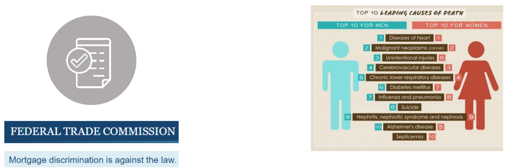
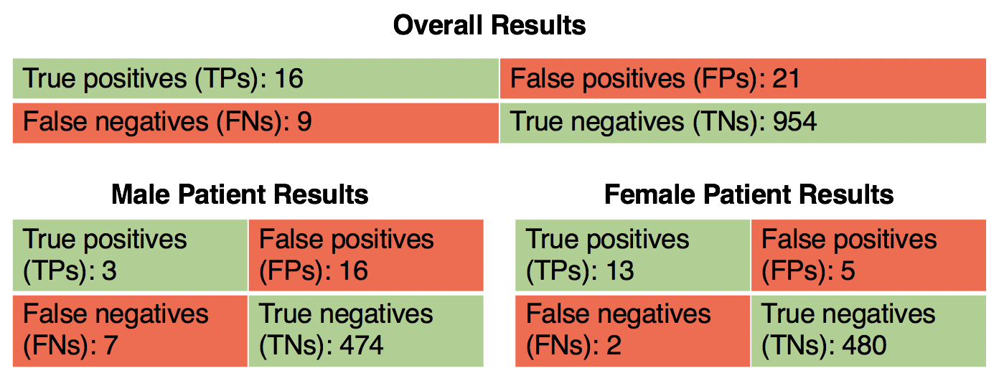
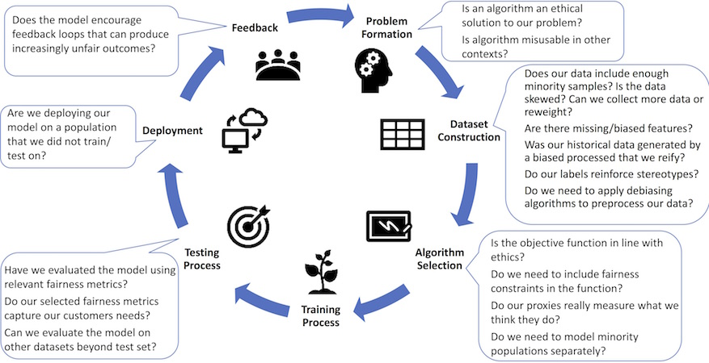

# Fairness: Definitions and Measurements

Eunsuk Kang

<!-- references -->

Required reading: Holstein, Kenneth, Jennifer Wortman Vaughan, Hal
Daumé III, Miro Dudik, and Hanna
Wallach. "[Improving fairness in machine learning systems: What do industry practitioners need?](http://users.umiacs.umd.edu/~hal/docs/daume19fairness.pdf)"
In Proceedings of the 2019 CHI Conference on Human Factors in
Computing Systems, pp. 1-16. 2019.

---
# Learning Goals

* Understand different definitions of fairness
* Discuss methods for measuring fairness
* Consider fairness throughout an ML lifecycle

---
# Fairness: Definitions

----
### Fairness is still an actively studied & disputed concept!

<!-- references -->
Source: Mortiz Hardt, https://fairmlclass.github.io/

----
## Fairness: Definitions

* Anti-classification (fairness through blindness)
* Group fairness (independence)
* Separation (equalized odds)
* ...and numerous others!

----
## Fairness: Definitions

* __Anti-classification (fairness through blindness)__
* Group fairness (independence)
* Separation (equalized odds)

----
## Anti-Classification

* Also called _fairness through blindness_
* Ignore certain sensitive attributes when making a decision
* Example: Remove gender or race from a credit scoring model
* __Q. Easy to implement, but any limitations__?

----
## Recall: Proxies

*Features correlate with protected attributes*

----
## Recall: Not all discrimination is harmful

* Loan lending: Gender discrimination is illegal.
* Medical diagnosis: Gender-specific diagnosis may be desirable.
* Discrimination is a __domain-specific__ concept!

**Other examples?**

----
## Anti-Classification

* Ignore certain sensitive attributes when making a decision
* Limitations
  * Sensitive attributes may be correlated with other features
  * Some ML tasks need sensitive attributes (e.g., medical diagnosis)

----
## Testing Anti-Classification

How do we test that a classifier achieves anti-classification?

----
## Testing Anti-Classification

Straightforward invariant for classifier $f$ and protected attribute $p$: 

$\forall x. f(x[p\leftarrow 0]) = f(x[p\leftarrow 1])$

*(does not account for correlated attributes)*

Test with random input data or on any test data

Any single inconsistency shows that the protected attribute was used. Can also report percentage of inconsistencies.

<!-- references -->
See for example: Galhotra, Sainyam, Yuriy Brun, and Alexandra Meliou. "[Fairness testing: testing software for discrimination](http://people.cs.umass.edu/brun/pubs/pubs/Galhotra17fse.pdf)." In Proceedings of the 2017 11th Joint Meeting on Foundations of Software Engineering, pp. 498-510. 2017.

----
## Fairness: Definitions

* Anti-classification (fairness through blindness)
* __Group fairness (independence)__
* Separation (equalized odds)

----
## Notations

* $X$: Feature set (e.g., age, race, education, region, income, etc.,)  
* $A \in X$: Sensitive attribute (e.g., gender)
* $R$: Regression score (e.g., predicted likelihood of on-time loan payment)
* $Y'$: Classifier output
  * $Y' = 1$ if and only if $R > T$ for some threshold $T$
  * e.g., Grant the loan ($Y' = 1$) if the likelihood of paying back > 80% 
* $Y$: Target variable being predicted ($Y = 1$ if the person actually
  pays back on time)

[Setting classification thresholds: Loan lending example](https://research.google.com/bigpicture/attacking-discrimination-in-ml)

----
## Group Fairness

$P[Y' = 1 | A = a]  = P[Y' = 1 | A = b]$

* Also called _independence_ or _demographic parity_
* Mathematically, $Y' \perp A$
  * Prediction ($Y'$)  must be independent of the sensitive attribute ($A$)
* Examples:
	* The predicted rate of recidivism is the same across all races
	* Both women and men have the equal probability of being promoted
		* i.e., P[promote = 1 | gender = M] = P[promote = 1 | gender = F] 

----
## Group Fairness

* Q. What are limitations of group fairness?
  <!-- .element: class="fragment" -->
  * Ignores possible correlation between $Y$ and $A$
    <!-- .element: class="fragment" -->
	* Rules out perfect predictor $Y' = Y$ when $Y$ & $A$ are correlated
  * Permits abuse and laziness: Can be satisfied by randomly assigning
    a positive outcome ($Y' = 1$) to protected groups
    <!-- .element: class="fragment" -->
	* e.g., Randomly promote people (regardless of their
      job performance) to match the rate across all groups

----
## Recall: Equality vs Equity

----
## Adjusting Thresholds for Group Fairness

Set $t_0$, $t_1$ such that $P[R > t_0 | A = 0]  = P[R > t_1 | A = 1]$

* Select different classification thresholds ($t_0$, $t_1$) for different groups (A = 0,
  A = 1) to achieve group fairness
<!-- .element: class="fragment" -->
* Example: Loan lending
<!-- .element: class="fragment" -->
  * R: Likelihood of paying back the loan on time
  * Suppose: With a uniform threshold used (i.e., R = 80%), group fairness is not achieved
	* P[R > 0.8 | A = 0] = 0.4,  P[R > 0.8 | A = 1] = 0.7
  * Adjust thresholds to achieve group fairness
	* P[R > 0.6 | A = 0]  = P[R > 0.8 | A = 1]
* But this also seems unfair to some of the groups! (i.e., A = 1)
	<!-- .element: class="fragment" -->
   * Q. When does this type of adjustment make sense?

----
## Testing Group Fairness

* How would you test whether a classifier achieves group fairness?
<!-- .element: class="fragment" -->
* Separate validation/telemetry data by protected attributes
<!-- .element: class="fragment" -->
	* Generate realistic test data, e.g. from probability distribution of population
	<!-- .element: class="fragment" -->
* Separately measure the rate of positive predictions
<!-- .element: class="fragment" -->
	* e.g., P[promoted = 1 | gender = M],
      P[promoted = 1 | gender = F] = ?
* Report issue if the rates differ beyond some threshold $\epsilon$ across
groups
  <!-- .element: class="fragment" -->

----
## Fairness: Definitions

* Anti-classification (fairness through blindness)
* Group fairness (independence)
* __Separation (equalized odds)__

----
## Separation

$P[Y'=1∣Y=0,A=a] = P[Y'=1∣Y=0,A=b]$
$P[Y'=0∣Y=1,A=a] = P[Y'=0∣Y=1,A=b]$

* Also called _equalized odds_ 
* $Y' \perp A | Y$
  * Prediction must be independent of the sensitive attribute
  _conditional_ on the target variable

----
## Review: Confusion Matrix

Can we explain separation in terms of model errors?

$P[Y'=1∣Y=0,A=a] = P[Y'=1∣Y=0,A=b]$
$P[Y'=0∣Y=1,A=a] = P[Y'=0∣Y=1,A=b]$

----
## Separation

$P[Y'=1∣Y=0,A=a] = P[Y'=1∣Y=0,A=b]$ (FPR parity)
$P[Y'=0∣Y=1,A=a] = P[Y'=0∣Y=1,A=b]$ (FNR parity)

* $Y' \perp A | Y$
  * Prediction must be independent of the sensitive attribute
    _conditional_ on the target variable
* i.e., All groups are susceptible to the same false positive/negative rates
<!-- .element: class="fragment" -->
* Example: Promotion
<!-- .element: class="fragment" -->
  * Y': Promotion decision, A: Gender of applicant: Y: Actual job performance
  * Separation w/ FNR: Probability of being incorrectly denied promotion is equal
    across both male & female employees

----
## Testing Separation

* Generate separate validation sets for each group
* Separate validation/telemetry data by protected attribute
  - Or generate *realistic*  test data, e.g. from probability distribution of population
* Separately measure false positive and false negative rates
  * e..g, for FNR, compare P[promoted = 0 | female, good employee] vs P[promoted = 0 | male, good employee]
* Q. How is this different from testing group fairness?

----
## Case Study: Cancer Diagnosis

----
## Exercise: Cancer Diagnosis

* 1000 data samples (500 male & 500 female patients)
* Does the model achieve group fairness? Separation w/ FPR or FNR?
* What can we conclude about the model & its usage?  

----
## Review of Criteria so far:

*Recidivism scenario: Should a person be detained?*

* Anti-classification: ?
* Group fairness: ?
* Separation: ?

<!-- split -->

----
## Review of Criteria so far:

*Recidivism scenario: Should a defendant be detained?*

* Anti-classification: Race and gender should not be considered for the decision at all
* Group fairness: Detention rates should be equal across gender and race groups
* Separation: Among defendants who would not have gone on to commit a
violent crime if released, detention rates are equal across gender and race groups

---
# Achieving Fairness Criteria

----
## Can we achieve fairness during the learning process?

* Data acquisition:
  - Collect additional data if performance is poor on some groups
* Pre-processing:
  * Clean the dataset to reduce correlation between the feature set
    and sensitive attributes
* Training constraints
  * ML is a constraint optimization problem (i.e., minimize errors)
  * Impose additional parity constraint into ML optimization process
    (as part of the loss function)
* Post-processing
  * Adjust thresholds to achieve a desired fairness metric
* (Still active area of research! Many new techniques published each year)

<!-- references -->
_Training Well-Generalizing Classifiers for Fairness Metrics and
Other Data-Dependent Constraints_, Cotter et al., (2018).

----
## Trade-offs in Fairness vs Accuracy

<!-- .element: class="stretch" -->

* In general, accuracy is at odds with fairness
  * e.g., Impossible to achieve perfect accuracy ($R = Y$) while
  ensuring group fairness
* Determine how much compromise in accuracy or fairness is acceptable to
  your stakeholders

<!-- references -->

_Fairness Constraints: Mechanisms for Fair Classification_, Zafar et
al., AISTATS (2017).

---
# Building Fair ML Systems

----
## Fairness must be considered throughout the ML lifecycle!

<!-- references -->

_Fairness-aware Machine Learning_, Bennett et al., WSDM Tutorial (2019).

----
## Practitioner Challenges

* Fairness is a system-level property
  - Consider goals, user interaction design, data collection, monitoring, model interaction (properties of a single model may not matter much)
* Fairness-aware data collection, fairness testing for training data
* Identifying blind spots
  - Proactive vs reactive
  - Team bias and (domain-specific) checklists
* Fairness auditing processes and tools
* Diagnosis and debugging (outlier or systemic problem? causes?)
* Guiding interventions (adjust goals? more data? side effects? chasing mistakes? redesign?)
* Assessing human bias of humans in the loop

<!-- references -->
Holstein, Kenneth, Jennifer Wortman Vaughan, Hal Daumé III, Miro Dudik, and Hanna Wallach. "[Improving fairness in machine learning systems: What do industry practitioners need?](http://users.umiacs.umd.edu/~hal/docs/daume19fairness.pdf)" In Proceedings of the 2019 CHI Conference on Human Factors in Computing Systems, pp. 1-16. 2019.

---
# Summary

* Definitions of fairness
  * Anti-classification, independence, separation
* Achieving fairness
  * Trade-offs between accuracy & fairness
* Achieving fairness as an activity throughout the entire development cycle
