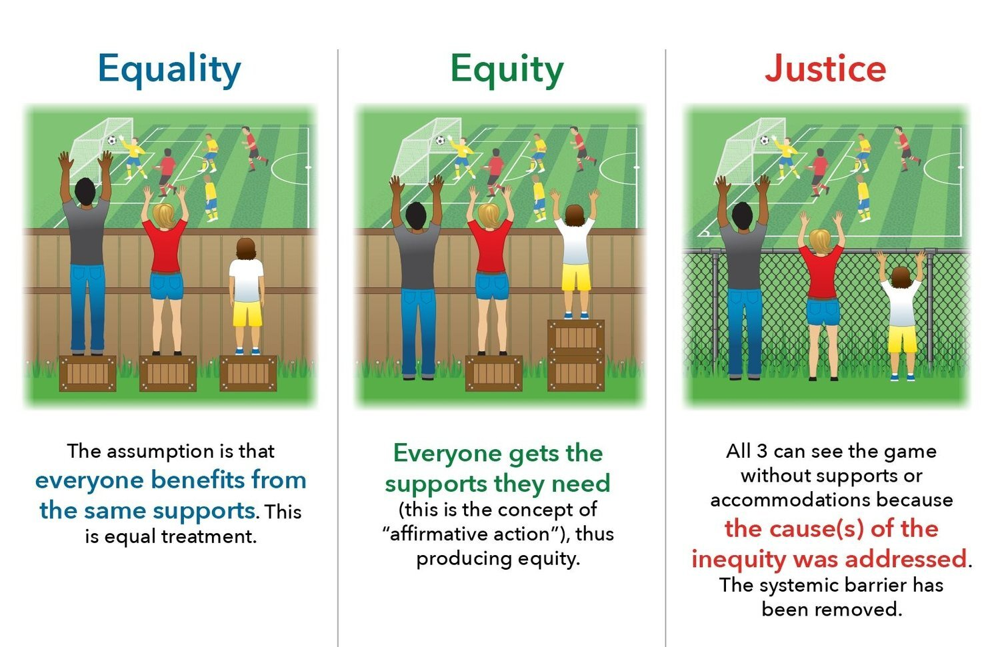

<!-- .element: class="titleslide"  data-background="../_chapterimg/16_fairness.jpg" -->

## Machine Learning in Production

# Measuring Fairness

---
## Diving into Fairness...

<!-- .element: class="plain stretch" -->

----
## Reading

Required:
- 🗎 Holstein, Kenneth, Jennifer Wortman Vaughan, Hal
Daumé III, Miro Dudik, and Hanna
Wallach. "[Improving fairness in machine learning systems: What do industry practitioners need?](http://users.umiacs.umd.edu/~hal/docs/daume19fairness.pdf)"
In Proceedings of the 2019 CHI Conference on Human Factors in
Computing Systems, pp. 1-16. 2019.

Recommended:
- 🕮 Ian Foster, Rayid Ghani, Ron S. Jarmin, Frauke Kreuter and Julia Lane. [Big Data and Social Science: Data Science Methods and Tools for Research and Practice](https://textbook.coleridgeinitiative.org/). Chapter 11, 2nd ed, 2020
- 🕮 Solon Barocas and Moritz Hardt and Arvind Narayanan. [Fairness and Machine Learning](http://www.fairmlbook.org). 2019 (incomplete book)
- 🗎 Pessach, Dana, and Erez Shmueli. "[A Review on Fairness in Machine Learning](https://dl.acm.org/doi/full/10.1145/3494672)." ACM Computing Surveys (CSUR) 55, no. 3 (2022): 1-44.

---
# Learning Goals

* Understand different definitions of fairness
* Discuss methods for measuring fairness
* Outline interventions to improve fairness at the model level

---
# Fairness: Definitions

----
### Fairness is still an actively studied & disputed concept!

<!-- references -->
Source: Mortiz Hardt, https://fairmlclass.github.io/

----
## Fairness: Definitions

* Anti-classification (fairness through blindness)
* Group fairness (independence)
* Equalized odds (separation)
* ...and numerous others and variations!

---
# Running Example: Mortgage Applications

* Large loans repayed over long periods, large loss on default
* Home ownership is key path to build generational wealth
* Past decisions often discriminatory (redlining)
* Replace biased human decisions by objective and more accurate ML model
  - income, other debt, home value
  - past debt and payment behavior (credit score)

----
## Recall: What is fair?

> Fairness discourse asks questions about how to treat people and whether treating different groups of people differently is ethical. If two groups of people are systematically treated differently, this is often considered unfair.

----
## Recall: What is fair?

<!-- colstart -->

* Equal slices for everybody
* Bigger slices for active bakers
* Bigger slices for inexperienced/new members (e.g., children)
* Bigger slices for hungry people
* More pie for everybody, bake more

*(Not everybody contributed equally during baking, not everybody is equally hungry)*

<!-- col -->

<!-- colend -->

----
## Past bias, different starting positions

<!-- references -->
Source: Federal Reserve’s [Survey of Consumer Finances](https://www.federalreserve.gov/econres/scfindex.htm)

----
## What is fair in mortgage applications?

<!-- discussion -->

---
# Anti-classification

* __Anti-classification (fairness through blindness)__
* Group fairness (independence)
* Equalized odds (separation)
* ...and numerous others and variations!

----
## Anti-Classification

<!-- .element: class="stretch" -->

* Also called _fairness through blindness_ or _fairness through unawareness_
* Ignore certain sensitive attributes when making a decision
* Example: Remove gender and race from mortgage model
* *Easy to implement, but any limitations?*

----
## Recall: Proxies

*Features correlate with protected attributes*

----
## Recall: Not all discrimination is harmful

<!-- .element: class="stretch" -->

* Loan lending: Gender and racial discrimination is illegal.
* Medical diagnosis: Gender/race-specific diagnosis may be desirable.
* Discrimination is a __domain-specific__ concept!

----
## Anti-Classification

<!-- .element: class="stretch" -->

* Ignore certain sensitive attributes when making a decision
* Advantage: Trivial to implement and test
* Limitations
  * Sensitive attributes may be correlated with other features
  * Some ML tasks need sensitive attributes (e.g., medical diagnosis)

----
## Ensuring Anti-Classification

How to train models that are fair wrt. anti-classification?

<!-- discussion -->

----
## Ensuring Anti-Classification

How to train models that are fair wrt. anti-classification?

--> Simply remove features for protected attributes from training and inference data

--> Null/randomize protected attribute during inference

*(does not account for correlated attributes, is not required to)*

----
## Testing Anti-Classification

How do we test that a classifier achieves anti-classification?

<!-- discussion -->

----
## Testing Anti-Classification

Straightforward invariant for classifier $f$ and protected attribute $p$: 

$\forall x. f(x[p\leftarrow 0]) = f(x[p\leftarrow 1])$

*(does not account for correlated attributes, is not required to)*

Test with *any* test data, e.g., purely random data or existing test data

Any single inconsistency shows that the protected attribute was used. Can also report percentage of inconsistencies.

<!-- references -->
See for example: Galhotra, Sainyam, Yuriy Brun, and Alexandra Meliou. "[Fairness testing: testing software for discrimination](http://people.cs.umass.edu/brun/pubs/pubs/Galhotra17fse.pdf)." In Proceedings of the 2017 11th Joint Meeting on Foundations of Software Engineering, pp. 498-510. 2017.

----
## Anti-Classification Discussion

*Testing of anti-classification barely needed, because easy to ensure by constructing during training or inference!*

Anti-classification is a good starting point to think about protected attributes

Useful baseline for comparison

Rarely ever used as serious fairness concept

---
# Group fairness

* Anti-classification (fairness through blindness)
* __Group fairness (independence)__
* Equalized odds (separation)
* ...and numerous others and variations!

----
## Group fairness

Key idea: Compare outcomes across two groups
* Similar rates of accepted loans across racial/gender groups?
* Similar chance of being hired/promoted between gender groups?
* Similar rates of (predicted) recidivism across racial groups?

Outcomes matter, not accuracy!

----
## Group fairness in discrimination law

Relates to *disparate impact* and the four-fifth rule

Can sue organizations for discrimination if they 
* mostly reject job applications from one minority group (identified by protected classes) and hire mostly from another
* reject most loans from one minority group and more frequently accept applicants from another

----
## Notations

* $X$: Feature set (e.g., age, race, education, region, income, etc.,)  
* $A \in X$: Sensitive attribute (e.g., gender)
* $R$: Regression score (e.g., predicted likelihood of on-time loan payment)
* $Y'$: Classifier output
  * $Y' = 1$ if and only if $R > T$ for some threshold $T$
  * e.g., Grant the loan ($Y' = 1$) if the likelihood of paying back > 80% 
* $Y$: Target variable being predicted ($Y = 1$ if the person actually
  pays back on time)

[Setting classification thresholds: Loan lending example](https://research.google.com/bigpicture/attacking-discrimination-in-ml)

----
## Group Fairness

$P[Y' = 1 | A = a]  = P[Y' = 1 | A = b]$

* Also called _independence_ or _demographic parity_
* Mathematically, $Y' \perp A$
  * Prediction ($Y'$)  must be independent of the sensitive attribute ($A$)
* Examples:
	* The predicted rate of recidivism is the same across all races
	* Both women and men have the equal probability of being promoted
		* i.e., P[promote = 1 | gender = M] = P[promote = 1 | gender = F] 

----
## Group Fairness Limitations

What are limitations of group fairness?

<!-- discussion -->

----
## Group Fairness Limitations

* Ignores possible correlation between $Y$ and $A$
* Rules out perfect predictor $Y' = Y$ when $Y$ & $A$ are correlated
* Permits abuse and laziness: Can be satisfied by randomly assigning    a positive outcome ($Y' = 1$) to protected groups
	* e.g., Randomly promote people (regardless of their
      job performance) to match the rate across all groups

----
## Adjusting Thresholds for Group Fairness

Select different classification thresholds ($t_0$, $t_1$) for different groups (A = 0,  A = 1) to achieve group fairness, such that 
$P[R > t_0 | A = 0]  = P[R > t_1 | A = 1]$

Example: Mortgage application
  * R: Likelihood of paying back the loan on time
  * Suppose: With a uniform threshold used (i.e., R = 80%), group fairness is not achieved
	* P[R > 0.8 | A = 0] = 0.4,  P[R > 0.8 | A = 1] = 0.7
  * Adjust thresholds to achieve group fairness
	* P[R > 0.6 | A = 0]  = P[R > 0.8 | A = 1]
* Wouldn't group A = 1 argue it's unfair? When does this type of adjustment make sense?

----
## Testing Group Fairness

*How would you test whether a classifier achieves group fairness?*

<!-- discussion -->

----
## Testing Group Fairness

Collect realistic, representative data (not randomly generated!)
* Use existing validation/test data
* Monitor production data
* (Somehow) generate realistic test data, e.g. from probability distribution of population

Separately measure the rate of positive predictions
* e.g., P[promoted = 1 | gender = M],      P[promoted = 1 | gender = F] = ?

Report issue if the rates differ beyond some threshold $\epsilon$ across
groups
  

---
# Equalized odds

* Anti-classification (fairness through blindness)
* Group fairness (independence)
* **Equalized odds (separation)**
* ...and numerous others and variations!

----
## Equalized odds

Key idea: Focus on accuracy (not outcomes) across two groups

* Similar default rates on accepted loans across racial/gender groups?
* Similar rate of "bad hires" and "missed stars" between gender groups?
* Similar accuracy of predicted recidivism vs actual recidivism across racial groups?

Accuracy matters, not outcomes!

----
## Equalized odds in discrimination law

Relates to *disparate treatment*

Typically lawsuits claim that protected attributes (e.g., race, gender) were used in decisions even though they were irrelevant
* e.g., fired over complaint because of being Latino, whereas other White employees were not fired with similar complaints

Can be difficult to prove in individual cases, typically relying on shifting justifications, inconsistent application of rules, or explicit remarks overheard or documented

----
## Equalized odds

$P[Y'=1∣Y=0,A=a] = P[Y'=1∣Y=0,A=b]$
$P[Y'=0∣Y=1,A=a] = P[Y'=0∣Y=1,A=b]$

Statistical property of *separation*: $Y' \perp A | Y$
  * Prediction must be independent of the sensitive attribute
  _conditional_ on the target variable

----
## Review: Confusion Matrix

<!-- .element: class="stretch" -->

Can we explain separation in terms of model errors?
* $P[Y'=1∣Y=0,A=a] = P[Y'=1∣Y=0,A=b]$
* $P[Y'=0∣Y=1,A=a] = P[Y'=0∣Y=1,A=b]$

----
## Separation

$P[Y'=1∣Y=0,A=a] = P[Y'=1∣Y=0,A=b]$ (FPR parity)

$P[Y'=0∣Y=1,A=a] = P[Y'=0∣Y=1,A=b]$ (FNR parity)

* $Y' \perp A | Y$: Prediction must be independent of the sensitive attribute
    _conditional_ on the target variable
* i.e., All groups are susceptible to the same false positive/negative rates
* Example: Y': Promotion decision, A: Gender of applicant: Y: Actual job performance

----
## Testing Separation

Requires realistic representative test data (telemetry or representative test data, not random)

Separately measure false positive and false negative rates
  * e..g, for FNR, compare P[promoted = 0 | female, good employee] vs P[promoted = 0 | male, good employee]

*How is this different from testing group fairness?*

---
# Breakout: Cancer Prognosis

In groups, post to `#lecture` tagging members:

* Does the model meet anti-classification fairness wrt. sex?
* Does the model meet group fairness?
* Does the model meet equalized odds?
* Is the model fair enough to use?  

---
# Other fairness measures

* Anti-classification (fairness through blindness)
* Group fairness (independence)
* Equalized odds (separation)**
* **...and numerous others and variations!**

----

----
## Many measures

Many measures proposed

Some specialized for tasks (e.g., ranking, NLP)

Some consider downstream utility of various outcomes

Most are similar to the three discussed
* Comparing different measures in the error matrix (e.g., false positive rate, lift)

---
# Comparing Fairness Criteria

----
## Recall: What is fair?

<!-- colstart -->

* Equal slices for everybody
* Bigger slices for active bakers
* Bigger slices for inexperienced/new members (e.g., children)
* Bigger slices for hungry people
* More pie for everybody, bake more

*(Not everybody contributed equally during baking, not everybody is equally hungry)*

<!-- col -->

<!-- colend -->

----
## Recall: What is fair?

> Fairness discourse asks questions about how to treat people and whether treating different groups of people differently is ethical. If two groups of people are systematically treated differently, this is often considered unfair.

----
## Intuitive Justice

Research on what post people perceive as fair/just (psychology)

When rewards depend on inputs and participants can chose contributions: Most people find it fair to split rewards proportional to inputs
* *Which fairness measure does this relate to?*

Most people agree that for a decision to be fair, personal characteristics that do not influence the reward, such as sex or age, should not be considered when dividing the rewards. 
* *Which fairness measure does this relate to?*

----
## Key issue: Unequal starting positions

Not everybody starts from an equal footing -- individual and group differences
* Some differences are inert, e.g., younger people have (on average) less experience
* Some differences come from past behavior/decisions, e.g., whether to attend college
* Some past decisions and opportunities are influenced by past injustices, e.g., redlining creating generational wealth differences

Individual and group differences not always clearly attributable, e.g., nature vs nurture discussion

----
## Unequal starting position

Fair or not? Should we account for unequal starting positions?
* Tom is more lazy than Bob. He should get less pie.
* People in Egypt have on average a much longer work week (53h) than people in the Germany (35h). They have less time to bake and should get more pie.
* Disabled people are always exhausted quickly. They should get less pie, because they contribute less.
* Men are on average more violent than women. This should be reflected in recidivism prediction.
* Employees with a PhD should earn higher wages than those with a bachelor's degree, because they decided to invest in more schooling.
* Students from poor neighborhoods should receive extra resources at school, because they get less help at home.
* Poverty is a moral failing. Poor people are less deserving of pie.

----
## Dealing with unequal starting positions

Equality (minimize disparate treatment):
* Treat everybody equally, regardless of starting position
* Focus on meritocracy, strive for fair opportunities
* Equalized-odds-style fairness; equality of opportunity

Equity (minimize disparate impact):
* Compensate for different starting positions
* Lift disadvantaged group, affirmative action
* Strive for similar outcomes (distributive justice)
* Group-fairness-style fairness; equality of outcomes

----
## Equality vs Equity

<!-- .element: class="stretch" -->

----
## Equality vs Equity

<!-- .element: class="stretch" -->

----
## Justice

Aspirational third option, that avoids a choice between equality and equity

Fundamentally removes initial imbalance or removes need for decision

Typically rethinks entire societal system in which the imbalance existed, beyond the scope of the ML product

----
## Choosing Equality vs Equity

Each rooted in long history in law and philosophy

Typically incompatible, cannot achieve both

Designers need to decide

Problem dependent and goal dependent

What differences are associated with merits and which with systemic disadvantages of certain groups? Can we agree on the degree a group is disadvantaged?

----
## Equality vs Equity and Politics

Noticeable political split

*People with right-leaning politics:* tend to prefer equality-based fairness notions of a meritocracy and decry equity-based initiatives as reverse-discrimination (discrimination against the majority group through disparate treatment) 

*People with left-leaning politics:* tend to emphasize outcomes and equity-based fairness that challenge the status quo

----
## Trade-offs in Fairness vs Accuracy

General view: Accuracy is at odds with fairness (e.g., impossible to achieve perfect accuracy $R = Y$ while ensuring group fairness)

Fairness imposes constraints, limits what models can be learned

**But:** Arguably unfair predictions not desirable, accuracy based on misleading ground truth

Determine how much compromise in accuracy or fairness is acceptable to
  your stakeholders; is accuracy the right measure or based on the right data?

----
## Some Guidance on Equality Metric:

Are the interventions punitive or assistive
  * Punitive (could hurt individuals): Focus on similar false positive rates
  * Assistive (will help individuals): Focus on similar recall, false negative rates

----

<!-- .element: class="stretch" -->

<!-- references_ -->

🕮 Ian Foster, Rayid Ghani, Ron S. Jarmin, Frauke Kreuter and Julia Lane. [Big Data and Social Science: Data Science Methods and Tools for Research and Practice](https://textbook.coleridgeinitiative.org/). Chapter 11, 2nd ed, 2020

----
## Identifying Fairness Goals is a Requirements Engineering Problem

* What is the goal of the system? What benefits does it provide and to whom?
* What subpopulations (including minority groups) may be using or be affected by the system? What types of harms can the system cause with discrimination?
* Who are the stakeholders of the system? What are the stakeholders’ views or expectations on fairness and where do they conflict? Are we trying to achieve fairness based on equality or equity? 
* Does fairness undermine any other goals of the system (e.g., accuracy, profits, time to release)?
* Are there legal anti-discrimination requirements to consider? Are there societal expectations about ethics that relate to this product? What is the activist position?
* ...

----
## Discussion: Fairness Goal for Mortgage Applications?

<!-- discussion -->

----
## Discussion: Fairness Goal for Mortgage Applications?

Disparate impact considerations seem to prevail -- group fairness 

Need to justify strong differences in outcomes

Can also sue over disparate treatment if bank indicates that protected attribute was reason for decision

----
## Discussion: Fairness Goal for College Admission?

<!-- discussion -->

----
## Discussion: Fairness Goal for College Admission?

Strong legal precedents

Very limited scope of *affirmative action*

Most forms of group fairness likely illegal

In practice: Anti-classification

----
## Discussion: Fairness Goal for Hiring Decisions?

<!-- discussion -->

----
## Law: "Four-fifth rule" (or "80% rule")

* Group fairness with a threshold: $\frac{P[R = 1 | A = a]}{P[R = 1 | A = b]} \geq 0.8$
* Selection rate for a protected group (e.g., $A = a$) <
80% of highest rate => selection procedure considered as having "adverse
impact"
* Guideline adopted by Federal agencies (Department of Justice, Equal
Employment Opportunity Commission, etc.,) in 1978
* If violated, must justify business necessity (i.e., the selection procedure is
essential to the safe & efficient operation)
* Example: Hiring 50% of male applicants vs 20% female applicants hired
  (0.2/0.5 = 0.4) -- Is there a business justification for hiring men at a higher rate?

----
## Discussion: Fairness Goal for Cancer Prognosis?

<!-- discussion -->

----
## Discussion: Fairness Goal for Recidivism Prediction?

<!-- references -->

[ProPublica article](https://www.propublica.org/article/machine-bias-risk-assessments-in-criminal-sentencing)

----
## Discussion: Recidivism Prediction?

<!-- colstart -->

* ProPublica investigation: COMPAS violates separation w/ FPR & FNR
* Northpointe response: COMPAS is fair because it has similar FDRs
  across both races
* _Is COMPAS both fair & unfair at the same time? Which definition
  is the "right" one?_

<!-- col -->

<!-- references -->

[Figure from Big Data and Social Science, Ch. 11](https://textbook.coleridgeinitiative.org/chap-bias.html#ref-angwin2016b)

<!-- colend -->

---
# Improving Fairness of a Model

In all pipeline stages:
* Data collection
* Data cleaning, processing
* Training
* Inference
* Evaluation and auditing

----
## Today: Model-centric view

Consider fairness throughout the ML lifecycle!

<!-- .element: class="stretch" -->

<!-- references_ -->

From _Fairness-aware Machine Learning_, Bennett et al., WSDM Tutorial (2019).

----
## 1. Improve with Model Evaluation and Auditing

Lots of tools to measure and visualize fairness with many metrics

Can be integrated in notebooks and production (telemetry, monitoring)

Audit: In-depth evaluation of a model snapshot

Efforts to crowdsource feedback and audits

Debugging tools to investigate potential fairness issues

----
## Example audit tool: Aequitas

----
## Example audit tool: Aequitas

<!-- .element: class="stretch" -->

----
## Example debugging tool: What-If

<!-- .element: class="stretch" -->

<!-- references_ -->
[Google What-If Tool](https://pair-code.github.io/what-if-tool/demos/compas.html)

----
## 2. Improve during Model Inference

Remove/scramble protected attributes and correlated attributes? (anti-classification)

Calibrate by adjusting thresholds (group fairness, equalized odds)
* $P[R > t_0 | A = 0]  = P[R > t_1 | A = 1]$

Weaken predictor for one group?

----
## Example: Tweaking Thresholds

<!-- .element: class="stretch plain" -->

----
## 3. Improve during Model Training

Incorporate fairness metric during training, e.g., in loss function

Use fairness for model selection/hyperparameter tuning

Weigh training data differently based on (expected) bias or trust

Much research, many approaches...

<!-- references -->
Further reading: 🗎 Pessach, Dana, and Erez Shmueli. "[A Review on Fairness in Machine Learning](https://dl.acm.org/doi/full/10.1145/3494672)." ACM Computing Surveys (CSUR) 55, no. 3 (2022): 1-44.

----
## 4. Improve during Data Cleaning, Feature Engineering

Remove features for protected attributes; measure correlations to identify proxies <- anti-classification

Correct for known biases, e.g.,
* Discard known biased training data, fix *tainted labels*
* Remove training data influenced by *feedback loop*
* Analyze data for *limited features*, remove or enhance
* Augment data for *sample size disparity*
* Normalize data across subpopulations

Active research field of data debugging to find influential outliers and potential bias (more later in Explainability lecture)

----
## 5. Improvement during Data Collection

Carefully review data collection procedures, sampling biases, what data is collected, how trustworthy labels are, etc.

Can address most sources of bias: tainted labels, skewed samples, limited features, sample size disparity, proxies:
* deliberate what data to collect
* collect more data, oversample where needed
* extra effort in unbiased labels

Potentially expensive, but typically **highest leverage point**

---
# Outlook: Building Fair ML-Based Products

**Next lecture:** Fairness is a *system-wide* concern

* Identifying and negotiating fairness requirements
* Fairness beyond model predictions (product design, mitigations, data collection)
* Fairness in process and teamwork, barriers and responsibilities
* Documenting fairness at the interface
* Monitoring
* Promoting best practices

---
# Summary

* Three definitions of fairness: Anti-classification, group fairness, equalized odds
* Tradeoffs between fairness criteria
  * What is the goal?
  * Key: how to deal with unequal starting positions
* Improving fairness of a model
  * In all *pipeline stages*: data collection, data cleaning, training, inference, evaluation

----
## Further Readings

- 🕮 Ian Foster, Rayid Ghani, Ron S. Jarmin, Frauke Kreuter and Julia Lane. [Big Data and Social Science: Data Science Methods and Tools for Research and Practice](https://textbook.coleridgeinitiative.org/). Chapter 11, 2nd ed, 2020
- 🕮 Solon Barocas and Moritz Hardt and Arvind Narayanan. [Fairness and Machine Learning](http://www.fairmlbook.org). 2019 (incomplete book)
- 🗎 Pessach, Dana, and Erez Shmueli. "[A Review on Fairness in Machine Learning](https://dl.acm.org/doi/full/10.1145/3494672)." ACM Computing Surveys (CSUR) 55, no. 3 (2022): 1-44.

<!-- 
----
## Practitioner Challenges

* Fairness is a system-level property
  - Consider goals, user interaction design, data collection, monitoring, model interaction (properties of a single model may not matter much)
* Fairness-aware data collection, fairness testing for training data
* Identifying blind spots
  - Proactive vs reactive
  - Team bias and (domain-specific) checklists
* Fairness auditing processes and tools
* Diagnosis and debugging (outlier or systemic problem? causes?)
* Guiding interventions (adjust goals? more data? side effects? chasing mistakes? redesign?)
* Assessing human bias of humans in the loop

Holstein, Kenneth, Jennifer Wortman Vaughan, Hal Daumé III, Miro Dudik, and Hanna Wallach. "[Improving fairness in machine learning systems: What do industry practitioners need?](http://users.umiacs.umd.edu/~hal/docs/daume19fairness.pdf)" In Proceedings of the 2019 CHI Conference on Human Factors in Computing Systems, pp. 1-16. 2019.

 -->