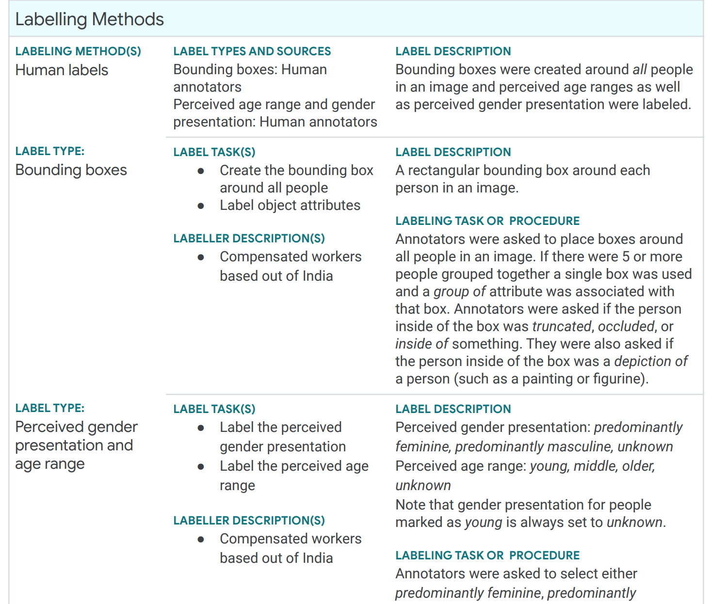

<!-- .element: class="titleslide"  data-background="../_chapterimg/17_fairnessgame.jpg" -->

## Machine Learning in Production

# Building Fair Products

---
## From Fairness Concepts to Fair Products

<!-- .element: class="plain stretch" -->

----
## Reading

Required reading: 
* 🗎 Os Keyes, Jevan Hutson, Meredith Durbin. [A Mulching Proposal: Analysing and Improving an Algorithmic System for Turning the Elderly into High-Nutrient Slurry](https://dl.acm.org/doi/pdf/10.1145/3290607.3310433). CHI Extended Abstracts, 2019.

Recommended reading:
* 🗎 Metcalf, Jacob, and Emanuel Moss. "[Owning ethics: Corporate logics, silicon valley, and the institutionalization of ethics](https://datasociety.net/wp-content/uploads/2019/09/Owning-Ethics-PDF-version-2.pdf)." *Social Research: An International Quarterly* 86, no. 2 (2019): 449-476.

----
## Learning Goals

* Understand the role of requirements engineering in selecting ML
fairness criteria
* Understand the process of constructing datasets for fairness
* Document models and datasets to communicate fairness concerns
* Consider the potential impact of feedback loops on AI-based systems
  and need for continuous monitoring
* Consider achieving fairness in AI-based systems as an activity throughout the entire development cycle

---
# Recall: Model vs System

<!-- .element: class="plain stretch" -->

----
## Fairness is a System Quality

Fairness can be measured for a model

... but we really care whether the system, as it interacts with the environment, is fair/safe/secure

... does the system cause harm?

<!-- .element: class="plain stretch" -->

----
## Most Fairness Discussions are Model-Centric or Pipeline-Centric

<!-- .element: class="stretch" -->

<!-- references_ -->

_Fairness-aware Machine Learning_, Bennett et al., WSDM Tutorial (2019).

----
## Fair Products with Unfair Models?

Is unfairness in an ML component always a problem?

<!-- discussion -->

----
## Fairness Problems are System-Wide Challenges

* **Requirements engineering challenges:** How to identify fairness concerns, fairness metric, design data collection and labeling
* **Human-computer-interaction design challenges:** How to present results to users, fairly collect data from users, design mitigations
* **Quality assurance challenges:** Evaluate the entire system for fairness, continuously assure in production
* **Process integration challenges:** Incoprorate fairness work in development process
* **Education and documentation challenges:** Create awareness, foster interdisciplinary collaboration

---
# Identifying and Negotiating Fairness Requirements

Measuring is easy, but what to measure? 

----
## Identifying Fairness Goals is a Requirements Engineering Problem

* What is the goal of the system? What benefits does it provide and to whom?
* What subpopulations (including minority groups) may be using or be affected by the system? What types of harms can the system cause with discrimination?
* Who are the stakeholders of the system? What are the stakeholders’ views or expectations on fairness and where do they conflict? Are we trying to achieve fairness based on equality or equity? 
* Does fairness undermine any other goals of the system (e.g., accuracy, profits, time to release)?
* Are there legal anti-discrimination requirements to consider? Are there societal expectations about ethics that relate to this product? What is the activist position?
* ...

----
## Analyzing Potential Harms

Anticipate harms from unfair decisions
* Harms of allocation, harms of representation?
* How do biased model predictions contribute to system behavior? (show predictions, act on predictions?)

Consider how automation can amplify harm

Overcome blind spots within teams
* Systematically consider consequences of bias
* Consider safety engineering techniques (e.g., FTA)
* Assemble diverse teams, use personas, crowdsource audits

----
## Example: Harms in Biased College Admission Screening

<!-- discussion -->

What can we do beyond brainstorming?

----
## Example: Judgment Call Game

<!-- colstart -->

Card "Game" by Microsoft Research

Participants write "Product reviews" from different perspectives
* encourage thinking about consequences
* enforce persona-like role taking

<!-- col -->

<!-- .element: class="stretch" -->

<!-- colend -->

----
## Identify Protected Attributes

Against which groups might we discriminate? What attributes identify them directly or indirectly?

Requires understanding of target population and subpopulations

Use anti-discrimination law as starting point, but do not end there
* Socio-economic status? Body height? Weight? Hair style? Eye color? Sports team preferences?
* Protected attributes for non-humans? Animals, inanimate objects?

Involve stakeholders, consult lawyers, read research, ask experts, ...

----
## Negotiate Fairness Goals/Measures

Equality or equity? Equalized odds? ...

Cannot satisfy all. People have conflicting preferences...

> *Treating everybody equally in a meritocracy will reinforce existing inequalities whereas uplifting disadvantaged communities can be seen as giving unfair advantages to people who contributed less, making it harder to succeed in the advantaged group merely due to group status.*

----
## Recall: CEOs in Image Search

<!-- .element: class="stretch" -->

> "Through user studies, the [image search] team learned that many users
were uncomfortable with the idea of the company “manipulating” search results, viewing this behavior as unethical." -- observation from interviews by Ken Holstein

----
## Fairness, Accuracy, and Profits

<!-- .element: class="stretch" -->

<!-- references_ -->
Interactive visualization: https://research.google.com/bigpicture/attacking-discrimination-in-ml/

----
## Fairness, Accuracy, and Profits

Fairness can conflict with accuracy goals

Fairness can conflict with organizational goals (profits, usability)

Fairer products may attract more customers

Unfair products may receive bad press, reputation damage

Improving fairness through better data can benefit everybody

----
## Negotiate Fairness Goals/Measures

Negotiation with tradeoffs, inherently political, weigh/balance preferences

Will need to accept some (perceived) unfairness

Power structures often influence outcomes
* Product owners can often drive decisions
* Legal requirements pose constraints
* Users and activists and press can create pressure

Just like other requirements negotiation:
* Consider design space, expose tradeoffs explicitly
* Somebody will need to make a decision, often project owner
* Document decision with justification

---
# Societal Implications

Automation at scale can shift power dynamics at scale
* Path for social good or path into dystopia?
* Who benefits from ML-based automation? Who bears the cost?

----
## Making Rare Skills Attainable

Reduce reliance on specialized training, improve access, improve cost

Examples?

<!-- discussion -->

----
## Making Rare Skills Attainable

> We should stop training radiologists now. It’s just completely obvious that within five years, deep learning is going to do better than radiologists. -- [Geoffrey Hinton](https://www.youtube.com/watch?v=2HMPRXstSvQ&t=29s), 2016

----
## Making Rare Skills Attainable

Examples:
* Healthcare in rural settings, developing countries
* Generative models for Art (DALL·E, stable diffusion)
* Navigation tools (trained taxi license -> Uber)

----
## Making Rare Skills Attainable, but...

*Downsides?*

<!-- discussion -->

----
## Making Rare Skills Attainable, but...

Displacing high-skilled jobs

Low skilled, machine-directed jobs, "algorithmic management"

Who owns the ML-enabled products? Rent-seeking economies?

Society without relying on work? 14h work week? Automation dividend? Universal basic income? "Fully automated luxury communism"

----
## Making Rare Skills Attainable, but...

Who owns the algorithms?
* DALL·E: Corporate control, API only
* Stable diffusion: open source, CreativeML Open RAIL-M license ("ethical license")

----
## Exploitative Data Collection

Problems?

<!-- discussion -->

----

<!-- .element: class="stretch" -->

----
## Exploitative Data Collection

Scraping public data, without compensation of creators, ignoring licenses

Labeling often crowd sourced at poverty wages

Data entry often assigned to field workers (e.g., nurses) in addition to existing tasks 

Data workers may not benefit from system, are often not valued, are often manipulated through surveillance and gamification mechanisms

<!-- references -->
Further reading: Sambasivan, Nithya, and Rajesh Veeraraghavan. "The Deskilling of Domain Expertise in AI Development." In CHI. 2022.

----
## Exploitative Data Collection

Who owns the data? Who does the data work?

Who owns the model or product? Who owns their outputs?

Who benefits?

What are fair working conditions?

----
## Who does the Fairness Work?

<!-- discussion -->

----
## Who does the Fairness Work?

Within organizations usually little institutional support for fairness work, few activists

Fairness issues often raised by communities affected, after harm occurred

Affected groups may need to organize to affect change

*Do we place the cost of unfair systems on those already marginalized and disadvantaged?*

----
## Breakout: College Admission

<!-- .element: class="stretch" -->

Assume most universities want to automate admissions decisions. 

As a group in `#lecture`, tagging group members:

> What good or bad societal implications can you anticipate, beyond a single product? 
> Should we do something about it?

---
# Fairness beyond the Model

----
## Bias Mitigation through System Design

<!-- discussion -->

Examples of mitigations around the model?

----
## 1. Avoid Unnecessary Distinctions

*Image captioning gender biased?*

----
## 1. Avoid Unnecessary Distinctions

<!-- .element: class="stretch" -->

"Doctor/nurse applying blood pressure monitor" -> "Healthcare worker applying blood pressure monitor"

----
## 1. Avoid Unnecessary Distinctions

Is the distinction actually necessary? Is there a more general class to unify them?

Aligns with notion of *justice* to remove the problem from the system

----
## 2. Suppress Potentially Problem Outputs

<!-- .element: class="stretch" -->

*How to fix?*

----
## 2. Suppress Potentially Problem Outputs

Anticipate problems or react to reports

Postprocessing, filtering, safeguards
* Suppress entire output classes
* Hardcoded rules or other models (e.g., toxicity detection)

May degrade system quality for some use cases

See mitigating mistakes generally

----
## 3. Design Fail-Soft Strategy

Example: Plagiarism detector

<!-- colstart -->

**A: Cheating detected! This incident has been reported.**

<!-- col -->

**B: This answer seems to perfect. Would you like another exercise?**

<!-- colend -->

HCI principle: Fail-soft interfaces avoid calling out directly; communicate friendly and constructively to allow saving face

Especially relevant if system unreliable or biased

----
## 4. Keep Humans in the Loop

<!-- .element: class="stretch" -->

TV subtitles: Humans check transcripts, especially with heavy dialects

----
## 4. Keep Humans in the Loop

Recall: Automate vs prompt vs augment

Involve humans to correct for mistakes and bias

But, model often introduced to avoid bias in human decision

But, challenging human-interaction design to keep humans engaged and alert; human monitors possibly biased too, making it worse

**Does a human have a fair chance to detect and correct bias?** Enough information? Enough context? Enough time? Unbiased human decision?

----
## Predictive Policing Example

> "officers expressed skepticism
about the software and during ride alongs showed no intention of using it"

> "the officer discounted the software since it showed what he already
knew, while he ignored those predictions that he did not understand"

Does the system just lend credibility to a biased human process?

<!-- references -->
Lally, Nick. "[“It makes almost no difference which algorithm you use”: on the modularity of predictive policing](http://www.nicklally.com/wp-content/uploads/2016/09/lallyModularityPP.pdf)." Urban Geography (2021): 1-19.

---
# Fairer Data Collection

----
## Data Collection is Amendable

Data science education often assumes data as given

In industry, we often have control over data collection, curation, labeling (65% in Holstein et al.)

Most address fairness issues by collecting more data (73%)

<!-- references -->

[Challenges of incorporating algorithmic fairness into practice](https://www.youtube.com/watch?v=UicKZv93SOY),
FAT* Tutorial, 2019  ([slides](https://bit.ly/2UaOmTG))

----
## Fairer Data Collection

Often high-leverage point to improve fairness

"Raw data is an oxymoron"

<!-- discussion -->

----
## Fairer Data Collection

Carefully review data collection procedures, sampling biases, what data is collected, how trustworthy labels are, etc.

Can address most sources of bias: tainted labels, skewed samples, limited features, sample size disparity, proxies:
* deliberate what data to collect
* collect more data, oversample where needed
* extra effort in unbiased labels

-> Requirements engineering, system engineering

-> World vs machine, data quality, data cascades

---
# Anticipate Feedback Loops

----
## Feedback Loops

<!-- .element: class="plain" -->

----
## Feedback Loops in Mortgage Applications?

<!-- discussion -->

----
## Feedback Loops go through the Environment

<!-- .element: class="plain" -->

----
## Analyze the World vs the Machine

<!-- .element: class="plain stretch" -->

*State and check assumptions!*

----
## Analyze the World vs the Machine

How do outputs affect change in the real world, how does this (indirectly) influence inputs?

Can we decouple inputs from outputs? Can telemetry be trusted?

Interventions through system (re)design:
* Focus data collection on less influenced inputs
* Compensate for bias from feedback loops in ML pipeline
* Do not build the system in the first place

----
## Long-term Impact of ML

* ML systems make multiple decisions over time, influence the
behaviors of populations in the real world
* *But* most models are built & optimized assuming that the world is
static
* Difficult to estimate the impact of ML over time
  * Need to reason about the system dynamics (world vs machine)
  * e.g., what's the effect of a mortgage lending policy on a population?

----
## Long-term Impact & Fairness

<!-- colstart -->

Deploying an ML model with a fairness criterion does NOT guarantee
  improvement in equality/equity over time

Even if a model appears to promote fairness in
short term, it may result harm over a long-term period

<!-- col -->

<!-- .element: class="stretch" -->

<!-- colend -->

<!-- references_ -->
[Fairness is not static: deeper understanding of long term fairness via simulation studies](https://dl.acm.org/doi/abs/10.1145/3351095.3372878),
in FAT* 2020.

----
## Prepare for Feedback Loops

We will likely not anticipate all feedback loops...

... but we can anticipate that unknown feedback loops exist

-> Monitoring!

 
---
# Process Integration

----
## Fairness in Practice today

Lots of attention in academia and media

Lofty statements by big companies, mostly aspirational

Strong push by few invested engineers (internal activists)

Some dedicated teams, mostly in Big Tech, mostly research focused

Little institutional support, no broad practices

----
## Barriers to Fairness Work

<!-- discussion -->

----
## Barriers to Fairness Work

1. Rarely an organizational priority, mostly reactive (media pressure, regulators)
  * Limited resources for proactive work
  * Fairness work rarely required as deliverable, low priority, ignorable
  * No accountability for actually completing fairness work, unclear responsibilities

*What to do?*

----
## Barriers to Fairness Work

2. Fairness work seen as ambiguous and too complicated for available resources (esp. outside Big Tech)
  * Academic discussions and metrics too removed from real problems
  * Fairness research evolves too fast
  * Media attention keeps shifting, cannot keep up
  * Too political

*What to do?*

----
## Barriers to Fairness Work

3. Most fairness work done by volunteers outside official job functions
  * Rarely rewarded in performance evaluations, promotions
  * Activists seen as troublemakers
  * Reliance on personal networks among interested parties

*What to do?*

----
## Barriers to Fairness Work

4. Impact of fairness work difficult to quantify, making it hard to justify resource investment
  * Does it improve sales? Did it avoid PR disaster? Missing counterfactuals
  * Fairness rarely monitored over time
  * Fairness rarely a key performance indicator of product
  * Fairness requires long-term perspective (feedback loops, rare disasters), but organizations focus on short-term goals

*What to do?*

----
## Barriers to Fairness Work

5. Technical challenges
  * Data privacy policies restrict data access for fairness analysis
  * Bureaucracy
  * Distinguishing unimportant user complains from systemic bias issues, debugging bias issues

6. Fairness concerns are project specific, hard to transfer actionable insights and tools across teams

*What to do?*

----
## Improving Process Integration -- Aspirations

Integrate proactive practices in development processes -- both model and system level!

Move from individuals to institutional processes distributing the work

Hold the entire organization accountable for taking fairness seriously

*How?*

<!-- discussion -->

----
## Improving Process Integration -- Examples

1. Mandatory discussion of discrimination risks, protected attributes, and fairness goals in *requirements documents*
2. Required fairness reporting in addition to accuracy in automated *model evaluation*
3. Required internal/external fairness audit before *release*
4. Required fairness monitoring, oversight infrastructure in *operation*

----
## Improving Process Integration -- Examples

5. Instituting fairness measures as *key performance indicators* of products
6. Assign clear responsibilities of who does what
7. Identify measurable fairness improvements, recognize in performance evaluations

*How to avoid pushback against bureaucracy?*

----
## Affect Culture Change

Buy-in from management is crucial

Show that fairness work is taken seriously through action (funding, hiring, audits, policies), not just lofty mission statements

Reported success strategies:
1. Frame fairness work as financial profitable, avoiding rework and reputation cost
2. Demonstrate concrete, quantified evidence of benefits of fairness work
3. Continuous internal activism and education initiatives
4. External pressure from customers and regulators

----
## Assigning Responsibilities

Hire/educate T-shaped professionals

Have dedicated fairness expert(s) consulting with teams, performing/guiding audits, etc

Not everybody will be a fairness expert, but ensure base-level awareness on when to seek help

----
## Aspirations

 

> "They imagined that organizational leadership would understand, support, and engage deeply with responsible AI concerns, which would be contextualized within their organizational context. Responsible AI would be prioritized as part of the high-level organizational mission and then translated into actionable goals down at the individual levels through established processes. Respondents wanted the spread of information to go through well-established channels so that people know where to look and how to share information."

<!-- references -->
From Rakova, Bogdana, Jingying Yang, Henriette Cramer, and Rumman Chowdhury. "Where responsible AI meets reality: Practitioner perspectives on enablers for shifting organizational practices." Proceedings of the ACM on Human-Computer Interaction 5, no. CSCW1 (2021): 1-23.

----
## Burnout is a Real Danger

Unsupported fairness work is frustrating and often ineffective

> “However famous the company is, it’s not worth being in a work situation where you don’t feel like your entire company, or at least a significant part of your company, is trying to do this with you. Your job is not to be paid lots of money to point out problems. Your job is to help them make their product better. And if you don’t believe in the product, then don’t work there.” -- Rumman Chowdhury via [Melissa Heikkilä](https://www.technologyreview.com/2022/11/01/1062474/how-to-survive-as-an-ai-ethicist/)

---
# Documenting Fairness at the Interface

----
## Fairness Concerns cut across Components

<!-- .element: class="plain stretch" -->

*Product vs model team, product vs model requirements*

----
## Fairness Concerns cut across Components

*Product vs model team, product vs model requirements*

As all design/architecture:
* Identify system-level requirements, break down to component level
* Assign responsibilities
* Document component requirements, provide evidence of results

----
## Documenting Model Fairness

Recall: Model cards

<!-- .element: class="stretch" -->

<!-- references_ -->

Mitchell, Margaret, et al. "[Model cards for model reporting](https://www.seas.upenn.edu/~cis399/files/lecture/l22/reading2.pdf)." In Proc. FAccT, 220-229. 2019.

----
## Documenting Fairness of Datasets

Datasheets for Datasets, Dataset Nutrition Labels, ...

----
## Documenting Fairness of Datasets

<!-- .element: class="stretch" -->

<!-- references_ -->
*Excerpt from a “Data Card” for Google’s* [*Open Images Extended*](https://storage.googleapis.com/openimages/web/extended.html#miap) *dataset ([*full data card*](https://storage.googleapis.com/openimages/open_images_extended_miap/Open%20Images%20Extended%20-%20MIAP%20-%20Data%20Card.pdf)*) 

---
# Monitoring

----
## Monitoring

Operationalize fairness measure in production with telemetry

Monitor like any other metric, use alerts

Monitor distribution shifts, especially across protected attributes

Track through experiments, A/B testing etc.

**How would you monitor fairness in mortgage applications?**

Challenge: Access to protected attributes? Access to ground truth?

----
## Monitoring Tools: Example

<!-- .element: class="stretch" -->

(Involve policy makers in the monitoring & auditing process)

<!-- references_ -->
http://aequitas.dssg.io/

----
## Preparing for Problems

Provide users with a path to *appeal decisions*
* Provide feedback mechanism to complain about unfairness
* Human review? Human override?

Prepare an *incidence response plan* for fairness issues
* What can be shut down/reverted on short notice?
* Who does what?
* Who talks to the press? To affected parties? What do they need to know?

---
# Best Practices

----
## Best Practices

**Best practices are emerging and evolving**

Start early, be proactive

Scrutinize data collection and labeling

Invest in requirements engineering and design

Invest in education

Assign clear responsibilities, demonstrate leadership buy-in

----
## Many Tutorials, Checklists, Recommendations

Tutorials (fairness notions, sources of bias, process recom.): 
* [Fairness in Machine Learning](https://vimeo.com/248490141), [Fairness-Aware Machine Learning in Practice](https://sites.google.com/view/fairness-tutorial)
* [Challenges of Incorporating Algorithmic Fairness into Industry Practice](https://www.microsoft.com/en-us/research/video/fat-2019-translation-tutorial-challenges-of-incorporating-algorithmic-fairness-into-industry-practice/)

Checklist:
* Microsoft’s [AI Fairness Checklist](https://www.microsoft.com/en-us/research/project/ai-fairness-checklist/): concrete questions, concrete steps throughout all stages, including deployment and monitoring

---
# Summary

* Requirements engineering for fair ML systems
  * Identify potential harms, protected attributes
  * Negotiate conflicting fairness goals, tradeoffs
  * Consider societal implications
* Design fair systems beyond the model, mitigate bias outside the model
* Anticipate feedback loops
* Integrate fairness work in process and culture
* Document and monitor fairness

----
## Further Readings

- 🗎 Rakova, Bogdana, Jingying Yang, Henriette Cramer, and Rumman Chowdhury. "[Where responsible AI meets reality: Practitioner perspectives on enablers for shifting organizational practices](https://arxiv.org/abs/2006.12358)." *Proceedings of the ACM on Human-Computer Interaction* 5, no. CSCW1 (2021): 1-23.
- 🗎 Mitchell, Margaret, Simone Wu, Andrew Zaldivar, Parker Barnes, Lucy Vasserman, Ben Hutchinson, Elena Spitzer, Inioluwa Deborah Raji, and Timnit Gebru. "[Model cards for model reporting](https://arxiv.org/abs/1810.03993)." In *Proceedings of the conference on fairness, accountability, and transparency*, pp. 220-229. 2019.
- 🗎 Boyd, Karen L. "[Datasheets for Datasets help ML Engineers Notice and Understand Ethical Issues in Training Data](http://karenboyd.org/Datasheets_Help_CSCW.pdf)." Proceedings of the ACM on Human-Computer Interaction 5, no. CSCW2 (2021): 1-27.
- 🗎 Bietti, Elettra. "[From ethics washing to ethics bashing: a view on tech ethics from within moral philosophy](https://dl.acm.org/doi/pdf/10.1145/3351095.3372860)." In Proceedings of the 2020 Conference on Fairness, Accountability, and Transparency, pp. 210-219. 2020.
- 🗎 Madaio, Michael A., Luke Stark, Jennifer Wortman Vaughan, and Hanna Wallach. "[Co-Designing Checklists to Understand Organizational Challenges and Opportunities around Fairness in AI](http://www.jennwv.com/papers/checklists.pdf)." In Proceedings of the 2020 CHI Conference on Human Factors in Computing Systems, pp. 1-14. 2020.
- 🗎 Hopkins, Aspen, and Serena Booth. "[Machine Learning Practices Outside Big Tech: How Resource Constraints Challenge Responsible Development](http://www.slbooth.com/papers/AIES-2021_Hopkins_and_Booth.pdf)." In Proceedings of the 2021 AAAI/ACM Conference on AI, Ethics, and Society (AIES ’21) (2021).
- 🗎 Metcalf, Jacob, and Emanuel Moss. "[Owning ethics: Corporate logics, silicon valley, and the institutionalization of ethics](https://datasociety.net/wp-content/uploads/2019/09/Owning-Ethics-PDF-version-2.pdf)." *Social Research: An International Quarterly* 86, no. 2 (2019): 449-476.

