# Interpretability and Explainability

Christian Kaestner


<!-- references -->

Required reading: 🎧 Data Skeptic Podcast Episode “[Black Boxes are not Required](https://dataskeptic.com/blog/episodes/2020/black-boxes-are-not-required)” with Cynthia Rudin (32min) or 🗎 Rudin, Cynthia. "[Stop explaining black box machine learning models for high stakes decisions and use interpretable models instead](https://arxiv.org/abs/1811.10154)." Nature Machine Intelligence 1, no. 5 (2019): 206-215.  

Recommended supplementary reading: 🕮 Christoph Molnar. "[Interpretable Machine Learning: A Guide for Making Black Box Models Explainable](https://christophm.github.io/interpretable-ml-book/)." 2019
---
# Learning Goals

* Understand the importance of and use cases for interpretability
* Explain the tradeoffs between inherently interpretable models and post-hoc explanations
* Measure interpretability of a model
* Select and apply techniques to debug/provide explanations for data, models and model predictions
* Eventuate when to use interpretable models rather than ex-post explanations

---
# Motivating Examples


----


----

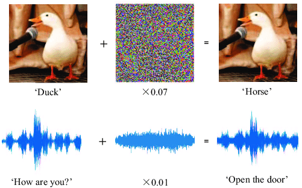

<!-- references -->

Image: Gong, Yuan, and Christian Poellabauer. "[An overview of vulnerabilities of voice controlled systems](https://arxiv.org/pdf/1803.09156.pdf)." arXiv preprint arXiv:1803.09156 (2018).

----
## Detecting Anomalous Commits

[](nodejs-unusual-commit.png)
<!-- .element: class="stretch" -->


Goyal, Raman, Gabriel Ferreira, Christian Kästner, and James Herbsleb. "[Identifying unusual commits on GitHub](https://www.cs.cmu.edu/~ckaestne/pdf/jsep17.pdf)." Journal of Software: Evolution and Process 30, no. 1 (2018): e1893.

----
## Is this recidivism model fair?

```
IF age between 18–20 and sex is male THEN predict arrest
ELSE 
IF age between 21–23 and 2–3 prior offenses THEN predict arrest
ELSE 
IF more than three priors THEN predict arrest
ELSE predict no arrest
```

<!-- references -->

Rudin, Cynthia. "[Stop explaining black box machine learning models for high stakes decisions and use interpretable models instead](https://arxiv.org/abs/1811.10154)." Nature Machine Intelligence 1, no. 5 (2019): 206-215.  

----
## How to interpret the results?

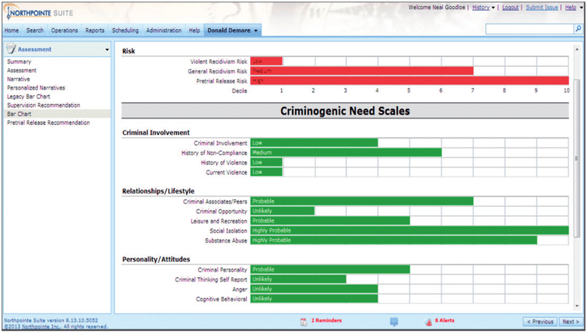

<!-- references -->
Image source (CC BY-NC-ND 4.0): Christin, Angèle. (2017). Algorithms in practice: Comparing web journalism and criminal justice. Big Data & Society. 4. 

----
## How to judge relative to seriousness of the crime?

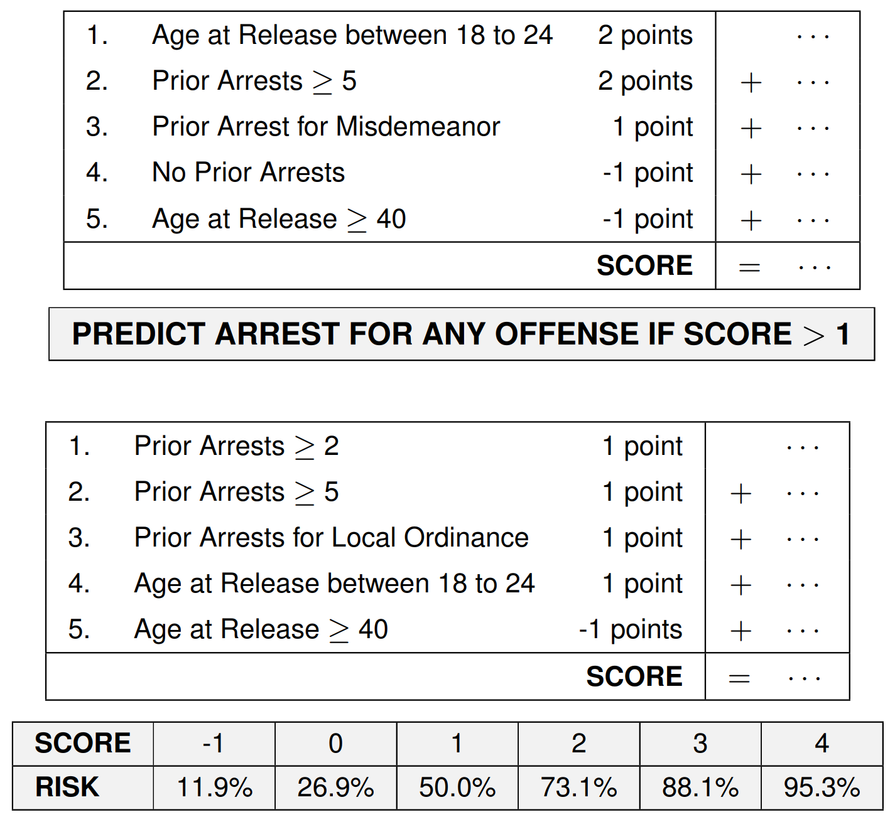
<!-- .element: class="stretch" -->


Rudin, Cynthia, and Berk Ustun. "[Optimized scoring systems: Toward trust in machine learning for healthcare and criminal justice](https://users.cs.duke.edu/~cynthia/docs/WagnerPrizeCurrent.pdf)." Interfaces 48, no. 5 (2018): 449-466.

----
## What factors go into predicting stroke risk?

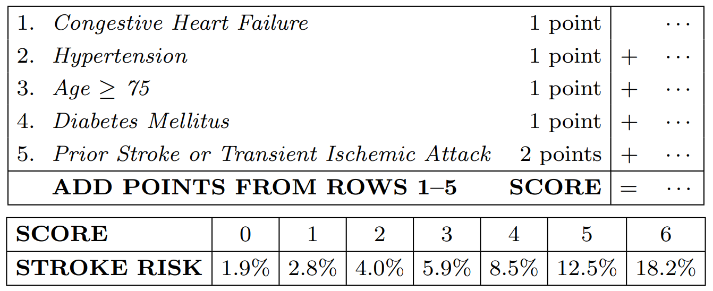

Rudin, Cynthia, and Berk Ustun. "[Optimized scoring systems: Toward trust in machine learning for healthcare and criminal justice](https://users.cs.duke.edu/~cynthia/docs/WagnerPrizeCurrent.pdf)." Interfaces 48, no. 5 (2018): 449-466.

----
## Is there an actual problem? How to find out?

<div class="tweet" data-src="https://twitter.com/dhh/status/1192540900393705474"></div>

----

<div class="tweet" data-src="https://twitter.com/dhh/status/1192945019230945280"></div>


----
## Explaining Decisions

Cat? Dog? Lion?

Confidence? Why?


----
## What's happening here?


<!-- .element: class="stretch" -->

----
## Extracting Knowledge from Data

* Sale 1: Bread, Milk
* Sale 2: Bread, Diaper, Beer, Eggs
* Sale 3: Milk, Diaper, Beer, Coke
* Sale 4: Bread, Milk, Diaper, Beer
* Sale 5: Bread, Milk, Diaper, Coke

Rules
* {Diaper, Beer} -> Milk (40% support, 66% confidence)
* Milk -> {Diaper, Beer} (40% support, 50% confidence)
* {Diaper, Beer} -> Bread (40% support, 66% confidence)

(see [association rule learning](https://en.wikipedia.org/wiki/Association_rule_learning))


----
## Explaining Decisions

[](slacknotifications.jpg)
<!-- .element: class="stretch" -->

----
## Explainability in ML

* Explain how the model made a decision
    - Rules, cutoffs, reasoning?
    - What are the relevant factors? 
    - Why those rules/cutoffs?
* Challenging because models too complex and based on data
    - Can we understand the rules?
    - Can we understand why these rules?


---
# Why Explainability?

----
## Legal Requirements


> The European Union General Data Protection Regulation extends the automated decision-making rights in the 1995 Data Protection Directive to provide a legally disputed form of a right to an explanation: "[the data subject should have] the right ... to obtain an explanation of the decision reached"
 
> US Equal Credit Opportunity Act requires to notify applicants of action taken with specific reasons: "The statement of reasons for adverse action required by paragraph (a)(2)(i) of this section must be specific and indicate the principal reason(s) for the adverse action."

<!-- references -->

See also https://en.wikipedia.org/wiki/Right_to_explanation

----
## Help Customers Achieve Better Outcomes

> What can I do to get the loan?

> How can I change my message to get more attention on Twitter?

> Why is my message considered as spam?

----
## Debugging

<!-- colstart -->

* Why did the system make a wrong prediction in this case?
* What does it actually learn?
* What kind of data would make it better?
* How reliable/robust is it?
* How much does the second model rely on the outputs of the first?
* Understanding edge cases

<!-- col -->


<!-- colend -->

Most common use case in practice according to recent study (Bhatt et al. "Explainable machine learning in deployment." In Proceedings of the 2020 Conference on Fairness, Accountability, and Transparency, pp. 648-657. 2020.)

----
## Auditing

* Understand safety implications 
* Ensure predictions are based on objective criteria and reasonable rules
* Inspect fairness properties
* Reason about biases and feedback loops
* ML as Requirements Engineering view: Validate "mined" requirements with stakeholders

```
IF age between 18–20 and sex is male THEN predict arrest
ELSE 
IF age between 21–23 and 2–3 prior offenses THEN predict arrest
ELSE 
IF more than three priors THEN predict arrest
ELSE predict no arrest
```


----
## Curiosity, learning, discovery, science

<!-- colstart -->

* What drove our past hiring decisions? Who gets promoted around here?
* What factors influence cancer risk? Recidivism?
* What influences demand for bike rentals?
* Which organizations are successful at raising donations and why?
<!-- col -->

<!-- colend -->

----
## Settings where Interpretability is *not* Important?

<!-- discussion -->

Notes:
* Model has no significant impact (e.g., exploration, hobby)
* Problem is well studied? e.g optical character recognition
* Security by obscurity? -- avoid gaming


----
## Exercise: Debugging a Model

Consider the following debugging challenges. In groups discuss how you would debug the problem. In 5 min report back to the group.

<!-- colstart -->
*Algorithm bad at recognizing some signs in some conditions:*

<!-- col -->
*Graduate application system seems to rank applicants HBCUs lowly:*

<!-- colend -->

<!-- smallish -->
<!-- references -->
Left Image: CC BY-SA 4.0, Adrian Rosebrock 


---
# Defining and Measuring Interpretability

<!-- references -->
Christoph Molnar. "[Interpretable Machine Learning: A Guide for Making Black Box Models Explainable](https://christophm.github.io/interpretable-ml-book/)." 2019
----
## Interpretability Definitions 

> Interpretability is the degree to which a human can understand the cause of a decision

> Interpretability is the degree to which a human can consistently predict the model’s result.

(No mathematical definition)


----
## Measuring Interpretability?

<!-- discussion -->

Note: Experiments asking humans questions about the model, e.g., what would it predict for X, how should I change inputs to predict Y?

----
## Explanation

Understanding a single prediction for a given input

> Your loan application has been *declined*. If your *savings account* had had more than $100 your loan application would be *accepted*.

Answer **why** questions, such as 
  * Why was the loan rejected? (justification)
  * Why did the treatment not work for the patient? (debugging)
  * Why is turnover higher among women? (general data science question)

----
## Measuring Explanation Quality?

<!-- discussion -->


----
## Three Levels of Evaluating Interpretability

* Functionally-grounded evaluation, proxy tasks without humans (least specific and expensive)
  - Depth of a decision tree (assuming smaller trees are easier to understand)
* Human-grounded evaluation, simple tasks with humans
  - Ask crowd-worker which explanation of a loan application they prefer
* Application-grounded evaluation, real tasks with humans (most specific and expensive)
  - Would a radiologist explain a cancer diagnosis in a similar way?


<!-- references -->

Doshi-Velez, Finale, and Been Kim. “[Towards a rigorous science of interpretable machine learning](http://arxiv.org/abs/1702.08608),” 2017.

----
## Intrinsic interpretability vs post-hoc explanation?

<!-- colstart -->
Models simple enough to understand 
(e.g., short decision trees, sparse linear models)


<!-- col -->
Explanation of black-box models, local or global

> Your loan application has been *declined*. If your *savings account* had more than $100 your loan application would be *accepted*.

> Load applications are always *declined* if the savings account has less than $50.

<!-- colend -->

----
## On Terminology

* Rudin's terminology and this lecture:
  - Interpretable models: Intrinsily interpretable models
  - Explainability: Post-hoc explanations
* Interpretability: property of a model
* Explainability: ability to explain the workings/predictions of a model
* Explanation: justification of a single prediction
* Interpretability vs explainability often used inconsistently or interchangeble


---
# Inherently Interpretable Models

----
## Sparse Linear Models

$f(x) = \alpha + \beta_1 x_1 + ... + \beta_n x_n$

Truthful explanations, easy to understand for humans

Easy to derive contrastive explanation and feature importance

Requires feature selection/regularization to minimize to few important features (e.g. Lasso); possibly restricting possible parameter values


<!-- .element: class="stretch" -->
 
----
## Decision Trees 

Easy to interpret up to a size

Possible to derive counterfactuals and feature importance

Unstable with small changes to training data


```
IF age between 18–20 and sex is male THEN predict arrest
ELSE IF age between 21–23 and 2–3 prior offenses THEN predict arrest
ELSE IF more than three priors THEN predict arrest
ELSE predict no arrest
```

----
## Not all Linear Models and Decision Trees are Interpretable

* Models can be very big, many parameters (factors, decisions)
* Nonlinear interactions possibly hard to grasp
* Tool support can help (views)
* Random forests, ensembles no longer understandable ("average over multiple interpretations"?)

```
173554,681081086 * root + 318523,818532818 * heuristicUnit + 
-103411,870761673 * eq + -24600,5000000002 * heuristicVsids +
-11816,7857142856 * heuristicVmtf + -33557,8961038976 * 
heuristic + -95375,3513513509 * heuristicUnit * satPreproYes + 
3990,79729729646 * transExt * satPreproYes + -136928,416666666 
* eq * heuristicUnit + 12309,4990990994 * eq * satPreproYes + 
33925,0833333346 * eq * heuristic + -643,428571428088 * 
backprop * heuristicVsids + -11876,2857142853 * backprop * 
heuristicUnit + 1620,24242424222 * eq * backprop + 
-7205,2500000002 * eq * heuristicBerkmin + -2 * Num1 * Num2 + 
10 * Num3 * Num4
```

Notes: Example of a performance influence model from http://www.fosd.de/SPLConqueror/ -- not the worst in terms of interpretability, but certainly not small or well formated or easy to approach.


----
## Decision Rules

*if-then rules mined from data*

easy to interpret if few and simple rules


see [association rule mining](https://en.wikipedia.org/wiki/Association_rule_mining):
 * {Diaper, Beer} -> Milk (40% support, 66% confidence)
 * Milk -> {Diaper, Beer} (40% support, 50% confidence)
 * {Diaper, Beer} -> Bread (40% support, 66% confidence)

----
## k-Nearest Neighbors

* Instance-based learning
* Returns most common class among the *k* nearest training data points
* No global interpretability, because no global rules
* 
* Interpret results by showing nearest neighbors
* Interpretation assumes understandable distance function and interpretable reference data points

*example: predict & explain car prices by showing similar sales*

----
## Research in Interpretable Models

* Several approaches to learn sparse constrained models (e.g., fit score cards, simple if-then-else rules)
* Often heavy emphasis on feature engineering and domain-specificity
* Possibly computationally expensive

<!-- references -->

Rudin, Cynthia. "[Stop explaining black box machine learning models for high stakes decisions and use interpretable models instead](https://arxiv.org/abs/1811.10154)." Nature Machine Intelligence 1, no. 5 (2019): 206-215.  


---
# Post-Hoc Explanations of Black-Box Models


(large research field, many approaches, much recent research)


<!-- references -->
Figure: Lundberg, Scott M., and Su-In Lee. [A unified approach to interpreting model predictions](http://papers.nips.cc/paper/7062-a-unified-approach-to-interpreting-model-predictions.pdf). Advances in Neural Information Processing Systems. 2017.


Christoph Molnar. "[Interpretable Machine Learning: A Guide for Making Black Box Models Explainable](https://christophm.github.io/interpretable-ml-book/)." 2019


----
## Explaining Black-Box Models

Given model $f$ observable by querying 

No access to model internals or training data 
(e.g., own deep neural network, online prediction service, ...)

Possibly many queries of $f$


----
## Global Surrogates

1. Select dataset X (previous training set or new dataset from same distribution)
2. Collect model predictions for every value ($y_i=f(x_i)$)
3. Train inherently interpretable model $g$ on (X,Y)
4. Interpret surrogate model $g$


Can measure how well $g$ fits $f$ with common model quality measures, typically $R^2$

**Advantages? Disadvantages?**

Notes:
Flexible, intuitive, easy approach, easy to compare quality of surrogate model with validation data ($R^2$).
But: Insights not based on real model; unclear how well a good surrogate model needs to fit the original model; surrogate may not be equally good for all subsets of the data; illusion of interpretability.
Why not use surrogate model to begin with?


----
## Local Surrogates (LIME)

*Create an inherently interpretable model (e.g. sparse linear model) for the area around a prediction*

Lime approach:
* Create random samples in the area around the data point of interest
* Collect model predictions with $f$ for each sample 
* Learn surrogate model $g$, weighing samples by distance
* Interpret surrogate model $g$

<!-- references -->
Ribeiro, Marco Tulio, Sameer Singh, and Carlos Guestrin. "["Why should I trust you?" Explaining the predictions of any classifier](http://dust.ess.uci.edu/ppr/ppr_RSG16.pdf)." In Proc International Conference on Knowledge Discovery and Data Mining, pp. 1135-1144. 2016.

----
## Lime Example


<!-- references -->
Source: 
Christoph Molnar. "[Interpretable Machine Learning: A Guide for Making Black Box Models Explainable](https://christophm.github.io/interpretable-ml-book/)." 2019

Note: Model distinguishes blue from gray area. Surrogate model learns only a while line for the nearest decision boundary, which may be good enough for local explanations.


----
## Lime Example
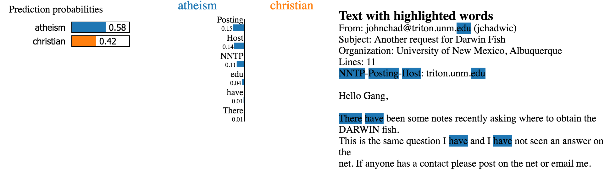


<!-- references -->
Source: https://github.com/marcotcr/lime 

----
## Lime Example

<!-- references -->
Source: https://github.com/marcotcr/lime 

----
## Lime Example

<!-- references -->
Source: Ribeiro, Marco Tulio, Sameer Singh, and Carlos Guestrin. "["Why should I trust you?" Explaining the predictions of any classifier](http://dust.ess.uci.edu/ppr/ppr_RSG16.pdf)." In Proc International Conference on Knowledge Discovery and Data Mining, pp. 1135-1144. 2016.


----
## Advantages and Disadvantages of (Local) Surrogates?

<!-- discussion -->


----
## Advantages and Disadvantages of (Local) Surrogates?

* short, contrastive explanations possible
* useful for debugging
* easy to use; works on lots of different problems
* explanations may use different features than original model
*
* partial local explanation not sufficient for compliance scenario where full explanation is needed
* explanations may be unstable

----
## Shapley Values

* Game-theoretic foundation for local explanations (1953)
* Explains contribution of each feature, over predictions with different subsets of features
  - "The Shapley value is the average marginal contribution of a feature value across all possible coalitions"
*
* Solid theory ensures fair mapping of influence to features
* Requires heavy computation, usually only approximations feasible
* Explanations contain all features (ie. not sparse)
* Influence, not counterfactuals
*
* Currently, most common local method used in practice

<!-- references -->

Lundberg, Scott M., and Su-In Lee. "[A unified approach to interpreting model predictions](https://proceedings.neurips.cc/paper/2017/file/8a20a8621978632d76c43dfd28b67767-Paper.pdf)." In Advances in neural information processing systems, pp. 4765-4774. 2017.

Bhatt et al. "Explainable machine learning in deployment." In Proceedings of the 2020 Conference on Fairness, Accountability, and Transparency, pp. 648-657

----
## Attention Maps


Identifies which parts of the input lead to decisions

<!-- references -->

Source: B. Zhou, A. Khosla, A. Lapedriza, A. Oliva, and A. Torralba. [Learning Deep Features for Discriminative Localization](http://cnnlocalization.csail.mit.edu/Zhou_Learning_Deep_Features_CVPR_2016_paper.pdf). CVPR'16 

----
## User Interface Design

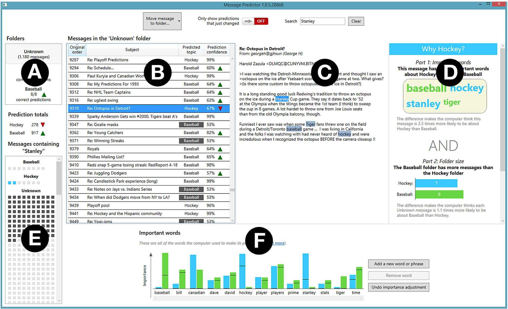

<!-- references -->
ulesza, T., Burnett, M., Wong, W-K. & Stumpf, S. (2015). Principles of
Explanatory Debugging to personalize interactive machine learning. In: Proc. International Conference on Intelligent User Interfaces.
(pp. 126-137)

----
## Partial Dependence Plot (PDP)

* Computes marginal effect of feature on predicted outcome
* Identifies relationship between feature and outcome (linear, monotonous, complex, ...)
*
* Intuitive, easy interpretation
* Assumes no correlation among features


----
## Partial Dependence Plot Example

*Bike rental in DC*

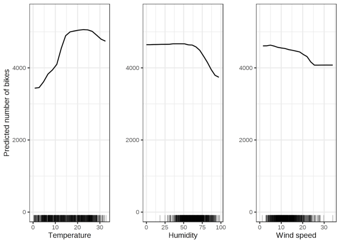
<!-- .element: class="stretch" -->

Source: 
Christoph Molnar. "[Interpretable Machine Learning](https://christophm.github.io/interpretable-ml-book/)." 2019

----
## Partial Dependence Plot Example

*Probability of cancer*


<!-- .element: class="stretch" -->

Source: 
Christoph Molnar. "[Interpretable Machine Learning](https://christophm.github.io/interpretable-ml-book/)." 2019

----
## Individual Conditional Expectation (ICE)

*Similar to PDP, but not averaged; may provide insights into interactions*


<!-- .element: class="stretch" -->

Source: 
Christoph Molnar. "[Interpretable Machine Learning](https://christophm.github.io/interpretable-ml-book/)." 2019

----
## Feature Importance

* Permute a features value in training or validation set to not use it for prediction
* Measure influence on accuracy
* i.e. evaluate feature effect without retraining the model
*
* Highly compressed, *global* insights
* Effect for feature + interactions
* Can only be computed on labeled data, depends on model accuracy, randomness from permutation
* May produce unrealistic inputs when correlations exist

**Feature importance on training or validation data?**


Note: Training vs validation is not an obvious answer and both cases can be made, see Molnar's book. Feature importance on the training data indicates which features the model has learned to use for predictions.


----
## Feature Importance Example


<!-- .element: class="stretch" -->


Source: 
Christoph Molnar. "[Interpretable Machine Learning](https://christophm.github.io/interpretable-ml-book/)." 2019


----
## Invariants and Anchors

* Identify partial conditions that are sufficient for a prediction
* e.g. "*when income < X loan is always rejected*"
* For some models, many predictions can be explained with few mined rules
* 
* Compare association rule mining and specification mining
* Rules mined from many observed examples

<!-- references -->
Ribeiro, Marco Tulio, Sameer Singh, and Carlos Guestrin. "[Anchors: High-precision model-agnostic explanations](https://www.aaai.org/ocs/index.php/AAAI/AAAI18/paper/download/16982/15850)." In Thirty-Second AAAI Conference on Artificial Intelligence. 2018.

Ernst, Michael D., Jake Cockrell, William G. Griswold, and David Notkin. "[Dynamically discovering likely program invariants to support program evolution](http://laserweb.cs.umass.edu/courses/cs521-621.Fall10/documents/p213-ernst.pdf)." IEEE Transactions on Software Engineering 27, no. 2 (2001): 99-123.


----
## Example: Anchors


<!-- references -->
Source: Ribeiro, Marco Tulio, Sameer Singh, and Carlos Guestrin. "[Anchors: High-precision model-agnostic explanations](https://www.aaai.org/ocs/index.php/AAAI/AAAI18/paper/download/16982/15850)." In Thirty-Second AAAI Conference on Artificial Intelligence. 2018.

----
## Example: Anchors

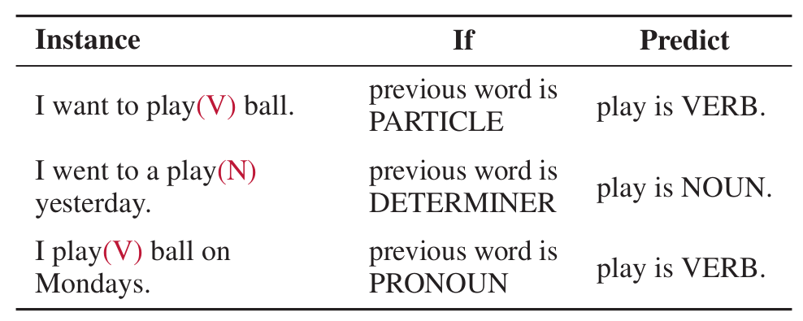


<!-- references -->
Source: Ribeiro, Marco Tulio, Sameer Singh, and Carlos Guestrin. "[Anchors: High-precision model-agnostic explanations](https://www.aaai.org/ocs/index.php/AAAI/AAAI18/paper/download/16982/15850)." In Thirty-Second AAAI Conference on Artificial Intelligence. 2018.


----
## Example: Anchors


<!-- references -->
Source: Ribeiro, Marco Tulio, Sameer Singh, and Carlos Guestrin. "[Anchors: High-precision model-agnostic explanations](https://www.aaai.org/ocs/index.php/AAAI/AAAI18/paper/download/16982/15850)." In Thirty-Second AAAI Conference on Artificial Intelligence. 2018.


----
## Excursion: Daikon for dynamic detection of likely invariants

* Software engineering technique to find invariants
  * e.g., `i>0`, `a==x`, `this.stack != null`, `db.query() after db.prepare()`
  * Pre- and post-conditions of functions, local variables
* Uses for documentation, avoiding bugs, debugging, testing, verification, repair
* Idea: Observe many executions (instrument code), log variable values, look for relationships (test many possible invariants)

----
## Daikon Example
<!-- smallish -->
<!-- colstart -->
```java
public class Stack {
    private Object[] theArray;
    private int topOfStack;
    public StackAr(int c) {
        theArray = new Object[c];
        topOfStack = -1;
    }    
    public Object top( ) {
        if(isEmpty()) return null;
        return theArray[topOfStack];
    }
    public boolean isEmpty( ) {
        return topOfStack == -1;
    }
    ...
}    
```


<!-- col -->
Invariants found
```text
StackAr:::OBJECT
this.theArray != null
this.theArray.getClass().getName() == 
    java.lang.Object[].class
this.topOfStack >= -1
this.topOfStack <= size(this.theArray[])-1

StackAr.top():::EXIT75
return == 
  this.theArray[this.topOfStack]
return == 
  this.theArray[orig(this.topOfStack)]
return == 
  orig(this.theArray[this.topOfStack])
this.topOfStack >= 0
return != null
```
<!-- colend -->

Notes: many examples in https://www.cs.cmu.edu/~aldrich/courses/654-sp07/tools/kim-daikon-02.pdf


----
## Discussion: Anchors and Invariants

* Anchors provide only partial explanations
* Help check/debug functioning of system 
* Anchors usually probabilistic, not guarantees


---
# Example-Based Explanations

(thinking in analogies and contrasts)

<!-- references -->
Christoph Molnar. "[Interpretable Machine Learning: A Guide for Making Black Box Models Explainable](https://christophm.github.io/interpretable-ml-book/)." 2019

----
## Counterfactual Explanations

*if X had not occured, Y would not have happened*

> Your loan application has been *declined*. If your *savings account* had had more than $100 your loan application would be *accepted*.


-> Smallest change to feature values that result in given output


----
## Multiple Counterfactuals

Often long or multiple explanations

> Your loan application has been *declined*. If your *savings account* ...

> Your loan application has been *declined*. If your lived in ...

Report all or select "best" (e.g. shortest, most actionable, likely values)

<!-- split -->


(Rashomon effect)

----
## Searching for Counterfactuals?

<!-- discussion -->

----
## Searching for Counterfactuals

Random search (with growing distance) possible, but inefficient

Many search heuristics, e.g. hill climbing or Nelder–Mead, may use gradient of model if available

Can incorporate distance in loss function

$$L(x,x^\prime,y^\prime,\lambda)=\lambda\cdot(\hat{f}(x^\prime)-y^\prime)^2+d(x,x^\prime)$$


(similar to finding adversarial examples)

----
## Example Counterfactuals

*redicted risk of diabetes with 3-layer neural network*

Which feature values must
be changed to increase or decrease the risk score of diabetes to 0.5?

* Person 1: If your 2-hour serum insulin level was 154.3, you would have a score of 0.51
* Person 2: If your 2-hour serum insulin level was 169.5, you would have a score of 0.51
* Person 3: If your Plasma glucose concentration was 158.3 and your 2-hour serum insulin level was 160.5, you would have a score of 0.51

----
## Discussion: Counterfactuals

<!-- discussion -->

----


----
## Discussion: Counterfactuals

* Easy interpretation, can report both alternative instance or required change
* No access to model or data required, easy to implement
*
* Often many possible explanations (Rashomon effect), requires selection/ranking
* May require changes to many features, not all feasible
* May not find counterfactual within given distance
* Large search spaces, especially with high-cardinality categorical features

----
## Actionable Counterfactuals

*Example: Denied loan application*

* Customer wants feedback of how to get the loan approved
* Some suggestions are more actionable than others, e.g.,
  * Easier to change income than gender
  * Cannot change past, but can wait
* In distance function, not all features may be weighted equally

----
## Gaming/Attacking the Model with Explanations?

*Does providing an explanation allow customers to 'hack' the system?*

* Loan applications?
* Apple FaceID?
* Recidivism?
* Auto grading?
* Cancer diagnosis?
* Spam detection?

<!-- split -->

<!-- discussion -->

----
## Gaming the Model with Explanations?

<iframe width="800" height="500" src="https://www.youtube.com/embed/w6rx-GBBwVg?start=147" frameborder="0" allow="accelerometer; autoplay; encrypted-media; gyroscope; picture-in-picture" allowfullscreen></iframe>


----
## Gaming the Model with Explanations?

* A model prone to gaming uses weak proxy features
* Protections requires to make the model hard to observe (e.g., expensive to query predictions)
* Protecting models akin to "security by obscurity"
*
* Good models rely on hard facts that are hard to game and relate causally to the outcome


```
IF age between 18–20 and sex is male THEN predict arrest
ELSE 
IF age between 21–23 and 2–3 prior offenses THEN predict arrest
ELSE 
IF more than three priors THEN predict arrest
ELSE predict no arrest
```


----
## Prototypes and Criticisms

> A prototype is a data instance that is representative of all the data. 

> A criticism is a data instance that is not well represented by the set of prototypes.

**How would you use this?** (e.g., credit rating, cancer detection)

----
## Example: Prototypes and Criticisms?


----
## Example: Prototypes and Criticisms

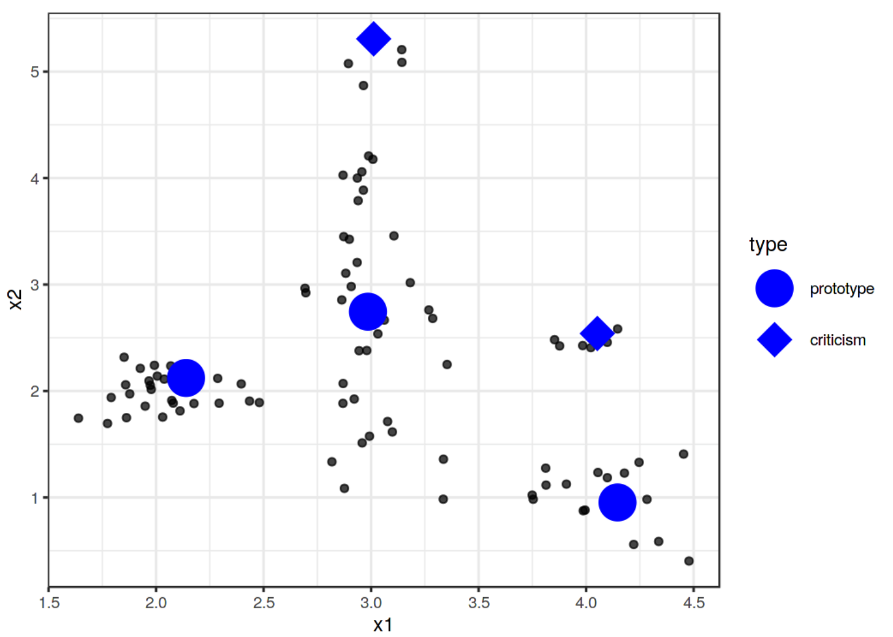
<!-- .element: class="stretch" -->

Source: 
Christoph Molnar. "[Interpretable Machine Learning](https://christophm.github.io/interpretable-ml-book/)." 2019

----
## Example: Prototypes and Criticisms


<!-- references -->
Source: 
Christoph Molnar. "[Interpretable Machine Learning: A Guide for Making Black Box Models Explainable](https://christophm.github.io/interpretable-ml-book/)." 2019
----
## Example: Prototypes and Criticisms


<!-- references -->
Source: 
Christoph Molnar. "[Interpretable Machine Learning: A Guide for Making Black Box Models Explainable](https://christophm.github.io/interpretable-ml-book/)." 2019

Note: The number of digits is different in each set since the search was conducted globally, not per group.


----
## Methods: Prototypes and Criticisms

* Usually identify number of prototypes and criticisms upfront
* Clustering of data (ala k-means)
  * k-medoids returns actual instances as centers for each cluster
  * MMD-critic identifies both prototypes and criticisms
  * see book for details
+ Identify globally or per class

----
## Discussion: Prototypes and Criticisms

* Easy to inspect data, useful for debugging outliers
* Generalizes to different kinds of data and problems
* Easy to implement algorithm
* 
* Need to choose number of prototypes and criticism upfront
* Uses all features, not just features important for prediction


----
## Emerging Research: Inherently-Interpretable Models based on Prototypes

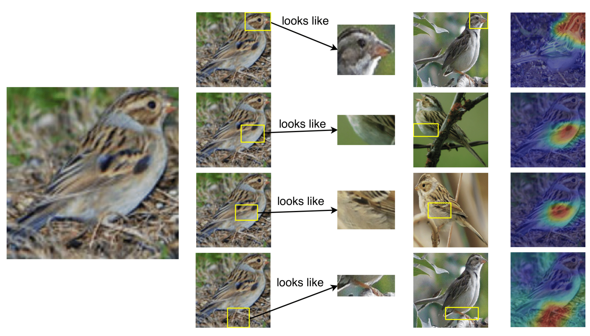
<!-- .element: class="stretch" -->

Chen, Chaofan, et al. "This looks like that: deep learning for interpretable image recognition." arXiv preprint arXiv:1806.10574 (2018).

----
## Influential Instances

**Data debugging!**

*What data most influenced the training? Is the model skewed by few outliers?*

* Training data with $n$ instances
* Train model $f$ with all $n$ instances
* Train model $g$ with $n-1$ instances
* If $f$ and $g$ differ significantly, omitted instance was influential
  - Difference can be measured e.g. in accuracy or difference in parameters

Note: Instead of understanding a single model, comparing multiple models trained on different data

----
## Example: Influential Instance


<!-- .element: class="stretch" -->

Source: 
Christoph Molnar. "[Interpretable Machine Learning](https://christophm.github.io/interpretable-ml-book/)." 2019

----
## What distinguishes an influential instance from a non-influential instance?

Compute influence of every data point and create new model to explain influence in terms of feature values


<!-- .element: class="stretch" -->
(cancer prediction example)

*Which features have a strong influence but little support in the training data?*


Source: 
Christoph Molnar. "[Interpretable Machine Learning](https://christophm.github.io/interpretable-ml-book/)." 2019

Note: Example from cancer prediction. The influence analysis tells us that the model becomes increasingly unstable when
predicting cancer for higher ages. This means
that errors in these instances can have a strong effect on the model.

----
## Debugging Drift with Influential Instances

* Which data points on the training data influenced the model to work less on newer production data?
* Identify influential training instances on recent production misclassification
* Example: Cancer prediction model built in one hospital but works less well in other hospital
  - Is there training data that causes poor generalization? What are the characteristics of that data (e.g., different age groups)? Are differences due to concept or data drift?

----
## Selectively Checking Data Quality with Influential Instances

* Labeled data comes in different qualities (see [data programming lecture](https://ckaestne.github.io/seai/S2020/slides/11_dataquality/dataquality.html#/9))
* Double check labels of influential instances; lower quality labels may be sufficient for less influential instances


----
## Influential Instances Discussion

* Retraining for every data point is simple but expensive
* For some class of models, influence of data points can be computed without retraining (e.g., logistic regression), see book for details
* Hard to generalize to taking out multiple instances together
* 
* Useful model-agnostic debugging tool for models and data


<!-- references -->
Christoph Molnar. "[Interpretable Machine Learning: A Guide for Making Black Box Models Explainable](https://christophm.github.io/interpretable-ml-book/)." 2019


---
# What makes good explanations?

<!-- discussion -->

----
## Good Explanations are contrastive

Counterfactuals. *Why this, rather than a different prediction?*

> Your loan application has been *declined*. If your *savings account* had had more than $100 your loan application would be *accepted*.

Partial explanations often sufficient in practice if contrastive

----
## Explanations are selective

Often long or multiple explanations; parts are often sufficient

> Your loan application has been *declined*. If your *savings account* had had more than $100 your loan application would be *accepted*.

> Your loan application has been *declined*. If your lived in *Ohio* your loan application would be *accepted*.
 

<!-- split -->


(Rashomon effect)

----
## Good Explanations are Social

Different audiences might benefit from different explanations

*Accepted vs rejected loan applications?*

*Explanation to customer or hotline support?*

Consistent with prior belief of the explainee


---
## Exercise: Debugging a Model

Consider the following debugging challenges. In groups discuss which explainability tools may help and why. In 10 min report back to the group.

<!-- colstart -->
*Algorithm bad at recognizing some signs in some conditions:*

<!-- col -->
*Graduate application system seems to rank applicants HBCUs lowly:*

<!-- colend -->

<!-- smallish -->
<!-- references -->
Left Image: CC BY-SA 4.0, Adrian Rosebrock 


---
# Explanations and User Interaction Design


<!-- references -->
[People + AI Guidebook](https://pair.withgoogle.com/research/), Google

----


<!-- split -->

<!-- split -->


Tell the user when a lack of data might mean they’ll need to use their own judgment. Don’t be afraid to admit when a lack of data could affect the quality of the AI recommendations.

<!-- references -->
Source:
[People + AI Guidebook](https://pair.withgoogle.com/research/), Google


----


<!-- split -->

<!-- split -->
Give the user details about why a prediction was made in a high stakes scenario. Here, the user is exercising after an injury and needs confidence in the app’s recommendation. Don’t say “what” without saying “why” in a high stakes scenario.
<!-- references -->
Source:
[People + AI Guidebook](https://pair.withgoogle.com/research/), Google


----


<!-- .element: class="stretch" -->

**Example each?**


Source: [People + AI Guidebook](https://pair.withgoogle.com/research/), Google


---
# "Stop explaining black box machine learning models for high stakes decisions and use interpretable models instead."

<!-- references -->
Cynthia Rudin (32min) or 🗎 Rudin, Cynthia. "[Stop explaining black box machine learning models for high stakes decisions and use interpretable models instead](https://arxiv.org/abs/1811.10154)." Nature Machine Intelligence 1, no. 5 (2019): 206-215. 

----
## Accuracy vs Explainability Conflict?


<!-- .element: class="stretch" -->


Graphic from the DARPA XAI BAA (Explainable Artificial Intelligence) 

----
## Faithfulness of Ex-Post Explanations

<!-- discussion -->

----
## CORELS’ model for recidivism risk prediction

```
IF age between 18–20 and sex is male THEN predict arrest
ELSE 
IF age between 21–23 and 2–3 prior offenses THEN predict arrest
ELSE 
IF more than three priors THEN predict arrest
ELSE predict no arrest
```

Simple, interpretable model with comparable accuracy to proprietary COMPAS model

<!-- references -->

Rudin, Cynthia. "Stop explaining black box machine learning models for high stakes decisions and use interpretable models instead." Nature Machine Intelligence 1.5 (2019): 206-215. ([Preprint](https://arxiv.org/abs/1811.10154))


----
## "Stop explaining black box machine learning models for high stakes decisions and use interpretable models instead"

<!-- smallish -->

Hypotheses:
* It is a myth that there is necessarily a trade-off between accuracy and interpretability (when having meaningful features)
* Explainable ML methods provide explanations that are not faithful to what the original model computes
* Explanations often do not make sense, or do not provide enough detail to understand what the black box is doing
* Black box models are often not compatible with situations where information outside the database needs to be combined with a risk assessment
* Black box models with explanations can lead to an overly complicated decision pathway that is ripe for human error


<!-- references -->

Rudin, Cynthia. "Stop explaining black box machine learning models for high stakes decisions and use interpretable models instead." Nature Machine Intelligence 1.5 (2019): 206-215. ([Preprint](https://arxiv.org/abs/1811.10154))

----
## Interpretable Models vs Post-Hoc Explanations

* High-stakes decisions
  * interpretable models provide faithful explanations
  * post-hoc explanations may provide limited insights or illusion of understanding
  * interpretable models  can be audited
* In many cases similar accuracy
* Larger focus on feature engineering, but insights into when and *why* the model works
  - exploratory data analysis, plots, association rule mining
  - more effort for building interpretable models (especially beyond well structured tabular data)
* Less research on interpretable models and some methods computationally expensive
  - additional constraints on model form for interpretability limit degrees of freedom: sparseness, parameters with easy to read weights, ...

----
## ProPublica Controversy


Notes: "ProPublica’s linear model was not truly an
“explanation” for COMPAS, and they should not have concluded that their explanation model uses the same
important features as the black box it was approximating."
----
## ProPublica Controversy


```
IF age between 18–20 and sex is male THEN predict arrest
ELSE 
IF age between 21–23 and 2–3 prior offenses THEN predict arrest
ELSE 
IF more than three priors THEN predict arrest
ELSE predict no arrest
```

<!-- references -->

Rudin, Cynthia. "[Stop explaining black box machine learning models for high stakes decisions and use interpretable models instead](https://arxiv.org/abs/1811.10154)." Nature Machine Intelligence 1, no. 5 (2019): 206-215.  


----
## Drawbacks of Interpretable Models

* Intellectual property protection harder
  - may need to sell model, not license as service
  - who owns the models and who is responsible for their mistakes?
* Gaming possible; "security by obscurity" not a defense
* Expensive to build (feature engineering effort, debugging, computational costs)
* Limited to fewer factors, may discover fewer patterns, lower accuracy


----
## Call for Transparent and Audited Models 

> "no black box should be deployed
when there exists an interpretable model with the same level of performance"

* High-stakes decisions with government involvement (recidivism, policing, city planning, ...)
* High-stakes decisions in medicine
* High-stakes decisions with discrimination concerns (hiring, loans, housing, ...)
* Decisions that influence society and discourse? (content curation on Facebook, targeted advertisement, ...)

*Regulate possible conflict: Intellectual property vs public health/welfare*


<!-- references -->

Rudin, Cynthia. "Stop explaining black box machine learning models for high stakes decisions and use interpretable models instead." Nature Machine Intelligence 1.5 (2019): 206-215. ([Preprint](https://arxiv.org/abs/1811.10154))


---
# Beyond "Just" Explaining the Model

<!-- references -->

Cai, Carrie J., Samantha Winter, David Steiner, Lauren Wilcox, and Michael Terry. ""Hello AI": Uncovering the Onboarding Needs of Medical Practitioners for Human-AI Collaborative Decision-Making." Proceedings of the ACM on Human-computer Interaction 3, no. CSCW (2019): 1-24.

----
## Setting Cancer Imaging -- What explanations do radiologists want?

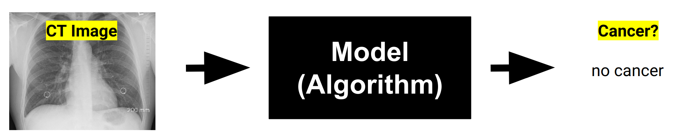

* *Past attempts often not successful at bringing tools into production. Radiologists do not trust them. Why?*
* [Wizard of oz study](https://en.wikipedia.org/wiki/Wizard_of_Oz_experiment) to elicit requirements

----


----
## Radiologists' questions

* How does it perform compared to human experts?
* "What is difficult for the AI to know? Where is it too sensitive? What criteria is it good at recognizing or not good at recognizing?"
* What data (volume, types, diversity) was the model trained on?
* "Does the AI assistant have access to information that I don’t have? Does it have access to any ancillary studies?" Is all used data shown in the user interface?
* What kind of things is the AI looking for? What is it capable of learning? ("Maybe light and dark? Maybe colors? Maybe shapes, lines?", "Does it take into consideration the relationship between gland and stroma? Nuclear relationship?")
* "Does it have a bias a certain way?" (compared to colleagues)

----
## Radiologists' questions

* Capabilities and limitations: performance, strength, limitations; e.g. how does it handle well-known edge cases
* Functionality: What data used for predictions, how much context, how data is used
* Medical point-of-view: calibration, how liberal/conservative when grading cancer severity
* Design objectives: Designed for few false positives or false negatives? Tuned to compensate for human error?
* Other considerations: legal liability, impact on workflow, cost of use

[Paper, Tab 1](https://dl.acm.org/doi/pdf/10.1145/3359206)


----
## Insights

* AI literacy important for trust
* Be transparent about data used
* Describe training data and capabilities
* Give mental model, examples, human-relatable test cases 
* Communicate the AI’s point-of-view and design goal


<!-- references -->

Cai, Carrie J., Samantha Winter, David Steiner, Lauren Wilcox, and Michael Terry. ""Hello AI": Uncovering the Onboarding Needs of Medical Practitioners for Human-AI Collaborative Decision-Making." Proceedings of the ACM on Human-computer Interaction 3, no. CSCW (2019): 1-24.


---
# Transparency


----
## Case Study: Facebook's Feed Curation


<!-- references -->

Eslami, Motahhare, Aimee Rickman, Kristen Vaccaro, Amirhossein Aleyasen, Andy Vuong, Karrie Karahalios, Kevin Hamilton, and Christian Sandvig. [I always assumed that I wasn't really that close to [her]: Reasoning about Invisible Algorithms in News Feeds](http://eslamim2.web.engr.illinois.edu/publications/Eslami_Algorithms_CHI15.pdf). In Proceedings of the 33rd annual ACM conference on human factors in computing systems, pp. 153-162. ACM, 2015.


----
## Case Study: Facebook's Feed Curation
<!-- smallish -->

* 62% of interviewees were not aware of curation algorithm
* Surprise and anger when learning about curation

> "Participants were most upset when close friends and
family were not shown in their feeds [...] participants often attributed missing stories to their friends’ decisions to exclude them rather than to Facebook News Feed algorithm."

* Learning about algorithm did not change satisfaction level
* More active engagement, more feeling of control


<!-- references -->

Eslami, Motahhare, Aimee Rickman, Kristen Vaccaro, Amirhossein Aleyasen, Andy Vuong, Karrie Karahalios, Kevin Hamilton, and Christian Sandvig. [I always assumed that I wasn't really that close to [her]: Reasoning about Invisible Algorithms in News Feeds](http://eslamim2.web.engr.illinois.edu/publications/Eslami_Algorithms_CHI15.pdf). In Proceedings of the 33rd annual ACM conference on human factors in computing systems, pp. 153-162. ACM, 2015.

----
## Case Study: HR Application Screening


<div class="tweet" data-src="https://twitter.com/TheWrongNoel/status/1194842728862892033"></div>


----
## The Dark Side of Explanations

* Explanations can induce overconfidence in the model; people do not trust their own intuitions
* Users may feel influence and control, even with placebo explanations
* Companies give vague generic explanations to appease regulators

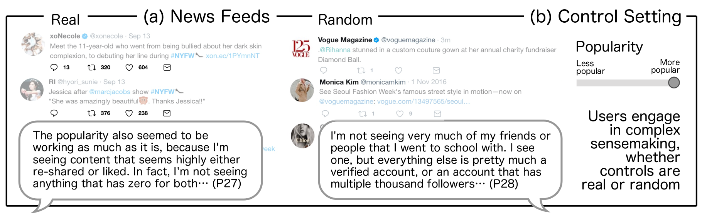

<!-- references -->

* Stumpf, Simone, Adrian Bussone, and Dympna O’sullivan. "Explanations considered harmful? user interactions with machine learning systems." In Proc. CHI. 2016.
* Vaccaro, Kristen, Dylan Huang, Motahhare Eslami, Christian Sandvig, Kevin Hamilton, and Karrie Karahalios. "The illusion of control: Placebo effects of control settings." In Proc CHI, 2018.


----
## Appropriate Level of Algorithmic Transparency

IP/Trade Secrets/Fairness/Perceptions/Ethics?

How to design? How much control to give?

<!-- discussion -->
 


---
# (Self-)Regulation and Policy


----


----
## Policy Discussion and Frameing

* Corporate pitch: "Responsible AI" ([Microsoft](https://www.microsoft.com/en-us/ai/responsible-ai), [Google](https://ai.google/responsibilities/responsible-ai-practices/), [Accenture](https://www.accenture.com/_acnmedia/pdf-92/accenture-afs-responsible-ai.pdf))
* Counterpoint: Ochigame ["The Invention of 'Ethical AI': How Big Tech Manipulates Academia to Avoid Regulation"](https://theintercept.com/2019/12/20/mit-ethical-ai-artificial-intelligence/), The Intercept 2019
  - "*The discourse of “ethical AI” was aligned strategically with a Silicon Valley effort seeking to avoid legally enforceable restrictions of controversial technologies.*"
* Self-regulation vs government regulation? Assuring safety vs fostering innovation?

<!-- discussion -->

----
[](https://www.forbes.com/sites/cognitiveworld/2020/03/01/this-is-the-year-of-ai-regulations/#1ea2a84d7a81)


----
## “Accelerating America’s Leadership in Artificial Intelligence”

> “the policy of the United States Government [is] to sustain and enhance the scientific, technological, and economic leadership position of the United States in AI.” -- [White House Executive Order Feb. 2019](https://www.whitehouse.gov/articles/accelerating-americas-leadership-in-artificial-intelligence/)

Tone: "When in doubt, the government should not regulate AI."

* 3. Setting AI Governance Standards: "*foster public trust in AI systems by establishing guidance for AI development. [...] help Federal regulatory agencies develop and maintain approaches for the safe and trustworthy creation and adoption of new AI technologies. [...] NIST to lead the development of appropriate technical standards for reliable, robust, trustworthy, secure, portable, and interoperable AI systems.*"

----
## Jan 13 2020 Draft Rules for Private Sector AI

* *Public Trust in AI*: Overarching theme: reliable, robust, trustworthy AI
* *Public participation:* public oversight in AI regulation
* *Scientific Integrity and Information Quality:* science-backed regulation
* *Risk Assessment and Management:* risk-based regulation
* *Benefits and Costs:* regulation costs may not outweigh benefits
* *Flexibility:* accommodate rapid growth and change
* *Disclosure and Transparency:* context-based transparency regulation 
* *Safety and Security:* private sector resilience
* 


[Draft: Guidance for Regulation of Artificial Intelligence Applications](https://www.whitehouse.gov/wp-content/uploads/2020/01/Draft-OMB-Memo-on-Regulation-of-AI-1-7-19.pdf)

----
## Other Regulations

* *China:* policy ensures state control of Chinese companies and over valuable data, including storage of data on Chinese users within the country and mandatory national standards for AI
* *EU:* Ethics Guidelines for Trustworthy Artificial Intelligence; Policy and investment recommendations for trustworthy Artificial Intelligence; draft regulatory framework for high-risk AI applications, including procedures for testing, record-keeping, certification, ...
* *UK:* Guidance on responsible design and implementation of AI systems and data ethics


Source: https://en.wikipedia.org/wiki/Regulation_of_artificial_intelligence

---
# Summary

* Interpretability useful for many scenarios: user feedback, debugging, fairness audits, science, ...
* Defining and measuring interpretability
* Inherently interpretable models: sparse regressions, shallow decision trees
* Providing ex-post explanations of blackbox models
  - global and local surrogates
  - dependence plots and feature importance
  - invariants (anchors)
  - counter-factual explanations
* Data debugging with prototypes, criticisms, and influential instances
* Consider implications on user interface design
* Considerations for high-stakes decisions
* Regulations may be coming