# Security, Adversarial Learning, and Privacy

Christian Kaestner

with slides from Eunsuk Kang

<!-- references -->

Required reading: 
🕮 Hulten, Geoff. "Building Intelligent Systems: A Guide to Machine Learning Engineering." (2018), Chapter 25 (Adversaries and Abuse)
🕮 Agrawal, A., Gans, J., & Goldfarb, A. (2018). [*Prediction machines: the simple economics of artificial intelligence*](https://cmu.primo.exlibrisgroup.com/permalink/01CMU_INST/6lpsnm/alma991019698987304436). Harvard Business Press. Chapter 19 (Managing AI Risk)

Recommended reading: 
🗎 Goodfellow, I., McDaniel, P., & Papernot, N. (2018). [Making machine learning robust against adversarial inputs](https://par.nsf.gov/servlets/purl/10111674). *Communications of the ACM*, *61*(7), 56-66. 
🗎 Huang, L., Joseph, A. D., Nelson, B., Rubinstein, B. I., & Tygar, J. D. (2011, October). [Adversarial machine learning](http://www.blaine-nelson.com/research/pubs/Huang-Joseph-AISec-2011.pdf). In *Proceedings of the 4th ACM workshop on Security and artificial intelligence* (pp. 43-58). 

---
# Learning Goals

* Explain key concerns in security (in general and with regard to ML models)
* Analyze a system with regard to attacker goals, attack surface, attacker capabilities 
* Describe common attacks against ML models, including poisoning attacks, evasion attacks, leaking IP and private information
* Measure robustness of a prediction and a model
* Understand design opportunities to address security threats at the system level
* Identify security requirements with threat modeling
* Apply key design principles for secure system design
* Discuss the role of AI in securing software systems

---
## Security at the Model Level

* Various attack discussions, e.g. poisioning attacks
* Model robustness
* Attack detection
* ...

<!-- split -->
## Security at the System Level

* Requirements analysis
* System-level threat modeling
* Defense strategies beyond the model
* Security risks beyond the model
* ...

---
# Security

----
## Elements of Security

* Security requirements (policies)
  * What does it mean for my system to be secure?
* Threat model
    * What are the attacker's goal, capability, and incentive?
* Attack surface
	* Which parts of the system are exposed to the attacker?
* Protection mechanisms
	* How do we prevent the attacker from compromising a security requirement?

----
## Security Requirements


* "CIA triad" of information security
* __Confidentiality__: Sensitive data must be accessed by authorized users only
* __Integrity__: Sensitive data must be modifiable by authorized users only
* __Availability__: Critical services must be available when needed by clients


----
# Other Security Properties 

* Authentication (no spoofing): Users are who they say they are
* Integrety (no tampering): Data is changed only through authorized processes
* Non-repudiation: Every change can be traced to who was responsible for it
* Confidentiality (no inform. disclosure): Information only accessible to authorized users
* Availability (no denial of service): Critical services must be available when needed by clients
* Authorization (no escalation of privilege): Only users with the right permissions can access a resource/perform an action

----
## Example: College Admission System

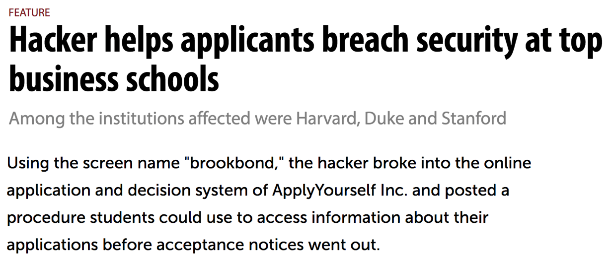

----
## Confidentiality, integrity, or availability?

* Applications to the program can only be viewed by staff and faculty
in the department.
* The application site should be able to handle requests on the
day of the application deadline.
* Application decisions are recorded only by the faculty and staff.
* The application site should backup all applications in case of a
server failure.
* The acceptance notices can only be sent out by the program director.

----
## CIA of an ML Model

*What are security concerns of a **ML model** for ranking applications?*


<!-- discussion -->

* __Confidentiality__: Sensitive data must be accessed by authorized users only
* __Integrity__: Sensitive data must be modifiable by authorized users only
* __Availability__: Critical services must be available when needed by clients


Notes:
Many examples:
Confidentiality attacks: try to infer sensitive labels for data (e.g. training instances)
Integrity: cause a model to misclassify a data point, e.g. spam as nonspam
Availability attack: Misclassify many data points to make a model essentially useless 


---
# Understanding Attacker Goals

----
## Why Threat Model?


----
## What is Threat Modeling?

* Threat model: A profile of an attacker
  * __Goal__: What is the attacker trying to achieve?
  * __Capability__:
	* Knowledge: What does the attacker know?
	* Actions: What can the attacker do?
	* Resources: How much effort can it spend? 
  * __Incentive__: Why does the attacker want to do this?


----
## Attacker Goals and Incentives

* What is the attacker trying to achieve? Undermine one or more security requirements
* Why does the attacker want to do this?

*Example goals and incentives in college admission scenario?*
	
<!-- discussion -->

Notes:
  * Access other applicants info without being authorized
	* Modify application status to “accepted”
  * Submit applications that get accepted
  * Cause expense by making the model useless and forcing manual evaluations or poor outcomes
	* Cause website shutdown to sabotage other applicants


---
# Attacks on ML Models


----
## Scenario: Rankings and Reviews on Web Shop


----
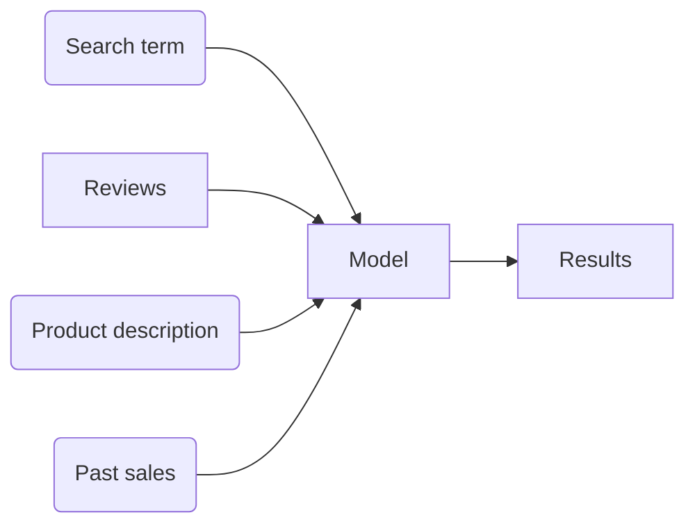


----
## Scenario: Spam Filter


----
## Capabilities

**How can an attacker interact with / influence the model?**

<!-- discussion -->

----
## Attack vectors

* Influence the training data ("causative attack", "poisioning attack")
* Influence the input data ("exploratory attack", "evasion attack")
* Influence the telemetry data

**Examples in spam filter scenario?**


----
## Poisoning Attack: Availability

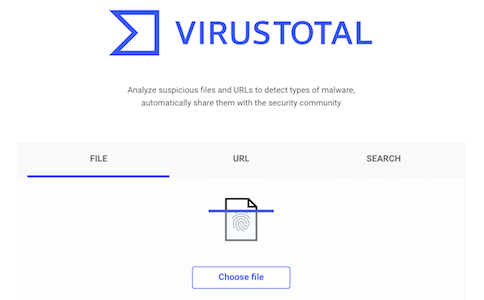

* Availability: Inject mislabeled training data to damage model
quality
    * 3% poisoning => 11% decrease in accuracy (Steinhardt, 2017)
* Attacker must have some access to the training set
    * models trained on public data set (e.g., ImageNet)
    * retrained automatically on telemetry

Notes:
* Example: Anti-virus (AV) scanner
    * Online platform for submission of potentially malicious code
  * Some AV company (allegedly) poisoned competitor's model
  

----
## Poisoning Attack: Integrity

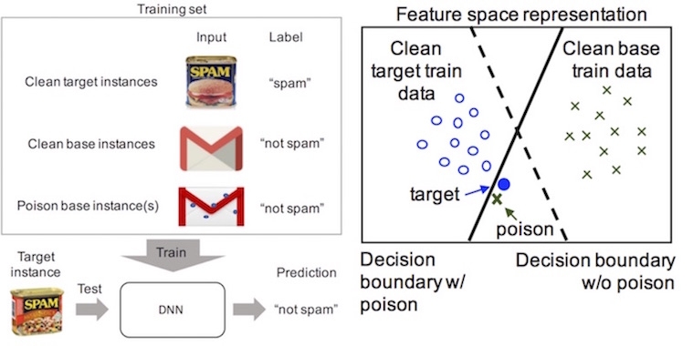

* Insert training data with seemingly correct labels
* More targeted than availability attacks
  * Cause misclassification from one specific class to another

<!-- references -->
_Poison Frogs! Targeted Clean-Label Poisoning Attacks on Neural
Networks_, Shafahi et al. (2018)

----
## Many Different Kinds of Attacks on Training Data

* Correlated outlier attack: add spurious features to malicious instances to misclassify benign instances 
* Red herring attack: add spurious features to early malicious instances, then send malicious payload without those features


----
## Poisoning Attack in Web Shop?


----
## Defense against Poisoning Attacks


<!-- references -->

_Stronger Data Poisoning Attacks Break Data Sanitization Defenses_,
Koh, Steinhardt, and Liang (2018).


----
## Defense against Poisoning Attacks


* Anomaly detection & data sanitization
  * Identify and remove outliers in training set
  * Identify and understand drift from telemetry
  * See [data quality lecture](https://ckaestne.github.io/seai/S2020/slides/11_dataquality/dataquality.html#/)
* Quality control over your training data
  * Who can modify or add to my training set? Do I trust the data
  source?
  * Use security mechanisms (e.g., authentication) and logging to
    track data provenance
* Slow down retraining, monitor model quality
* Debug models + explainability (e.g., influential instances)
* Use models that are robust against noisy training data


----
## Attacks on Input Data (Evasion Attacks, Adversarial Examples)


* Add noise to an existing sample & cause misclassification
  - achieve specific outcome (evasion attack)
  - circumvent ML-based authentication like FaceID (impersonation attack)
* Attack at inference time

<!-- references -->

_Accessorize to a Crime: Real and Stealthy Attacks on State-of-the-Art
Face Recognition_, Sharif et al. (2016).


----
## Task Decision Boundary vs Model Boundary

[](decisionboundary.png)
<!-- .element: class="stretch" -->

From Goodfellow et al (2018). [Making machine learning robust against adversarial inputs](https://par.nsf.gov/servlets/purl/10111674). *Communications of the ACM*, *61*(7), 56-66. 
----
## Generating Adversarial Examples

* see [counterfactual explanations](https://ckaestne.github.io/seai/S2020/slides/16_explainability/explainability.html#/7/1)
* Find similar input with different prediction
  - targeted (specific prediction) vs untargeted (any wrong prediction)
* Many similarity measures (e.g., change one feature vs small changes to many features) 
  - $x^* = x + arg min \\{ |z| : f(x+z)=t \\}$
* Attacks more affective which access to model internals, but also black-box attacks (with many queries to the model) feasible
  - With model internals: follow the model's gradient
  - Without model internals: learn [surrogate model](https://ckaestne.github.io/seai/S2020/slides/16_explainability/explainability.html#/6/2)
  - With access to confidence scores: heuristic search (eg. hill climbing)


----
## Example of Evasion Attacks

Spam scenario? Web store scenario? Credit scoring scenario?


----
## Recall: Gaming Models with Weak Features

*Does providing an explanation allow customers to 'hack' the system?*

* Loan applications?
* Apple FaceID?
* Recidivism?
* Auto grading?
* Cancer diagnosis?
* Spam detection?

**Gaming not possible if model boundary = task decision boundary**

<!-- split -->

<!-- discussion -->


----
## Discussion: Can We Secure a System with a Known Model?

* Can we protect the model?
* How to prevent surrogate models?
* Security by obscurity?
*
* Alternative model hardening or system design strategies?
* 
<!-- discussion -->


---
# Excursion: Robustness

property with massive amount of research, in context of security and safety

----
## Defining Robustness:

* A prediction for $x$ is robust if the outcome is stable under minor perturbations of the input
  - $\forall x'. d(x, x')<\epsilon \Rightarrow f(x) = f(x')$
  - distance function $d$ and permissible distance $\epsilon$ depends on problem
* A model is robust if most predictions are robust

----
## Robustness and Distance for Images

+ slight rotation, stretching, or other transformations
+ change many pixels minimally (below human perception)
+ change only few pixels
+ change most pixels mostly uniformly, eg brightness


<!-- references -->
Image: Singh, Gagandeep, Timon Gehr, Markus Püschel, and Martin Vechev. "[An abstract domain for certifying neural networks](https://dl.acm.org/doi/pdf/10.1145/3290354)." Proceedings of the ACM on Programming Languages 3, no. POPL (2019): 1-30. 

----
## Robustness and Distance

* For text:
  - insert words
  - replace words with synonyms
  - reorder text
* For tabular data:
  - change values
  - depending on feature extraction, small changes may have large effects
* ...
  
*note, not all changes may be feasible or realistic; some changes are obvious to humans*

*realistically, a defender will not anticipate all attacks and corresponding distances*

----
## No Model is Fully Robust

* Every useful model has at least one decision boundary (ideally at the real task decision boundary)
* Predictions near that boundary are not (and should not) be robust


----
## Robustness of Interpretable Models


```
IF age between 18–20 and sex is male THEN predict arrest
ELSE 
IF age between 21–23 and 2–3 prior offenses THEN predict arrest
ELSE 
IF more than three priors THEN predict arrest
ELSE predict no arrest
```

<!-- references -->

Rudin, Cynthia. "[Stop explaining black box machine learning models for high stakes decisions and use interpretable models instead](https://arxiv.org/abs/1811.10154)." Nature Machine Intelligence 1, no. 5 (2019): 206-215.  


----
## Decision Boundaries in Practice

* With many models (especially deep neural networks), we do not understand decision boundaries
* We are not confident that model decision boundaries align with task decision boundaries
  - The model's perception does not align well with human perception
* Models may pick up on parts of the input in surprising ways


----
## Assuring Robustness

* Much research, many tools and approaches (especially for DNN)
* Formal verification
  - Constraint solving or abstract interpretation over computations in neuron activations
  - Conservative abstraction, may label robust inputs as not robust
  - Currently not very scalable
  - Example: 🗎 Singh, Gagandeep, Timon Gehr, Markus Püschel, and Martin Vechev. "[An abstract domain for certifying neural networks](https://dl.acm.org/doi/pdf/10.1145/3290354)." Proceedings of the ACM on Programming Languages 3, no. POPL (2019): 1-30. 
* Sampling
  - Sample within distance, compare prediction to majority prediction
  - Probabilistic guarantees possible (with many queries, e.g., 100k)
  - Example: 🗎 Cohen, Jeremy M., Elan Rosenfeld, and J. Zico Kolter. "[Certified adversarial robustness via randomized smoothing](https://arxiv.org/abs/1902.02918)." In Proc. International Conference on Machine Learning, p. 1310--1320, 2019.

----
## Practical Use of Robustness

* Defense and safety mechanism at inference time
  - Check robustness of each prediction at runtime
  - Handle inputs with non-robust predictions differently (e.g. discard, low confidence)
  - Significantly raises cost of prediction (e.g. 100k model inferences or constraint solving at runtime)
* Testing and debugging
  - Identify training data near model's decision boundary (i.e., model robust around all training data?)
  - Check robustness on test data
  - Evaluate distance for adversarial attacks on test data

*(most papers on the topic focus on techniques and evaluate on standard benchmarks like handwitten numbers, but do not discuss practical scenarios)*

----
## Increasing Model Robustness

* Augment training data with transformed versions of training data (same label) or with identified adversaries
* Defensive distillation: Second model trained on "soft" labels of first 
* Input transformations: Learning and removing adversarial transformations
* Inserting noise into model to make adversarial search less effective, mask gradients
* Dimension reduction: Reduce opportunity to learn spurious decision boundaries
* Ensemble learning: Combine models with different biases
* 
* Lots of research claiming effectiveness and vulnerabilities of various strategies

<!-- references -->
More details and papers: Rey Reza Wiyatno. [Securing machine learning models against adversarial attacks](https://www.elementai.com/news/2019/securing-machine-learning-models-against-adversarial-attacks). Element AI 2019

----
## Detecting Adversaries

* Adversarial Classification: Train a model to distinguish benign and adversarial inputs
* Distribution Matching: Detect inputs that are out of distribution
* Uncertainty Thresholds: Measuring uncertainty estimates in the model for an input

<!-- references -->
More details and papers: Rey Reza Wiyatno. [Securing machine learning models against adversarial attacks](https://www.elementai.com/news/2019/securing-machine-learning-models-against-adversarial-attacks). Element AI 2019

----
## Robustness in Web Store Scenario?


---
# IP and Privacy

----

[](https://www.wired.com/2011/02/bing-copies-google/)

----
## Intellectual Property Protection

* Depending on deployment scenario
* May have access to model internals (e.g. in app binary)
* May be able to repeatedly query model's API
  - build surrogate model (*inversion attack*)
  - cost per query? rate limit? abuse detection?
* Surrogate models ease other forms of attacks

----
[](https://www.wired.com/2010/03/netflix-cancels-contest/)

Note: "an in-the-closet lesbian mother sued Netflix for privacy invasion, alleging the movie-rental company made it possible for her to be outed when it disclosed insufficiently anonymous information about nearly half-a-million customers as part of its $1 million contest."

----


<!-- references -->
Fredrikson, Matt, Somesh Jha, and Thomas Ristenpart. "[Model inversion attacks that exploit confidence information and basic countermeasures](http://www.cs.cmu.edu/~mfredrik/papers/fjr2015ccs.pdf)." In Proceedings of the 22nd ACM SIGSAC Conference on Computer and Communications Security, pp. 1322-1333. 2015.

----
## Privacy

* Various privacy issues about acquiring and sharing training data, e.g.,
  - DeepMind receiving NHS data on 1.6 million patients without their consent
  - Chest X-rays not shared for training because they may identify people
  - Storage of voice recordings of voice assistants
* Model inversion attacks: Models contain information from training data, may recover information from training data
  - Extract DNA from medical model
  - Extract training images from face recognition model


<!-- references -->
Kyle Wiggers. [AI has a privacy problem, but these techniques could fix it](https://venturebeat.com/2019/12/21/ai-has-a-privacy-problem-but-these-techniques-could-fix-it/). Venturebeat, 2019

----
# Generative Adversarial Networks

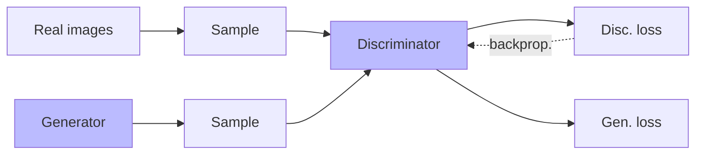

----
# Prototypical inputs with GANs

[](https://commons.wikimedia.org/wiki/File:Woman_2.jpg)
<!-- .element: class="stretch" -->

Notes:
* Generative adversarial networks: 2 models, one producing samples and one discriminating real from generated samples
  - Learn data distribution of training data
  - Produce prototypical images, e.g. private jets
  - Deep fakes

----
## Privacy Protection Strategies

* Federated learning (local models, no access to all data)
* Differential privacy (injecting noise to avoid detection of individuals)
* Homomorphic encryption (computing on encrypted data)
* 
* Much research
* Some adoption in practice (Android keyboard, Apple emoji)
* Usually accuracy or performance tradeoffs

<!-- references -->
Kyle Wiggers. [AI has a privacy problem, but these techniques could fix it](https://venturebeat.com/2019/12/21/ai-has-a-privacy-problem-but-these-techniques-could-fix-it/). Venturebeat, 2019


---
# Security at the System Level

*security is more than model robustness*

*defenses go beyond hardening models*

----


Note: At a price of $.25 per min it iss possibly not economical to train a surrogate model or inject bad telemetry

----


Note: Raise the price of wrong inputs

----


Note: source https://www.buzzfeednews.com/article/pranavdixit/twitter-5g-coronavirus-conspiracy-theory-warning-label

Shadow banning also fits here

----
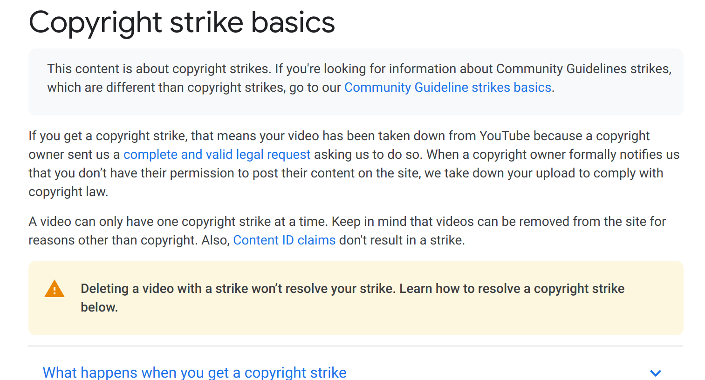

Note: Block user of suspected attack to raise their cost, burn their resources

----


Note: Reporting function helps to crowdsource detection of malicious content and potentially train a future classifier (which again can be attacked)

----
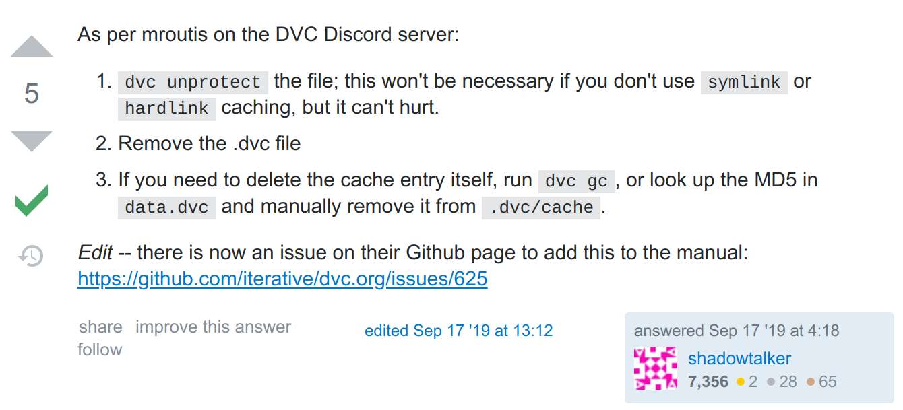

Note: See reputation system

----


Note: Block system after login attempts with FaceID or fingerprint 

----
## System Design Questions

* What is one simple change to make the system less interesting to abusers?
* Increase the cost of abuse, limit scale?
* Decrease the value of abuse?
* Trust established users over new users?
* Reliance on ML to combat abuse?
* Incidence response plan?


---
# Threat Modeling

----
## Threat Modeling


* Attacker Profile
  * __Goal__: What is the attacker trying to achieve?
  * __Capability__:
  * Knowledge: What does the attacker know?
  * Actions: What can the attacker do?
  * Resources: How much effort can it spend? 
  * __Incentive__: Why does the attacker want to do this?
+ Understand how the attacker can interact with the system
+ Understand security strategies and their scope
+ **Identify security requirements**


	
----
## Attacker Capability


* Capabilities depends on system boundary & its exposed interfaces
* Use an architecture diagram to identify attack surface & actions
* Example: College admission
    * Physical: Break into building & access server
    * Cyber: Send malicious HTTP requests for SQL injection,
  DoS attack
    * Social: Send phishing e-mail, bribe an insider for access
  
----
## Architecture Diagram for Threat Modeling


* Dynamic and physical architecture diagram
* Describes system components and users and their interactions
* Describe thrust boundaries


----
## STRIDE Threat Modeling

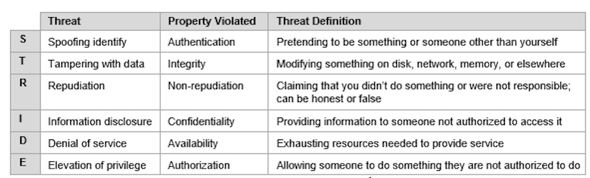

* Systematic inspection to identifying threats & attacker actions
  * For each component/connection, enumerate & identify potential threats using checklist
  * e.g., Admission Server & DoS: Applicant may flood it with requests
  * Derive security requirements
* Tool available (Microsoft Threat Modeling Tool)
* Popularized by Microsoft, broadly used in practice


----
## Open Web Application Security Project

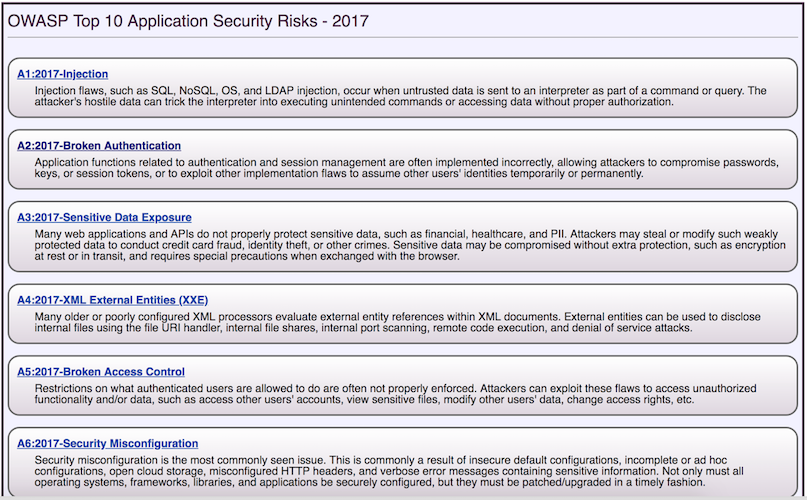

* OWASP: Community-driven source of knowledge & tools for web security


----
## Threat Modeling Limitations

* Manual approach, false positives and false negatives
* May end up with a long list of threats, not all of them relevant
* Need to still correctly implement security requirements
* False sense of security: STRIDE does not imply completeness!

----
## Threat Modeling Adjustments for AI?

<!-- discussion -->


----
## Threat Modeling Adjustments for AI?

* Explicitly consider origins, access, and influence of all relevant data (training, prediction input, prediction result, model, telemetry)
* Consider AI-specific attacks
  - Poisoning attacks
  - Evasion attacks
  - Surrogate models
  - Privacy leaks
  - ...


----
## State of ML Security

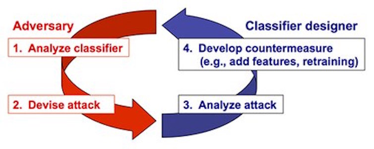

* On-going arms race (mostly among researchers)
    * Defenses proposed & quickly broken by noble attacks
* *Assume ML component is likely vulnerable*
    * Design your system to minimize impact of an attack
* Remember: There may be easier ways to compromise system
    * e.g., poor security misconfiguration (default password), lack of
    encryption, code vulnerabilities, etc., 

---
# Designing for Security

----
## Secure Design Principles 

* Principle of Least Privilege
  * A component should be given the minimal privileges needed to fulfill its functionality
  * Goal: Minimize the impact of a compromised component
* Isolation
  * Components should be able to interact with each other no more than necessary
  * Goal: Reduce the size of trusted computing base (TCB) 
  * TCB: Components responsible for establishing a security requirement(s)
  * If any of TCB compromised => security violation
  * Conversely, a flaw in non-TCB component => security still preserved!
  * In poor system designs, TCB = entire system

----
## Monolithic Design


Flaw in any part of the system =>  Security impact on the entire system!


----
## Compartmentalized Design

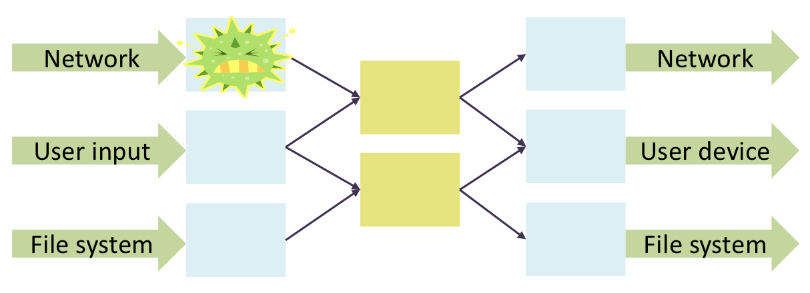

Flaw in one component =>  Limited impact on the rest of the system!

----
## Non-ML Example: Mail Client

* Requirements
  * Receive & send email over external network
  * Place incoming email into local user inbox files
* Sendmail
  * Monolithic design; entire program runs as UNIX root
  * Historical source of many vulnerabilities
* Qmail: “Security-aware” mail agent
  + Compartmentalized design
  + Isolation based on OS process isolation
  + Separate modules run as separate “users” (UID)
  + Mutually distrusting processes
  + Least privilege 
  + Minimal privileges for each UID; access to specific resources (files, network sockets, …)
  + Only one “root” user (with all privileges)

----
## Qmail Architecture


----
## Qmail Architecture


----
## Qmail Architecture


---
# AI for Security

----
[](https://builtin.com/artificial-intelligence/artificial-intelligence-cybersecurity)
<!-- .element: class="stretch" -->

----
## Many Defense Systems use Machine Learning

* Classifiers to learn malicious content
  - Spam filters, virus detection
* Anomaly detection
  - Identify unusual/suspicious activity, eg. credit card fraud, intrusion detection
  - Often unsupervised learning, e.g. clustering
* Game theory
  - Model attacker costs and reactions, design countermeasures
* Automate incidence response and mitigation activites
  - Integrated with DevOps
* Network analysis
  - Identify bad actors and their communication in public/intelligence data
* Many more, huge commercial interest

<!-- references -->

Recommended reading: Chandola, Varun, Arindam Banerjee, and Vipin Kumar. "[Anomaly detection: A survey](http://cucis.ece.northwestern.edu/projects/DMS/publications/AnomalyDetection.pdf)." ACM computing surveys (CSUR) 41, no. 3 (2009): 1-58.  

----
## AI Security Solutions are AI-Enabled Systems Too

* AI/ML component one part of a larger system
* Consider entire system, from training to telemetry, to user interface, to pipeline automation, to monitoring
* AI-based security solutions can be attacked themselves

----


Note: One contributing factor to the Equifax attack was an expired certificate for an intrusion detection system


---
# Summary

* Security requirements: Confidentiality, integrity, availability
* ML-specific attacks on training data, telemetry, or the model
  - Poisoning attack on training data to influence predictions
  - Evasion attacks to shape input data to achieve intended predictions (adversarial learning)
  - Leaks of model IP (surrogates) and training data
* Robustness as a measure of prediction stability w.r.t to input perturbations; verification possible
* Security design at the system level
  - Influence costs and gains
  - Security mechanisms beyond the model
* Threat modeling to identify security requirements
* AI can be used for defense (e.g. anomaly detection)
* __Key takeaway__: Adopt a security mindset! Assume all components may be vulnerable in one way or another. Design your system to explicitly reduce the impact of potential attacks

<!-- smallish -->


