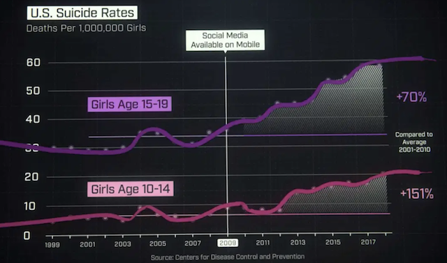
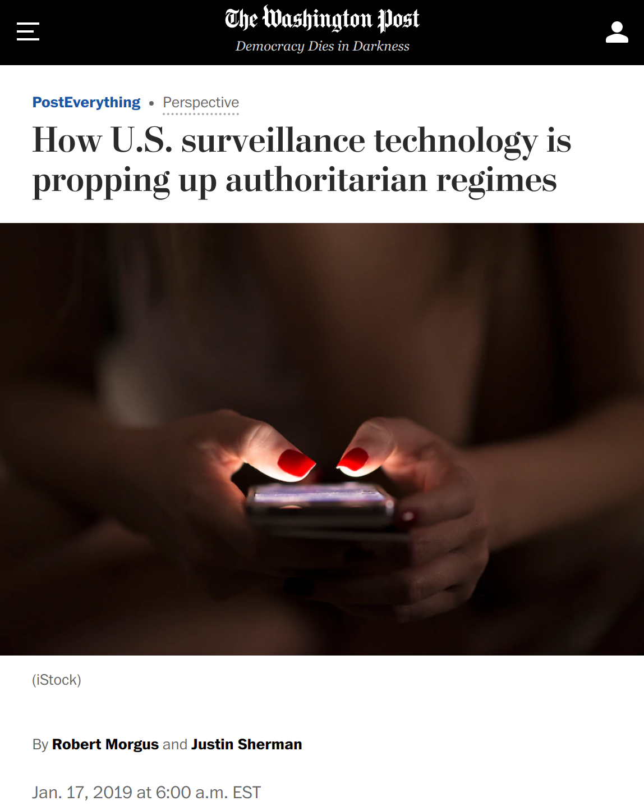
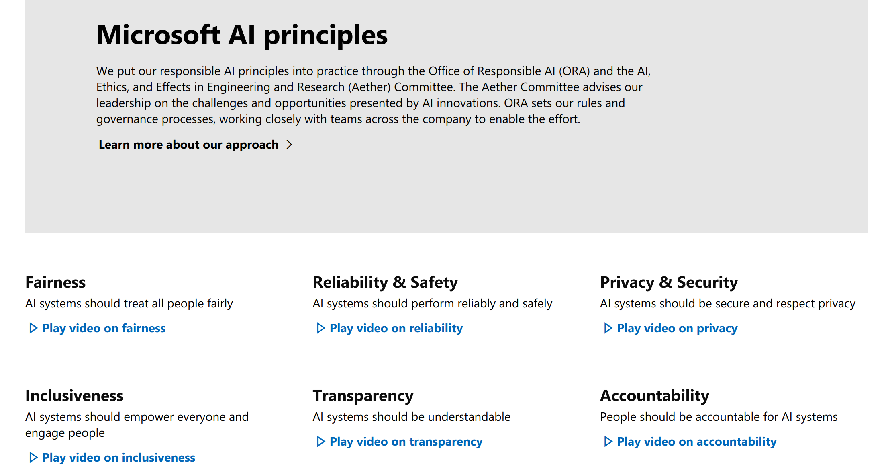

# Transparency and Accountability

Christian Kaestner


<!-- references -->

Required reading: Google PAIR. People + AI Guidebook. Chapter: [Explainability and Trust](https://pair.withgoogle.com/chapter/explainability-trust/). 2019.

Recommended supplementary reading: 🕮 Christoph Molnar. "[Interpretable Machine Learning: A Guide for Making Black Box Models Explainable](https://christophm.github.io/interpretable-ml-book/)." 2019

---
# Learning Goals

* Explain key concepts of transparency and trust
* Discuss whether and when transparency can be abused to game the system
* Design a system to include human oversight
* Understand common concepts and discussions of accountability/culpability 
* Critique regulation and self-regulation approaches in ethical machine learning


---
# Transparency

(users know that algorithm exists / users know how the algorithm works)

----

<div class="tweet" data-src="https://twitter.com/TheWrongNoel/status/1194842728862892033"></div>


----
## Case Study: Facebook's Feed Curation


<!-- references -->

Eslami, Motahhare, Aimee Rickman, Kristen Vaccaro, Amirhossein Aleyasen, Andy Vuong, Karrie Karahalios, Kevin Hamilton, and Christian Sandvig. [I always assumed that I wasn't really that close to [her]: Reasoning about Invisible Algorithms in News Feeds](http://eslamim2.web.engr.illinois.edu/publications/Eslami_Algorithms_CHI15.pdf). In Proceedings of the 33rd annual ACM conference on human factors in computing systems, pp. 153-162. ACM, 2015.


----
## Case Study: Facebook's Feed Curation
<!-- smallish -->

* 62% of interviewees were not aware of curation algorithm
* Surprise and anger when learning about curation

> "Participants were most upset when close friends and
family were not shown in their feeds [...] participants often attributed missing stories to their friends’ decisions to exclude them rather than to Facebook News Feed algorithm."

* Learning about algorithm did not change satisfaction level
* More active engagement, more feeling of control


<!-- references -->

Eslami, Motahhare, Aimee Rickman, Kristen Vaccaro, Amirhossein Aleyasen, Andy Vuong, Karrie Karahalios, Kevin Hamilton, and Christian Sandvig. [I always assumed that I wasn't really that close to [her]: Reasoning about Invisible Algorithms in News Feeds](http://eslamim2.web.engr.illinois.edu/publications/Eslami_Algorithms_CHI15.pdf). In Proceedings of the 33rd annual ACM conference on human factors in computing systems, pp. 153-162. ACM, 2015.

----
## The Dark Side of Transparency

* Users may feel influence and control, even with placebo controls
* Companies give vague generic explanations to appease regulators


<!-- references -->

* Vaccaro, Kristen, Dylan Huang, Motahhare Eslami, Christian Sandvig, Kevin Hamilton, and Karrie Karahalios. "The illusion of control: Placebo effects of control settings." In Proc CHI, 2018.


----
## Appropriate Level of Algorithmic Transparency

IP/Trade Secrets/Fairness/Perceptions/Ethics?

How to design? How much control to give?

<!-- discussion -->
 


---
# Gaming/Attacking the Model with Explanations?

*Does providing an explanation allow customers to 'hack' the system?*

* Loan applications?
* Apple FaceID?
* Recidivism?
* Auto grading?
* Cancer diagnosis?
* Spam detection?


----
## Gaming the Model with Explanations?

<iframe width="800" height="500" src="https://www.youtube.com/embed/w6rx-GBBwVg?start=147" frameborder="0" allow="accelerometer; autoplay; encrypted-media; gyroscope; picture-in-picture" allowfullscreen></iframe>


----
## Gaming the Model with Explanations?

* A model prone to gaming uses weak proxy features
* Protections requires to make the model hard to observe (e.g., expensive to query predictions)
* Protecting models akin to "security by obscurity"
*
* Good models rely on hard facts that are hard to game and relate causally to the outcome


```
IF age between 18–20 and sex is male THEN predict arrest
ELSE 
IF age between 21–23 and 2–3 prior offenses THEN predict arrest
ELSE 
IF more than three priors THEN predict arrest
ELSE predict no arrest
```


---
# Human Oversight and Appeals

----
## Human Oversight and Appeals

* Unavoidable that ML models will make mistakes
* Users knowing about the model may not be comforting 
* Inability to appeal a decision can be deeply frustrating

<div class="tweet" data-src="https://twitter.com/dhh/status/1192945019230945280"></div>

----
## Capacity to keep humans in the loop?

* ML used because human decisions as a bottleneck
* ML used because human decisions biased and inconsistent
*
* Do we have the capacity to handle complaints/appeals?
* Wouldn't reintroducing humans bring back biases and inconsistencies

----
## Designing Human Oversight

* Consider the entire system and consequences of mistakes
* Deliberately design mitigation strategies for handling mistakes
* Consider keeping humans in the loop, balancing harms and costs
  * Provide pathways to appeal/complain? Respond to complains?
  * Review mechanisms? Can humans override tool decision?
  * Tracking telemetry, investigating common mistakes?
  * Audit model and decision process rather than appeal individual outcomes?


---
# Accountability and Culpability

*Who is held accountable if things go wrong?*

----
## On Terminology

* accountability, responsibility, liability, and culpability all overlap in common use
* all about assigning *blame* -- responsible for fixing or liable for paying for damages
* liability, culpability have *legal* connotation
* accountability, responsibility tend to describe *ethical* aspirations
* see legal vs ethical earlier

----
## Who is responsible?




----
## Who is responsible?



----
## Who is responsible?


----

> THE SOFTWARE IS PROVIDED “AS IS”, WITHOUT WARRANTY OF ANY KIND, EXPRESS OR IMPLIED, INCLUDING BUT NOT LIMITED TO THE WARRANTIES OF MERCHANTABILITY, FITNESS FOR A PARTICULAR PURPOSE AND NONINFRINGEMENT. IN NO EVENT SHALL THE AUTHORS OR COPYRIGHT HOLDERS BE LIABLE FOR ANY CLAIM, DAMAGES OR OTHER LIABILITY, WHETHER IN AN ACTION OF CONTRACT, TORT OR OTHERWISE, ARISING FROM, OUT OF OR IN CONNECTION WITH THE SOFTWARE OR THE USE OR OTHER DEALINGS IN THE SOFTWARE.

Note: Software engineers got (mostly) away with declaring not to be liable

----
## Easy to Blame "The Algorithm" / "The Data" / "Software"

> Just a bug, things happen, nothing we can do about it
  
- But system was designed by humans
- Humans did not anticipate possible mistakes, did not design to mitigate mistakes
- Humans made decisions about what quality assurance would be sufficient
- Humans designed (or ignored) the process for developing the software
- Humans gave/sold poor quality software to other humans
- Humans used the software without understanding it
- ...

----


Results from the [2018 StackOverflow Survey](https://insights.stackoverflow.com/survey/2018/#technology-and-society)

----
## What to do?

* Responsible organizations embed risk analysis, quality control, and ethical considerations into their process
* Establish and communicate policies defining responsibilities
* Work from aspirations toward culture change: baseline awareness + experts
* Document tradeoffs and decisions (e.g., datasheets, model cards)
* Continuous learning
* Consider controlling/restricting how software may be used
* And... follow the law

* Get started with existing guidelines, e.g., in [AI Ethics Guidelines Global Inventory](https://algorithmwatch.org/en/ai-ethics-guidelines-global-inventory/)


---
# (Self-)Regulation and Policy


----


----
## Policy Discussion and Frameing

* Corporate pitch: "Responsible AI" ([Microsoft](https://www.microsoft.com/en-us/ai/responsible-ai), [Google](https://ai.google/responsibilities/responsible-ai-practices/), [Accenture](https://www.accenture.com/_acnmedia/pdf-92/accenture-afs-responsible-ai.pdf))
* Counterpoint: Ochigame ["The Invention of 'Ethical AI': How Big Tech Manipulates Academia to Avoid Regulation"](https://theintercept.com/2019/12/20/mit-ethical-ai-artificial-intelligence/), The Intercept 2019
  - "*The discourse of “ethical AI” was aligned strategically with a Silicon Valley effort seeking to avoid legally enforceable restrictions of controversial technologies.*"
* Self-regulation vs government regulation? Assuring safety vs fostering innovation?

<!-- discussion -->

----
[](https://www.forbes.com/sites/cognitiveworld/2020/03/01/this-is-the-year-of-ai-regulations/#1ea2a84d7a81)


----
## “Accelerating America’s Leadership in Artificial Intelligence”

> “the policy of the United States Government [is] to sustain and enhance the scientific, technological, and economic leadership position of the United States in AI.” -- [White House Executive Order Feb. 2019](https://www.whitehouse.gov/articles/accelerating-americas-leadership-in-artificial-intelligence/)

Tone: "When in doubt, the government should not regulate AI."

* 3. Setting AI Governance Standards: "*foster public trust in AI systems by establishing guidance for AI development. [...] help Federal regulatory agencies develop and maintain approaches for the safe and trustworthy creation and adoption of new AI technologies. [...] NIST to lead the development of appropriate technical standards for reliable, robust, trustworthy, secure, portable, and interoperable AI systems.*"

----
## Jan 13 2020 Draft Rules for Private Sector AI

* *Public Trust in AI*: Overarching theme: reliable, robust, trustworthy AI
* *Public participation:* public oversight in AI regulation
* *Scientific Integrity and Information Quality:* science-backed regulation
* *Risk Assessment and Management:* risk-based regulation
* *Benefits and Costs:* regulation costs may not outweigh benefits
* *Flexibility:* accommodate rapid growth and change
* *Disclosure and Transparency:* context-based transparency regulation 
* *Safety and Security:* private sector resilience
* 


[Draft: Guidance for Regulation of Artificial Intelligence Applications](https://www.whitehouse.gov/wp-content/uploads/2020/01/Draft-OMB-Memo-on-Regulation-of-AI-1-7-19.pdf)

----
## Other Regulations

* *China:* policy ensures state control of Chinese companies and over valuable data, including storage of data on Chinese users within the country and mandatory national standards for AI
* *EU:* Ethics Guidelines for Trustworthy Artificial Intelligence; Policy and investment recommendations for trustworthy Artificial Intelligence; draft regulatory framework for high-risk AI applications, including procedures for testing, record-keeping, certification, ...
* *UK:* Guidance on responsible design and implementation of AI systems and data ethics


Source: https://en.wikipedia.org/wiki/Regulation_of_artificial_intelligence


----
## Call for Transparent and Audited Models 

> "no black box should be deployed
when there exists an interpretable model with the same level of performance"

* High-stakes decisions with government involvement (recidivism, policing, city planning, ...)
* High-stakes decisions in medicine
* High-stakes decisions with discrimination concerns (hiring, loans, housing, ...)
* Decisions that influence society and discourse? (content curation on Facebook, targeted advertisement, ...)

*Regulate possible conflict: Intellectual property vs public health/welfare*


<!-- references -->

Rudin, Cynthia. "Stop explaining black box machine learning models for high stakes decisions and use interpretable models instead." Nature Machine Intelligence 1.5 (2019): 206-215. ([Preprint](https://arxiv.org/abs/1811.10154))


----
## Criticism: Ethics Washing, Ethics Bashing, Regulatory Capture


<!-- discussion -->


---
# Summary

* Transparency goes beyond explaining predictions
* Plan for mistakes and human oversight
* Accountability and culpability are hard to capture, little regulation
* Be a responsible engineer, adopt a culture of responsibility
* Regulations may be coming