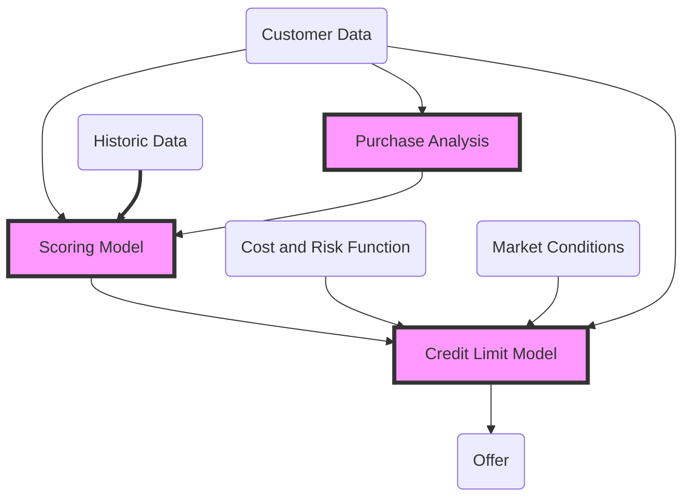
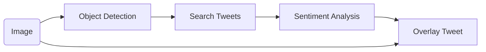
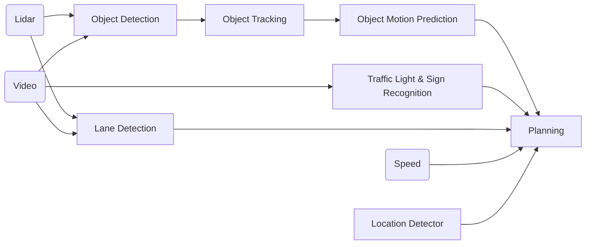
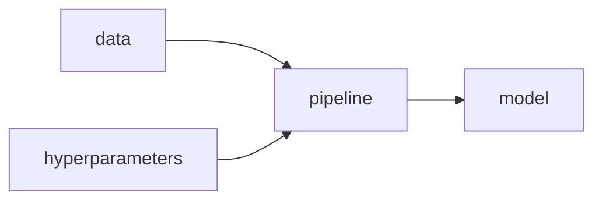
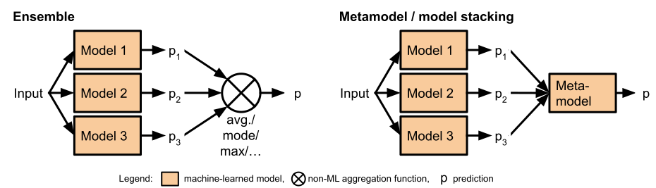
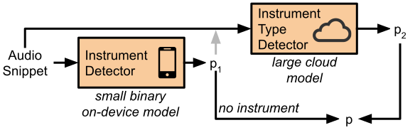
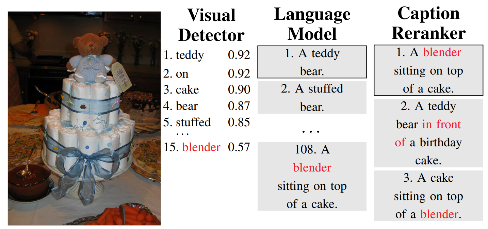
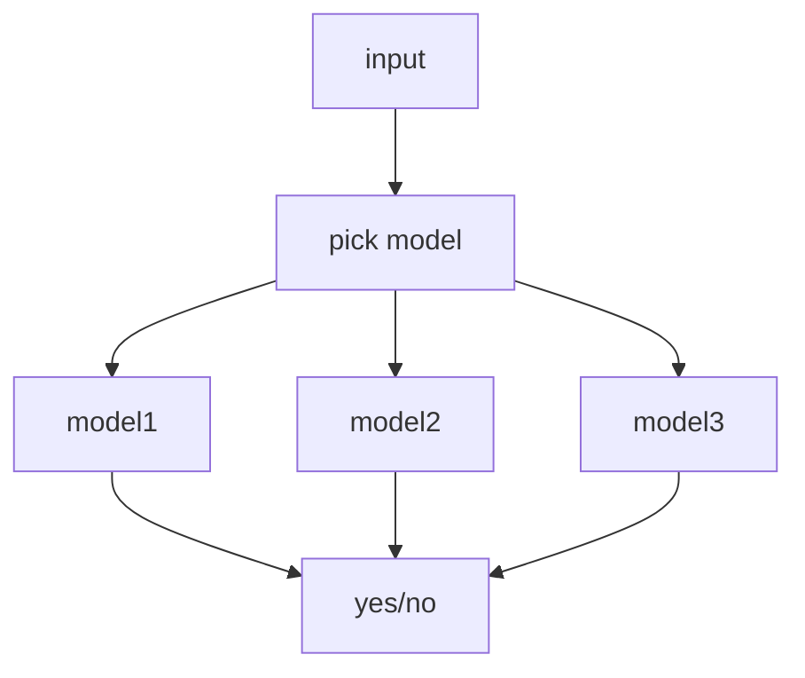
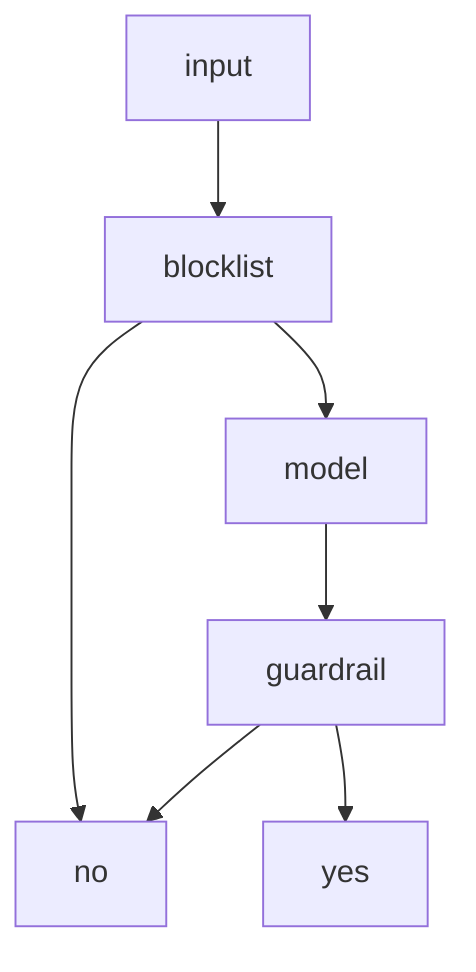

# Versioning, Provenance, and Reproducability

Christian Kaestner

<!-- references -->

Required reading: 🗎 Halevy, Alon, Flip Korn, Natalya F. Noy, Christopher Olston, Neoklis Polyzotis, Sudip Roy, and Steven Euijong Whang. [Goods: Organizing google's datasets](http://research.google.com/pubs/archive/45390.pdf). In Proceedings of the 2016 International Conference on Management of Data, pp. 795-806. ACM, 2016. and 
🕮 Hulten, Geoff. "[Building Intelligent Systems: A Guide to Machine Learning Engineering.](https://www.buildingintelligentsystems.com/)" Apress, 2018, Chapter 21 (Organizing Intelligence).

---

# Learning Goals

* Judge the importance of data provenance, reproducibility and explainability for a given system
* Create documentation for data dependencies and provenance in a given system
* Propose versioning strategies for data and models
* Design and test systems for reproducibility

---

# Case Study: Credit Scoring

----
<div class="tweet" data-src="https://twitter.com/dhh/status/1192540900393705474"></div>

----

<div class="tweet" data-src="https://twitter.com/dhh/status/1192945019230945280"></div>

----



----

## Debugging?

What went wrong? Where? How to fix?

<!-- discussion -->

----

## Debugging Questions beyond Interpretability

* Can we reproduce the problem?
* What were the inputs to the model?
* Which exact model version was used?
* What data was the model trained with?
* What learning code (cleaning, feature extraction, ML algorithm) was the model trained with?
* Where does the data come from? How was it processed and extracted?
* Were other models involved? Which version? Based on which data?
* What parts of the input are responsible for the (wrong) answer? How can we fix the model?


----
## Model Chaining: Automatic meme generator



Version all models involved.

<!-- references -->
Example adapted from Jon Peck. [Chaining machine learning models in production with Algorithmia](https://algorithmia.com/blog/chaining-machine-learning-models-in-production-with-algorithmia). Algorithmia blog, 2019

----
## Complex Model Composition: ML Models for Feature Extraction

*self driving car*



<!-- references -->
Example: Zong, W., Zhang, C., Wang, Z., Zhu, J., & Chen, Q. (2018). [Architecture design and implementation of an autonomous vehicle](https://ieeexplore.ieee.org/stamp/stamp.jsp?tp=&arnumber=8340798). IEEE access, 6, 21956-21970.


----

## Breakout Discussion: Movie Predictions

> Assume you are receiving complains that a child gets mostly recommendations about R-rated movies

In a group, discuss how you could address this in your own system and post to `#lecture`

* How could you identify the problematic recommendation(s)?
* How could you identify the model that caused the prediction?
* How could you identify the training code and data that learned the model?
* How could you identify what training data or infrastructure code "caused" the recommmendations?


<!-- references -->

K.G Orphanides. [Children's YouTube is still churning out blood, suicide and cannibalism](https://www.wired.co.uk/article/youtube-for-kids-videos-problems-algorithm-recommend). Wired UK, 2018

Kristie Bertucci. [16 NSFW Movies Streaming on Netflix](https://www.gadgetreview.com/16-nsfw-movies-streaming-on-netflix). Gadget Reviews, 2020


---

# Provenance Tracking

Historical record of data and its origin

----

## Data Provenance

* Track origin of all data
    - Collected where?
    - Modified by whom, when, why?
    - Extracted from what other data or model or algorithm?
* ML models often based on data drived from many sources through many steps, including other models


----
## Excursion: Provenance Tracking in Databases

* Whenever value is changed, record:
  - who changed it
  - time of change
  - history of previous values
  - possibly also justifcation of why
* Embedded as feature in some databases, can also be added in business logic
* Immutable data storage keeps history
* Possibly using cryptographic methods (e.g., signing documents and changes)


----

## Tracking Data Lineage

* Document all data sources
* Model dependencies and flows
* Ideally model all data and processing code
* Avoid "visibility debt"
* 
* Advanced: Use infrastructure to automatically capture/infer dependencies and flows (e.g., [Goods](http://research.google.com/pubs/archive/45390.pdf) paper)

----


<!-- references -->

(CC BY-SA 4.0, [Skamisetty](https://en.wikipedia.org/wiki/Data_lineage#/media/File:Map_Reduce_Job_-1.png))

----
## Feature Provenance

* How are features extracted from raw data
    - during training
    - during inference
* Has feature extraction changed since the model was trained?

**Example?**

----
## Good Practice: Feature Store

* Excapsulate feature extraction as functions
* Store centrally for reuse
* Use version control
* Use same feature code in training and inference code
*
* Advanced: Immutable features -- never change existing features, just add new ones (e.g., creditscore, creditscore2, creditscore3)


----
## Model Provenance

* How was the model trained?
* What data? What library? What hyperparameter? What code?
* Ensemble of multiple models?

----


----
## In Real Systems: Tracking Provenance Across Multiple Models

*automated meme generator*


<!-- references -->
Example adapted from Jon Peck. [Chaining machine learning models in production with Algorithmia](https://algorithmia.com/blog/chaining-machine-learning-models-in-production-with-algorithmia). Algorithmia blog, 2019

----
## Complex Model Composition: ML Models for Feature Extraction

*self driving car*


<!-- references -->
Example: Zong, W., Zhang, C., Wang, Z., Zhu, J., & Chen, Q. (2018). [Architecture design and implementation of an autonomous vehicle](https://ieeexplore.ieee.org/stamp/stamp.jsp?tp=&arnumber=8340798). IEEE access, 6, 21956-21970.


----
## Summary: Provenance

* Data provenance
* Feature provenance
* Model provenance


---
# Practical Data and Model Versioning

----
## How to Version Large Datasets?

<!-- discussion -->

(movie ratings, movie metadata, user data?)

----
## Recall: Event Sourcing

* Append only databases
* Record edit events, never mutate data
* Compute current state from all past events, can reconstruct old state
* For efficiency, take state snapshots
* Similar to traditional database logs

```text
createUser(id=5, name="Christian", dpt="SCS")
updateUser(id=5, dpt="ISR")
deleteUser(id=5)
```

----
## Versioning Datasets

* Store copies of entire datasets (like Git)
* Store deltas between datasets (like Mercurial)
* Offsets in append-only database (like Kafka offset)
* History of individual database records (e.g. S3 bucket versions)
    - some databases specifically track provenance (who has changed what entry when and how)
    - specialized data science tools eg [Hangar](https://github.com/tensorwerk/hangar-py) for tensor data
* Version pipeline to recreate derived datasets ("views", different formats)
    - e.g. version data before or after cleaning?
*
* Often in cloud storage, distributed
* Checksums often used to uniquely identify versions
* Version also metadata

----
## Aside: Git Internals


<!-- references -->

Scott Chacon and Ben Straub. [Pro Git](https://git-scm.com/book/en/v2/Git-Internals-Git-References). 2014

----
## Versioning Models

<!-- discussion -->

----
## Versioning Models

* Usually no meaningful delta, versioning as binary objects
* Any system to track versions of blobs

----
## Versioning Pipelines




----
## Versioning Dependencies

* Pipelines depend on many frameworks and libraries
* Ensure reproducable builds
    - Declare versioned dependencies from stable repository (e.g. requirements.txt + pip)
    - Optionally: commit all dependencies to repository ("vendoring")
* Optionally: Version entire environment (e.g. Docker container)
* Avoid floating versions
* Test build/pipeline on independent machine (container, CI server, ...)


----
## ML Versioning Tools (see MLOps)

* Tracking data, pipeline, and model versions
* Modeling pipelines: inputs and outputs and their versions
    - explicitly tracks how data is used and transformed
* Often tracking also metadata about versions
    - Accuracy
    - Training time
    - ...


----
## Example: DVC

```sh
dvc add images
dvc run -d images -o model.p cnn.py
dvc remote add myrepo s3://mybucket
dvc push
```

* Tracks models and datasets, built on Git
* Splits learning into steps, incrementalization
* Orchestrates learning in cloud resources


https://dvc.org/

----
## DVC Example

```yaml
stages:
  features:
    cmd: jupyter nbconvert --execute featurize.ipynb
    deps:
      - data/clean
    params:
      - levels.no
    outs:
      - features
    metrics:
      - performance.json
  training:
    desc: Train model with Python
    cmd:
      - pip install -r requirements.txt
      - python train.py --out ${model_file}
    deps:
      - requirements.txt
      - train.py
      - features
    outs:
      - ${model_file}:
          desc: My model description
    plots:
      - logs.csv:
          x: epoch
          x_label: Epoch
    meta: 'For deployment'
    # User metadata and comments are supported
```


----
## MLflow, ModelDB, Neptune, TensorBoard, Weights & Biases, Comet.ml

* Instrument pipeline with *logging* statements
* Track individual runs, hyperparameters used, evaluation results, and model files


<!-- references -->

Matei Zaharia. [Introducing MLflow: an Open Source Machine Learning Platform](https://databricks.com/blog/2018/06/05/introducing-mlflow-an-open-source-machine-learning-platform.html), 2018


----
## ModelDB Example

```python
from verta import Client
client = Client("http://localhost:3000")

proj = client.set_project("My first ModelDB project")
expt = client.set_experiment("Default Experiment")

# log the first run
run = client.set_experiment_run("First Run")
run.log_hyperparameters({"regularization" : 0.5})
run.log_dataset_version("training_and_testing_data", dataset_version)
model1 = # ... model training code goes here
run.log_metric('accuracy', accuracy(model1, validationData))
run.log_model(model1)

# log the second run
run = client.set_experiment_run("Second Run")
run.log_hyperparameters({"regularization" : 0.8})
run.log_dataset_version("training_and_testing_data", dataset_version)
model2 = # ... model training code goes here
run.log_metric('accuracy', accuracy(model2, validationData))
run.log_model(model2)
```

----
## Google's Goods

* Automatically derive data dependencies from system log files
* Track metadata for each table
* No manual tracking/dependency declarations needed
* 
* Requires homogeneous infrastructure
* Similar systems for tracking inside databases, MapReduce, Sparks, etc.

----
## Aside: Versioning in Notebooks with Verdant

* Data scientists usually do not version notebooks frequently
* Exploratory workflow, copy paste, regular cleaning

<iframe width="560" height="315" src="https://www.youtube.com/embed/LFYmYT7HFSs?start=308" frameborder="0" allow="accelerometer; autoplay; encrypted-media; gyroscope; picture-in-picture" allowfullscreen></iframe>

<!-- references -->
Further reading: 
Kery, M. B., John, B. E., O'Flaherty, P., Horvath, A., & Myers, B. A. (2019, May). [Towards effective foraging by data scientists to find past analysis choices](http://www.cs.cmu.edu/~marmalade/papers/paper092-Kery-CHI2019.pdf). In Proceedings of the 2019 CHI Conference on Human Factors in Computing Systems (pp. 1-13).


----
## From Model Versioning to Deployment

* Decide which model version to run where
    - automated deployment and rollback (cf. canary releases)
    - Kubernetis, Cortex, BentoML, ...
* Track which prediction has been performed with which model version (logging)


----

## Logging and Audit Traces

* Version everything
* Record every model evaluation with model version
* Append only, backed up


**Key goal: If a customer complains about an interaction, can we reproduce the prediction with the right model? Can we debug the model's pipeline and data? Can we reproduce the model?**

```
<date>,<model>,<model version>,<feature inputs>,<output>
<date>,<model>,<model version>,<feature inputs>,<output>
<date>,<model>,<model version>,<feature inputs>,<output>
```


----
## Logging for Composed Models


*Ensure all predictions are logged*


----

## Breakout Discussion: Movie Predictions (Revisited)

> Assume you are receiving complains that a child gets mostly recommendations about R-rated movies

Discuss again, updating the previous post in `#lecture`:

* How would you identify the model that caused the prediction?
* How would you identify the code and dependencies that trained the model?
* How would you identify the training data used for that model?


<!-- references -->

K.G Orphanides. [Children's YouTube is still churning out blood, suicide and cannibalism](https://www.wired.co.uk/article/youtube-for-kids-videos-problems-algorithm-recommend). Wired UK, 2018

Kristie Bertucci. [16 NSFW Movies Streaming on Netflix](https://www.gadgetreview.com/16-nsfw-movies-streaming-on-netflix). Gadget Reviews, 2020


---
# Reproducability

----
## Definitions

* **Reproducibility:** the ability of an experiment to be repeated with minor differences from the original
experiment, while achieving the same qualitative result
* **Replicability:** ability to reproduce results exactly,
achieving the same quantitative result; requires determinism
* 
* In science, reproducing results under different conditions are valuable to gain confidence
    - "conceptual replication": evaluate same hypothesis with different experimental procedure or population
    - many different forms distinguished "_..._ replication" (e.g. close, direct, exact, independent, literal, nonexperiemental, partial, retest, sequential, statistical, varied, virtual)

<!-- references -->

Juristo, Natalia, and Omar S. Gómez. "[Replication of software engineering experiments](https://www.researchgate.net/profile/Omar_S_Gomez/publication/221051163_Replication_of_Software_Engineering_Experiments/links/5483c83c0cf25dbd59eb1038/Replication-of-Software-Engineering-Experiments.pdf)." In Empirical software engineering and verification, pp. 60-88. Springer, Berlin, Heidelberg, 2010.

----
## Reproducibility of Notebooks
<!-- smallish -->

* 2019 Study of 1.4M notebooks on GitHub:
	- 21% had unexecuted cells
	- 36% executed cells out of order
	- 14% declare dependencies
	- success rate for installing dependencies <40% (version issues, missing files)
	- notebook execution failed with exception in >40% (often ImportError, NameError, FileNotFoundError)
	- only 24% finished execution without problem, of those 75% produced different results
* 2020 Study of 936 executable notebooks:
	- 40% produce different results due to nondeterminism (randomness without seed)
	- 12% due to time and date
	- 51% due to plots (different library version, API misuse)
	- 2% external inputs (e.g. Weather API)
	- 27% execution environment (e.g., Python package versions)


<!-- references -->
Pimentel, João Felipe, Leonardo Murta, Vanessa Braganholo, and Juliana Freire. "A large-scale study about quality and reproducibility of jupyter notebooks." In 2019 IEEE/ACM 16th International Conference on Mining Software Repositories (MSR), pp. 507-517. IEEE, 2019.

Wang, Jiawei, K. U. O. Tzu-Yang, Li Li, and Andreas Zeller. "Assessing and restoring reproducibility of Jupyter notebooks." In 2020 35th IEEE/ACM international conference on automated software engineering (ASE), pp. 138-149. IEEE, 2020.

----
## Practical Reproducability

* Ability to generate the same research results or predictions 
* Recreate model from data
* Requires versioning of data and pipeline (incl. hyperparameters and dependencies)


----
## Nondeterminism

* Model inference almost always deterministic for a given model
* Some machine learning algorithms are nondeterministic
    - Nondeterminism in neural networks initialized from random initial weights
    - Nondeterminism from distributed learning
    - Nondeterminism in random forest algorithms
    - Determinism in linear regression and decision trees
* Many notebooks and pipelines contain nondeterminism
  - Depend on snapshot of online data (e.g., stream)
  - Depend on current time
  - Initialize random seed
  - Different memory addresses for figures
* Different library versions installed on the machine may affect results


----
## Recommendations for Reproducibility

* Version pipeline and data (see above)
* Document each step   
    - document intention and assumptions of the process (not just results)
    - e.g., document why data is cleaned a certain way
    - e.g., document why certain parameters chosen
* Ensure determinism of pipeline steps (-> test)
* Modularize and test the pipeline
* Containerize infrastructure -- see MLOps


---

# Debugging and Fixing Models

<!-- references -->

See also Hulten. Building Intelligent Systems. Chapter 21

See also Nushi, Besmira, Ece Kamar, Eric Horvitz, and Donald Kossmann. "[On human intellect and machine failures: troubleshooting integrative machine learning systems](http://erichorvitz.com/human_repair_AI_pipeline.pdf)." In *Proceedings of the Thirty-First AAAI Conference on Artificial Intelligence*, pp. 1017-1025. 2017.


----
## Recall: Composing Models: Ensemble and metamodels


<!-- .element: class="plain" -->

----
## Recall: Composing Models: Decomposing the problem, sequential


<!-- .element: class="plain" -->

----
## Recall: Composing Models: Cascade/two-phase prediction


<!-- .element: class="plain" -->


----
## Decomposing the Image Captioning Problem?


Note: Using insights of how humans reason: Captions contain important objects in the image and their relations. Captions follow typical language/grammatical structure

----
## State of the Art Decomposition (in 2015)


<!-- .element: class="plain" -->

<!-- references -->
Example and image from: Nushi, Besmira, Ece Kamar, Eric Horvitz, and Donald Kossmann. "[On human intellect and machine failures: troubleshooting integrative machine learning systems](http://erichorvitz.com/human_repair_AI_pipeline.pdf)." In Proc. AAAI. 2017.


----
## Blame assignment?



<!-- references -->
Example and image from: Nushi, Besmira, Ece Kamar, Eric Horvitz, and Donald Kossmann. "[On human intellect and machine failures: troubleshooting integrative machine learning systems](http://erichorvitz.com/human_repair_AI_pipeline.pdf)." In Proc. AAAI. 2017.

----
## Nonmonotonic errors


<!-- references -->
Example and image from: Nushi, Besmira, Ece Kamar, Eric Horvitz, and Donald Kossmann. "[On human intellect and machine failures: troubleshooting integrative machine learning systems](http://erichorvitz.com/human_repair_AI_pipeline.pdf)." In Proc. AAAI. 2017.


----

## Chasing Bugs

* Update, clean, add, remove data
* Change modeling parameters
* Add regression tests
* Fixing one problem may lead to others, recognizable only later

----

## Partitioning Contexts

* Separate models for different subpopulations
* Potentially used to address fairness issues
* ML approaches typically partition internally already

<!-- split -->


----

## Overrides

* Hardcoded heuristics (usually created and maintained by humans) for special cases
* Blocklists, guardrails
* Potential neverending attempt to fix special cases
<!-- split -->


 

----
## Ideas?

<!-- discussion -->


---
# Summary

* Provenance is important for debugging and accountability
* Data provenance, feature provenance, model provenance
* Reproducability vs replicability
* Version everything
    - Strategies for data versioning at scale
    - Version the entire pipeline and dependencies
    - Adopt a pipeline view, modularize, automate
    - Containers and MLOps, many tools
* Strategies to fix models


