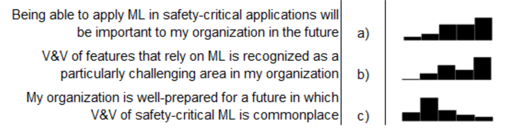
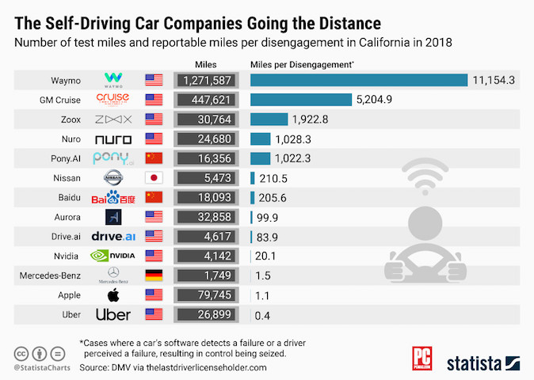
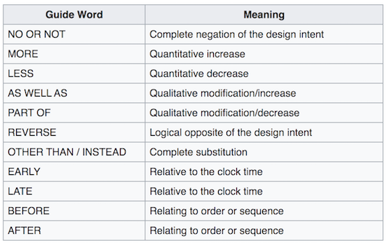
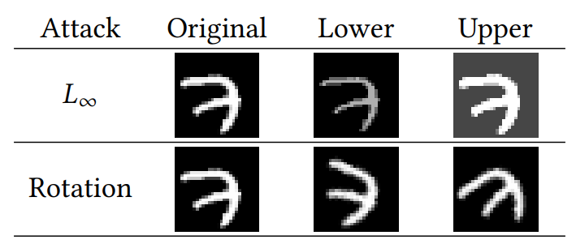
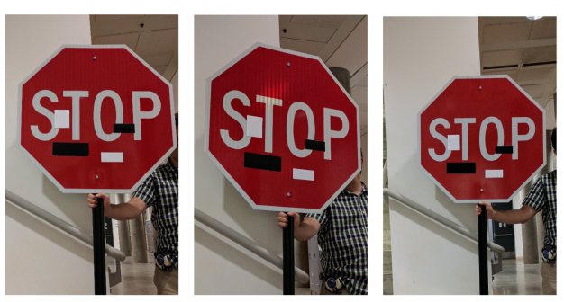
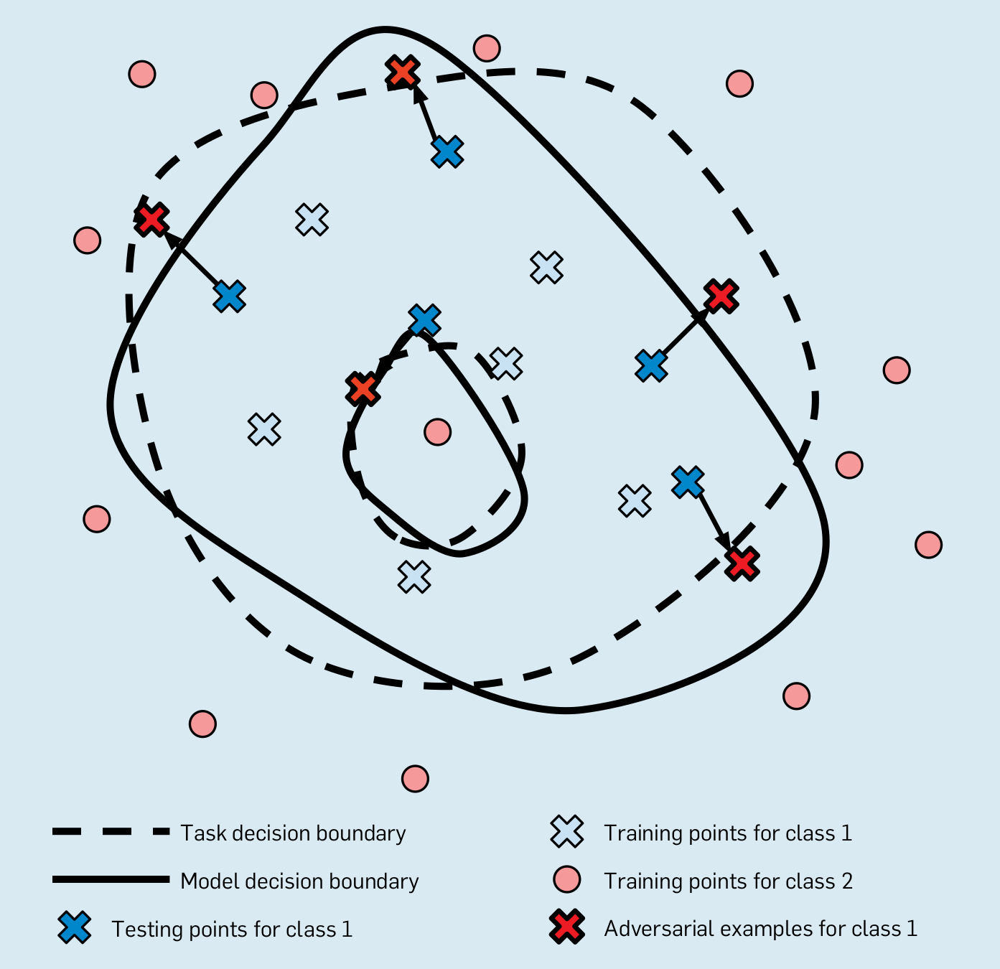
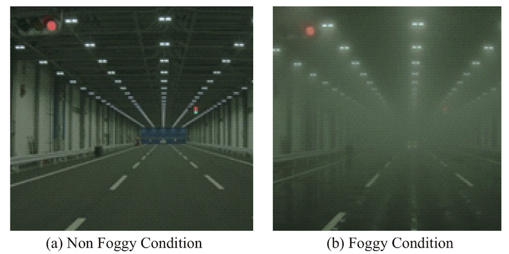
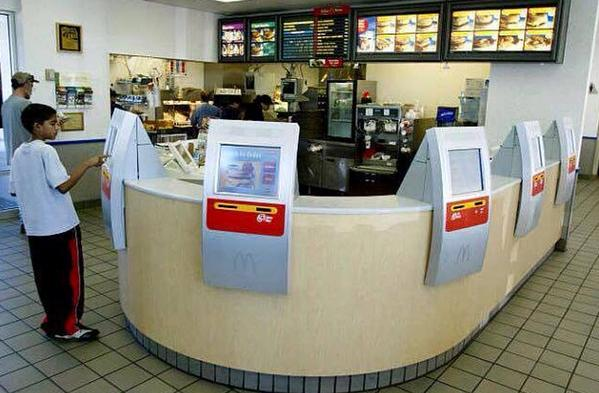

# Safety

Eunsuk Kang

<!-- references -->

Required
Reading: [Practical Solutions for Machine Learning Safety in Autonomous Vehicles](http://ceur-ws.org/Vol-2560/paper40.pdf).
S. Mohseni et al., SafeAI Workshop@AAAI (2020).

---
# Learning Goals

* Understand safety concerns in traditional and AI-enabled systems
* Apply hazard analysis to identify risks and requirements and understand their limitations
* Discuss ways to design systems to be safe against potential failures 
* Suggest safety assurance strategies for a specific project
* Describe the typical processes for safety evaluations and their limitations

---
# Security

## (Picking up from last lecture)

----
## ML Attacker Goal

* Confidentiality attacks: Exposure of sensitive data
  * Infer a sensitive label for a data point (e.g., hospital record)
* Integrity attacks: Unauthorized modification of data
  * Induce a model to misclassify data points from one class to another
  * e.g., Spam filter: Classify a spam as a non-spam
* Availability attacks: Disruption to critical services
  * Reduce the accuracy of a model
  * Induce a model to misclassify many data points

----
## ML Attacks


* Attacker knowledge: Does the attacker have access to the model?
  * Training data? Learning algorithm used? Parameters?
* Attacker actions:
  * Training time: __Poisoning attacks__
  * Inference time: __Evasion attacks__, __model inversion attacks__

<!-- references -->
_Understanding Machine Learning_, Bhogavalli (2019)

----
## Model Inversion: Confidentiality


* Given a model output (e.g., name of a person), infer the
corresponding, potentially sensitive input (facial image of the
person)
* One method: Gradient descent on input space
  * Assumes that the model produces a confidence score for prediction
  * Start with a random input vector & iterate towards input values
    with higher confidence level

<!-- references -->

_Model Inversion Attacks that Exploit Confidence Information and Basic
Countermeasures_, M. Fredrikson et al. in CCS (2015).

----
## Defense against Model Inversion Attacks


* Limit attacker access to confidence scores
  * e.g., reduce the precision of the scores by rounding them off
  * But also reduces the utility of legitimate use of these scores!
* Differential privacy in ML
	* Limit what attacker can learn about the model (e.g., parameters)
      based on an individual training sample
	* Achieved by adding noise to input or output (e.g., DP-SGD)
	* More noise => higher privacy, but also lower model accuracy!

<!-- references -->

_Biscotti: A Ledger for Private and Secure Peer-to-Peer Machine
Learning_, M. Shayan et al., arXiv:1811.09904 (2018).


----
## State of ML Security


* On-going arms race (mostly among researchers)
  <!-- .element: class="fragment" -->
  * Defenses proposed & quickly broken by noble attacks
* Assume ML component is likely vulnerable
  <!-- .element: class="fragment" -->
  * Design your system to minimize impact of an attack
* Remember: There may be easier ways to compromise system
  <!-- .element: class="fragment" -->
  * e.g., poor security misconfiguration (default password), lack of
    encryption, code vulnerabilities, etc., 

----
## Security Mindset


* Assume that all components may be compromised at one point or
another
* Don't assume users will behave as expected; assume all inputs to the system as potentially malicious
* Aim for risk minimization, not perfect security; reduce the chance of catastrophic
failures from attacks


----
## Secure Design Principles for ML

* Principle of least privilege
  * Who has access to training data, model internal, system input &
  output, etc.,?
  * Does any user/stakeholder have more access than necessary?
	* If so, limit access by using authentication mechanisms


----
## Secure Design Principles for ML

* Principle of least privilege
  * Who has access to training data, model internal, system input &
  output, etc.,?
  * Does any user/stakeholder have more access than necessary?
	* If so, limit access by using authentication mechanisms
* Isolation & compartmentalization
<!-- .element: class="fragment" -->
	* Can a security attack on one ML component (e.g., misclassification)
  adversely affect other parts of the system?
	  * If so, compartmentalize or build in mechanisms to limit
        impact (see [risk mitigation strategies](https://ckaestne.github.io/seai/F2020/slides/09_risks_ii/risks_ii.html#/3))
* Monitoring & detection:
<!-- .element: class="fragment" -->
  * Look for odd shifts in the dataset and clean the data if needed (for poisoning attacks)
  * Assume all system input as potentially malicious & sanitize
    (evasion attacks)


---
# Safety

----
## Defining Safety

* Prevention of a system failure or malfunction that results in:
  <!-- .element: class="fragment" -->
  * Death or serious injury to people
  * Loss or severe damage to equipment/property
  * Harm to the environment or society
* Safety is a system concept
   <!-- .element: class="fragment" -->
  * Can't talk about software being "safe"/"unsafe" on its own
  * Safety is defined in terms of its effect on the **environment**
+ Safety != Reliability
   <!-- .element: class="fragment" -->
   * Can build safe systems from unreliable components (e.g. redundancies)
   * Reliable components may be unsafe (e.g. stronger gas tank causes more severe damage in incident)

----
## Safety of AI-Enabled Systems

<div class="tweet" data-src="https://twitter.com/skoops/status/1065700195776847872"></div>

----
## Safety of AI-Enabled Systems

<div class="tweet" data-src="https://twitter.com/EmilyEAckerman/status/1186363305851576321"></div>

----
## Safety is a broad concept

* Not just physical harms/injuries to people
* Includes harm to mental health
* Includes polluting the environment, including noise pollution
* Includes harm to society, e.g. poverty, polarization

<!-- ---- -->
<!-- ## Safety Challenge widely Recognized -->

<!--  -->

<!-- (survey among automotive engineers) -->

<!-- <\!-- references -\-> -->
<!-- Borg, Markus, et al. "[Safely entering the deep: A review of verification and validation for machine learning and a challenge elicitation in the automotive industry](https://arxiv.org/pdf/1812.05389)." arXiv preprint arXiv:1812.05389 (2018). -->


----
## Case Study: Self-Driving Car


----
## How did traditional vehicles become safe?


* National Traffic & Motor Safety Act (1966): Mandatory design changes (head rests, shatter-resistant windshields, safety belts); road improvements (center lines, reflectors, guardrails)

----
## Autonomous Vehicles: What's different?


* In traditional vehicles, humans ultimately responsible for safety
  * Some safety features (lane keeping, emergency braking) designed to
  help & reduce risks
  * i.e., safety = human control + safety mechanisms
* Use of AI in autonomous vehicles: Perception, control, routing,
etc.,
  * Inductive training: No explicit requirements or design insights
  * __Can ML achieve safe design solely through lots of data?__

----
## Challenge: Edge/Unknown Cases


* Gaps in training data; ML will unlikely be able to cover all unknown cases
* __Why is this a unique problem for AI__? What about humans?

----
## Demonstrating Safety



__More miles tested => safer?__

----
## Approach for Demonstrating Safety

* Identify relevant hazards & safety requirements
* Identify potential root causes for hazards
* For each hazard, develop a mitigation strategy
* Provide evidence that mitigations are properly implemented


---
# Hazard Analysis

(system level!)

----
## What is Hazard Analysis?


* __Hazard__: A condition or event that may result in undesirable outcome
  * e.g., "Ego vehicle is in risk of a collision with another vehicle."
* __Safety requirement__: Intended to eliminate or reduce one or more hazards
  * "Ego vehicle must always maintain some minimum safe distance to the leading vehicle."
* __Hazard analysis__: Methods for identifying hazards & potential root causes 

----
## Recall: World vs Machine


Software is not unsafe on its own; the control signals it generates may be

Root of unsafety usually in wrong requirements & environmental assumptions

----
## Recall: Requirement vs Specification


* __REQ__: Ego vehicle must always maintain some minimum safe
distance to the leading vehicle. 
* __ENV__: Engine is working as intended; sensors are providing
  accurate information about the leading car (current speed, distance...)
* __SPEC__: Depending on the sensor readings, the controller must
  issue an actuator command to accelerate/decelerate the vehicle as needed.


----
## Review: Fault Tree Analysis (FTA)


* Top-down, __backward__ search method for root cause analysis
  * Start with a given hazard (top event), derive a set of components
    faults (basic events)
  * Compute minimum cutsets as potential root causes
  * __Q. But how do we identify relevant hazards in the first place?__

----
## Forward vs Backward Search


----
## Failure Mode and Effects Analysis (FMEA)


<!-- .element: class="stretch" -->

* A __forward search__ technique to identify potential hazards
* For each function, (1) enumerate possible _failure modes_ (2) possible safety impact (_effects_) and (3) mitigation strategies.
* Widely used in aeronautics, automotive, healthcare, food services,
  semiconductor processing, and (to some extent) software

----
## FMEA Example: Autonomous Vehicles


* [Architecture of the Apollo autonomous driving platform](https://github.com/ApolloAuto/apollo/blob/master/docs/specs/Apollo_3.0_Software_Architecture.md) 

----
## FMEA Example: Autonomous Vehicles

| Component | Failure Mode | Failure Effects | Detection | Mitigation |
|---|---|---|---|---|
| Perception | ? | ? | ? | ? |
| Perception | ? | ? | ? | ? |
| Lidar Sensor | Mechanical failure | Inability to detect objects | Monitor | Switch to manual control mode |
| ... | ... | ... | ... |  ... | 


----
## FMEA Example: Autonomous Vehicles

| Component | Failure Mode | Failure Effects | Detection | Mitigation |
|---|---|---|---|---|
| Perception | Failure to detect an object | Risk of collision | Human operator (if present) | Deploy secondary classifier |
| Perception | Detected but misclassified | " | " | " |
| Lidar Sensor | Mechanical failure | Inability to detect objects | Monitor | Switch to manual control mode |
| ... | ... | ... | ... |  ... | 

----
## Hazard and Operability Study (HAZOP)



* A __forward search__ method to identify potential hazards
* For each component, use a set of __guide words__ to generate
possible deviations from expected behavior
* Consider the impact of each generated deviation: Can it
  result in a system-level hazard?

----
## HAZOP Example: Emergency Braking (EB)


* Specification: EB must apply a maximum braking
command to the engine.
  * __NO OR NOT__: EB does not generate any braking command.
  * __LESS__: EB applies less than max. braking.
  * __LATE__: EB applies max. braking but after a delay of 2
  seconds.
  * __REVERSE__: EB generates an acceleration command instead of braking.
  * __BEFORE__: EB applies max. braking before a possible crash is detected.

----
## HAZOP Exercise: Autonomous Vehicles


* Architecture of the Apollo autonomous driving platform 

----
## HAZOP Exercise: Perception


* What is the specification of the perception component?
* Use HAZOP to answer:
  * What are possible deviations from the specification?
  * What are potential hazards resulting from these deviations?

----
## HAZOP: Benefits & Limitations


* Easy to use; encourages systematic reasoning about component faults
* Can be combined with FTA/FMEA to generate faults (i.e., basic
events in FTA)
* Potentially labor-intensive; relies on engineer's judgement
* Does not guarantee to find all hazards (but also true for other techniques)

----
## Remarks: Hazard Analysis

* None of these methods guarantee completeness
  * You may still be missing important hazards, failure modes
* Intended as structured approaches to thinking about failures
  * But cannot replace human expertise and experience
* When available, leverage prior domain knowledge 
  * __Safety standards__: A set of design and process guidelines for
    establishing safety
  * ISO 26262, ISO 21448, IEEE P700x, etc., 
  * Most do not consider AI; new standards being developed (e.g., UL
    4600)


---
# Model Robustness

----
## Defining Robustness:

* A prediction for $x$ is robust if the outcome is stable under minor perturbations of the input
  - $\forall x'. d(x, x')<\epsilon \Rightarrow f(x) = f(x')$
  - distance function $d$ and permissible distance $\epsilon$ depends on problem
* A model is robust if most predictions are robust

----
## Robustness and Distance for Images

+ slight rotation, stretching, or other transformations
+ change many pixels minimally (below human perception)
+ change only few pixels
+ change most pixels mostly uniformly, e.g., brightness



<!-- references -->
Image: [_An abstract domain for certifying neural networks_](https://dl.acm.org/doi/pdf/10.1145/3290354).
    Gagandeep et al., POPL (2019).
    
----
## Robustness in a Safety Setting

* Does the model reliably detect stop signs?
* Also in poor lighting? In fog? With a tilted camera? Sensor noise?
* With stickers taped to the sign? (adversarial attacks)



<!-- references -->

Image: David Silver. [Adversarial Traffic Signs](https://medium.com/self-driving-cars/adversarial-traffic-signs-fd16b7171906). Blog post, 2017

----
## No Model is Fully Robust

* Every useful model has at least one decision boundary (ideally at the real task decision boundary)
* Predictions near that boundary are not (and should not) be robust


<!-- ---- -->
<!-- ## Robustness of Interpretable Models -->


<!-- ``` -->
<!-- IF age between 18–20 and sex is male THEN predict arrest -->
<!-- ELSE  -->
<!-- IF age between 21–23 and 2–3 prior offenses THEN predict arrest -->
<!-- ELSE  -->
<!-- IF more than three priors THEN predict arrest -->
<!-- ELSE predict no arrest -->
<!-- ``` -->

<!-- <\!-- references -\-> -->

<!-- Rudin, Cynthia. "[Stop explaining black box machine learning models for high stakes decisions and use interpretable models instead](https://arxiv.org/abs/1811.10154)." Nature Machine Intelligence 1, no. 5 (2019): 206-215.   -->

----
## Task Decision Boundary vs Model Boundary

[](decisionboundary.png)
<!-- .element: class="stretch" -->

* Decision boundary: Ground truth; often unknown and not specifiable
* Model boundary: What the model learns; an approximation of decision boundary
* Often, learned & actual decision boundaries do not match!

<!-- references -->

From Goodfellow et al (2018). [Making machine learning robust against adversarial inputs](https://par.nsf.gov/servlets/purl/10111674). *Communications of the ACM*, *61*(7), 56-66. 


<!-- ---- -->
<!-- ## Robustness and Distance -->

<!-- * For text: -->
<!--   - insert words -->
<!--   - replace words with synonyms -->
<!--   - reorder text -->
<!-- * For tabular data: -->
<!--   - change values -->
<!--   - depending on feature extraction, small changes may have large effects -->
<!-- * ... -->
  
<!-- *note, not all changes may be feasible or realistic; some changes are obvious to humans* -->

<!-- *realistically, a defender will not anticipate all attacks and corresponding distances* -->

----
## Evaluating Robustness

* Lots of on-going research (especially for DNNs)
* Formal verification
  - Constraint solving or abstract interpretation over computations in neuron activations
  - Conservative abstraction, may label robust inputs as not robust
  - Currently not very scalable
  - Example: [_An abstract domain for certifying neural networks_](https://dl.acm.org/doi/pdf/10.1145/3290354).
    Gagandeep et al., POPL (2019).
* Sampling
  - Sample within distance, compare prediction to majority prediction
  - Probabilistic guarantees possible (with many queries, e.g., 100k)
  - Example:
    [_Certified adversarial robustness via randomized smoothing_](https://arxiv.org/abs/1902.02918). Cohen,
    Rosenfeld, and Kolter, ICML (2019).

----
## Improving Robustness for Safety


* Robustness checking at Inference time 
  - Handle inputs with non-robust predictions differently
    (e.g. discard or output low confidence score)
  - Downside: Significantly raises cost of prediction; may not be suitable
    for time-sensitive applications (e.g., self-driving cars)
* Design mechanisms
<!-- .element: class="fragment" -->
  - Deploy redundant components for critical tasks
  - Ensemble learning: Combine models with different biases
  - Multiple, independent sensors (e.g., lidar + radar + cameras)

----
## Improving Robustness for Safety



* Learning more robust models
  - Curate data for abnormal scenarios
    (e.g., fogs, snow, sensor noise)
  - Augment training data with transformed versions
    (but same label)
* Testing and debugging
  - Identify training data near model's decision boundary (i.e., is
    the model robust around all training data?)
  - Check robustness on test data

<!-- references -->
Image: _Automated driving recognition technologies for adverse weather
conditions._ Yoneda et al., IATSS Research (2019).

<!-- ---- -->
<!-- ## Improving Model Robustness -->

<!-- * Augment training data with transformed versions of training data (same label) or with identified adversaries -->
<!-- * Defensive distillation: Second model trained on "soft" labels of first  -->
<!-- * Input transformations: Learning and removing adversarial transformations -->
<!-- * Inserting noise into model to make adversarial search less effective, mask gradients -->
<!-- * Dimension reduction: Reduce opportunity to learn spurious decision boundaries -->
<!-- * Ensemble learning: Combine models with different biases -->
<!-- *  -->
<!-- * Lots of research claiming effectiveness and vulnerabilities of various strategies -->

<!-- <\!-- references -\-> -->
<!-- More details and papers: Rey Reza Wiyatno. [Securing machine learning models against adversarial attacks](https://www.elementai.com/news/2019/securing-machine-learning-models-against-adversarial-attacks). Element AI 2019 -->

<!-- ---- -->
<!-- ## Detecting Adversaries -->

<!-- * Adversarial Classification: Train a model to distinguish benign and adversarial inputs -->
<!-- * Distribution Matching: Detect inputs that are out of distribution -->
<!-- * Uncertainty Thresholds: Measuring uncertainty estimates in the model for an input -->

<!-- <\!-- references -\-> -->
<!-- More details and papers: Rey Reza Wiyatno. [Securing machine learning models against adversarial attacks](https://www.elementai.com/news/2019/securing-machine-learning-models-against-adversarial-attacks). Element AI 2019 -->


---
# Other AI Safety Concerns


 
<!-- references -->
Amodei, Dario, Chris Olah, Jacob Steinhardt, Paul Christiano, John Schulman, and Dan Mané. "[Concrete problems in AI safety](https://arxiv.org/pdf/1606.06565.pdf%20http://arxiv.org/abs/1606.06565)." arXiv preprint arXiv:1606.06565 (2016).

----
## Negative Side Effects

* AI is optimized for a specific objective/cost function
  * Inadvertently cause undesirable effects on the environment
  * e.g., [Transport robot](https://www.youtube.com/watch?v=JzlsvFN_5HI): Move a box to a specific destination
	* Side effects: Scratch furniture, bump into humans, etc.,
* Side effects may cause ethical/safety issues (e.g., social media
  example from the Ethics lecture)
* Again, **requirements** problem!
  * Recall: "World vs. machine"
  * Identify stakeholders in the environment & possible effects on them
* Modify the AI goal from "Perform Task X" to:
	* Perform X *subject to common-sense constraints on the
    environment*
	* Perform X *but avoid side effects to the extent
      possible*

<!-- references -->
Amodei, Dario, Chris Olah, Jacob Steinhardt, Paul Christiano, John Schulman, and Dan Mané. "[Concrete problems in AI safety](https://arxiv.org/pdf/1606.06565.pdf%20http://arxiv.org/abs/1606.06565)." arXiv preprint arXiv:1606.06565 (2016).

----
## Reward Hacking

> PlayFun algorithm pauses the game of Tetris indefinitely to avoid losing  

> When about to lose a hockey game, the PlayFun algorithm exploits a bug to make one of the players on the opposing team disappear from the map, thus forcing a draw.

> Self-driving car rewarded for speed learns to spin in circles  

[Example: Coast Runner](https://www.youtube.com/watch?v=tlOIHko8ySg)

----
## Reward Hacking

* AI can be good at finding loopholes to achieve a goal in unintended ways
* Technically correct, but does not follow *designer's informal intent*
* Many possible causes, incl. partially observed goals, abstract rewards, feedback loops
* In general, a very challenging problem!
  * Difficult to specify goal & reward function to avoid all
  possible hacks
  * Requires careful engineering and iterative reward design

<!-- references -->
Amodei, Dario, Chris Olah, Jacob Steinhardt, Paul Christiano, John Schulman, and Dan Mané. "[Concrete problems in AI safety](https://arxiv.org/pdf/1606.06565.pdf%20http://arxiv.org/abs/1606.06565)." arXiv preprint arXiv:1606.06565 (2016).

----
## Reward Hacking -- Many Examples

<div class="tweet" data-src="https://twitter.com/vkrakovna/status/980786258883612672"></div>

----
## Other Challenges

* Safe Exploration
  <!-- .element: class="fragment" -->
  - Exploratory actions "in production" may have consequences
  - e.g., trap robots, crash drones
  - -> Safety envelopes and other strategies to explore only in safe bounds (see also chaos engineering)
* Robustness to Drift
  <!-- .element: class="fragment" -->
  - Drift may lead to poor performance that may not even be recognized
  - -> Check training vs production distribution (see data quality lecture), change detection, anomaly detection
* Scalable Oversight
  <!-- .element: class="fragment" -->
  - Cannot provide human oversight over every action (or label all possible training data)
  - Use indirect proxies in telemetry to assess success/satisfaction
  - -> Semi-supervised learning? Distant supervision?

<!-- references -->
Amodei, Dario, Chris Olah, Jacob Steinhardt, Paul Christiano, John Schulman, and Dan Mané. "[Concrete problems in AI safety](https://arxiv.org/pdf/1606.06565.pdf%20http://arxiv.org/abs/1606.06565)." arXiv preprint arXiv:1606.06565 (2016).


---
# Designing for Safety

----
## Review: Elements of Safe Design

(See
[Mitigation Strategies](https://ckaestne.github.io/seai/F2020/slides/09_risks_ii/risks_ii.html#/3)
from the Lecture on Risks)

* __Assume__: Components will fail at some point
* __Goal__: Minimize the impact of failures
* __Detection__
  * Monitoring
* __Response__
  * Graceful degradation (fail-safe)
  * Redundancy (fail over)
* __Containment__
  * Decoupling & isolation

----
## Safety Assurance with ML Components

* Consider ML components as unreliable, at most probabilistic guarantees
* Testing, testing, testing (+ simulation)
  - Focus on data quality & robustness
* *Adopt a system-level perspective!*
* Consider safe system design with unreliable components
  - Traditional systems and safety engineering
  - Assurance cases
* Understand the problem and the hazards
  - System level, goals, hazard analysis, world vs machine
  - Specify *end-to-end system behavior* if feasible
* Recent research on adversarial learning and safety in reinforcement learning 


---
# Beyond Traditional Safety Critical Systems

----
## Beyond Traditional Safety Critical Systems

* Recall: Legal vs ethical
* Safety analysis not only for regulated domains (nuclear power plants, medical devices, planes, cars, ...)
* Many end-user applications have a safety component 

**Examples?**

<!-- discussion -->

----
## Twitter


Notes: What consequences should Twitter have foreseen? How should they intervene now that negative consequences of interaction patterns are becoming apparent?


----
## Mental Health

[](https://www.healthline.com/health-news/social-media-use-increases-depression-and-loneliness)

----
## IoT


----
## Addiction


<!-- .element: class="stretch" -->

Notes: Infinite scroll in applications removes the natural breaking point at pagination where one might reflect and stop use.

----
## Addiction

[](https://marker.medium.com/robinhood-has-gamified-online-trading-into-an-addiction-cc1d7d989b0c)


----
## Society: Unemployment Engineering / Deskilling



Notes: The dangers and risks of automating jobs.

Discuss issues around automated truck driving and the role of jobs.

See for example: Andrew Yang. The War on Normal People. 2019


----
## Society: Polarization

[](https://www.wsj.com/articles/facebook-knows-it-encourages-division-top-executives-nixed-solutions-11590507499)
<!-- .element: class="stretch" -->


Notes: Recommendations for further readings: https://www.nytimes.com/column/kara-swisher, https://podcasts.apple.com/us/podcast/recode-decode/id1011668648

Also isolation, Cambridge Analytica, collaboration with ICE, ...

----
## Environmental: Energy Consumption

[](https://www.newscientist.com/article/2205779-creating-an-ai-can-be-five-times-worse-for-the-planet-than-a-car/)

----
## Exercise

*Look at apps on your phone. Which apps have a safety risk and use machine learning?*

Consider safety broadly: including stress, mental health, discrimination, and environment pollution

<!-- discussion -->


----
## Takeaway

* Many systems have safety concerns
* ... not just nuclear power plants, planes, cars, and medical devices
* Do the right thing, even without regulation
* Consider safety broadly: including stress, mental health, discrimination, and environment pollution
* Start with requirements and hazard analysis


---
# Summary

* *Adopt a safety mindset!*
* Defining safety: absence of harm to people, property, and environment
  - Beyond traditional safety critical systems, affects many apps and web services
* Assume all components will eventually fail in one way or another, especially ML components
* Hazard analysis to identify safety risks and requirements; classic
safety design at the system level
* AI goals are difficult to specify precisely; susceptible to negative
  side effect & reward hacking
* Model robustness can help with some problems
