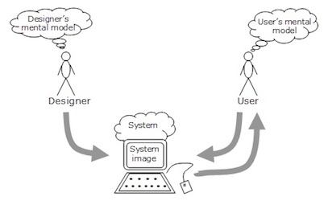
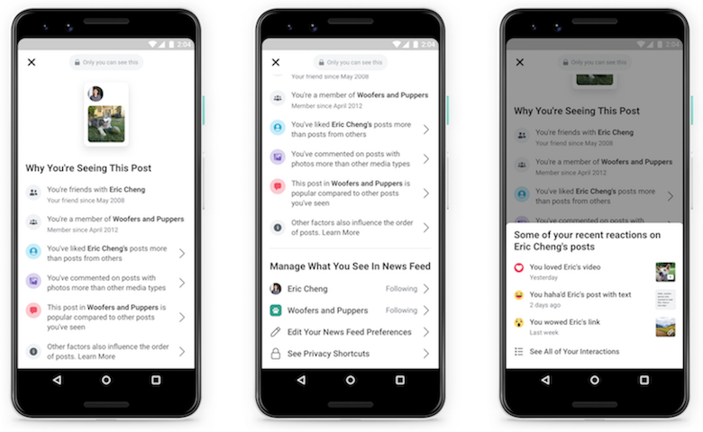
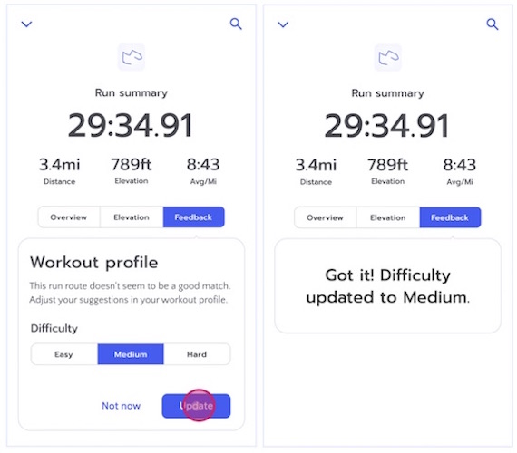

# Security

Eunsuk Kang

<!-- references -->

Required reading: Building Intelligent Systems by Geoff Hulten (2018),
Chapter 8.

---
# Learning Goals

* Understand key ingredients of usable experiences (UX)
* Discuss factors to consider when designing UX for AI-enabled systems

---
# Usability

----
##  Voice-Controlled Intelligent Assistants

https://www.nngroup.com/articles/intelligent-assistant-usability/

----
## Dimensions of Usability

* __Learnability__: How easy is it for users to accomplish tasks the first time?
* __Efficiency__: After learning, how efficiently can users perform the
  tasks?
* __Memorability__: Can users remember to perform the tasks after a period of
  not using the system?
* __Errors__: How often do users make errors, how severe are these errors, and how easily can they recover from the errors?
* __Satisfaction__: How pleasant is it to use the design?

<!-- references -->

https://www.nngroup.com/articles/usability-101-introduction-to-usability/

----
## Interaction Cost

* Mental + physical effort to perform a desired task
  * Reading, scrolling, clicking, typing, attention switch, memory load...
* __Goal of usable design__: Minimize interaction cost while allowing users to achieve
  their goals
* Q. What impact does AI have on interaction cost?

----
##  Voice-Controlled Intelligent Assistant

* Holy grail of UX design: Reduce interaction cost to zero
* Q. Is the cost actually smaller than in physical interfaces?

---
# Designing Usable Interfaces for AI

----
## Considerations for Usable AI Design

* User needs: Automate or augment?
* Mental model
* Error handling
* Feedback & control

----
## User Needs for AI

* Identify the tasks that the user wants to achieve
* For each task, decide between __automate vs. augment__
  * Is AI good for this particular task?
* Automate when:
  * User lacks knowledge/ability to perform the task (e.g., prediction)
  * Boring, repetitive, dangerous tasks
* Augment when:
  * High stakes & accountability needed
  * Difficult to communicate user's need to AI
  * User enjoys performing the task (e.g., driving)

----
##  User Needs for Intelligent Assistant

* What user needs are assistants designed to fulfill?
* Which of these are automated? Augmented?

----
## Mental Model

* What the user believes about the system
  * Plans actions based on the model
  * Belief, not facts: May not reflect the reality, only what
    user believes
* Challenge: Align system with the user's mental model
  * Mismatch between user's & designer's mental models
  * User's model may be preconceived based on prior experience
  * User's model may evolve over time

----
## Example: Shopping Cart Checkout 

1. Browse for items
2. Add items to cart
3. Choose checkout
4. Enter shipping & billing data
5. Press submit
6. Get confirmation

Mental model = A __linear__ sequence of familiar steps

----
## Breaking Mental Model

* Anti-pattern: Interrupt linear flow & bring user back to a 
  previous step
  * Create an account, open a new dialog to enter
    preferred address...
  * Breaks user's mental model => failure to convert into sales
* ~60% of customers abandon their shopping cart

<!-- references -->
https://baymard.com/blog/checkout-process-should-be-linear

----
## Mental Model for AI-Based Systems

* User: "What is the AI doing, and how do I use it?"
  * Typically less transparent than traditional applications
* Unclear inputs: What are possible actions? Which of these actions matter? When
    does my action take effect?
* Lack of control over output: Why am I being given these
  recommendations? Why is the output displayed in this order?

<!-- references -->
https://www.nngroup.com/articles/machine-learning-ux/

----
## Design Principles: Mental Model 

* Identify user's existing mental models
  * Find similar apps & identify common patterns
* Make the system conform to the user's mental model
  * Collect & analyze errors made by user
  * Do these point to a mismatch vs. user's mental model?
* Improve/adjust the user's mental model
  * Set user's expectations through onboarding 
  * Increase transparency and explain decisions made by AI

----
## Onboarding: Setting User's Expectations

* Be clear about what AI can(not) do
* Provide examples of how it works

----
## Explaining Decisions

* Explain how user's actions influence output

----
##  Mental Model for Intelligent Assistants?

* What can it do? What are its limitations?
* How do I get it to do/say  X?
* Why did it do/say Y instead of X? 

----
## Mental Model for Intelligent Assistants

* Reasons for failures:
  * (1) User doesn't know how to get AI to do X
  * (2) AI simply can't do X
* Users settle on simpler tasks over time; small improvements

----
## Failing to User's Expectations 

>“So, this week, I realized that I don't use my IA nearly as much as I thought I did. I do use it often. However it's very much normally the same like five things over and over again."

Poor UX design => User settles on a suboptimal mental model & fails to benefit from the full capabilities of AI.

<!-- references -->

https://www.nngroup.com/articles/mental-model-ai-assistants/

----
## Dealing with Errors

* Define errors & failures
  * User errors: Mistakes made by users (e.g., click on a wrong button)
  * System errors: Failure of a system to provide correct outcome
    (e.g., bad movie recommendation)
* Detect & record occurrences of errors
* Identify sources of errors
  * User errors: Mismatched mental model or poor UX design
  * System errors: Poor model accuracy, training data, etc.,
* Provide actionable error messages & guidelines

----
## Error Messages: Suggest user actions

* Guide the user towards ways to recover from/prevent further errors

<!--references -->

https://pair.withgoogle.com/chapter/errors-failing/

----
## Errors in Intelligent Assistants

* What errors are made by users? What are the sources of errors?
* Errors made by AI? Sources?

----
## Errors in Intelligent Assistants

> “...sometimes it says it does — like the reminders and the sending messages. It says it will do it. But then at the end we found that it didn’t really send the message.”

* How do we detect an error?
* How can we notify/guide the user when an error occurs?

<!-- references -->

https://www.nngroup.com/articles/mental-model-ai-assistants/

----
## Feedback and Control

* Implicit feedback: Data about user behaviors collected by system
  * e.g., times of day, duration of usage, 
    recommendations accepted/rejected, click patterns, etc.,
* Explicit feedback: Prompted or deliberately provided by user
  * Surveys, ratings, thumbs up, feedback forms, etc., 
* Design considerations for feedback
  * Align feedback with improving interactions (and AI)
  * Acknowledge user feedback & respond immediately 
* In addition to feedback, provide a way for user to adjust AI behavior

----
## Responding to Feedback 

* When possible, respond to feedback with an adjustment to AI behavior

<!-- references -->

https://pair.withgoogle.com/chapter/feedback-controls/

----
## Giving User Control 

* Provide mechanisms for user to adjust AI behavior

----
## Feedback & Control in Intelligent Assistants

* How do we collect user feedback? Implicit? Explicit?
* What kind of control do we provide to the user?

----
##  User Feedback in Intelligent Assistants

> "All of the things that even Siri herself said she could do — for example ‘I can send money via Venmo, just try and say this.’ I tried and it didn’t work, and maybe there are settings that I need to fix. But when those types of things happened, there was no button that said ‘Hey, in order to make this work in the future, click this and we’ll take you to the permissions or whatever’."

<!-- references -->
https://www.nngroup.com/articles/mental-model-ai-assistants/

---
# Summary

* Goal of usable design: Minimize interaction cost 
  * Automation does not necessarily imply reduced cost!
* UX design considerations for AI
  * User needs: Automate or augment?
  * Mental model: Explain to user what AI is doing
  * Dealing with errors: Guide user towards recovery & prevention
  * Feedback and control: Align user feedback with AI improvement
