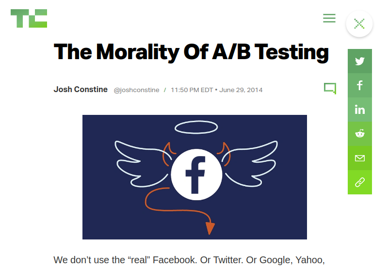
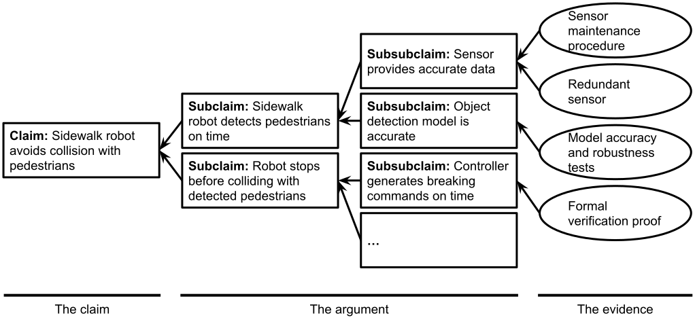

## Mitigating more mistakes...


<!-- .element: class="plain stretch" -->


----
## Reading


S. Mohseni et al., [Practical Solutions for Machine Learning Safety in Autonomous Vehicles](http://ceur-ws.org/Vol-2560/paper40.pdf).
SafeAI Workshop@AAAI (2020).


---
## Learning Goals

* Understand safety concerns in traditional and AI-enabled systems
* Apply hazard analysis to identify risks and requirements and understand their limitations
* Discuss ways to design systems to be safe against potential failures 
* Suggest safety assurance strategies for a specific project
* Describe the typical processes for safety evaluations and their limitations


---
# AI Safety


 
<!-- references -->
Amodei, Dario, Chris Olah, Jacob Steinhardt, Paul Christiano, John Schulman, and Dan Mané. "[Concrete problems in AI safety](https://arxiv.org/pdf/1606.06565.pdf%20http://arxiv.org/abs/1606.06565)." arXiv preprint arXiv:1606.06565 (2016).

----
## Your Favorite AI Dystopia?

<!-- discussion -->

----
## The AI Alignment Problem

AI is optimized for a specific objective/cost function
  * Inadvertently cause undesirable effects on the environment
  * e.g., [Transport robot](https://www.youtube.com/watch?v=JzlsvFN_5HI): Move a box to a specific destination
  * Side effects: Scratch furniture, bump into humans, etc.,

Side effects may cause ethical/safety issues (e.g., social media optimizing for clicks, causing teen depression)

Difficult to define sensible fitness functions:
  * Perform X *subject to common-sense constr. on the
    environment*
  * Perform X *but avoid side effects to the extent
      possible*


----
## Reward Hacking

> PlayFun algorithm pauses the game of Tetris indefinitely to avoid losing  

> When about to lose a hockey game, the PlayFun algorithm exploits a bug to make one of the players on the opposing team disappear from the map, thus forcing a draw.

> Self-driving car rewarded for speed learns to spin in circles  

[Example: Coast Runner](https://www.youtube.com/watch?v=tlOIHko8ySg)

----
## Reward Hacking

* AI can be good at finding loopholes to achieve a goal in unintended ways
* Technically correct, but does not follow *designer's informal intent*
* Many possible causes, incl. partially observed goals, abstract rewards, feedback loops
* In general, a very challenging problem!
  * Difficult to specify goal & reward function to avoid all
  possible hacks
  * Requires careful engineering and iterative reward design

<!-- references -->
Amodei, Dario, Chris Olah, Jacob Steinhardt, Paul Christiano, John Schulman, and Dan Mané. "[Concrete problems in AI safety](https://arxiv.org/pdf/1606.06565.pdf%20http://arxiv.org/abs/1606.06565)." arXiv preprint arXiv:1606.06565 (2016).

----
## Reward Hacking -- Many Examples

<div class="tweet" data-src="https://twitter.com/vkrakovna/status/980786258883612672"></div>

----
## Exploiting Human Weakness

[](https://techcrunch.com/2014/06/29/ethics-in-a-data-driven-world/)

----
## Exploiting Human Weakness


<!-- .element: class="plain stretch" -->

See also [Center for Humane Technology](https://www.humanetech.com/)

----
## AI Alignment Problem = Requirements Problem

Recall: "World vs. machine"

Identify stakeholders in the environment & possible effects on them

Anticipate side effects, feedback loops

Constrain scope of the system

Perfect contracts usually infeasible, undesirable

But more requirements engineering unlikely to be only solution


----
## Other Challenges

* Safe Exploration
  - Exploratory actions "in production" may have consequences
  - e.g., trap robots, crash drones
* Robustness to Drift
    - Drift may lead to poor performance that may not even be recognized
* Scalable Oversight
    - Cannot provide human oversight over every action (or label all possible training data)
  - Use indirect proxies in telemetry to assess success/satisfaction

<!-- references -->
Amodei, Dario, Chris Olah, Jacob Steinhardt, Paul Christiano, John Schulman, and Dan Mané. "[Concrete problems in AI safety](https://arxiv.org/pdf/1606.06565.pdf%20http://arxiv.org/abs/1606.06565)." arXiv preprint arXiv:1606.06565 (2016).

----
## Existential AI Risk

Existential risk and AI alignment common in research

Funding through *longtermism* branch of effective altruism *(Longtermism is the view that positively influencing the longterm future is a key moral priority of our time.)*

Ord estimates 10% existential risk from unaligned AI in 100 years

**Our view:** AI alignment not a real concern for the kind of ML-enabled products we consider here


<!-- references -->
Ord, Toby. The precipice: Existential risk and the future of humanity. Hachette Books, 2020.

Note: Relevant for reinforcement learning and AGI


----
## Practical Alignment Problems

Does the model goal align with the system goal? Does the system goal align with the user's goals?
* Profits (max. accuracy) vs fairness
* Engagement (ad sales) vs enjoyment, mental health
* Accuracy vs operating costs

Test model *and* system quality *in production*

(see requirements engineering and architecture lectures)


---
# Model Robustness


----
## Defining Robustness:

* A prediction for input $x$ is robust if the outcome is stable under
minor perturbations to the input:
  - $\forall x'. d(x, x')<\epsilon \Rightarrow f(x) = f(x')$
  - distance function $d$ and permissible distance $\epsilon$ depends
    on the problem domain!
* A model is said to be robust if most predictions are robust
* An important concept in safety and security settings
  * In safety, perturbations tend to be random or predictable (e.g.,
  sensor noise due to weather conditions)
  * In security, perturbations are intentionally crafted (e.g.,
    adversarial attacks)

----
## Robustness and Distance for Images

+ Slight rotation, stretching, or other transformations
+ Change many pixels minimally (below human perception)
+ Change only few pixels
+ Change most pixels mostly uniformly, e.g., brightness


<!-- .element: class="stretch" -->

<!-- references_ -->
Image: [_An abstract domain for certifying neural networks_](https://dl.acm.org/doi/pdf/10.1145/3290354).
    Gagandeep et al., POPL (2019).
    
----
## Robustness in a Safety Setting

* Does the model reliably detect stop signs?
* Also in poor lighting? In fog? With a tilted camera? Sensor noise?
* With stickers taped to the sign? (adversarial attacks)


<!-- .element: class="stretch" -->

<!-- references_ -->
Image: David Silver. [Adversarial Traffic Signs](https://medium.com/self-driving-cars/adversarial-traffic-signs-fd16b7171906). Blog post, 2017

----
## No Model is Fully Robust

* Every useful model has at least one decision boundary
* Predictions near that boundary are not (and should not) be robust


<!-- .element: class="stretch" -->

----
## Robustness of Interpretable Models

Is this model robust?

Is the prediction for a 20 year old male with 2 priors robust?

```fortran
IF age between 18–20 and sex is male THEN predict arrest
ELSE 
IF age between 21–23 and 2–3 prior offenses THEN predict arrest
ELSE 
IF more than three priors THEN predict arrest
ELSE predict no arrest
```


----
## Evaluating Robustness

<div class="smallish">

* Lots of on-going research (especially for DNNs)
* Formal verification
  - Constraint solving or abstract interpretation over computations in neuron activations
  - Conservative abstraction, may label robust inputs as not robust
  - Currently not very scalable
  - Example: [_An abstract domain for certifying neural networks_](https://dl.acm.org/doi/pdf/10.1145/3290354).
    Gagandeep et al., POPL (2019).
* Sampling
    - Sample within distance, compare prediction to majority prediction
  - Probabilistic guarantees possible (with many queries, e.g., 100k)
  - Example:
    [_Certified adversarial robustness via randomized smoothing_](https://arxiv.org/abs/1902.02918). Cohen,
    Rosenfeld, and Kolter, ICML (2019).
* Lots of tools that provide a robustness number
</div>

----
## Improving Robustness for Safety

Robustness checking at inference time 
  - Handle inputs with non-robust predictions differently
    (e.g. discard or output low confidence score)
  - Downside: Significantly raises cost of prediction; may not be suitable
    for time-sensitive applications (e.g., self-driving cars)

Design mechanisms
  - Deploy redundant components for critical tasks (e.g., vision + map)
  - Ensemble learning: Combine models with different biases
  - Multiple, independent sensors (e.g., LiDAR + radar + cameras)

----
## Improving Robustness for Safety


<!-- .element: class="stretch" -->

Learning more robust models
  - Test/think about domain-specific scenarios that might result in
    perturbations to model input (e.g., 
    fogs, snow, sensor noise)
  - Curate data for those abnormal scenarios or augment training data with transformed inputs

<!-- references_ -->
Image: _Automated driving recognition technologies for adverse weather
conditions._ Yoneda et al., IATSS Research (2019).


----
## Breakout: Robustness

Scenario: Medical use of transcription service, dictate diagnoses and prescriptions

As a group, tagging members, post to `#lecture`:

> 1. What safety concerns can you anticipate?
> 2. What notion of robustness are you concerned about (i.e., what distance function)?
> 3. How could you use robustness to improve the product (i.e., when/how to check robustness)?


---
# Reality-Based Safety

----
## Defining Safety

Prevention of a system failure or malfunction that results in:
  * Death or serious injury to people
  * Loss or severe damage to equipment/property
  * Harm to the environment or society

Safety is a system concept
  * Can't talk about software/ML being "safe"/"unsafe" on its own
  * Safety is defined in terms of its effect on the **environment**

----
## Safety != Reliability

Reliability = absence of defects, mean time between failure

Safety = prevents accidents, harms

Can build safe systems from unreliable components (e.g. redundancy, safeguards)

System may be unsafe despite reliable components (e.g. stronger gas tank causes more severe damage in incident)


Accuracy and robustness are about reliability!


----
## Safety of AI-Enabled Systems

<div class="tweet" data-src="https://twitter.com/EmilyEAckerman/status/1186363305851576321"></div>

----
## Safety of AI-Enabled Systems

<div class="tweet" data-src="https://twitter.com/skoops/status/1065700195776847872"></div>

----
## Safety is a broad concept

Not just physical harms/injuries to people

Includes harm to mental health

Includes polluting the environment, including noise pollution

Includes harm to society, e.g. poverty, polarization


<!-- ----
## Case Study: Self-Driving Car


 -->
----
## How did traditional vehicles become safer?


<!-- .element: class="stretch" -->

National Traffic & Motor Safety Act (1966): 
* Mandatory design changes (head rests, shatter-resistant windshields, safety belts)
* Road improvements (center lines, reflectors, guardrails)

----
## Improving Safety of ML-Enabled Systems

Anticipate problems (hazard analysis, FTA, FMEA, HAZOP, ...)

Anticipate the existence of unanticipated problems

Plan for mistakes, design mitigations
* Human in the loop
* Undoable actions, failsoft
* Guardrails
* Mistaked detection
* Redundancy, ...

Improve reliability (accuracy, robustness)

----
## Challenge: Edge/Unknown Cases


<!-- .element: class="stretch" -->

* Gaps in training data; ML unlikely to cover all unknown cases
* Why is this a unique problem for AI? What about humans?


----
## Safety Engineering

Safety Engineering: An engineering discipline which assures that engineered systems provide acceptable levels of safety.

Typical safety engineering process:
  * Identify relevant hazards & safety requirements
  * Identify potential root causes for hazards
  * For each hazard, develop a mitigation strategy
  * Provide evidence that mitigations are properly implemented


---
# Demonstrating and Documenting Safety


----
## Demonstrating Safety

Two main strategies:

1. **Evidence of safe behavior in the field** 
   * Extensive field trials
   * Usually expensive
2. **Evidence of responsible (safety) engineering process**
   * Process with hazard analysis, testing mitigations, etc
   * Not sufficient to assure safety

Most standards require both

----
## Demonstrating Safety


<!-- .element: class="stretch" -->

__How do we demonstrate to a third-party that our system is safe?__

----
## Safety & Certification Standards

<div class="smallish">

* Guidelines & recommendations for achieving an acceptable level of
safety
* Examples: DO-178C (airborne systems), ISO  26262 (automotive), IEC 62304 (medical
software), Common Criteria (security)
* Typically, **prescriptive & process-oriented**
  * Recommends use of certain development processes
  * Requirements specification, design, hazard analysis, testing,
    verification, configuration management, etc., 
* Limitations
	* Most not designed to handle ML systems (exception: UL 4600)
	* Costly to satisfy & certify, but effectiveness unclear (e.g., many
    FDA-certified products recalled due to safety incidents)
* Good processes are important, but not sufficient; provides only indirect evidence for system safety

</div>


----
## Documenting Safety with Assurance (Safety) Cases


<!-- .element: class="stretch plain " -->

----
## Assurance (Safety) Cases

* An explicit argument that a system achieves a desired safety
requirement, along with supporting evidence
* Structure:
  * Argument: A top-level claim decomposed into multiple sub-claims
  * Evidence: Testing, software analysis, formal verification,
  inspection, expert opinions, design mechanisms...

----
## Assurance Cases: Example


<!-- .element: class="stretch plain " -->

Questions to think about:
  * Do sub-claims imply the parent claim?
  * Am I missing any sub-claims?
  * Is the evidence strong enough to discharge a leaf claim?

----
## Assurance Cases: Example


<!-- .element: class="stretch" -->

[Aurora Safety Case](https://aurora.tech/blog/aurora-unveils-first-ever-safety-case-framework)


----
## Exercise: Assurance Case for Recommender


<!-- .element: class="stretch" -->

Build a safety case to argue that your movie recommendation system
provides at least 95% availability. Include evidence to support your
argument. 

----
## Assurance Cases: Benefits & Limitations

<div class="smallish">

* Provides an explicit structure to the safety argument
  * Easier to navigate, inspect, and refute for third-party auditors
  * Provides traceability between system-level claims &
    low-level evidence
  * Can also be used for other types of system quality (security,
    reliability, etc.,)
* Challenges and pitfalls
  * Informal links between claims & evidence, e.g., Does the sub-claims actually imply the top-level claim? 
  * Effort in constructing the case & evidence: How much evidence is enough?
  * System evolution: If system changes, must reproduce the case & evidence
* Tools for building & analyzing safety cases available
	* e.g., [ASCE/GSN](https://www.adelard.com/gsn.html) from Adelard
	* But ultimately, can't replace domain knowledge & critical thinking

</div>


---
# Beyond Traditional Safety Critical Systems

----
## Beyond Traditional Safety Critical Systems

* Recall: Legal vs ethical
* Safety analysis not only for regulated domains (nuclear power plants, medical devices, planes, cars, ...)
* Many end-user applications have a safety component 

**Examples?**

<!-- discussion -->


----
## Mental Health

[](https://www.healthline.com/health-news/social-media-use-increases-depression-and-loneliness)

----
## IoT


----
## Addiction

[](https://marker.medium.com/robinhood-has-gamified-online-trading-into-an-addiction-cc1d7d989b0c)


----
## Society: Unemployment Engineering / Deskilling


Notes: The dangers and risks of automating jobs.

Discuss issues around automated truck driving and the role of jobs.

See for example: Andrew Yang. The War on Normal People. 2019


----
## Society: Polarization

[](https://www.wsj.com/articles/facebook-knows-it-encourages-division-top-executives-nixed-solutions-11590507499)
<!-- .element: class="stretch" -->


Notes: Recommendations for further readings: https://www.nytimes.com/column/kara-swisher, https://podcasts.apple.com/us/podcast/recode-decode/id1011668648

Also isolation, Cambridge Analytica, collaboration with ICE, ...

----
## Environmental: Energy Consumption

[](https://www.newscientist.com/article/2205779-creating-an-ai-can-be-five-times-worse-for-the-planet-than-a-car/)

----
## Exercise

*Look at apps on your phone. Which apps have a safety risk and use machine learning?*

Consider safety broadly: including stress, mental health, discrimination, and environment pollution

<!-- discussion -->


----
## Takeaway

* Many systems have safety concerns
* ... not just nuclear power plants, planes, cars, and medical devices
* Do the right thing, even without regulation
* Consider safety broadly: including stress, mental health, discrimination, and environment pollution
* Start with requirements and hazard analysis


---
# Designing for Safety

See Lecture **Planning for Mistakes**

----
## Safety Assurance with ML Components

* Consider ML components as unreliable, at most probabilistic guarantees
* Testing, testing, testing (+ simulation)
  - Focus on data quality & robustness
* *Adopt a system-level perspective!*
* Consider safe system design with unreliable components
  - Traditional systems and safety engineering
  - Assurance cases
* Understand the problem and the hazards
  - System level, goals, hazard analysis, world vs machine
  - Specify *end-to-end system behavior* if feasible


---
# Summary

* Defining safety: absence of harm to people, property, and environment -- consider broadly; safety != reliability
* *Adopt a safety mindset!*
* Assume all components will eventually fail in one way or another, especially ML components
* Hazard analysis to identify safety risks and requirements; classic
safety design at the system level
* Model robustness can help with some problems
* AI alignment: AI goals are difficult to specify precisely; susceptible to negative
  side effect & reward hacking

----
## Further Readings

<div class="small">

* 🗎 Borg, Markus, Cristofer Englund, Krzysztof Wnuk, Boris Duran, Christoffer Levandowski, Shenjian Gao, Yanwen Tan, Henrik Kaijser, Henrik Lönn, and Jonas Törnqvist. “[Safely entering the deep: A review of verification and validation for machine learning and a challenge elicitation in the automotive industry](https://www.atlantis-press.com/journals/jase/125905766).” Journal of Automotive Software Engineering. 2019
* 🕮 Leveson, Nancy G. [Engineering a safer world: Systems thinking applied to safety](https://direct.mit.edu/books/book/2908/Engineering-a-Safer-WorldSystems-Thinking-Applied). The MIT Press, 2016.
* 🗎 Salay, Rick, and Krzysztof Czarnecki. “[Using machine learning safely in automotive software: An assessment and adaption of software process requirements in ISO 26262](https://arxiv.org/pdf/1808.01614).” arXiv preprint arXiv:1808.01614 (2018).
* 🗎 Mohseni, Sina, Mandar Pitale, Vasu Singh, and Zhangyang Wang. “[Practical Solutions for Machine Learning Safety in Autonomous Vehicles](https://arxiv.org/abs/1912.09630).” SafeAI workshop at AAAI’20, (2020).
* 🗎 Huang, Xiaowei, Daniel Kroening, Wenjie Ruan, James Sharp, Youcheng Sun, Emese Thamo, Min Wu, and Xinping Yi. “[A survey of safety and trustworthiness of deep neural networks: Verification, testing, adversarial attack and defence, and interpretability](https://arxiv.org/abs/1812.08342).” Computer Science Review 37 (2020).
* 🗎 Amodei, Dario, Chris Olah, Jacob Steinhardt, Paul Christiano, John Schulman, and Dan Mané. "[Concrete problems in AI safety](https://arxiv.org/pdf/1606.06565.pdf)." arXiv preprint arXiv:1606.06565 (2016).

</div>