# Summary

(424 slides in 40 min)

Christian Kaestner

---

# Introduction and Motivation

Christian Kaestner


----

# Lecture Logistics during a Pandemic

If you can hear me, open the participant panel in Zoom and check "yes"


----

## Learning Goals

* Understand how AI components are parts of larger systems
* Illustrate the challenges in engineering an AI-enabled system beyond accuracy
* Explain the role of specifications and their lack in machine learning and the relationship to deductive and inductive reasoning
* Summarize the respective goals and challenges of software engineers vs data scientists

----


<svg version="1.1" viewBox="0.0 0.0 800 400" xmlns:xlink="http://www.w3.org/1999/xlink" xmlns="http://www.w3.org/2000/svg">
        <style>
    text { font: 60px sans-serif; }
        </style>
        <circle r="180" cx="250", cy="200" fill="#b9ff00" fill-opacity="0.514" />
        <circle r="180" cx="550", cy="200" fill="#ff5500" fill-opacity="0.514" />
        <text x=230 y=160 dominant-baseline="middle" text-anchor="middle">Data</text>
        <text x=230 y=240 dominant-baseline="middle" text-anchor="middle">Scientists</text>
        <text x=570 y=160 dominant-baseline="middle" text-anchor="middle">Software</text>
        <text x=570 y=240 dominant-baseline="middle" text-anchor="middle">Engineers</text>
</svg>


----
## Data scientist

* Often fixed dataset for training and evaluation (e.g., PBS interviews)
* Focused on accuracy
* Prototyping, often Jupyter notebooks or similar 
* Expert in modeling techniques and feature engineering
* Model size, updateability, implementation stability typically does not matter

<!-- split -->

## Software engineer

* Builds a product
* Concerned about cost, performance, stability, release time
* Identify quality through customer satisfaction
* Must scale solution, handle large amounts of data
* Detect and handle mistakes, preferably automatically
* Maintain, evolve, and extend the product over long periods
* Consider requirements for security, safety, fairness

----

## Qualities of Interest ("ilities")

* Quality is about more than the absence of defects
* Quality in use (effectiveness, efficiency, satisfaction, freedom of risk, ...)
* Product quality (functional correctness and completeness, performance efficiency, compatibility, usability, dependability, scalability, security, maintainability, portability, ...)
* Process quality (manageability, evolvability, predictability, ...)
* 
* "Quality is never an accident; it is always the result of high intention, sincere effort, intelligent direction and skillful execution; it represents the wise choice of many alternatives." (many attributions)

----


Notes: Highlights challenging fragments. Can see what users fix inplace to correct. Star rating for feedback.


----

# Syllabus and Class Structure

17-445/17-645, Summer 2020, 12 units

Tuesday/Wednesday 3-4:20, here on zoom

----
## Textbook

Building Intelligent Systems: A Guide to Machine Learning Engineering

by Geoff Hulten

https://www.buildingintelligentsystems.com/

Most chapters assigned at some point in the semester

Supplemented with research articles, blog posts, videos, podcasts, ...

[Electronic version](https://cmu.primo.exlibrisgroup.com/permalink/01CMU_INST/6lpsnm/alma991019649190004436) in the library

<!-- split -->


----


----
# Introductions

Let's go around the "room" for introductions:

* Your (preferred name)
* In two sentences your software engineering background and goals
* In two sentences your data science background, if any, and goals
* One topic you are particularly interested in, if any?


----

# Correctness and Specifications

***

# Deductive vs. Inductive Reasoning

----

## Who is to blame?

```java
Algorithms.shortestDistance(g, "Tom", "Anne");

> ArrayOutOfBoundsException
```

```java
Algorithms.shortestDistance(g, "Tom", "Anne");

> -1
```

----

## Specifications in Machine Learning?

```java
/**
  ????
*/
String transcribe(File audioFile);
```


----

[](https://danielmiessler.com/blog/the-difference-between-deductive-and-inductive-reasoning/)
<!-- .element: class="stretch" -->


(Daniel Miessler, CC SA 2.0)

----

## Resulting Shift in Design Thinking?

From deductive reasoning to inductive reasoning...

From clear specifications to goals...

From guarantees to best effort...

**What does this mean for software engineering?**

**For decomposing software systems?** 

**For correctness of AI-enabled systems?** 

**For safety?**

**For design, implementation, testing, deployment, operations?**


---


# Artificial Intelligence for Software Engineers 

(Part 1: Supervised Machine Learning and Notebooks)

Christian Kaestner

<!-- references -->

Required Reading: 🕮 Hulten, Geoff. “[Building Intelligent Systems: A Guide to Machine Learning Engineering](https://cmu.primo.exlibrisgroup.com/permalink/01CMU_INST/6lpsnm/alma991019649190004436).” (2018), Chapters 16–18, 20.

Suggested complementary reading: 🕮 Géron, Aurélien. ”[Hands-On Machine Learning with Scikit-Learn, Keras, and TensorFlow](https://cmu.primo.exlibrisgroup.com/permalink/01CMU_INST/6lpsnm/alma991019662775504436)”, 2nd Edition (2019), Ch 1.

----

# Learning goals

* Understand how machine learning learns models from labeled data (basic mental model)
* Explain the steps of a typical machine learning pipeline and their responsibilities and challenges
* Understand the role of hyper-parameters
* Appropriately use vocabulary for machine learning concepts
* Apply steps of a machine-learning pipeline to build a simple model from static labeled data
* Evaluate a machine-learned classifier using cross-validation
* Explain the benefits and drawbacks of notebooks
* Demonstrate effective use of computational notebooks


----

## Defining Machine Learning (simplified)

learn a function (called model)

$f(x_1, x_2, x_3, ..., x_n) \rightarrow y$

by observing data

**Examples:**
* Detecting cancer in an image
* Transcribing an audio file
* Detecting spam
* Predicting recidivism
* Detect suspicious activity in a credit card

Typically used when writing that function manually is hard because the problem is hard or complex.


----
## Running Example: House Price Analysis

Given data about a house and its neighborhood, what is the likely sales price for this house?

$f(size, rooms, tax, neighborhood, ...) \rightarrow price$


<!-- .element: class="stretch" -->


----
## Linear Regression

$f(x) = \alpha + \beta*x$


----
## Decision Trees
<!-- colstart -->
<!-- small -->
| Outlook | Temperature | Humidity | Windy | Play |
| - | - | - | - | - |
| overcast | hot  |  high   |  false |    yes |
| overcast | hot  |  high   |  false |    no |
| overcast | hot  |  high   |  false |    yes |
| overcast | cool |  normal |  true |       yes |
| overcast | mild |  high   |  true|     yes |
| overcast | hot  |  normal |  false |   yes |
| rainy    | mild |  high   |  false | yes |
| rainy    | cool |  normal |  false | yes |
| rainy    | cool |  normal |  true |  no |
| rainy    | mild |  normal |  false | yes |
| rainy    | mild |  high   |  true |no |
| sunny    | hot  |  high   |  false |  no |
| sunny    | hot  |  high   |  true | no |
| sunny    | mild |  high   |false | no |
| sunny    | cool |  normal |false |   yes |
| sunny    | mild |  normal |  true |   yes |

<!-- col -->
f(Outlook, Temperature, Humidity, Windy) = 

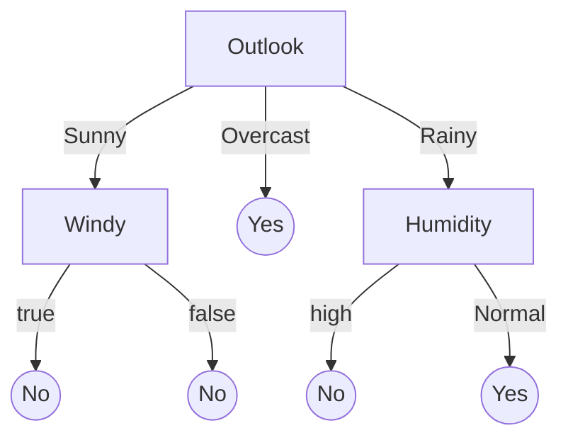
```mermaid
graph TD;
  Outlook -->|Sunny| Windy;
  Outlook -->|Overcast| Yes((Yes));
  Outlook -->|Rainy| Humidity;
  Windy -->|true| No((No));
  Windy -->|false| No2((No));
  Humidity -->|high| No3((No));
  Humidity -->|Normal| Yes2((Yes));
```

<!-- colend -->


----
## Overfitting with Decision Trees
<!-- colstart -->
<!-- small -->
| Outlook | Temperature | Humidity | Windy | Play |
| - | - | - | - | - |
| overcast | hot  |  high   |  false |    yes |
| overcast | hot  |  high   |  false |    no |
| overcast | hot  |  high   |  false |    yes |
| overcast | cool |  normal |  true |       yes |
| overcast | mild |  high   |  true|     yes |
| overcast | hot  |  normal |  false |   yes |
| rainy    | mild |  high   |  false | yes |
| rainy    | cool |  normal |  false | yes |
| rainy    | cool |  normal |  true |  no |
| rainy    | mild |  normal |  false | yes |
| rainy    | mild |  high   |  true |no |
| sunny    | hot  |  high   |  false |  no |
| sunny    | hot  |  high   |  true | no |
| sunny    | mild |  high   |false | no |
| sunny    | cool |  normal |false |   yes |
| sunny    | mild |  normal |  true |   yes |

<!-- col -->
```
f(Outlook, Temperature, Humidity, Windy) = 
  IF Humidity ∈ [high] 
    IF Outlook ∈ [overcast,rainy]
      IF Outlook ∈ [overcast] 
        IF Temperature ∈ [hot,cool] 
          true (0.667)
          true (1.000)
        IF Windy ∈ [FALSE] 
          true (1.000)
          false (1.000)
      false (1.000)
    IF Windy ∈ [FALSE] 
      true (1.000)
      IF Temperature ∈ [hot,cool] 
        IF Outlook ∈ [overcast] 
          true (1.000)
          false (1.000)
        true (1.000)
```

The tree perfectly fits the data, except on overcast, hot and humid days without wind, where there is not enough data to distinguish 3 outcomes.

Not obvious that this tree will generalize well.

<!-- colend -->


----
## On Terminology

* The decisions in a model are called *model parameter* of the model 
(constants in the resulting function, weights, coefficients), their values are usually learned from the data
* The parameters to the learning algorithm that are not the
data are called *model hyperparameters*
* Degrees of freedom ~ number of model parameters

```
// max_depth and min_support are hyperparameters
def learn_decision_tree(data, max_depth, min_support): Model = 
  ...

// A, B, C are model parameters of model f
def f(outlook, temperature, humidity, windy) =
   if A==outlook
      return B*temperature + C*windy > 10
```


----
## Separate Training and Validation Data

Always test for generalization on *unseen* validation data

Accuracy on training data (or similar measure) used during learning
to find model parameters

```scala
train_xs, train_ys, valid_xs, valid_ys = split(all_xs, all_ys)
model = learn(train_xs, train_ys)

accuracy_train = accuracy(model, train_xs, train_ys)
accuracy_valid = accuracy(model, valid_xs, valid_ys)
```

$\textit{accuracy\_train} >> \textit{accuracy\_valid}$ = sign of overfitting


----
## Detecting Overfitting

Change hyperparameter to detect training accuracy (blue)/validation accuracy (red) at different degrees of freedom


<!-- .element: class="stretch" -->


(CC SA 3.0 by [Dake](https://commons.wikimedia.org/wiki/File:Overfitting.png))

**[demo time](https://github.com/ckaestne/seai/tree/S2020/lectures/02_aibasics1/extras/decisiontree)**


Notes: Overfitting is recognizable when performance of the evaluation set decreases.

Demo: Show how trees at different depth first improve accuracy on both sets and at some point reduce validation accuracy with small improvements in training accuracy

----
## Academic Escalation: Overfitting on Benchmarks


[](overfitting-benchmarks.png)
<!-- .element: class="stretch" -->

(Figure by Andrea Passerini)


----

# Machine Learning Pipeline


<!-- references -->

Graphic: Amershi, Saleema, Andrew Begel, Christian Bird, Robert DeLine, Harald Gall, Ece Kamar, Nachiappan Nagappan, Besmira Nushi, and Thomas Zimmermann. "[Software engineering for machine learning: A case study](https://www.microsoft.com/en-us/research/uploads/prod/2019/03/amershi-icse-2019_Software_Engineering_for_Machine_Learning.pdf)." In 2019 IEEE/ACM 41st International Conference on Software Engineering: Software Engineering in Practice (ICSE-SEIP), pp. 291-300. IEEE, 2019.


----
## Similar to Spiral Process Model or Agile? 

<!-- colstart -->

<!-- col -->

(CC BY-SA 4.0, [Lakeworks](https://en.wikipedia.org/wiki/Scrum_(software_development)#/media/File:Scrum_process.svg))
<!-- colend -->

Note: There is similarity in that there is an iterative process, 
but the idea is different and the process model seems mostly orthogonal
to iteration in data science.
The spiral model prioritizes risk, especially when it is not clear
whether a model is feasible. One can do similar things in model development, seeing whether it is feasible with data at hand at all and build an early
prototype, but it is not clear that an initial okay model can be improved
incrementally into a great one later.
Agile can work with vague and changing requirements, but that again seems
to be a rather orthogonal concern. Requirements on the product are not so
much unclear or changing (the goal is often clear), but it's not clear
whether and how a model can solve it.


----
## Data Science is Iterative and Exploratory

[](accuracy-improvements.png)
<!-- .element: class="stretch" -->


Source: Patel, Kayur, James Fogarty, James A. Landay, and Beverly Harrison. "[Investigating statistical machine learning as a tool for software development](http://www.kayur.org/papers/chi2008.pdf)." In Proc. CHI, 2008.

Notes:
This figure shows the result from a controlled experiment in which participants had 2 sessions of 2h each to build a model. Whenever the participants evaluated a model in the process, the accuracy is recorded. These plots show the accuracy improvements over time, showing how data scientists make incremental improvements through frequent iteration.


 

----
## Computational Notebooks

<!-- colstart -->

* Origins in "literal programming", interleaving text and code, treating programs as literature (Knuth'84)
* First notebook in Wolfram Mathematica 1.0 in 1988
* Document with text and code cells, showing execution results under cells
* Code of cells is executed, per cell, in a kernel
* Many notebook implementations and supported languages, Python + Jupyter currently most popular

**demo time**

<!-- col -->


<!-- colend -->

Notes:
* See also https://en.wikipedia.org/wiki/Literate_programming
* Demo with public notebook, e.g., https://colab.research.google.com/notebooks/mlcc/intro_to_pandas.ipynb


---

# Artificial Intelligence for Software Engineers

(Part 2: Deep Learning, Symbolic AI)

Christian Kaestner

<!-- references -->

Required Reading: 🕮 Géron, Aurélien. ”[Hands-On Machine Learning with Scikit-Learn, Keras, and TensorFlow](https://cmu.primo.exlibrisgroup.com/permalink/01CMU_INST/6lpsnm/alma991019662775504436)”, 2nd Edition (2019), Ch 1.

Recommended Readings:
🕮 Géron, Aurélien. ”[Hands-On Machine Learning with Scikit-Learn, Keras, and TensorFlow](https://cmu.primo.exlibrisgroup.com/permalink/01CMU_INST/6lpsnm/alma991019662775504436)”, 2nd Edition (2019), Ch 10 ("Introduction to Artificial Neural Networks with Keras"),
🕮 Flasiński, Mariusz. "[Introduction to Artificial Intelligence](https://doi.org/10.1007/978-3-319-40022-8)." Springer (2016), Chapter 1 ("History of Artificial Intelligence") and Chapter 2 ("Symbolic Artificial Intelligence"), 🕮 Pfeffer, Avi. "[Practical Probabilistic Programming](https://livebook.manning.com/book/practical-probabilistic-programming/chapter-1/)." Manning (2016), Chapter 1 or 🎬 Kevin Smith's recorded [tutorial on Probabilistic Programming](https://www.youtube.com/watch?v=9SEIYh5BCjc)


----

# Learning goals

* Give an overview of different AI problems and approaches
* Explain at high level how deep learning works 
* Describe key characteristics of symbolic AI techniques and when to use them

----


<svg version="1.1" viewBox="0.0 0.0 400 400" xmlns:xlink="http://www.w3.org/1999/xlink" xmlns="http://www.w3.org/2000/svg">
        <style>
    text { font: 60px sans-serif; }
        </style>
        <circle r="200" cx="200", cy="200" fill="#b9ff00" fill-opacity="0.514" />
        <circle r="140" cx="230", cy="250" fill="#ff5500" fill-opacity="0.514" />
        <circle r="80" cx="270", cy="280" fill="#0055ff" fill-opacity="0.514" />
        <text x=130 y=100 dominant-baseline="middle" text-anchor="middle">AI</text>
        <text x=210 y=180 dominant-baseline="middle" text-anchor="middle">ML</text>
        <text x=270 y=280 dominant-baseline="middle" text-anchor="middle">DL</text>

</svg>

<!-- split -->

<!-- small -->
Artificial Intelligence: 
> computers acting humanly / thinking humanly / thinking rationally / acting rationally -- [Russel and Norvig, 2003](https://cmu.primo.exlibrisgroup.com/permalink/01CMU_INST/1feg4j8/alma991019419529704436)

Machine Learning:
> A computer program is said to learn from experience E with respect to some task T and some performance measure P, if its performance on T, as measured by P, improves with experience E. -- [Tom Mitchell, 1997](https://cmu.primo.exlibrisgroup.com/permalink/01CMU_INST/1feg4j8/alma991003098569704436)

Deep Learning:

> specific learning technique based on neural networks


Note: Precise definitions are difficult to capture. Some simply describe AI as "everything that's hard in computer science".

----
## Artificial Intelligence

<!-- colstart -->

* Acting humanly: Turing test approach, requires natural language processing, knowledge representation, automated reasoning, machine learning, maybe vision and robotics
* Thinking humanly: mirroring human thinking, cognitive science
* Thinking rationally: law of thoughts, logic, patterns and structures
* Acting rationally: rational agents interacting with environments


<!-- col -->

* problem solving (e.g., search, constraint satisfaction)
* knowledge, reasoning, planning (e.g., logic, knowledge representation, probabilistic reasoning)
* learning (learning from examples, knowledge in learning, reinforcement learning)
* communication, perceiving, and acting (NLP, vision, robotics)

<!-- colend -->

<!-- references -->
Russel and Norvig. "[Artificial Intelligence: A Modern Approach](https://cmu.primo.exlibrisgroup.com/permalink/01CMU_INST/1feg4j8/alma991019419529704436).", 2003


----
## Common Problem Classes

* Classification 
* Probability estimation 
* Regression
* Ranking
* Hybrids


----
## Learning Paradigms

* Supervised learning -- labeled training data provided
* Unsupervised learning -- training data without labels
* Reinforcement learning -- agents learning from interacting with an environment


----

# Neural Networks


<!-- .element: class="stretch" -->


Note: Artificial neural networks are inspired by how biological neural networks work ("groups of chemically connected or functionally associated neurons" with synapses forming connections)

From "Texture of the Nervous System of Man and the Vertebrates" by Santiago Ramón y Cajal, via https://en.wikipedia.org/wiki/Neural_circuit#/media/File:Cajal_actx_inter.jpg

----
## Threshold Logic Unit / Perceptron

computing weighted sum of inputs + step function

$z = w_1 x_1 + w_2 x_2 + ... + w_n x_n = \mathbf{x}^T \mathbf{w}$

e.g., step: `$\phi$(z) = if (z<0) 0 else 1` 

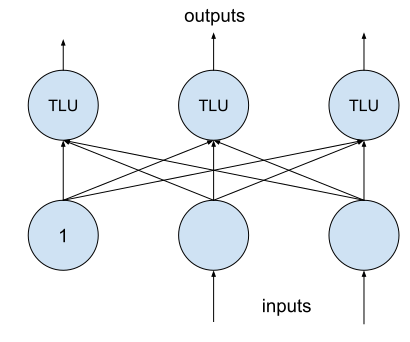
<!-- .element: class="stretch" -->

----
$f_{\mathbf{W}_h,\mathbf{b}_h,\mathbf{W}_o,\mathbf{b}_o}(\mathbf{X})=\phi( \mathbf{W}_o \cdot \phi(\mathbf{W}_h \cdot \mathbf{X}+\mathbf{b}_h)+\mathbf{b}_o$


<!-- .element: class="stretch" -->

(matrix multiplications interleaved with step function)


----
## Example Scenario

* MNIST Fashion dataset of 70k 28x28 grayscale pixel images, 10 output classes


<!-- .element: class="stretch" -->
 
----
## Network Size

* 50 Layer ResNet network -- classifying 224x224 images into 1000 categories
  * 26 million weights, computes 16 million activations during inference, 168 MB to store weights as floats
* OpenAI’s GPT-2 (2019) -- text generation
  - 48 layers, 1.5 billion weights (~12 GB to store weights)
  - released model reduced to 117 million weights
  - trained on 7-8 GPUs for 1 month with 40GB of internet text from 8 million web pages


----
# Classic Symbolic AI

(Good Old-Fashioned Artificial Intelligence)


----
## Boolean Satisfiability

Given a propositional formula over boolean variables, is there an assignment such that the formula evaluates to true?

$(a \vee b) \wedge (\neg a \vee c) \wedge \neg b$

decidable, np complete, lots of search heuristics


----
## Encoding Problems


<!-- .element: class="stretch" -->

 
----
## Constraint Satisfaction Problems, SMT

Generalization beyond boolean options, numbers, strings, additions, optimization

**Example: Job Scheduling**

Tasks for assembling a car: { t1, t2, t3, t4, t5, t6 }; values denoting start time

max 30 min: $\forall_n t_n<30$ 

t2 needs to be after t1, t1 takes 10 min: $t_1+10\le t_2$

t3 and t4 needs to be after t2, take 2 min: $(t_2+2\le t_3) \wedge (t_2+2\le t_4)$

t5 and t6 (5 min each) should not overlap: $(t_5+5\le t_6) \vee (t_6+5\le t_5)$

Goal: find valid assignment for all start times, or find valid assignment minimizing the latest start time

----
## Probabilistic Programming by Example

```scala
class Person {
  val smokes = Flip(0.6)
}
def smokingInfluence(pair: (Boolean, Boolean)) =
  if (pair._1 == pair._2) 3.0; else 1.0

val alice, bob, clara = new Person
val friends = List((alice, bob), (bob, clara))
clara.smokes.observe(true)
for { (p1, p2) <- friends } 
  ^^(p1.smokes, p2.smokes).setConstraint(smokingInfluence)

...
println("Probability of Alice smoking: " + 
        alg.probability(alice.smokes, true))
```

Note: Discussed in tutorial: https://www.cra.com/sites/default/files/pdf/Figaro_Tutorial.pdf

Source: https://github.com/p2t2/figaro/blob/master/FigaroExamples/src/main/scala/com/cra/figaro/example/Smokers.scala

----
## Probabilistic Inference

Answering queries about probabilistic models

```scala
println("Probability of burglary: " + 
        alg.probability(burglary, true))

println("Probability of Alice smoking: " + 
        alg.probability(alice.smokes, true))
```

<!-- vspace -->

* Analytical probabilistic reasoning (e.g., variable elimination Bayes' rule) -- precise result, guarantees
* Approximation (e.g., belief propagation)
* Sampling (e.g., Markov chain Monte Carlo) -- probabilistic guarantees

---

# Model Quality

Christian Kaestner

<!-- references -->

Required reading: 
* 🕮 Hulten, Geoff. "[Building Intelligent Systems: A Guide to Machine Learning Engineering.](https://www.buildingintelligentsystems.com/)" Apress, 2018, Chapter 19 (Evaluating Intelligence).
* 🗎 Ribeiro, Marco Tulio, Sameer Singh, and Carlos Guestrin. "[Semantically equivalent adversarial rules for debugging NLP models](https://www.aclweb.org/anthology/P18-1079.pdf)." In Proceedings of the 56th Annual Meeting of the Association for Computational Linguistics (Volume 1: Long Papers), pp. 856-865. 2018.

----

# Learning Goals

* Select a suitable metric to evaluate prediction accuracy of a model and to compare multiple models
* Select a suitable baseline when evaluating model accuracy
* Explain how software testing differs from measuring prediction accuracy of a model
* Curate validation datasets for assessing model quality, covering subpopulations as needed
* Use invariants to check partial model properties with automated testing
* Develop automated infrastructure to evaluate and monitor model quality

----
# This lecture

## First Part: Measuring Prediction Accuracy

the data scientist's perspective


## Second Part: Learning from Software Testing

how software engineering tools may apply to ML


----

> "Programs which were written in order to determine the
answer in the first place. There would be no need to write such programs, if the
correct answer were known” (Weyuker, 1982).


----
## Case Study: Cancer Detection


<!-- .element: class="stretch" -->

Notes: Application to be used in hospitals to screen for cancer, both as routine preventative measure and in cases of specific suspicions. Supposed to work together with physicians, not replace.

----
## The Systems Perspective

System is more than the model

Includes deployment, infrastructure, user interface, data infrastructure, payment services, and often much more

Systems have a goal:
* maximize sales
* save lifes
* entertainment
* connect people

Models can help or may be essential in those goals, but are only one part

*Today: Narrow focus on prediction accuracy of the model*


----
## Cancer Prediction within A Healthcare Application


<!-- .element: class="stretch" -->


(CC BY-SA 4.0, [Martin Sauter](https://commons.wikimedia.org/wiki/Category:GNU_Health#/media/File:Gnu_health_2-8_gynocology_general.png))


----
## Confusion/Error Matrix

| | **Actually A** | **Actually B** | **Actually C** |
| :--- | --- | --- | --- |
|**AI predicts A** | **10** | 6 | 2 |
|**AI predicts B** | 3 | **24**  | 10 |
|**AI predicts C** | 5 | 22 | **82** |

Accuracy = correct predictions (diagonal) out of all predictions

Example's accuracy 
        = $\frac{10+24+82}{10+6+2+3+24+10+5+22+82} = .707$

----
## Is 99% Accuracy good?

-> depends on problem; can be excellent, good, mediocre, terrible

10% accuracy can be good on some tasks (information retrieval)

Always compare to a base rate!

Reduction in error = 
$\frac{(1 - accuracy\_\text{baseline}) - (1 - accuracy\_f)}{1 - accuracy\_\text{baseline}}$

* from 99.9% to 99.99% accuracy = 90% reduction in error
* from 50% to 75% accuracy = 50% reduction in error

----
## Types of Mistakes

Two-class problem of predicting event A:


| | **Actually A** | **Actually not A** |
| --- | --- | --- |
|**AI predicts A** | True Positive (TP) | False Positive (FP) |
|**AI predicts not A** | False Negative (FN) | True Negative (TN) |

True positives and true negatives: correct prediction

False negatives: wrong prediction, miss, Type II error

False positives: wrong prediction, false alarm, Type I error

 

----
## Multi-Class problems vs Two-Class Problem

| | **Actually A** | **Actually B** | **Actually C** |
| :--- | --- | --- | --- |
|**AI predicts A** | **10** | 6 | 2 |
|**AI predicts B** | 3 | **24**  | 10 |
|**AI predicts C** | 5 | 22 | **82** |

****

<!-- colstart -->

| | **Act. A** | **Act. not A** |
| --- | --- | --- |
|**AI predicts A** | 10 | 8 |
|**AI predicts not A** | 8 | 138 |

<!-- col -->

| | **Act. B** | **Act. not B** |
| --- | --- | --- |
|**AI predicts B** | 24 | 13 |
|**AI predicts not B** | 28 | 99 |

<!-- colend -->

Notes: Individual false positive/negative classifications can be derived
by focusing on a single value in a confusion matrix. False positives/recall/etc are always considered with regard to a single specific outcome.


----

[](https://en.wikipedia.org/wiki/Precision_and_recall#/media/File:Precisionrecall.svg)
<!-- .element: class="stretch" -->


(CC BY-SA 4.0 by [Walber](https://en.wikipedia.org/wiki/Precision_and_recall#/media/File:Precisionrecall.svg))

----
## False positives and false negatives equally bad? 

Consider: 
* Recognizing cancer 
* Suggesting products to buy on e-commerce site
* Identifying human trafficking at the border
* Predicting high demand for ride sharing services
* Predicting recidivism chance
* Approving loan applications

No answer vs wrong answer?

----
## Receiver operating characteristic (ROC) curves


(CC BY-SA 3.0 by [BOR](https://en.wikipedia.org/wiki/Receiver_operating_characteristic#/media/File:Roccurves.png))

Notes: Same concept, but plotting TPR (recall) against FPR rather than precision. Graphs closer to the top-left corner are better. Again, the area under the (ROC) curve can be measured to get a single number for comparison.


----
## Comparing Predicted and Expected Outcomes

<!-- colstart -->

Mean Absolute Percentage Error

**MAPE** = 

$\frac{1}{n}\sum_{t=1}^{n}\left|\frac{A_t-F_t}{A_t}\right|$

($A_t$ actual outcome, $F_t$ predicted outcome, for row $t$)

Compute relative prediction error per row, average over all rows

<!-- col -->

| Rooms | Crime Rate | ... | Predicted Price | Actual Price |
| - | - | - | - | - | 
| 3 | .01 | ... | 230k | 250k |
| 4 | .01 | ... | 530k | 498k |
| 2 | .03 | ... | 210k | 211k |
| 2 | .02 | ... | 219k | 210k |

MAPE = $\frac{1}{4}\left( 20/250 + 32/498 + 1/211 + 9/210  \right)$
= $\frac{1}{4}\left(0.08 + 0.064 + 0.005 + 0.043\right)$ = $0.048$

<!-- colend -->


----
## Evaluating Rankings

Ordered list of results, true results should be ranked high

Common in information retrieval (e.g., search engines) and recommendations

<!-- colstart -->
Mean Average Precision 

MAP@K = precision in first $K$ results

Averaged over many queries

<!-- col -->
| Rank | Product | Correct? |
| - | - | - |
|1 | Juggling clubs | true |
|2 | Bowling pins | false |
|3| Juggling balls | false |
|4| Board games | true |
|5| Wine | false |
|6| Audiobook | true |

MAP@1 = 1,
MAP@2 = 0.5,
MAP@3 = 0.33,
...
<!-- colend -->

**Remember to compare against baselines!** Baseline for shopping recommendations?


----
## Model Quality in Natural Language Processing?

Highly problem dependent:
* Classify text into positive or negative -> classification problem
* Determine truth of a statement -> classification problem
* Translation and summarization -> comparing sequences (e.g ngrams) to human results with specialized metrics, e.g. [BLEU](https://en.wikipedia.org/wiki/BLEU) and [ROUGE](https://en.wikipedia.org/wiki/ROUGE_(metric))
* Modeling text -> how well its probabilities match actual text, e.g., likelyhoold or [perplexity](https://en.wikipedia.org/wiki/Perplexity)


----
# Analogy to Software Testing

(this gets messy)

----
## Model Testing? 

<!-- colstart -->
| Rooms | Crime Rate | ... | Actual Price |
| - | - | - | - | 
| 3 | .01 | ... | 250k |
| 4 | .01 | ... |  498k |
| 2 | .03 | ... |  211k |
| 2 | .02 | ... |  210k |

<!-- col -->

```java
assertEquals(250000, 
    model.predict([3, .01, ...]));
assertEquals(498000, 
    model.predict([4, .01, ...]));
assertEquals(211000, 
    model.predict([2, .03, ...]));
assertEquals(210000, 
    model.predict([2, .02, ...]));
```
<!-- colend -->

<!-- vspace -->

Fail the entire test suite for one wrong prediction?

<!-- discussion -->

----
## The Oracle Problem

*How do we know the expected output of a test?*

```java
assertEquals(??, factorPrime(15485863));
```

* Manually construct input-output pairs (does not scale, cannot automate)
* Comparison against gold standard (e.g., alternative implementation, executable specification)
* Checking of global properties only -- crashes, buffer overflows, code injections
* Manually written assertions -- partial specifications checked at runtime


----
## Different Expectations for Prediction Accuracy

* Not expecting that all predictions will be correct (80% accuracy may be very good)
* Data may be mislabeled in training or validation set
* There may not even be enough context (features) to distinguish all training outcomes
* 
* **Lack of specifications** 
* **A wrong prediction is not necessarily a bug**

----
## Analogy of Performance Testing?

* Performance tests are not precise (measurement noise)
    * Averaging over repeated executions *of the same test*
    * Commonly using diverse benchmarks, i.e., *multiple inputs*
    * Need to control environment (hardware)
* No precise specification
    * Regression tests
    * Benchmarking as open-ended comparison 
    * Tracking results over time


```java
@Test(timeout=100) 
public void testCompute() {
   expensiveComputation(...);
}
```


----
# Machine Learning is Requirements Engineering

(my pet theory)

<!-- references -->
see also https://medium.com/@ckaestne/machine-learning-is-requirements-engineering-8957aee55ef4

----
## Validation vs Verification


Note: see explanation at https://medium.com/@ckaestne/machine-learning-is-requirements-engineering-8957aee55ef4

----
## Example and Discussion

```
IF age between 18–20 and sex is male THEN predict arrest
ELSE IF age between 21–23 and 2–3 prior offenses THEN predict arrest
ELSE IF more than three priors THEN predict arrest
ELSE predict no arrest
```

Model learned from gathered data (~ interviews, sufficient? representative?)

Cannot equally satisfy all stakeholders, conflicting goals; judgement call, compromises, constraints

Implementation is trivial/automatically generated

**Does it meet the users' expectations?**

**Is the model compatible with other specifications?** (fairness, robustness)

**What if we cannot understand the model?** (interpretability)


----
# Curating Validation Data

(Learning from Software Testing?)

----
## Validation Data Representative?

* Validation data should reflect usage data
* Be aware of data drift (face recognition during pandemic, new patterns in credit card fraud detection)
* "*Out of distribution*" predictions often low quality (it may even be worth to detect out of distribution data in production, more later)

----
## Independence of Data: Temporal


<!-- .element: class="stretch" -->

Note: The curve is the real trend, red points are training data, green points are validation data. If validation data is randomly selected, it is much easier to predict, because the trends around it are known.


----
## Not All Inputs are Equal


<!-- .element: class="stretch" -->

"Call mom"
"What's the weather tomorrow?"
"Add asafetida to my shopping list"

----
## Not All Inputs are Equal

> There Is a Racial Divide in Speech-Recognition Systems, Researchers Say:
> Technology from Amazon, Apple, Google, IBM and Microsoft misidentified 35 percent of words from people who were black. White people fared much better. -- [NYTimes March 2020](https://www.nytimes.com/2020/03/23/technology/speech-recognition-bias-apple-amazon-google.html)

----
## Identify Important Inputs

Curate Validation Data for Specific Problems and Subpopulations:
* *Regression testing:* Validation dataset for important inputs ("call mom") -- expect very high accuracy -- closest equivalent to **unit tests**
* *Uniformness/fairness testing:* Separate validation dataset for different subpopulations (e.g., accents) -- expect comparable accuracy
* *Setting goals:* Validation datasets for challenging cases or stretch goals -- accept lower accuracy

Derive from requirements, experts, user feedback, expected problems etc. Think *blackbox testing*.

----
## Black-Box Testing Techniques as Inspiration?

* Boundary value analysis
* Partition testing & equivalence classes
* Combinatorial testing
* Decision tables

Use to identify subpopulations (validation datasets), not individual tests.

<!-- discussion -->


----
## Examples of Invariants 

* Credit rating should not depend on gender:
    - $\forall x. f(x[\text{gender} \leftarrow \text{male}]) = f(x[\text{gender} \leftarrow \text{female}])$
* Synonyms should not change the sentiment of text:
    - $\forall x. f(x) = f(\texttt{replace}(x, \text{"is not", "isn't"}))$
* Negation should swap meaning:
    - $\forall x \in \text{"X is Y"}. f(x) = 1-f(\texttt{replace}(x, \text{" is ", " is not "}))$
* Robustness around training data:
    - $\forall x \in \text{training data}. \forall y \in \text{mutate}(x, \delta). f(x) = f(y)$
* Low credit scores should never get a loan (sufficient conditions for classification, "anchors"):
    - $\forall x. x.\text{score} < 649 \Rightarrow \neg f(x)$

Identifying invariants requires domain knowledge of the problem!

----
## Metamorphic Testing

Formal description of relationships among inputs and outputs (*Metamorphic Relations*)

In general, for a model $f$ and inputs $x$ define two functions to transform inputs and outputs $g\_I$ and $g\_O$ such that:

$\forall x. f(g\_I(x)) = g\_O(f(x))$

<!-- vspace -->

e.g. $g\_I(x)= \texttt{replace}(x, \text{" is ", " is not "})$ and $g\_O(x)=\neg x$


----
## One More Thing: Simulation-Based Testing

<!-- colstart -->
<!-- smallish -->
* Derive input-output pairs from simulation, esp. in vision systems
* Example: Vision for self-driving cars:
    * Render scene -> add noise -> recognize -> compare recognized result with simulator state
* Quality depends on quality of the simulator and how well it can produce inputs from outputs: 
    * examples: render picture/video, synthesize speech, ... 
    * Less suitable where input-output relationship unknown, e.g., cancer detection, housing price prediction, shopping recommendations
<!-- col -->
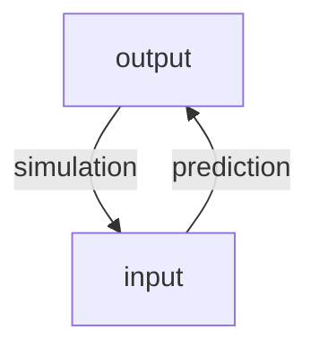
```mermaid
graph TD;
    output -->|simulation| input
    input -->|prediction| output
```
<!-- colend -->

<!-- references -->

Further readings: Zhang, Mengshi, Yuqun Zhang, Lingming Zhang, Cong Liu, and Sarfraz Khurshid. "DeepRoad: GAN-based metamorphic testing and input validation framework for autonomous driving systems." In Proceedings of the 33rd ACM/IEEE International Conference on Automated Software Engineering, pp. 132-142. 2018.


----
# Continuous Integration for Model Quality

[](https://eng.uber.com/michelangelo/)
<!-- .element: class="stretch" -->
 
----

## Specialized CI Systems


<!-- references -->

Renggli et. al, [Continuous Integration of Machine Learning Models with ease.ml/ci: Towards a Rigorous Yet Practical Treatment](http://www.sysml.cc/doc/2019/162.pdf), SysML 2019

----
## Dashboards for Comparing Models


<!-- references -->

Matei Zaharia. [Introducing MLflow: an Open Source Machine Learning Platform](https://databricks.com/blog/2018/06/05/introducing-mlflow-an-open-source-machine-learning-platform.html), 2018


---

# From Models to AI-Enabled Systems


Christian Kaestner

<!-- references -->

* 🕮 Hulten, Geoff. "Building Intelligent Systems: A Guide to Machine Learning Engineering." (2018), Chapters 5 (Components of Intelligent Systems).
* 🗎 Sculley, David, Gary Holt, Daniel Golovin, Eugene Davydov, Todd Phillips, Dietmar Ebner, Vinay Chaudhary, Michael Young, Jean-Francois Crespo, and Dan Dennison. "[Hidden technical debt in machine learning systems](http://papers.nips.cc/paper/5656-hidden-technical-debt-in-machine-learning-systems.pdf)." In Advances in neural information processing systems, pp. 2503-2511. 2015.

----

# Learning goals

* Explain how machine learning fits into the larger picture of building and maintaining production systems
* Describe the typical components relating to AI in an AI-enabled system and typical design decisions to be made


----
## Temi Transcription Service


<!-- .element: class="stretch" -->

https://www.temi.com/

Note: A model is very central to this service. Product built around
a model. Still, lots of nonmodel code for UI, storage of customer data,
credit card processing, ...

----
## Microsoft Powerpoint


<!-- .element: class="stretch" -->

Read more: [How Azure Machine Learning enables PowerPoint Designer](https://azure.microsoft.com/en-us/blog/how-azure-machine-learning-enables-powerpoint-designer/), Azure Blog, March 2020


Note: Traditional application that uses machine learning in a few smaller
places (more and more these days).


----
## Fall Detection Devices


<!-- .element: class="stretch" -->

(various devices explored, including smart watches, hearing aids, and wall and floor sensors)

Read more: [How fall detection is moving beyond the pendant](https://www.mobihealthnews.com/content/how-fall-detection-moving-beyond-pendant), MobiHealthNews, 2019

Note: Devices for older adults to detect falls and alert caretaker or emergency responders automatically or after interaction. Uses various inputs to detect falls.


----
## Google Add Fraud Detection


<!-- .element: class="stretch" -->

From: Sculley, D., M. Otey, M. Pohl, B. Spitznagel, J. Hainsworth, and Y. Zhou. Detecting Adversarial Advertisements in the Wild. In Proc. KDD, 2011.

Note: See first homework assignment. System largely build around a model for a specific purpose but integrated into larger infrastructure.


----
## Thinking about Systems

* Holistic approach, looking at the larger picture, involving all stakeholders
* Looking at relationships and interactions among components and environments
    - Everything is interconnected
    - Combining parts creates something new with emergent behavior
    - Understand dynamics, be aware of feedback loops, actions have effects
* Understand how humans interact with the system

> A system is a set of inter-related components that work together in a particular environment to perform whatever functions are required to achieve the system's objective -- Donella Meadows

<!-- references -->
Leyla Acaroglu. "[Tools for Systems Thinkers: The 6 Fundamental Concepts of Systems Thinking](https://medium.com/disruptive-design/tools-for-systems-thinkers-the-6-fundamental-concepts-of-systems-thinking-379cdac3dc6a)." Blogpost 2017


----
## Elements of an Intelligent System

* **Meaningful objective**: goals, requirements, business case
* **Intelligent experience**: user interactions -- presenting model predictions to users; user interactions; eliciting feedback, telemetry
* **Intelligence implementation**: infrastructure -- learning and serving the model and collecting feedback (telemetry)
* **Intelligence creation**: learning and evaluating models
* **Orchestration**: operations -- maintaining and updating the system over time, debugging, countering abuse
 
----
## Designing Intelligent Experiences

<!-- colstart -->
* How to use the output of a model's prediction (for a goal)?
* Design considerations:
    - How to present prediction to a user? Suggestions or automatically take actions?
    - How to effectively influence the user's behavior toward the system's goal?
    - How to minimize the consequences of flawed predictions?
    - How to collect data to continue to learn from users and mistakes?


<!-- col -->
Automatic slide design:


<!-- colend -->

----
## Factors in Case Studies

Consider: forcefulness, frequency, value, cost, model quality

<!-- colstart -->
Automatic slide design:


<!-- col -->
Fall detection:


<!-- colend -->

 

----
## Initial Telemetry Ideas?

Identify: usage, mistakes, cost of mistakes, benefits to user, benefits to goals

<!-- colstart -->
Automatic slide design:


<!-- col -->
Fall detection:


<!-- colend -->
 
----
## The Smart Toaster

> the toaster may (occasionally) burn my toast, but should never burn down my kitchen


<!-- .element: class="stretch" -->

----
## Safeguards / Guardrails

* Hard constraints overrule model
    - `heat = (temperatureReading < MAX) && continueToasting(...)`
* External hardware or software failsafe mechanisms
    - outside the model, external observer, e.g., thermal fuses


<!-- .element: class="stretch" -->
(Image CC BY-SA 4.0, C J Cowie)

----
## Infrastructure for ML Components


<!-- .element: class="stretch" -->

This was 2015; many of those boxes are getting increasingly standardized these days.


Graphic from Sculley, et al. "[Hidden technical debt in machine learning systems](http://papers.nips.cc/paper/5656-hidden-technical-debt-in-machine-learning-systems.pdf)." In Proc NIPS, 2015.


Note: Even for a single ML component and it's pipeline, there is a lot of
infrastructure to build and serve the model.

----
## Thinking in Pipelines over Models

* In production systems, models need to be deployed and updated
* Consider the entire pipeline, not just the model
    - Quality assurance, reproduciblity, repeatability, debugging
    - Modifiability, agility
    - Training cost and scalability
    - Data availability, data wrangling cost
    - Telemetry
* Reported as one of the key challenges in production machine learning


<!-- references -->

* Graphic: Amershi et al. "[Software engineering for machine learning: A case study](https://www.microsoft.com/en-us/research/uploads/prod/2019/03/amershi-icse-2019_Software_Engineering_for_Machine_Learning.pdf)." In Proc ICSE-SEIP, 2019. 
* Key challenge claim: O'Leary and Uchida. "[Common problems with Creating Machine Learning Pipelines from Existing Code](https://research.google/pubs/pub48984.pdf)." Proc. MLSys, 2020.


---

# Goals and Success Measures for AI-Enabled Systems


Christian Kaestner

<!-- references -->

Required Readings: 🕮 Hulten, Geoff. "Building Intelligent Systems: A Guide to Machine Learning Engineering." (2018), Chapters 2 (Knowing when to use IS), 4 (Defining the IS’s Goals) and 15 (Intelligent Telemetry)

Suggested complementary reading: 🕮 Ajay Agrawal, Joshua Gans, Avi Goldfarb. “[Prediction Machines: The Simple Economics of Artificial Intelligence](https://cmu.primo.exlibrisgroup.com/permalink/01CMU_INST/6lpsnm/alma991019698987304436)” 2018 

----

# Learning goals

* Judge when to apply AI for a problem in a system
* Define system goals and map them to goals for the AI component
* Design and implement suitable measures and corresponding telemetry


----
## When not to use Machine Learning?

* If clear specifications are available
* Simple heuristics are *good enough*
* Cost of building and maintaining the system outweighs the benefits (see technical debt paper)
* Correctness is of utmost importance
* Only use ML for the hype, to attract funding

**Examples?**

Notes: Accounting systems, inventory tracking, physics simulations, safety railguards, fly-by-wire

----
## Discussion: Spotify

*Big problem? Open ended? Time changing? Hard? Partial system viable? Data continuously available? Influence objectives? Cost effective?*

[](spotify.png)
<!-- .element: class="stretch" -->


----
## AI as Prediction Machines

<!-- colstart -->
AI: Higher accuracy predictions at much much lower cost

May use new, cheaper predictions for traditional tasks (**examples?**)

May now use predictions for new kinds of problems (**examples?**)

May now use more predictions than before 

(Analogies: Reduced cost of light, reduced cost of search with the internet)

<!-- col -->

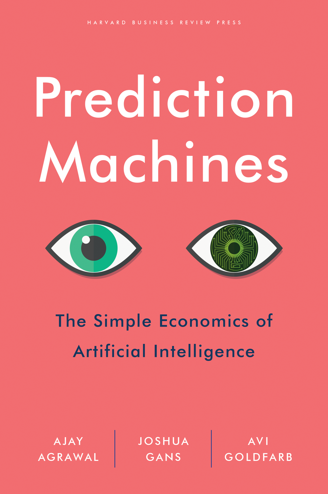

<!-- colend -->

Notes: May use new, cheaper predictions for traditional tasks -> inventory and demand forcast; May now use predictions for new kinds of problems -> navigation and translation

----
## Predicting the Best Route


<!-- .element: class="stretch" -->

Note: Cab drivers in London invested 3 years to learn streets to predict the fasted route. Navigation tools get close or better at low cost per prediction. While drivers' skills don't degrade, they now compete with many others that use AI to enhance skills; human prediction no longer scarce commodity.

At the same time, the value of human judgement increases. Making more decisions with better inputs, specifying the objective.

Picture source: https://pixabay.com/photos/cab-oldtimer-taxi-car-city-london-203486/

----
## Automation in Controlled Environments


Note: Source https://pixabay.com/photos/truck-giant-weight-mine-minerals-5095088/

----
## The Cost and Value of Data

* (1) Data for training, (2) input data for decisions, (3) telemetry data for continued improving
* Collecting and storing data can be costly (direct and indirect costs, including reputation/privacy)
* Diminishing returns of data: at some point, even more data has limited benefits
* Return on investment: investment in data vs improvement in prediction accuracy
* May need constant access to data to update models


----


<!-- references -->

🕮 Ajay Agrawal, Joshua Gans, Avi Goldfarb. “[Prediction Machines: The Simple Economics of Artificial Intelligence](https://cmu.primo.exlibrisgroup.com/permalink/01CMU_INST/6lpsnm/alma991019698987304436)” 2018 


----
## Cost Per Prediction

* Useful conceptual measure, factoring in all costs
    - Development cost
    - Data aquisition
    - Learning cost, retraining cost
    - Operating cost
    - Debugging and service cost
    - Possibly: Cost of deadling with incorrect prediction consequences (support, manual interventions, liability)
    - ...

----
## AI Risks

* Discrimination and thus liability
* Creating false confidence when predictions are poor
* Risk of overall system failure, failure to adjust
* Leaking of intellectual property
* Vulnerable to attacks if learning data, inputs, or telemetry can be influenced
*
* Societal risks
    - Focus on few big players (economies of scale), monopolization, inequality
    - Prediction accuracy vs privacy


----
## Layers of Success Measures

* Organizational objectives: Innate/overall goals of the organization
* Leading indicators: Measures correlating with future success, from the business' perspective
* User outcomes: How well the system is serving its users, from the user's perspective
* Model properties: Quality of the model used in a system, from the model's perspective

**Some are easier to measure then others (telemetry), some are noisier than others, some have more lag**

<!-- split -->

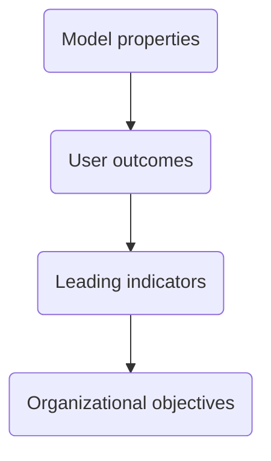
```mermaid
graph TD;
MP(Model properties) --> UO(User outcomes)
UO --> LI(Leading indicators)
LI --> OO(Organizational objectives)
```

----
## Exercise: Automating Admission Decisions to Master's Program
<!-- smallish -->
Discuss in groups, breakout rooms

What are the *goals* behind automating admissions decisions?

**Organizational objectives, leading indicators, user outcomes, model properties?**

Report back in 10 min

<!-- discussion -->


----
## Everything is Measurable

* If X is something we care about, then X, by definition, must be
detectable.
    * How could we care about things like “quality,” “risk,” “security,” or “public image” if these things were totally undetectable, directly or indirectly?
    * If we have reason to care about some unknown quantity, it is because
we think it corresponds to desirable or undesirable results in some way.
* If X is detectable, then it must be detectable in some amount.
    * If you can observe a thing at all, you can observe more of it or less of it
* If we can observe it in some amount, then it must be
measurable.

*But: Not every measure is precise, not every measure is cost effective*

<!-- references -->

🕮 Douglas Hubbard, “[How to Measure Anything: finding the value of intangibles in business](https://cmu.primo.exlibrisgroup.com/permalink/01CMU_INST/1feg4j8/alma991019515498904436)" 2014


----
## Measurement Scales
<!-- smallish -->
* Scale: The type of data being measured; dictates what sorts of analysis/arithmetic is legitimate or meaningful.
* Nominal: Categories ($=, \neq$, frequency, mode, ...)
  * e.g., biological species, film genre, nationality
* Ordinal: Order, but no meaningful magnitude ($<, >$, median, rank correlation, ...)
  * Difference between two values is not meaningful
  * Even if numbers are used, they do not represent magnitude!
  * e.g., weather severity, complexity classes in algorithms
* Interval: Order, magnitude, but no definition of zero ($+, -$, mean, variance, ...)
  * 0 is an arbitrary point; does not represent absence of quantity
  * Ratio between values are not meaningful
  * e.g., temperature (C or F)
* Ratio: Order, magnitude, and zero ($*, /, log, \sqrt{\ }$, geometric mean)
  * e.g., mass, length, temperature (Kelvin)

**Aside: Understanding scales of features is also useful for encoding or selecting learning strategies in ML**


----
## Exercise: Specific Metrics for Spotify Goals?


* Organization objectives?
* Leading indicators?
* User outcomes?
* Model properties?
* What are their scales?

<!-- split -->

[](spotify.png)
<!-- .element: class="stretch" -->


---

# Trade-offs among AI Techniques


Christian Kaestner

<!-- references -->
With slides adopted from Eunsuk Kang

Required reading: 🗎 Vogelsang, Andreas, and Markus Borg. "[Requirements Engineering for Machine Learning: Perspectives from Data Scientists](https://arxiv.org/pdf/1908.04674.pdf)." In Proc. of the 6th International Workshop on Artificial Intelligence for Requirements Engineering (AIRE), 2019.


----
# Learning Goals

* Describe the most common models and learning strategies used for AI components and summarize how they work
* Organize and prioritize the relevant qualities of concern for a given project
* Plan and execute an evaluation of the qualities of alternative AI components for a given purpose


----
## Today's Case Study: Lane Assist


<!-- references -->

Image CC BY-SA 4.0 by  [Ian Maddox](https://commons.wikimedia.org/wiki/User:Isnoop)

----
# Quality

<!-- colstart -->

<!-- col -->

<!-- colend -->


----
## Attributes


* **Quality attributes:** How well the product (system) delivers its
functionality (usability, reliability, availability, security...)
* **Project attributes:** Time-to-market, development & HR cost...
* **Design attributes:** Type of AI method used, accuracy, training time, inference time, memory usage...


----
## Constraints

Constraints define the space of attributes for valid design solutions


----
## Accuracy is not Everything

Beyond prediction accuracy, what qualities may be relevant for an AI component?

<!-- discussion -->

Note: Collect qualities on whiteboard

----
## Examples of Qualities to Consider

* Accuracy
* Correctness guarantees? Probabilistic guarantees (--> symbolic AI)
* How many features? Interactions among features?
* How much data needed? Data quality important?
* Incremental training possible?
* Training time, memory need, model size -- depending on training data volume and feature size
* Inference time, energy efficiency, resources needed, scalability
* Interpretability/explainability
* Robustness, reproducibility, stability
* Security, privacy
* Fairness


----
## Interpretability/Explainability

*"Why did the model predict X?"*

**Explaining predictions + Validating Models + Debugging**

```
IF age between 18–20 and sex is male THEN predict arrest
ELSE IF age between 21–23 and 2–3 prior offenses THEN predict arrest
ELSE IF more than three priors THEN predict arrest
ELSE predict no arrest
```

Some models inherently simpler to understand

Some tools may provide post-hoc explanations

Explanations may be more or less truthful

How to measure interpretability?

**more in a later lecture**

----
## Robustness


Small input modifications may change output

Small training data modifications may change predictions

How to measure robustness?

**more in a later lecture**


<!-- references -->
Image source: [OpenAI blog](https://openai.com/blog/adversarial-example-research/)

----
## Fairness

*Does the model perform differently for different populations?*

```
IF age between 18–20 and sex is male THEN predict arrest
ELSE IF age between 21–23 and 2–3 prior offenses THEN predict arrest
ELSE IF more than three priors THEN predict arrest
ELSE predict no arrest
```

Many different notions of fairness

Often caused by bias in training data

Enforce invariants in model or apply corrections outside model

Important consideration during requirements solicitation!

**more in a later lecture**


----
# Some Tradeoffs of Common ML Techniques


<!-- .element: class="stretch" -->

Image: [Scikit Learn Tutorial](https://scikit-learn.org/stable/tutorial/machine_learning_map/)

----
## Which method for Credit Scoring?

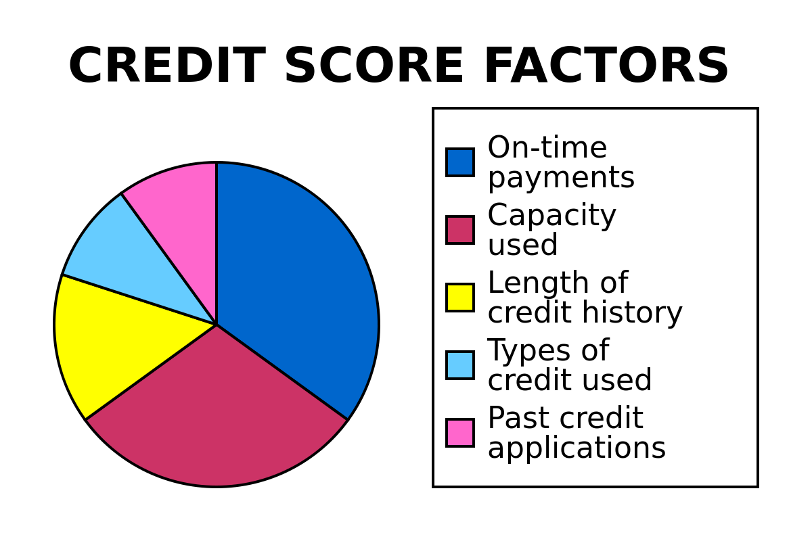
<!-- .element: class="stretch" -->

Linear regression, decision tree, neural network, or k-NN?

Image  CC-BY-2.0 by [Pne](https://commons.wikimedia.org/wiki/File:Credit-score-chart.svg)

----
## Which Method for Video Recommendations?


Linear regression, decision tree, neural network, or k-NN?

(Youtube: 500 hours of videos uploaded per sec)
 


----
# Tradeoff Analysis

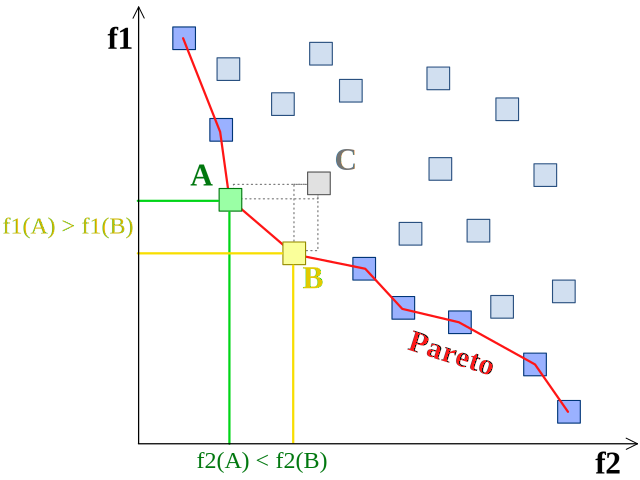


----
## Trade-offs: Cost vs Accuracy


_"We evaluated some of the new methods offline but the additional
accuracy gains that we measured did not seem to justify the
engineering effort needed to bring them into a production
environment.”_

<!-- references -->

Amatriain & Basilico. [Netflix Recommendations: Beyond the 5 stars](https://netflixtechblog.com/netflix-recommendations-beyond-the-5-stars-part-1-55838468f429),
Netflix Technology Blog (2012)

----
## Trade-offs: Accuracy vs Interpretability


<!-- references -->

Bloom & Brink. [Overcoming the Barriers to Production-Ready Machine Learning
Workflows](https://conferences.oreilly.com/strata/strata2014/public/schedule/detail/32314), Presentation at O'Reilly Strata Conference (2014).


---


# Risk and Planning for Mistakes

Christian Kaestner

<!-- references -->
With slides adopted from Eunsuk Kang

Required reading: 🕮 Hulten, Geoff. "Building Intelligent Systems: A Guide to Machine Learning Engineering." (2018), Chapters 6–8 (Why creating IE is hard, balancing IE, modes of intelligent interactions) and 24 (Dealing with Mistakes)

----
## Learning goals:

* Analyze how mistake in an AI component can influence the behavior of a system
* Analyze system requirements at the boundary between the machine and world
* Evaluate risk of a mistake from the AI component using fault trees
* Design and justify a mitigation strategy for a concrete system

----


----
> Cops raid music fan’s flat after Alexa Amazon Echo device ‘holds a party on its own’ while he was out
Oliver Haberstroh's door was broken down by irate cops after neighbours complained about deafening music blasting from Hamburg flat

https://www.thesun.co.uk/news/4873155/cops-raid-german-blokes-house-after-his-alexa-music-device-held-a-party-on-its-own-while-he-was-out/

> News broadcast triggers Amazon Alexa devices to purchase dollhouses.

https://www.snopes.com/fact-check/alexa-orders-dollhouse-and-cookies/

----


----
# Sources of Wrong Predictions


----
## Correlation vs Causation


----
## Confounding Variables

<!-- colstart -->
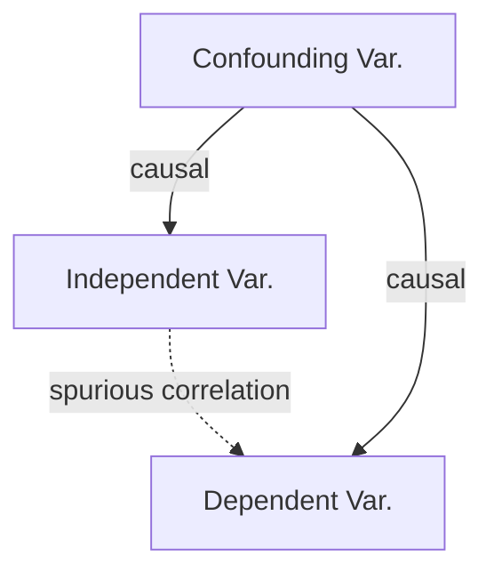
```mermaid
graph TD;
IV[Independent Var.] -.->|spurious correlation| DV[Dependent Var.]
CV[Confounding Var.] -->|causal| DV
CV -->|causal| IV
```
<!-- col -->
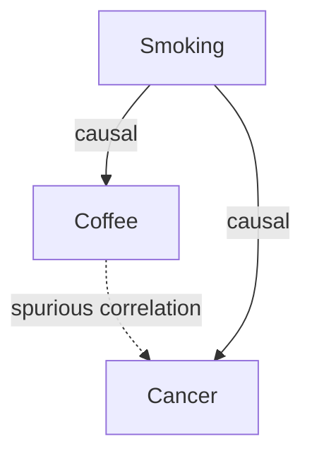
```mermaid
graph TD;
IV[Coffee] -.->|spurious correlation| DV[Cancer]
CV[Smoking] -->|causal| DV
CV -->|causal| IV
```
<!-- colend -->

----
## Hidden Confounds


Note: ML algorithms may pick up on things that do not relate to the task but correlate with the outcome or hidden human inputs. For example, in cancer prediction, ML models have picked up on the kind of scanner used, learning that mobile scanners were used for particularly sick patients who could not be moved to the large installed scanners in a different part of the hospital.


----
## Reverse Causality


Note: (from Prediction Machines, Chapter 6) Early 1980s chess  program learned from Grandmaster games, learned that sacrificing queen would be a winning move, because it was occuring frequently in winning games. Program then started to sacrifice queen early.


----
## Other Issues

* Insufficient training data
* Noisy training data
* Biased training data
* Overfitting
* Poor model fit, poor model selection, poor hyperparameters
* Missing context, missing important features
* Noisy inputs
* "Out of distribution" inputs


----
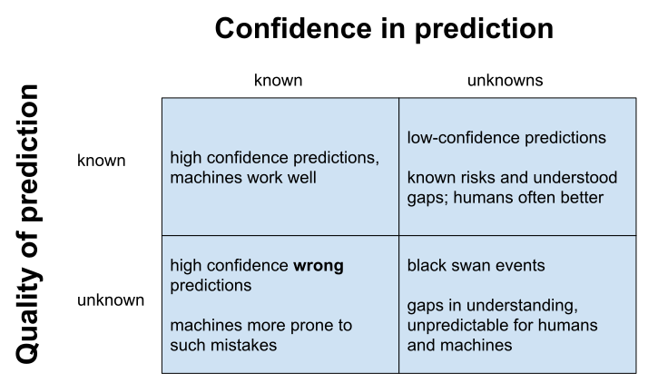


----
## ML Models make Crazy Mistakes

* Humans often make predicable mistakes
    * most mistakes near to correct answer, distribution of mistakes
* ML models may be wildly wrong when they are wrong
    - especially black box models may use (spurious) correlations humans would never think about
    - may be very confident about wrong answer
    - "fixing" one mistake may cause others


----
## Accepting Mistakes

* Never assume all predictions will be correct or close
* Always expect random, unpredictable mistakes to some degree, including results that are wildly wrong
* Best efforts at more data, debugging, "testing" likely will not eliminate the problem

Hence: **Anticipate existence of mistakes, focus on worst case analysis and mitigation outside the model -- system perspective needed**

Alternative paths: symbolic reasoning, interpretable models, and restricting predictions to "near" training data


----
# Common Strategies to Handle Mistakes

----
## Guardrails

*Software or hardware overrides outside the AI component*


----
## Redundancy and Voting

*Train multiple models, combine with heuristics, vote on results*

- Ensemble learning, reduces overfitting
- May learn the same mistakes, especially if data is biased
- Hardcode known rules (heuristics) for some inputs -- for important inputs

**Examples?**

----
## Human in the Loop

*Less forceful interaction, making suggestions, asking for confirmation*

* AI and humans are good at predictions in different settings
    - e.g., AI better at statistics at scale and many factors; humans understand context and data generation process and often better with thin data (see *known unknowns*)
* AI for prediction, human for judgment?
* But
    * Notification fatigue, complacency, just following predictions; see *Tesla autopilot*
    * Compliance/liability protection only?
* Deciding when and how to interact
* Lots of UI design and HCI problems


**Examples?**

Notes: Cancer prediction, sentencing + recidivism, Tesla autopilot, military "kill" decisions, powerpoint design suggestions

----
## Undoable Actions

*Design system to reduce consequence of wrong predictions, allowing humans to override/undo*

**Examples?**

Notes: Smart home devices, credit card applications, Powerpoint design suggestions

----
## Review Interpretable Models

*Use interpretable machine learning and have humans review the rules*

```txt
IF age between 18–20 and sex is male THEN predict arrest
ELSE IF age between 21–23 and 2–3 prior offenses THEN predict arrest
ELSE IF more than three priors THEN predict arrest
ELSE predict no arrest
```

-> Approve the model as specification


----
## Risk Analysis: What's the worst that could happen?


<!-- .element: class="stretch" -->

----
## Fault Tree Example


* Every tree begins with a TOP event (typically a violation of a requirement)
* Every branch of the tree must terminate with a basic event

<!-- references -->
Figure from _Fault Tree Analysis and Reliability Block Diagram_
(2016), Jaroslav Menčík. 

----
## Failure Mode and Effects Analysis (FMEA)


* A __forward search__ technique to identify potential hazards
* Widely used in aeronautics, automotive, healthcare, food services,
  semiconductor processing, and (to some extent) software

----
## Hazard and Interoperability Study (HAZOP)
   
*identify hazards and component fault scenarios through guided inspection of requirements*


----
## Machine vs World


* No software lives in vacuum; every system is deployed as part of the world
* A requirement describes a desired state of the world (i.e., environment)
* Machine (software) is _created_ to manipulate the environment into
  this state 

----
## Shared Phenomena


* Shared phenomena: Interface between the world & machine (actions,
  events, dataflow, etc.,)
* Requirements (REQ) are expressed only in terms of world phenomena 
* Assumptions (ENV) are expressed in terms of world & shared phenomena
* Specifications (SPEC) are expressed in terms of machine & shared phenomena


----
## Feedback Loops and Adversaries


<!-- .element: class="stretch" -->

* Feedback loops: Behavior of the machine affects the world, which affects inputs to the machine
* Data drift: Behavior of the world changes over time, assumptions no longer valid
* Adversaries: Bad actors deliberately may manipulate inputs, violate environment assumptions

**Examples?**


---


# Software Architecture of AI-enabled Systems

Christian Kaestner

<!-- references -->

Required reading: 
* 🕮 Hulten, Geoff. "[Building Intelligent Systems: A Guide to Machine Learning Engineering.](https://www.buildingintelligentsystems.com/)" Apress, 2018, Chapter 13 (Where Intelligence Lives).
* 📰 Daniel Smith. "[Exploring Development Patterns in Data Science](https://www.theorylane.com/2017/10/20/some-development-patterns-in-data-science/)." TheoryLane Blog Post. 2017.


----

# Learning Goals


* Create architectural models to reason about relevant characteristics
* Critique the decision of where an AI model lives (e.g., cloud vs edge vs hybrid), considering the relevant tradeoffs 
* Deliberate how and when to update models and how to collect telemetry

----

# Software Architecture 

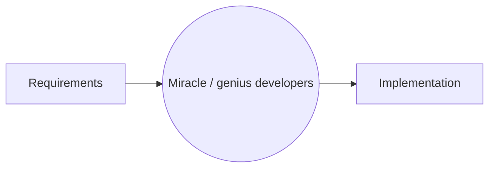
```mermaid
graph LR;
Requirements --> m((Miracle / genius developers))
m --> Implementation
```


----

## Case Study: Twitter


Note: Source and additional reading: Raffi. [New Tweets per second record, and how!](https://blog.twitter.com/engineering/en_us/a/2013/new-tweets-per-second-record-and-how.html) Twitter Blog, 2013

----

Notes: Map of Pittsburgh. Abstraction for navigation with cars.
----

Notes: Cycling map of Pittsburgh. Abstraction for navigation with bikes and walking.
----

Notes: Fire zones of Pittsburgh. Various use cases, e.g., for city planners.

----

## What can we reason about?


<!-- references -->
Ghemawat, Sanjay, Howard Gobioff, and Shun-Tak Leung. "[The Google file system.](https://ai.google/research/pubs/pub51.pdf)" ACM SIGOPS operating systems review. Vol. 37. No. 5. ACM, 2003.

Notes: Scalability through redundancy and replication; reliability wrt to single points of failure; performance on edges; cost


----

# Case Study: Augmented Reality Translation


<!-- .element: class="stretch" -->


Notes: Image: https://pixabay.com/photos/nightlife-republic-of-korea-jongno-2162772/

----
## Where Should the Model Live?

* Glasses
* Phone
* Cloud

What qualities are relevant for the decision?

<!-- split -->


Notes: Trigger initial discussion


----
## When would one use the following designs?

* Static intelligence in the product
* Client-side intelligence
* Server-centric intelligence
* Back-end cached intelligence
* Hybrid models


Notes:
From the reading:
* Static intelligence in the product
    - difficult to update
    - good execution latency
    - cheap operation
    - offline operation
    - no telemetry to evaluate and improve
* Client-side intelligence
    - updates costly/slow, out of sync problems
    - complexity in clients
    - offline operation, low execution latency
* Server-centric intelligence
    - latency in model execution (remote calls)
    - easy to update and experiment
    - operation cost
    - no offline operation
* Back-end cached intelligence
    - precomputed common results
    - fast execution, partial offline 
    - saves bandwidth, complicated updates
* Hybrid models


----
## Telemetry Tradeoffs

What data to collect? How much? When?

Estimate data volume and possible bottlenecks in system.


Notes: Discuss alternatives and their tradeoffs. Draw models as suitable.

Some data for context:
Full-screen png screenshot on Pixel 2 phone (1080x1920) is about 2mb (2 megapixel); Google glasses had a 5 megapixel camera and a 640x360 pixel screen, 16gb of storage, 2gb of RAM. Cellar cost are about $10/GB.


----
# Architectural Decision: Updating Models

* Design for change!
* Models are rarely static outside the lab
* Data drift, feedback loops, new features, new requirements
* When and how to update models?
* How to version? How to avoid mistakes?

----
## Architectures and Patterns

* The Big Ass Script Architecture
* Decoupled multi-tiered architecture (data vs data analysis vs reporting; separate business logic from ML)
* Microservice architecture (multiple learning and inference services)
* Gateway Routing Architecture
* 
* Pipelines
* Data lake, lambda architecture
* Reuse between training and serving pipelines
* Continuous deployment, ML versioning, pipeline testing

<!-- references -->
* Daniel Smith. "[Exploring Development Patterns in Data Science](https://www.theorylane.com/2017/10/20/some-development-patterns-in-data-science/)." TheoryLane Blog Post. 2017.
* Washizaki, Hironori, Hiromu Uchida, Foutse Khomh, and Yann-Gaël Guéhéneuc. "[Machine Learning Architecture and Design Patterns](http://www.washi.cs.waseda.ac.jp/wp-content/uploads/2019/12/IEEE_Software_19__ML_Patterns.pdf)." Draft, 2019

----

## Readymade AI Components in the Cloud

* Data Infrastructure
    - Large scale data storage, databases, stream (MongoDB, Bigtable, Kafka)
* Data Processing
    - Massively parallel stream and batch processing (Sparks, Hadoop, ...)
    - Elastic containers, virtual machines (docker, AWS lambda, ...)
* AI Tools
    - Notebooks, IDEs, Visualization
    - Learning Libraries, Frameworks (tensorflow, torch, keras, ...)
* Models
    - Image, face, and speech recognition, translation
    - Chatbots, spell checking, text analytics
    - Recommendations, knowledge bases

----


---

# Quality Assessment in Production

Christian Kaestner


<!-- references -->

Required Reading: Alec Warner and Štěpán Davidovič. "[Canary Releases](https://landing.google.com/sre/workbook/chapters/canarying-releases/)." in [The Site Reliability Workbook](https://landing.google.com/sre/books/), O'Reilly 2018

Suggested Reading: Georgi Georgiev. “[Statistical Significance in A/B Testing – a Complete Guide](http://blog.analytics-toolkit.com/2017/statistical-significance-ab-testing-complete-guide/#noninf).” Blog 2018

----

<div class="tweet" data-src="https://twitter.com/changelog/status/1137359428632621060"></div>


----
## Learning Goals

* Design telemetry for evaluation in practice
* Plan and execute experiments (chaos, A/B, shadow releases, ...) in production
* Conduct and evaluate multiple concurrent A/B tests in a system
* Perform canary releases
* Examine experimental results with statistical rigor
* Support data scientists with monitoring platforms providing insights from production data


----
## Identify Feedback Mechanism in Production 

* Live observation in the running system
* Potentially on subpopulation (AB testing)
* Need telemetry to evaluate quality -- challenges:
    - Gather feedback without being intrusive (i.e., labeling outcomes), harming user experience
    - Manage amount of data
    - Isolating feedback for specific AI component + version


----

<!-- split -->


Notes:
Expect only sparse feedback and expect negative feedback over-proportionally

----


Notes: Can just wait 7 days to see actual outcome for all predictions
----


Notes: Clever UI design allows users to edit transcripts. UI already highlights low-confidence words, can 

----


----
## Engineering Challenges for Telemetry


----
## Exercise: Design Telemetry in Production

*Scenario: Injury detection in smart home workout (laptop camera)*

Discuss: Quality measure, telemetry, operationalization, false positives/negatives, cost, privacy, rare events


----
## A/B Testing for Usability

* In running system, random sample of X users are shown modified version
* Outcomes (e.g., sales, time on site) compared among groups


Notes: Picture source: https://www.designforfounders.com/ab-testing-examples/


----
## Feature Flags

```java
if (features.enabled(userId, "one_click_checkout") {
     // new one click checkout function
} else {
     // old checkout functionality
}
```

* Boolean options
* Good practices: tracked explicitly, documented, keep them localized and independent
* External mapping of flags to customers
    * who should see what configuration
    * e.g., 1% of users sees `one_click_checkout`, but always the same users; or 50% of beta-users and 90% of developers and 0.1% of all users

----
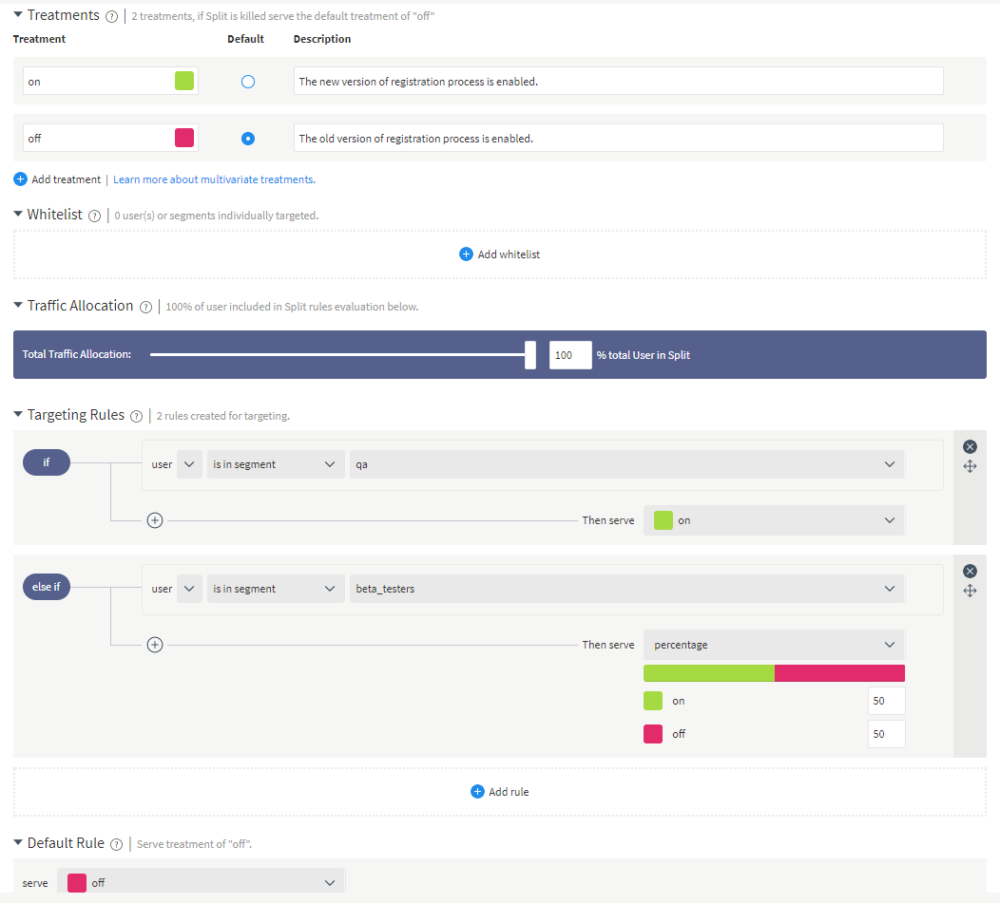
<!-- .element: class="stretch" --> 


----
## Different effect size, same deviations

<!-- colstart -->

<!-- col -->

<!-- colend -->


----
## Shadow releases / traffic teeing

* Run both models in parallel
* Report outcome of old model
* Compare differences between model predictions
* If possible, compare against ground truth labels/telemetry

**Examples?**

----
## Canary Releases

* Release new version to small percentage of population (like A/B testing)
* Automatically roll back if quality measures degrade
* Automatically and incrementally increase deployment to 100% otherwise


<!-- .element: class="stretch" -->

----
## Chaos Experiments

[](https://en.wikipedia.org/wiki/Chaos_engineering)
<!-- .element: class="stretch" -->


----


# Interacting with and supporting data scientists

<svg version="1.1" viewBox="0.0 0.0 800 400" xmlns:xlink="http://www.w3.org/1999/xlink" xmlns="http://www.w3.org/2000/svg">
        <style>
    text { font: 60px sans-serif; }
        </style>
        <circle r="180" cx="250", cy="200" fill="#b9ff00" fill-opacity="0.514" />
        <circle r="180" cx="550", cy="200" fill="#ff5500" fill-opacity="0.514" />
        <text x=230 y=160 dominant-baseline="middle" text-anchor="middle">Data</text>
        <text x=230 y=240 dominant-baseline="middle" text-anchor="middle">Scientists</text>
        <text x=570 y=160 dominant-baseline="middle" text-anchor="middle">Software</text>
        <text x=570 y=240 dominant-baseline="middle" text-anchor="middle">Engineers</text>
</svg>

----
## Let's Learn from DevOps


Distinct roles and expertise, but joint responsibilities, joint tooling


---

# Data Quality and Data Programming


> "Data cleaning and repairing account for about 60% of the work of data scientists."


Christian Kaestner


<!-- references -->

Required reading: 
* 🗎 Schelter, S., Lange, D., Schmidt, P., Celikel, M., Biessmann, F. and Grafberger, A., 2018. [Automating large-scale data quality verification](http://www.vldb.org/pvldb/vol11/p1781-schelter.pdf). Proceedings of the VLDB Endowment, 11(12), pp.1781-1794.
* 🗎 Nick Hynes, D. Sculley, Michael Terry. "[The Data Linter: Lightweight Automated Sanity Checking for ML Data Sets](http://learningsys.org/nips17/assets/papers/paper_19.pdf)."  NIPS Workshop on ML Systems (2017)

----

# Learning Goals

* Design and implement automated quality assurance steps that check data schema conformance and distributions 
* Devise thresholds for detecting data drift and schema violations
* Describe common data cleaning steps and their purpose and risks
* Evaluate the robustness of AI components with regard to noisy or incorrect data
* Understanding the better models vs more data tradeoffs
* Programatically collect, manage, and enhance training data


----
## Case Study: Inventory Management


<!-- .element: class="stretch" -->

----
## What makes good quality data?

* Accuracy
  * The data was recorded correctly.
* Completeness
  * All relevant data was recorded.
* Uniqueness
  * The entries are recorded once.
* Consistency
  * The data agrees with itself.
* Timeliness
  * The data is kept up to date.

----
## Accuracy vs Precision

* Accuracy: Reported values (on average) represent real value
* Precision: Repeated measurements yield the same result
* 
* Accurate, but imprecise: Average over multiple measurements
* Inaccurate, but precise: Systematic measurement problem, misleading

<!-- split -->


(CC-BY-4.0 by [Arbeck](https://commons.wikimedia.org/wiki/File:Accuracy_and_Precision.svg))

----
## Exploratory Data Analysis in Data Science

* Before learning, understand the data
* Understand types, ranges, distributions
* Important for understanding data and assessing quality
* Plot data distributions for features
  - Visualizations in a notebook
  - Boxplots, histograms, density plots, scatter plots, ...
* Explore outliers
* Look for correlations and dependencies
  - Association rule mining
  - Principal component analysis

Examples: https://rpubs.com/ablythe/520912 and https://towardsdatascience.com/exploratory-data-analysis-8fc1cb20fd15

----

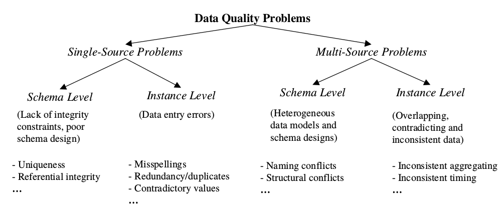

<!-- references -->

Source: Rahm, Erhard, and Hong Hai Do. [Data cleaning: Problems and current approaches](http://dc-pubs.dbs.uni-leipzig.de/files/Rahm2000DataCleaningProblemsand.pdf). IEEE Data Eng. Bull. 23.4 (2000): 3-13.

----
## Dirty Data: Example


*Problems with the data?*


----
## Data Cleaning Overview

* Data analysis / Error detection
  * Error types: e.g. schema constraints, referential integrity, duplication 
  * Single-source vs multi-source problems
  * Detection in input data vs detection in later stages (more context)
* Error repair
  * Repair data vs repair rules, one at a time or holistic
  * Data transformation or mapping
  * Automated vs human guided

----
## Schema in Relational Databases

```sql
CREATE TABLE employees (
    emp_no      INT             NOT NULL,
    birth_date  DATE            NOT NULL,
    name        VARCHAR(30)     NOT NULL,
    PRIMARY KEY (emp_no));
CREATE TABLE departments (
    dept_no     CHAR(4)         NOT NULL,
    dept_name   VARCHAR(40)     NOT NULL,
    PRIMARY KEY (dept_no), UNIQUE  KEY (dept_name));
CREATE TABLE dept_manager (
   dept_no      CHAR(4)         NOT NULL,
   emp_no       INT             NOT NULL,
   FOREIGN KEY (emp_no)  REFERENCES employees (emp_no),
   FOREIGN KEY (dept_no) REFERENCES departments (dept_no),
   PRIMARY KEY (emp_no,dept_no)); 
```

----
## Example: Apache Avro

```json
{   "type": "record",
    "namespace": "com.example",
    "name": "Customer",
    "fields": [{
            "name": "first_name",
            "type": "string",
            "doc": "First Name of Customer"
        },        
        {
            "name": "age",
            "type": "int",
            "doc": "Age at the time of registration"
        }
    ]
}
```

----
# Detecting Inconsistencies 


<!-- references -->
Image source: Theo Rekatsinas, Ihab Ilyas, and Chris Ré, “[HoloClean - Weakly Supervised Data Repairing](https://dawn.cs.stanford.edu/2017/05/12/holoclean/).” Blog, 2017.

----
## Association rule mining

* Sale 1: Bread, Milk
* Sale 2: Bread, Diaper, Beer, Eggs
* Sale 3: Milk, Diaper, Beer, Coke
* Sale 4: Bread, Milk, Diaper, Beer
* Sale 5: Bread, Milk, Diaper, Coke

Rules
* {Diaper, Beer} -> Milk (40% support, 66% confidence)
* Milk -> {Diaper, Beer} (40% support, 50% confidence)
* {Diaper, Beer} -> Bread (40% support, 66% confidence)

*(also useful tool for exploratory data analysis)*

<!-- references -->
Further readings: Standard algorithms and many variations, see [Wikipedia](https://en.wikipedia.org/wiki/Association_rule_learning)


----
## Data Linter at Google

* Miscoding
    * Number, date, time as string
    * Enum as real
    * Tokenizable string (long strings, all unique)
    * Zip code as number
* Outliers and scaling
    * Unnormalized feature (varies widely)
    * Tailed distributions
    * Uncommon sign
* Packaging
    * Duplicate rows
    * Empty/missing data

<!-- references -->
Further readings: Hynes, Nick, D. Sculley, and Michael Terry. [The data linter: Lightweight, automated sanity checking for ML data sets](http://learningsys.org/nips17/assets/papers/paper_19.pdf). NIPS MLSys Workshop. 2017.


----
## Drift & Model Decay

*in all cases, models are less effective over time*

* Concept drift
  * properties to predict change over time (e.g., what is credit card fraud)
  * over time: different expected outputs for same inputs
  * model has not learned the relevant concepts
* Data drift 
  * characteristics of input data changes (e.g., customers with face masks)
  * input data differs from training data 
  * over time: predictions less confident, further from training data
* Upstream data changes 
  * external changes in data pipeline (e.g., format changes in weather service)
  * model interprets input data incorrectly
  * over time: abrupt changes due to faulty inputs

**how to fix?**

Notes:
  * fix1: retrain with new training data or relabeled old training data
  * fix2: retrain with new data
  * fix3: fix pipeline, retrain entirely


----
## Watch for Degradation in Prediction Accuracy


<!-- references -->
Image source: Joel Thomas and Clemens Mewald. [Productionizing Machine Learning: From Deployment to Drift Detection](https://databricks.com/blog/2019/09/18/productionizing-machine-learning-from-deployment-to-drift-detection.html). Databricks Blog, 2019


----
## Detecting Data Drift

* Compare distributions over time (e.g., t-test)
* Detect both sudden jumps and gradual changes
* Distributions can be manually specified or learned (see invariant detection)

<!-- colstart -->

<!-- col -->

<!-- colend -->


----
## Snorkel


*Generative model* learns which labeling functions to trust and when (~ from correlations). Learns "expertise" of labeling functions.

Generative model used to provide *probabilistic* training labels. *Discriminative model* learned from labeled training data; generalizes beyond label functions. 


<!-- references -->

https://www.snorkel.org/, https://www.snorkel.org/blog/snorkel-programming; 
Ratner, Alexander, et al. "[Snorkel: rapid training data creation with weak supervision](https://link.springer.com/article/10.1007/s00778-019-00552-1)." The VLDB Journal 29.2 (2020): 709-730.

Note:
Emphasize the two different models. One could just let all labelers vote, but generative model identifies common correlations and disagreements and judges which labelers to trust when (also provides feedback to label function authors), resulting in better labels.

The generative model could already make predictions, but it is coupled tightly to the labeling functions. The discriminative model is a traditional model learned on labeled training data and thus (hopefully) generalizes beyond the labeling functions. It may actually pick up on very different signals. Typically this is more general and robust for unseen data.


----
## Data Programming Beyond Labeling Training Data

* Potentially useful in many other scenarios
* Data cleaning
* Data augmentation
* Identifying important data subsets
<!-- split -->


---
# Business Systems with Machine Learning

Molham Aref

---

# Managing and Processing Large Datasets

Christian Kaestner

<!-- references -->

Required reading: Martin Kleppmann. [Designing Data-Intensive Applications](https://dataintensive.net/). OReilly. 2017. Chapter 1

----

# Learning Goals

* Organize different data management solutions and their tradeoffs
* Explain the tradeoffs between batch processing and stream processing and the lambda architecture
* Recommend and justify a design and corresponding technologies for a given system

----
# Case Study


----

## "Zoom adding capacity"

<iframe src="https://giphy.com/embed/3oz8xtBx06mcZWoNJm" width="480" height="362" frameBorder="0" class="giphy-embed" allowFullScreen></iframe>

----
# Kinds of Data

* Training data
* Input data
* Telemetry data
* (Models)

*all potentially with huge total volumes and high throughput*

*need strategies for storage and processing*


----

## Document Data Models

```js
{
    "id": 1,
    "name": "Christian",
    "email": "kaestner@cs.",
    "dpt": [
        {"name": "ISR", "address": "..."}
    ],
    "other": { ... }
}

```

```js
db.getCollection('users').find({"name": "Christian"})
```

----
## Log files, unstructured data

```
2020-06-25T13:44:14,601844,GET /data/m/goyas+ghosts+2006/17.mpg
2020-06-25T13:44:14,935791,GET /data/m/the+big+circus+1959/68.mpg
2020-06-25T13:44:14,557605,GET /data/m/elvis+meets+nixon+1997/17.mpg
2020-06-25T13:44:14,140291,GET /data/m/the+house+of+the+spirits+1993/53.mpg
2020-06-25T13:44:14,425781,GET /data/m/the+theory+of+everything+2014/29.mpg
2020-06-25T13:44:14,773178,GET /data/m/toy+story+2+1999/59.mpg
2020-06-25T13:44:14,901758,GET /data/m/ignition+2002/14.mpg
2020-06-25T13:44:14,911008,GET /data/m/toy+story+3+2010/46.mpg
```


----
## Partitioning

Divide data:

* Horizontal partitioning: Different rows in different tables; e.g., movies by decade, hashing often used
* Vertical partitioning: Different columns in different tables; e.g., movie title vs. all actors

**Tradeoffs?**

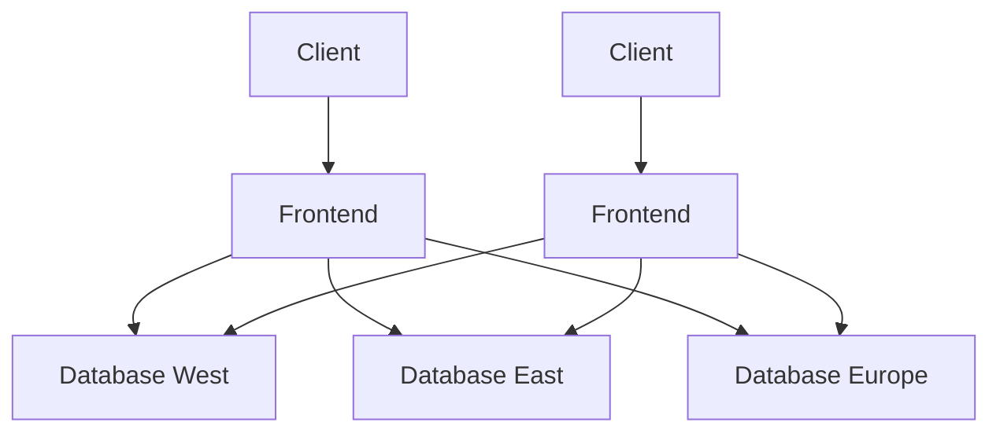
```mermaid
graph TD
    Client --> Frontend
    Client2[Client] --> Frontend2[Frontend]
    Frontend --> Database1[Database West]
    Frontend --> Database2[Database East]
    Frontend --> Database3[Database Europe]
    Frontend2 --> Database1
    Frontend2 --> Database2
    Frontend2 --> Database3
```


----
## Replication Strategies: Leaders and Followers

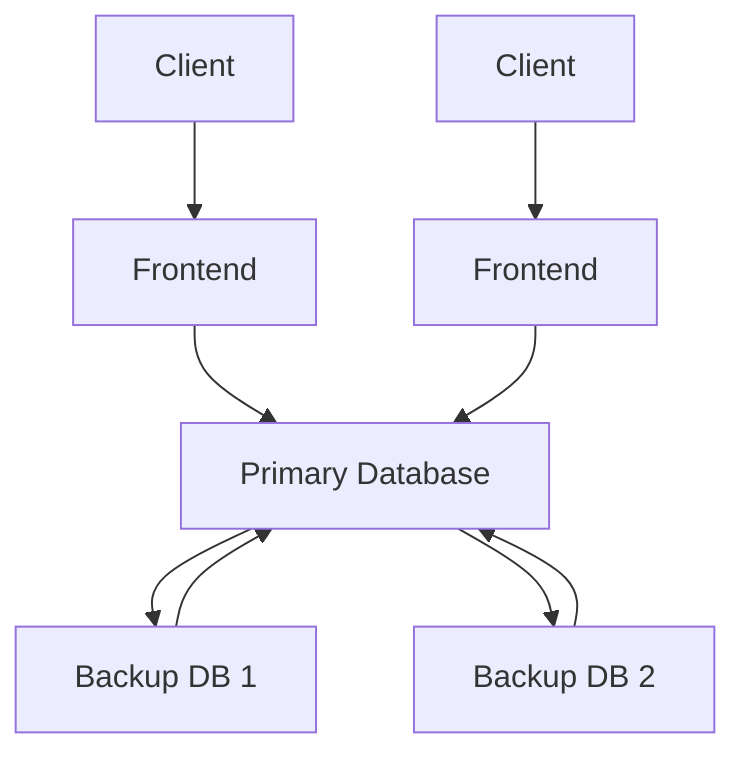
```mermaid
graph TD
    Client --> Frontend
    Frontend --> Database
    Client2[Client] --> Frontend2[Frontend]
    Frontend2 --> Database[Primary Database]
    Database --> Database2[Backup DB 1]
    Database --> Database3[Backup DB 2]
    Database2 --> Database
    Database3 --> Database
```

----
# Batch Processing

* Analyzing TB of data, typically distributed storage
* Filtering, sorting, aggregating
* Producing reports, models, ...

```sh
cat /var/log/nginx/access.log |
    awk '{print $7}' |
    sort |
    uniq -c |
    sort -r -n |
    head -n 5
```

----
## Distributed Batch Processing

* Process data locally at storage
* Aggregate results as needed
* Separate pluming from job logic

*MapReduce* as common framework


<!-- references -->
Image Source: Ville Tuulos (CC BY-SA 3.0)

----
## Key Design Principle: Data Locality

> Moving Computation is Cheaper than Moving Data -- [Hadoop Documentation](https://hadoop.apache.org/docs/stable/hadoop-project-dist/hadoop-hdfs/HdfsDesign.html#aMoving_Computation_is_Cheaper_than_Moving_Data)

* Data often large and distributed, code small
* Avoid transfering large amounts of data
* Perform computation where data is stored (distributed)
* Transfer only results as needed
* 
* "The map reduce way"

----

## Stream Processing

Like shell programs: Read from stream, produce output in other stream. Loose coupling


----
## Event Sourcing

* Append only databases
* Record edit events, never mutate data
* Compute current state from all past events, can reconstruct old state
* For efficiency, take state snapshots
* Similar to traditional database logs

```text
createUser(id=5, name="Christian", dpt="SCS")
updateUser(id=5, dpt="ISR")
deleteUser(id=5)
```

----
## Lambda Architecture and Machine Learning


<!-- .element: class="stretch" -->


* Learn accurate model in batch job
* Learn incremental model in stream processor

----

[](https://youtu.be/_bvrzYOA8dY?t=1452)

<!-- reference -->
Molham Aref "[Business Systems with Machine Learning](https://www.youtube.com/watch?v=_bvrzYOA8dY)"


----
## Data Warehousing (OLAP)

* Large denormalized databases with materialized views for large scale reporting queries
* e.g. sales database, queries for sales trends by region
* 
* Read-only except for batch updates: Data from OLTP systems loaded periodically, e.g. over night


Note: Image source: https://commons.wikimedia.org/wiki/File:Data_Warehouse_Feeding_Data_Mart.jpg

----
## Distributed Gradient Descent

[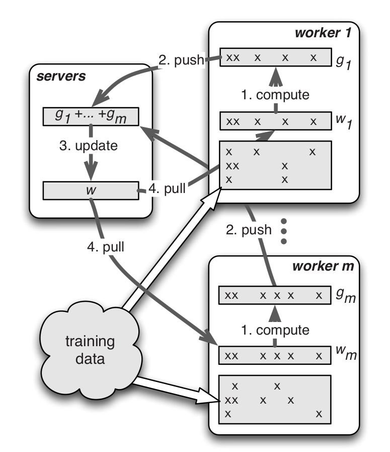](https://www.usenix.org/system/files/conference/osdi14/osdi14-paper-li_mu.pdf)
<!-- .element: class="stretch" -->


----
## Parameter Server Architecture

[](https://www.usenix.org/system/files/conference/osdi14/osdi14-paper-li_mu.pdf)
<!-- .element: class="stretch" -->

Note:
Multiple parameter servers that each only contain a subset of the parameters, and multiple workers that each require only a subset of each

Ship only relevant subsets of mathematical vectors and matrices, batch communication

Resolve conflicts when multiple updates need to be integrated (sequential, eventually, bounded delay)

Run more than one learning algorithm simulaneously

----
## Queuing Theory


----
## Profiling 

Mostly used during development phase in single components


----
## Performance Monitoring of Distributed Systems

[](distprofiler.png)

<!-- references -->
Source: https://blog.appdynamics.com/tag/fiserv/


---

# Infrastructure Quality, Deployment, and Operations

Christian Kaestner

<!-- references -->

Required reading: Eric Breck, Shanqing Cai, Eric Nielsen, Michael Salib, D. Sculley. [The ML Test Score: A Rubric for ML Production Readiness and Technical Debt Reduction](https://research.google.com/pubs/archive/46555.pdf). Proceedings of IEEE Big Data (2017)

Recommended readings:  Larysa Visengeriyeva. [Machine Learning Operations - A Reading List](https://ml-ops.org/content/references.html), InnoQ 2020

----

# Learning Goals

* Implement and automate tests for all parts of the ML pipeline
* Understand testing opportunities beyond functional correctness
* Automate test execution with continuous integration
* Deploy a service for models using container infrastructure
* Automate common configuration management tasks
* Devise a monitoring strategy and suggest suitable components for implementing it
* Diagnose common operations problems

----
## Possible Mistakes in ML Pipelines


Danger of "silent" mistakes in many phases

<!-- discussion -->


----
## From Manual Testing to Continuous Integration

<!-- colstart -->

<!-- col -->

<!-- colend -->

----
## Example: Mocking a DataCleaner Object

```java
DataTable getData(KafkaStream stream, DataCleaner cleaner) { ... }

@Test void test() {
    DataCleaner dummyCleaner = new DataCleaner() {
        int counter = 0;
        boolean isValid(String row) { 
            counter++;
            return counter!=3; 
        }
        ...
    }
    DataTable output = getData(testStream, dummyCleaner);
    assert(output.length==9)
}
```

Mocking frameworks provide infrastructure for expressing such tests compactly.


----
## Testing for Robustness

*manipulating the (controlled) environment: injecting errors into backend to test error handling*


```java
DataTable getData(Stream stream, DataCleaner cleaner) { ... }

@Test void test() {
    Stream testStream = new Stream() {
        ...
        public String getNext() {
            if (++idx == 3) throw new IOException();
            return data[++idx];
        }
    }
    DataTable output = retry(getData(testStream, ...));
    assert(output.length==10)
}
```


----


----
## Integration and system tests


----
[](https://blog.octo.com/en/jenkins-quality-dashboard-ios-development/)

<!-- references -->

Source: https://blog.octo.com/en/jenkins-quality-dashboard-ios-development/


----
## Test Monitoring in Production

* Like fire drills (manual tests may be okay!)
* Manual tests in production, repeat regularly
* Actually take down service or trigger wrong signal to monitor

----
## Chaos Testing


<!-- references -->

http://principlesofchaos.org

Notes: Chaos Engineering is the discipline of experimenting on a distributed system in order to build confidence in the system’s capability to withstand turbulent conditions in production. Pioneered at Netflix


----

## Case Study: Smart Phone Covid-19 Detection

<iframe width="90%" height="500" src="https://www.youtube.com/embed/e62ZL3dCQWM?start=42" frameborder="0" allow="accelerometer; autoplay; encrypted-media; gyroscope; picture-in-picture" allowfullscreen></iframe>

(from midterm; assume cloud or hybrid deployment)

----
## Data Tests

1. Feature expectations are captured in a schema.
2. All features are beneficial.
3. No feature’s cost is too much.
4. Features adhere to meta-level requirements.
5. The data pipeline has appropriate privacy controls.
6. New features can be added quickly.
7. All input feature code is tested.

<!-- references -->

Eric Breck, Shanqing Cai, Eric Nielsen, Michael Salib, D. Sculley. [The ML Test Score: A Rubric for ML Production Readiness and Technical Debt Reduction](https://research.google.com/pubs/archive/46555.pdf). Proceedings of IEEE Big Data (2017)

----
## Tests for Model Development

1. Model specs are reviewed and submitted.
2. Offline and online metrics correlate.
3. All hyperparameters have been tuned.
4. The impact of model staleness is known.
5. A simpler model is not better.
6. Model quality is sufficient on important data slices.
7. The model is tested for considerations of inclusion.

<!-- references -->

Eric Breck, Shanqing Cai, Eric Nielsen, Michael Salib, D. Sculley. [The ML Test Score: A Rubric for ML Production Readiness and Technical Debt Reduction](https://research.google.com/pubs/archive/46555.pdf). Proceedings of IEEE Big Data (2017)

----
## ML Infrastructure Tests

1. Training is reproducible.
2. Model specs are unit tested.
3. The ML pipeline is Integration tested.
4. Model quality is validated before serving.
5. The model is debuggable.
6. Models are canaried before serving.
7. Serving models can be rolled back.


<!-- references -->

Eric Breck, Shanqing Cai, Eric Nielsen, Michael Salib, D. Sculley. [The ML Test Score: A Rubric for ML Production Readiness and Technical Debt Reduction](https://research.google.com/pubs/archive/46555.pdf). Proceedings of IEEE Big Data (2017)

----
## Monitoring Tests

1. Dependency changes result in notification.
2. Data invariants hold for inputs.
3. Training and serving are not skewed.
4. Models are not too stale.
5. Models are numerically stable.
6. Computing performance has not regressed.
7. Prediction quality has not regressed.


<!-- references -->

Eric Breck, Shanqing Cai, Eric Nielsen, Michael Salib, D. Sculley. [The ML Test Score: A Rubric for ML Production Readiness and Technical Debt Reduction](https://research.google.com/pubs/archive/46555.pdf). Proceedings of IEEE Big Data (2017)

----
## Feature Interaction Examples


Notes: Flood control and fire control work independently, but interact on the same resource (water supply), where flood control may deactivate the water supply to the sprinkler system in case of a fire


----
## ML Models for Feature Extraction

*self driving car*

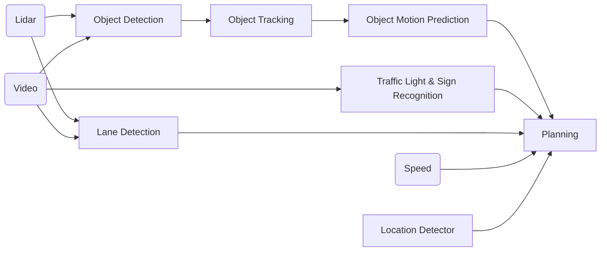
```mermaid
graph LR
  L(Lidar) --> PD
  L --> LD
  i(Video) --> PD[Object Detection] 
  PD --> OT[Object Tracking]
  OT --> MT[Object Motion Prediction]
  MT --> Planning
  i --> TL[Traffic Light & Sign Recognition]
  TL --> Planning
  i --> LD[Lane Detection]
  LD --> Planning
  S(Speed) --> Planning
  LDe[Location Detector] --> Planning
```

<!-- references -->
Example: Zong, W., Zhang, C., Wang, Z., Zhu, J., & Chen, Q. (2018). [Architecture design and implementation of an autonomous vehicle](https://ieeexplore.ieee.org/stamp/stamp.jsp?tp=&arnumber=8340798). IEEE access, 6, 21956-21970.


----
# Dev vs. Ops


<!-- .element: class="stretch" -->

----
## Developers


* Coding
* Testing, static analysis, reviews
* Continuous integration
* Bug tracking
* Running local tests and scalability experiments
* ...

<!-- split -->
## Operations

* Allocating hardware resources
* Managing OS updates
* Monitoring performance
* Monitoring crashes
* Managing load spikes, …
* Tuning database performance
* Running distributed at scale
* Rolling back releases
* ...

QA responsibilities in both roles


----
## Heavy tooling and automation

[](devops_tools.jpg)

----

<!-- references= -->
Source: https://www.slideshare.net/jmcgarr/continuous-delivery-at-netflix-and-beyond

----


----
## Docker Example

```docker
FROM ubuntu:latest
MAINTAINER ...
RUN apt-get update -y
RUN apt-get install -y python-pip python-dev build-essential
COPY . /app
WORKDIR /app
RUN pip install -r requirements.txt
ENTRYPOINT ["python"]
CMD ["app.py"]
```

<!-- references -->
Source: http://containertutorials.com/docker-compose/flask-simple-app.html

----
## Ansible Examples

* Software provisioning, configuration management, and application-deployment tool
* Apply scripts to many servers

<!-- colstart -->
```ini
[webservers]
web1.company.org
web2.company.org
web3.company.org

[dbservers]
db1.company.org
db2.company.org

[replication_servers]
...
```
<!-- col -->
```yml
# This role deploys the mongod processes and sets up the replication set.
- name: create data directory for mongodb
  file: path={{ mongodb_datadir_prefix }}/mongo-{{ inventory_hostname }} state=directory owner=mongod group=mongod
  delegate_to: '{{ item }}'
  with_items: groups.replication_servers

- name: create log directory for mongodb
  file: path=/var/log/mongo state=directory owner=mongod group=mongod

- name: Create the mongodb startup file
  template: src=mongod.j2 dest=/etc/init.d/mongod-{{ inventory_hostname }} mode=0655
  delegate_to: '{{ item }}'
  with_items: groups.replication_servers


- name: Create the mongodb configuration file
  template: src=mongod.conf.j2 dest=/etc/mongod-{{ inventory_hostname }}.conf
  delegate_to: '{{ item }}'
  with_items: groups.replication_servers

- name: Copy the keyfile for authentication
  copy: src=secret dest={{ mongodb_datadir_prefix }}/secret owner=mongod group=mongod mode=0400

- name: Start the mongodb service
  command: creates=/var/lock/subsys/mongod-{{ inventory_hostname }} /etc/init.d/mongod-{{ inventory_hostname }} start
  delegate_to: '{{ item }}'
  with_items: groups.replication_servers

- name: Create the file to initialize the mongod replica set
  template: src=repset_init.j2 dest=/tmp/repset_init.js

- name: Pause for a while
  pause: seconds=20

- name: Initialize the replication set
  shell: /usr/bin/mongo --port "{{ mongod_port }}" /tmp/repset_init.js
```
<!-- colend -->

----


<!-- references -->
CC BY-SA 4.0 [Khtan66](https://en.wikipedia.org/wiki/Kubernetes#/media/File:Kubernetes.png)


----


<!-- references -->
https://ml-ops.org/

----
## Tooling Landscape LF AI

[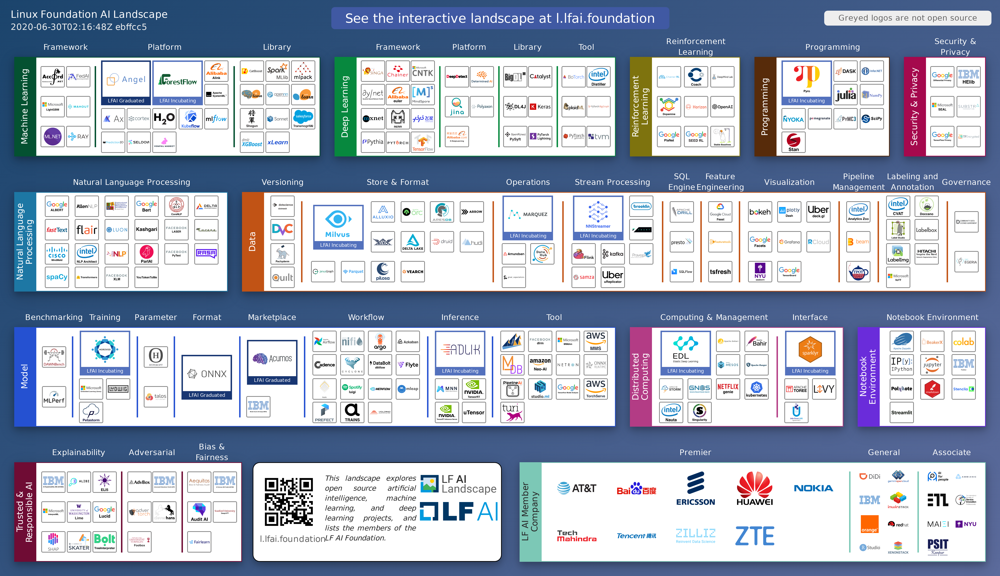](https://landscape.lfai.foundation/)

<!-- references -->
Linux Foundation AI Initiative


---

# Ethics & Fairness in AI-Enabled Systems

Christian Kaestner

(with slides from Eunsuk Kang)

<!-- references -->

Required reading: 🗎 R. Caplan, J. Donovan, L. Hanson, J.
Matthews. "[Algorithmic Accountability: A Primer](https://datasociety.net/wp-content/uploads/2019/09/DandS_Algorithmic_Accountability.pdf)", Data & Society
(2018).

----
# Learning Goals

* Review the importance of ethical considerations in designing AI-enabled systems
* Recall basic strategies to reason about ethical challenges
* Diagnose potential ethical issues in a given system
* Understand the types of harm that can be caused by ML
* Understand the sources of bias in ML
* Analyze a system for harmful feedback loops


----


<!-- split -->

*In September 2015, Shkreli received widespread criticism when Turing obtained the manufacturing license for the antiparasitic drug Daraprim and raised its price by a factor of 56 (from USD 13.5 to 750 per pill), leading him to be referred to by the media as "the most hated man in America" and "Pharma Bro".* -- [Wikipedia](https://en.wikipedia.org/wiki/Martin_Shkreli)

"*I could have raised it higher and made more profits for our shareholders. Which is my primary duty.*" -- Martin Shkreli


Note: Image source: https://en.wikipedia.org/wiki/Martin_Shkreli#/media/File:Martin_Shkreli_2016.jpg


----
## With a few lines of code...


[](https://www.vox.com/the-goods/2018/11/27/18115164/airline-flying-seat-assignment-ryanair)


----
## Safety

<div class="tweet" data-src="https://twitter.com/EmilyEAckerman/status/1186363305851576321"></div>


----
## Addiction

[](https://marker.medium.com/robinhood-has-gamified-online-trading-into-an-addiction-cc1d7d989b0c)


----

[](https://techcrunch.com/2014/06/29/ethics-in-a-data-driven-world/)


----
## Mental Health

[](https://www.healthline.com/health-news/social-media-use-increases-depression-and-loneliness)


----
## Society: Unemployment Engineering / Deskilling


Notes: The dangers and risks of automating jobs.

Discuss issues around automated truck driving and the role of jobs.

See for example: Andrew Yang. The War on Normal People. 2019


----
## Society: Polarization

[](https://www.wsj.com/articles/facebook-knows-it-encourages-division-top-executives-nixed-solutions-11590507499)
<!-- .element: class="stretch" -->


Notes: Recommendations for further readings: https://www.nytimes.com/column/kara-swisher, https://podcasts.apple.com/us/podcast/recode-decode/id1011668648

Also isolation, Cambridge Analytica, collaboration with ICE, ...

----
## Weapons, Surveillance, Suppression

<!-- colstart -->

<!-- col -->
[](https://www.washingtonpost.com/outlook/2019/01/17/how-us-surveillance-technology-is-propping-up-authoritarian-regimes/)
<!-- colend -->

----
## Discrimination

<div class="tweet" data-src="https://twitter.com/dhh/status/1192540900393705474"></div>


----
## Legally protected classes (US)

* Race (Civil Rights Act of 1964)
* Color (Civil Rights Act of 1964)
* Sex (Equal Pay Act of 1963; Civil Rights Act of 1964)
* Religion (Civil Rights Act of 1964)
* National origin (Civil Rights Act of 1964)
* Citizenship (Immigration Reform and Control Act)
* Age (Age Discrimination in Employment Act of 1967)
* Pregnancy (Pregnancy Discrimination Act)
* Familial status (Civil Rights Act of 1968)
* Disability status (Rehabilitation Act of 1973; Americans with Disabilities Act of 1990)
* Veteran status (Vietnam Era Veterans' Readjustment Assistance Act of 1974; Uniformed Services Employment and Reemployment Rights Act)
* Genetic information (Genetic Information Nondiscrimination Act)

<!-- references -->
Barocas, Solon and Moritz Hardt. "[Fairness in machine learning](https://mrtz.org/nips17/#/)." NIPS Tutorial 1 (2017).

----


----
## Harms of Allocation

* Withhold opportunities or resources
* Poor quality of service, degraded user experience for certain groups


**Other examples?**

<!-- references -->

_[Gender Shades: Intersectional Accuracy Disparities in
Commercial Gender Classification](http://proceedings.mlr.press/v81/buolamwini18a/buolamwini18a.pdf)_, Buolamwini & Gebru, ACM FAT* (2018).

----
## Harms of Representation

* Reinforce stereotypes, subordination along the lines of identity


**Other examples?**

<!-- references -->

Latanya Sweeney. [Discrimination in Online Ad Delivery](https://dl.acm.org/doi/pdf/10.1145/2460276.2460278), SSRN (2013).

----
## Case Study: College Admission


* Objective: Decide "Is this student likely to succeed"?
* Possible harms: Allocation of resources? Quality of service?
  Stereotyping? Denigration? Over-/Under-representation?

----
## Not all discrimination is harmful


* Loan lending: Gender discrimination is illegal.
* Medical diagnosis: Gender-specific diagnosis may be desirable.
* Discrimination is a __domain-specific__ concept!

**Other examples?**


----
##  Where does the bias come from?


<!-- references -->

Caliskan et al., _[Semantics derived automatically from language corpora contain
human-like biases](http://cs.bath.ac.uk/~jjb/ftp/CaliskanEtAl-authors-full.pdf)_, Science (2017).


----
## Historical Bias

*Data reflects past biases, not intended outcomes*


Note: "An example of this type of bias can be found in a 2018 image search
result where searching for women CEOs ultimately resulted in fewer female CEO images due
to the fact that only 5% of Fortune 500 CEOs were woman—which would cause the search
results to be biased towards male CEOs. These search results were of course reflecting
the reality, but whether or not the search algorithms should reflect this reality is an issue worth
considering."


----
## Tainted Examples

*Samples or labels reflect human bias*


Note:
* Bias in the dataset caused by humans
* Some labels created manually by employers
* Dataset "tainted" by biased human judgement


----
## Skewed Sample

*Crime prediction for policing strategy*


Note: Initial bias in the data set, amplified 
through feedback loop

Other example: Street Bump app in Boston (2012) to detect potholes while driving favors areas with higher smartphone adoption


----
## Sample Size Disparity

*Less training data available for certain subpopulations*


Example: "Shirley Card" used for color calibration

Note:
* Less data available for certain parts of the population
* Example: "Shirley Card"
    * Used by Kodak for color calibration in photo films
    * Most "Shirley Cards" used Caucasian models
    * Poor color quality for other skin tones


----
# Massive Potential Damage


<!-- .element: class="stretch" -->

O'Neil, Cathy. [Weapons of math destruction: How big data increases inequality and threatens democracy](https://cmu.primo.exlibrisgroup.com/permalink/01CMU_INST/6lpsnm/alma991016462699704436). Broadway Books, 2016.

----
## Feedback Loops

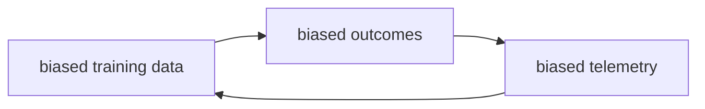
```mermaid
graph LR
  t[biased training data] --> o[biased outcomes]
  o --> m[biased telemetry] 
  m --> t
```

> "Big Data processes codify the past.  They do not invent the future.  Doing that requires moral imagination, and that’s something only humans can provide. " -- Cathy O'Neil in [Weapons of Math Destruction](https://cmu.primo.exlibrisgroup.com/permalink/01CMU_INST/6lpsnm/alma991016462699704436)


---

# Building Fairer AI-Enabled Systems

Christian Kaestner

(with slides from Eunsuk Kang)

<!-- references -->

Required reading: 🗎 Holstein, Kenneth, Jennifer Wortman Vaughan, Hal Daumé III, Miro Dudik, and Hanna Wallach. "[Improving fairness in machine learning systems: What do industry practitioners need?](http://users.umiacs.umd.edu/~hal/docs/daume19fairness.pdf)" In Proceedings of the 2019 CHI Conference on Human Factors in Computing Systems, pp. 1-16. 2019.

Recommended reading: 🗎 Corbett-Davies, Sam, and Sharad Goel. "[The measure and mismeasure of fairness: A critical review of fair machine learning](https://arxiv.org/pdf/1808.00023.pdf)." arXiv preprint arXiv:1808.00023 (2018).

Also revisit: 🗎 Vogelsang, Andreas, and Markus Borg. "[Requirements Engineering for Machine Learning: Perspectives from Data Scientists](https://arxiv.org/pdf/1908.04674.pdf)." In Proc. of the 6th International Workshop on Artificial Intelligence for Requirements Engineering (AIRE), 2019.  

----
# Learning Goals

* Understand different definitions of fairness
* Discuss methods for measuring fairness
* Design and execute tests to check for bias/fairness issues
* Understand fairness interventions during data acquisition
* Apply engineering strategies to build more fair systems
* Diagnose potential ethical issues in a given system
* Evaluate and apply mitigation strategies


----
# Two parts

<!-- colstart -->
**Fairness assessment in the model**

Formal definitions of fairness properties

Testing a model's fairness

Constraining a model for fairer results

<!-- col -->
**System-level fairness engineering**

Requirements engineering

Fairness and data acquisition

Team and process considerations
<!-- colend -->


----
### Fairness is still an actively studied & disputed concept!


<!-- references -->
Source: Mortiz Hardt, https://fairmlclass.github.io/

----
## Fairness through Blindness

*Anti-classification: Ignore/eliminate sensitive attributes from dataset, e.g., remove gender and race from a credit card scoring system*


**Advantages? Problems?**

----
## Testing Anti-Classification

Straightforward invariant for classifier $f$ and protected attribute $p$: 

$\forall x. f(x[p\leftarrow 0]) = f(x[p\leftarrow 1])$

*(does not account for correlated attributes)*

Test with random input data (see prior lecture on [Automated Random Testing](https://ckaestne.github.io/seai/S2020/slides/04_modelquality/modelquality.html#/10)) or on any test data

Any single inconsistency shows that the protected attribute was used. Can also report percentage of inconsistencies.

<!-- references -->
See for example: Galhotra, Sainyam, Yuriy Brun, and Alexandra Meliou. "[Fairness testing: testing software for discrimination](http://people.cs.umass.edu/brun/pubs/pubs/Galhotra17fse.pdf)." In Proceedings of the 2017 11th Joint Meeting on Foundations of Software Engineering, pp. 498-510. 2017.


----
# Classification Parity

Classification error is equal across groups


<!-- reference -->
Barocas, Solon, Moritz Hardt, and Arvind Narayanan. "[Fairness and machine learning: Limitations and Opportunities](https://fairmlbook.org/classification.html)." (2019), Chapter 2

----
## Independence 

(aka _statistical parity_, _demographic parity_, _disparate impact_, _group fairness_)

$P[R = 1 | A = 0]  = P[R = 1 | A = 1]$ or $R \perp A$

* *Acceptance rate* (i.e., percentage of positive predictions) must be the same across all groups
* Prediction must be independent of the sensitive attribute
* Example: 
  * The predicted rate of recidivism is the same across all races
  * Chance of promotion the same across all genders


----
## Exercise: Cancer Diagnosis


* 1000 data samples (500 male & 500 female patients)
* What's the overall recall & precision?
* Does the model achieve *independence*


----
## Calibration to Achieve Independence

Select different thresholds for different groups to achieve prediction parity:

$P[R > t_0 | A = 0]  = P[R > t_1 | A = 1]$


Lowers bar for some groups -- equity, not equality


----
## Separation / Equalized Odds

*Prediction must be independent of the sensitive attribute  _conditional_ on the target variable:* $R \perp A | Y$

Same true positive rate across groups:

$P[R=0∣Y=1,A=0] = P[R=0∣Y=1,A=1]$

And same false positive rate across groups:

$P[R=1∣Y=0,A=0] = P[R=1∣Y=0,A=1]$

Example: A person with good credit behavior score should be assigned a
    good score with the same probability regardless of gender


----


----
## Review of Criteria so far:

*Recidivism scenario: Should a person be detained?*

* Anti-classification: ?
* Independence: ?
* Separation: ?

<!-- split -->


 
----
## Can we achieve fairness during the learning process?

* Data acquisition:
  - Collect additional data if performance is poor on some groups
* Pre-processing:
  * Clean the dataset to reduce correlation between the feature set
    and sensitive attributes
* Training-time constraint
  * ML is a constraint optimization problem (minimize errors)
  * Impose additional parity constraint into ML optimization process (e.g., as part of the loss function)
* Post-processing
  * Adjust the learned model to be uncorrelated with sensitive attributes
  * Adjust thresholds
* (Still active area of research! Many new techniques published each year)

----
## Trade-offs: Accuracy vs Fairness


* Fairness constraints possible models
* Fairness constraints often lower accuracy for some group

<!-- references -->

_Fairness Constraints: Mechanisms for Fair Classification_, Zafar et
al., AISTATS (2017).

----
## Picking Fairness Criteria

* Requirements engineering problem!
* What's the goal of the system? What do various stakeholders want? How to resolve conflicts?

[](fairnesstree.png)
<!-- .element: class="stretch" -->


http://www.datasciencepublicpolicy.org/projects/aequitas/


 

----
## Fairness must be considered throughout the ML lifecycle!


<!-- references -->

_Fairness-aware Machine Learning_, Bennett et al., WSDM Tutorial (2019).

----
## Practitioner Challenges

* Fairness is a system-level property
  - consider goals, user interaction design, data collection, monitoring, model interaction (properties of a single model may not matter much)
* Fairness-aware data collection, fairness testing for training data
* Identifying blind spots
  - Proactive vs reactive
  - Team bias and (domain-specific) checklists
* Fairness auditing processes and tools
* Diagnosis and debugging (outlier or systemic problem? causes?)
* Guiding interventions (adjust goals? more data? side effects? chasing mistakes? redesign?)
* Assessing human bias of humans in the loop


<!-- references -->
Holstein, Kenneth, Jennifer Wortman Vaughan, Hal Daumé III, Miro Dudik, and Hanna Wallach. "[Improving fairness in machine learning systems: What do industry practitioners need?](http://users.umiacs.umd.edu/~hal/docs/daume19fairness.pdf)" In Proceedings of the 2019 CHI Conference on Human Factors in Computing Systems, pp. 1-16. 2019.


----
## The Role of Requirements Engineering

* Identify system goals
* Identify legal constraints
* Identify stakeholders and fairness concerns
* Analyze risks with regard to discrimination and fairness
* Analyze possible feedback loops (world vs machine)
* Negotiate tradeoffs with stakeholders
* Set requirements/constraints for data and model
* Plan mitigations in the system (beyond the model)
* Design incident response plan
* Set expectations for offline and online assurance and monitoring


----
## Best Practices: Task Definition

* Clearly define the task & model’s intended effects
* Try to identify and document unintended effects & biases
* Clearly define any fairness requirements
* *Involve diverse stakeholders & multiple perspectives*
* Refine the task definition & be willing to abort

<!-- references -->

Swati Gupta, Henriette Cramer, Kenneth Holstein, Jennifer Wortman Vaughan, Hal Daumé III, Miroslav Dudík, Hanna Wallach, Sravana Reddy, Jean GarciaGathright. [Challenges of incorporating algorithmic fairness into practice](https://www.youtube.com/watch?v=UicKZv93SOY), FAT* Tutorial, 2019. ([slides](https://bit.ly/2UaOmTG))


----
*Bias can be introduced at any stage of the data pipeline*


<!-- references -->

Bennett et al., [Fairness-aware Machine Learning](https://sites.google.com/view/wsdm19-fairness-tutorial), WSDM Tutorial (2019).


----
## Data Sheets 


* A process for documenting datasets
* Based on common practice in the electronics industry, medicine
* Purpose, provenance, creation, composition, distribution: Does the dataset relate to people? Does the dataset identify any subpopulations?

<!-- references -->

_[Datasheets for Dataset](https://arxiv.org/abs/1803.09010)_, Gebru et al., (2019). 

----
## Model Cards

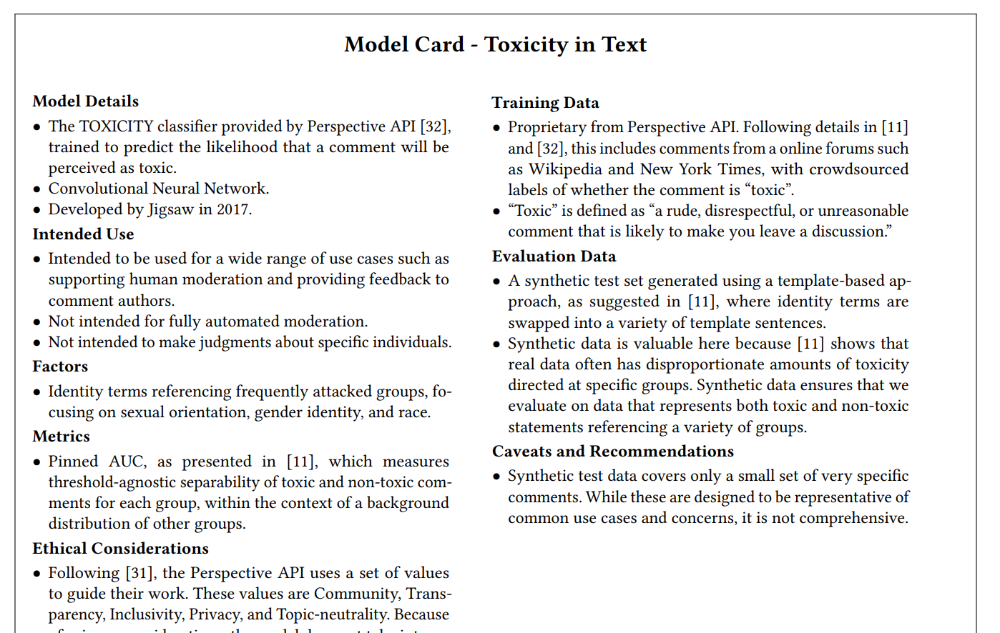
<!-- .element: class="stretch" -->


see also https://modelcards.withgoogle.com/about

Mitchell, Margaret, et al. "[Model cards for model reporting](https://www.seas.upenn.edu/~cis399/files/lecture/l22/reading2.pdf)." In Proceedings of the Conference on fairness, accountability, and transparency, pp. 220-229. 2019.


---


# Interpretability and Explainability

Christian Kaestner


<!-- references -->

Required reading: 🎧 Data Skeptic Podcast Episode “[Black Boxes are not Required](https://dataskeptic.com/blog/episodes/2020/black-boxes-are-not-required)” with Cynthia Rudin (32min) or 🗎 Rudin, Cynthia. "[Stop explaining black box machine learning models for high stakes decisions and use interpretable models instead](https://arxiv.org/abs/1811.10154)." Nature Machine Intelligence 1, no. 5 (2019): 206-215.  

Recommended supplementary reading: 🕮 Christoph Molnar. "[Interpretable Machine Learning: A Guide for Making Black Box Models Explainable](https://christophm.github.io/interpretable-ml-book/)." 2019
----
# Learning Goals

* Understand the importance of and use cases for interpretability
* Explain the tradeoffs between inherently interpretable models and post-hoc explanations
* Measure interpretability of a model
* Select and apply techniques to debug/provide explanations for data, models and model predictions
* Eventuate when to use interpretable models rather than ex-post explanations

----
## Detecting Anomalous Commits

[](nodejs-unusual-commit.png)
<!-- .element: class="stretch" -->


Goyal, Raman, Gabriel Ferreira, Christian Kästner, and James Herbsleb. "[Identifying unusual commits on GitHub](https://www.cs.cmu.edu/~ckaestne/pdf/jsep17.pdf)." Journal of Software: Evolution and Process 30, no. 1 (2018): e1893.

----
## Is this recidivism model fair?

```
IF age between 18–20 and sex is male THEN predict arrest
ELSE 
IF age between 21–23 and 2–3 prior offenses THEN predict arrest
ELSE 
IF more than three priors THEN predict arrest
ELSE predict no arrest
```

<!-- references -->

Rudin, Cynthia. "[Stop explaining black box machine learning models for high stakes decisions and use interpretable models instead](https://arxiv.org/abs/1811.10154)." Nature Machine Intelligence 1, no. 5 (2019): 206-215.  

----
## What factors go into predicting stroke risk?


Rudin, Cynthia, and Berk Ustun. "[Optimized scoring systems: Toward trust in machine learning for healthcare and criminal justice](https://users.cs.duke.edu/~cynthia/docs/WagnerPrizeCurrent.pdf)." Interfaces 48, no. 5 (2018): 449-466.

----
## Is there an actual problem? How to find out?

<div class="tweet" data-src="https://twitter.com/dhh/status/1192540900393705474"></div>

----
## What's happening here?


<!-- .element: class="stretch" -->

----
## Legal Requirements


> The European Union General Data Protection Regulation extends the automated decision-making rights in the 1995 Data Protection Directive to provide a legally disputed form of a right to an explanation: "[the data subject should have] the right ... to obtain an explanation of the decision reached"
 
> US Equal Credit Opportunity Act requires to notify applicants of action taken with specific reasons: "The statement of reasons for adverse action required by paragraph (a)(2)(i) of this section must be specific and indicate the principal reason(s) for the adverse action."

<!-- references -->

See also https://en.wikipedia.org/wiki/Right_to_explanation

----
## Debugging

* Why did the system make a wrong prediction in this case?
* What does it actually learn?
* What kind of data would make it better?
* How reliable/robust is it?
* How much does the second model rely on the outputs of the first?
* Understanding edge cases

----
## Curiosity, learning, discovery, science

* What drove our past hiring decisions? Who gets promoted around here?
* What factors influence cancer risk? Recidivism?
* What influences demand for bike rentals?
* Which organizations are successful at raising donations and why?


----
## Interpretability Definitions 

> Interpretability is the degree to which a human can understand the cause of a decision

> Interpretability is the degree to which a human can consistently predict the model’s result.

(No mathematical definition)


----
## Good Explanations are contrastive

Counterfactuals. *Why this, rather than a different prediction?*

> Your loan application has been *declined*. If your *savings account* had had more than $100 your loan application would be *accepted*.

Partial explanations often sufficient in practice if contrastive


----
## Inherently Interpretable Models: Sparse Linear Models

$f(x) = \alpha + \beta_1 x_1 + ... + \beta_n x_n$

Truthful explanations, easy to understand for humans

Easy to derive contrastive explanation and feature importance

Requires feature selection/regularization to minimize to few important features (e.g. Lasso); possibly restricting possible parameter values


<!-- .element: class="stretch" -->
 
----
## Inherently Interpretable Models: Decision Trees 

Easy to interpret up to a size

Possible to derive counterfactuals and feature importance

Unstable with small changes to training data


```
IF age between 18–20 and sex is male THEN predict arrest
ELSE IF age between 21–23 and 2–3 prior offenses THEN predict arrest
ELSE IF more than three priors THEN predict arrest
ELSE predict no arrest
```


----
# Post-Hoc Explanations of Black-Box Models


(large research field, many approaches, much recent research)


<!-- references -->
Figure: Lundberg, Scott M., and Su-In Lee. [A unified approach to interpreting model predictions](http://papers.nips.cc/paper/7062-a-unified-approach-to-interpreting-model-predictions.pdf). Advances in Neural Information Processing Systems. 2017.


Christoph Molnar. "[Interpretable Machine Learning: A Guide for Making Black Box Models Explainable](https://christophm.github.io/interpretable-ml-book/)." 2019

----
## Global Surrogates

1. Select dataset X (previous training set or new dataset from same distribution)
2. Collect model predictions for every value ($y_i=f(x_i)$)
3. Train inherently interpretable model $g$ on (X,Y)
4. Interpret surrogate model $g$


Can measure how well $g$ fits $f$ with common model quality measures, typically $R^2$

**Advantages? Disadvantages?**

Notes:
Flexible, intuitive, easy approach, easy to compare quality of surrogate model with validation data ($R^2$).
But: Insights not based on real model; unclear how well a good surrogate model needs to fit the original model; surrogate may not be equally good for all subsets of the data; illusion of interpretability.
Why not use surrogate model to begin with?


----
## Lime Example


<!-- references -->
Source: 
Christoph Molnar. "[Interpretable Machine Learning: A Guide for Making Black Box Models Explainable](https://christophm.github.io/interpretable-ml-book/)." 2019

Note: Model distinguishes blue from gray area. Surrogate model learns only a while line for the nearest decision boundary, which may be good enough for local explanations.


----
## Partial Dependence Plot Example

*Bike rental in DC*


<!-- .element: class="stretch" -->

Source: 
Christoph Molnar. "[Interpretable Machine Learning](https://christophm.github.io/interpretable-ml-book/)." 2019


----
## Individual Conditional Expectation (ICE)

*Similar to PDP, but not averaged; may provide insights into interactions*

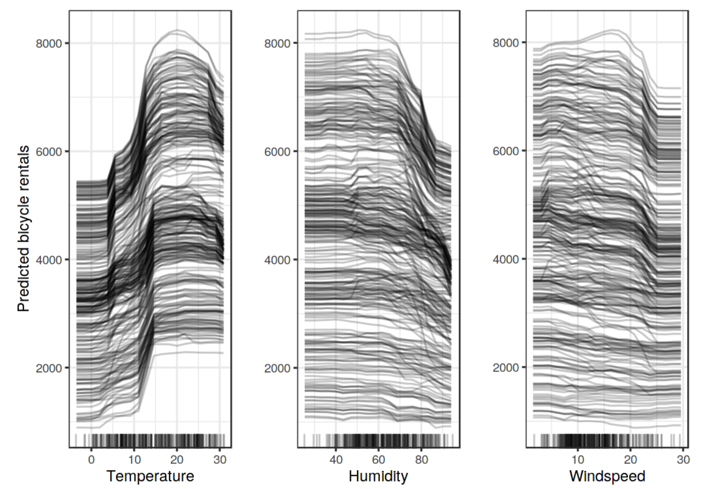
<!-- .element: class="stretch" -->

Source: 
Christoph Molnar. "[Interpretable Machine Learning](https://christophm.github.io/interpretable-ml-book/)." 2019


----
## Feature Importance Example


<!-- .element: class="stretch" -->


Source: 
Christoph Molnar. "[Interpretable Machine Learning](https://christophm.github.io/interpretable-ml-book/)." 2019


----
## Example: Anchors


<!-- references -->
Source: Ribeiro, Marco Tulio, Sameer Singh, and Carlos Guestrin. "[Anchors: High-precision model-agnostic explanations](https://www.aaai.org/ocs/index.php/AAAI/AAAI18/paper/download/16982/15850)." In Thirty-Second AAAI Conference on Artificial Intelligence. 2018.


----
## Example: Anchors


<!-- references -->
Source: Ribeiro, Marco Tulio, Sameer Singh, and Carlos Guestrin. "[Anchors: High-precision model-agnostic explanations](https://www.aaai.org/ocs/index.php/AAAI/AAAI18/paper/download/16982/15850)." In Thirty-Second AAAI Conference on Artificial Intelligence. 2018.
----
## Counterfactual Explanations

*if X had not occured, Y would not have happened*

> Your loan application has been *declined*. If your *savings account* had had more than $100 your loan application would be *accepted*.


-> Smallest change to feature values that result in given output


----
## Multiple Counterfactuals

Often long or multiple explanations

> Your loan application has been *declined*. If your *savings account* ...

> Your loan application has been *declined*. If your lived in ...

Report all or select "best" (e.g. shortest, most actionable, likely values)

<!-- split -->


(Rashomon effect)

----
## Gaming/Attacking the Model with Explanations?

*Does providing an explanation allow customers to 'hack' the system?*

* Loan applications?
* Apple FaceID?
* Recidivism?
* Auto grading?
* Cancer diagnosis?
* Spam detection?

<!-- split -->

<!-- discussion -->

----
## Gaming the Model with Explanations?

<iframe width="800" height="500" src="https://www.youtube.com/embed/w6rx-GBBwVg?start=147" frameborder="0" allow="accelerometer; autoplay; encrypted-media; gyroscope; picture-in-picture" allowfullscreen></iframe>

----
## Example: Prototypes and Criticisms


<!-- references -->
Source: 
Christoph Molnar. "[Interpretable Machine Learning: A Guide for Making Black Box Models Explainable](https://christophm.github.io/interpretable-ml-book/)." 2019

----
## Example: Influential Instance


<!-- .element: class="stretch" -->

Source: 
Christoph Molnar. "[Interpretable Machine Learning](https://christophm.github.io/interpretable-ml-book/)." 2019

----
## What distinguishes an influential instance from a non-influential instance?

Compute influence of every data point and create new model to explain influence in terms of feature values

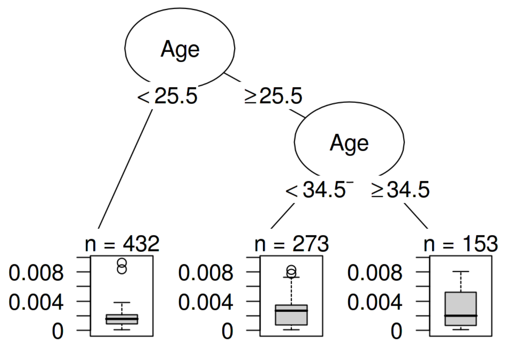
<!-- .element: class="stretch" -->
(cancer prediction example)

*Which features have a strong influence but little support in the training data?*


Source: 
Christoph Molnar. "[Interpretable Machine Learning](https://christophm.github.io/interpretable-ml-book/)." 2019

Note: Example from cancer prediction. The influence analysis tells us that the model becomes increasingly unstable when
predicting cancer for higher ages. This means
that errors in these instances can have a strong effect on the model.

----


<!-- split -->

<!-- split -->


Tell the user when a lack of data might mean they’ll need to use their own judgment. Don’t be afraid to admit when a lack of data could affect the quality of the AI recommendations.

<!-- references -->
Source:
[People + AI Guidebook](https://pair.withgoogle.com/research/), Google


----
## Case Study: Facebook's Feed Curation


<!-- references -->

Eslami, Motahhare, Aimee Rickman, Kristen Vaccaro, Amirhossein Aleyasen, Andy Vuong, Karrie Karahalios, Kevin Hamilton, and Christian Sandvig. [I always assumed that I wasn't really that close to [her]: Reasoning about Invisible Algorithms in News Feeds](http://eslamim2.web.engr.illinois.edu/publications/Eslami_Algorithms_CHI15.pdf). In Proceedings of the 33rd annual ACM conference on human factors in computing systems, pp. 153-162. ACM, 2015.


----
## Case Study: HR Application Screening


<div class="tweet" data-src="https://twitter.com/TheWrongNoel/status/1194842728862892033"></div>


----
# "Stop explaining black box machine learning models for high stakes decisions and use interpretable models instead."

<!-- references -->
Cynthia Rudin (32min) or 🗎 Rudin, Cynthia. "[Stop explaining black box machine learning models for high stakes decisions and use interpretable models instead](https://arxiv.org/abs/1811.10154)." Nature Machine Intelligence 1, no. 5 (2019): 206-215. 


----


----
[](https://www.forbes.com/sites/cognitiveworld/2020/03/01/this-is-the-year-of-ai-regulations/#1ea2a84d7a81)


---

# Versioning, Provenance, and Reproducability

Christian Kaestner

<!-- references -->

Required reading: 🗎 Halevy, Alon, Flip Korn, Natalya F. Noy, Christopher Olston, Neoklis Polyzotis, Sudip Roy, and Steven Euijong Whang. [Goods: Organizing google's datasets](http://research.google.com/pubs/archive/45390.pdf). In Proceedings of the 2016 International Conference on Management of Data, pp. 795-806. ACM, 2016. and 
🕮 Hulten, Geoff. "[Building Intelligent Systems: A Guide to Machine Learning Engineering.](https://www.buildingintelligentsystems.com/)" Apress, 2018, Chapter 21 (Organizing Intelligence).

----

# Learning Goals

* Judge the importance of data provenance, reproducibility and explainability for a given system
* Create documentation for data dependencies and provenance in a given system
* Propose versioning strategies for data and models
* Design and test systems for reproducibility


----

<div class="tweet" data-src="https://twitter.com/dhh/status/1192945019230945280"></div>

----
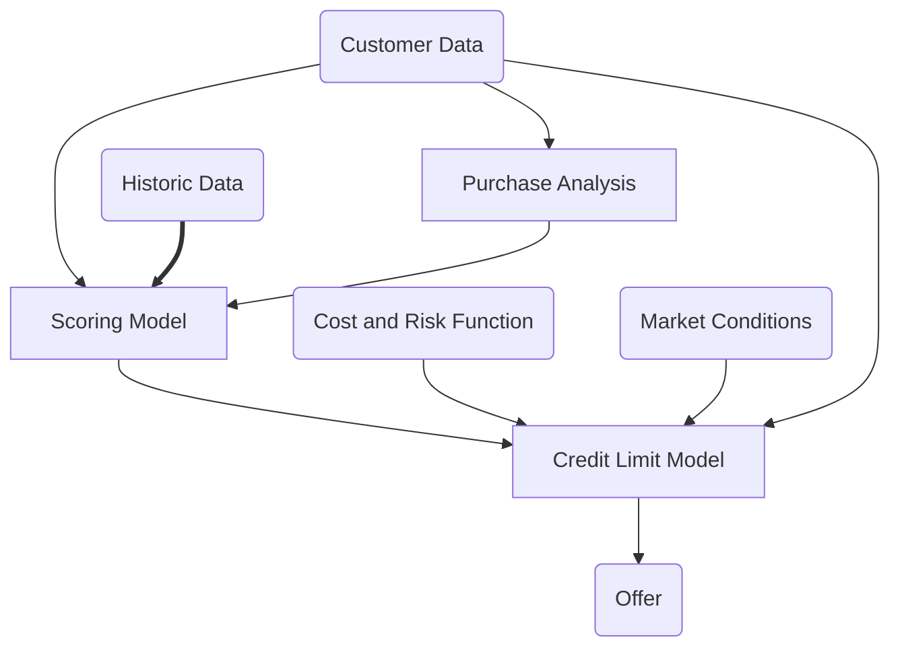
```mermaid
graph TD
  i(Customer Data) --> s[Scoring Model]
  h(Historic Data) ==> s
  i --> p[Purchase Analysis]
  p --> s
  s --> l[Credit Limit Model]
  c(Cost and Risk Function) --> l
  m(Market Conditions) --> l
  l --> o(Offer)
  i --> l
```


----

## Data Provenance

* Track origin of all data
    - Collected where?
    - Modified by whom, when, why?
    - Extracted from what other data or model or algorithm?
* ML models often based on data drived from many sources through many steps, including other models

----
## Versioning Datasets 

* Store copies of entire datasets (like Git)
* Store deltas between datasets (like Mercurial)
* Offsets in append-only database (like Kafka offset)
* History of individual database records (e.g. S3 bucket versions)
    - some databases specifically track provenance (who has changed what entry when and how)
    - specialized data science tools eg [Hangar](https://github.com/tensorwerk/hangar-py) for tensor data
* Version pipeline to recreate derived datasets ("views", different formats)
    - e.g. version data before or after cleaning?
*
* Often in cloud storage, distributed
* Checksums often used to uniquely identify versions
* Version also metadata

----
## Versioning Pipelines

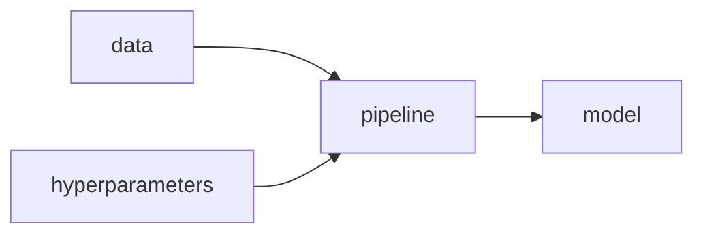
```mermaid
graph LR
  data --> pipeline
  hyperparameters --> pipeline
  pipeline --> model
```


----
## Example: DVC 

```sh
dvc add images
dvc run -d images -o model.p cnn.py
dvc remote add myrepo s3://mybucket
dvc push
```

* Tracks models and datasets, built on Git
* Splits learning into steps, incrementalization
* Orchestrates learning in cloud resources


https://dvc.org/

----
## Example: ModelDB

<iframe width="560" height="315" src="https://www.youtube.com/embed/gxBb4CjJcxQ" frameborder="0" allow="accelerometer; autoplay; encrypted-media; gyroscope; picture-in-picture" allowfullscreen></iframe>

https://github.com/mitdbg/modeldb

----
## Example: MLFlow

* Instrument pipeline with *logging* statements
* Track individual runs, hyperparameters used, evaluation results, and model files


<!-- references -->

Matei Zaharia. [Introducing MLflow: an Open Source Machine Learning Platform](https://databricks.com/blog/2018/06/05/introducing-mlflow-an-open-source-machine-learning-platform.html), 2018


----
## Definitions

* **Reproducibility:** the ability of an experiment to be repeated with minor differences from the original
experiment, while achieving the same qualitative result
* **Replicability:** ability to reproduce results exactly,
achieving the same quantitative result; requires determinism
* 
* In science, reproducing results under different conditions are valuable to gain confidence
    - "conceptual replication": evaluate same hypothesis with different experimental procedure or population
    - many different forms distinguished "_..._ replication" (e.g. close, direct, exact, independent, literal, nonexperiemental, partial, retest, sequential, statistical, varied, virtual)

<!-- references -->

Juristo, Natalia, and Omar S. Gómez. "[Replication of software engineering experiments](https://www.researchgate.net/profile/Omar_S_Gomez/publication/221051163_Replication_of_Software_Engineering_Experiments/links/5483c83c0cf25dbd59eb1038/Replication-of-Software-Engineering-Experiments.pdf)." In Empirical software engineering and verification, pp. 60-88. Springer, Berlin, Heidelberg, 2010.


----
## Nondeterminism

* Some machine learning algorithms are nondeterministic
    - Recall: Neural networks initialized with random weights
    - Recall: Distributed learning
* Many notebooks and pipelines contain nondeterminism
  - Depend on snapshot of online data (e.g., stream)
  - Depend on current time
  - Initialize random seed
* Different library versions installed on the machine may affect results
* (Inference for a given model is usually deterministic)


---

# Security, Adversarial Learning, and Privacy

Christian Kaestner

with slides from Eunsuk Kang

<!-- references -->

Required reading: 
🕮 Hulten, Geoff. "Building Intelligent Systems: A Guide to Machine Learning Engineering." (2018), Chapter 25 (Adversaries and Abuse)
🕮 Agrawal, A., Gans, J., & Goldfarb, A. (2018). [*Prediction machines: the simple economics of artificial intelligence*](https://cmu.primo.exlibrisgroup.com/permalink/01CMU_INST/6lpsnm/alma991019698987304436). Harvard Business Press. Chapter 19 (Managing AI Risk)

Recommended reading: 
🗎 Goodfellow, I., McDaniel, P., & Papernot, N. (2018). [Making machine learning robust against adversarial inputs](https://par.nsf.gov/servlets/purl/10111674). *Communications of the ACM*, *61*(7), 56-66. 
🗎 Huang, L., Joseph, A. D., Nelson, B., Rubinstein, B. I., & Tygar, J. D. (2011, October). [Adversarial machine learning](http://www.blaine-nelson.com/research/pubs/Huang-Joseph-AISec-2011.pdf). In *Proceedings of the 4th ACM workshop on Security and artificial intelligence* (pp. 43-58). 

----
# Learning Goals

* Explain key concerns in security (in general and with regard to ML models)
* Analyze a system with regard to attacker goals, attack surface, attacker capabilities 
* Describe common attacks against ML models, including poisoning attacks, evasion attacks, leaking IP and private information
* Measure robustness of a prediction and a model
* Understand design opportunities to address security threats at the system level
* Identify security requirements with threat modeling
* Apply key design principles for secure system design
* Discuss the role of AI in securing software systems

----
## Security at the Model Level

* Various attack discussions, e.g. poisioning attacks
* Model robustness
* Attack detection
* ...

<!-- split -->
## Security at the System Level

* Requirements analysis
* System-level threat modeling
* Defense strategies beyond the model
* Security risks beyond the model
* ...

----
## Security Requirements


* "CIA triad" of information security
* __Confidentiality__: Sensitive data must be accessed by authorized users only
* __Integrity__: Sensitive data must be modifiable by authorized users only
* __Availability__: Critical services must be available when needed by clients

----


----
## Attacker Goals and Incentives

* What is the attacker trying to achieve? Undermine one or more security requirements
* Why does the attacker want to do this?

*Example goals and incentives in Garmin/college admission scenario?*
  
<!-- discussion -->


----
## Poisoning Attack: Availability


* Availability: Inject mislabeled training data to damage model
quality
    * 3% poisoning => 11% decrease in accuracy (Steinhardt, 2017)
* Attacker must have some access to the training set
    * models trained on public data set (e.g., ImageNet)
    * retrained automatically on telemetry

Notes:
* Example: Anti-virus (AV) scanner
    * Online platform for submission of potentially malicious code
  * Some AV company (allegedly) poisoned competitor's model
  

----
## Poisoning Attack: Integrity


* Insert training data with seemingly correct labels
* More targeted than availability attacks
  * Cause misclassification from one specific class to another

<!-- references -->
_Poison Frogs! Targeted Clean-Label Poisoning Attacks on Neural
Networks_, Shafahi et al. (2018)


----
## Poisoning Attack in Web Shop?


----
## Defense against Poisoning Attacks


<!-- references -->

_Stronger Data Poisoning Attacks Break Data Sanitization Defenses_,
Koh, Steinhardt, and Liang (2018).


----
## Attacks on Input Data (Evasion Attacks, Adversarial Examples)


* Add noise to an existing sample & cause misclassification
  - achieve specific outcome (evasion attack)
  - circumvent ML-based authentication like FaceID (impersonation attack)
* Attack at inference time

<!-- references -->

_Accessorize to a Crime: Real and Stealthy Attacks on State-of-the-Art
Face Recognition_, Sharif et al. (2016).


----
## Task Decision Boundary vs Model Boundary

[](decisionboundary.png)
<!-- .element: class="stretch" -->

From Goodfellow et al (2018). [Making machine learning robust against adversarial inputs](https://par.nsf.gov/servlets/purl/10111674). *Communications of the ACM*, *61*(7), 56-66. 
----
## Generating Adversarial Examples

* see [counterfactual explanations](https://ckaestne.github.io/seai/S2020/slides/16_explainability/explainability.html#/7/1)
* Find similar input with different prediction
  - targeted (specific prediction) vs untargeted (any wrong prediction)
* Many similarity measures (e.g., change one feature vs small changes to many features) 
  - $x^* = x + arg min \\{ |z| : f(x+z)=t \\}$
* Attacks more affective which access to model internals, but also black-box attacks (with many queries to the model) feasible
  - With model internals: follow the model's gradient
  - Without model internals: learn [surrogate model](https://ckaestne.github.io/seai/S2020/slides/16_explainability/explainability.html#/6/2)
  - With access to confidence scores: heuristic search (eg. hill climbing)


----
## No Model is Fully Robust

* Every useful model has at least one decision boundary (ideally at the real task decision boundary)
* Predictions near that boundary are not (and should not) be robust


----
## Assuring Robustness

* Much research, many tools and approaches (especially for DNN)
* Formal verification
  - Constraint solving or abstract interpretation over computations in neuron activations
  - Conservative abstraction, may label robust inputs as not robust
  - Currently not very scalable
  - Example: 🗎 Singh, Gagandeep, Timon Gehr, Markus Püschel, and Martin Vechev. "[An abstract domain for certifying neural networks](https://dl.acm.org/doi/pdf/10.1145/3290354)." Proceedings of the ACM on Programming Languages 3, no. POPL (2019): 1-30. 
* Sampling
  - Sample within distance, compare prediction to majority prediction
  - Probabilistic guarantees possible (with many queries, e.g., 100k)
  - Example: 🗎 Cohen, Jeremy M., Elan Rosenfeld, and J. Zico Kolter. "[Certified adversarial robustness via randomized smoothing](https://arxiv.org/abs/1902.02918)." In Proc. International Conference on Machine Learning, p. 1310--1320, 2019.

----
## Practical Use of Robustness

* Defense and safety mechanism at inference time
  - Check robustness of each prediction at runtime
  - Handle inputs with non-robust predictions differently (e.g. discard, low confidence)
  - Significantly raises cost of prediction (e.g. 100k model inferences or constraint solving at runtime)
* Testing and debugging
  - Identify training data near model's decision boundary (i.e., model robust around all training data?)
  - Check robustness on test data
  - Evaluate distance for adversarial attacks on test data

*(most papers on the topic focus on techniques and evaluate on standard benchmarks like handwitten numbers, but do not discuss practical scenarios)*

----

[](https://www.wired.com/2011/02/bing-copies-google/)

----
[](https://www.wired.com/2010/03/netflix-cancels-contest/)

Note: "an in-the-closet lesbian mother sued Netflix for privacy invasion, alleging the movie-rental company made it possible for her to be outed when it disclosed insufficiently anonymous information about nearly half-a-million customers as part of its $1 million contest."

----


<!-- references -->
Fredrikson, Matt, Somesh Jha, and Thomas Ristenpart. "[Model inversion attacks that exploit confidence information and basic countermeasures](http://www.cs.cmu.edu/~mfredrik/papers/fjr2015ccs.pdf)." In Proceedings of the 22nd ACM SIGSAC Conference on Computer and Communications Security, pp. 1322-1333. 2015.

----
# Generative Adversarial Networks

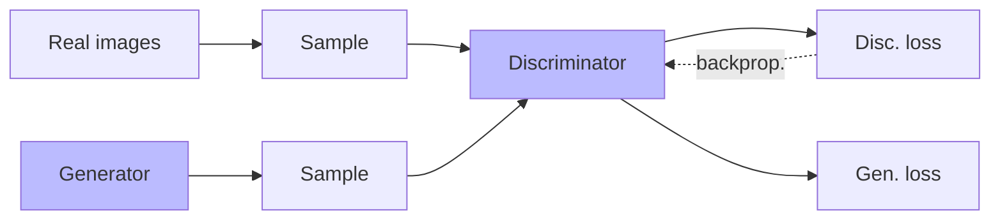
```mermaid
graph LR
 r[Real images] --> rs[Sample] 
 rs --> d[Discriminator]
 Generator --> gs[Sample]
 gs --> d
 d --> l[Disc. loss]
 d --> ll[Gen. loss]
 l -.->|backprop.| d
 style Generator fill:#bbf
 style d fill:#bbf
```

----
# Prototypical inputs with GANs

[](https://commons.wikimedia.org/wiki/File:Woman_2.jpg)
<!-- .element: class="stretch" -->

Notes:
* Generative adversarial networks: 2 models, one producing samples and one discriminating real from generated samples
  - Learn data distribution of training data
  - Produce prototypical images, e.g. private jets
  - Deep fakes


----
# Security at the System Level

*security is more than model robustness*

*defenses go beyond hardening models*

----


Note: Raise the price of wrong inputs

----


Note: Reporting function helps to crowdsource detection of malicious content and potentially train a future classifier (which again can be attacked)

----

<!-- .element: class="stretch" -->

Note: Block system after login attempts with FaceID or fingerprint 

----
## Architecture Diagram for Threat Modeling


* Dynamic and physical architecture diagram
* Describes system components and users and their interactions
* Describe thrust boundaries


----
## State of ML Security


* On-going arms race (mostly among researchers)
    * Defenses proposed & quickly broken by noble attacks
* *Assume ML component is likely vulnerable*
    * Design your system to minimize impact of an attack
* Remember: There may be easier ways to compromise system
    * e.g., poor security misconfiguration (default password), lack of
    encryption, code vulnerabilities, etc., 

----
## Secure Design Principles 

* Principle of Least Privilege
  * A component should be given the minimal privileges needed to fulfill its functionality
  * Goal: Minimize the impact of a compromised component
* Isolation
  * Components should be able to interact with each other no more than necessary
  * Goal: Reduce the size of trusted computing base (TCB) 
  * TCB: Components responsible for establishing a security requirement(s)
  * If any of TCB compromised => security violation
  * Conversely, a flaw in non-TCB component => security still preserved!
  * In poor system designs, TCB = entire system

----
[](https://builtin.com/artificial-intelligence/artificial-intelligence-cybersecurity)
<!-- .element: class="stretch" -->


---


# Safety

Christian Kaestner

With slides from Eunsuk Kang

<!-- references -->

Required Reading 🗎 Salay, Rick, Rodrigo Queiroz, and Krzysztof Czarnecki. "[An analysis of ISO 26262: Using machine learning safely in automotive software](https://arxiv.org/pdf/1709.02435)." arXiv preprint arXiv:1709.02435 (2017).

----
# Learning Goals

* Understand safety concerns in traditional and AI-enabled systems
* Apply hazard analysis to identify risks and requirements and understand their limitations
* Discuss ways to design systems to be safe against potential failures 
* Suggest safety assurance strategies for a specific project
* Describe the typical processes for safety evaluations and their limitations


----
## Safety


----
## Safety

<div class="tweet" data-src="https://twitter.com/EmilyEAckerman/status/1186363305851576321"></div>

----
## Case Study: Self-Driving Car


----
## Challenge: Edge/Unknown Cases


* Gaps in training data; ML will unlikely to cover all unknown cases
* __Why is this a unique problem for AI__? What about humans?

----
## What is Hazard Analysis?


* __Hazard__: A condition or event that may result in undesirable outcome
  * e.g., "Ego vehicle is in risk of a collision with another vehicle."
* __Safety requirement__: Intended to eliminate or reduce one or more hazards
  * "Ego vehicle must always maintain some minimum safe distance to the leading vehicle."
* __Hazard analysis__: Methods for identifying hazards & potential root causes 

----
## Robustness in a Safety Setting

* Does the model reliably detect stop signs?
* Also in poor lighting? In fog? With a tilted camera?
* With stickers taped to the sign?


<!-- references -->

Image: David Silver. [Adversarial Traffic Signs](https://medium.com/self-driving-cars/adversarial-traffic-signs-fd16b7171906). Blog post, 2017

----
## Testing for Safety

* Curate data sets for critical scenarios (see model quality lecture)
* Create test data for difficult settings (e.g. fog)
* Simulation feasible? Shadow deployment feasible?


----
## Negative Side Effects


----
## Reward Hacking

> PlayFun algorithm pauses the game of Tetris indefinitely to avoid losing  

>When about to lose a hockey game, the PlayFun algorithm exploits a bug to make one of the players on the opposing team disappear from the map, thus forcing a draw.

> Self-driving car rewarded for speed learns to spin in circles  

> Self-driving car figures out that it can avoid getting penalized for driving
too close to other cars by exploiting certain sensor vulnerabilities so that it can’t “see” how close it is getting

----
## Elements of Safe Design

* __Assume__: Components will fail at some point
* __Goal__: Minimize the impact of failures on safety
* __Detection__
  * Monitoring
* __Control__
  * Graceful degradation (fail-safe)
  * Redundancy (fail over)
* __Prevention__
  * Decoupling & isolation


----
## The Uber Crash


Note:
 > investigators instead highlighted the many human errors that culminated in the death of 49-year-old Elaine Herzberg. Driver was reportedly streaming an episode of The Voice on her phone, which is in violation of Uber’s policy banning phone use. In fact, investigators determined that she had been glancing down at her phone and away from the road for over a third of the total time she had been in the car up until the moment of the crash.

 > woefully inadequate safety culture


 > federal government also bore its share of responsibility for failing to better regulate autonomous car operations
 
 > The company also lacked a safety division and did not have a dedicated safety manager responsible for risk assessment and mitigation. In the weeks before the crash, Uber made the fateful decision to reduce the number of safety drivers in each vehicle from two to one. That decision removed important redundancy that could have helped prevent Herzberg’s death.

 (from https://www.theverge.com/2019/11/20/20973971/uber-self-driving-car-crash-investigation-human-error-results)

----


----
## Safety Challenges widely Recognized


<!-- references -->
Borg, Markus, et al. "[Safely entering the deep: A review of verification and validation for machine learning and a challenge elicitation in the automotive industry](https://arxiv.org/pdf/1812.05389)." arXiv preprint arXiv:1812.05389 (2018).

----
## Safety Assurance with ML Components

* Consider ML components as unreliable, at most probabilistic guarantees
* Testing, testing, testing (+ simulation)
  - Focus on data quality & robustness
* *Adopt a system-level perspective!*
* Consider safe system design with unreliable components
  - Traditional systems and safety engineering
  - Assurance cases
* Understand the problem and the hazards
  - System level, goals, hazard analysis, world vs machine
  - Specify *end-to-end system behavior* if feasible
* Recent research on adversarial learning and safety in reinforcement learning 


----
## Beyond Traditional Safety Critical Systems

* Recall: Legal vs ethical
* Safety analysis not only for regulated domains (nuclear power plants, medical devices, planes, cars, ...)
* Many end-user applications have a safety component 

**Examples?**

<!-- discussion -->

----
## Addiction

[](https://marker.medium.com/robinhood-has-gamified-online-trading-into-an-addiction-cc1d7d989b0c)


----
## Society: Polarization

[](https://www.wsj.com/articles/facebook-knows-it-encourages-division-top-executives-nixed-solutions-11590507499)
<!-- .element: class="stretch" -->


Notes: Recommendations for further readings: https://www.nytimes.com/column/kara-swisher, https://podcasts.apple.com/us/podcast/recode-decode/id1011668648

Also isolation, Cambridge Analytica, collaboration with ICE, ...

----
## Environmental: Energy Consumption

[](https://www.newscientist.com/article/2205779-creating-an-ai-can-be-five-times-worse-for-the-planet-than-a-car/)


---

# Fostering Interdisciplinary Teams

(Process and Team Reflections)

Christian Kaestner

<!-- references -->

Required reading: Kim, Miryung, Thomas Zimmermann, Robert DeLine, and Andrew Begel. "[Data scientists in software teams: State of the art and challenges](https://andrewbegel.com/papers/data-scientists.pdf)." IEEE Transactions on Software Engineering 44, no. 11 (2017): 1024-1038.


----

# Learning Goals

* Plan development activities in an inclusive fashion for participants in different roles
* Describe agile techniques to address common process and communication issues


----
<svg version="1.1" viewBox="0.0 0.0 800 400" xmlns:xlink="http://www.w3.org/1999/xlink" xmlns="http://www.w3.org/2000/svg">
        <style>
    text { font: 60px sans-serif; }
        </style>
        <circle r="180" cx="250", cy="200" fill="#b9ff00" fill-opacity="0.514" />
        <circle r="180" cx="550", cy="200" fill="#ff5500" fill-opacity="0.514" />
        <text x=230 y=160 dominant-baseline="middle" text-anchor="middle">Data</text>
        <text x=230 y=240 dominant-baseline="middle" text-anchor="middle">Scientists</text>
        <text x=570 y=160 dominant-baseline="middle" text-anchor="middle">Software</text>
        <text x=570 y=240 dominant-baseline="middle" text-anchor="middle">Engineers</text>
</svg> 

----

<!-- .element: class="stretch" -->


----
## Data Science Roles At Microsoft


* Polymath
* Data evangelist
* Data preparer
* Data shaper
* Data analyzer
* Platform builder
* 50/20% moonlighter
* Insight actors

<!-- references -->
Kim, Miryung, Thomas Zimmermann, Robert DeLine, and Andrew Begel. "[Data scientists in software teams: State of the art and challenges](https://andrewbegel.com/papers/data-scientists.pdf)." IEEE Transactions on Software Engineering 44, no. 11 (2017): 1024-1038.

----
## Other Roles in AI Systems Projects?

* **Domain specialists**
* Business, management, marketing
* Project management
* Designers, UI experts
* Operations 
* Lawyers
* Social scientists, ethics
* ...


----
## How to structure teams?

Mobile game; 
50ish developers;
distributed teams?


----
## Mythical Man Month

> Brooks's law: Adding manpower to a late software project makes it later


1975, describing experience at 
IBM developing OS/360

----
## Conflicting Goals?

<svg version="1.1" viewBox="0.0 0.0 800 400" xmlns:xlink="http://www.w3.org/1999/xlink" xmlns="http://www.w3.org/2000/svg">
        <style>
    text { font: 60px sans-serif; }
        </style>
        <circle r="180" cx="250", cy="200" fill="#b9ff00" fill-opacity="0.514" />
        <circle r="180" cx="550", cy="200" fill="#ff0055" fill-opacity="0.514" />
        <text x=230 y=160 dominant-baseline="middle" text-anchor="middle">Data</text>
        <text x=230 y=240 dominant-baseline="middle" text-anchor="middle">Scientists</text>
        <text x=570 y=160 dominant-baseline="middle" text-anchor="middle">Compliance</text>
        <text x=570 y=240 dominant-baseline="middle" text-anchor="middle">Lawyers</text>
</svg> 


----
## T-Shaped People

*Broad-range generalist + Deep expertise*


<!-- reference -->
Figure: Jason Yip. [Why T-shaped people?](https://medium.com/@jchyip/why-t-shaped-people-e8706198e437). 2018


----
## Matrix Organization


----
# Team issues: Groupthink


----


----
# Team issues: Social loafing


----
# The Future of Software Engineering for AI-Enabled Systems?

