# Summary & Reflection

(the last one)

Christian Kaestner


---
# Today

<!-- colstart -->
(1)

**Looking back at the semester**

(375 slides in 40 min)

<!-- col -->
(2)

**Discussion of future of ML in Production**

<!-- col -->
(3)

**Feedback for future semesters**

<!-- colend -->


---

# Introduction and Motivation

Eunsuk Kang & Christian Kaestner

----

# WE ARE BACK ONLINE :(

If you can hear me, open the participant panel in Zoom and check "yes"


----

## Learning Goals

* Understand how AI components are parts of larger systems
* Illustrate the challenges in engineering an AI-enabled system beyond accuracy
* Explain the role of specifications and their lack in machine learning and the relationship to deductive and inductive reasoning
* Summarize the respective goals and challenges of software engineers vs data scientists

----

# Disclaimers

This class captures a rapidly evolving field. 

We are scaling from 30 to 150 students. Expect some friction.

We are software engineers.

----


----


<svg version="1.1" viewBox="0.0 0.0 800 400" xmlns:xlink="http://www.w3.org/1999/xlink" xmlns="http://www.w3.org/2000/svg">
        <style>
    text { font: 60px sans-serif; }
        </style>
        <circle r="180" cx="250", cy="200" fill="#b9ff00" fill-opacity="0.514" />
        <circle r="180" cx="550", cy="200" fill="#ff5500" fill-opacity="0.514" />
        <text x=230 y=160 dominant-baseline="middle" text-anchor="middle">Data</text>
        <text x=230 y=240 dominant-baseline="middle" text-anchor="middle">Scientists</text>
        <text x=570 y=160 dominant-baseline="middle" text-anchor="middle">Software</text>
        <text x=570 y=240 dominant-baseline="middle" text-anchor="middle">Engineers</text>
</svg>


and Domain specialists + Operators + Business team + Project managers + Designers, UI Experts + Safety, security specialists + Lawyers + Social scientists + ...


----
## Data scientist

* Often fixed dataset for training and evaluation (e.g., PBS interviews)
* Focused on accuracy
* Prototyping, often Jupyter notebooks or similar 
* Expert in modeling techniques and feature engineering
* Model size, updateability, implementation stability typically does not matter

<!-- split -->

## Software engineer

* Builds a product
* Concerned about cost, performance, stability, release time
* Identify quality through customer satisfaction
* Must scale solution, handle large amounts of data
* Detect and handle mistakes, preferably automatically
* Maintain, evolve, and extend the product over long periods
* Consider requirements for security, safety, fairness

----


<!-- .element: class="plain" -->

<!-- references -->
By Steven Geringer, via Ryan Orban. [Bridging the Gap Between Data Science & Engineer: Building High-Performance Teams](https://www.slideshare.net/ryanorban/bridging-the-gap-between-data-science-engineer-building-highperformance-teams/3-Software_Engineer_Data_Engineer_Data). 2016


----
## T-Shaped People

*Broad-range generalist + Deep expertise*


<!-- .element: class="plain" -->

<!-- reference -->
Figure: Jason Yip. [Why T-shaped people?](https://medium.com/@jchyip/why-t-shaped-people-e8706198e437). 2018


----

# Syllabus and Class Structure

17-445/17-645, Summer 2020, 12 units

Tuesday/Wednesday 3-4:20, here on zoom

----
## Textbook

Building Intelligent Systems: A Guide to Machine Learning Engineering

by Geoff Hulten

https://www.buildingintelligentsystems.com/

Most chapters assigned at some point in the semester

Supplemented with research articles, blog posts, videos, podcasts, ...

[Electronic version](https://cmu.primo.exlibrisgroup.com/permalink/01CMU_INST/6lpsnm/alma991019649190004436) in the library

<!-- split -->


----
## Grading Philosophy

* Specification grading, based in adult learning theory
* Giving you choices in what to work on or how to prioritize your work
* We are making every effort to be clear about expectations (specifications)
* Assignments broken down into expectations with point values, each graded pass/fail
* You should be able to tell what grade you will get for an assignment when you submit it, depending on what work you chose to do

[[Example]](https://github.com/ckaestne/seai/blob/F2020/assignments/I1_case_study.md#grading)


----


<!-- .element: class="plain" -->


---

# From Models to Production Systems (Systems Thinking)

Christian Kaestner

<!-- references -->

* Hulten, Geoff. "Building Intelligent Systems: A Guide to Machine Learning Engineering." (2018), Chapters 5, 7, and 8.


----

# Learning goals

* Explain the consequences of the shift from deductive to inductive reasoning for abstraction and composition
* Explain how machine learning fits into the larger picture of building and maintaining production systems
* Explain the modularity implications of having machine-learning components without specifications
* Describe the typical components relating to AI in an AI-enabled system and typical design decisions to be made


----
## Non-update on waitlist


<!-- .element: class="plain" -->

* LTI MS AII program: Now on Canvas. Assume you are enrolled. 
* All others: Please be patient. If enrolling late, can submit this week's quizzes and homework 1 late (1 week later). 


----
## Example: Image Captioning Problem


----
## ML-Enabled Systems (ML in Production)


<!-- .element: class="plain" -->

Focus: Interaction of ML and non-ML components, system requirements, user interactions, safety, collaboration, delivering products

----
## Case Study: Self-help legal chatbot


<!-- .element: class="stretch" -->


Based on the excellent paper: Passi, S., & Sengers, P. (2020). [Making data science systems work](https://journals.sagepub.com/doi/full/10.1177/2053951720939605). Big Data & Society, 7(2).

Note: Screenshots for illustration purposes, not the actual system studied


----
## Model vs System Goal?


----
# Systems Thinking


<!-- .element: class="plain" -->


----
## System <-> World = Feedback Loops?


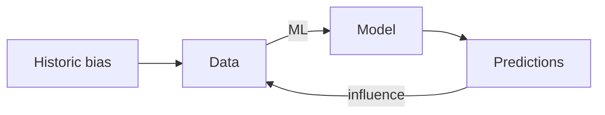


----
## Safety is a System Property

* Code/models are not unsafe, cannot harm people
* Systems can interact with the environment in ways that are unsafe


----
## Presenting Intelligence

* Automate: Take action on user's behalf

* Prompt: Ask the user if an action should be taken

* Organize: Display a set of items in an order

* Annotate: Add information to a display

* Hybrids of these


----
## Breakout Discussion: Experience Design


<!-- colstart -->

Fall detection for elderly people:


<!-- col -->

Safe browsing: Blocking malicious web pages


<!-- colend -->


* How do we present the intelligence to the user?
* Consider system goals, forcefulness, frequency, value of correct and cost of wrong predictions


----
## Monitoring in Production

Design for telemetry

<!-- colstart -->

<!-- col -->

<!-- colend -->


----
## Pipeline Thinking


<!-- .element: class="plain" -->


----
## ML Models Make Mistakes


<!-- .element: class="stretch" -->


Note: Source: https://www.aiweirdness.com/do-neural-nets-dream-of-electric-18-03-02/

----
## Lack of Specifications

```java
/**
  Return the text spoken within the audio file
  ????
*/
String transcribe(File audioFile);
```

----
# Homework 1: Case Study

Engineering issues in detecting malicious apps or healthcare deployment


---

# Model Quality 1
## Accuracy and Correctness

Christian Kaestner

<!-- references -->

Required reading: 
* 🕮 Hulten, Geoff. "[Building Intelligent Systems: A Guide to Machine Learning Engineering.](https://www.buildingintelligentsystems.com/)" Apress, 2018, Chapter 19 (Evaluating Intelligence).

----

# Learning Goals

* Select a suitable metric to evaluate prediction accuracy of a model and to compare multiple models
* Select a suitable baseline when evaluating model accuracy
* Know and avoid common pitfalls in evaluating model accuracy
* Explain how software testing differs from measuring prediction accuracy of a model

----
# Model Quality 

## First Part: Measuring Prediction Accuracy

the data scientist's perspective

## Second Part: What is Correctness Anyway?

the role and lack of specifications, validation vs verification

## Third Part: Learning from Software Testing 

unit testing, test case curation, invariants, test case generation (next lecture)

## Later: Testing in Production

monitoring, A/B testing, canary releases (in 2 weeks)


----
## Case Study: Cancer Prognosis


> We should stop training radiologists now. It’s just completely obvious that within five years, deep learning is going to do better than radiologists. -- [Geoffrey Hinton](https://www.youtube.com/watch?v=2HMPRXstSvQ&t=29s), 2016


----
## Cancer Prediction within A Healthcare Application


<!-- .element: class="stretch" -->


(CC BY-SA 4.0, [Martin Sauter](https://commons.wikimedia.org/wiki/Category:GNU_Health#/media/File:Gnu_health_2-8_gynocology_general.png))


----
## Confusion/Error Matrix

| | **Actually A** | **Actually B** | **Actually C** |
| :--- | --- | --- | --- |
|**AI predicts A** | **10** | 6 | 2 |
|**AI predicts B** | 3 | **24**  | 10 |
|**AI predicts C** | 5 | 22 | **82** |

Accuracy = correct predictions (diagonal) out of all predictions

Example's accuracy 
        = $\frac{10+24+82}{10+6+2+3+24+10+5+22+82} = .707$

----
## Is 99% Accuracy good?

-> depends on problem; can be excellent, good, mediocre, terrible

10% accuracy can be good on some tasks (information retrieval)

Always compare to a base rate!

Reduction in error = 
$\frac{(1 - accuracy\_\text{baseline}) - (1 - accuracy\_f)}{1 - accuracy\_\text{baseline}}$

* from 99.9% to 99.99% accuracy = 90% reduction in error
* from 50% to 75% accuracy = 50% reduction in error

 

----

[](https://en.wikipedia.org/wiki/Precision_and_recall#/media/File:Precisionrecall.svg)
<!-- .element: class="stretch" -->


(CC BY-SA 4.0 by [Walber](https://en.wikipedia.org/wiki/Precision_and_recall#/media/File:Precisionrecall.svg))

----
## Detecting Overfitting

Change hyperparameter to detect training accuracy (blue)/validation accuracy (red) at different degrees of freedom


<!-- .element: class="stretch" -->


(CC SA 3.0 by [Dake](https://commons.wikimedia.org/wiki/File:Overfitting.png))

**[demo time](https://github.com/ckaestne/seai/tree/S2020/lectures/02_aibasics1/extras/decisiontree)**


----
## Crossvalidation

* Motivation
  * Evaluate accuracy on different training and validation splits
  * Evaluate with small amounts of validation data
* Method: Repeated partitioning of data into train and validation data, train and evaluate model on each partition, average results
* Many split strategies, including 
  * leave-one-out: evaluate on each datapoint using all other data for training
  * k-fold: $k$ equal-sized partitions, evaluate on each training on others
  * repeated random sub-sampling (Monte Carlo)

**[demo time](https://github.com/ckaestne/seai/tree/S2020/lectures/02_aibasics1/extras/decisiontree)**


<!-- .element: class="stretch" -->


(Graphic CC [MBanuelos22](https://en.wikipedia.org/wiki/Cross-validation_(statistics)#/media/File:KfoldCV.gif)  BY-SA 4.0)


----
## Test Data not Representative


<!-- .element: class="plain" -->


----
## Shortcut Learning 


<!-- .element: class="plain" -->

<!-- references -->
Figure from: Geirhos, Robert, Jörn-Henrik Jacobsen, Claudio Michaelis, Richard Zemel, Wieland Brendel, Matthias Bethge, and Felix A. Wichmann. "[Shortcut learning in deep neural networks](https://arxiv.org/abs/2004.07780)." Nature Machine Intelligence 2, no. 11 (2020): 665-673.

----
## Independence of Data: Temporal


<!-- .element: class="stretch" -->

Note: The curve is the real trend, red points are training data, green points are validation data. If validation data is randomly selected, it is much easier to predict, because the trends around it are known.


----
# What is Correctness Anyway?

specifications, bugs, fit


----
## Validation vs Verification

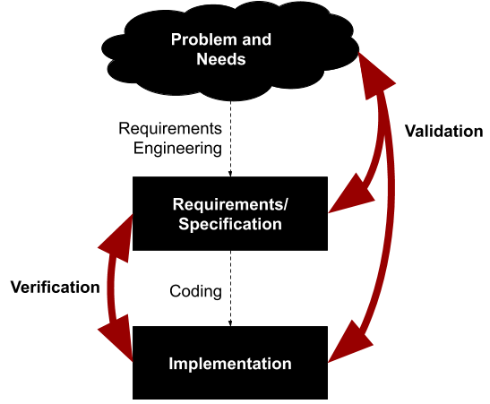
<!-- .element: class="stretch plain" -->


----
## Wrong Specifications: Ariane 5

<iframe width="800" height="480"  src="https://www.youtube.com/embed/PK_yguLapgA?start=84" frameborder="0" allow="accelerometer; autoplay; clipboard-write; encrypted-media; gyroscope; picture-in-picture" allowfullscreen></iframe>

Software was working as specified, within the specified parameters. Inputs exceeded specified parameters.


----
## No specification!

We use ML precisely because we do not have a specification (too complex, rules unknown)


No specification that could tell us for any input whether the output is correct

Intuitions, ideas, goals, "implicit specifications", but nothing we can write down!

We are usually okay with some wrong predictions


----
## Testing a Machine Learning Model?


```java
// detects cancer in an image
boolean hasCancer(Image scan);

@Test
void testPatient1() {
  assertEquals(loadImage("patient1.jpg"), false);
}
@Test
void testPatient2() {
  assertEquals(loadImage("patient2.jpg"), false);
}
```


----


> All models are approximations. Assumptions, whether implied or clearly stated, are never exactly true. **All models are wrong, but some models are useful**. So the question you need to ask is not "Is the model true?" (it never is) but "Is the model good enough for this particular application?" -- George Box


<!-- references -->
See also https://en.wikipedia.org/wiki/All_models_are_wrong


----
## Machine Learning Models Fit, or Not

* A model is learned from given data in given procedure 
    - The learning process is typically not a correctness concern
    - The model itself is generated, typically no implementation issues
* Is the data representative? Sufficient? High quality?
* Does the model "learn" meaningful concepts?
*
* **Is the model useful for a problem?** Does it *fit*?
* Do model predictions *usually* fit the users' expectations?
* Is the model *consistent* with other requirements? (e.g., fairness, robustness)


---
# Model Quality 2 
## Slicing, Capabilities, Invariants, and other Testing Strategies

Christian Kaestner

<!-- references -->

Required reading: 
* 🗎 Ribeiro, Marco Tulio, Tongshuang Wu, Carlos Guestrin, and Sameer Singh. "[Beyond Accuracy: Behavioral Testing of NLP Models with CheckList](https://homes.cs.washington.edu/~wtshuang/static/papers/2020-acl-checklist.pdf)." In Proceedings ACL, p. 4902–4912. (2020).

----
# Curating Validation Data

(Learning from Software Testing?)

----
## Software Test Case Design

* Opportunistic/exploratory testing: Add some unit tests, without much planning
* Black-box testing: Derive test cases from specifications
    - Boundary value analysis
    - Equivalence classes
    - Combinatorial testing
    - Random testing
* White-box testing: Derive test cases to cover implementation paths
    - Line coverage, branch coverage
    - Control-flow, data-flow testing, MCDC, ...
*
* Test execution usually automated, but can be manual too
* Automated generation from specifications or code possible


----
## Not All Inputs are Equal


<!-- .element: class="stretch" -->

"Call mom"
"What's the weather tomorrow?"
"Add asafetida to my shopping list"

----
## Not All Inputs are Equal

> There Is a Racial Divide in Speech-Recognition Systems, Researchers Say:
> Technology from Amazon, Apple, Google, IBM and Microsoft misidentified 35 percent of words from people who were black. White people fared much better. -- [NYTimes March 2020](https://www.nytimes.com/2020/03/23/technology/speech-recognition-bias-apple-amazon-google.html)

----
## Input Partitioning Example

<!-- colstart -->


Input divided by movie age. Notice low accuracy, but also low support (i.e., little validation data), for old movies.
<!-- col -->


Input divided by genre, rating, and length. Accuracy differs, but also amount of test data used ("support") differs, highlighting low confidence areas.
<!-- colend -->


<!-- references -->

Source: Barash, Guy, Eitan Farchi, Ilan Jayaraman, Orna Raz, Rachel Tzoref-Brill, and Marcel Zalmanovici. "Bridging the gap between ML solutions and their business requirements using feature interactions." In Proc. Symposium on the Foundations of Software Engineering, pp. 1048-1058. 2019.


----
## Testing Capabilities ("Stress Testing")

Even without specifications, are there "concepts" or "capabilities" the model should learn?

Example capabilities of sentiment analysis:
* Handle *negation*
* Robustness to *typos*
* Ignore synonyms and abbreviations
* Person and location names are irrelevant
* Ignore gender
* ...


For each capability create specific test set (multiple examples) -- manually or following patterns


<!-- references -->

Ribeiro, Marco Tulio, Tongshuang Wu, Carlos Guestrin, and Sameer Singh. "[Beyond Accuracy: Behavioral Testing of NLP Models with CheckList](https://homes.cs.washington.edu/~wtshuang/static/papers/2020-acl-checklist.pdf)." In Proceedings ACL, p. 4902–4912. (2020).


----
## Testing Capabilities ("Stress Testing")


<!-- references -->

From: Ribeiro, Marco Tulio, Tongshuang Wu, Carlos Guestrin, and Sameer Singh. "[Beyond Accuracy: Behavioral Testing of NLP Models with CheckList](https://homes.cs.washington.edu/~wtshuang/static/papers/2020-acl-checklist.pdf)." In Proceedings ACL, p. 4902–4912. (2020).


----
## Test Case Generation & The Oracle Problem

* Manually construct input-output pairs (does not scale, cannot automate)
* Comparison against gold standard (e.g., alternative implementation, executable specification)
* Checking of global properties only -- crashes, buffer overflows, code injections
* Manually written assertions -- partial specifications checked at runtime


----
## Examples of Invariants 

* Credit rating should not depend on gender:
    - $\forall x. f(x[\text{gender} \leftarrow \text{male}]) = f(x[\text{gender} \leftarrow \text{female}])$
* Synonyms should not change the sentiment of text:
    - $\forall x. f(x) = f(\texttt{replace}(x, \text{"is not", "isn't"}))$
* Negation should swap meaning:
    - $\forall x \in \text{"X is Y"}. f(x) = 1-f(\texttt{replace}(x, \text{" is ", " is not "}))$
* Robustness around training data:
    - $\forall x \in \text{training data}. \forall y \in \text{mutate}(x, \delta). f(x) = f(y)$
* Low credit scores should never get a loan (sufficient conditions for classification, "anchors"):
    - $\forall x. x.\text{score} < 649 \Rightarrow \neg f(x)$

Identifying invariants requires domain knowledge of the problem!

----
## Metamorphic Testing

Formal description of relationships among inputs and outputs (*Metamorphic Relations*)

In general, for a model $f$ and inputs $x$ define two functions to transform inputs and outputs $g\_I$ and $g\_O$ such that:

$\forall x. f(g\_I(x)) = g\_O(f(x))$

<!-- vspace -->

e.g. $g\_I(x)= \texttt{replace}(x, \text{" is ", " is not "})$ and $g\_O(x)=\neg x$


----
## One More Thing: Simulation-Based Testing

<!-- colstart -->
<!-- smallish -->
* Derive input-output pairs from simulation, esp. in vision systems
* Example: Vision for self-driving cars:
    * Render scene -> add noise -> recognize -> compare recognized result with simulator state
* Quality depends on quality of the simulator and how well it can produce inputs from outputs: 
    * examples: render picture/video, synthesize speech, ... 
    * Less suitable where input-output relationship unknown, e.g., cancer detection, housing price prediction, shopping recommendations
<!-- col -->
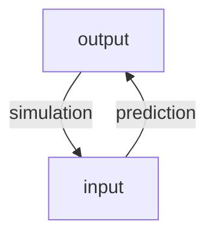
<!-- colend -->

<!-- references -->

Further readings: Zhang, Mengshi, Yuqun Zhang, Lingming Zhang, Cong Liu, and Sarfraz Khurshid. "DeepRoad: GAN-based metamorphic testing and input validation framework for autonomous driving systems." In Proceedings of the 33rd ACM/IEEE International Conference on Automated Software Engineering, pp. 132-142. 2018.


---

# Goals and Success Measures for AI-Enabled Systems


Eunsuk Kang

<!-- references -->

Required Readings: Hulten, Geoff. "[Building Intelligent Systems: A Guide to Machine Learning Engineering](https://www.buildingintelligentsystems.com/)" (2018), Chapters 2 (Knowing when to use IS) and 4 (Defining the IS’s Goals)

Suggested complementary reading: Ajay Agrawal, Joshua Gans, Avi Goldfarb. “[Prediction Machines: The Simple Economics of Artificial Intelligence](https://cmu.primo.exlibrisgroup.com/permalink/01CMU_INST/6lpsnm/alma991019698987304436)” 2018 

----

# Learning goals

* Judge when to apply ML for a problem in a system
* Define system goals and map them to goals for ML components
* Understand the key concepts and risks of measurement

----
## Today's Case Study: Spotify Personalized Playlists

[](spotify.png)
<!-- .element: class="stretch" -->


----
# When to use Machine Learning?

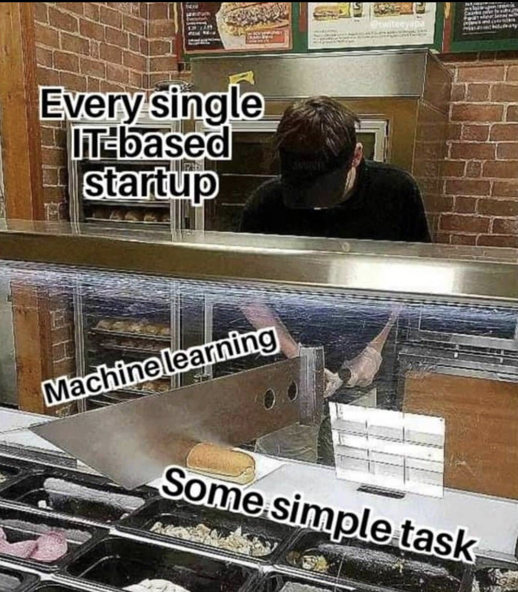
<!-- .element: class="stretch" -->


----
## Layers of Success Measures

* Organizational objectives: Innate/overall goals of the organization
* Leading indicators: Measures correlating with future success, from the business perspective
* User outcomes: How well the system is serving its users, from the user's perspective
* Model properties: Quality of the model used in a system, from the model's perspective

**Ideally, these goals should be aligned with each other**

<!-- split -->

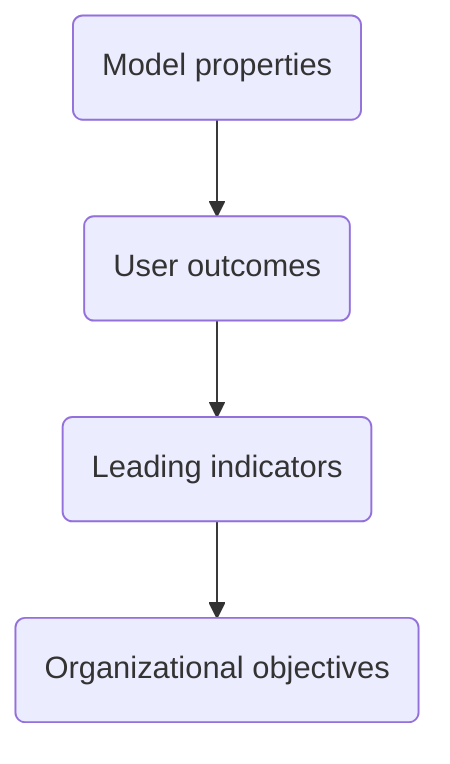


----
## Exercise: Automating Admission Decisions to Master's Program
<!-- smallish -->
Discuss in groups, breakout rooms

What are the *goals* behind automating admissions decisions?

**Organizational objectives, leading indicators, user outcomes, model properties?**

Report back in 10 min

<!-- discussion -->


----
## Everything is Measurable

* If X is something we care about, then X, by definition, must be
detectable.
    * How could we care about things like “quality,” “risk,” “security,” or “public image” if these things were totally undetectable, directly or indirectly?
    * If we have reason to care about some unknown quantity, it is because
we think it corresponds to desirable or undesirable results in some way.
* If X is detectable, then it must be detectable in some amount.
  * If you can observe a thing at all, you can observe more of it or less of it
* If we can observe it in some amount, then it must be
measurable.

*But: Not every measure is precise, not every measure is cost effective*

<!-- references -->

Douglas Hubbard, “[How to Measure Anything: finding the value of intangibles in business](https://cmu.primo.exlibrisgroup.com/permalink/01CMU_INST/1feg4j8/alma991019515498904436)" 2014


----
# Project M1: Modeling and First Deployment


(recommendation service, web API, team reflection)


---
# Requirements and Risks

Eunsuk Kang

<!-- references -->

Required reading: "The World and the Machine" M. Jackson (1995).


----
## Learning Goals

* Understand the role of requirements in ML-based systems and their
failures
* Understand the distinction between the world and the machine
* Understand the importance of environmental assumptions in
  establishing system requirements

----
## Facial Recognition in ATM


<!-- .element: class="stretch" -->

**Q. What went wrong? What is the root cause of the failure?**

----
## Automated Hiring

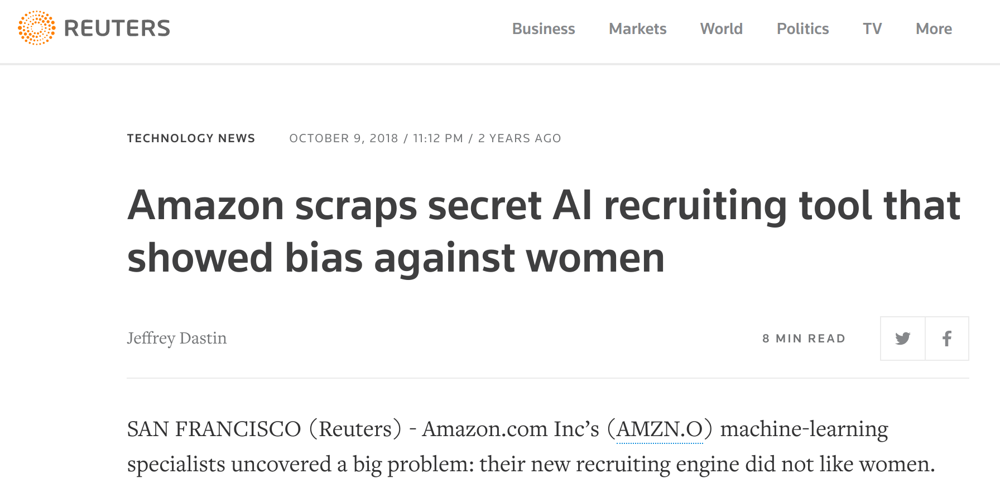
<!-- .element: class="stretch" -->

**Q. What went wrong? What is the root cause of the failure?**

----
## Software Requirements

* Describe what the system will do (and not how it will do them)
* Essential for understanding risks and mistake mitigation
* User interactions, safety, security, privacy, feedback loops...


<!-- .element: class="stretch" -->


----
## Requirement vs Specification


* Requirement (REQ): What your product provides, as desired effects on the
  environment (i.e., system-level goals)
* Assumptions (ENV): What’s assumed about the behavior/properties of
  the environment (based on domain knowledge)
* Specification (SPEC): What machine must do in order to satisfy REQ **in conjunction** with ENV

----
## Example: Lane Assist


<!-- .element: class="stretch" -->

* Requirement (REQ): The vehicle must be prevented from veering off the lane.
* Specification (SPEC): ??

----
## Lufthansa 2904 Runaway Crash


* Reverse thrust (RT): Decelerates plane during landing
* What was required (REQ): RT enabled if and only if plane on the
ground
* What was implemented (SPEC): RT enabled if and only if wheel turning
* But runway wet due to rain
  * Wheel fails to turn, even though the plane is on the ground
  * Pilot attempts to enable RT; overridden by the software
  * Plane goes off the runway!


---

# Requirements and Risks II: Planning for Mistakes

Eunsuk Kang

<!-- references -->


Required reading: Hulten, Geoff. "Building Intelligent Systems: A
Guide to Machine Learning Engineering." (2018), Chapters 6–7 (Why
creating IE is hard, balancing IE) and 24 (Dealing with mistakes)

----
## Learning goals:

* Evaluate the risks of mistakes from AI components using the fault tree
analysis (FTA)
* Design strategies for mitigating the risks of failures due to AI mistakes

----
## What is Risk Analysis?

*  What can possibly go wrong in my system, and what are potential 
impacts on system requirements?
* Risk = Likelihood * Impact
* A number of methods:
  * Failure mode & effects analysis (FMEA)
  * Hazard analysis
  * Why-because analysis
  * Fault tree analysis (FTA) <= Today's focus!
  * ...


----
## Fault Trees:: Basic Building Blocks


* Event: An occurrence of a fault or an undesirable action
  * (Intermediate) Event: Explained in terms of other events
  * Basic Event: No further development or breakdown; leafs of the tree
* Gate: Logical relationship between an event & its immedicate subevents
  * AND: All of the sub-events must take place
  * OR: Any one of the sub-events may result in the parent event

<!-- references -->
Figure from _Fault Tree Analysis and Reliability Block Diagram_
(2016), Jaroslav Menčík. 

----
## Elements of Fault-Tolerant Design

* __Assume__: Components will fail at some point
* __Goal__: Minimize the impact of failures
* __Detection__
  * Monitoring
* __Response__
  * Graceful degradation (fail-safe)
  * Redundancy (fail over)
* __Containment__
  * Decoupling & isolation


----
## Doer-Checker Example: Autonomous Vehicle


* ML-based controller (__doer__): Generate commands to maneuver vehicle
  * Complex DNN; makes performance-optimal control decisions
* Safe controller (__checker__): Checks commands from ML controller; overrides it
  with a safe default command if maneuver deemed risky
  * Simpler, based on verifiable, transparent logic; conservative control


----
## Response: Human in the Loop

*Less forceful interaction, making suggestions, asking for confirmation*

* AI and humans are good at predictions in different settings
    * AI better at statistics at scale and many factors
    * Humans understand context and data generation process and often better with thin data 
* AI for prediction, human for judgment?
* But:
    * Notification fatigue, complacency, just following predictions; see *Tesla autopilot*
    * Compliance/liability protection only?
* Deciding when and how to interact
* Lots of UI design and HCI problems

**Examples?**

Notes: Cancer prediction, sentencing + recidivism, Tesla autopilot, military "kill" decisions, powerpoint design suggestions


----
## Homework 2a: Requirements and Risks

(objectives, requirements, and fault tree analysis for smart dashcam)


---


# Trade-offs among AI Techniques


Eunsuk Kang

<!-- references -->


Required reading: Hulten, Geoff. "Building Intelligent Systems: A
Guide to Machine Learning Engineering." (2018), Chapters 17 and 18
----
# Learning Goals

* Organize and prioritize the relevant qualities of concern for a given project
* Explain they key ideas behind decision trees and random forests and analyze consequences for various qualities
* Explain the key ideas of deep learning and the reason for high resource needs during learning and inference and the ability for incremental learning
* Plan and execute an evaluation of the qualities of alternative AI components for a given purpose

----

<!-- .element: class="plain" -->


----
## Qualities of Interest?

Scenario: Component detecting credit card fraud as a service provider to many banks


Note: Very high volume of transactions, low cost per transaction, frequent updates

Note: Img src https://pixabay.com/photos/credit-card-payment-transaction-926862/


----
## Examples of Qualities to Consider

* Accuracy
* Correctness guarantees? Probabilistic guarantees (--> symbolic AI)
* How many features? Interactions among features?
* How much data needed? Data quality important?
* Incremental training possible?
* Training time, memory need, model size -- depending on training data volume and feature size
* Inference time, energy efficiency, resources needed, scalability
* Interpretability/explainability
* Robustness, reproducibility, stability
* Security, privacy
* Fairness

----
## Decision Trees
<!-- colstart -->
<!-- small -->
| Outlook | Temperature | Humidity | Windy | Play |
| - | - | - | - | - |
| overcast | hot  |  high   |  false |    yes |
| overcast | hot  |  high   |  false |    no |
| overcast | hot  |  high   |  false |    yes |
| overcast | cool |  normal |  true |       yes |
| overcast | mild |  high   |  true|     yes |
| overcast | hot  |  normal |  false |   yes |
| rainy    | mild |  high   |  false | yes |
| rainy    | cool |  normal |  false | yes |
| rainy    | cool |  normal |  true |  no |
| rainy    | mild |  normal |  false | yes |
| rainy    | mild |  high   |  true |no |
| sunny    | hot  |  high   |  false |  no |
| sunny    | hot  |  high   |  true | no |
| sunny    | mild |  high   |false | no |
| sunny    | cool |  normal |false |   yes |
| sunny    | mild |  normal |  true |   yes |

<!-- col -->
f(Outlook, Temperature, Humidity, Windy) = 

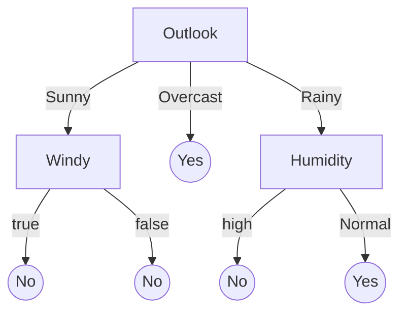

<!-- colend -->


----
$f_{\mathbf{W}_h,\mathbf{b}_h,\mathbf{W}_o,\mathbf{b}_o}(\mathbf{X})=\phi( \mathbf{W}_o \cdot \phi(\mathbf{W}_h \cdot \mathbf{X}+\mathbf{b}_h)+\mathbf{b}_o)$


<!-- .element: class="stretch" -->

(matrix multiplications interleaved with step function)


----
## Learning cost? Incremental learning?

<!-- colstart -->
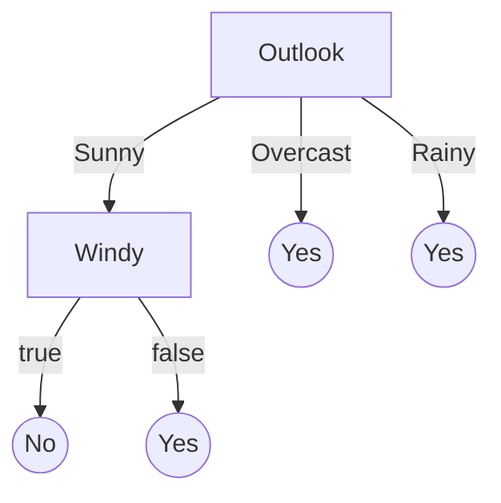
<!-- col -->

<!-- colend -->


----
## Requirements Engineering for AI-Enabled Systems

* Set minimum accuracy expectations ("functional requirement")
* Identify runtime needs (how many predictions, latency requirements, cost budget, mobile vs cloud deployment)
* Identify evolution needs (update and retrain frequency, ...)
* Identify explainability needs
* Identify protected characteristics and possible fairness concerns
* Identify security and privacy requirements (ethical and legal), e.g., possible use of data
* Understand data availability and need (quality, quantity, diversity, formats, provenance)
* Involve data scientists and legal experts
* **Map system goals to AI components**

<!-- references -->

Further reading: Vogelsang, Andreas, and Markus Borg. "[Requirements Engineering for Machine Learning: Perspectives from Data Scientists](https://arxiv.org/pdf/1908.04674.pdf)." In Proc. of the 6th International Workshop on Artificial Intelligence for Requirements Engineering (AIRE), 2019.


----
## Constraints

Constraints define the space of attributes for valid design solutions


----
## Trade-offs: Cost vs Accuracy


_"We evaluated some of the new methods offline but the additional
accuracy gains that we measured did not seem to justify the
engineering effort needed to bring them into a production
environment.”_

<!-- references -->

Amatriain & Basilico. [Netflix Recommendations: Beyond the 5 stars](https://netflixtechblog.com/netflix-recommendations-beyond-the-5-stars-part-1-55838468f429),
Netflix Technology Blog (2012)


---


# Deploying a Model

(Introduction to Software Architecture of AI-enabled Systems)

Christian Kaestner

<!-- references -->

Required reading: 
* 🕮 Hulten, Geoff. "[Building Intelligent Systems: A Guide to Machine Learning Engineering.](https://www.buildingintelligentsystems.com/)" Apress, 2018, Chapter 13 (Where Intelligence Lives).
* 📰 Daniel Smith. "[Exploring Development Patterns in Data Science](https://www.theorylane.com/2017/10/20/some-development-patterns-in-data-science/)." TheoryLane Blog Post. 2017.

Recommended reading: Rick Kazman, Paul Clements, and Len Bass. [Software architecture in practice.](https://www.oreilly.com/library/view/software-architecture-in/9780132942799/?ar) Addison-Wesley Professional, 2012, Chapter 1


----

# Learning Goals

* Understand important quality considerations when deploying ML components
* Follow a design process to explicitly reason about alternative designs and their quality tradeoffs
* Gather data to make informed decisions about what ML technique to use and where and how to deploy it
* Understand the power of design patterns for codifying design knowledge
*
* Create architectural models to reason about relevant characteristics
* Critique the decision of where an AI model lives (e.g., cloud vs edge vs hybrid), considering the relevant tradeoffs 
* Deploy models locally and to the cloud
* Document model inference services


----
## Deploying a Model is Easy

Model inference component as function/library

```python
from sklearn.linear_model import LogisticRegression
model = … # learn model or load serialized model ...
def infer(feature1, feature2):
    return model.predict(np.array([[feature1, feature2]])
```


----
## But is it really easy?

* Offline use?
* Deployment at scale?
* Hardware needs and operating cost?
* Frequent updates?
* Integration of the model into a system?
* Meeting system requirements?
* Every system is different!


----

# Software Architecture 

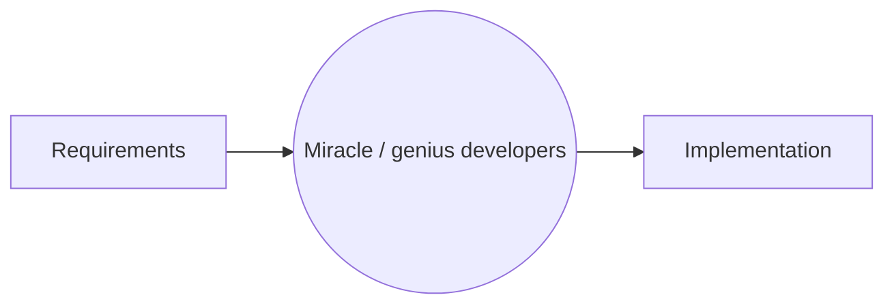


----

## Case Study: Twitter


----

----

----


----

## What can we reason about?


<!-- references -->
Ghemawat, Sanjay, Howard Gobioff, and Shun-Tak Leung. "[The Google file system.](https://ai.google/research/pubs/pub51.pdf)" ACM SIGOPS operating systems review. Vol. 37. No. 5. ACM, 2003.


----

# Case Study: Augmented Reality Translation


<!-- .element: class="stretch" -->


----
## Where Should the Model Live?

* Glasses
* Phone
* Cloud

What qualities are relevant for the decision?

<!-- split -->


----
## When would one use the following designs?

* Static intelligence in the product
* Client-side intelligence
* Server-centric intelligence
* Back-end cached intelligence
* Hybrid models


----
## Reusing Feature Engineering Code
 


<!-- .element: class="plain" -->


Avoid *training–serving skew*


----
## Separating Models and Business Logic


<!-- .element: class="stretch plain" -->

Based on: Yokoyama, Haruki. "Machine learning system architectural pattern for improving operational stability." In 2019 IEEE International Conference on Software Architecture Companion (ICSA-C), pp. 267-274. IEEE, 2019.

----
## Composing Models: Ensemble and metamodels


<!-- .element: class="plain" -->

----
## Model Cards 

* Proposal and template for documentation from Google
* 1-2 page summary
* Focused on fairness
* Includes
  * Intended use, out-of-scope use
  * Training and evaluation data
  * Considered demographic factors
  * Accuracy evaluations
  * Ethical considerations
* Widely discussed, but not frequently adopted

<!-- references -->
Mitchell, Margaret, Simone Wu, Andrew Zaldivar, Parker Barnes, Lucy Vasserman, Ben Hutchinson, Elena Spitzer, Inioluwa Deborah Raji, and Timnit Gebru. "[Model cards for model reporting](https://arxiv.org/abs/1810.03993)." In *Proceedings of the conference on fairness, accountability, and transparency*, pp. 220-229. 2019.


----
# Homework 2b: Architecture


Deployment alternatives and telemetry for smart dashcam


---

# Quality Assessment in Production

Christian Kaestner


<!-- references -->

Required Reading: 
* 🕮 Hulten, Geoff. "[Building Intelligent Systems: A Guide to Machine Learning Engineering.](https://www.buildingintelligentsystems.com/)" Apress, 2018, Chapter 15 (Intelligent Telemetry).

Suggested Readings: 
* Alec Warner and Štěpán Davidovič. "[Canary Releases](https://landing.google.com/sre/workbook/chapters/canarying-releases/)." in [The Site Reliability Workbook](https://landing.google.com/sre/books/), O'Reilly 2018
* Georgi Georgiev. “[Statistical Significance in A/B Testing – a Complete Guide](http://blog.analytics-toolkit.com/2017/statistical-significance-ab-testing-complete-guide/#noninf).” Blog 2018

----

<div class="tweet" data-src="https://twitter.com/changelog/status/1137359428632621060"></div>


----
## Learning Goals

* Design telemetry for evaluation in practice
* Understand the rationale for beta tests and chaos experiments
* Plan and execute experiments (chaos, A/B, shadow releases, ...) in production
* Conduct and evaluate multiple concurrent A/B tests in a system
* Perform canary releases
* Examine experimental results with statistical rigor
* Support data scientists with monitoring platforms providing insights from production data


----
## Identify Feedback Mechanism in Production 

* Live observation in the running system
* Potentially on subpopulation (AB testing)
* Need telemetry to evaluate quality -- challenges:
    - Gather feedback without being intrusive (i.e., labeling outcomes), harming user experience
    - Manage amount of data
    - Isolating feedback for specific AI component + version


----

<!-- split -->


----


----


----


----
## Engineering Challenges for Telemetry


----
## Breakout: Design Telemetry in Production

Discuss how to collect telemetry (Wait and see, ask users, manual/crowd-source labeling, shadow execution, allow users to complain, observe user reaction)

Scenarios:
* Front-left: Amazon: Shopping app feature that detects the shoe brand from photos
* Front-right: Google: Tagging uploaded photos with friends' names
* Back-left: Spotify: Recommended personalized playlists
* Back-right: Wordpress: Profanity filter to moderate blog posts

----
## Model Quality vs System Quality


<!-- .element: class="stretch" --> 

**Possible causes?**

Bernardi et al. "150 successful machine learning models: 6 lessons learned at Booking.com." In Proc KDD, 2019.

----
## A/B Testing for Usability

* In running system, random sample of X users are shown modified version
* Outcomes (e.g., sales, time on site) compared among groups


----
## Feature Flags

```java
if (features.enabled(userId, "one_click_checkout") {
     // new one click checkout function
} else {
     // old checkout functionality
}
```

* Boolean options
* Good practices: tracked explicitly, documented, keep them localized and independent
* External mapping of flags to customers
    * who should see what configuration
    * e.g., 1% of users sees `one_click_checkout`, but always the same users; or 50% of beta-users and 90% of developers and 0.1% of all users

----

<!-- .element: class="stretch" --> 


---

# Data Quality


> "Data cleaning and repairing account for about 60% of the work of data scientists."


Christian Kaestner


<!-- references -->

Required reading:
* Sambasivan, N., Kapania, S., Highfill, H., Akrong, D., Paritosh, P., & Aroyo, L. M. (2021, May). “[Everyone wants to do the model work, not the data work”: Data Cascades in High-Stakes AI](https://dl.acm.org/doi/abs/10.1145/3411764.3445518). In Proceedings of the 2021 CHI Conference on Human Factors in Computing Systems (pp. 1-15).


Recommended reading: 
* Schelter, S., Lange, D., Schmidt, P., Celikel, M., Biessmann, F. and Grafberger, A., 2018. [Automating large-scale data quality verification](http://www.vldb.org/pvldb/vol11/p1781-schelter.pdf). Proceedings of the VLDB Endowment, 11(12), pp.1781-1794.
* Nick Hynes, D. Sculley, Michael Terry. "[The Data Linter: Lightweight Automated Sanity Checking for ML Data Sets](http://learningsys.org/nips17/assets/papers/paper_19.pdf)."  NIPS Workshop on ML Systems (2017)

----

# Learning Goals

* Distinguish precision and accuracy; understanding the better models vs more data tradeoffs
* Use schema languages to enforce data schemas
* Design and implement automated quality assurance steps that check data schema conformance and distributions 
* Devise infrastructure for detecting data drift and schema violations
* Consider data quality as part of a system; design an organization that values data quality


----
## Case Study: Inventory Management


<!-- .element: class="stretch" -->

----
## What makes good quality data?

* Accuracy
  * The data was recorded correctly.
* Completeness
  * All relevant data was recorded.
* Uniqueness
  * The entries are recorded once.
* Consistency
  * The data agrees with itself.
* Timeliness
  * The data is kept up to date.

----
## Accuracy vs Precision

* Accuracy: Reported values (on average) represent real value
* Precision: Repeated measurements yield the same result
* 
* Accurate, but imprecise: Average over multiple measurements
* Inaccurate, but precise: Systematic measurement problem, misleading

<!-- split -->


(CC-BY-4.0 by [Arbeck](https://commons.wikimedia.org/wiki/File:Accuracy_and_Precision.svg))

----
## Data Cascades


Detection almost always delayed! Expensive rework.

Difficult to detect in offline evaluation.

<!-- references -->
Sambasivan, N., Kapania, S., Highfill, H., Akrong, D., Paritosh, P., & Aroyo, L. M. (2021, May). “[Everyone wants to do the model work, not the data work”: Data Cascades in High-Stakes AI](https://dl.acm.org/doi/abs/10.1145/3411764.3445518). In Proceedings of the 2021 CHI Conference on Human Factors in Computing Systems (pp. 1-15).

----
## Dirty Data: Example


*Problems with the data?*


----
## Schema in Relational Databases

```sql
CREATE TABLE employees (
    emp_no      INT             NOT NULL,
    birth_date  DATE            NOT NULL,
    name        VARCHAR(30)     NOT NULL,
    PRIMARY KEY (emp_no));
CREATE TABLE departments (
    dept_no     CHAR(4)         NOT NULL,
    dept_name   VARCHAR(40)     NOT NULL,
    PRIMARY KEY (dept_no), UNIQUE  KEY (dept_name));
CREATE TABLE dept_manager (
   dept_no      CHAR(4)         NOT NULL,
   emp_no       INT             NOT NULL,
   FOREIGN KEY (emp_no)  REFERENCES employees (emp_no),
   FOREIGN KEY (dept_no) REFERENCES departments (dept_no),
   PRIMARY KEY (emp_no,dept_no)); 
```

----
## Example: Apache Avro

```json
{   "type": "record",
    "namespace": "com.example",
    "name": "Customer",
    "fields": [{
            "name": "first_name",
            "type": "string",
            "doc": "First Name of Customer"
        },        
        {
            "name": "age",
            "type": "int",
            "doc": "Age at the time of registration"
        }
    ]
}
```

----
## Machine Learning for Detecting Inconsistencies


<!-- references -->
Image source: Theo Rekatsinas, Ihab Ilyas, and Chris Ré, “[HoloClean - Weakly Supervised Data Repairing](https://dawn.cs.stanford.edu/2017/05/12/holoclean/).” Blog, 2017.


----

## Drift & Model Decay

* **Concept drift** (or concept shift)
  * properties to predict change over time (e.g., what is credit card fraud)
  * over time: different expected outputs for same inputs
  * model has not learned the relevant concepts
* **Data drift** (or covariate shift or population drift)
  * characteristics of input data changes (e.g., customers with face masks)
  * input data differs from training data 
  * over time: predictions less confident, further from training data
* **Upstream data changes**
  * external changes in data pipeline (e.g., format changes in weather service, new worker performing manual entry)
  * model interprets input data incorrectly
  * over time: abrupt changes due to faulty inputs

**How do we fix these drifts?**


----
## Watch for Degradation in Prediction Accuracy


<!-- references -->
Image source: Joel Thomas and Clemens Mewald. [Productionizing Machine Learning: From Deployment to Drift Detection](https://databricks.com/blog/2019/09/18/productionizing-machine-learning-from-deployment-to-drift-detection.html). Databricks Blog, 2019


----
## Detecting Data Drift

* Compare distributions over time (e.g., t-test)
* Detect both sudden jumps and gradual changes
* Distributions can be manually specified or learned (see invariant detection)

<!-- colstart -->

<!-- col -->

<!-- colend -->


---

# Infrastructure Quality, Deployment, and Operations

Christian Kaestner

<!-- references -->

Required reading: Eric Breck, Shanqing Cai, Eric Nielsen, Michael Salib, D. Sculley. [The ML Test Score: A Rubric for ML Production Readiness and Technical Debt Reduction](https://research.google.com/pubs/archive/46555.pdf). Proceedings of IEEE Big Data (2017)

Recommended readings:  Larysa Visengeriyeva. [Machine Learning Operations - A Reading List](https://ml-ops.org/content/references.html), InnoQ 2020

----

# Learning Goals

* Implement and automate tests for all parts of the ML pipeline
* Understand testing opportunities beyond functional correctness
* Automate test execution with continuous integration
* Deploy a service for models using container infrastructure
* Automate common configuration management tasks
* Devise a monitoring strategy and suggest suitable components for implementing it
* Diagnose common operations problems
* Understand the typical concerns and concepts of MLOps


----
## Possible Mistakes in ML Pipelines


Danger of "silent" mistakes in many phases

<!-- discussion -->


----
## From Manual Testing to Continuous Integration

<!-- colstart -->

<!-- col -->

<!-- colend -->

----
## Example: Mocking a DataCleaner Object

```java
DataTable getData(KafkaStream stream, DataCleaner cleaner) { ... }

@Test void test() {
    DataCleaner dummyCleaner = new DataCleaner() {
        int counter = 0;
        boolean isValid(String row) { 
            counter++;
            return counter!=3; 
        }
        ...
    }
    DataTable output = getData(testStream, dummyCleaner);
    assert(output.length==9)
}
```

Mocking frameworks provide infrastructure for expressing such tests compactly.


----
## Testing for Robustness

*manipulating the (controlled) environment: injecting errors into backend to test error handling*


```java
DataTable getData(Stream stream, DataCleaner cleaner) { ... }

@Test void test() {
    Stream testStream = new Stream() {
        ...
        public String getNext() {
            if (++idx == 3) throw new IOException();
            return data[++idx];
        }
    }
    DataTable output = retry(getData(testStream, ...));
    assert(output.length==10)
}
```


----


----
## Integration and system tests


----
[](https://blog.octo.com/en/jenkins-quality-dashboard-ios-development/)

<!-- references -->

Source: https://blog.octo.com/en/jenkins-quality-dashboard-ios-development/


----
## Test Monitoring in Production

* Like fire drills (manual tests may be okay!)
* Manual tests in production, repeat regularly
* Actually take down service or trigger wrong signal to monitor


----

## Case Study: Smart Phone Covid-19 Detection

<iframe width="90%" height="500" src="https://www.youtube.com/embed/e62ZL3dCQWM?start=42" frameborder="0" allow="accelerometer; autoplay; encrypted-media; gyroscope; picture-in-picture" allowfullscreen></iframe>

(from midterm; assume cloud or hybrid deployment)

----
## Tests for Model Development

1. Model specs are reviewed and submitted.
2. Offline and online metrics correlate.
3. All hyperparameters have been tuned.
4. The impact of model staleness is known.
5. A simpler model is not better.
6. Model quality is sufficient on important data slices.
7. The model is tested for considerations of inclusion.

<!-- references -->

Eric Breck, Shanqing Cai, Eric Nielsen, Michael Salib, D. Sculley. [The ML Test Score: A Rubric for ML Production Readiness and Technical Debt Reduction](https://research.google.com/pubs/archive/46555.pdf). Proceedings of IEEE Big Data (2017)


----
## ML Models for Feature Extraction

*self driving car*

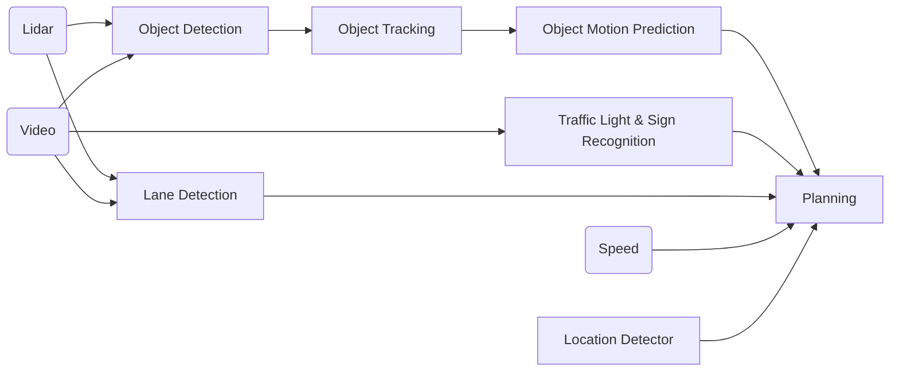

<!-- references -->
Example: Zong, W., Zhang, C., Wang, Z., Zhu, J., & Chen, Q. (2018). [Architecture design and implementation of an autonomous vehicle](https://ieeexplore.ieee.org/stamp/stamp.jsp?tp=&arnumber=8340798). IEEE access, 6, 21956-21970.


----
# Dev vs. Ops


<!-- .element: class="stretch" -->

----
## Developers


* Coding
* Testing, static analysis, reviews
* Continuous integration
* Bug tracking
* Running local tests and scalability experiments
* ...

<!-- split -->
## Operations

* Allocating hardware resources
* Managing OS updates
* Monitoring performance
* Monitoring crashes
* Managing load spikes, …
* Tuning database performance
* Running distributed at scale
* Rolling back releases
* ...

QA responsibilities in both roles


----
## Heavy tooling and automation

[](devops_tools.jpg)

----


----
## Docker Example

```docker
FROM ubuntu:latest
MAINTAINER ...
RUN apt-get update -y
RUN apt-get install -y python-pip python-dev build-essential
COPY . /app
WORKDIR /app
RUN pip install -r requirements.txt
ENTRYPOINT ["python"]
CMD ["app.py"]
```

<!-- references -->
Source: http://containertutorials.com/docker-compose/flask-simple-app.html

----
## Ansible Examples

* Software provisioning, configuration management, and application-deployment tool
* Apply scripts to many servers

<!-- colstart -->
```ini
[webservers]
web1.company.org
web2.company.org
web3.company.org

[dbservers]
db1.company.org
db2.company.org

[replication_servers]
...
```
<!-- col -->
```yml
# This role deploys the mongod processes and sets up the replication set.
- name: create data directory for mongodb
  file: path={{ mongodb_datadir_prefix }}/mongo-{{ inventory_hostname }} state=directory owner=mongod group=mongod
  delegate_to: '{{ item }}'
  with_items: groups.replication_servers

- name: create log directory for mongodb
  file: path=/var/log/mongo state=directory owner=mongod group=mongod

- name: Create the mongodb startup file
  template: src=mongod.j2 dest=/etc/init.d/mongod-{{ inventory_hostname }} mode=0655
  delegate_to: '{{ item }}'
  with_items: groups.replication_servers


- name: Create the mongodb configuration file
  template: src=mongod.conf.j2 dest=/etc/mongod-{{ inventory_hostname }}.conf
  delegate_to: '{{ item }}'
  with_items: groups.replication_servers

- name: Copy the keyfile for authentication
  copy: src=secret dest={{ mongodb_datadir_prefix }}/secret owner=mongod group=mongod mode=0400

- name: Start the mongodb service
  command: creates=/var/lock/subsys/mongod-{{ inventory_hostname }} /etc/init.d/mongod-{{ inventory_hostname }} start
  delegate_to: '{{ item }}'
  with_items: groups.replication_servers

- name: Create the file to initialize the mongod replica set
  template: src=repset_init.j2 dest=/tmp/repset_init.js

- name: Pause for a while
  pause: seconds=20

- name: Initialize the replication set
  shell: /usr/bin/mongo --port "{{ mongod_port }}" /tmp/repset_init.js
```
<!-- colend -->

----


<!-- references -->
CC BY-SA 4.0 [Khtan66](https://en.wikipedia.org/wiki/Kubernetes#/media/File:Kubernetes.png)


----


<!-- references -->
https://ml-ops.org/

----
## Tooling Landscape LF AI

[](https://landscape.lfai.foundation/)

<!-- references -->
Linux Foundation AI Initiative


----
# Homework 3: Open Source Tools


----

# Project M2: Infrastructure Quality

(online and offline evaluation, data quality, pipeline quality, CI)

----
# Midterm 

Smart Fridge Feature "EatSoon"

----
# Spring Break


---
# Managing and Processing Large Datasets

Christian Kaestner

<!-- references -->

Required watching: Molham Aref. [Business Systems with Machine Learning](https://www.youtube.com/watch?v=_bvrzYOA8dY). Guest lecture, 2020.

Suggested reading: Martin Kleppmann. [Designing Data-Intensive Applications](https://dataintensive.net/). OReilly. 2017. 

----

# Learning Goals

* Organize different data management solutions and their tradeoffs
* Understand the scalability challenges involved in large-scale machine learning and specifically deep learning
* Explain the tradeoffs between batch processing and stream processing and the lambda architecture
* Recommend and justify a design and corresponding technologies for a given system

----
# Case Study


----

## "Zoom adding capacity"

<iframe src="https://giphy.com/embed/3oz8xtBx06mcZWoNJm" width="480" height="362" frameBorder="0" class="giphy-embed" allowFullScreen></iframe>

----
# Kinds of Data

* Training data
* Input data
* Telemetry data
* (Models)

*all potentially with huge total volumes and high throughput*

*need strategies for storage and processing*

----
# Excursion: Deep Learning & Scale


<!-- .element: class="stretch" -->


----
## Parameter Server Architecture

[](https://www.usenix.org/system/files/conference/osdi14/osdi14-paper-li_mu.pdf)
<!-- .element: class="stretch" -->


----

## Document Data Models

```js
{
    "id": 1,
    "name": "Christian",
    "email": "kaestner@cs.",
    "dpt": [
        {"name": "ISR", "address": "..."}
    ],
    "other": { ... }
}

```

```js
db.getCollection('users').find({"name": "Christian"})
```

----
## Log files, unstructured data

```
2020-06-25T13:44:14,601844,GET /data/m/goyas+ghosts+2006/17.mpg
2020-06-25T13:44:14,935791,GET /data/m/the+big+circus+1959/68.mpg
2020-06-25T13:44:14,557605,GET /data/m/elvis+meets+nixon+1997/17.mpg
2020-06-25T13:44:14,140291,GET /data/m/the+house+of+the+spirits+1993/53.mpg
2020-06-25T13:44:14,425781,GET /data/m/the+theory+of+everything+2014/29.mpg
2020-06-25T13:44:14,773178,GET /data/m/toy+story+2+1999/59.mpg
2020-06-25T13:44:14,901758,GET /data/m/ignition+2002/14.mpg
2020-06-25T13:44:14,911008,GET /data/m/toy+story+3+2010/46.mpg
```


----
## Partitioning

Divide data:

* Horizontal partitioning: Different rows in different tables; e.g., movies by decade, hashing often used
* Vertical partitioning: Different columns in different tables; e.g., movie title vs. all actors

**Tradeoffs?**

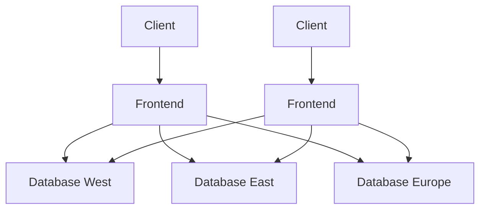


----
## Replication Strategies: Leaders and Followers

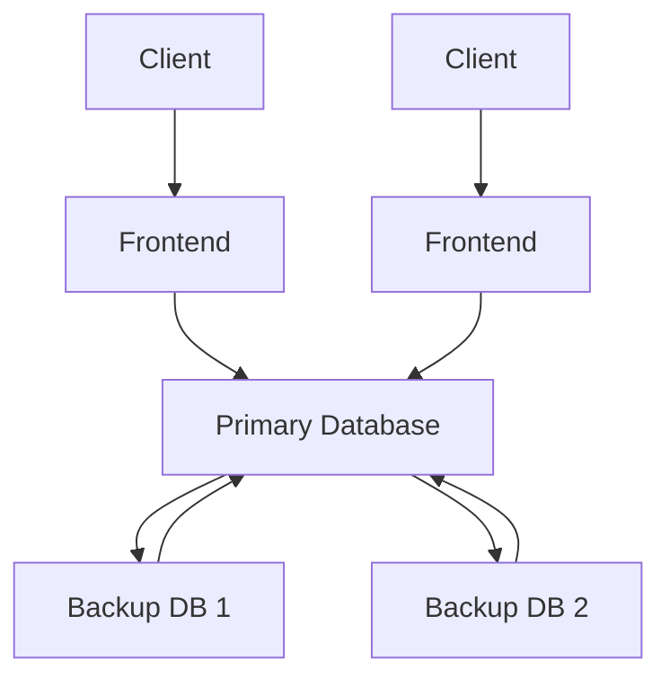
----
## Microservices

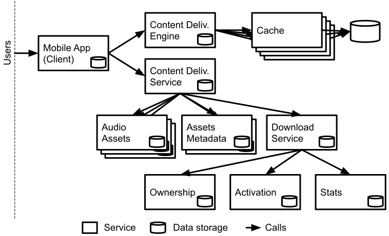
<!-- .element: class="plain" -->

<!-- references -->
Figure based on Christopher Meiklejohn. [Dynamic Reduction: Optimizing Service-level Fault Injection Testing With Service Encapsulation](http://christophermeiklejohn.com/filibuster/2021/10/14/filibuster-4.html). Blog Post 2021

----
# Batch Processing

* Analyzing TB of data, typically distributed storage
* Filtering, sorting, aggregating
* Producing reports, models, ...

```sh
cat /var/log/nginx/access.log |
    awk '{print $7}' |
    sort |
    uniq -c |
    sort -r -n |
    head -n 5
```

----
[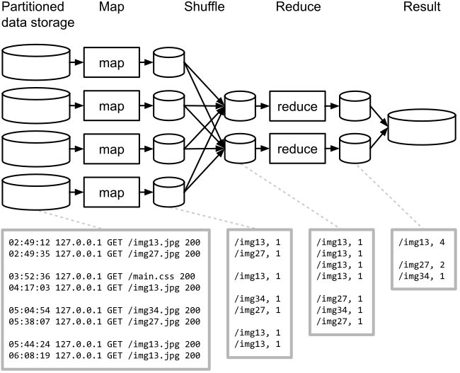](mapreduce.svg)
<!-- .element: class="stretch plain" -->

----
## Key Design Principle: Data Locality

> Moving Computation is Cheaper than Moving Data -- [Hadoop Documentation](https://hadoop.apache.org/docs/stable/hadoop-project-dist/hadoop-hdfs/HdfsDesign.html#aMoving_Computation_is_Cheaper_than_Moving_Data)

* Data often large and distributed, code small
* Avoid transfering large amounts of data
* Perform computation where data is stored (distributed)
* Transfer only results as needed
* 
* "The map reduce way"

----

## Stream Processing (e.g., Kafka)

<!-- .element: class="stretch plain" -->

----
## Event Sourcing

* Append only databases
* Record edit events, never mutate data
* Compute current state from all past events, can reconstruct old state
* For efficiency, take state snapshots
* Similar to traditional database logs

```text
createUser(id=5, name="Christian", dpt="SCS")
updateUser(id=5, dpt="ISR")
deleteUser(id=5)
```

----
## Lambda Architecture and Machine Learning


<!-- .element: class="stretch plain" -->


* Learn accurate model in batch job
* Learn incremental model in stream processor

----

[](https://youtu.be/_bvrzYOA8dY?t=1452)

<!-- reference -->
Molham Aref "[Business Systems with Machine Learning](https://www.youtube.com/watch?v=_bvrzYOA8dY)"


----
## Data Warehousing (OLAP)

* Large denormalized databases with materialized views for large scale reporting queries
* e.g. sales database, queries for sales trends by region
* 
* Read-only except for batch updates: Data from OLTP systems loaded periodically, e.g. over night


---

# Process and Technical Debt

Christian Kaestner


<!-- references -->

Required Reading: 
* Sculley, David, Gary Holt, Daniel Golovin, Eugene Davydov, Todd Phillips, Dietmar Ebner, Vinay Chaudhary, Michael Young, Jean-Francois Crespo, and Dan Dennison. "[Hidden technical debt in machine learning systems](http://papers.nips.cc/paper/5656-hidden-technical-debt-in-machine-learning-systems.pdf)." In Advances in neural information processing systems, pp. 2503-2511. 2015.

Suggested Readings: 
* Fowler and Highsmith. [The Agile Manifesto](http://agilemanifesto.org/)
* Steve McConnell. Software project survival guide. Chapter 3
* Pfleeger and Atlee. Software Engineering: Theory and Practice. Chapter 2
* Kruchten, Philippe, Robert L. Nord, and Ipek Ozkaya. "[Technical debt: From metaphor to theory and practice](https://resources.sei.cmu.edu/asset_files/WhitePaper/2012_019_001_58818.pdf)." IEEE Software 29, no. 6 (2012): 18-21.
* Patel, Kayur, James Fogarty, James A. Landay, and Beverly Harrison. "[Investigating statistical machine learning as a tool for software development](http://www.kayur.org/papers/chi2008.pdf)." In Proceedings of the SIGCHI Conference on Human Factors in Computing Systems, pp. 667-676. 2008.


----

## Learning Goals

* Contrast development processes of software engineers and data scientists
* Outline process conflicts between different roles and suggest ways to mitigate them
* Recognize the importance of process
* Describe common agile practices and their goals
* Understand and correctly use the metaphor of technical debt
* Describe how ML can incur reckless and inadvertent technical debt, outline common sources of technical debt

----

<!-- .element: class="plain" -->

----
## Case Study: Real-Estate Website


----
## Data Science is Iterative and Exploratory


<!-- .element: class="stretch" -->

(Source: Guo. "[Data Science Workflow: Overview and Challenges](https://cacm.acm.org/blogs/blog-cacm/169199-data-science-workflow-overview-and-challenges/fulltext)." Blog@CACM, Oct 2013)


----
## Data Science is Iterative and Exploratory

[](accuracy-improvements.png)
<!-- .element: class="stretch" -->


Source: Patel, Kayur, James Fogarty, James A. Landay, and Beverly Harrison. "[Investigating statistical machine learning as a tool for software development](http://www.kayur.org/papers/chi2008.pdf)." In Proc. CHI, 2008.

Notes:
This figure shows the result from a controlled experiment in which participants had 2 sessions of 2h each to build a model. Whenever the participants evaluated a model in the process, the accuracy is recorded. These plots show the accuracy improvements over time, showing how data scientists make incremental improvements through frequent iteration.


----
## Computational Notebooks

<!-- colstart -->

* Origins in "literal programming", interleaving text and code, treating programs as literature (Knuth'84)
* First notebook in Wolfram Mathematica 1.0 in 1988
* Document with text and code cells, showing execution results under cells
* Code of cells is executed, per cell, in a kernel
* Many notebook implementations and supported languages, Python + Jupyter currently most popular


<!-- col -->


<!-- colend -->

Notes:
* See also https://en.wikipedia.org/wiki/Literate_programming
* Demo with public notebook, e.g., https://colab.research.google.com/notebooks/mlcc/intro_to_pandas.ipynb

----

## A Simple Process

1. Discuss the software that needs to be written
2. Write some code
3. Test the code to identify the defects
4. Debug to find causes of defects
5. Fix the defects
6. If not done, return to step 1

----


----

Notes: Empirically well established rule: Bugs are increasingly expensive to fix the larger the distance between the phase where they are created vs where they are corrected.


----
## Waterfall Model


<!-- .element: class="stretch" -->

*taming the chaos, understand requirements, plan before coding, remember testing*

([CC-BY-SA-2.5](https://commons.wikimedia.org/wiki/File:Waterfall_model.png))

Notes: Although dated, the key idea is still essential -- think and plan before implementing. Not all requirements and design can be made upfront, but planning is usually helpful.

----
## Constant iteration: Agile


*working with customers, constant replanning*

(CC BY-SA 4.0, Lakeworks)

----
## Discussion: Iteration in Notebook vs Agile? 

<!-- colstart -->
[](accuracy-improvements.png)
<!-- col -->

(CC BY-SA 4.0, Lakeworks)
<!-- colend -->


----
## Poor Software Engineering Practices in Notebooks?

<!-- colstart -->

<!-- col -->
*
* Little abstraction
* Global state
* No testing
* Heavy copy and paste
* Little documentation
* Poor version control
* Out of order execution
* Poor development features (vs IDE)
<!-- colend -->


----
## Process for AI-Enabled Systems

* Integrate Software Engineering and Data Science processes
* Establish system-level requirements (e.g., user needs, safety, fairness)
* Inform data science modeling with system requirements (e.g., privacy, fairness)
* Try risky parts first (most likely include ML components; ~spiral)
* Incrementally develop prototypes, incorporate user feedback (~agile)
* Provide flexibility to iterate and improve 
* Design system with characteristics of AI component (e.g., UI design, safeguards)
* Plan for testing throughout the process and in production
* Manage project understanding both software engineering and data science workflows
* 
* No existing "best practices" or workflow models

----
# Technical debt


[](https://www.monkeyuser.com/2018/tech-debt/) 
<!-- .element: class="stretch" -->


----

## ML and Technical Debt 

* **Often reckless and inadvertent in inexperienced teams**
* ML can seem like an easy addition, but it may cause long-term costs
* Needs to be maintained, evolved, and debugged
* Goals may change, environment may change, some changes are subtle
* 
* Example problems
    - Systems and models are tangled and changing one has cascading effects on the other
    - Untested, brittle infrastructure; manual deployment
    - Unstable data dependencies, replication crisis 
    - Data drift and feedback loops
    - Magic constants and dead experimental code paths

<!-- references -->
Further reading: Sculley, David, et al. [Hidden technical debt in machine learning systems](http://papers.nips.cc/paper/5656-hidden-technical-debt-in-machine-learning-systems.pdf). Advances in Neural Information Processing Systems. 2015.


---

# Human-AI Interaction

Eunsuk Kang

<!-- references -->

Required reading:

Building Intelligent Systems by Geoff Hulten (2018),
Chapter 8.

_Guidelines for Human-AI Interaction_. Saleema Amershi, et al., in CHI 2019.

Optional reading:

_Will You Accept an Imperfect AI? Exploring Designs for Adjusting
End-user Expectations of AI Systems_. Kocielnik, et al., in CHI 2019

----
# Learning Goals

* Understand the risks of poor interaction design
* Understand the challenges behind designing human-AI interactions
* Understand the basic elements of user interaction design
* Consider design considerations for AI-based systems
  * Modes of interaction: Automate or augment?
  * Mental model: User understanding of what AI is doing
  * Dealing with errors: Guide user towards recovery & prevention
  * Feedback and control: Align user feedback with AI improvement


----
## Poor Interaction Design Confuses Users


<!-- .element: class="stretch" -->

----
## Poor Interaction Design Causes Harm


<!-- .element: class="stretch" -->

----
## Dimensions of Usability

* Learnability: How easy is it for users to accomplish tasks the
first time?
* Efficiency: After learning, how efficiently can users perform the
tasks?
* Memorability: Can users remember to perform the tasks after a period of
not using the system?
* Errors: How often do users make errors, how severe are these
errors, and how easily can they recover from the errors?
* Satisfaction: How pleasant is it to use the design?

<!-- references -->

https://www.nngroup.com/articles/usability-101-introduction-to-usability/

----
## Modes of Interaction

* Automate: Take action on user's behalf
* Augment: Provide options or additional information
  * Prompt: Ask the user if an action should be taken
  * Organize: Display a set of items in an order
  * Annotate: Add information to a display
* Hybrid of above


----
## Dealing with Errors in ML

* Define types of errors & their costs
  * False positives vs. false negatives
  * Optimize for one with lower costs
  * Q. For meeting scheduling, which are more acceptable?
* Detect & record occurrences of errors
  * Collect telemetry or user feedback
  * e.g. user rejects inferred meeting schedule
* Identify sources of errors
  * Poor/bias training data, noise in data, data drifts
* Provide meaningful error messages to user
  * Provide an explanation for the error
  * Suggest actions to fix the error (e.g., "Edit details" option)
* Give user controls to recover from and mitigate the effect of an error
  * e.g., delete or modify incorrect meeting schedule


----
## Setting User Expectations for ML Errors

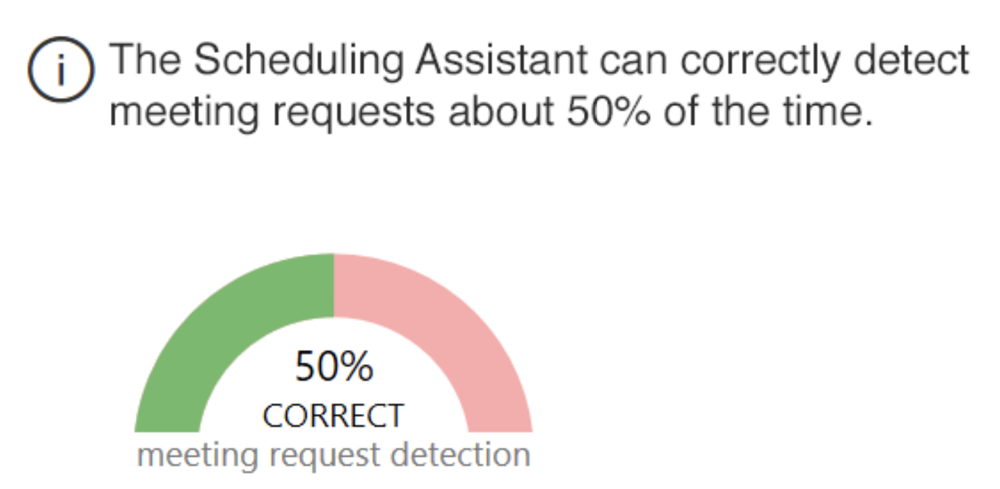
<!-- .element: class="stretch" -->

* Be upfront about how well the system performs (e.g., model accuracy)
* Temper the user's expectations and avoid surprises

<!--references -->

_Will You Accept an Imperfect AI? Exploring Designs for Adjusting
End-user Expectations of AI Systems_. Kocielnik, et. al. (CHI 2019)


----
## Responding to Feedback


* When possible, respond to feedback with an adjustment to AI behavior

<!-- references -->

https://pair.withgoogle.com/chapter/feedback-controls/

----
## Giving User Control  over ML Behavior


* Provide a mechanism for the user to control the types of ML errors
* Scheduling assistant: Adjust thresholds to achieve trade-offs
  between precision vs recall

----


<!-- .element: class="stretch" -->


---
# Intro to Ethics and Fairness

Eunsuk Kang

<!-- references -->

Required reading: R. Caplan, J. Donovan, L. Hanson, J.
Matthews. "Algorithmic Accountability: A Primer", Data & Society
(2018).

----
# Learning Goals

* Review the importance of ethical considerations in designing AI-enabled systems
* Recall basic strategies to reason about ethical challenges
* Diagnose potential ethical issues in a given system
* Understand the types of harm that can be caused by ML
* Understand the sources of bias in ML

----

<!-- .element: class="plain" -->


----


<!-- split -->

*In September 2015, Shkreli received widespread criticism when Turing obtained the manufacturing license for the antiparasitic drug Daraprim and raised its price by a factor of 56 (from USD 13.5 to 750 per pill), leading him to be referred to by the media as "the most hated man in America" and "Pharma Bro".* -- [Wikipedia](https://en.wikipedia.org/wiki/Martin_Shkreli)

"*I could have raised it higher and made more profits for our shareholders. Which is my primary duty.*" -- Martin Shkreli


----
## Optimizing for Organizational Objective


<!-- .element: class="stretch" -->

* How do we maximize the user engagement?
  - Infinite scroll: Encourage non-stop, continual use
  - Personal recommendations: Suggest news feed to increase engagement
  - Push notifications: Notify disengaged users to return to the app

----
## Disinformation & Polarization


<!-- .element: class="stretch" -->


----
## Discrimination


<!-- references -->
https://twitter.com/bascule/status/1307440596668182528


----
## Challenges

* Misalignment between organizational goals & societal values
  * Financial incentives often dominate other goals ("grow or die")
* Insufficient amount of regulations
  * Little legal consequences for causing negative impact (with some exceptions)
  * Poor understanding of socio-technical systems by policy makers 
* Engineering challenges, both at system- & ML-level
  * Difficult to clearly define or measure ethical values
  * Difficult to predict possible usage contexts
  * Difficult to predict impact of feedback loops
  * Difficult to prevent malicious actors from abusing the system
  * Difficult to interpret output of ML and make ethical decisions
  * ...
  
**These problems have existed before, but they are being
  rapidly exacerbated by the widespread use of ML**


----
## Legally protected classes (US)

* Race (Civil Rights Act of 1964)
* Color (Civil Rights Act of 1964)
* Sex (Equal Pay Act of 1963; Civil Rights Act of 1964)
* Religion (Civil Rights Act of 1964)
* National origin (Civil Rights Act of 1964)
* Citizenship (Immigration Reform and Control Act)
* Age (Age Discrimination in Employment Act of 1967)
* Pregnancy (Pregnancy Discrimination Act)
* Familial status (Civil Rights Act of 1968)
* Disability status (Rehabilitation Act of 1973; Americans with Disabilities Act of 1990)
* Veteran status (Vietnam Era Veterans' Readjustment Assistance Act of 1974; Uniformed Services Employment and Reemployment Rights Act)
* Genetic information (Genetic Information Nondiscrimination Act)

<!-- references -->
Barocas, Solon and Moritz Hardt. "[Fairness in machine learning](https://mrtz.org/nips17/#/)." NIPS Tutorial 1 (2017).

----


----
## Harms of Allocation

* Withhold opportunities or resources
* Poor quality of service, degraded user experience for certain groups


**Other examples?**

<!-- references -->

_[Gender Shades: Intersectional Accuracy Disparities in
Commercial Gender Classification](http://proceedings.mlr.press/v81/buolamwini18a/buolamwini18a.pdf)_, Buolamwini & Gebru, ACM FAT* (2018).

----
## Harms of Representation

* Reinforce stereotypes, subordination along the lines of identity


**Other examples?**

<!-- references -->

Latanya Sweeney. [Discrimination in Online Ad Delivery](https://dl.acm.org/doi/pdf/10.1145/2460276.2460278), SSRN (2013).

----
## Case Study: College Admission


* Objective: Decide "Is this student likely to succeed"?
* Possible harms: Allocation of resources? Quality of service?
  Stereotyping? Denigration? Over-/Under-representation?

----
## Not all discrimination is harmful


* Loan lending: Gender discrimination is illegal.
* Medical diagnosis: Gender-specific diagnosis may be desirable.
* Discrimination is a __domain-specific__ concept!

**Other examples?**


----
##  Where does the bias come from?


<!-- references -->

Caliskan et al., _[Semantics derived automatically from language corpora contain
human-like biases](http://cs.bath.ac.uk/~jjb/ftp/CaliskanEtAl-authors-full.pdf)_, Science (2017).


----
## Historical Bias

*Data reflects past biases, not intended outcomes*


----
## Tainted Examples

*Samples or labels reflect human bias*


----
## Skewed Sample

*Crime prediction for policing strategy*


----
## Sample Size Disparity

*Less training data available for certain subpopulations*


Example: "Shirley Card" used for color calibration


----
# Massive Potential Damage

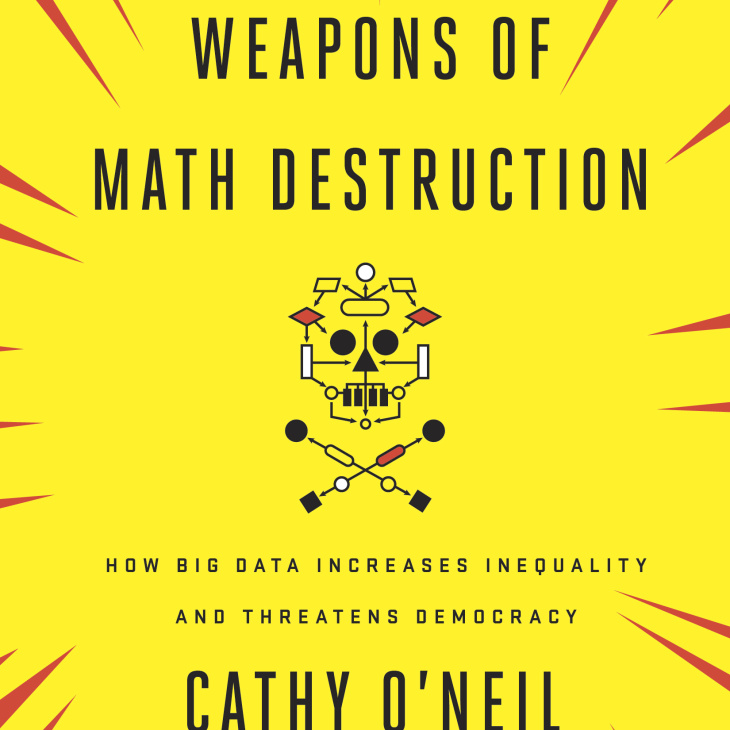
<!-- .element: class="stretch" -->

O'Neil, Cathy. [Weapons of math destruction: How big data increases inequality and threatens democracy](https://cmu.primo.exlibrisgroup.com/permalink/01CMU_INST/6lpsnm/alma991016462699704436). Broadway Books, 2016.

----
## Feedback Loops

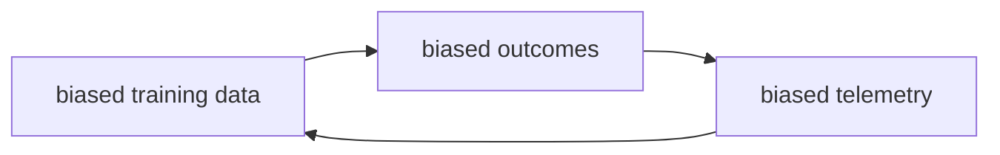

> "Big Data processes codify the past.  They do not invent the future.  Doing that requires moral imagination, and that’s something only humans can provide. " -- Cathy O'Neil in [Weapons of Math Destruction](https://cmu.primo.exlibrisgroup.com/permalink/01CMU_INST/6lpsnm/alma991016462699704436)


---

# Fairness: Definitions and Measurements

Eunsuk Kang

<!-- references -->

Required reading: Holstein, Kenneth, Jennifer Wortman Vaughan, Hal
Daumé III, Miro Dudik, and Hanna
Wallach. "[Improving fairness in machine learning systems: What do industry practitioners need?](http://users.umiacs.umd.edu/~hal/docs/daume19fairness.pdf)"
In Proceedings of the 2019 CHI Conference on Human Factors in
Computing Systems, pp. 1-16. 2019.


----
# Learning Goals

* Understand different definitions of fairness
* Discuss methods for measuring fairness


----
### Fairness is still an actively studied & disputed concept!


<!-- references -->
Source: Mortiz Hardt, https://fairmlclass.github.io/

----
## Anti-Classification


* Ignore/eliminate sensitive attributes from dataset
* Limitations
  * Sensitive attributes may be correlated with other features
  * Some ML tasks need sensitive attributes (e.g., medical diagnosis)


----
## Testing Anti-Classification

Straightforward invariant for classifier $f$ and protected attribute $p$: 

$\forall x. f(x[p\leftarrow 0]) = f(x[p\leftarrow 1])$

*(does not account for correlated attributes)*

Test with random input data (see prior lecture on [Automated Random Testing](https://ckaestne.github.io/seai/S2020/slides/04_modelquality/modelquality.html#/10)) or on any test data

Any single inconsistency shows that the protected attribute was used. Can also report percentage of inconsistencies.

<!-- references -->
See for example: Galhotra, Sainyam, Yuriy Brun, and Alexandra Meliou. "[Fairness testing: testing software for discrimination](http://people.cs.umass.edu/brun/pubs/pubs/Galhotra17fse.pdf)." In Proceedings of the 2017 11th Joint Meeting on Foundations of Software Engineering, pp. 498-510. 2017.


----
## Independence 

(aka _statistical parity_, _demographic parity_, _disparate impact_, _group fairness_)

$P[R = 1 | A = 0]  = P[R = 1 | A = 1]$ or $R \perp A$

* *Acceptance rate* (i.e., percentage of positive predictions) must be the same across all groups
* Prediction must be independent of the sensitive attribute
* Example: 
  * The predicted rate of recidivism is the same across all races
  * Chance of promotion the same across all genders


----
## Exercise: Cancer Diagnosis


* 1000 data samples (500 male & 500 female patients)
* What's the overall recall & precision?
* Does the model achieve *independence*


----
## Calibration to Achieve Independence

Select different thresholds for different groups to achieve prediction parity:

$P[R > t_0 | A = 0]  = P[R > t_1 | A = 1]$


Lowers bar for some groups -- equity, not equality


----
## Separation

$P[Y'=1∣Y=0,A=a] = P[Y'=1∣Y=0,A=b]$
$P[Y'=0∣Y=1,A=a] = P[Y'=0∣Y=1,A=b]$

* Also called _equalized odds_ 
* $Y' \perp A | Y$
  * Prediction must be independent of the sensitive attribute
  _conditional_ on the target variable


----


----
## Review of Criteria so far:

*Recidivism scenario: Should a person be detained?*

* Anti-classification: ?
* Independence: ?
* Separation: ?

<!-- split -->


 ----
## Can we achieve fairness during the learning process?

* Data acquisition:
  - Collect additional data if performance is poor on some groups
* Pre-processing:
  * Clean the dataset to reduce correlation between the feature set
    and sensitive attributes
* Training time constraint
  * ML is a constraint optimization problem (i.e., minimize errors)
  * Impose additional parity constraint into ML optimization process
    (as part of the loss function)
* Post-processing
  * Adjust thresholds to achieve a desired fairness metric
* (Still active area of research! Many new techniques published each year)

<!-- references -->
_Training Well-Generalizing Classifiers for Fairness Metrics and
Other Data-Dependent Constraints_, Cotter et al., (2018).

----
## Trade-offs: Accuracy vs Fairness


* Fairness constraints possible models
* Fairness constraints often lower accuracy for some group

<!-- references -->

_Fairness Constraints: Mechanisms for Fair Classification_, Zafar et
al., AISTATS (2017).


---

# Fairness: Beyond Model


Eunsuk Kang

<!-- references -->
Required reading: Os Keyes, Jevan Hutson, Meredith Durbin. [A Mulching Proposal: Analysing and Improving an Algorithmic System for Turning the Elderly into High-Nutrient Slurry](https://dl.acm.org/doi/pdf/10.1145/3290607.3310433). CHI Extended Abstracts, 2019.

----
# Learning Goals

* Consider achieving fairness in AI-based systems as an activity throughout the entire development cycle
* Understand the role of requirements engineering in selecting ML
  fairness criteria
* Understand the process of constructing datasets for fairness
* Consider the potential impact of feedback loops on AI-based systems
  and need for continuous monitoring


 

----
## Fairness must be considered throughout the ML lifecycle!


<!-- references -->

_Fairness-aware Machine Learning_, Bennett et al., WSDM Tutorial (2019).

----
## Recall: Machine vs World


* No ML/AI lives in vacuum; every system is deployed as part of the world
* A requirement describes a desired state of the world (i.e., environment)
* Machine (software) is _created_ to manipulate the environment into
this state
----
## Requirements for Fair ML Systems

* Understand the environment and its assumptions 
  * Who are the stakeholders? Any disadvantaged groups? 
  * What is the target population distribution like?
* Identify fairness requirements 
  * What is the ultimate goal of the system being developed?
  * What types of harm can be caused as side effects?
  * Are we trying to achieve equality vs. equity? 
  * Are there are any legal requirements to consider? 
* Define the interface between the environment & machine (ML)
  * What data will be sensed/measured by AI? Potential biases?
  * What types of decisions will the system make? Punitive or assistive?


<!-- references -->
Holstein, Kenneth, Jennifer Wortman Vaughan, Hal Daumé III, Miro Dudik, and Hanna Wallach. "[Improving fairness in machine learning systems: What do industry practitioners need?](http://users.umiacs.umd.edu/~hal/docs/daume19fairness.pdf)" In Proceedings of the 2019 CHI Conference on Human Factors in Computing Systems, pp. 1-16. 2019.


----
## Type of Decision & Possible Harm

* If decision is _punitive_ in nature:
  * e.g. decide whom to deny bail based on risk of recidivism
  * Harm is caused when a protected group is given an unwarranted penalty
  * Heuristic: Use a fairness metric (separation) based on __false positive rate__
* If decision is _assistive_ in nature:
  * e.g., decide who should receive a loan or a food subsidy
  * Harm is caused when a group in need is incorrectly denied assistance
  * Heuristic: Use a fairness metric based on __false negative rate__


----
## Fairness Tree


For details on other types of fairness metrics, see:
https://textbook.coleridgeinitiative.org/chap-bias.html


----
## Data Bias


* A __systematic distortion__ in data that compromises its use for a task
* Bias can be introduced at any stage of the data pipeline!


----
## Data Sheets 


* A process for documenting datasets
* Based on common practice in the electronics industry, medicine
* Purpose, provenance, creation, composition, distribution: Does the dataset relate to people? Does the dataset identify any subpopulations?

<!-- references -->

_[Datasheets for Dataset](https://arxiv.org/abs/1803.09010)_, Gebru et al., (2019). 


----
## Monitoring and Auditing: Feedback Loops


> "Big Data processes codify the past.  They do not invent the future.  Doing that requires moral imagination, and that’s something only humans can provide. " -- Cathy O'Neil in [Weapons of Math Destruction](https://cmu.primo.exlibrisgroup.com/permalink/01CMU_INST/6lpsnm/alma991016462699704436)


----
## Long-term Impact of ML


* ML systems make multiple decisions over time, influence the
behaviors of populations in the real world
* But most models are built & optimized assuming that the world is
static!
* Difficult to estimate the impact of ML over time
  * Need to reason about the system dynamics (world vs machine)
  * e.g., what's the effect of a loan lending policy on a population?

----
## Monitoring Tools: Example


http://aequitas.dssg.io/

----
## Fairness Checklist

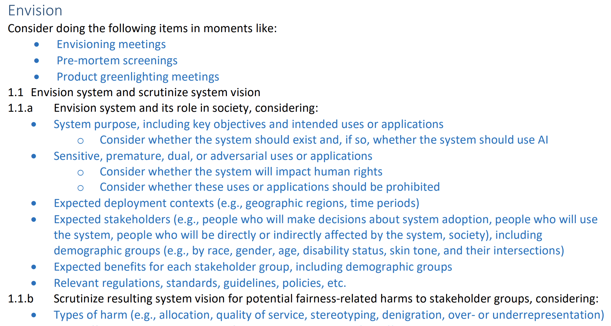

<!-- references -->

[_Co-Designing Checklists to Understand Organizational
Challenges and Opportunities around Fairness in AI_](http://www.jennwv.com/papers/checklists.pdf), Madaio et al (2020).


----
# Homework 4: Fairness

(credit scoring + recommendation, model + system)


---


# Interpretability and Explainability

Christian Kaestner


<!-- references -->

Required reading: 🎧 Data Skeptic Podcast Episode “[Black Boxes are not Required](https://dataskeptic.com/blog/episodes/2020/black-boxes-are-not-required)” with Cynthia Rudin (32min) or 🗎 Rudin, Cynthia. "[Stop explaining black box machine learning models for high stakes decisions and use interpretable models instead](https://arxiv.org/abs/1811.10154)." Nature Machine Intelligence 1, no. 5 (2019): 206-215.  

Recommended supplementary reading: 🕮 Christoph Molnar. "[Interpretable Machine Learning: A Guide for Making Black Box Models Explainable](https://christophm.github.io/interpretable-ml-book/)." 2019
----
# Learning Goals

* Understand the importance of and use cases for interpretability
* Explain the tradeoffs between inherently interpretable models and post-hoc explanations
* Measure interpretability of a model
* Select and apply techniques to debug/provide explanations for data, models and model predictions
* Eventuate when to use interpretable models rather than ex-post explanations

----
## Detecting Anomalous Commits

[](nodejs-unusual-commit.png)
<!-- .element: class="stretch" -->


Goyal, Raman, Gabriel Ferreira, Christian Kästner, and James Herbsleb. "[Identifying unusual commits on GitHub](https://www.cs.cmu.edu/~ckaestne/pdf/jsep17.pdf)." Journal of Software: Evolution and Process 30, no. 1 (2018): e1893.

----
## Is this recidivism model fair?

```
IF age between 18–20 and sex is male THEN predict arrest
ELSE 
IF age between 21–23 and 2–3 prior offenses THEN predict arrest
ELSE 
IF more than three priors THEN predict arrest
ELSE predict no arrest
```

<!-- references -->

Rudin, Cynthia. "[Stop explaining black box machine learning models for high stakes decisions and use interpretable models instead](https://arxiv.org/abs/1811.10154)." Nature Machine Intelligence 1, no. 5 (2019): 206-215.  

----
## What factors go into predicting stroke risk?


Rudin, Cynthia, and Berk Ustun. "[Optimized scoring systems: Toward trust in machine learning for healthcare and criminal justice](https://users.cs.duke.edu/~cynthia/docs/WagnerPrizeCurrent.pdf)." Interfaces 48, no. 5 (2018): 449-466.

----
## Is there an actual problem? How to find out?

<div class="tweet" data-src="https://twitter.com/dhh/status/1192540900393705474"></div>

----
## What's happening here?


<!-- .element: class="stretch" -->

----
## Legal Requirements


> The European Union General Data Protection Regulation extends the automated decision-making rights in the 1995 Data Protection Directive to provide a legally disputed form of a right to an explanation: "[the data subject should have] the right ... to obtain an explanation of the decision reached"
 
> US Equal Credit Opportunity Act requires to notify applicants of action taken with specific reasons: "The statement of reasons for adverse action required by paragraph (a)(2)(i) of this section must be specific and indicate the principal reason(s) for the adverse action."

<!-- references -->

See also https://en.wikipedia.org/wiki/Right_to_explanation

----
## Debugging

* Why did the system make a wrong prediction in this case?
* What does it actually learn?
* What kind of data would make it better?
* How reliable/robust is it?
* How much does the second model rely on the outputs of the first?
* Understanding edge cases

----
## Curiosity, learning, discovery, science

* What drove our past hiring decisions? Who gets promoted around here?
* What factors influence cancer risk? Recidivism?
* What influences demand for bike rentals?
* Which organizations are successful at raising donations and why?


----
## Interpretability Definitions 

> Interpretability is the degree to which a human can understand the cause of a decision

> Interpretability is the degree to which a human can consistently predict the model’s result.

(No mathematical definition)


----
## Good Explanations are contrastive

Counterfactuals. *Why this, rather than a different prediction?*

> Your loan application has been *declined*. If your *savings account* had had more than $100 your loan application would be *accepted*.

Partial explanations often sufficient in practice if contrastive


----
## Inherently Interpretable Models: Sparse Linear Models

$f(x) = \alpha + \beta_1 x_1 + ... + \beta_n x_n$

Truthful explanations, easy to understand for humans

Easy to derive contrastive explanation and feature importance

Requires feature selection/regularization to minimize to few important features (e.g. Lasso); possibly restricting possible parameter values


<!-- .element: class="stretch" -->
 
----
## Inherently Interpretable Models: Decision Trees 

Easy to interpret up to a size

Possible to derive counterfactuals and feature importance

Unstable with small changes to training data


```
IF age between 18–20 and sex is male THEN predict arrest
ELSE IF age between 21–23 and 2–3 prior offenses THEN predict arrest
ELSE IF more than three priors THEN predict arrest
ELSE predict no arrest
```


----
# Post-Hoc Explanations of Black-Box Models


(large research field, many approaches, much recent research)


<!-- references -->
Figure: Lundberg, Scott M., and Su-In Lee. [A unified approach to interpreting model predictions](http://papers.nips.cc/paper/7062-a-unified-approach-to-interpreting-model-predictions.pdf). Advances in Neural Information Processing Systems. 2017.


Christoph Molnar. "[Interpretable Machine Learning: A Guide for Making Black Box Models Explainable](https://christophm.github.io/interpretable-ml-book/)." 2019

----
## Global Surrogates

1. Select dataset X (previous training set or new dataset from same distribution)
2. Collect model predictions for every value ($y_i=f(x_i)$)
3. Train inherently interpretable model $g$ on (X,Y)
4. Interpret surrogate model $g$


Can measure how well $g$ fits $f$ with common model quality measures, typically $R^2$

**Advantages? Disadvantages?**


----
## Lime Example


<!-- references -->
Source: 
Christoph Molnar. "[Interpretable Machine Learning: A Guide for Making Black Box Models Explainable](https://christophm.github.io/interpretable-ml-book/)." 2019


----
## Partial Dependence Plot Example

*Bike rental in DC*


<!-- .element: class="stretch" -->

Source: 
Christoph Molnar. "[Interpretable Machine Learning](https://christophm.github.io/interpretable-ml-book/)." 2019


----
## Feature Importance Example


<!-- .element: class="stretch" -->


Source: 
Christoph Molnar. "[Interpretable Machine Learning](https://christophm.github.io/interpretable-ml-book/)." 2019


----
## Example: Anchors


<!-- references -->
Source: Ribeiro, Marco Tulio, Sameer Singh, and Carlos Guestrin. "[Anchors: High-precision model-agnostic explanations](https://www.aaai.org/ocs/index.php/AAAI/AAAI18/paper/download/16982/15850)." In Thirty-Second AAAI Conference on Artificial Intelligence. 2018.


----
## Example: Anchors


<!-- references -->
Source: Ribeiro, Marco Tulio, Sameer Singh, and Carlos Guestrin. "[Anchors: High-precision model-agnostic explanations](https://www.aaai.org/ocs/index.php/AAAI/AAAI18/paper/download/16982/15850)." In Thirty-Second AAAI Conference on Artificial Intelligence. 2018.
----
## Counterfactual Explanations

*if X had not occured, Y would not have happened*

> Your loan application has been *declined*. If your *savings account* had had more than $100 your loan application would be *accepted*.


-> Smallest change to feature values that result in given output


----
## Multiple Counterfactuals

Often long or multiple explanations

> Your loan application has been *declined*. If your *savings account* ...

> Your loan application has been *declined*. If your lived in ...

Report all or select "best" (e.g. shortest, most actionable, likely values)

<!-- split -->


(Rashomon effect)

---

# Transparency and Accountability

Christian Kaestner


<!-- references -->

Required reading: Google PAIR. People + AI Guidebook. Chapter: [Explainability and Trust](https://pair.withgoogle.com/chapter/explainability-trust/). 2019.

Recommended supplementary reading: 🕮 Christoph Molnar. "[Interpretable Machine Learning: A Guide for Making Black Box Models Explainable](https://christophm.github.io/interpretable-ml-book/)." 2019

----
## Gaming/Attacking the Model with Explanations?

*Does providing an explanation allow customers to 'hack' the system?*

* Loan applications?
* Apple FaceID?
* Recidivism?
* Auto grading?
* Cancer diagnosis?
* Spam detection?

<!-- split -->

<!-- discussion -->

----
## Gaming the Model with Explanations?

<iframe width="800" height="500" src="https://www.youtube.com/embed/w6rx-GBBwVg?start=147" frameborder="0" allow="accelerometer; autoplay; encrypted-media; gyroscope; picture-in-picture" allowfullscreen></iframe>

----
## Setting Cancer Imaging -- What explanations do radiologists want?


* *Past attempts often not successful at bringing tools into production. Radiologists do not trust them. Why?*
* [Wizard of oz study](https://en.wikipedia.org/wiki/Wizard_of_Oz_experiment) to elicit requirements


----
## Case Study: Facebook's Feed Curation


<!-- references -->

Eslami, Motahhare, Aimee Rickman, Kristen Vaccaro, Amirhossein Aleyasen, Andy Vuong, Karrie Karahalios, Kevin Hamilton, and Christian Sandvig. [I always assumed that I wasn't really that close to [her]: Reasoning about Invisible Algorithms in News Feeds](http://eslamim2.web.engr.illinois.edu/publications/Eslami_Algorithms_CHI15.pdf). In Proceedings of the 33rd annual ACM conference on human factors in computing systems, pp. 153-162. ACM, 2015.


----
## The Dark Side of Explanations

* Explanations can induce overconfidence in the model; people do not trust their own intuitions
* Users may feel influence and control, even with placebo controls
* Companies give vague generic explanations to appease regulators


<!-- references -->

* Stumpf, Simone, Adrian Bussone, and Dympna O’sullivan. "Explanations considered harmful? user interactions with machine learning systems." In Proc. CHI. 2016.
* Vaccaro, Kristen, Dylan Huang, Motahhare Eslami, Christian Sandvig, Kevin Hamilton, and Karrie Karahalios. "The illusion of control: Placebo effects of control settings." In Proc CHI, 2018.


----
## Human Oversight and Appeals

* Unavoidable that ML models will make mistakes
* Users knowing about the model may not be comforting 
* Inability to appeal a decision can be deeply frustrating

<div class="tweet" data-src="https://twitter.com/dhh/status/1192945019230945280"></div>

----
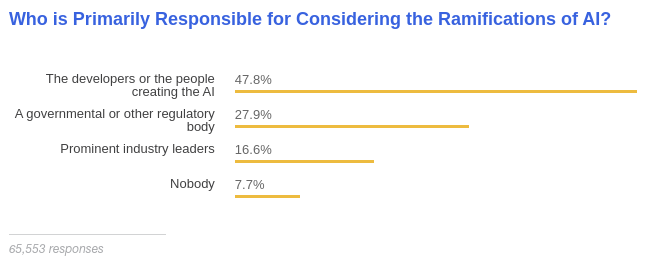

Results from the [2018 StackOverflow Survey](https://insights.stackoverflow.com/survey/2018/#technology-and-society)

----
# "Stop explaining black box machine learning models for high stakes decisions and use interpretable models instead."

<!-- references -->
Cynthia Rudin (32min) or 🗎 Rudin, Cynthia. "[Stop explaining black box machine learning models for high stakes decisions and use interpretable models instead](https://arxiv.org/abs/1811.10154)." Nature Machine Intelligence 1, no. 5 (2019): 206-215. 


----


----
[](https://www.forbes.com/sites/cognitiveworld/2020/03/01/this-is-the-year-of-ai-regulations/#1ea2a84d7a81)


---


# Versioning, Provenance, and Reproducability

Christian Kaestner

<!-- references -->

Required reading: 🗎 Halevy, Alon, Flip Korn, Natalya F. Noy, Christopher Olston, Neoklis Polyzotis, Sudip Roy, and Steven Euijong Whang. [Goods: Organizing google's datasets](http://research.google.com/pubs/archive/45390.pdf). In Proceedings of the 2016 International Conference on Management of Data, pp. 795-806. ACM, 2016. and 
🕮 Hulten, Geoff. "[Building Intelligent Systems: A Guide to Machine Learning Engineering.](https://www.buildingintelligentsystems.com/)" Apress, 2018, Chapter 21 (Organizing Intelligence).


----

# Learning Goals

* Judge the importance of data provenance, reproducibility and explainability for a given system
* Create documentation for data dependencies and provenance in a given system
* Propose versioning strategies for data and models
* Design and test systems for reproducibility


----

<div class="tweet" data-src="https://twitter.com/dhh/status/1192945019230945280"></div>

----
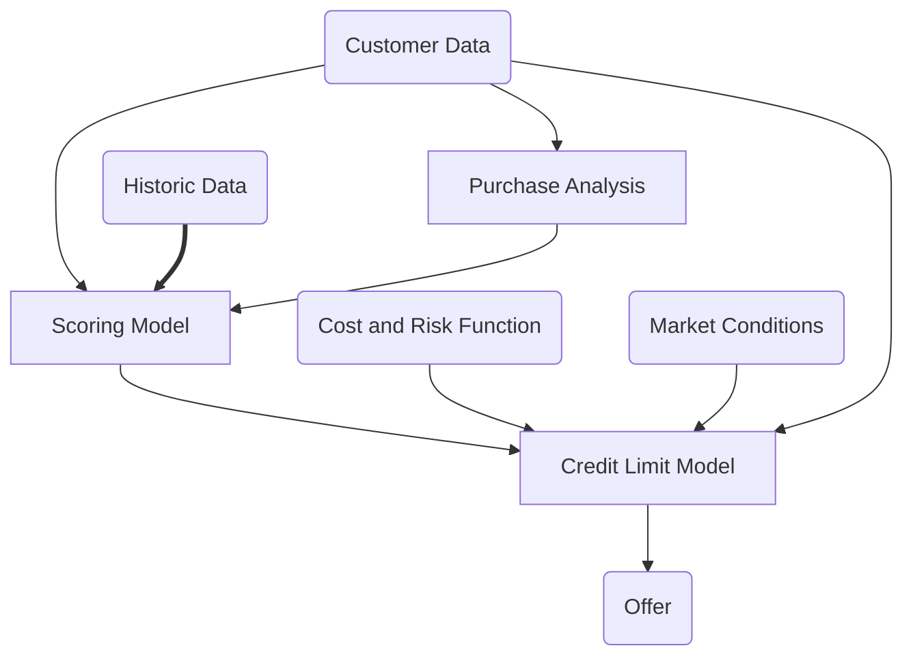


----

## Data Provenance

* Track origin of all data
    - Collected where?
    - Modified by whom, when, why?
    - Extracted from what other data or model or algorithm?
* ML models often based on data drived from many sources through many steps, including other models

----
## Versioning Datasets 

* Store copies of entire datasets (like Git)
* Store deltas between datasets (like Mercurial)
* Offsets in append-only database (like Kafka offset)
* History of individual database records (e.g. S3 bucket versions)
    - some databases specifically track provenance (who has changed what entry when and how)
    - specialized data science tools eg [Hangar](https://github.com/tensorwerk/hangar-py) for tensor data
* Version pipeline to recreate derived datasets ("views", different formats)
    - e.g. version data before or after cleaning?
*
* Often in cloud storage, distributed
* Checksums often used to uniquely identify versions
* Version also metadata

----
## Versioning Pipelines

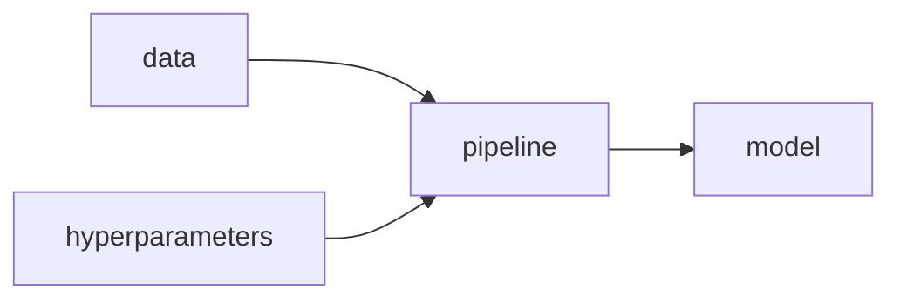


----

# Project M3: Monitoring and Continuous Deployment

(containization, monitoring, canary releases, provenance)


---
# Security

Eunsuk Kang

<!-- references -->
Required reading:
    _Building Intelligent Systems: A Guide to Machine Learning Engineering_, G. Hulten (2018), Chapter 25: Adversaries and Abuse.
    _The Top 10 Risks of Machine Learning Security_, G. McGraw et al., IEEE Computer (2020).

----
# Learning Goals

* Explain key concerns in security (in general and with regard to ML models)
* Analyze a system with regard to attacker goals, attack surface, attacker capabilities 
* Describe common attacks against ML models, including poisoning and evasion attacks
* Understand design opportunities to address security threats at the system level
* Identify security requirements with threat modeling
* Apply key design principles for secure system design

----
## Security Requirements


* "CIA triad" of information security
* __Confidentiality__: Sensitive data must be accessed by authorized users only
* __Integrity__: Sensitive data must be modifiable by authorized users only
* __Availability__: Critical services must be available when needed by clients

----
## Attacker Capability


* What are the attacker’s actions?
  * Depends on system boundary & its exposed interfaces
  * Use an architecture diagram to identify attack surface & actions
* Example: College admission
  * Physical: Break into building & access server
  * Cyber: Send malicious HTTP requests for SQL injection,
  DoS attack
  * Social: Send phishing e-mail, bribe an insider for access

----
## Poisoning Attack: Availability


* Availability: Inject mislabeled training data to damage model
quality
  * 3% poisoning => 11% decrease in accuracy (Steinhardt, 2017)
* Attacker must have some access to the training set
  * e.g., models trained on public data set (e.g., ImageNet)
* Example: Anti-virus (AV) scanner
  * Online platform for submission of potentially malicious code
  * Some AV company (allegedly) poisoned competitor's model
  

----
## Poisoning Attack: Integrity


* Insert training data with seemingly correct labels
* More targeted than availability attacks
  * Cause misclassification from one specific class to another

<!-- references -->
_Poison Frogs! Targeted Clean-Label Poisoning Attacks on Neural
Networks_, Shafahi et al. (2018)


----
## Example: Home Assistant Robot


* What are the security requirements?
* What are possible poisoning attacks?
* What does the attacker need to know/access?


----
## Defense against Poisoning Attacks


<!-- references -->

_Stronger Data Poisoning Attacks Break Data Sanitization Defenses_,
Koh, Steinhardt, and Liang (2018).

----
## Evasion Attacks (Adversarial Examples)


* Add noise to an existing sample & cause misclassification
* Attack at inference time
  * Typically assumes knowledge of the model (algorithm, parameters)
  * Recently, shown to be possible even when the attacker only has access to
    model output ("blackbox" attack)

<!-- references -->

_Accessorize to a Crime: Real and Stealthy Attacks on State-of-the-Art
Face Recognition_, Sharif et al. (2016).


----
## Task Decision Boundary vs Model Boundary

[](decisionboundary.png)
<!-- .element: class="stretch" -->

From Goodfellow et al (2018). [Making machine learning robust against adversarial inputs](https://par.nsf.gov/servlets/purl/10111674). *Communications of the ACM*, *61*(7), 56-66. 
----
## Generating Adversarial Examples

* see [counterfactual explanations](https://ckaestne.github.io/seai/S2020/slides/16_explainability/explainability.html#/7/1)
* Find similar input with different prediction
  - targeted (specific prediction) vs untargeted (any wrong prediction)
* Many similarity measures (e.g., change one feature vs small changes to many features) 
  - $x^* = x + arg min \\{ |z| : f(x+z)=t \\}$
* Attacks more affective which access to model internals, but also black-box attacks (with many queries to the model) feasible
  - With model internals: follow the model's gradient
  - Without model internals: learn [surrogate model](https://ckaestne.github.io/seai/S2020/slides/16_explainability/explainability.html#/6/2)
  - With access to confidence scores: heuristic search (eg. hill climbing)


----
## Model Inversion: Confidentiality


* Given a model output (e.g., name of a person), infer the
corresponding, potentially sensitive input (facial image of the
person)
* One method: Gradient descent on input space
  * Assumes that the model produces a confidence score for prediction
  * Start with a random input vector & iterate towards input values
    with higher confidence level

<!-- references -->

_Model Inversion Attacks that Exploit Confidence Information and Basic
Countermeasures_, M. Fredrikson et al. in CCS (2015).


----
## Designing for Security:  Security Mindset


* Assume that all components may be compromised at one point or
another
* Don't assume users will behave as expected; assume all inputs to the system as potentially malicious
* Aim for risk minimization, not perfect security; reduce the chance of catastrophic
  failures from attacks


----
## Compartmentalized Design


Flaw in one component =>  Limited impact on the rest of the system!


----
## Secure Design Principles for ML

* Principle of least privilege
  * Who has access to training data, model internal, system input &
  output, etc.,?
  * Does any user/stakeholder have more access than necessary?
    * If so, limit access by using authentication mechanisms


---

# Safety

Eunsuk Kang

<!-- references -->

Required
Reading: [Practical Solutions for Machine Learning Safety in Autonomous Vehicles](http://ceur-ws.org/Vol-2560/paper40.pdf).
S. Mohseni et al., SafeAI Workshop@AAAI (2020).

----
# Learning Goals

* Understand safety concerns in traditional and AI-enabled systems
* Apply hazard analysis to identify risks and requirements and understand their limitations
* Discuss ways to design systems to be safe against potential failures 
* Suggest safety assurance strategies for a specific project
* Describe the typical processes for safety evaluations and their limitations


----
## Safety of AI-Enabled Systems

<div class="tweet" data-src="https://twitter.com/skoops/status/1065700195776847872"></div>

----
## Safety of AI-Enabled Systems

<div class="tweet" data-src="https://twitter.com/EmilyEAckerman/status/1186363305851576321"></div>


----
## Safety is a broad concept

* Not just physical harms/injuries to people
* Includes harm to mental health
* Includes polluting the environment, including noise pollution
* Includes harm to society, e.g. poverty, polarization


----
## Case Study: Self-Driving Car


----
## Challenge: Edge/Unknown Cases


* Gaps in training data; ML will unlikely to cover all unknown cases
* __Why is this a unique problem for AI__? What about humans?

----
## What is Hazard Analysis?


* __Hazard__: A condition or event that may result in undesirable outcome
  * e.g., "Ego vehicle is in risk of a collision with another vehicle."
* __Safety requirement__: Intended to eliminate or reduce one or more hazards
  * "Ego vehicle must always maintain some minimum safe distance to the leading vehicle."
* __Hazard analysis__: Methods for identifying hazards & potential root causes 


----
## Failure Mode and Effects Analysis (FMEA)

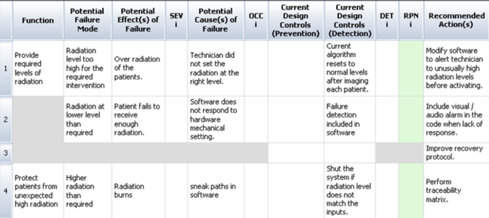
<!-- .element: class="stretch" -->

* A __forward search__ technique to identify potential hazards
* For each function, (1) enumerate possible _failure modes_ (2) possible safety impact (_effects_) and (3) mitigation strategies.
* Widely used in aeronautics, automotive, healthcare, food services,
  semiconductor processing, and (to some extent) software


----
## HAZOP Example: Emergency Braking (EB)


* Specification: EB must apply a maximum braking
command to the engine.
  * __NO OR NOT__: EB does not generate any braking command.
  * __LESS__: EB applies less than max. braking.
  * __LATE__: EB applies max. braking but after a delay of 2
  seconds.
  * __REVERSE__: EB generates an acceleration command instead of braking.
  * __BEFORE__: EB applies max. braking before a possible crash is detected.


   
----
## Robustness in a Safety Setting

* Does the model reliably detect stop signs?
* Also in poor lighting? In fog? With a tilted camera? Sensor noise?
* With stickers taped to the sign? (adversarial attacks)


<!-- references -->

Image: David Silver. [Adversarial Traffic Signs](https://medium.com/self-driving-cars/adversarial-traffic-signs-fd16b7171906). Blog post, 2017

----
## No Model is Fully Robust

* Every useful model has at least one decision boundary (ideally at the real task decision boundary)
* Predictions near that boundary are not (and should not) be robust


----
## Task Decision Boundary vs Model Boundary

[](decisionboundary.png)
<!-- .element: class="stretch" -->

* Decision boundary: Ground truth; often unknown and not specifiable
* Model boundary: What the model learns; an approximation of decision boundary
* Often, learned & actual decision boundaries do not match!

<!-- references -->

From Goodfellow et al (2018). [Making machine learning robust against adversarial inputs](https://par.nsf.gov/servlets/purl/10111674). *Communications of the ACM*, *61*(7), 56-66. 


----
## Safety Assurance with ML Components

* Consider ML components as unreliable, at most probabilistic guarantees
* Testing, testing, testing (+ simulation)
  - Focus on data quality & robustness
* *Adopt a system-level perspective!*
* Consider safe system design with unreliable components
  - Traditional systems and safety engineering
  - Assurance cases
* Understand the problem and the hazards
  - System level, goals, hazard analysis, world vs machine
  - Specify *end-to-end system behavior* if feasible
* Recent research on adversarial learning and safety in reinforcement learning 


----
## Safety Cases

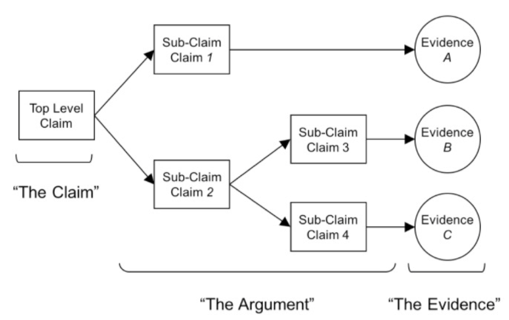
<!-- .element: class="stretch" -->

* An explicit argument that a system achieves a desired safety
requirement, along with supporting evidence
* Structure:
  * Argument: A top-level claim decomposed into multiple sub-claims
  * Evidence: Testing, software analysis, formal verification,
  inspection, expert opinions, design mechanisms...


---

# Fostering Interdisciplinary Teams

(Process and Team Reflections)

Christian Kaestner

<!-- references -->

Required reading: Nahar, Nadia, Shurui Zhou, Grace Lewis, and Christian Kästner. "[Collaboration Challenges in Building ML-Enabled Systems: Communication, Documentation, Engineering, and Process](https://arxiv.org/abs/2110.10234)." In International Conf. Software Engineering, 2022.


----

# Learning Goals

* Understand different roles in projects for AI-enabled systems
* Plan development activities in an inclusive fashion for participants in different roles
* Diagnose and address common teamwork issues
* Describe agile techniques to address common process and communication issues

----
# Case Study: Depression Prognosis on Social Media


----
<svg version="1.1" viewBox="0.0 0.0 800 400" xmlns:xlink="http://www.w3.org/1999/xlink" xmlns="http://www.w3.org/2000/svg">
        <style>
    text { font: 60px sans-serif; }
        </style>
        <circle r="180" cx="250", cy="200" fill="#b9ff00" fill-opacity="0.514" />
        <circle r="180" cx="550", cy="200" fill="#ff5500" fill-opacity="0.514" />
        <text x=230 y=160 dominant-baseline="middle" text-anchor="middle">Data</text>
        <text x=230 y=240 dominant-baseline="middle" text-anchor="middle">Scientists</text>
        <text x=570 y=160 dominant-baseline="middle" text-anchor="middle">Software</text>
        <text x=570 y=240 dominant-baseline="middle" text-anchor="middle">Engineers</text>
</svg> 

----

<!-- .element: class="stretch" -->


----
## Data Science Roles At Microsoft


* Polymath
* Data evangelist
* Data preparer
* Data shaper
* Data analyzer
* Platform builder
* 50/20% moonlighter
* Insight actors

<!-- references -->
Kim, Miryung, Thomas Zimmermann, Robert DeLine, and Andrew Begel. "[Data scientists in software teams: State of the art and challenges](https://andrewbegel.com/papers/data-scientists.pdf)." IEEE Transactions on Software Engineering 44, no. 11 (2017): 1024-1038.


----
## How to structure teams?

Mobile game; 
50ish developers;
distributed teams?

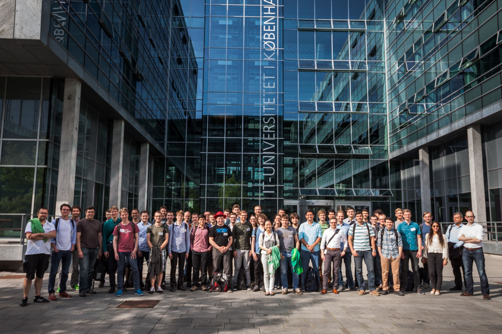

----
## Mythical Man Month

> Brooks's law: Adding manpower to a late software project makes it later


1975, describing experience at 
IBM developing OS/360

----
## Congurence


<!-- .element: class="plain" -->

Structural congruence,
Geographical congruence,
Task congruence,
IRC communication congruence

----

<!-- .element: class="stretch plain" -->


---

<!-- .element: class="plain" -->


---
# Today

<!-- colstart -->
**Looking back at the semester**

<!-- col -->

**Discussion of future of SE4AI**

<!-- col -->

**Feedback for future semesters**

<!-- colend -->


